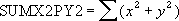

# WorksheetFunction.SumX2PY2 Method (Excel)

Returns the sum of the sum of squares of corresponding values in two arrays. The sum of the sum of squares is a common term in many statistical calculations.

## Syntax

 _Ausdruck_. **SumX2PY2**( ** _Arg1_**, ** _Arg2_** )

 _Ausdruck_ A variable that represents a **WorksheetFunction** object.

### Parameters

|**Name**|**Required/Optional**|**Data Type**|**Description**|
|:-----|:-----|:-----|:-----|
| _Arg1_|Erforderlich|**Variant**|Array_x - the first array or range of values.|
| _Arg2_|Erforderlich|**Variant**|Array_y - the second array or range of values.|

### Return Value

Double

## Remarks

- The arguments should be either numbers or names, arrays, or references that contain numbers.
    
- If an array or reference argument contains text, logical values, or empty cells, those values are ignored; however, cells with the value zero are included.
    
- If array_x and array_y have a different number of dimensions, SUMX2PY2 returns the #N/A error value.
    
- The equation for the sum of the sum of squares is:

    

## Siehe auch

#### Konzepte

[WorksheetFunction Object](7b1d5639-363d-632c-2cf0-2232562646b6.md)
#### Weitere Ressourcen

[WorksheetFunction Object Members](http://msdn.microsoft.com/library/6811ca87-4b53-0bff-88c9-30bf7497879a%28Office.15%29.aspx)