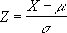

# WorksheetFunction.Standardize Method (Excel)

Returns a normalized value from a distribution characterized by mean and standard_dev.

## Syntax

 _Ausdruck_. **Standardize**( ** _Arg1_**, ** _Arg2_**, ** _Arg3_** )

 _Ausdruck_ A variable that represents a **WorksheetFunction** object.

### Parameters

|**Name**|**Required/Optional**|**Data Type**|**Description**|
|:-----|:-----|:-----|:-----|
| _Arg1_|Erforderlich|**Double**|X - the value you want to normalize.|
| _Arg2_|Erforderlich|**Double**|Mean - the arithmetic mean of the distribution.|
| _Arg3_|Erforderlich|**Double**|Standard_dev - the standard deviation of the distribution.|

### Return Value

Double

## Remarks

- If standard_dev ? 0, STANDARDIZE returns the #NUM! error value.
    
- The equation for the normalized value is:

    

## Siehe auch

#### Konzepte

[WorksheetFunction Object](7b1d5639-363d-632c-2cf0-2232562646b6.md)
#### Weitere Ressourcen

[WorksheetFunction Object Members](http://msdn.microsoft.com/library/6811ca87-4b53-0bff-88c9-30bf7497879a%28Office.15%29.aspx)