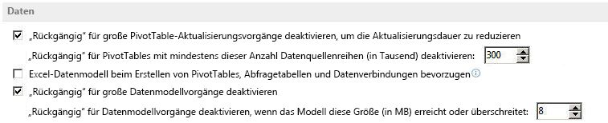

# Informationen zum PowerPivot-Modellobjekt in Excel
Erfahren Sie mehr über das PowerPivot-Add-In-Modell und sein Objektmodell in Excel.

## Informationen zum PowerPivot-Modellobjekt

Mit dem PowerPivot-Add-In können Sie Ihre eigenen Cubes visuell erstellen. Bei einem Datencube handelt es sich um ein Array von Daten, die in Dimensionen oder Ebenen definiert sind. Das  **Model**-Objekt in Excel, das vom PowerPivot-Add-In implementiert wird, liefert die Grundlage für das Laden und Kombinieren von Quelldaten aus unterschiedlichen Datenquellen für die Datenanalyse auf dem Desktop, einschließlich relationaler Datenbanken, mehrdimensionaler Quellen, Clouddiensten, Datenfeeds, Excel-Dateien, Textdateien und Daten aus dem Web. Excel integriert zusätzliche Datenquellen und ermöglicht das Kombinieren von Daten aus mehreren Datenquellen.

Das Erstellen und Löschen des PowerPivot-Modells (PPM) wird durch Benutzeraktionen ausgelöst und kann nicht direkt vom Entwickler erstellt werden.

## Definierte Beziehungen

In diesem Artikel wird auf die Verbindung zwischen zwei Tabellen verwiesen, durch die bestimmt wird, wie die Daten in Beziehung gesetzt werden sollen.

Beziehungen verknüpfen Daten aus zuvor nicht verbundenen Datenquellen. Jede Beziehung weist einen  _Primärschlüssel_ und einen _Fremdschlüssel_ auf. In Beziehungen können Daten in einem einzigen Modell vereint werden. Dadurch wird Folgendes ermöglicht:

- Filtern von Daten in einer Tabelle anhand von Daten in einer verknüpften Tabelle - Filtern von Daten anhand von verknüpften Spalten
    
- Integrieren von Spalten aus mehreren Tabellen in einer PivotTable/PivotChart
    
- Arbeitsmappen werden kleiner, da keine Daten wiederholt werden müssen
    

## Nur einzelne Modelle

Excel mit dem PowerPivot-Add-In erstellt ein einzinges Modell in der Arbeitsmappe, in das Datenquellen hinzugefügt und in dem Tabellen erstellt, geändert und verknüpft werden können. In einer Arbeitsmappe kann nur ein einziges Modell vorhanden sein.

## Arbeiten mit OLAP-Datenquellen

Wenn Sie eine Verbindung zu einer OLAP-Datenquelle, z. B. Analysis Services, herstellen und OLAP-PivotTables, PivotCharts, Datenschnitte oder Cue-Funktionen erstellen, wird kein Modell erstellt. Mit dem PowerPivot-Add-In erstellte Arbeitsmappen können in SharePoint hochgeladen und im Speicher auf dem Server geladen werden, sodass andere Arbeitsmappen darauf zugreifen können, als wären sie eine normale Instanz von SQL Server Analysis Services.

## Auslösen der Erstellung eines PowerPivot-Modells

XLSX-Dateien in Excel und Excel weisen standardmäßig erst ein darin initialisiertes PPM auf, wenn das Modell als notwendig betrachtet wird. Bestimmte Aktionen lösen die Erstellung eines PPMs aus, wenn in der Arbeitsmappe kein Modell vorhanden ist. In den folgenden Abschnitten werden die Aktionen beschrieben, die die Erstellung eines PPMs auslösen, wenn keines in der Arbeitsmappe vorhanden ist.

### Hinzufügen einer neuen Nicht-Legacy-Datenquelle

Jedes Mal, wenn Sie bestimmte Datentypen importieren, wird in der Arbeitsmappe ein neues Modell erstellt (wenn nicht bereits eines vorhanden ist), das die Verbindungseigenschaften, die Tabellendarstellung der Arbeitsmappendatenquellen sowie die Beziehungen dazwischen enthält. Dazu gehören interne Datenquellen wie Bereiche und Tabellen. In Tabelle 1 sind die unterschiedlichen Datenquellen aufgeführt, die in das PPM integriert werden können.

 **Tabelle 1. Datenquellen, die mit dem PowerPivot-Modell kompatibel sind**

|**Datenquelle**|**Beschreibung**|**Tabellenvorschau**|**Unterstützte Abfrage**|
|:-----|:-----|:-----|:-----|
|Microsoft SQL Server|Bereits in Excel unterstützt|Ja|Ja|
|Microsoft SQL Azure Data Market|Unterstützt als neue Datenfeed-Datenquelle|Ja|Nein|
|Microsoft SQL Server Parallel Data Warehouse|Über installierten OLE DB-Treiber unterstützt|Ja|Ja|
|Microsoft Access|Bereits in Excel unterstützt|Ja|Ja|
|Oracle|Bereits in Excel unterstützt|Ja|Ja|
|Teradata|Verfügbar, wenn OLE DB- oder ODBC-Treiber installiert ist|Nein|Nein|
|Sybase|Verfügbar, wenn OLE DB- oder ODBC-Treiber installiert ist|Nein|Nein|
|Informix|Verfügbar, wenn OLE DB- oder ODBC-Treiber installiert ist|Nein|Nein|
|IBM Db2|Verfügbar, wenn OLE DB- oder ODBC-Treiber installiert ist|Nein|Nein|
|Microsoft Analysis Services|Bereits in Excel unterstützt|Ja|Ja|
|Report (SSRS)|Lesen und Verwenden von Verbindungen möglich, aber keine Dokumenterstellung in Excel-Client|Ja|Nein|
|Text|Aus Excel-Dialog in Menüband-Benutzeroberfläche|Ja|Nein|
|Datenfeeds (OData)|Unterstützt als neue Datenquelle|Ja|Ja|
|XML|Bereits in Excel unterstützt|Nein|Nein|
|SharePoint-Listen|Bereits unterstützt in Excel. Excel verwendet die  **DataFeed** Anbieter zur Verbindung mit SharePoint|Nein|Nein|
|SharePoint|Neues Feature in Excel|Ja|Ja|
|Excel-Tabellen|Benutzerdefinierte Tabelle in Excel, die für die neue Datenfunktion verwendet wird. Eine Arbeitsblatt-Datenverbindung wird für die Tabelle erstellt, wenn die Tabelle erstellt wird.|n/v|n/v|
|Excel-Bereiche|Benutzerdefinierter Bereich in Excel, der für die neue Datenfunktion verwendet wird. Eine Arbeitsblatt-Datenverbindung wird in diesem Fall nur dann für den Bereich erstellt, wenn eine Datenfunktion wie ein Diagramm oder eine PivotTable den Bereich verwendet.|n/v|n/v|

### Erstellen einer neuen Nicht-OLAP-Excel-PivotTable

Neue Excel PivotTables basieren, im Gegensatz zu den mit einer OLAP-Datenquelle erstellten Tabellen auf einem PPM, wenn daher kein PPM in der Datei vorhanden ist, wird ein neues als Teil des PivotTable-Erstellungsvorgangs erstellt. Dazu gehört Folgendes:

- Verwenden der PivotTable-Benutzeroberfläche zum Einfügen
    
- Zusammenfassen von Daten mit der PivotTable-Benutzeroberfläche
    
- PivotTable basierend auf einer Nicht-OLAP-Datenquelle, die über das VBA-Objektmodell (Microsoft Visual Basic für Applikationen) erstellt wird
    

### Erstellen eines neuen Nicht-OLAP-Excel-PivotChart

In Excel müssen PivotTables und PivotCharts nicht mehr miteinander verbunden sein. Beim Einfügen eines PivotChart in eine Arbeitsmappe ohne Modell wird daher ein PPM erstellt.

### Einfügen von Nicht-OLAP-Excel-PivotTables aus einer anderen Arbeitsmappe

Beim Einfügen einer PivotTable oder eines PivotChart aus einer anderen Arbeitsmappe, die auf einem PPM basiert, in eine Arbeitsmappe, die nicht über ein PPM verfügt, wird in der Zielarbeitsmappe ein neues PPM erstellt. Dem neu erstellten Modell wir eine neue Datenquelle hinzugefügt, die auf die zugrunde liegenden Daten der/des ursprünglichen PivotTable/PivotChart zeigt.

## Rückgängigmachen der Erstellung eines PowerPivot-Modells

Alle Aktionen, die zur Erstellung eines PPMs führen, können rückgängig gemacht werden. Wenn diese Aktionen aus dem Menü zum Rückgängigmachen ausgewählt werden, wird die tatsächliche Modellerstellung nicht rückgängig gemacht, aber dem Modell wird nichts hinzugefügt. Deshalb bleibt es leer. Wenn die Arbeitsmappe gespeichert wird, wenn das Modell leer ist, wird das Modell nicht mit der Datei gespeichert. Es gibt keine explizite Möglichkeit, wie Sie ein in der Arbeitsmappe erstelltes Modell löschen können.

 **Hinweis**  Ähnlich wie das Verhalten in Excel 2010 gibt es eine Einschränkung dahingehend, welche Modellgrößen rückgängig gemacht werden können. Wenn ein Modell diese maximale Größe erreicht, werden keine Funktionen zum Rückgängigmachen mehr für Aktionen, wie z. B. Aktualisieren, bereitgestellt. Die aktuelle Grenze für systemeigene PivotTables beträgt 300.000 Zeilen. Bei 28 Byte pro Zelle entspricht diese Grenze etwa 8 MB im Speicher. Diese Werte können mithilfe der  **Erweiterten Optionen** in Excel, wie in Abbildung 1 dargestellt, festgelegt werden.

**Abbildung 1. Festlegen der Größe für Vorgänge zum Rückgängigmachen für große Datenmodelle**

## Das Objektmodell des PowerPivot-Modells

Eine Arbeitsmappe kann nur über ein  **Model**-Objekt verfügen. Das  **Model**-Objekt stellt das oberste Objekt dar, das alle Verbindungen, Beziehungen und Tabellen enthält.

Sie können nicht manuell ein Modell in einer Arbeitsmappe erstellen; die Erstellung von Modellen wird durch die in einem früheren Abschnitt dieses Artikels beschriebenen Aktionen ausgelöst. Wenn eine dieser Aktionen über das Objektmodell (OM) ausgeführt werden, wird ein neues Modell erstellt. Der Zweck dieses Objektmodells besteht in der programmgesteuerten Erstellung von Beziehungen zwischen Modelltabellen, die in verknüpften Tabellen resultieren und PivotTables kombinieren usw. Damit Sie dies tun können, müssen Sie in der Lage sein, das Modell zu durchsuchen, um die entsprechenden Tabellen und innerhalb der Tabellen die entsprechenden Spalten zu suchen, die zum Erstellen der Beziehung verwendet werden.

### Model-Objekt

Das  **Model**-Objekt speichert Verweise auf Arbeitsmappenverbindungen und Informationen zu den Tabellen und Beziehungen innerhalb des PPM. In Tabelle 2 sind die Eigenschaften des  **Model**-Objekts aufgeführt.

 **Tabelle 2. Eigenschaften des Model-Objekts**

|**Eigenschaft**|**Lesen/Schreiben**|**Typ**|**Beschreibung**|
|:-----|:-----|:-----|:-----|
|**Application**|Schreibgeschützt|**Application**|Gibt ein Objekt zurück, das die Anwendung "Microsoft Excel" darstellt.|
|**Creator**|Schreibgeschützt|**xlCreator**|Gibt eine 32-Bit-Ganzzahl zurück, die die Anwendung angibt, in der das angegebene Objekt erstellt wurde.|
|**Parent**|Schreibgeschützt|**Object**|Gibt ein  **Object** zurück, das das übergeordnete Objekt des angegebenen **Model**-Objekts darstellt.|
|**ModelTables**|Schreibgeschützt|**ModelTable**|Auflistung von Tabellen innerhalb des PPMs|
|**ModelRelationships**|Schreibgeschützt|**ModelRelationships**|Auflistung von Beziehungen zwischen PPM-Tabellen.|
|**DataModelConnection**|n/v|**WorkbookConnection**|Gibt das Arbeitsmappenverbindungsobjekt des Modells aus der Auflistung von Arbeitsmappenverbindungen zurück, das eine Verbindung zu dem Modell herstellt.|
 **Model.AddConnection**-Methode

Fügt eine neue Arbeitsmappenverbindung zu dem Modell mit denselben Eigenschaften wie die als Argument angegebene hinzu. Diese Methode funktioniert nur für externe Nicht-Modell-Verbindungen und gibt einen einen Fehler zurück, wenn sie mit einer externen Modellverbindung als Argument aufgerufen wird. Beim Aufrufen dieser Methode wird eine neue Modellverbindung erstellt und genauso benannt wie die Legacyverbindung mit einer Ganzzahl am Ende, damit der Name eindeutig ist. In Tabelle 3 sind die Parameter der  **AddConnection**-Methode aufgeführt.

 **Tabelle 3. Parameter der Model.AddConnection-Methode**

|**Name**|**Erforderlich/Optional**|**Typ**|**Beschreibung**|
|:-----|:-----|:-----|:-----|
| _ConnectionToDataSource_|Erforderlich|**WorkbookConnection**|Die Arbeitsmappenverbindung|
 **Model.CreateModelWorkbookConnection**-Methode

Durch Aufrufen dieser Methode wird ein  **WorkbookConnection**-Objekt vom Typ  **ModelConnection** zurückgegeben. Eine mit der angegebenen Tabelle verbundene Modellverbindung wird zurückgegeben. Diese Art von Verbindung kann nur von Abfragetabellen in Excel verwendet werden. In Tabelle 4 sind die Parameter der **CreateModelWorkbookConnection**-Methode aufgeführt.

 **Tabelle 4. Parameter der Model.CreateModelWorkbookConnection-Methode**

|**Name**|**Erforderlich/Optional**|**Typ**|**Beschreibung**|
|:-----|:-----|:-----|:-----|
| _ModelTable_|Erforderlich|**Variant**|Entweder ein Modelltabellenname oder ein Modelltabellenobjekt.|
 **Model.Initialize**-Methode

Die  **Initialize**-Methode des  **Model**-Objekts weist keine Parameter auf. Initialisiert das PPM. Dies wird standardmäßig bei der ersten Verwendung des Modells aufgerufen.

 **Model.Refresh**-Methode

Die  **Refresh**-Methode des  **Model**-Objekts weist keine Parameter auf. Aktualisieren Sie alle mit dem Modell verbundenen Datenquellen, verarbeiten Sie das Modell vollständig neu, und aktualisieren Sie alle Excel-Datenfunktionen im Zusammenhang mit dem  **Model**-Objekt.

### ModelChanges-Objekt

Stellt Änderungen an dem PPM dar. Das  **ModelChanges**-Objekt enthält Informationen dazu, welche Änderungen an dem Datenmodell vorgenommen wurden, wenn das  **Workbook.ModelChange**-Ereignis nach einem Modellvorgang auftritt. Wenn Excel Änderungen an dem Datenmodell vornimmt, können mehrere Änderungen in derselben Operation vorgenommen werden, und das  **ModelChanges**-Objekt enthält Informationen zu allen Änderungen, die in einem Modellvorgang vorgenommen wurden. In Tabelle 5 sind die Eigenschaften des  **ModelChanges**-Objekts aufgeführt.

 **Tabelle 5. Eigenschaften des ModelChanges-Objekts**

|**Eigenschaft**|**Lesen/Schreiben**|**Typ**|**Beschreibung**|
|:-----|:-----|:-----|:-----|
|**Application**|Schreibgeschützt|**Application**|Gibt ein Objekt zurück, das die Anwendung "Microsoft Excel" darstellt.|
|**ColumnsAdded**|Schreibgeschützt|**ModelColumnNames**|Gibt eine  **ModelColumnNames**-Auflistung von  **ModelColumnName**-Objekten zurück, die alle Spalten darstellt, die als Teil eines Modellvorgangs hinzugefügt wurden.|
|**ColumnsChanged**|Schreibgeschützt|**ModelColumnChanges**|Gibt eine  **ModelColumnChanges**-Auflistung von  **ModelColumnChange**-Objekten zurück, die Tabellennamen aller Tabellenspalten darstellen, für die der Datentyp als Teil eines Modellvorgangs geändert wurde.|
|**ColumnsDeleted**|Schreibgeschützt|**ModelColumnNames**|Gibt eine  **ModelColumnNames**-Auflistung von  **ModelColumnName**-Objekten zurück, die alle Spalten darstellen, die als Teil eines Modellvorgangs gelöscht wurden.|
|**Creator**|Schreibgeschützt|**xlCreator**|Gibt eine 32-Bit-Ganzzahl zurück, die die Anwendung angibt, in der das angegebene Objekt erstellt wurde.|
|**MeasuresAdded**|Schreibgeschützt|**ModelMeasureNames**|Gibt eine  **ModelMeasureNames**-Auflistung von  **ModelMeasureName**-Objekten zurück, die alle Measures darstellen, die als Teil eines Modellvorgangs hinzugefügt wurden.|
|**Parent**|Schreibgeschützt|**Object**|Gibt ein  **Object** zurück, das das übergeordnete Objekt des angegebenen **ModelChanges**-Objekts darstellt.|
|**RelationshipChange**|Schreibgeschützt|**Boolean**|Wenn  **True**, wurden eine oder mehrere Beziehungen in dem Modell als Teil eines Modellvorgangs geändert (hinzugefügt, gelöscht oder geändert) Wenn  **False**, so wurden während des Vorgangs keine Beziehungen geändert.|
|**TableNamesChanged**|Schreibgeschützt|**ModelTableNameChanges**|Gibt eine  **ModelTableNameChanges**-Auflistung von  **ModelTableNameChange**-Objekten zurück, die alte und neuen Namen aller Tabellen darstellt, die in dem Modell als Teil eines Modellvorgangs umbenannt wurden.|
|**TablesAdded**|Schreibgeschützt|**ModelTableNames**|Gibt eine  **ModelTableNames**-Auflistung von Tabellennamen als Zeichenfolgen zurück, die alle Tabellen darstellen, die zu dem Modell als Teil eines Modellvorgangs hinzugefügt wurden.|
|**TablesDeleted**|Schreibgeschützt|**ModelTableNames**|Gibt eine  **ModelTableNames**-Auflistung von Tabellennamen als Zeichenfolgen zurück, die alle Tabellen darstellen, die aus dem Modell als Teil eines Modellvorgangs gelöscht wurden.|
|**TablesModified**|Schreibgeschützt|**ModelTableNames**|Gibt eine  **ModelTableNames**-Auflistung von Tabellennamen als Zeichenfolgen zurück, die alle Tabellen darstellen, die als Teil eines Modellvorgangs aktualisiert oder neu berechnet wurden.|
|**UnknownChange**|Schreibgeschützt|**Boolean**|**True**, wenn eine nicht angegebene Änderung an dem Modell als Teil einer Modelltransaktion vorgenommen wurde.|

### ModelColumnChanges-Auflistung

Eine Auflistung von  **ModelColumnChange**-Objekten, die Spalten darstellen, deren Datentyp im PPM geändert wurde. In Tabelle 6 sind die Eigenschaften der  **ModelColumnChanges**-Auflistung aufgeführt.

 **Tabelle 6. Eigenschaften der ModelColumnChanges-Auflistung**

|**Eigenschaft**|**Lesen/Schreiben**|**Typ**|**Beschreibung**|
|:-----|:-----|:-----|:-----|
|**Application**|Schreibgeschützt|**Application**|Gibt ein Objekt zurück, das die Anwendung "Microsoft Excel" darstellt.|
|**Count**|Schreibgeschützt|**Long**|Gibt die Anzahl von  **ModelColumnChange**-Objekten in der Auflistung zurück.|
|**Creator**|Schreibgeschützt|**xlCreator**|Gibt eine 32-Bit-Ganzzahl zurück, die die Anwendung angibt, in der das angegebene Objekt erstellt wurde.|
|**Parent**|Schreibgeschützt|**Object**|Gibt ein  **Object** zurück, das das übergeordnete Objekt des angegebenen **ModelColumnChanges**-Objekts darstellt.|
 **ModelColumnChanges.Item**-Methode

Gibt ein einzelnes Objekt aus der  **ModelColumnChanges**-Auflistung zurück. In Tabelle 7 sind die Parameter der  **Item**-Methode aufgeführt.

 **Tabelle 7. Parameter der ModelColumnChanges.Item-Methode**

|**Name**|**Erforderlich/Optional**|**Typ**|**Beschreibung**|
|:-----|:-----|:-----|:-----|
| _Index_|Erforderlich|**Variant**|Die Indexnummer oder der Name des Objekts.|

### ModelColumnChange-Objekt

Ein Objekt, das eine Spalte in einer Tabelle im PPM darstellt, deren Datentyp geändert wurde. In Tabelle 8 sind die Eigenschaften des  **ModelColumnChange**-Objekts aufgeführt.

 **Tabelle 8. Eigenschaften des ModelColumnChange-Objekts**

|**Eigenschaft**|**Lesen/Schreiben**|**Typ**|**Beschreibung**|
|:-----|:-----|:-----|:-----|
|**Application**|Schreibgeschützt|**Application**|Gibt ein Objekt zurück, das die Anwendung "Microsoft Excel" darstellt.|
|**ColumnName**|Schreibgeschützt|**String**|**String**, die den Namen einer Spalte darstellt, deren Datentyp geändert wurde.|
|**Creator**|Schreibgeschützt|**xlCreator**|Gibt eine 32-Bit-Ganzzahl zurück, die die Anwendung angibt, in der das angegebene Objekt erstellt wurde.|
|**Parent**|Schreibgeschützt|**Object**|Gibt ein  **Object** zurück, das das übergeordnete Objekt des angegebenen **ModelColumnChange**-Objekts darstellt.|
|**TableName**|Schreibgeschützt|**String**|**String**, die den Namen einer Tabelle im PPM darstellen, für die der Datentyp einer Spalte geändert wurde.|

### ModelColumnNames-Auflistung

Eine Auflistung von  **ModelColumnName**-Objekten, die Spalten von Tabellen im PPM darstellen. In Tabelle 9 sind die Eigenschaften der  **ModelColumnNames**-Auflistung aufgeführt.

 **Tabelle 9. Eigenschaften der ModelColumnNames-Auflistung**

|**Eigenschaft**|**Lesen/Schreiben**|**Typ**|**Beschreibung**|
|:-----|:-----|:-----|:-----|
|**Application**|Schreibgeschützt|**Application**|Gibt ein Objekt zurück, das die Anwendung "Microsoft Excel" darstellt.|
|**Count**|Schreibgeschützt|**Long**|Gibt die Anzahl von  **ModelColumnName**-Objekten in der Auflistung zurück.|
|**Creator**|Schreibgeschützt|**xlCreator**|Gibt eine 32-Bit-Ganzzahl zurück, die die Anwendung angibt, in der das angegebene Objekt erstellt wurde.|
|**Parent**|Schreibgeschützt|**Object**|Gibt ein  **Object** zurück, das das übergeordnete Objekt der angegebenen **ModelColumnNames**-Auflistung darstellt.|
 **ModelColumnNames.Item**-Methode

Gibt ein einzelnes Objekt aus der  **ModelColumnNames**-Auflistung zurück. In Tabelle 10 sind die Parameter der  **Item**-Methode aufgeführt.

 **Tabelle 10. Parameter der ModelColumnNames.Item-Methode**

|**Name**|**Erforderlich/Optional**|**Typ**|**Beschreibung**|
|:-----|:-----|:-----|:-----|
| _Index_|Erforderlich|**Variant**|Die Indexnummer oder der Name des Objekts.|

### ModelColumnName-Objekt

Ein Objekt, das den Namen einer Spalte im PPM darstellt. In Tabelle 11 sind die Eigenschaften des  **ModelColumnName**-Objekts aufgeführt.

 **Tabelle 11. Eigenschaften des ModelColumnName-Objekts**

|**Eigenschaft**|**Lesen/Schreiben**|**Typ**|**Beschreibung**|
|:-----|:-----|:-----|:-----|
|**Application**|Schreibgeschützt|**Application**|Gibt ein Objekt zurück, das die Anwendung "Microsoft Excel" darstellt.|
|**ColumnName**|Schreibgeschützt|**String**|**String**, die den Namen einer Spalte der von der  **TableName**-Eigenschaft identifizierten Tabelle darstellt.|
|**Creator**|Schreibgeschützt|**xlCreator**|Gibt eine 32-Bit-Ganzzahl zurück, die die Anwendung angibt, in der das angegebene Objekt erstellt wurde.|
|**Parent**|Schreibgeschützt|**Object**|Gibt ein  **Object** zurück, das das übergeordnete Objekt des angegebenen **ModelColumnName**-Objekts darstellt.|
|**TableName**|Schreibgeschützt|**String**|**String**, die den Namen einer Tabelle im PPM darstellt.|

### ModelConnection-Objekt

Das  **ModelConnection**-Objekt enthält Informationen für den neuen Modellverbindungstyp, der in Excel für die Interaktion mit dem integrierten PPM eingeführt wurde. In Tabelle 12 sind die Eigenschaften des  **ModelConnection**-Objekts aufgeführt.

 **Tabelle 12. Eigenschaften des ModelConnection-Objekts**

|**Eigenschaft**|**Lesen/Schreiben**|**Typ**|**Beschreibung**|
|:-----|:-----|:-----|:-----|
|**ADOConnection**|Schreibgeschützt|**ADOConnection**|Wird zum Erstellen einer offenen Verbindung mit einer Datenquelle verwendet. Ermöglicht, dass Add-Ins, z. B. der PowerViewer, eine direkte Verbindung zu dem Modul und damit zum Datenmodell herstellen können.|
|**Application**|Schreibgeschützt|**Application**|Gibt ein Objekt zurück, das die Anwendung "Microsoft Excel" darstellt.|
|**CommandText**|Lesen/Schreiben|**Variant**|Gibt die Befehlszeichenfolge für die angegebene Datenquelle (Tabelle) zurück oder legt diese fest.|
|**CommandType**|Lesen/Schreiben|**xlCmdType**|Gibt eine der  **xlCmdType**-Konstanten zurück, die den Befehlstyp angeben, oder legt diese fest.|
|**Creator**|Schreibgeschützt|**xlCreator**|Gibt eine 32-Bit-Ganzzahl zurück, die die Anwendung angibt, in der das angegebene Objekt erstellt wurde.|
|**Parent**|Schreibgeschützt|**Object**|Gibt ein  **Object** zurück, das das übergeordnete Objekt des angegebenen **ModelConnection**-Objekts darstellt.|

### ModelMeasureNames-Auflistung

Die  **ModelMeasureNames**-Auflistung enthält eine Auflistung von  **ModelMeasureName**-Objekten im PPM. In Tabelle 13 sind die Eigenschaften der  **ModelMeasureNames**-Auflistung aufgeführt.

 **Tabelle 13. Eigenschaften der ModelMeasureNames-Auflistung**

|**Eigenschaft**|**Lesen/Schreiben**|**Typ**|**Beschreibung**|
|:-----|:-----|:-----|:-----|
|**Application**|Schreibgeschützt|**Application**|Gibt ein Objekt zurück, das die Anwendung "Microsoft Excel" darstellt.|
|**Count**|Schreibgeschützt|**Long**|Gibt die Anzahl von  **ModelMeasureName**-Objekten in der Auflistung zurück.|
|**Creator**|Schreibgeschützt|**xlCreator**|Gibt eine 32-Bit-Ganzzahl zurück, die die Anwendung angibt, in der das angegebene Objekt erstellt wurde.|
|**Parent**|Schreibgeschützt|**Object**|Gibt ein  **Object** zurück, das das übergeordnete Objekt der angegebenen **ModelMeasureNames**-Auflistung darstellt.|
 **ModelMeasureNames.Item**-Methode

Gibt ein einzelnes Objekt aus der  **ModelMeasureNames**-Auflistung zurück. In Tabelle 14 sind die Parameter der  **Item**-Methode aufgeführt.

 **Tabelle 14. Parameter der ModelMeasureNames-Methode**

|**Name**|**Erforderlich/Optional**|**Typ**|**Beschreibung**|
|:-----|:-----|:-----|:-----|
| _Index_|Erforderlich|**Variant**|Die Indexnummer oder der Name des Objekts.|

### ModelMeasureName-Objekt

Ein Objekt, das den Namen eines Measures im PPM darstellt. In Tabelle 15 sind die Eigenschaften des  **ModelMeasureName**-Objekts aufgeführt.

 **Tabelle 15. Eigenschaften des ModelMeasureName-Objekts**

|**Eigenschaft**|**Lesen/Schreiben**|**Typ**|**Beschreibung**|
|:-----|:-----|:-----|:-----|
|**Application**|Schreibgeschützt|**Application**|Gibt ein Objekt zurück, das die Anwendung "Microsoft Excel" darstellt.|
|**MeasureName**|Schreibgeschützt|**String**|**String**, die den neuen Namen eines Measures darstellt, das dem  **ModelTable**-Objekt hinzugefügt wurde, das von der  **TableName**-Eigenschaft identifiziert wird.|
|**Creator**|Schreibgeschützt|**xlCreator**|Gibt eine 32-Bit-Ganzzahl zurück, die die Anwendung angibt, in der das angegebene Objekt erstellt wurde.|
|**Parent**|Schreibgeschützt|**Object**|Gibt ein  **Object** zurück, das das übergeordnete Objekt des angegebenen **ModelMeasureName**-Objekts darstellt.|
|**TableName**|Schreibgeschützt|**String**|**String**, die den Namen einer Tabelle im PPM darstellt.|

### ModelRelationships-Auflistung

Die  **ModelRelationships**-Auflistung enthält eine Auflistung von  **ModelRelationship**-Objekten im PPM. In Tabelle 16 sind die Eigenschaften der  **ModelRelationships** -Auflistung aufgeführt.

 **Tabelle 16. Eigenschaften der ModelRelationships-Auflistung**

|**Eigenschaft**|**Lesen/Schreiben**|**Typ**|**Beschreibung**|
|:-----|:-----|:-----|:-----|
|**Application**|Schreibgeschützt|**Application**|Gibt ein Objekt zurück, das die Anwendung "Microsoft Excel" darstellt.|
|**Count**|Schreibgeschützt|**Long**|Gibt die Anzahl von  **ModelRelationship**-Objekten in der Auflistung zurück.|
|**Creator**|Schreibgeschützt|**xlCreator**|Gibt eine 32-Bit-Ganzzahl zurück, die die Anwendung angibt, in der das angegebene Objekt erstellt wurde.|
|**Parent**|Schreibgeschützt|**Object**|Gibt ein  **Object** zurück, das das übergeordnete Objekt der angegebenen **ModelRelationships**-Auflistung darstellt.|
 **ModelRelationships.Add**-Methode

Fügt eine Beziehung zur  **ModelRelationships**-Auflistung hinzu. In Tabelle 17 sind die Parameter der  **Add**-Methode aufgeführt.

 **Tabelle 17. Parameter der ModelRelationships.Add-Methode**

|**Name**|**Erforderlich/Optional**|**Typ**|**Beschreibung**|
|:-----|:-----|:-----|:-----|
| _ForeignKeyColumn_|Erforderlich|**ModelTableColumn**|Ein  **ModelTableColumn**-Objekt, das die Fremdschlüsselspalte in der Tabelle auf der n-Seite der 1:n-Beziehung darstellt.|
| _PrimaryKeyColumn_|Erforderlich|**ModelTableColumn**|Ein  **ModelTableColumn**-Objekt, das die Primärschlüsselspalte in der Tabelle auf der 1-Seite der 1:n-Beziehung darstellt.|
 **ModelRelationships.Item**-Methode

Gibt ein einzelnes Objekt aus der  **ModelRelationships**-Auflistung zurück. In Tabelle 18 sind die Parameter der  **Item**-Methode aufgeführt.

 **Tabelle 18. Parameter der ModelRelationships.Item-Methode**

|**Name**|**Erforderlich/Optional**|**Typ**|**Beschreibung**|
|:-----|:-----|:-----|:-----|
| _Index_|Erforderlich|**Variant**|Die Indexnummer oder der Name des Objekts.|

### ModelRelationship-Objekt

Stellt eine Beziehung zwischen  **ModelTableColumn**-Objekten dar. Wird beim programmgesteuerten Erstellen von Beziehungen verwendet. In Tabelle 19 sind die Eigenschaften des  **ModelRelationship**-Objekts aufgeführt.

 **Tabelle 19. Eigenschaften des ModelRelationship-Objekts**

|**Eigenschaft**|**Lesen/Schreiben**|**Typ**|**Beschreibung**|
|:-----|:-----|:-----|:-----|
|**Active**|Lesen/Schreiben|**Boolean**|Bei  **True** ist die Beziehung aktiv.|
|**Application**|Schreibgeschützt|**Application**|Gibt ein Objekt zurück, das die Anwendung "Microsoft Excel" darstellt.|
|**Creator**|Schreibgeschützt|**xlCreator**|Gibt eine 32-Bit-Ganzzahl zurück, die die Anwendung angibt, in der das angegebene Objekt erstellt wurde.|
|**ForeignKeyColumn**|Schreibgeschützt|**ModelTableColumn**|Enthält das  **ModelTableColumn**-Objekt, das die Fremdschlüsselspalte auf der n-Seite der 1:n-Beziehung darstellt.|
|**ForeignKeyTable**|Schreibgeschützt|**ModelTable**|Enthält das  **ModelTable**-Objekt, das die Tabelle auf der n-Seite der 1:n-Beziehung darstellt.|
|**Parent**|Schreibgeschützt|**Object**|Gibt ein  **Object**-Modellobjekt zurück, das das Modell darstellt, in dem sich das  **ModelRelationship**-Objekt befindet.|
|**PrimaryKeyColumn**|Schreibgeschützt|**ModelTableColumn**|Enthält das  **ModelTableColumn**-Objekt, das die Primärschlüsselspalte in der Tabelle auf der 1-Seite der 1:n-Beziehung darstellt.|
|**PrimaryKeyTable**|Schreibgeschützt|**ModelTable**|Enthält das  **ModelTable**-Objekt, das die Tabelle auf der 1-Seite der 1:n-Beziehung darstellt.|
 **ModelRelationship.Delete**-Methode

Die  **Delete**-Methode des  **ModelRelationship**-Objekts weist keine Parameter auf. Löscht eine Beziehung.

### ModelTables-Auflistung

Die  **ModelTables**-Auflistung enthält eine Auflistung von  **ModelTable**-Objekten im PPM. In Tabelle 20 sind die Eigenschaften der  **ModelTables**-Auflistung aufgeführt.

 **Tabelle 20. Eigenschaften der ModelTables-Auflistung**

|**Eigenschaft**|**Lesen/Schreiben**|**Typ**|**Beschreibung**|
|:-----|:-----|:-----|:-----|
|**Application**|Schreibgeschützt|**Application**|Gibt ein Objekt zurück, das die Anwendung "Microsoft Excel" darstellt.|
|**Count**|Schreibgeschützt|**Long**|Gibt die Anzahl von  **ModelTable**-Objekten in der Auflistung zurück.|
|**Creator**|Schreibgeschützt|**xlCreator**|Gibt eine 32-Bit-Ganzzahl zurück, die die Anwendung angibt, in der das angegebene Objekt erstellt wurde.|
|**Parent**|Schreibgeschützt|**Object**|Gibt ein  **Object** zurück, das das übergeordnete Objekt der angegebenen **ModelTables**-Auflistung darstellt.|
 **ModelTables.Item**-Methode

Gibt ein einzelnes Objekt aus der  **ModelTables**-Auflistung zurück. In Tabelle 21 sind die Parameter der Item-Methode aufgeführt.

 **Tabelle 21. Parameter der ModelTableColumns.Item-Methode**

|**Name**|**Erforderlich/Optional**|**Typ**|**Beschreibung**|
|:-----|:-----|:-----|:-----|
| _Index_|Erforderlich|**Variant**|Die Indexnummer oder der Name des Objekts.|

### ModelTable-Objekt

Stelllt eine Tabelle im  **Model**-Objekt dar. Das  **ModelTable**-Objekt ist schreibgeschützt, was bedeutet, dass es nicht über das Objektmodell erstellt oder bearbeitet werden kann. Es gibt ein  **ModelTable**-Objekt für jede Tabelle im Modell. In Tabelle 22 sind die Eigenschaften des  **ModelTable**-Objekts aufgeführt.

 **Tabelle 22. Eigenschaften des ModelTable-Objekts**

|**Eigenschaft**|**Lesen/Schreiben**|**Typ**|**Beschreibung**|
|:-----|:-----|:-----|:-----|
|**Application**|Schreibgeschützt|**Application**|Gibt ein Objekt zurück, das die Anwendung "Microsoft Excel" darstellt.|
|**Creator**|Schreibgeschützt|**xlCreator**|Gibt eine 32-Bit-Ganzzahl zurück, die die Anwendung angibt, in der das angegebene Objekt erstellt wurde.|
|**ModelTableColumns**|Schreibgeschützt|**ModelTableColumns**|Auflistung von  **ModelTableColumn**-Objekten, aus denen das  **ModelTable**-Objekt besteht.|
|**Name**|Schreibgeschützt|**String**|Gibt den Namen des  **ModelTable**-Objekts zurück.|
|**Parent**|Schreibgeschützt|**Object**|Gibt ein  **Object** zurück, das das Modell darstellt, in dem sich das **ModelTable**-Objekt befindet.|
|**RecordCount**|Schreibgeschützt|**Integer**|Gibt die Gesamtzeilenanzahl für das  **ModelTable**-Objekt zurück.|
|**SourceName**|Schreibgeschützt|**String**|Name der Tabelle an der Datenquelle. Wenn die Tabelle keine Datenquelle hat (im Modell erstellt), gibt die Eigenschaft einen Fehler zurück.|
|**SourceWorkbookConnection**|Schreibgeschützt|**WorkbookConnection**|Gibt die Arbeitsmappenverbindung zurück, von der das  **ModelTable**-Objekt stammt.|
 **ModelTable.Refresh**-Methode

Die  **Refresh**-Methode des  **ModelTable**-Objekts weist keine Parameter auf. Aktualisiert die Modelltabellen-Quellverbindungen.

### ModelTableColumns-Auflistung

Die  **ModelTableColumns**-Auflistung enthält eine Auflistung von  **ModelTableColumn**-Objekten im PPM. In Tabelle 23 sind die Eigenschaften der  **ModelTableColumns**-Auflistung aufgeführt.

 **Tabelle 23. Eigenschaften der ModelTableColumns-Auflistung**

|**Eigenschaft**|**Lesen/Schreiben**|**Typ**|**Beschreibung**|
|:-----|:-----|:-----|:-----|
|**Application**|Schreibgeschützt|**Application**|Gibt ein Objekt zurück, das die Anwendung "Microsoft Excel" darstellt.|
|**Count**|Schreibgeschützt|**Long**|Gibt die Anzahl von  **ModelTableColumn**-Objekten in der Auflistung zurück.|
|**Creator**|Schreibgeschützt|**xlCreator**|Gibt eine 32-Bit-Ganzzahl zurück, die die Anwendung angibt, in der das angegebene Objekt erstellt wurde.|
|**Parent**|Schreibgeschützt|**Object**|Gibt ein  **Object** zurück, das das übergeordnete Objekt der angegebenen **ModelTableColumns**-Auflistung darstellt.|
 **ModelTableColumns.Item** Method

Gibt ein einzelnes Objekt aus der  **ModelTableColumns**-Auflistung zurück. In Tabelle 24 sind die Parameter der  **Item**-Methode aufgeführt.

 **Tabelle 24. Parameter der ModelTableColumns.Item-Methode**

|**Name**|**Erforderlich/Optional**|**Typ**|**Beschreibung**|
|:-----|:-----|:-----|:-----|
| _Index_|Erforderlich|**Variant**|Die Indexnummer oder der Name des Objekts.|

### ModelTableColumn-Objekt

Stellt eine einzelne Spalte im  **ModelTable**-Objekten dar. Wird beim programmgesteuerten Erstellen von Beziehungen verwendet. In Tabelle 25 sind die Eigenschaften des  **ModelTableColumn**-Objekts aufgeführt.

 **Tabelle 25. Eigenschaften des ModelTableColumn-Objekts**

|**Eigenschaft**|**Lesen/Schreiben**|**Typ**|**Beschreibung**|
|:-----|:-----|:-----|:-----|
|**Application**|Schreibgeschützt|**Application**|Gibt ein Objekt zurück, das die Anwendung "Microsoft Excel" darstellt.|
|**Creator**|Schreibgeschützt|**xlCreator**|Gibt eine 32-Bit-Ganzzahl zurück, die die Anwendung angibt, in der das angegebene Objekt erstellt wurde.|
|**DataType**|Schreibgeschützt|**XlParameterDataType**|Gibt den Datentyp der Spalte zurück.|
|**Name**|Schreibgeschützt|**String**|Gibt den Namen des  **ModelTableColumn**-Objekts zurück.|
|**Parent**|Schreibgeschützt|**Object**|Gibt ein  **Object** zurück, das das übergeordnete Objekt des angegebenen **ModelTableColumn**-Objekts darstellt.|

### ModelTableNames-Auflistung

Die  **ModelTableNames**-Auflistung enthält eine Auflistung von  **ModelTableName**-Objekten im PPM. In Tabelle 26 sind die Eigenschaften der  **ModelTableNames**-Auflistung aufgeführt.

 **Tabelle 26. Eigenschaften der ModelTables-Auflistung**

|**Eigenschaft**|**Lesen/Schreiben**|**Typ**|**Beschreibung**|
|:-----|:-----|:-----|:-----|
|**Application**|Schreibgeschützt|**Application**|Gibt ein Objekt zurück, das die Anwendung "Microsoft Excel" darstellt.|
|**Count**|Schreibgeschützt|**Long**|Gibt die Anzahl von  **ModelTableName**-Objekten in der Auflistung zurück.|
|**Creator**|Schreibgeschützt|**xlCreator**|Gibt eine 32-Bit-Ganzzahl zurück, die die Anwendung angibt, in der das angegebene Objekt erstellt wurde.|
|**Parent**|Schreibgeschützt|**Object**|Gibt ein  **Object** zurück, das das übergeordnete Objekt des angegebenen **ModelTableNames**-Objekts darstellt.|
 **ModelTableNames.Item**-Methode

Gibt ein einzelnes Objekt aus der  **ModelTableNames**-Auflistung zurück. In Tabelle 27 sind die Parameter der  **Item**-Methode aufgeführt.

 **Tabelle 27. Parameter der ModelTableNames.Item-Methode**

|**Name**|**Erforderlich/Optional**|**Typ**|**Beschreibung**|
|:-----|:-----|:-----|:-----|
| _Index_|Erforderlich|**Variant**|Die Indexnummer oder der Name des Objekts.|

### ModelTableNameChanges-Auflistung

Die  **ModelTableNameChanges**-Auflistung enthält eine Auflistung von  **ModelTableNameChange**-Objekten im PPM. In Tabelle 28 sind die Eigenschaften der  **ModelTableNameChanges**-Auflistung aufgeführt.

 **Tabelle 28. Eigenschaften der ModelTableNameChanges-Auflistung**

|**Eigenschaft**|**Lesen/Schreiben**|**Typ**|**Beschreibung**|
|:-----|:-----|:-----|:-----|
|**Application**|Schreibgeschützt|**Application**|Gibt ein Objekt zurück, das die Anwendung "Microsoft Excel" darstellt.|
|**Count**|Schreibgeschützt|**Long**|Gibt die Anzahl von  **ModelTableNameChange**-Objekten in der Auflistung zurück.|
|**Creator**|Schreibgeschützt|**xlCreator**|Gibt eine 32-Bit-Ganzzahl zurück, die die Anwendung angibt, in der das angegebene Objekt erstellt wurde.|
|**Parent**|Schreibgeschützt|**Object**|Gibt ein  **Object** zurück, das das übergeordnete Objekt der angegebenen **ModelTableNameChanges**-Auflistung darstellt.|
 **ModelTableNameChanges.Item**-Methode

Gibt ein einzelnes Objekt aus der  **ModelTableNameChanges**-Auflistung zurück. In Tabelle 29 sind die Parameter der  **Item**-Methode aufgeführt.

 **Tabelle 29. Parameter der ModelTableChanges.Item-Methode**

|**Name**|**Erforderlich/Optional**|**Typ**|**Beschreibung**|
|:-----|:-----|:-----|:-----|
| _Index_|Erforderlich|**Variant**|Die Indexnummer oder der Name des Objekts.|

### ModelTableNameChange-Objekt

Ein Objekt, das den alten und neuen Namen einer Tabelle im PPM darstellt. In Tabelle 30 sind die Eigenschaften des  **ModelTableNameChange**-Objekts aufgeführt.

 **Tabelle 30. Eigenschaften des ModelTableNameChange-Objekts**

|**Eigenschaft**|**Lesen/Schreiben**|**Typ**|**Beschreibung**|
|:-----|:-----|:-----|:-----|
|**Application**|Schreibgeschützt|**Application**|Gibt ein Objekt zurück, das die Anwendung "Microsoft Excel" darstellt.|
|**Creator**|Schreibgeschützt|**xlCreator**|Gibt eine 32-Bit-Ganzzahl zurück, die die Anwendung angibt, in der das angegebene Objekt erstellt wurde.|
|**Parent**|Schreibgeschützt|**Object**|Gibt ein  **Object** zurück, das das Modell darstellt, in dem sich das **ModelTableNameChange**-Objekt befindet.|
|**TableNameNew**|Schreibgeschützt|**String**|Gibt den neuen Namen der Tabelle zurück.|
|**TableNameOld**|Schreibgeschützt|**String**|Gibt den alten Namen der Tabelle zurück.|

## Schlussbemerkung

Mit dem PowerPivot-Add-In können Sie Ihre eigenen Cubes erstellen anstatt die Standardcubes zu verwenden, die in Excel hinter Power-Tabellen für Sie erstellt werden. Mit diesem Add-In können Sie die Cubes in einem visuellen Kontext anzeigen und cubespezifische Eigenschaften ändern. Das  **Model**-Objekt speichert Verweise zu Arbeitsmappenverbindungen und Informationen zu den im PowerPivot-Modell enthaltenen Tabellen und Beziehungen.

## Zusätzliche Ressourcen

- [Einführung in das Lernprogramm für PowerPivot für Excel](http://technet.microsoft.com/de-de/library/gg413497.aspx)
    
- [Beispieldaten für das Lernprogramm für PowerPivot für Excel](http://powerpivotsdr.codeplex.com/releases/view/35438)
    
- [Verwenden von PowerPivot mit Excel 2010](http://blogs.office.com/b/microsoft-excel/archive/2009/10/23/using-powerpivot-with-excel-2010.aspx)
    
