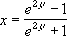

# WorksheetFunction.FisherInv Method (Excel)

Returns the inverse of the Fisher transformation. Use this transformation when analyzing correlations between ranges or arrays of data. If y = FISHER(x), then FISHERINV(y) = x.

## Syntax

 _Ausdruck_. **FisherInv**( ** _Arg1_** )

 _Ausdruck_ A variable that represents a **WorksheetFunction** object.

### Parameters

|**Name**|**Required/Optional**|**Data Type**|**Description**|
|:-----|:-----|:-----|:-----|
| _Arg1_|Erforderlich|**Double**|y - the value for which you want to perform the inverse of the transformation.|

### Return Value

Double

## Remarks

- If y is nonnumeric, FISHERINV returns the #VALUE! error value.
    
- The equation for the inverse of the Fisher transformation is: 

    

## Siehe auch

#### Konzepte

[WorksheetFunction Object](7b1d5639-363d-632c-2cf0-2232562646b6.md)
#### Weitere Ressourcen

[WorksheetFunction Object Members](http://msdn.microsoft.com/library/6811ca87-4b53-0bff-88c9-30bf7497879a%28Office.15%29.aspx)