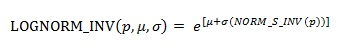

# WorksheetFunction.LogNorm_Inv Method (Excel)

Returns the inverse of the lognormal cumulative distribution function. Use the lognormal distribution to analyze logarithmically transformed data.

## Syntax

 _Ausdruck_. **LogNorm_Inv**( ** _Arg1_**, ** _Arg2_**, ** _Arg3_** )

 _Ausdruck_ A variable that represents a **[WorksheetFunction](7b1d5639-363d-632c-2cf0-2232562646b6.md)** object.

### Parameters

|**Name**|**Required/Optional**|**Data Type**|**Description**|
|:-----|:-----|:-----|:-----|
| _Arg1_|Erforderlich|**Double**|Probability - A probability associated with the lognormal distribution.|
| _Arg2_|Erforderlich|**Double**|Mean - The mean of ln(x).|
| _Arg3_|Erforderlich|**Double**|Standard_dev - The standard deviation of ln(x).|

### Return Value

Double

## Remarks

- If any argument is nonnumeric, LOGNORM_INV returns the #VALUE! error value.
    
- If probability <= 0 or probability >= 1, LOGNORM_INV returns the #NUM! error value.
    
- If standard_dev <= 0, LOGNORM_INV returns the #NUM! error value.
    
- The inverse of the lognormal distribution function is:

    

## Siehe auch

#### Konzepte

[WorksheetFunction Object](7b1d5639-363d-632c-2cf0-2232562646b6.md)
#### Weitere Ressourcen

[WorksheetFunction Object Members](http://msdn.microsoft.com/library/6811ca87-4b53-0bff-88c9-30bf7497879a%28Office.15%29.aspx)