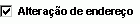

# Objeto CheckBox (Access)

Este objeto corresponde a uma caixa de seleção em um formulário ou relatório. Essa caixa de seleção é um controle autônomo que exibe um valor Sim/Não de uma fonte do registro base.

## Comentários

|||
|:-----|:-----|
|**Controle**:|**Ferramenta**:|
|

|

|
Quando você marca ou desmarca uma caixa de seleção que está acoplada a um campo Sim/Não, o Microsoft Access exibe o valor na tabela subjacente, de acordo com a propriedade  **Format** do campo (Sim/Não, **True** / **False** ou Ativado/Desativado).

Você também pode usar caixas de seleção em um grupo de opções para exibir valores a partir dos quais você poderá fazer suas escolhas.

## Ver também

#### Outros recursos

[Referência do modelo de objeto do Access](http://msdn.microsoft.com/library/2de134a4-6c5c-d2a3-8377-f4dd973ba650%28Office.15%29.aspx)
[Membros do objeto CheckBox](aeefeae7-4053-ec23-80ef-1da1099f54f0.md)