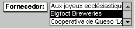

# Objeto ListBox (Access)

Este objeto corresponde a um controle de caixa de listagem. O controle de caixa de listagem exibe uma lista de valores ou de alternativas.


## Comentários

Em vários casos, é mais rápido e fácil selecionar um valor de uma lista do que lembrar de um valor a ser digitado. Uma lista de opções também ajuda a garantir que o valor inserido em um campo esteja correto.


|||
|:-----|:-----|
|**Controle**:|**Ferramenta**:|
|


|


|

 **Observação**  A lista em uma caixa de listagem consiste em linhas de dados. As linhas podem ter uma ou mais colunas, que podem aparecer com ou sem títulos.


Se uma caixa de listagem de várias colunas estiver associada, o Microsoft Access armazenará os valores de uma das colunas.

Você pode usar uma caixa de listagem não associada para armazenar um valor que você pode usar com outro controle. Por exemplo, você poderia usar uma caixa de listagem não associada para limitar os valores em outra caixa de listagem ou em uma caixa de diálogo personalizada. Você também poderia usar uma caixa de listagem não associada para localizar um registro baseado no valor selecionado na caixa de listagem.

Se você não tiver espaço em seu formulário para exibir uma caixa de listagem, ou se quiser digitar novos valores e selecionar valores em uma lista, use uma caixa de combinação em vez de uma caixa de listagem.

 **Links fornecidos por:**
 A comunidade[UtterAccess](http://www.utteraccess.com)


- [Criar uma consulta que use uma caixa de listagem de seleção múltipla como critério](http://www.utteraccess.com/forum/Creating-Query-Multi-t414388.mdl)
    
- [Seletor ListBox](http://www.utteraccess.com/forum/ListBox-Picker-t426483.mdl)
    
- [Mover/alterar a ordem de itens de caixa de listagem com os botões para cima/para baixo](http://www.utteraccess.com/wiki/index.php/List_Box:_Reorder_Items)
    
- [Preencher uma caixa de listagem com arquivos de um diretório](http://www.utteraccess.com/forum/Populate-Listbox-Files-t1209291.mdl)
    

## Exemplo

Este exemplo demonstra como filtrar o conteúdo de uma caixa de listagem enquanto você digita em uma caixa de texto.

Neste exemplo, uma caixa de listagem chamada ColorID exibe uma lista de cores armazenadas na tabela Cores. À medida que você digita na caixa de texto FilterBy, os itens de ColorID são filtrados dinamicamente

Para fazer isso, use o evento Alterar da caixa de texto para criar uma instrução SQL que servirá como a nova RowSource da caixa de listagem.

 **Código de exemplo fornecido por:**
 A comunidade[UtterAccess](http://www.utteraccess.com)


```
Private Sub FilterBy_Change()

    Dim sql As String
    
    'This will match any entry in the list that begins with what the user 
    'has typed in the FilterBy control
    sql = "SELECT ColorID, ColorName FROM Colors WHERE ColorName Like '" &amp; Me.FilterBy.Text &amp; "*' ORDER BY ColorName"
    
    'If you want to match any part of the string then add wildcard (*) before
    'the FilterBy.Text, too:
    'sql = "SELECT ColorID, ColorName FROM Colors WHERE ColorName Like '*" &amp; Me.FilterBy.Text &amp; "*' ORDER BY ColorName"
    
    Me.ColorID.RowSource = sql
    
End Sub
```


## Eventos


|**Nome**|
|:-----|
|[AfterUpdate](b95d98c8-0899-c555-14b4-d8e853b5dce3.md)|
|[BeforeUpdate](2a0c1046-4d40-87f8-7ecc-4ef262ae90f0.md)|
|[Click](92e2a86b-c21d-9ca2-099f-b3f254940791.md)|
|[DblClick](fe1b9c61-012e-96b7-ea89-8a8c4b47f483.md)|
|[Enter](58f29589-8754-2323-c044-09dbea35fd83.md)|
|[Exit](6a95f727-673a-0f8f-fc61-435398c35195.md)|
|[GotFocus](b451f0a6-7017-124f-44e3-7f64b9a049ef.md)|
|[KeyDown](5f1c019a-0a21-d640-d872-e2775ced3c43.md)|
|[KeyPress](1112052d-c5b4-75fd-b76e-79c247910201.md)|
|[KeyUp](2e4d0bed-8c2c-967d-e7b4-dc9de12ad570.md)|
|[LostFocus](075bb519-5f53-88b2-f46a-b2c5eb067150.md)|
|[MouseDown](bc55d5f4-b475-2f7d-2434-a5d71bada0f3.md)|
|[MouseMove](f54e529c-0b5e-73ea-286f-3430057bb86c.md)|
|[MouseUp](8d2d5ca3-e93f-9021-341c-769948432d2a.md)|

## Métodos


|**Nome**|
|:-----|
|[AddItem](dab0c3e4-8ecc-774b-4c7e-f973eb4c1516.md)|
|[Move](a16304f5-891c-b80c-80b3-1f75692cb30f.md)|
|[RemoveItem](5a2f010b-9888-9aff-fee1-1e9e596464e8.md)|
|[Requery](8daf0608-a2ce-75c3-2601-4071f6f498a5.md)|
|[SetFocus](a8d0c774-095c-34f5-7905-f67c48886832.md)|
|[SizeToFit](0b74f6d0-d33d-368c-d991-2b219072eae2.md)|
|[Undo](ec3947ec-69f2-ec23-ef25-1a9b50e1f901.md)|

## Propriedades


|**Nome**|
|:-----|
|[AddColon](f1abcc52-671a-c187-071e-e16e4588f57d.md)|
|[AfterUpdate](b71e1b7a-6893-505b-6de8-b877190c76d6.md)|
|[AllowValueListEdits](cab2ec6f-affb-5111-af5e-6f3638189dff.md)|
|[Application](de3a7634-a31b-0455-3807-eb1163eb052d.md)|
|[AutoLabel](f5e6e01e-55be-21f8-339b-bb546eaf0151.md)|
|[BackColor](85d7d802-76d3-0a4f-debc-51dda0f81910.md)|
|[BackShade](6608aa85-9301-1c3f-fbac-825010ade03e.md)|
|[BackThemeColorIndex](d738236a-d635-7ef6-7626-71494a4811fc.md)|
|[BackTint](822bb0ff-5439-8150-5c3d-1738160ae654.md)|
|[BeforeUpdate](b7e75906-839b-2518-bc02-a313cbd8c232.md)|
|[BorderColor](552b81f2-a811-7582-4e60-0c4903da7a9b.md)|
|[BorderShade](f44dc9fc-344f-35a9-4293-44db0e1ac6df.md)|
|[BorderStyle](6b57a863-b521-0cd3-933d-bb50f25ece19.md)|
|[BorderThemeColorIndex](3dac9a1c-4a8b-1b01-9937-6dc8e5018fb5.md)|
|[BorderTint](76bcaf37-6c2c-a3cf-6126-effbe218ba11.md)|
|[BorderWidth](3e0ddff1-7e60-5fbd-7680-6d9da7baead8.md)|
|[BottomPadding](80de2112-a66c-9d53-0d17-54ca2ff90a98.md)|
|[BoundColumn](f6a742a4-40ff-bb83-8946-7e8bb71e5690.md)|
|[Column](d393326a-4114-9ec2-fcfe-1ce74003e86c.md)|
|[ColumnCount](a1712119-2afe-f389-ff68-ed6aa1f7dde4.md)|
|[ColumnHeads](cd779d07-d35b-03b2-df3a-7934615675d0.md)|
|[ColumnHidden](54d9c895-3f65-6d13-2b47-93e541a6c1d4.md)|
|[ColumnOrder](846b745a-0818-a312-dc60-774dce7ec059.md)|
|[ColumnWidth](759b1c74-77f0-8ee1-7fc9-8268104a207e.md)|
|[ColumnWidths](4ac2a001-8084-37aa-9f8e-ec3d373f7161.md)|
|[Controls](16356c09-4509-c774-1fd6-9ba5b330eaa5.md)|
|[ControlSource](3122f8ec-d7d6-18b2-5a68-2c175d2b0d85.md)|
|[ControlTipText](27abccf5-e3f2-2c0c-06ee-4160eb447374.md)|
|[ControlType](3002d198-961a-69d4-58b5-c0b096747232.md)|
|[DefaultValue](dd8104db-7d24-2b1f-aac7-bc17f7b9002b.md)|
|[DisplayWhen](d8a82522-97db-1b8d-2089-6e808be7889f.md)|
|[Enabled](f6e95fea-f038-e190-ee8c-1ab088e27828.md)|
|[EventProcPrefix](28f4d70b-8206-2481-9b83-c1bbc2767b82.md)|
|[FontBold](b1060b7d-36ca-3048-a046-90e9bdf8f402.md)|
|[FontItalic](0d7b2ec0-70a9-e325-2ff3-58f73d9654b3.md)|
|[FontName](9bcab0c1-7a13-2b1a-91c1-56f784451bdf.md)|
|[FontSize](4abc5ab0-8d34-1f87-6e23-706e4d3c9e88.md)|
|[FontUnderline](1b89f608-9d05-015c-b7a5-8f7f9e3ec271.md)|
|[FontWeight](7c5ea418-3b2d-9ec9-3418-250d1496903c.md)|
|[ForeColor](bbc345ab-fd78-3e30-b2d6-d0a43291f576.md)|
|[ForeShade](4917e73f-595e-7286-adc0-05d3a9e44b34.md)|
|[ForeThemeColorIndex](9338e883-4a8d-c2b9-e4ea-dc654dd86f40.md)|
|[ForeTint](3d2d2e77-5819-673b-8e9c-d2d94d06a1bd.md)|
|[GridlineColor](296db594-3edc-e32f-c4c1-d854b4f9a922.md)|
|[GridlineShade](261c89f0-e1d8-41a0-6d8b-97332a6a01db.md)|
|[GridlineStyleBottom](1a47a068-aedb-b60e-dbda-42a7f569a099.md)|
|[GridlineStyleLeft](c9b37e7e-653f-68fd-40b0-6f601b91fa86.md)|
|[GridlineStyleRight](5169d8a9-9263-a30f-bb00-da2b6b4ee130.md)|
|[GridlineStyleTop](d4da57f4-f67b-5759-0e52-bd61b2ce9d18.md)|
|[GridlineThemeColorIndex](62339876-c58b-6636-5a3d-1fadee6a5c3c.md)|
|[GridlineTint](409eec01-384c-742c-f1d4-59a54fbaa4d6.md)|
|[GridlineWidthBottom](bf5457cf-a762-2f12-7468-0372aedbe9b1.md)|
|[GridlineWidthLeft](61276c61-f39a-b094-99a4-0118cab9b08a.md)|
|[GridlineWidthRight](a795a6d9-e881-94a5-f7b8-d7df63166403.md)|
|[GridlineWidthTop](bef39115-4e27-f291-3ae5-d9eab3a04ace.md)|
|[Height](b8ef3b9c-58bc-e30c-b754-3a3cf574c840.md)|
|[HelpContextId](df459501-09ff-cdae-4903-526d62e1c05b.md)|
|[HideDuplicates](a67c6d19-3064-9909-1242-a764b8732cde.md)|
|[HorizontalAnchor](f21376e7-55e3-03a2-4687-f02ee5b40a18.md)|
|[Hyperlink](fa85ede7-5845-cde8-c945-6a68beff196c.md)|
|[IMEHold](22d6bd7c-704b-2b27-6b04-c6628cd83f02.md)|
|[IMEMode](82f9dc6e-7132-d98c-7c5f-6ed2f0b1e552.md)|
|[IMESentenceMode](877e1766-c378-cf7b-b452-bb8f536980f3.md)|
|[InheritValueList](7b5e0af5-4648-ff09-04a6-25b050dc1861.md)|
|[InSelection](4c0d3434-752e-c96e-32ce-78a29d4da1e7.md)|
|[IsVisible](6105ef5f-5c92-c7c0-748d-3d8a1efb9050.md)|
|[ItemData](a0c1ab24-089e-6279-96dc-ef490096d06a.md)|
|[ItemsSelected](c2403562-00c4-12ec-4d31-9b83d081cb4d.md)|
|[LabelAlign](b3fa2e58-3390-57cf-88c8-b346c77cf488.md)|
|[LabelX](12335d2b-92e1-185b-df3e-db1e9002f757.md)|
|[LabelY](79a1486b-4f51-fabd-e56e-51cb2868c0c2.md)|
|[Layout](18453d2c-d719-1433-124e-2e05e3009cd1.md)|
|[LayoutID](0926d2c9-dc23-76ac-29a2-07a800f5fba3.md)|
|[Left](3272daef-8241-3305-4623-abfcb6aaffdb.md)|
|[LeftPadding](63a94bd3-7929-c204-3612-080bbb5869bc.md)|
|[ListCount](09383f86-888e-1708-9e05-504c49eeb5a6.md)|
|[ListIndex](4d75f753-f6a9-d362-7281-2c0460f4272b.md)|
|[ListItemsEditForm](f744fc52-4c50-f740-7a2f-eeccb12de7c9.md)|
|[Locked](b820438b-1ebf-780f-9fe9-e51d90bbf326.md)|
|[MultiSelect](7115a913-1696-03b4-c88b-0626da1d587a.md)|
|[Name](86162898-8107-c6c8-7249-463ff4312671.md)|
|[NumeralShapes](b89bf0e9-7cd2-0676-ca07-0d813cd175e9.md)|
|[OldBorderStyle](4da79825-91df-d731-ec39-c1d304972077.md)|
|[OldValue](53b18c22-b86e-9b99-8480-08b1f2ddd620.md)|
|[OnClick](1afb8ebd-c22b-1978-1eb4-a18d75f7f6c0.md)|
|[OnDblClick](4271eff9-1d13-209a-9d7b-965893e36f59.md)|
|[OnEnter](390d7350-3a93-d9f8-e377-f83102e8b5f1.md)|
|[OnExit](87ac5b4f-85d0-7edb-28d6-253f44496946.md)|
|[OnGotFocus](ded32fef-1821-5288-9265-c1e1f4819efe.md)|
|[OnKeyDown](f1136953-16b3-9628-9411-b13b143725d0.md)|
|[OnKeyPress](f7d0c300-d3dc-78e3-0e2d-825bd7088ad7.md)|
|[OnKeyUp](efc5b93f-ddbc-4fc0-2c2e-6a3fd13b2b97.md)|
|[OnLostFocus](ce4b1917-c986-3059-69cb-830345c5f25a.md)|
|[OnMouseDown](2290e2ef-956a-4178-0de5-03fb8b7470aa.md)|
|[OnMouseMove](2a173ef5-4c63-98e1-aa24-dbb106fcc8cd.md)|
|[OnMouseUp](a0f93909-a3d6-255f-6c9d-77259155741b.md)|
|[Parent](c588debe-db0f-46a0-a2f4-ff86e4eddc75.md)|
|[Properties](ff0caafd-dc7c-21fc-a3d2-f6caf63899be.md)|
|[ReadingOrder](9af8afab-e253-01d4-f79c-01bfa9d8e60b.md)|
|[Recordset](ead14d35-eb76-6487-ac9e-329b5d38366c.md)|
|[RightPadding](aacb7180-a9f3-9450-dd2f-35f21768a9c7.md)|
|[RowSource](7f6c8b99-36b2-3bd3-af8f-f93d67d20f39.md)|
|[RowSourceType](a98a44d4-b2a5-d591-9295-3222d708ee88.md)|
|[ScrollBarAlign](6eb9b2d1-e306-5980-7ad0-ff0b9c1cd0c6.md)|
|[Section](297d3e45-8072-e31b-5462-badf2027ebe5.md)|
|[Selected](db30f166-c82b-2a77-6feb-bf03810fc36d.md)|
|[ShortcutMenuBar](5da48eb8-b4ce-a3e5-323b-18f1ec76e00c.md)|
|[ShowOnlyRowSourceValues](35fc7924-ba76-d322-99ae-f5e355536bc0.md)|
|[SmartTags](1f35ca6b-fde1-6dc8-4b1b-f3089eee9204.md)|
|[SpecialEffect](7cd56728-559d-ffd8-8230-fa570c4633e9.md)|
|[StatusBarText](281baa24-d32f-72fe-a57d-201ce4bd8777.md)|
|[TabIndex](50db3c8f-5bc6-d663-3e07-7014f80188b5.md)|
|[TabStop](0581f18a-7d23-2836-0959-88f84dc1a4ad.md)|
|[Tag](85ee226a-3f66-820d-e90c-3e47ddb8d2d4.md)|
|[ThemeFontIndex](7fa3a5ef-c59b-8ce5-1d7f-6b00991dc12b.md)|
|[Top](1b1606ca-01df-1c5b-5865-51dc257d62c0.md)|
|[TopPadding](b453cfc4-d059-395a-7c62-ae07f12e1677.md)|
|[ValidationRule](d3a605d6-cb17-fc4a-0e01-72a21416f980.md)|
|[ValidationText](be52194b-be06-9a85-30f6-718211038213.md)|
|[Value](4427ed24-3255-13a2-5b42-6a3d93ed76a9.md)|
|[VerticalAnchor](2c38763c-5b90-9219-8a3b-3bfef035a9bb.md)|
|[Visible](76361c20-b6b4-6d75-e732-2e63b2c8485e.md)|
|[Width](3c57661f-34a3-c8d7-c8ca-076bf73610b0.md)|

## Sobre os colaboradores
<a name="AboutContributors"> </a>

UtterAccess é o fórum principal de wiki e a Ajuda do Microsoft Access. clique aqui para ingressar.


## Ver também
<a name="AboutContributors"> </a>


#### Outros recursos


[Membros do objeto ListBox](d87ad51b-9a46-21f3-f6d6-ef98ea8aaf6d.md)
[Referência do modelo de objeto do Access](http://msdn.microsoft.com/library/2de134a4-6c5c-d2a3-8377-f4dd973ba650%28Office.15%29.aspx)