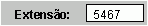

# Objeto TextBox (Access)

Este objeto representa um controle de caixa de texto em um formulário ou relatório. As caixas de texto são usadas para exibir dados de uma fonte de registro, para exibir os resultados de um cálculo ou para aceitar a entrada de um usuário.


## Exemplo

O exemplo de código a seguir usa um formulário com uma caixa de texto para receber uma entrada do usuário. O código exibe uma mensagem quando o usuário insere dados e, em seguida, pressionar Enter


```

Private Sub txtValue1_BeforeUpdate(Cancel As Integer)

MsgBox "The Text box is being updated."

End Sub

```


## Comentários

As caixas de texto podem ser associadas ou não associadas. Use uma caixa de texto associada para exibir dados de um campo específico. Use uma caixa de texto não associada para exibir os resultados de um cálculo ou para aceitar a entrada de um usuário (como no exemplo de código acima).


|||
|:-----|:-----|
|**Controle**:|**Ferramenta**:|
|


|


|

## Ver também


#### Outros recursos


[Referência do modelo de objeto do Access](http://msdn.microsoft.com/library/2de134a4-6c5c-d2a3-8377-f4dd973ba650%28Office.15%29.aspx)
[Membros do objeto TextBox](bb55abbc-902e-fc2d-bdff-063c55426cd0.md)