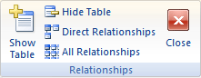

# As alterações solicitadas à tabela não foram bem-sucedidas porque elas criariam valores duplicados no índice, na chave primária ou no relacionamento. (Erro 3022)

Você tentou duplicar um valor em um campo de chave primária da tabela subjacente ou em um índice que não permite duplicatas.

## O que é uma chave primária?

Uma chave primária é um campo ou um conjunto de campos na tabela que fornece ao Microsoft Access um identificador exclusivo para cada linha. Em um banco de dados relacional, como um banco de dados do Access, você divide as informações em tabelas separadas, com base no assunto. Você usar relações de tabelas e chaves primárias para informar ao Access como juntar novamente as informações novamente. O Access usa campos de chave primária para associar os dados de várias tabelas rapidamente e para combinar dados de maneira significativa.

Geralmente, um número de identificação exclusivo, como um número de identidade ou um número de série ou um código, serve como uma chave primária em uma tabela. Por exemplo, você pode ter uma tabela de clientes, onde cada cliente possui um número de identificação exclusivo do cliente. O campo ID do cliente é a chave primária.

Um exemplo de uma opção ruim para uma chave primária seria um nome ou um endereço. Ambos contêm informações que podem mudar ao longo do tempo.

O Access garante que cada registro possua um valor no campo de chave primária, e o valor é sempre exclusivo.

## O que é um índice?

Você pode usar um índice para ajudar o Access a localizar e a classificar registros mais rapidamente. Um índice armazena o local dos registros com base no campo ou nos campos que você deseja indexar. Depois que o Access obtiver o local do índice, poderá recuperar os dados movendo-se diretamente até o local correto. Dessa forma, usar um índice pode ser consideravelmente mais rápido do que examinar todos os registros para localizar os dados.

Se você criar um índice exclusivo, o Access não permitirá a inserção de um novo valor no campo se esse valor já existir no mesmo campo em outro registro. O Access cria automaticamente um índice exclusivo para as chaves primárias.

## Solução

Para resolver o problema, você deve criar tabelas para eliminar a possibilidade de inserir valores duplicados em um campo de chave primária ou em um campo que use um índice exclusivo.

Se o campo de chave primária atual precisar dar suporte a valores duplicados, você deverá remover a chave primária atual e adicionar um campo de Numeração Automática à tabela para que ele aja como sua chave primária.

## Para remover a chave primária

Ao remover a chave primária, o campo ou os campos que anteriormente serviram como chave primária não fornecem mais o principal meio de identificar um registro. No entanto, a remoção da chave primária não exclui o campo ou os campos da tabela; em vez disso, ele remove a designação de chave primária desses campos. Remover a chave primária também removerá o índice criado para a chave primária.

1. Antes de remover uma chave primária, verifique se ela não participa de nenhuma relação de tabela. Se você tentar remover uma chave primária que participe de relações, o Access avisará que você deverá excluir a relação primeiro.
    
2. 
      - Se as tabelas que participam da relação de tabelas estiverem abertas, feche-as. Você não pode excluir uma relação de tabelas entre tabelas abertas.
    
  - Na guia  **Ferramentas de Banco de Dados**, no grupo **Mostrar/Ocultar**, clique em  **Relações**.

    
  - Se as tabelas que participam da relação de tabelas não estiverem visíveis na guia  **Design**, no grupo  **Relações**, clique em  **Mostrar Tabela**. Selecione as tabelas a serem adicionadas na caixa de diálogo  **Mostrar Tabela**, clique em  **Adicionar** e clique em **Fechar**.
    
  - Clique na linha de relação de tabelas para a relação de tabelas que você deseja excluir (a linha fica em negrito quando selecionada) e pressione a tecla DELETE.
    
  - Na guia  **Design**, no grupo  **Relações**, clique em  **Fechar**.

    
3. No Painel de Navegação, clique com o botão direito do mouse na tabela da qual você deseja remover a chave primária e clique em  **Modo Design**.
    
4. Clique no seletor de linha para a chave primária atual.
    
5. 
      - Se a chave primária consistir em um único campo, clique no seletor de linha desse campo.
    
  - Se a chave primária consistir em vários campos, clique no seletor de linha para qualquer campo na chave primária.
    
6. Na guia  **Design**, no grupo  **Ferramentas**, clique em  **Chave Primária**.
O indicador de chave é removido do campo ou dos campos especificados anteriormente como a chave primária.
    
 **RECURSOS DE SUPORTE DO ACCESS**[Fórum do Access para desenvolvedores no MSDN](https://social.msdn.microsoft.com/Forums/office/pt-BR/home?forum=accessdev)[Ajuda do Access em support.office.com](https://support.office.com/search/results?query=Access)[Ajuda do Access em answers.microsoft.com](http://answers.microsoft.com/pt-br/office/forum/access?page=1&amp;tab=question&amp;status=all&amp;auth=1)/[Procure erros de código específicos do Access no Bing](http://www.bing.com/)[Fóruns do Access no UtterAccess](http://www.utteraccess.com/forum/index.php?act=idx)[Wiki do Access no UtterAcess](http://www.utteraccess.com/forum/index.php?act=idx)[Central de ajuda da programação VBA e desenvolvedor do Access (FMS)](http://www.fmsinc.com/MicrosoftAccess/developer/)[Postagens do Access no StackOverflow](http://stackoverflow.com/questions/tagged/ms-access)
