# Novo no Access para desenvolvedores
Saiba mais sobre os recursos do Access 2013 que facilitam a criação, a implantação e o gerenciamento de aplicativos colaborativos com base na Web, locais ou na nuvem.

## Introdução

O Access 2013 contém um novo modelo de aplicativo que é elaborado para somente um propósito: simplificar o desenvolvimento Web como em versões anteriores do Access com desenvolvimento para Windows. O Access 2013 habilita especialistas a criar rapidamente um aplicativo que pode ser usado para gerir seus negócios. Ao usar o Microsoft SharePoint 2013 para hospedar o front-end do aplicativo e o Microsoft SQL Server 2012 como tecnologia de armazenamento de dados, o Access 2013 melhora significativamente a gerenciabilidade e escalabilidade de aplicativos do Access. A compatibilidade com o Office 365 e o SQL Azure aumenta significativamente o alcance de aplicativos do Access.

## Novo modelo de aplicativos

Em um ambiente local, aplicativos do Access 2013 são hospedados pelo SharePoint 2013, enquanto os dados são hospedados pelo SQL Server 2012. O SharePoint 2013 fornece autenticação, autorização e segurança para aplicativos do Access 2013. As tabelas de back-end, modos de exibição, macros e consultas são hospedadas em um banco de dados do SQL Server 2012.

A Figura 1 fornece uma visão geral da arquitetura do Access 2013.

**Figura 1. Arquitetura do Access 2013**

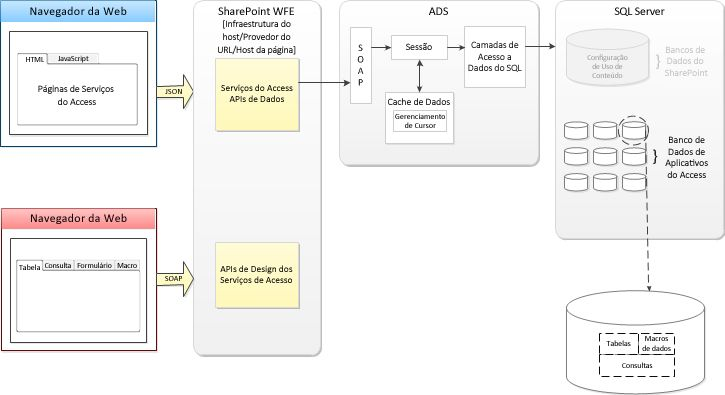Quando um novo aplicativo do Access é criado, o Access Services no SharePoint Server 2013 cria um novo Application database que armazena os dados, modos de exibição, consultas e macros contidas no aplicativo. O banco de dados de Sistema do Access Services 2013 pode ser configurado para criar novos Application databases em um servidor separado do SQL Server 2012.

Usar o SQL Server 2012 para armazenar dados fornece gerenciabilidade e escalabilidade nunca vistas anteriormente em aplicativos do Access. Já passou o tempo em que um aplicativo do Access teria que ser recriado e implementado novamente em um ambiente mais avançado.

Um aplicativo do Access 2013 fica online no momento em que é criado. Você pode decidir compartilhá-lo com outros usuários, implantá-lo ao catálogo corporativo privado ou implantá-lo no Office Store.

## Modos de Exibição

Os Modos de Exibição (conhecidos como  _"formulários"_ nos bancos de dados do Access para área de trabalho) fornecem os meios segundo os quais os usuários irão interagir com o seu aplicativo do Access. Os Modos de Exibição dos aplicativos do Access 2013 contêm um conjunto comum de elementos de interface de usuário que habilitam a criação rápida de novos aplicativos.

O Access 2013 é elaborado para permitir que você crie modos de exibição funcionais com intervenção mínima. Ao criar uma nova tabela, o Access cria automaticamente dois modos de exibição. A Figura 2 exibe uma nova tabela com os modos de exibição criados automaticamente.

**Figura 2. Nova tabela com dois modos de exibição**

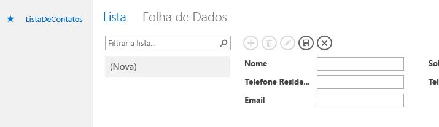Os modos de exibição estão organizados pelas tabelas às quais estão vinculados no Painel de Blocos. Por padrão, cada tabela é representada por um bloco no Painel de Blocos. A Figura 3 mostra a tabela de Pedidos selecionada no Painel de Blocos.

**Figura 3. Painel de Blocos**

Você pode reorganizar as tabelas no Painel de Blocos. Você pode alterar o nome exibido em um bloco, o que não renomeia a tabela subjacente. No entanto, excluir o bloco exclui a tabela.

Você pode ocultar os blocos que não desejar que sejam exibidos no navegador da Web. Ao ocultar um bloco, você ainda pode editar a tabela e modos de exibição subjacentes no Access. Ainda que o usuário não possa acessar os modos de exibição de blocos ocultos diretamente, você pode usar as ações de macro  **ChangeView** ou **OpenPopup** para exibir um modo de exibição associado a um bloco oculto. A Figura 4 mostra que os blocos Problemas Relacionados e Comentários Sobre os Problemas foram ocultados.

**Figura 4. Blocos ocultos no designer de modo de exibição**

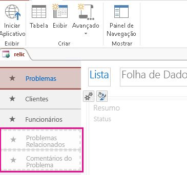Após selecionar um bloco, o Seletor de Modo de Exibição abre o modo com que você deseja trabalhar. A Figura 5 mostra que o modo de exibição de Folha de Dados de Pedidos está selecionado.

**Figura 5. Modo de Exibição de Folha de Dados de Pedidos ativo**

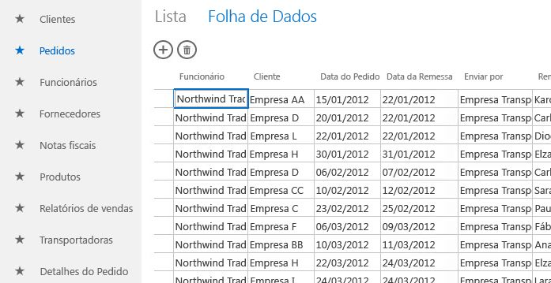Você pode remover os modos de exibição padrão e adicionar modos personalizados a qualquer bloco.

### Tipos de Modos de Exibição

Há quatro tipos de modos de exibição que você pode criar no seu aplicativo do Access 2013: Detalhes de Lista, Folha de Dados, Resumo e Em Branco.

Detalhes de Lista é um dos modos de exibição que o Access gera automaticamente ao criar uma tabela. O principal recurso que caracteriza um modo de exibição de lista é o painel de lista que é exibido ao lado esquerdo do modo. O painel de lista é usado para filtrar e navegar pelos registros contidos no modo.

O painel de lista pode exibir até três itens de cada registro definindo as suas propriedades  **Primary**, **Secondary** e **Thumbnail**. A Figura 6 mostra que o painel de lista no modo de exibição dede Lista de Funcionários está configurado para exibir os campos **FullName** e **Job Title**.

**Figura 6. Modo de Exibição de Detalhes de Lista**

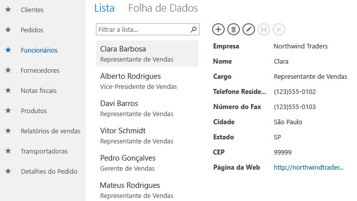A caixa de pesquisa, localizada no topo do painel de lista, filtra o modo de exibição pesquisando por todos os valores.

O modo de exibição Folha de Dados é o outro modo que o Access gera automaticamente ao criar uma tabela. Os modos de exibição Folha de Dados são úteis para os usuários que acham mais fácil inserir, classificar e filtrar dados de modo semelhante a uma planilha. A Figura 7 mostra que o modo de exibição Folha de Dados de Pedidos está filtrado para exibir os pedidos que ainda não foram enviados.

**Figura 7. Um modo de exibição Folha de Dados filtrado**

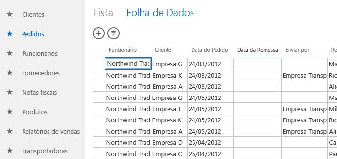Modos de exibição de Resumo podem ser usados para agrupar registros com base em um campo e opcionalmente calcular uma soma ou média. O campo a agrupar exibe seus valores em um modo de lista. Ao selecionar um grupo, o registro contido no grupo é exibido em um controle de itens relacionados. O controle de itens relacionados pode ser configurado para exibir até quatro campos que tenham informações sobre o registro. É possível especificar um modo pop-up se desejar fazer uma busca detalhada no item. A Figura 8 mostra o modo  **Problemas Por Status**, um modo de exibição de Resumo que agrupa a tabela **Problemas** pelo campo **Status**.

**Figura 8. Um modo de exibição de Resumo**

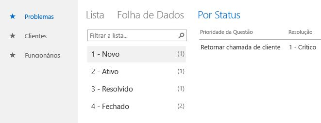Modos de exibição Em Branco, como o nome sugere, estão vazios ao criá-los. Modos de exibição Em Branco são úteis para criar um modo de exibição pop-up que conterá um único registro ao ser aberto. Em alternativa, você pode usar um modo de exibição Em Branco para criar um menu de controle, para que o usuário possa navegar pelo seu aplicativo.

### Personalizando um modo de exibição

O designer de modos de exibição do Access 2013 não fornece a abordagem de pixel perfeito oferecida ao criar formas em bancos de dados cliente. O modo de exibição e seus controles em aplicativos do Access 2013 oferecem suporte a um conjunto menor de controles, propriedades e eventos.

O designer de modo de exibição é criado como uma grade de tabela. Para configurar uma propriedade de controle, selecione o controle. Um ou mais ícones são exibidos próximos ao controle. Selecionar um ícone exibe um pop-up que contém uma categoria de propriedades. O Access exibe somente as propriedades que são relevantes no contexto atual. A Figura 9 mostra as propriedades de  **Data** para o controle **ProjectComboBox**.

**Figura 9. Pop-up de propriedades**

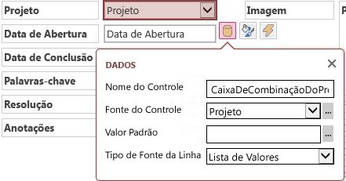Quando limitados a uma fonte de dados, os modos de exibição Detalhes de Lista, Folha de Dados e Em Branco contêm uma Barra de Ações. A Barra de Ações é uma barra de ferramentas personalizável que é exibida na parte superior de cada modo de exibição. Por padrão, a barra de ações contém botões para adicionar, editar, salvar, excluir e cancelar edições. Você pode adicionar botões que realizam ações personalizadas. Você também pode excluir os botões padrão ou ocultar a Barra de Ações completamente.

### Novos controles

Os aplicativos do Access 2013 oferecem suporte a dois controles inéditos no Access; o controle de Preenchimento Automático e o controle de Itens Relacionados.

O controle de Preenchimento Automático exibe uma lista de registros que correspondem ao que você está digitando na caixa. A Figura 10 mostra um controle de Preenchimento Automático limitado a uma lista de funcionários.

**Figura 10. Controle de Preenchimento Automático**

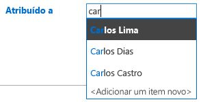Conforme você digita, o controle de Preenchimento Automático exibe até oito registros correspondentes. O controle de Preenchimento Automático é uma boa alternativa ao controle de Caixa de Combinação quando a lista de itens for longa.

O controle de Itens Relacionados exibe um conjunto de registros de tabelas relacionadas à tabela subjacente do modo de exibição. A Figura 11 mostra um controle de itens relacionados em um modo de exibição. O controle está configurado para ter duas guias. A primeira guia exibe problemas abertos pelo funcionário selecionado. A segunda guia mostra os problemas atribuídos ao funcionário selecionado

**Figura 11. Controle de itens relacionados**

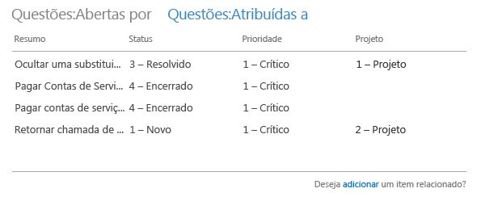Para editar os itens em uma guia de Itens Relacionados, você deve atribuir a propriedade  **Modo de Exibição de Pop-up** a um modo de exibição. O modo especificado será aberto em uma janela de pop-up ao selecionar um item.

## Programabilidade em aplicativos do Access

A programabilidade em aplicativos do Access 2013 é fornecida por uma linguagem de macro criada no cliente do Access. Existem dois tipos de macros; macros de interface de usuário (IU) e macros de dados. As macros de IU podem executar ações que afetam a interface de usuário do seu aplicativo, enquanto que as macros de dados trabalham diretamente com os registros contidos no aplicativo.

### Macros de Interface de Usuário

As macros de IU permitem que você execute ações como abrir outro modo de exibição, aplicar um filtro ou criar um novo registro. As macros de IU "inseridas" são anexadas diretamente a objetos de interface de usuário, como botões de comando, caixas de combinação ou o objeto de botão da Barra de Ações; enquanto que as macros de IU "autônomas" estão contidas em objetos de macro.

A Tabela 1 lista os eventos aos quais você pode anexar uma macro de IU em um controle ou modo de exibição.

 **Tabela 1. Eventos com suporte em macros de IU**

|**Tipo de Evento**|**Quando ocorre**|
|:-----|:-----|
|Após Atualizar|Ocorre após inserir dados em um controle ou escolher dados de um controle.|
|Ao Clicar|Ocorre quando um controle é selecionado.|
|No Atual|Ocorre quando o usuário move para um registro diferente no modo de exibição.|
|Ao Carregar|Ocorre quando um modo de exibição é aberto.|
A Tabela 2 lista os eventos com suporte em cada controle.

 **Tabela 2. Eventos com suporte em cada controle**

|**Controle ou tipo de objeto**|**Eventos com suporte**|
|:-----|:-----|
|Botão da Barra de Ações|Ao Clicar|
|Preenchimento Automático|Após Atualizar, Ao Clicar|
|Botão|Ao Clicar|
|Caixa de Verificação|Após Atualizar|
|Caixa de Combinação|Após Atualizar|
|Hiperlink|Após Atualizar, Ao Clicar|
|Imagem|Ao Clicar|
|Rótulo|Ao Clicar|
|Caixa de Texto de Várias Linhas|Após Atualizar, Ao Clicar|
|Caixa de Texto|Após Atualizar, Ao Clicar|
|Modo de Exibição|No Atual, Ao Carregar|
Reutiliza macros de IU autônomas chamando-as a partir de outras macros, ajudando-o a evitar código duplicado. As macros de IU autônomas podem ser vistas no Painel de Navegação, sob  **Macros**. No entanto, você não pode executá-las diretamente do Painel de Navegação. Use a ação  **RunMacro** para executar uma macro de IU autônoma a partir de uma macro de IU inserida.

### Macros de dados

As macros de dados fornecem um método para implementar regras de negócios na camada de dados. Ao contrário das macros de IU, as macros de dados podem criar, editar e excluir registros.

As macros de dados "inseridas" são anexadas a um evento de tabela. As macros de dados "autônomas" estão contidas em objetos de macro.

A Tabela 3 lista os eventos aos quais você pode anexar uma macro de dados em uma tabela.

 **Tabela 3. Eventos com suporte em macros de dados**

|**Tipo de evento**|**Quando ocorre**|
|:-----|:-----|
|Ao Inserir|Ocorre quando um novo registro é adicionado à tabela.|
|Ao Atualizar|Ocorre quando um registro existente é alterado.|
|Ao Excluir|Ocorre após excluir um registro|
A Figura 12 mostra uma macro de dados inserida no evento  **On Update** da tabela de Problemas. A macro de dados verifica se há uma resolução selecionada quando um problema é resolvido ou fechado.

**Figura 12. Macro de dados inserida no evento Ao Atualizar**

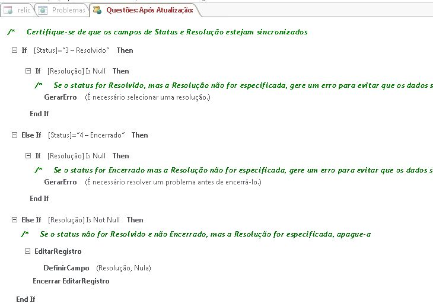Se nenhuma solução estiver selecionada, a ação de macro  **RaiseError** é usada para exibir uma mensagem de erro ao usuário e o registro não é salvo.

As macros de dados autônomas podem ser chamadas a partir de macros de IU e macros de dados usando a ação  **RunDataMacro**. As macros de dados autônomas podem conter um ou mais parâmetros. Na macro de dados, use a ação **SetReturnVar** para definir um valor de retorno que a macro de chamada pode usar para determinar o que fazer a seguir.

## Publicar o seu aplicativo do Access

O Access 2013 fornece aos usuários a capacidade de descobrir soluções diretamente de um catálogo corporativo privado no SharePoint 2013 ou no Office Store hospedado no Office.com. O Office Store fornece um local conveniente para desenvolvedores carregarem novos aplicativos do Access direcionados a consumidores e a empresas. Enquanto desenvolvedor, ao carregar o seu aplicativo para o Office Store, o Microsoft executa algumas verificações de validação. Se for aprovado em todos os testes, o pacote do aplicativo é empacotado em um arquivo e assinado pela Microsoft.

## Conclusão

O Access 2013 introduz um novo modelo de aplicativo que habilita especialistas a criar e compartilhar aplicativos que podem ser usados para gerir seus negócios. O novo designer de modo de exibição facilita a criação de aplicativos para usuários com pouca ou nenhuma experiência de programação. Ao usar o SharePoint 2013 para hospedar o aplicativo e o SQL Server 2012 para armazenar dados, os aplicativos do Access são mais gerenciáveis e escalonáveis do que nunca. A compatibilidade com o Office 365 e o SQL Azure aumenta significativamente o alcance de aplicativos do Access.

## Recursos adicionais

[Tutorial: criar e personalizar um aplicativo Web no Access](http://msdn.microsoft.com/library/628745f4-82e9-4838-9726-6f3e506a654f%28Office.15%29.aspx)

[Novidades para os desenvolvedores do Office 2013](http://msdn.microsoft.com/library/d76ae308-555e-4147-8900-956d3eb8ba23%28Office.15%29.aspx)

 **RECURSOS DE SUPORTE DO ACCESS**[Fórum do Access para desenvolvedores no MSDN](https://social.msdn.microsoft.com/Forums/office/pt-BR/home?forum=accessdev)[Ajuda do Access em support.office.com](https://support.office.com/search/results?query=Access)[Ajuda do Access em answers.microsoft.com](http://answers.microsoft.com/pt-br/office/forum/access?page=1&amp;tab=question&amp;status=all&amp;auth=1)/[Procure erros de código específicos do Access no Bing](http://www.bing.com/)[Fóruns do Access no UtterAccess](http://www.utteraccess.com/forum/index.php?act=idx)[Wiki do Access no UtterAcess](http://www.utteraccess.com/forum/index.php?act=idx)[Central de ajuda da programação VBA e desenvolvedor do Access (FMS)](http://www.fmsinc.com/MicrosoftAccess/developer/)[Postagens do Access no StackOverflow](http://stackoverflow.com/questions/tagged/ms-access)
