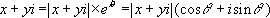
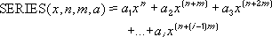

# Membros de WorksheetFunction (Excel)

Usado como contêiner para funções de planilha do Microsoft Excel que podem ser chamadas no Visual Basic.

## Métodos

|**Nome**|**Descrição**|
|:-----|:-----|
|[AccrInt](17444208-5141-3ffe-1802-b19be0defc52.md)|Retorna juros acumulados de um título que paga juros periódicos.|
|[AccrIntM](9cb3e757-26c0-6b3e-91a2-e6a2de30c168.md)|Retorna juros acumulados de um título que paga juros no vencimento.|
|[Acos](76954fdf-5aa0-de8d-1f7c-4184ebc472f4.md)|Retorna o arco cosseno ou cosseno inverso de um número. O arco cosseno é o ângulo cujo cosseno é _Arg1_. O ângulo retornado é fornecido em radianos no intervalo de 0 (zero) a pi.|
|[Acosh](919150e6-cab9-5470-f68d-fd69a4abf388.md)|Retorna o cosseno hiperbólico inverso de um número. Número deve ser maior ou igual a 1. O cosseno hiperbólico inverso é o valor cujo cosseno hiperbólico é _Arg1_, modo ACOSH é igual a _Arg1_.|
|[Acot](2e7fee00-05cb-38a5-a266-c5f8933a3b90.md)|Retorna o arccotangent de um número, em radianos no intervalo de 0 a Pi.|
|[Acoth](05c3d305-b838-753a-fc8c-409b049f10ed.md)|Retorna o arco cotangente hiperbólico de um número.|
|[Aggregate](261e51bf-44d4-900c-2a5d-c6612ec9f98c.md)|Retorna um valor agregado em uma lista ou banco de dados.|
|[AmorDegrc](1abf060a-e68f-1155-28c3-3d257fd4fbcf.md)|Retorna a depreciação para cada período contábil. Esta função é fornecida para o sistema contábil francês.|
|[AmorLinc](9daa4b32-2364-fcfc-13e8-c3e7689700d4.md)|Retorna a depreciação para cada período contábil. Esta função é fornecida para o sistema contábil francês.|
|[And](562be888-b001-5855-dfab-02cd066b1f12.md)|Retorna VERDADEIRO se todos os seus argumentos são VERDADEIROS; retorna FALSO se um ou mais argumentos são FALSOS.|
|[Arabic](663f2e5f-f64e-9408-c5e0-d76908e376ce.md)|Converte um algarismo arábico um numeral romano.|
|[Asc](c89ee3d9-1a3b-6a85-7e5e-b8c3049d63a0.md)|Para idiomas de conjuntos de caracteres de byte duplo, transforma caracteres de largura total (byte duplo) em caracteres de meia largura (byte único).|
|[Asin](24195cf6-d762-169d-fb7d-aa15dfbfd152.md)|Retorna o arco seno ou seno inverso de um número. O arco seno é o ângulo cujo seno é _Arg1_. O ângulo retornado é fornecido em radianos no intervalo-pi/2 a pi/2.|
|[Asinh](cd10bb5e-8f4f-c619-8e70-bb437a6cd86d.md)|Retorna o seno hiperbólico inverso de um número. O seno hiperbólico inverso é o valor cujo seno hiperbólico é _Arg1_, portanto ASENH é igual a _Arg1_.|
|[Atan2](d6a6597d-9d46-fdad-3bf1-05cee4cf9e20.md)|Retorna o arco tangente, ou a tangente inversa, das coordenadas x e y especificadas. O arco tangente é o ângulo a partir do eixo x até uma linha contendo a origem (0, 0) e um ponto com as coordenadas (núm_x, núm_y). O ângulo é dado em radianos entre -pi e pi, excluindo -pi.|
|[Atanh](4399ebf8-5eff-9ec0-421e-1fe3f5fdc5c1.md)|Retorna a tangente hiperbólica inversa de um número. O número deve estar entre -1 e 1 (excluindo -1 e 1).|
|[AveDev](8fb937b3-4291-e257-f96a-7e52e6714b00.md)|Retorna a média dos desvios absolutos de pontos de dados com relação a sua média. Desv.Médio é uma medida da variabilidade em um conjunto de dados.|
|[Average](9d6b697d-f7e0-6e81-a4a4-39fafafb879f.md)|Retorna a média aritmética dos argumentos.|
|[AverageIf](5409428c-ee42-8a36-42f2-f6d4ca8030d9.md)|Retorna a média (aritmética) de todas as células em um intervalo que satisfazem um determinado critério.|
|[AverageIfs](ec1071d7-c36d-4894-dee9-6b5423f13c0b.md)|Retorna a média (aritmética) de todas as células que satisfazem múltiplos critérios.|
|[BahtText](a4c4d70f-4ac9-e90f-2ec2-9cab9e36fa84.md)|Converte um número em texto tailandês e adiciona um sufixo de "Baht."|
|[Base](df7544ca-e793-4fa8-a9a3-4f421b080723.md)|Converte um número em uma representação de texto com a determinado fracionário (base).|
|[BesselI](06bce6ff-a7cb-d8c7-2d80-d9fd54f9324b.md)|Retorna a função de Bessel modificada, que equivale à função de Bessel avaliada por argumentos puramente imaginários.|
|[BesselJ](9d6d4059-4c84-a79a-2143-eef4953cbf19.md)|Retorna a função de Bessel.|
|[BesselK](9b2eb52e-2b8a-3608-6410-52abccc886b3.md)|Retorna a função de Bessel modificada, que equivale às funções de Bessel avaliadas por argumentos puramente imaginários.|
|[BesselY](ed8e06b9-982f-b012-b6bc-ba01a6dc2fec.md)|Retorna a função de Bessel, também chamada de função de Weber ou de Neumann.|
|[Beta_Dist](f691e4b0-3021-6a7e-3306-af7b5cb3720b.md)|Retorna a função de distribuição cumulativa beta.|
|[Beta_Inv](f652b2b8-a966-1b1e-bfcd-1554923c1740.md)|Retorna o inverso da função de distribuição cumulativa de uma distribuição beta especificada. Ou seja, se a probabilidade = Beta_Dist(x,...), então Beta_Inv(probabilidade,...) = x.|
|[BetaDist](0408bf55-6bfb-7b73-34e2-c1fd2a1b93c9.md)|Retorna a função de distribuição cumulativa beta.|
|[BetaInv](13588c71-8075-7145-915b-fd46251a3395.md)|Retorna o inverso da função de distribuição cumulativa para uma distribuição beta especificada. Ou seja, se probabilidade = DistBeta(x,...), Beta.Acum.Inv(probabilidade,...) = x.|
|[Bin2Dec](05a212f7-8330-002f-8bbc-f54550d1276e.md)|Converte um número binário em decimal.|
|[Bin2Hex](dc1dbd75-89c5-47de-386f-121e23c4b294.md)|Converte um número binário em hexadecimal.|
|[Bin2Oct](402e5aa3-19a5-4401-c9b0-cf2d231d02bc.md)|Converte um número binário em octal.|
|[Binom_Dist](acd56b17-5304-0095-2696-11797df056ca.md)|Retorna a probabilidade de distribuição binomial do termo individual.|
|[Binom_Dist_Range](389223fe-9c1e-8aa7-8437-0ef09cbbfc3d.md)|Retorna a probabilidade de um resultado de teste usando uma distribuição binomial.|
|[Binom_Inv](30af29b2-fc97-656b-d703-905caf7fcbb5.md)|Retorna o inverso da probabilidade de distribuição binomial do termo individual.|
|[BinomDist](0250970f-6a0a-ff33-8f6c-25cb632635b9.md)|Retorna a probabilidade de distribuição binomial do termo individual.|
|[Bitand](6bd0c1e0-43c4-b6cb-ede2-234fe45bb378.md)|Retorna um 'Bitwise e' de dois números|
|[Bitlshift](d004e1f3-3d25-18a5-c744-9b57591aae64.md)|Retorna um número de valor deslocado para a esquerda por shift_amount bits.|
|[Bitor](fcdd0a8f-b70e-6378-6bd3-e4694db05644.md)|Retorna um OR bit a bit dos números de 2.|
|[Bitrshift](f24a99b8-79aa-ce4d-5dff-d69a4b46e0bd.md)|Retorna um número de valor deslocado direita pelo shift_amount bits.|
|[Bitxor](a912f9fa-4887-c92b-5ca3-94105cd96e14.md)|Retorna um bit a bit 'exclusivo ou' de dois números.|
|[Ceiling](4994e7d0-e626-bca4-64fc-77946438f4ed.md)|Retorna um número arredondado para cima, afastando-o de zero, até o múltiplo mais próximo de significância.|
|[Ceiling_Math](e0c3defa-81e5-5143-6348-19edec46bc4c.md)|Arredonda um número para cima, para o inteiro mais próximo ou para o múltiplo mais próximo de significância.|
|[Ceiling_Precise](638b4577-fd80-bd94-9a31-84fe4f3ff9d0.md)|Retorna o número especificado arredondado para o múltiplo mais próximo de significância.|
|[ChiDist](e5d6c267-b9d6-75d9-5d6f-81b616652b74.md)|Retorna a probabilidade unicaudal da distribuição qui-quadrada.|
|[ChiInv](10b89d77-bc9f-80b0-dc31-f90c50f7e580.md)|Retorna o inverso da probabilidade unicaudal da distribuição qui-quadrada.|
|[ChiSq_Dist](be655878-fdb2-7b04-0a9b-6d39652b7e77.md)|Retorna a distribuição qui-quadrada.|
|[ChiSq_Dist_RT](65b8bd60-c13f-9f64-58c3-cc0ce582f939.md)|Retorna a probabilidade da distribuição qui-quadrada de cauda direita.|
|[ChiSq_Inv](1fa20ff7-e7e9-fe08-fd0f-d109af8037d1.md)|Retorna o inverso da probabilidade da distribuição qui-quadrada de cauda esquerda.|
|[ChiSq_Inv_RT](4c92ac86-6f3b-6bdb-cae9-5790db659e2a.md)|Retorna o inverso da probabilidade de cauda direita da distribuição qui-quadrada.|
|[ChiSq_Test](d8f1de5c-2ddc-40a0-8e1b-6d38ab5a3f69.md)|Retorna o teste de independência.|
|[ChiTest](a4447d0d-f1f9-9d09-9ab3-c7974471a9ec.md)|Retorna o teste de independência.|
|[Choose](f4031f31-2647-80fd-8458-c84f29d95e63.md)|Usa _Arg1_como o índice para retornar um valor da lista de argumentos de valor.|
|[Clean](ac5de21a-b087-ebd7-764b-1644475cd2a9.md)|Remove todos os caracteres do texto que não podem ser impressos.|
|[Combin](d1e75264-6c74-3799-a702-21e96c8472bc.md)|Retorna o número de combinações de um dado número de itens. Use Combin para determinar o número total possível de grupos para dado número de objetos.|
|[Combina](3ce9d70e-c407-886d-6bf3-7fcf6b33ae8d.md)|Retorna o número de combinações com repetições para um determinado número de itens.|
|[Complex](4ea29dda-7f01-1f48-5cda-f1bc7a0a52f2.md)|Converte coeficientes reais e imaginários em números complexos no formato x + yi ou x + yj.|
|[Confidence](ede48d09-ad55-e68a-d90b-94b1b02026ef.md)|Retorna um valor que você pode usar para construir um intervalo de confiança para uma média da população.|
|[Confidence_Norm](a4e212e8-04c3-05c1-027d-4cfe5ca92810.md)|Retorna um valor que você pode usar para construir um intervalo de confiança para uma média da população.|
|[Confidence_T](b4e497b6-bf5a-5630-3092-d806012e0c97.md)|Retorna o intervalo de confiança para uma média da população, usando a distribuição t de Student.|
|[Convert](3fb95208-6419-da1c-008d-dc00e836183e.md)|Converte um número de um sistema de medida para outro. Por exemplo, Convert pode traduzir uma tabela de distâncias em milhas para uma tabela de distâncias em quilômetros.|
|[Correl](8baf1d16-ab3e-918f-ad90-90b6758ae3d9.md)|Retorna o coeficiente de correlação a _Arg1_e _Arg2_intervalos de célula.|
|[Cosh](26a7e693-53f4-d4ff-d9c4-1cfa3b8fbb2a.md)|Retorna o cosseno hiperbólico de um número.|
|[Cot](ce49e78a-8b8f-3827-e462-ae82c70af014.md)|Retorna a cotangente de um ângulo.|
|[Coth](a004f2c2-de60-abc6-785e-991bfa620694.md)|Retorna o cotangente hiperbólico de um número|
|[Count](e64d9378-c1ae-4800-092b-cbdfb9c80c3a.md)|Conta quantas células contêm números e conta os números na lista de argumentos.|
|[CountA](b3d8662b-a886-daf8-2ce0-763017fbcd94.md)|Calcula o número de células não vazias e os valores na lista de argumentos.|
|[CountBlank](e5446c10-ec41-ac83-5bc6-ca6ad98e3f7a.md)|Conta o número de células vazias no intervalo especificado.|
|[CountIf](d0251b63-cc9e-a58c-1862-adbd58004126.md)|Calcula o número de células não vazias em um intervalo que corresponde a determinados critérios.|
|[CountIfs](399dcc8e-2523-8aa5-8112-b4cbc572d34e.md)|Calcula o número de células não vazias em um intervalo que correspondem a múltiplos critérios.|
|[CoupDayBs](8a7dec08-dac1-5bff-ba68-017b5a018cdc.md)|Retorna o número de dias do início do período de cupom até a data de liquidação.|
|[CoupDays](74749ba5-884c-2c13-30ab-fe9b6fb456ca.md)|Retorna o número de dias no período de cupom que contém a data de liquidação.|
|[CoupDaysNc](ad915fa9-2faf-cebd-368b-603357ee98a9.md)|Retorna o número de dias da data de liquidação até a data do próximo cupom.|
|[CoupNcd](f52fc397-a48e-8eec-6996-c0e11f11e194.md)|Retorna um número que representa a próxima data de cupom após a data de liquidação.|
|[CoupNum](6859fd93-9616-6330-e77b-0135d9d90c1d.md)|Retorna o número de cupons pagáveis entre a data de liquidação e a data de vencimento, arredondado para o próximo cupom inteiro.|
|[CoupPcd](68b08847-2729-3975-f488-241c20b398a5.md)||
|[Covar](8e08c1c6-c4c4-9088-bd2e-3ab0edc831e2.md)|Retorna a covariância, a média dos produtos dos desvios para cada par de pontos de dados.|
|[Covariance_P](a1cc46fe-e725-3d29-d3d3-1c6a56a67abf.md)|Retorna a covariância da população, a média dos produtos dos desvios para cada par de ponto de dados.|
|[Covariance_S](b660d4b7-80d4-3b79-f987-373f01020e6d.md)|Retorna a covariância da amostra, a média dos produtos dos desvios para cada par de pontos de dados em dois conjuntos de dados.|
|[CritBinom](df9bb77f-b3b5-3e2b-d0b1-f42aabe9c14a.md)|Retorna o menor valor para o qual a distribuição binomial cumulativa é maior ou igual ao valor padrão.|
|[Csc](92eb3bc6-afa3-ca11-6eeb-26d3c8c4ca6d.md)|Retorna a cossecante de um ângulo.|
|[Csch](c120de83-d567-c719-21af-625ca9f318b1.md)|Retorna a cossecante hiperbólica de um ângulo.|
|[CumIPmt](e8940dd7-26c2-ae9b-1876-1c61afcea33d.md)|Retorna os juros acumulados pagos por um empréstimo entre início_período e final_período.|
|[CumPrinc](6e561b97-97e2-11d8-0240-86fe374044ca.md)|Retorna o capital acumulado pago sobre um empréstimo entre início_período e final_período.|
|[DAverage](eb94e5a1-625b-796d-74ca-1864c135dfdf.md)|Calcula a média dos valores em uma coluna de uma lista ou um banco de dados que corresponde às condições especificadas por você.|
|[Days](b4372e6a-7d9e-0425-a99a-87b0f3967cc7.md)|Retorna o número de dias entre duas datas.|
|[Days360](cc8b607d-348f-0fa7-70e4-3ddb9b83f6b8.md)|Retorna o número de dias entre duas datas com base em um ano de 360 dias (doze meses de 30 dias).|
|[Db](09c56126-ab90-1bb2-44e9-3d5346ddc72d.md)|Retorna a depreciação de um ativo para um período especificado, usando o método de balanço de declínio fixo.|
|[Dbcs](4fb2604f-2533-bb62-23e4-7aecd4d08b83.md)|Converte letras do meia largura (byte único) dentro de uma cadeia de caracteres de largura total (byte duplo) caracteres. O nome da função (e os caracteres que ela converte) depende de configurações de idioma.  **Cadeia de caracteres** de leitura/gravação.|
|[DCount](02b489ef-dd7c-4f10-2ba4-972314a45eb4.md)|Conta as células que contêm números em uma coluna de uma lista ou de um banco de dados que coincidem com as condições especificadas.|
|[DCountA](43f355c0-ad66-667c-265e-12a133b2e3c2.md)|Conta as células não vazias em uma coluna de uma lista ou de um banco de dados que coincidem com as condições especificadas.|
|[Ddb](7514f3b3-ca21-ec3f-28c5-f34281fc1a1f.md)|Retorna a depreciação de um ativo com relação a um período especificado usando o método de saldos decrescentes duplos ou qualquer outro método especificado por você.|
|[Dec2Bin](beb1848e-320d-eaef-074e-4df23c46009d.md)|Converte um número decimal em binário.|
|[Dec2Hex](32e8f754-9d67-1b99-08d3-1eee27237369.md)|Converte um número decimal em hexadecimal.|
|[Dec2Oct](2aac7d4d-57ef-0d8f-1432-62e98ddc1c41.md)|Converte um número decimal em octal.|
|[Decimal](22d4d99b-2705-1078-06de-48ab4affe70b.md)|Converte uma representação de texto de um número em uma determinada base em um número decimal.|
|[Degrees](3f66157e-0d2d-f746-1d73-ee7093e6c759.md)|Converte radianos em graus.|
|[Delta](a8698aa3-88cf-fe5f-be57-f01daddfa4fd.md)|Testa se dois valores são iguais. Retorna 1 se núm1= núm2; caso contrário, retornará 0.|
|[DevSq](9f74f91c-f9c0-4ffb-1145-32f010bcc257.md)|Retorna a soma dos quadrados dos desvios de pontos de dados da média da amostra.|
|[DGet](71c12527-19a6-7fb7-b1c1-f2b5478c14b9.md)|Extrai um único valor em uma coluna de uma lista ou de um banco de dados que coincide com as condições especificadas.|
|[Disc](cd7959e7-9cb5-ff5b-b212-10e0dfd84dbe.md)|Retorna a taxa de desconto de um título.|
|[DMax](f7a3ca85-6b78-8560-0ee2-6d96378dfbfb.md)|Retorna o maior número em uma coluna de uma lista ou de um banco de dados que coincide com as condições especificadas.|
|[DMin](1f5794f3-befd-339c-d178-66568fce354f.md)|Retorna o menor número em uma coluna de uma lista ou de um banco de dados que coincide com as condições especificadas.|
|[Dollar](246988c8-568a-640b-affb-fd1cd8907889.md)|A função descrita neste tópico da Ajuda converte um número em formato de texto e aplica um símbolo de moeda. O nome da função (e o símbolo aplicado) depende das suas configurações de idioma.|
|[DollarDe](626462e2-3415-1552-eb7e-8f7bb5346852.md)|Converte um preço em formato de moeda, na forma fracionária, em um preço na forma decimal. Use MOEDADEC para converter preços na forma fracionária, como preços de seguros, em decimais.|
|[DollarFr](a024cc74-605f-7ac5-77f9-7368f8b22f8c.md)|Converte um preço, apresentado na forma decimal, em um preço apresentado na forma fracionária. Use MOEDAFRA para converter preços na forma decimal em frações, como preços de seguros.|
|[DProduct](91f30da7-37b3-29d6-a677-95817d9bfe24.md)|Multiplica os valores em uma coluna de uma lista ou de um banco de dados que coincidem com as condições especificadas.|
|[DStDev](9fd68082-a472-e6be-af20-39be3277956b.md)|Estima o desvio padrão de uma população com base em uma amostra, usando os números em uma coluna de uma lista ou banco de dados que coincidirem com as condições especificadas.|
|[DStDevP](efdb5e65-1ed0-2f9e-15d0-687c2dfc651a.md)|Calcula o desvio padrão de uma população com base na população total, usando os números em uma coluna de uma lista ou de um banco de dados que coincidem com as condições especificadas.|
|[DSum](b10de80b-343f-9526-e386-c8f03fea755b.md)|Soma os números em uma coluna de uma lista ou de um banco de dados que coincidem com as condições especificadas.|
|[Duration](96366e78-fb4a-c347-2806-dc864749fe71.md)|Retorna a duração de Macauley para um valor nominal assumido de R$ 100. A duração é definida como a média ponderada do valor presente do fluxo de caixa, e é usada para calcular a resposta do preço de um título a alterações no rendimento.|
|[DVar](01f75308-fab4-1373-3fd3-c2362ddc7791.md)|Estima a variância de uma população com base em uma amostra, usando os números em uma coluna de uma lista ou de um banco de dados que coincidem com as condições especificadas.|
|[DVarP](4c81b0eb-8b3d-bd43-1b71-1a983ab7d044.md)|Calcula a variância de uma população com base na população total usando os números em uma coluna de uma lista ou de um banco de dados que coincidem com as condições especificadas.|
|[EDate](c3f068c2-f6ef-bcb7-79db-e1de4348038c.md)|Retorna um número de série de data que é o número de meses indicado antes ou depois de data_inicial. Use DATAM para calcular datas de liquidação ou datas de vencimento que caem no mesmo dia do mês da data de emissão.|
|[Effect](cbd5be5b-a1ee-addf-f0d9-01c4e4e0273b.md)|Retorna a taxa de juros anual efetiva, dados a taxa de juros anual nominal e o número de períodos compostos por ano.|
|[EncodeURL](f98a7c18-46fe-4a3b-93ad-78c6a6e06061.md)|URL codifica o argumento.|
|[EoMonth](46ffb33b-2992-88d4-59ed-5c0660fbbf5d.md)|Retorna o número de série para o último dia do mês, que é o número indicado de meses antes ou depois de data_inicial. Use FIMMÊS para calcular as datas de vencimento que caem no último dia do mês.|
|[Erf](1c40c49d-6866-084e-7b35-4caf3d97971e.md)|Retorna a função de erro integrada entre limite_inferior e limite_superior.|
|[Erf_Precise](1a34f60c-b5e9-f18f-2d0e-4ebe770edd59.md)|Retorna a função de erro integrada entre zero e o limite_inferior.|
|[ErfC](7579d8fb-7cad-bb5a-7fb9-0895ef096858.md)|Retorna a função integrada complementar FUNERRO entre o parâmetro especificado e o infinito.|
|[ErfC_Precise](7ea46b1f-22cb-85e7-eda3-c283c2aa98cb.md)|Retorna a função de erro complementar integrada entre o valor especificado e o infinito.|
|[Even](f67f74fd-f3af-69d1-1b42-8295fbdb1ec3.md)|Retorna o núm arredondado para o inteiro par mais próximo. Esta função pode ser usada para processar itens que aparecem em pares. Por exemplo, um engradado aceita fileiras de um ou dois itens. O engradado está cheio quando o número de itens, arredondado para mais até o par mais próximo, preencher sua capacidade.|
|[Expon_Dist](19627dab-1c33-2348-389e-18a76604b237.md)|Retorna a distribuição exponencial. Use EXPON_DIST para modelar o tempo entre eventos, como o tempo que um caixa de banco automatizado demora para entregar o dinheiro. Você pode, por exemplo, usar EXPON_DIST para determinar a probabilidade de que o processo leve no máximo 1 minuto.|
|[ExponDist](4e940718-309f-8194-7395-5abcf3adeae3.md)|Retorna a distribuição exponencial. Use DISTEXPON para criar um modelo do tempo entre os eventos, como quanto tempo determinado caixa eletrônico leva para liberar o dinheiro. Por exemplo, você pode usar DISTEXPON para determinar a probabilidade de que o processo leve no máximo um minuto.|
|[F_Dist](7b18fd63-120f-fddf-a20a-00d4182778a5.md)|Retorna a distribuição de probabilidade F.|
|[F_Dist_RT](307f9afa-3e15-edce-cabb-dd96b351cdab.md)|Retorna a distribuição de probabilidade F de cauda direita. Você pode usar esta função para determinar se dois conjuntos de dados têm graus de diversidade diferentes. Por exemplo, você pode examinar os resultados de testes de homens e mulheres que estão ingressando no ensino médio e determinar se a variabilidade nas mulheres é diferente da encontrada nos homens.|
|[F_Inv](c24c12b0-9c0b-076c-4488-947ec94f8dd0.md)|Retorna o inverso da distribuição de probabilidade F.|
|[F_Inv_RT](0852b011-ec06-ac01-cc94-993f379270bf.md)|Retorna o inverso da distribuição de probabilidade F de cauda direita. Se p = F_DIST_RT(x,...), então F_INV_RT(p,...) = x.|
|[F_Test](193fefdf-28f9-6635-19ec-10c8f655eaf1.md)|Retorna o resultado de um teste F. Um teste F retorna a probabilidade bicaudal de que as variâncias em matriz1 e matriz2 não são significativamente diferentes. Use esta função para determinar se duas amostras têm variâncias diferentes. Por exemplo, a partir dos resultados de testes fornecidos por escolas públicas e particulares, você pode verificar se essas escolas têm diferentes níveis de diversidade de resultados de testes.|
|[Fact](088fffd4-6ba9-0151-969e-8e7b71a77e6b.md)|Retorna o fatorial de um número. O fatorial de um número é igual a 1*2*3*...*núm.|
|[FactDouble](71d8d537-b06c-7614-d6d6-b6c57ed8c68f.md)|Retorna o fatorial duplo de um número.|
|[FDist](ddbcd66e-d85c-4f69-1ba9-138c30a3f7d4.md)|Retorna a distribuição de probabilidade F. Você pode usar esta função para determinar se dois conjuntos de dados têm graus de diversidade diferentes. Por exemplo, é possível examinar os resultados dos testes de homens e mulheres que ingressam no 2º grau e determinar se a variabilidade entre as mulheres é diferente daquela encontrada entre os homens.|
|[FilterXML](bcaa41a9-a122-ee87-29ca-cabb224358a1.md)|Obter dados específicos do XML retornado, geralmente a partir de uma chamada de função  **WebService**.|
|[Find](4e87760e-ffc9-39a0-a072-a077ce1ef54b.md)|Localiza informações específicas em uma planilha.|
|[FindB](463309cb-7747-6ee4-899b-677222e2dbda.md)|As funções PROCURAR e PROCURARB localizam uma cadeia de texto dentro de outra cadeia de texto e retornam o número da posição inicial da primeira cadeia de texto a partir do primeiro caractere da segunda cadeia de texto.|
|[FInv](4194c2ca-a9c7-ba96-2f17-b24bcb6f4a36.md)|Retorna o inverso da distribuição de probabilidades F. Se p = DISTF(x,...), então INVF(p,...) = x.|
|[Fisher](c7326a23-f9ea-76a8-d1c4-700962362cd0.md)|Retorna a transformação Fisher em x. Essa transformação produz uma função que é normalmente distribuída em vez de distorcida. Use esta função para executar testes de hipóteses no coeficiente de correlação.|
|[FisherInv](bf4656e3-b79d-7fe6-917f-16afedc736fe.md)|Retorna o inverso da transformação Fisher. Use esta transformação ao analisar correlações entre intervalos ou matrizes de dados. Se y = FISHER(x), então FISHERINV(y) = x.|
|[Fixed](befc65b2-0216-dbd7-e376-edbcbfe532c5.md)|Arredonda o número para o número especificado de decimais, formata o número no formato decimal usando vírgula e pontos e retorna o resultado como texto.|
|[Floor](c35733d5-34b9-8475-197f-4f13ae1e6c1a.md)|Arredonda um número para baixo, aproximando-o de zero, até o múltiplo mais próximo de significância.|
|[Floor_Math](6e821665-baba-d0b9-cd3e-434f713b3bcc.md)|Arredonda um número para baixo, para o inteiro mais próximo ou para o múltiplo mais próximo de significância.|
|[Floor_Precise](003159fa-9397-a648-67aa-5751c93e3c92.md)|Arredonda o número especificado para o múltiplo de significância mais próxima.|
|[Forecast](a4d178b3-7d68-bfc6-0f7a-e3c6d5984af6.md)|Calcula, ou prevê, um valor futuro usando valores existentes. O valor previsto é um valor de y para um determinado valor de x. Os valores conhecidos são valores de x e de y existentes, e o novo valor é previsto através da regressão linear. Você pode usar esta função para fazer previsões de vendas futuras, inventariar os recursos necessários ou analisar tendências de consumo.|
|[Frequency](e13a993f-c669-45ca-90f9-41655f01cc18.md)|Calcula a frequência com que valores ocorrem em um intervalo de valores e, em seguida, retorna uma matriz vertical de números. Por exemplo, use FREQÜÊNCIA para contar o número de notas de testes dentro de intervalos de notas. Pelo fato de FREQÜÊNCIA retornar uma matriz, deve ser inserida como uma fórmula matricial.|
|[FTest](e1f01a38-2957-a97c-d84b-f6efdec88631.md)|Retorna o resultado de um teste F. Um teste F retorna a probabilidade bicaudal de que as variâncias em matriz1 e matriz2 não são significativamente diferentes. Use esta função para determinar se duas amostras têm variâncias diferentes. Por exemplo, a partir dos resultados de testes fornecidos por escolas públicas e particulares, você pode verificar se essas escolas têm diferentes níveis de diversidade de resultados de testes.|
|[Fv](0f2cedc5-2f10-0ad1-b140-cdbbfa6af8ce.md)|Retorna o valor futuro de um investimento de acordo com os pagamentos periódicos e constantes e com uma taxa de juros constante.|
|[FVSchedule](5a64322c-24b0-baa2-a355-c414fcbe161c.md)|Retorna o valor futuro de um capital inicial após a aplicação de uma série de taxas de juros compostos. Use VFPLANO para calcular o valor futuro de um investimento com uma taxa variável ou ajustável.|
|[Gamma](8b66ad0f-36a2-a01e-a0fa-926a6b5a4454.md)|Retorna o valor da função gama.|
|[Gamma_Dist](cc27de06-e76f-92f8-fe03-2bb0580ccb7c.md)|Retorna a distribuição gama. Você pode usar esta função para estudar variáveis que possam apresentar uma distribuição enviesada. A distribuição gama é comumente utilizada em análise de filas.|
|[Gamma_Inv](a13d812f-9e27-e5e0-0226-7b0f5c666a91.md)|Retorna o inverso da distribuição cumulativa gama. Se p = GAMMA_DIST(x,...), então GAMMA_INV(p,...) = x.|
|[GammaDist](fa290089-e6e0-4354-f28c-49f1a702dca5.md)|Retorna a distribuição gama. Você pode usar esta função para estudar variáveis que possam apresentar uma distribuição enviesada. A distribuição gama é comumente utilizada em análise de filas.|
|[GammaInv](7b0e95f4-dd58-50f2-89ec-22bfa932766f.md)|Retorna o inverso da distribuição cumulativa gama. Se p = DISTGAMA(x;...), então INVGAMA(p;...) = x.|
|[GammaLn](89dbd9e8-cd88-405d-8f88-351b4dc39f02.md)|Retorna o logaritmo natural da função gama, G(x).|
|[GammaLn_Precise](a428c7a2-452e-575d-7d16-fd9f5023755d.md)|Retorna o logaritmo natural da função gama, G(x).|
|[Gauss](d957749a-0e48-e026-0962-872c1dcfd817.md)|Retorna a distribuição cumulativa normal padrão menos 0,5.|
|[Gcd](243cc3ae-d35d-66a1-2db5-d5542dec548e.md)|Retorna o máximo divisor comum de dois ou mais inteiros. O máximo divisor comum é o maior inteiro que divide núm1 e núm2 sem resto.|
|[GeoMean](9b999236-a220-10b2-890e-8d863c74bc74.md)|Retorna a média geométrica de uma matriz ou de um intervalo de dados positivos. Por exemplo, você pode usar MÉDIA.GEOMÉTRICA para calcular o crescimento médio considerando-se juros compostos com taxas variáveis.|
|[GeStep](dc39a836-c1eb-491f-7f5a-67999c52218a.md)|Retorna 1 se núm ≥ passo; caso contrário, retornará 0. Use esta função para filtrar um conjunto de valores. Por exemplo, somando várias funções DEGRAU é possível calcular a quantidade de valores que excedem um limite.|
|[Growth](ecc3ffcc-9739-860a-60a6-366ef7133a33.md)|Calcula o crescimento exponencial previsto usando dados existentes. CRESCIMENTO retorna os valores y para uma série de novos valores x que você especifica usando valores x e y existentes. Você também pode usar a função de planilha CRESCIMENTO para ajustar uma curva exponencial em valores x e y.|
|[HarMean](7c575c3a-46ef-561e-f8cb-d2a53633a973.md)|Retorna a média harmônica de um conjunto de dados. A média harmônica é a recíproca da média aritmética das recíprocas.|
|[Hex2Bin](373a8eb3-7f60-f03e-04f8-ebb5f0de47f6.md)|Converte um número hexadecimal em binário.|
|[Hex2Dec](e2e0614c-583e-8a1f-b852-683c119d5a5a.md)|Converte um número hexadecimal em decimal.|
|[Hex2Oct](fd1bdc2b-a5bc-e37a-85c4-2275536e2efc.md)|Converte um número hexadecimal em octal.|
|[HLookup](6e7b5ad0-3f70-d7a8-b161-ce418107d2a1.md)|Localiza um valor específico na linha superior de uma tabela ou matriz de valores e retorna um valor na mesma coluna de uma linha especificada na tabela ou matriz. Use PROCH quando seus valores de comparação estiverem localizados em uma linha ao longo da parte superior de uma tabela de dados e você quiser observar um número específico de linhas mais abaixo. Use PROCV quando os valores de comparação estiverem em uma coluna à esquerda dos dados que deseja localizar.|
|[HypGeom_Dist](83fd3d7f-f9f0-fa49-863e-7ddd604b4de7.md)|Retorna a distribuição hipergeométrica. HYPGEOM_DIST retorna a probabilidade de um determinado número de sucessos de amostra, considerando o tamanho da amostra, sucessos da população e tamanho da população. Use HYPGEOM_DIST em problemas com uma população finita, nos quais cada observação é um sucesso ou uma falha e onde cada subconjunto de um determinado tamanho é escolhido com igual probabilidade.|
|[HypGeomDist](93d92614-a731-2390-ea8e-bb440e7188da.md)|Retorna a distribuição hipergeométrica. DIST.HIPERGEOM retorna a probabilidade de um determinado número de sucessos de uma amostra, de acordo com o tamanho da amostra, sucessos da população e tamanho da população. Use DIST.HIPERGEOM para problemas com uma população finita, onde cada observação seja equivalente a um sucesso ou a um fracasso, e onde cada subconjunto de um determinado tamanho seja escolhido com igual probabilidade.|
|[IfError](864812c0-990e-2e99-3c3b-05fe5210cf16.md)|Retorna um valor especificado se a fórmula resulta em um erro; caso contrário, retorna o resultado da fórmula. Use a função SEERRO para interceptar e lidar com erros em uma fórmula.|
|[IfNa](c257e779-e28f-e729-526a-52805f98e3a9.md)|Retorna o valor que você especificar se a expressão resolva como # n/d, caso contrário retorna o resultado da expressão.|
|[ImAbs](630fc586-8899-59e2-dde9-629c08f2b8eb.md)|Retorna o valor absoluto (módulo) de um número complexo no formato de texto x + yi ou x + yj.|
|[Imaginary](4699b454-7bdd-42d3-b363-a7a07341de3d.md)|Retorna o coeficiente imaginário de um número complexo no formato de texto x + yi ou x + yj.|
|[ImArgument](ac1e721a-edfe-0287-afa1-509f5c437cd8.md)|Retorna o argumento
(teta), um ângulo expresso em radianos, de modo que:

|
|[ImConjugate](4c9f9f16-30a1-4e1b-3b18-a495e13ec0f7.md)|Retorna o conjugado complexo de um número complexo no formato de texto x + yi ou x + yj.|
|[ImCos](959ac671-64e4-ac72-9421-d7074bd5d4a8.md)|Retorna o cosseno de um número complexo no formato de texto x + yi ou x + yj.|
|[ImCosh](5feb6d77-8fcc-4c1e-99e1-3d3addbe4902.md)|Retorna o cosseno hiperbólico de um número complexo.|
|[ImCot](9bccb1f7-be1b-51b4-3fbc-123a5c491dc3.md)|Retorna a cotangente de um número complexo.|
|[ImCsc](c7a041c3-1187-a126-28a4-f477db05777a.md)|Retorna a cossecante de um número complexo.|
|[ImCsch](0e42cbdf-b8cd-8d46-1d6f-4fe152558fdb.md)|Retorna a cossecante hiperbólica de um número complexo.|
|[ImDiv](6379d38c-032c-da1e-b71d-cb32f59df51d.md)|Retorna o quociente de dois números complexos no formato de texto x + yi ou x + yj.|
|[ImExp](38072c27-dbd3-cdc6-a69a-f1782af7eb9c.md)|Retorna o exponencial de um número complexo no formato de texto x + yi ou x + yj.|
|[ImLn](a2542e7d-f46b-bb01-67a6-655a92f782c9.md)|Retorna o logaritmo natural de um número complexo no formato de texto x + yi ou x + yj.|
|[ImLog10](6c391f4f-9f5c-1323-250e-2da9e055259e.md)|Retorna o logaritmo comum (base 10) de um número complexo no formato de texto x + yi ou x + yj.|
|[ImLog2](7eb55cd5-fec2-c110-981b-81c55b241900.md)|Retorna o logaritmo de base 2 de um número complexo no formato de texto x + yi ou x + yj.|
|[ImPower](00dfdca2-8609-6719-f666-c8a78998d07e.md)|Retorna o número complexo no formato de texto x + yi ou x + yj, elevado a uma potência.|
|[ImProduct](62733d0c-118b-1382-6c54-e8bc358c702c.md)|Retorna o produto de 2 a 29 números complexos no formato de texto x + yi ou x + yj.|
|[ImReal](9fc2b5e5-f8dc-0d90-8bd2-cbb608656ed1.md)|Retorna o coeficiente real de um número complexo no formato de texto x + yi ou x + yj.|
|[ImSec](3a8097e7-2263-fee0-adba-500ef682141b.md)|Retorna a cossecante hiperbólica de um número complexo.|
|[ImSech](486830be-3e0a-b76f-3fb0-41b660cb6285.md)|Retorna a secante de um número complexo.|
|[ImSin](1c9d4442-954e-3943-747f-647f49b4257c.md)|Retorna o seno de um número complexo no formato de texto x + yi ou x + yj.|
|[ImSinh](b6c2a2ba-d3e4-9188-f2fa-a69821df024e.md)|Retorna o seno hiperbólico de um número complexo.|
|[ImSqrt](095ecba9-c987-8b58-f07e-d0f79436d650.md)|Retorna a raiz quadrada de um número complexo no formato de texto x + yi ou x + yj.|
|[ImSub](bf3d6ea1-46e2-b6d3-66e0-40576db5be2f.md)|Retorna a diferença entre dois números complexos no formato de texto x + yi ou x + yj.|
|[ImSum](154d2034-8933-7b20-2cae-92580ada7250.md)|Retorna a soma de dois ou mais números complexos no formato de texto x + yi ou x + yj .|
|[ImTan](b152684f-007b-463e-8b34-e2353d024b6c.md)|Retorna a tangente de um número complexo.|
|[Index](4656985a-2864-93ed-31c7-e7a551d68e96.md)|Retorna um valor ou a referência para um valor de dentro de uma tabela ou intervalo. Há duas formas da função ÍNDICE: a forma de matriz e a de referência.|
|[Intercept](8fa9d911-24af-6e1c-0c0b-b42b18e75e10.md)|Calcula o ponto no qual uma linha irá interceptar o eixo y usando valores de x e y existentes. O ponto de interseção é baseado em uma linha de regressão de melhor ajuste plotada pelos valores de x e y conhecidos. Use a função INTERCEPÇÃO quando quiser determinar o valor da variável dependente e a variável independente for 0 (zero). Por exemplo, você pode usar a função INTERCEPÇÃO para prever a resistência elétrica de um metal a 0°C quando os pontos de dados forem medidos em temperatura ambiente ou mais elevada.|
|[IntRate](cf5c96e2-6f5e-dcaa-7682-fd925c76d2c6.md)|Retorna a taxa de juros de um título totalmente investido.|
|[Ipmt](42e022d1-c481-7343-f50c-a836060e9c00.md)|Retorna o pagamento de juros para um determinado período de investimento de acordo com pagamentos periódicos e constantes e com uma taxa de juros constante.|
|[Irr](306de022-0082-9757-9b63-262c7e2e55f4.md)|Retorna a taxa interna de retorno de uma sequência de fluxos de caixa representada pelos números em valores. Estes fluxos de caixa não precisam ser iguais como no caso de uma anuidade. Entretanto, os fluxos de caixa devem ser feitos em intervalos regulares, como mensalmente ou anualmente. A taxa interna de retorno é a taxa de juros recebida para um investimento que consiste em pagamentos (valores negativos) e receitas (valores positivos) que ocorrem em períodos regulares.|
|[IsErr](478cc69a-7b1f-7c08-078d-8e56c0516ccb.md)|Verifica o tipo de valor e retorna VERDADEIRO ou FALSO, dependendo se o valor se refere a qualquer valor de erro que não seja #N/D.|
|[IsError](87902aa7-295b-5d0b-650e-b30b8a4084c8.md)|Verifica o tipo de valor e retorna VERDADEIRO ou FALSO, dependendo se o valor se refere a qualquer valor de erro (#N/D, #VALOR!, #REF!, #DIV/0!, #NÚM!, #NOME? ou #NULO!).|
|[IsEven](a2abc4e5-8da1-2b43-e8a4-9c6efed1cd83.md)|Verifica o tipo de valor e retorna VERDADEIRO ou FALSO, dependendo se o valor é par.|
|[IsFormula](49d84562-d916-7ebc-cf8d-11b6fba8cef8.md)|Verifica se uma referência a uma célula que contém uma fórmula e retorna  **verdadeiro** ou **Falso**.|
|[IsLogical](1c7ac638-676c-6276-0604-5ecbf053407c.md)|Verifica o tipo de valor e retorna VERDADEIRO ou FALSO, dependendo se o valor se refere a um valor lógico.|
|[IsNA](db315cb6-cf6d-eaf6-7ffa-2b8ce18c2a09.md)|Verifica o tipo de valor e retorna VERDADEIRO ou FALSO, dependendo se o valor se refere ao valor de erro #N/D (valor não disponível).|
|[IsNonText](d6260ebc-7fdb-c79a-1031-737e99b7695b.md)|Verifica o tipo de valor e retorna VERDADEIRO ou FALSO, dependendo se o valor se refere a qualquer item que não seja texto. (Observe que esta função retorna VERDADEIRO se o valor se referir a uma célula em branco.)|
|[IsNumber](f2159d1b-4f56-e64e-3a08-bafbb688a683.md)|Verifica o tipo de valor e retorna VERDADEIRO ou FALSO, dependendo se o valor se refere a um número.|
|[ISO_Ceiling](e7011c98-0165-a333-6b99-b455913e8575.md)|Retorna um número que é arredondado para o inteiro mais próximo ou para o múltiplo mais próximo de significância.|
|[IsOdd](a55beb79-80de-60b0-651f-0cf69a815280.md)|Verifica o tipo de valor e retorna VERDADEIRO ou FALSO, dependendo se o valor é ímpar.|
|[IsoWeekNum](8b643312-d9b9-c509-ca9f-c3d960ba012c.md)|Retorna o número de semana ISO do ano para uma determinada data. .|
|[Ispmt](e728944b-f15e-623b-08a4-97d45d3b8473.md)|Calcula os juros pagos durante um período específico de um investimento. Essa função é fornecida para que haja compatibilidade com o Lotus 1-2-3.|
|[IsText](40bfbcb3-f5ae-e32c-02b3-a25acb35622d.md)|Verifica o tipo de valor e retorna VERDADEIRO ou FALSO, dependendo se o valor se refere a texto.|
|[Kurt](46ff116f-9d74-e59c-d238-4a3c6d55677a.md)|Retorna a curtose de um conjunto de dados. A curtose caracteriza a capacidade relativa de pico ou de nivelamento de uma distribuição comparada com a distribuição normal. Curtose positiva indica uma distribuição relativamente de pico. Curtose negativa indica uma distribuição relativamente nivelada.|
|[Large](d4695008-a800-955d-ce41-8988d1a869ab.md)|Retorna o k-ésimo maior valor em um conjunto de dados. Você pode usar essa função para selecionar um valor com base em sua posição relativa. Por exemplo, você pode usar MAIOR para retornar a maior pontuação ou o terceiro lugar.|
|[Lcm](42092d1d-1328-5c05-298c-3b9a77a5a0bd.md)|Retorna o menor múltiplo comum dos inteiros. O menor múltiplo comum é o menor inteiro positivo que é múltiplo de todos os argumentos inteiros núm1, núm2 etc. Use o MMC para adicionar frações com diferentes denominadores.|
|[LinEst](dc0f830a-0d44-d712-d44b-19f419919f73.md)|Calcula as estatísticas de uma linha usando o método "quadrados menores" para calcular uma linha reta que melhor se adapte aos seus dados e retorna uma matriz que descreve a linha. Como essa função retorna uma matriz de valores, ela deve ser inserida como uma fórmula matricial.|
|[Ln](9fb08409-ae4a-6c3e-23f2-efb744a7777b.md)|Retorna o logaritmo natural de um número. Logaritmos naturais são baseados na constante e (2.71828182845904).|
|[Log](baf9306b-0bb4-85d1-6509-6b510dbf4949.md)|Retorna o logaritmo de um número para a base especificada.|
|[Log10](e3ad8f07-c1f8-1e78-a4f5-7cc4c4c66479.md)|Retorna o logaritmo de base 10 de um número.|
|[LogEst](1730086d-5d14-4d9f-dc0e-5186cf932099.md)|Na análise de regressão, calcula uma curva exponencial adequada aos dados e retorna uma matriz de valores que descrevem a curva. Como essa função retorna uma matriz de valores, ela deve ser inserida como uma fórmula matricial.|
|[LogInv](414a4e30-1225-279b-2981-bbb798338b18.md)|Use a distribuição lognormal para analisar dados transformados logaritmicamente.|
|[LogNorm_Dist](df3510f3-0518-9e65-f9e9-af393c3113e1.md)|Retorna a distribuição lognormal de x, onde ln(x) é normalmente distribuído com parâmetros média e desv_padrão. Use esta função para analisar dados que tenham sido transformados logaritmicamente.|
|[LogNorm_Inv](d8a3c416-c2c4-dc57-e1f0-1d05e9fec2a1.md)|Retorna o inverso da função de distribuição cumulativa lognormal. Use a distribuição lognormal para analisar dados transformados logaritmicamente.|
|[LogNormDist](93f8135e-4967-5708-1372-0c27a0d8be12.md)|Retorna a distribuição lognormal de x, onde In(x) é normalmente distribuído com média de parâmetros e desv_padrão. Use essa função para analisar dados que foram transformados como logaritmos.|
|[Lookup](0088c289-2ef5-78ea-68e2-1b10d077e775.md)|Retorna um valor de um intervalo de uma linha ou uma coluna ou de uma matriz. A função PROC tem dois formatos de sintaxe: vetor e matriz.|
|[Match](901cdd78-e8fc-f149-66ff-5887f7099c96.md)|Retorna a posição relativa de um item em uma matriz que corresponde a um valor especificado em uma ordem especificada. Use CORRESP no lugar de uma das funções de PROC quando precisar da posição de um item em um intervalo, em vez de o próprio item.|
|[Max](f0b2df1d-3b0e-2387-fa91-f8bf8cb6c4da.md)|Retorna o maior valor em um conjunto de valores.|
|[MDeterm](90d7be4e-308a-3641-2371-819b1687df79.md)|Retorna o determinante de uma matriz.|
|[MDuration](80b2aba4-6c9f-4c2a-510a-e024ec6149fd.md)|Retorna a duração modificada Macauley de um título com um valor par presumido de R$100.|
|[Median](a2dfcdbe-2291-e346-beca-0e93c9851532.md)|Retorna o mediano dos números fornecidos. O mediano é o número no meio de um conjunto de números.|
|[Min](fe2c2053-141f-4f5f-6a37-5f200437d552.md)|Retorna o menor número em um conjunto de valores.|
|[MInverse](ff41fb08-8c25-f84c-dbca-ecfe4687359e.md)|Retorna a matriz inversa da matriz armazenada em uma matriz.|
|[MIrr](5c11a445-0b5a-ce7f-d881-e5f85cdf648a.md)|Retorna a taxa interna modificada de retorno de uma série de fluxos de caixa periódicos. MTIR considera o custo do investimento e os juros recebidos com o reinvestimento do caixa.|
|[MMult](8f410152-5682-2d71-007a-5fba5f884860.md)|Retorna o produto matriz de duas matrizes. O resultado é uma matriz com o mesmo número de linhas como matriz1 e o mesmo número de colunas como matriz2.|
|[Mode](1e26c837-159a-63cb-17ab-43bfb788a539.md)|Retorna o valor que ocorre com mais frequência, ou repetitivo, em uma matriz ou intervalo de dados.|
|[Mode_Mult](13dfb3a9-2b9d-21de-29df-b3bc79b8fb59.md)|Retorna uma matriz vertical dos valores que ocorrem com mais frequência, ou repetitivos, em uma matriz ou intervalo de dados.|
|[Mode_Sngl](d9e3139a-8b81-69b9-11cc-93cc0357cd51.md)|Retorna o valor que ocorre com mais frequência, ou repetitivo, em uma matriz ou intervalo de dados.|
|[MRound](66a8641e-3797-43a4-2b4e-a4c555391c72.md)|Retorna um número arredondado para o múltiplo desejado.|
|[MultiNomial](be7c63a7-a575-8139-e37e-a0431b95a07c.md)|Retorna a proporção do fatorial de uma soma de valores em relação ao produto dos fatoriais.|
|[Munit](fe2f94b4-ca4b-0219-0fa0-abf7bd3fa220.md)|Retorna a matriz de unidades para a dimensão especificada.|
|[NegBinom_Dist](ee29a47b-4c2e-3a6f-d62b-7d622cd0ff85.md)|Retorna a distribuição binomial negativa. NEGBINOM_DIST retornará a probabilidade de que haverá número_f de falhas antes do número_s-ésimo sucesso quando a probabilidade constante de um sucesso for probabilidade_s. Esta função é semelhante à distribuição binomial, com a exceção de que o número de sucessos é fixo e o número de tentativas é variável. Como na distribuição binomial, as tentativas são consideradas independentes.|
|[NegBinomDist](7749759b-4698-6341-c28b-521087731951.md)|Retorna a distribuição binomial negativa. DIST.BIN.NEG retorna a probabilidade de haver núm_f falhas antes do núm_s êxito, quando a probabilidade constante de um êxito é probabilidade_s. Esta função é semelhante à distribuição binomial, a diferença é que o número de êxitos é fixo e o número de tentativas é variável. Como o binomial, as tentativas são consideradas independentes.|
|[NetworkDays](8b00bb8c-aa5d-74a4-76af-6e86f10ee94e.md)|Retorna o número de dias úteis inteiros entre data_inicial e data_final. Dias úteis excluem finais de semana e qualquer data identificada como feriado. Use DIATRABALHOTOTAL para calcular benefícios dos empregados que se acumulam com base no número de dias trabalhados durante um prazo específico.|
|[NetworkDays_Intl](04f1b585-396c-f981-9491-70d1b7948e6e.md)|Retorna o número de dias úteis inteiros entre duas datas, usando parâmetros para indicar quais e quantos dias são finais de semana. Finais de semana e quaisquer outros dias que sejam especificados como feriados não são considerados como dias úteis.|
|[Nominal](4ba61f10-233b-400b-76e1-90147fd7f503.md)|Retorna a taxa de juros anual nominal, dados a taxa efetiva e o número de períodos compostos por ano.|
|[Norm_Dist](68208573-94ef-aab3-42d0-dee396b7504d.md)|Retorna a distribuição normal da média e desvio padrão especificados. Esta função tem uma grande variedade de aplicações em estatística, incluindo teste de hipóteses.|
|[Norm_Inv](0069b45f-629d-6212-18da-6954be00181f.md)|Retorna o inverso da distribuição cumulativa normal para a média especificada e o desvio padrão.|
|[Norm_S_Dist](ea17ac4a-82dc-ce24-0b3f-dc0452d805c6.md)|Retorna a função de distribuição cumulativa normal padrão. A distribuição tem uma média de 0 (zero) e um desvio padrão de um. Use esta função no lugar de uma tabela de áreas de curva normal padrão.|
|[Norm_S_Inv](731c1354-2f2e-8fa8-3ced-576dd4d3ce1c.md)|Retorna o inverso da distribuição cumulativa normal padrão. A distribuição tem uma média igual a 0 (zero) e um desvio padrão de um.|
|[NormDist](cfc5e7e8-5723-7688-b53a-ced6bced4f58.md)|Retorna a distribuição normal para a média e o desvio padrão especificados. Esta função é bastante aplicada em estatísticas, incluindo testes de hipóteses.|
|[NormInv](dfc745a0-6433-bb63-324f-1d22447406bd.md)|Retorna o inverso da distribuição cumulativa normal para a média especificada e o desvio padrão.|
|[NormSDist](d1016e46-c04e-9274-3809-4cdefe59a18e.md)|Retorna a função de distribuição cumulativa normal padrão. A distribuição tem uma média de 0 (zero) e um desvio padrão de um. Use esta função no lugar de uma tabela de áreas de curva normal padrão.|
|[NormSInv](88b209e4-3dc0-7c21-e175-55c1f133919e.md)|Retorna o inverso da distribuição padrão cumulativa normal. A distribuição tem uma média de zero e um desvio padrão de um.|
|[NPer](ea610791-bed5-d2d3-6405-6372f46e28d8.md)|Retorna o número de períodos de um investimento de acordo com os pagamentos periódicos e constantes e com uma taxa de juros constante.|
|[Npv](c191e00d-20e1-1648-efe9-73fab00f28db.md)|Calcula o valor líquido atual de um investimento usando uma taxa de desconto e uma série de pagamentos futuros (valores negativos) e receita (valores positivos)|
|[NumberValue](3ab36c6d-c110-1897-44af-ec093aab432e.md)|Converte o texto para o número de maneira independente de localidade.|
|[Oct2Bin](a11c26e2-1320-f76f-547e-fa9e0ac20087.md)|Converte um número octal em binário.|
|[Oct2Dec](08694db9-136b-9bfe-7939-436f4773bffb.md)|Converte um número octal em decimal.|
|[Oct2Hex](eee1bb9b-6b79-aea1-453d-4e2e69b16934.md)|Converte um número octal em hexadecimal.|
|[Odd](28a30d51-ba7b-f7b4-55a5-39b85f7f4cd7.md)|Retorna um número arredondado para o próximo número inteiro ímpar.|
|[OddFPrice](8aca5bbc-5641-de58-2de2-1af3a83af5bb.md)|Retorna o preço por valor nominal de R$ 100 de um título que tem um primeiro período incompleto (curto ou longo).|
|[OddFYield](286f2634-ae11-5443-d8a7-1e52a71b52bf.md)|Retorna o rendimento de um título com um período inicial incompleto (curto ou longo).|
|[OddLPrice](ca5d6902-0c96-5532-98c7-1db4f3aaa990.md)|Retorna o preço por valor nominal de R$ 100 de um título que tem um último período de cupom incompleto (curto ou longo).|
|[OddLYield](a87c0300-e63f-6e57-4f95-0f1a22622dfa.md)|Retorna o rendimento de um título com um período final incompleto (curto ou longo).|
|[Or](2e77bb7a-5393-2d54-c669-0c1f58a0bdfd.md)|Retorna VERDADEIRO se algum argumento é VERDADEIRO; retorna FALSO se todos os argumentos são FALSO.|
|[PDuration](6f2e9e02-c629-82e7-bdba-5206a5d1cea5.md)|Retorna o número de períodos exigidos por um investimento alcance um valor especificado.|
|[Pearson](43ffbf17-1b1f-6949-052d-5e36862c7d7f.md)|Retorna o coeficiente de correlação do momento do produto Pearson, r, um índice sem dimensão que varia de -1,0 a 1,0 inclusive e reflete a extensão de uma relação linear entre dois conjuntos de dados.|
|[Percentile](a4918744-a7b1-28f9-4591-58c5ebf25c10.md)|Retorna o percentil k-ésimo dos valores de um intervalo. Você pode usar esta função para estabelecer um limite de aceitação. Por exemplo, pode decidir examinar candidatos com notas superiores ao percentil 90º.|
|[Percentile_Exc](56a7f7eb-c69c-0baa-c64b-68fb128c4861.md)|Retorna o k-ésimo percentil de valores em um intervalo, onde k está no intervalo 0.. 1, exclusivo.|
|[Percentile_Inc](f2c56deb-636f-7549-af70-92fc7cef3623.md)|Retorna o k-ésimo percentil de valores em um intervalo. Você pode usar esta função para estabelecer um limite de aceitação. Por exemplo, você pode examinar candidatos cuja pontuação esteja acima do percentil 90.|
|[PercentRank](c8cd2c3a-0858-27fe-b764-6bc2e7e14bf8.md)|Retorna a ordem de um valor em um conjunto de dados como uma porcentagem do conjunto de dados. Essa função pode ser usada para avaliar a posição relativa de um valor em um conjunto de dados. Por exemplo, você pode usar ORDEM.PORCENTUAL para avaliar a posição de uma nota em um teste de aptidão entre todas as notas do teste.|
|[PercentRank_Exc](7d887f36-769c-2d02-c1cf-321d84a2bb56.md)|Retorna a posição de um valor em um conjunto de dados como uma porcentagem (0.. 1, exclusivo) do conjunto de dados.|
|[PercentRank_Inc](589a4d54-d7ca-84ea-2b62-dccb5e6e3ad0.md)|Retorna a posição de um valor em um conjunto de dados como uma porcentagem (0..1, inclusive) do conjunto de dados. Esta função pode ser usada para avaliar a posição relativa de um valor em um conjunto de dados. Por exemplo, você pode usar PERCENTRANK_INC para avaliar a posição de uma pontuação de teste de aptidão entre todos os resultados do teste.|
|[Permut](dbef7a0f-bab9-83c0-9840-bb5948114b5e.md)|Retorna o número de permutas de um determinado número de objetos que podem ser selecionadas a partir do número de objetos. Uma permuta é qualquer conjunto ou subconjunto de objetos ou eventos em que a ordem interna é significativa. Permutas são diferentes de combinações, nas quais a ordem interna não é significativa. Use esta função para cálculos de probabilidade no estilo de loteria.|
|[Permutationa](67dfd5dd-37af-acc6-f09c-3c5a74523e2f.md)|Retorna o número de permutas para um dado número de objetos que podem ser selecionados do total de objetos (com repetições).|
|[Phi](fe40327e-e6b3-1f61-685f-9d90d5e96a43.md)|Retorna o valor da função de densidade de uma distribuição normal padrão.|
|[Phonetic](a1da7aa0-f913-e64b-8863-212f8a4e261d.md)|Extrai os caracteres fonéticos (furigana) de uma cadeia de texto.|
|[Pi](b19bc395-1eaf-1dba-b14f-8ae8fbb6b16f.md)|Retorna o número 3,14159265358979, a constante matemática pi, com precisão de 15 dígitos.|
|[Pmt](ef383e8e-7fca-2818-cdaa-d758f2e8536d.md)|Calcula o pagamento de um empréstimo com base em pagamentos constantes e em uma taxa de juros constante.|
|[Poisson](a0c811b7-30e3-b50f-fb81-7553bb322ec1.md)|Retorna a distribuição Poisson. Uma aplicação comum da distribuição Poisson é prever o número de eventos em um período específico, como o número de carros que passam por um pedágio por minuto.|
|[Poisson_Dist](338193e2-6b52-417a-97b9-d6ba12a1275e.md)|Retorna a distribuição Poisson. Uma aplicação comum da distribuição Poisson é prever o número de eventos por um determinado tempo, como o número de carros que devem chegar a um posto de pedágio em um minuto.|
|[Power](5c8b0c32-1afb-8bc3-923f-8f71eb88d43f.md)|Retorna o resultado de um número elevado a uma potência.|
|[Ppmt](9b088c90-9db6-b043-ee3e-0f9709a06475.md)|Retorna o pagamento sobre o principal para um determinado período de um investimento baseado em pagamentos periódicos e constantes e em uma taxa de juros constante.|
|[Price](5b7b4a72-98a4-9650-a6f4-38f3c8bb9346.md)|Retorna o preço pelo valor nominal R$100 de um título que paga juros periódicos.|
|[PriceDisc](973cf0b8-4bb5-bc0b-f32b-59d46b8474ef.md)|Retorna o preço por valor nominal de R$ 100,00 de um título descontado.|
|[PriceMat](ecef19b5-eff5-7f26-02c8-fc25fd7f5949.md)|Retorna o preço pelo valor nominal R$100 de um título que paga juros no vencimento.|
|[Prob](7715295d-90da-53fc-ef66-8422e829e05c.md)|Retorna a probabilidade de os valores de um intervalo estarem entre dois limites. Se limite_superior não for fornecido, retornará a probabilidade dos valores do intervalo_x serem iguais ao limite_inferior.|
|[Product](8bd10224-d725-860e-dbe0-44995961df3e.md)|Multiplica todos os números fornecidos como argumentos e retorna o produto.|
|[Proper](b90b6fbd-dab0-2ef3-77a8-e39f22b61414.md)|Aplica maiúscula à primeira letra de uma cadeia de texto e a qualquer outra letra do texto que venha depois de qualquer caractere que não seja uma letra. Converte todas as outras letras em minúsculas.|
|[Pv](d4d29864-a869-ae16-ed42-39b498ca9ca5.md)|Retorna o valor presente de um investimento. O valor presente é o valor total de uma série de pagamentos futuros. Por exemplo, quando você empresta dinheiro, o valor do empréstimo é o valor presente para o credor.|
|[Quartile](92893342-0ae8-a145-4b44-4236fccf2ff8.md)|Retorna o quartil do conjunto de dados. Quartis são comumente usados em dados de vendas e de pesquisas para dividir a população em grupos. Por exemplo, você pode usar QUARTIL para descobrir a faixa de 25% maiores rendas em uma população.|
|[Quartile_Exc](2b33be15-7d3c-d8be-aae1-de100de8083c.md)|Retorna o quartil do conjunto de dados, com base em valores de percentil de 0..1, exclusive.|
|[Quartile_Inc](7febaae3-28f7-5bdb-0c20-f47dfd3c4227.md)|Retorna o quartil de um conjunto de dados com base em valores de percentil de 0..1, inclusive. Quartis são frequentemente usados em vendas e dados de pesquisa, para dividir as populações em grupos. Por exemplo, você pode usar QUARTILE_INC para localizar os 25% superiores de renda de uma população.|
|[Quotient](33a057f8-dbb7-0f0e-fabd-ebdd4d471159.md)|Retorna a parte inteira de uma divisão. Use esta função para descartar o resto de uma divisão.|
|[Radians](df1b0d2a-d26b-dc2b-410c-75c4e870dd2c.md)|Converte graus em radianos.|
|[RandBetween](0b55c6d6-bfb4-a1e3-d37e-afb3ab90dc70.md)|Retorna um número aleatório inteiro entre os números especificados. Um novo número aleatório inteiro será retornado sempre que a planilha for calculada.|
|[Rank](e75cabc4-1d97-b8fd-4e7d-3b12ab6a53c5.md)|Retorna a posição de um número em uma lista de números. A posição de um número é seu tamanho em relação a outros valores em uma lista. (Se você fosse classificar a lista, a ordem do número seria sua posição.)|
|[Rank_Avg](fd1c60c7-9a37-95b8-12d9-d1d7a42c650a.md)|Retorna a posição de um número em uma lista de números, que é o seu tamanho em relação a outros valores na lista. Se mais de um valor tiver a mesma posição, a classificação média será retornada.|
|[Rank_Eq](8c2d2544-a948-7b38-e489-803cb6616066.md)|Retorna a posição de um número em uma lista de números. A posição de um número é seu tamanho em relação a outros valores em uma lista. (Se você fosse classificar a lista, a ordem do número seria sua posição.)|
|[Rate](5b412b46-d54a-a36a-a309-c819f2671185.md)|Retorna a taxa de juros por período de uma anuidade. TAXA é calculado por iteração e pode ter zero ou mais soluções. Se os resultados sucessivos de TAXA não convergirem para 0,0000001 depois de 20 iterações, TAXA retornará o valor de erro #NÚM!.|
|[Received](0c350327-2fdb-0294-4da0-298c5af9608e.md)|Retorna a quantia recebida no vencimento de um título totalmente investido.|
|[Replace](1cca39db-c4ab-f7d4-dd71-0844d0bb44cd.md)|Substitui parte de uma cadeia de texto, baseada no número de caracteres especificado, por uma cadeia de texto diferente.|
|[ReplaceB](8853dcdd-6cd0-6ac5-1a71-27054f2a4776.md)|SUBSTITUIRB substitui parte de uma sequência de caracteres de texto, com base no número de bytes especificado, por uma sequência diferente.|
|[Rept](acf1bf30-3722-79f3-c3ab-42c3f14aa435.md)|Repete um texto um determinado número de vezes. Utilize REPT para preencher uma célula com um número de ocorrências de uma sequência de caracteres de texto.|
|[Roman](59c27951-ad7e-7fe9-af5c-91ff1c68e7d4.md)|Converte um algarismo arábico em romano, como texto.|
|[Round](37b1abed-ed4e-5e92-ba8d-a13f573813a0.md)|Arredonda um número até uma quantidade especificada de dígitos.|
|[RoundDown](44b334b1-39cf-3be1-bc57-02864c29a995.md)|Arredonda um número para baixo até zero.|
|[RoundUp](daff9e6a-5ed8-b502-24c1-c4ffe01d2d0f.md)|Arredonda um número para cima afastando-o de zero.|
|[Rri](522c93cf-f68f-6e6f-7e87-59a92016d219.md)|Retorna uma taxa de juros equivalente para o crescimento de um investimento.|
|[RSq](f6d9b270-ec48-1b53-fe96-b62dd37f1a56.md)|Retorna o quadrado do coeficiente de correlação do momento do produto de Pearson através dos pontos de dados em val_conhecidos_y e val_conhecidos_x. Para obter mais informações, consulte PEARSON. O valor r ao quadrado pode ser interpretado como a proporção da variância em y que pode ser atribuída à variância em x.|
|[RTD](1c3603d3-4f45-bd67-17f5-167685e3297c.md)|Este método conecta a uma fonte para receber dados em tempo real.|
|[Search](6abe7b16-172b-83d1-db17-429fd29ec882.md)|As funções LOCALIZAR e LOCALIZARB localizam uma cadeia de texto dentro de outra cadeia de texto e retornam o número da posição inicial da primeira cadeia de texto a partir do primeiro caractere da segunda cadeia de texto.|
|[SearchB](10a39f1f-98d1-e264-7b20-078175dc4606.md)|As funções LOCALIZAR e LOCALIZARB localizam uma cadeia de texto dentro de outra cadeia de texto e retornam o número da posição inicial da primeira cadeia de texto a partir do primeiro caractere da segunda cadeia de texto.|
|[Sec](f8a1019f-01c0-73fc-5f1d-5962f9f4e703.md)|Retorna a secante de um ângulo.|
|[Sech](7cca57cb-9a80-e315-365e-699b1b87ecb6.md)|Retorna a secante hiperbólica de um ângulo.|
|[SeriesSum](096faaa8-4bd3-fd61-4442-b29785a93c7c.md)|Retorna a soma de uma série polinomial baseada na fórmula:

|
|[Sinh](5cae95dd-f1fd-6902-c734-1a80e60b7ba4.md)|Retorna o seno hiperbólico de um número.|
|[Skew](cf10325a-0cb3-4779-d792-af365a830af9.md)|Retorna a distorção de uma distribuição. O valor enviesado caracteriza o grau de assimetria de uma distribuição em torno de sua média. Um valor enviesado positivo indica uma distribuição com uma ponta assimétrica que se estende em direção a valores mais positivos. Um valor enviesado negativo indica uma distribuição com uma ponta assimétrica que se estende em direção a valores mais negativos.|
|[Skew_p](04152ef3-2c01-8795-a2ca-9ced4b814e7e.md)|Retorna a distorção de uma distribuição com base em uma população: uma caracterização do grau de assimetria de uma distribuição em torno da média.|
|[Sln](33898239-4501-5467-382b-747087f7cde3.md)|Retorna a depreciação em linha reta de um ativo durante um período.|
|[Slope](26191331-d4eb-d054-b124-c57ebf4fef13.md)|Retorna a inclinação da linha de regressão linear através de pontos de dados em val_conhecidos_y e val_conhecidos_x. A inclinação é a distância vertical dividida pela distância horizontal entre dois pontos quaisquer na linha, que é a taxa de mudança ao longo da linha de regressão.|
|[Small](d73da9a7-c518-1071-205a-042329d14918.md)|Retorna o k-ésimo menor valor do conjunto de dados. Use esta função para retornar valores com uma posição específica relativa em um conjunto de dados.|
|[SqrtPi](61e1ebbe-2d16-7445-a480-9e89fa13f56a.md)|Retorna a raiz quadrada de (núm* pi).|
|[Standardize](b268e2f8-e206-37a6-93a1-fdff7b88d4db.md)|Retorna um valor normalizado de uma distribuição caracterizada por média e desv_padrão.|
|[StDev](d401027d-672a-25a6-0d18-bcee4592e7cf.md)|Calcula o desvio padrão a partir de uma amostra. O desvio padrão é uma medida do grau de dispersão dos valores em relação ao valor médio (a média).|
|[StDev_P](bbbfd24a-aaa9-d63d-9fa3-966949299214.md)|Calcula o desvio padrão com base na população total fornecida como argumentos. O desvio padrão é uma medida do grau de dispersão dos valores em relação ao valor médio (a média).|
|[StDev_S](8c62edde-7978-8b75-8554-2a1a77a5f0e2.md)|Calcula o desvio padrão a partir de uma amostra. O desvio padrão é uma medida do grau de dispersão dos valores em relação ao valor médio (a média).|
|[StDevP](5afcdfc9-ecaa-e63e-e162-118d8aa56042.md)|Calcula o desvio padrão com base na população total fornecida como argumentos. O desvio padrão é uma medida do grau de dispersão dos valores em relação ao valor médio (a média).|
|[StEyx](6a637f86-3ef6-dc6a-fe21-51693c814159.md)|Retorna o erro padrão do valor-y previsto para cada x da regressão. O erro padrão é uma medida da quantidade de erro na previsão de y para um x individual.|
|[Substitute](1e02eb86-6902-0073-33ea-8d9f08b4eb14.md)|Coloca novo_texto no lugar de texto_antigo em uma cadeia de texto. Use SUBSTITUIR quando quiser substituir texto específico em uma cadeia de texto; use MUDAR quando quiser substituir qualquer texto que ocorra em um local específico de uma cadeia de texto.|
|[Subtotal](ec854287-1b12-8195-6b30-9101140d642e.md)|Cria subtotais.|
|[Sum](bbaf28fa-ca79-4b2d-4ace-153ca931a8c4.md)|Adiciona todos os números em um intervalo de células.|
|[SumIf](2df06641-0307-339f-236e-674d0bf58a78.md)|Adiciona as células especificadas por um determinado critério.|
|[SumIfs](02ed74ac-0402-35fa-92d3-657de7b435ea.md)|Adiciona as células em um intervalo que correspondem a múltiplos critérios.|
|[SumProduct](26562c80-1575-3019-f98c-9c974a9b863f.md)|Multiplica os componentes correspondentes nas matrizes fornecidas e retorna a soma destes produtos.|
|[SumSq](63e68e24-459a-d8bb-21b2-e9905a3c14ff.md)|Retorna a soma dos quadrados dos argumentos.|
|[SumX2MY2](5c1dee97-5410-2821-350e-d79a19296ef7.md)|Retorna a soma da diferença dos quadrados dos valores correspondentes em duas matrizes.|
|[SumX2PY2](9767cc52-2f94-c57d-2410-1c3081a6b6e4.md)|Retorna a soma da soma dos quadrados dos valores correspondentes em duas matrizes. A soma da soma dos quadrados é um termo comum em muitos cálculos estatísticos.|
|[SumXMY2](189d23bd-742e-96b7-3638-ea7af795f583.md)|Retorna a soma dos quadrados das diferenças dos valores correspondentes em duas matrizes.|
|[Syd](5d63250b-5002-b159-e1b8-f47752b85e73.md)|Retorna a depreciação dos dígitos da soma dos anos de um ativo para um período especificado.|
|[T_Dist](a6b7ad29-d00f-f779-9531-4d05bc216036.md)|Retorna uma distribuição t de Student onde um valor numérico (x) é um valor calculado de t para o qual são calculados os pontos percentuais.|
|[T_Dist_2T](e4927634-d94c-5bcc-7bef-ad35a315bc69.md)|Retorna a distribuição t de Student bicaudal.|
|[T_Dist_RT](2f512dbc-09bc-c14c-c5eb-c7283afb0147.md)|Retorna distribuição t de Student de cauda direita onde um valor numérico (x) é um valor calculado de t para o qual os pontos percentuais devem ser computados. A distribuição t é usada no teste de hipótese dos conjuntos de dados de amostra pequena. Use esta função em lugar de uma tabela de valores críticos para a distribuição t.|
|[T_Inv](0104e8a3-0beb-69bb-d9b5-20c319d740f6.md)|Retorna o inverso de cauda esquerda da distribuição t de Student.|
|[T_Inv_2T](5edc686a-e205-23a4-f4b8-4fabef3c9c49.md)|Retorna o valor t da distribuição t de Student como uma função da probabilidade e dos graus de liberdade.|
|[T_Test](b777b999-348c-f3a5-0a4f-6964de4122b7.md)|Retorna a probabilidade associada a um teste t de Student. Use T_TEST para determinar a probabilidade de duas amostras serem provenientes das mesmas duas populações subjacentes que têm a mesma média.|
|[Tanh](a44229a8-a682-9ecf-74be-d5a6820e4fef.md)|Retorna a tangente hiperbólica de um número.|
|[TBillEq](4b52fbb3-5d25-3fae-cdf8-ec3d406ce787.md)|Retorna o rendimento de um título equivalente a uma obrigação do Tesouro.|
|[TBillPrice](ab67c60b-d612-9f96-4c64-00ae7344ff9c.md)|Retorna o preço por R$ 100,00 de valor nominal de uma obrigação do Tesouro.|
|[TBillYield](00827b10-a295-ef06-8947-fd9769bc1db5.md)|Retorna o rendimento de uma obrigação do Tesouro.|
|[TDist](fb2165bc-0643-9046-13c7-0bfbd56cde93.md)|Retorna os pontos percentuais (probabilidade) para a distribuição t de Student, onde o valor numérico (x) é um valor calculado de t para o qual os pontos percentuais devem ser computados. A distribuição t é usada no teste de hipóteses de pequenos conjuntos de dados de amostras. Use esta função em vez de uma tabela de valores críticos para a distribuição t.|
|[Text](f8a00b5c-f937-9b8b-c8c3-055e556e6ab9.md)|Converte um valor em texto com um formato de número específico.|
|[TInv](a336dfb7-cc7c-5e67-dd36-9e4d5e96f850.md)|Retorna o valor t da distribuição t de Student como uma função da probabilidade e dos graus de liberdade.|
|[Transpose](327aaf19-c226-5251-9bec-eadc4546d53a.md)|Retorna um intervalo vertical de células como um intervalo horizontal ou vice-versa. A função TRANSPOR precisa ser inserida como uma fórmula de matriz em um intervalo com o mesmo número de linhas e colunas, respectivamente, das existentes em uma matriz. Use TRANSPOR para deslocar a orientação vertical e horizontal de uma matriz em uma planilha.|
|[Trend](3baae2ed-68c9-88b7-b44e-b5ea91bcbb1d.md)|Retorna valores em uma tendência linear. Ajusta uma linha (usando o método de quadrados mínimos) às matrizes val_conhecidos_y e val_conhecidos_x. Retorna os valores y nessa linha para a matriz de novos_valores_x que você especificar.|
|[Trim](1e596960-90d8-87f8-9f1f-3a5c9e302e0c.md)|Remove todos os espaços do texto exceto os espaços únicos entre palavras. Use ARRUMAR no texto que recebeu de outro aplicativo que pode ter espaçamento irregular.|
|[TrimMean](3ba47dcd-312b-2835-c9a4-5d5fcedee71f.md)|Retorna a média do interior de um conjunto de dados. MÉDIA.INTERNA calcula a média obtida excluindo-se uma porcentagem dos pontos de dados das pontas superior e inferior de um conjunto de dados. Você pode usar esta função quando quiser excluir dados externos à sua análise.|
|[TTest](3153c88c-aa22-230f-e602-03b902830c54.md)|Retorna a probabilidade associada ao teste t de Student. Use TESTET para determinar se duas amostras poderão ser provenientes de duas populações subjacentes que possuem a mesma média.|
|[Unichar](0297b813-f613-82f5-325f-7e055e68642b.md)|Retorna o caractere Unicode referenciado pelo determinado valor numérico.|
|[Unicode](7a590cba-cc17-6acb-96ce-24b4e317f622.md)|Retorna o número (ponto de código) correspondente para o primeiro caractere do texto.|
|[USDollar](d09c7356-d6c1-0290-5ed8-ed9c3732a21b.md)|Converte um número em formato de texto e aplica um símbolo de moeda. O nome do método (e o símbolo que ele aplica) depende das configurações do idioma.|
|[Var](8e6871ad-ed1e-cc64-3bf1-5470c41cbb96.md)|Estima a variância com base em uma amostra.|
|[Var_P](de79a934-8395-b93f-aa5c-4c16e449e995.md)|Calcula a variância com base na população inteira.|
|[Var_S](ec764729-a498-5c99-035a-bc35759b7bfb.md)|Estima a variância com base em uma amostra.|
|[VarP](76cc9e8e-166e-694e-c8f3-af1689861c55.md)|Calcula a variância com base na população inteira.|
|[Vdb](601a57eb-56da-c3e5-4e6c-3029202c317d.md)|Retorna a depreciação de um ativo para o período que você especificar, incluindo períodos parciais, usando o método balanço declinante duplo ou algum outro método especificado. BDV é o balanço de declínio variável.|
|[VLookup](1b84b1f5-b557-3a5c-0787-7c19a9800580.md)|Localiza um valor na primeira coluna de uma matriz de tabela e retorna um valor na mesma linha de outra coluna na matriz da tabela.|
|[WebService](7b7be122-2b68-0431-6687-cc5dad897274.md)|Função subjacente que chama o serviço web de forma assíncrona, usando uma solicitação HTTP GET e retorna a resposta.|
|[Weekday](dc3140ba-98bf-8e56-5440-5eba914b30bc.md)|Retorna o dia da semana correspondente a uma data. O dia é dado como um inteiro, variando de 1 (domingo) a 7 (sábado), por padrão.|
|[WeekNum](9a99ad5a-76ba-da98-34d9-b5ee09647b10.md)|Retorna o número que indica onde se encontra a semana, numericamente, em um ano.|
|[Weibull](2636d646-d867-a66b-ceba-b180e4ae69fa.md)|Retorna a distribuição Weibull. Use esta distribuição na análise de confiabilidade, como no cálculo do tempo médio de falha para determinado dispositivo.|
|[Weibull_Dist](17e5c39f-0808-2c84-a732-801fa0e342d8.md)|Retorna a distribuição Weibull. Use esta distribuição na análise de confiabilidade, como no cálculo do tempo médio de falha de um dispositivo.|
|[WorkDay](358c358f-c76e-1309-4a2f-8e50f8d7e7d9.md)|Retorna um número que representa uma data que é o número indicado de dias úteis antes ou após uma data (a data inicial). Os dias úteis excluem fins de semana e quaisquer datas identificadas como feriados. Use DIATRABALHO para excluir os fins de semana ou feriados ao calcular as datas de vencimento de fatura, horas de entrega esperadas ou o número de dias de trabalho executado.|
|[WorkDay_Intl](0a9091a1-c6d4-06c4-a00d-7477474bddf0.md)|Retorna o número de série da data, antes ou depois de um número especificado de dias úteis, com parâmetros personalizados de final de semana. Parâmetros de final de semana indicam quais e quantos dias são finais de semana. Finais de semana e todos os outros dias especificados como feriados não são considerados como dias úteis.|
|[Xirr](ac3b11b1-501a-1585-5c60-6e82167522aa.md)|Fornece a taxa interna de retorno para um programa de fluxos de caixa que não é necessariamente periódico. Para calcular a taxa interna de retorno para uma sequência de fluxos de caixa periódicos, use a função TIR.|
|[Xnpv](db61e7a8-70c2-9e32-48dd-adddcbc886b6.md)|Retorna o valor líquido atual de um cronograma de fluxos de caixa que não é necessariamente periódico. Leitura/gravação  **dupla**.|
|[Xor](d826d0b5-4a1b-0883-faa9-f894ee98d248.md)|Retorna um lógico ou exclusivo de todos os argumentos.|
|[YearFrac](01c2b4c9-5a9b-6fa1-c189-7210a31583d1.md)|Calcula a fração de ano que representa o número de dias inteiros entre duas datas (data_inicial e data_final). Use a função de planilha FRAÇÃOANO para identificar a proporção dos benefícios ou obrigações de um ano inteiro a serem designados para um determinado termo.|
|[YieldDisc](838dce53-ce6d-e397-cbc6-f56dce1b2ec3.md)|Retorna o rendimento anual de um título descontado.|
|[YieldMat](f5242ddb-6732-0eb5-4301-291bc041fde7.md)|Retorna o rendimento anual de um título que paga juros no vencimento.|
|[Z_Test](86c2af95-965f-f249-7775-65ff5c41785d.md)|Retorna o valor de probabilidade unicaudal de um teste-z. Para uma determinada média hipotética da população, Z_TEST retorna a probabilidade de que a média da amostra seja maior do que a média de observações no conjunto de dados (matriz) — ou seja, a média da amostra observada.|
|[ZTest](24d85668-2502-14b5-73b7-24a5dae7c332.md)|Retorna o valor de probabilidade unicaudal de um teste-z. Para uma média de população hipotética, TESTEZ retorna a probabilidade de que a média da população seja maior que a média de observações no conjunto de dados (matriz) — ou seja, a média da amostra observada.|
|[Forecast_ETS](de915259-3d2a-485a-8027-290dc9cb95a5.md)|Calcula ou prevê um valor futuro com base em valores (históricos) existentes usando a versão AAA do algoritmo exponencial suavização (ETS).|
|[Forecast_ETS_ConfInt](23d6cb35-58c8-6ef0-ed4f-5c693974ccd2.md)|Retorna um intervalo de confiança para o valor de previsão na data de destino especificada.|
|[Forecast_ETS_Seasonality](aad7c233-1745-64e3-22a9-ade62e5e177d.md)|Retorna o comprimento do padrão repetitivo que Excel detecta para a série de tempo especificado.|
|[Forecast_ETS_STAT](6b1c0256-3146-4dc5-3f8a-27e61a982fee.md)|Retorna um valor de estatístico resultado de uma previsão de série de tempo.|
|[Forecast_Linear](71b85d12-0c81-f82d-99fe-ad712f2530e5.md)|Calcula, ou prevê, um valor futuro usando valores existentes. O valor previsto é um valor de y para um determinado valor de x. Os valores conhecidos são valores de x e de y existentes, e o novo valor é previsto através da regressão linear. Você pode usar esta função para fazer previsões de vendas futuras, inventariar os recursos necessários ou analisar tendências de consumo.|

## Propriedades

|**Nome**|**Descrição**|
|:-----|:-----|
|[Application](0cf8b842-cc2b-13b3-e9b7-ce0921566ca9.md)|Quando usado sem um qualificador de objeto, essa propriedade retorna um objeto  **[Application](19b73597-5cf9-4f56-8227-b5211f657f6f.md)** que representa o aplicativo Microsoft Excel. Quando usado com um qualificador de objeto, essa propriedade retorna um objeto **Application** que representa o criador do objeto especificado. Você pode usar essa propriedade com um objeto de automação OLE para retornar o aplicativo desse objeto. Somente leitura.|
|[Creator](142d1b93-b4cf-2d69-c2c3-48072e31032b.md)|Retorna um inteiro de 32 bits que indica o aplicativo no qual esse objeto foi criado. Somente leitura  **Long**.|
|[Parent](89861cd7-4261-61b7-697e-79f3cbf5dc29.md)|Retorna o objeto pai do objeto especificado. Somente leitura.|
