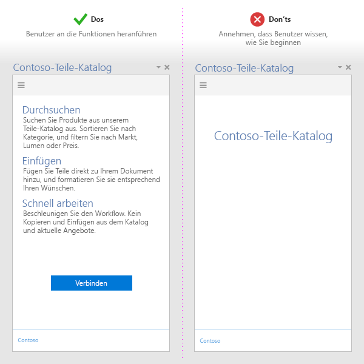
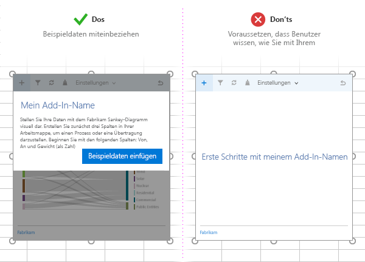
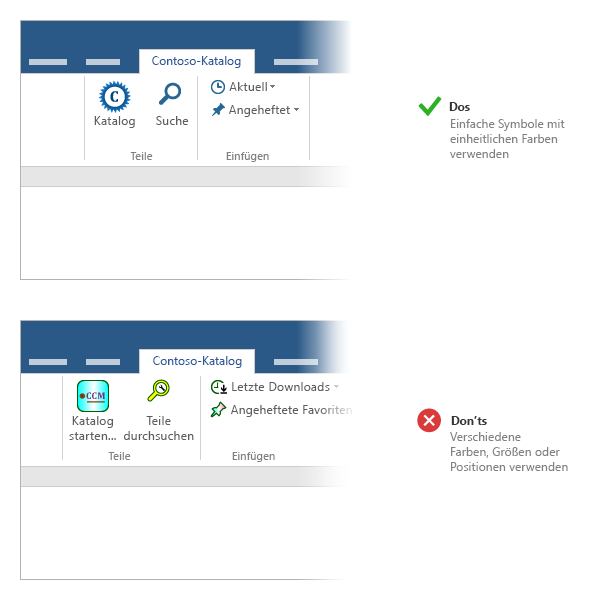
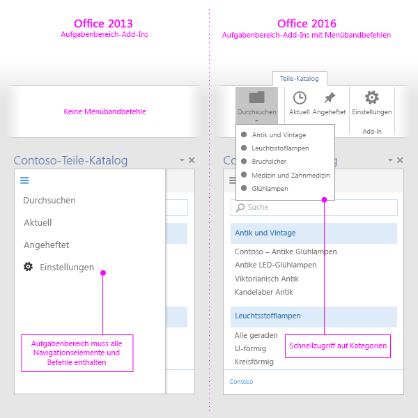

# Bewährte Methoden für die Entwicklung von Office-Add-Ins
Wenden Sie bewährte Methoden zum Erstellen von Office-Add-Ins an, die die Benutzeroberfläche optimieren.

 _**Gilt für:** apps for Office | Office Add-ins | Outlook_

Effektive Add-Ins bieten eine einzigartige und überzeugende Funktionalität, die Office-Anwendungen auf visuell ansprechende Weise erweitert. Stellen Sie eine ansprechende Benutzeroberfläche für die Benutzer zum Erstellen eines großartigen Add-Ins bereit, entwerfen Sie eine erstklassigen Benutzeroberfläche und optimieren Sie die Add-In-Leistung. Wenden Sie die in diesem Artikel beschriebenen bewährten Methoden zum Erstellen von Add-Ins an, mit denen die Benutzer ihre Aufgaben schnell und effizient durchführen können.

## Angeben eines klaren Nutzens

- Erstellen Sie Add-Ins, mit denen Benutzer Aufgaben schnell und effizient erledigen können. Konzentrieren Sie sich auf Szenarios, die für Office-Anwendungen sinnvoll sind. Beispiel:
    
      - Erledigen Sie wichtige Aufhaben schneller und einfacher und mit weniger Unterbrechungen.
    
  - Ermöglichen Sie neue Szenarios in Office.
    
  - Betten Sie ergänzende Dienste in Office-Hosts ein.
    
  - Verbessern Sie die Office-Benutzeroberfläche, um die Produktivität zu erhöhen.
    
- Stellen Sie sicher, dass der Nutzen des Add-Ins für Benutzer sofort ersichtlich ist, indem Sie ihnen ein [ansprechendes Erlebnis bei der ersten Ausführung ](#bk_firstrun) bieten.
    
- Erstellen Sie einen [effektiven Office Store-Eintrag ](http://msdn.microsoft.com/library/c66a6e6b-2e96-458f-8f8c-2a499fe942c9%28Office.15%29.aspx). Stellen Sie die Vorteile des Add-Ins im Titel und in der Beschreibung klar dar. Verlassen Sie sich nicht auf Ihre Marke, um die Funktionsweise Ihres Add-Ins zu kommunizieren. 
    

## Erstellen Sie einer ansprechenden Benutzeroberfläche

- Locken Sie neue Benutzer mit einer einfach zu verwendenden und intuitiven Benutzeroberfläche. Beachten Sie, dass Benutzer noch beim Herunterladen des Add-Ins entscheiden, ob Sie es überhaupt verwenden sollen. 
    
      - Kommunizieren Sie deutlich die Schritte, die die Benutzer ausführen müssen, um Ihr Add-In zu verwenden. Verwenden Sie Videos, Unterlagen, Seitenbereiche und andere Ressourcen, um Benutzer anzulocken. 
    
  - Verstärken Sie das Werteversprechen des Add-Ins beim Start anstatt die Benutzer lediglich zum Anmelden aufzufordern.
    
  - Stellen Sie für Benutzer eine anpassbare Benutzeroberfläche bereit.
    
    

  - Wenn das Inhalts-Add-in an Daten im Dokument des Benutzers gebunden ist, fügen Sie Beispieldaten oder eine Vorlage ein, damit Benutzer das zu verwendende Datenformat sehen können.
    
    

- Bieten Sie [kostenlose Testversionen an](http://msdn.microsoft.com/library/145d9466-3c3d-4294-aa23-82068a8e7ae9.aspx%28Office.15%29.aspx#sectionSection1). Wenn für Ihr Add-In ein Abonnement erforderlich ist, stellen Sie einige Funktionen ohne Abonnement zur Verfügung. 
    
- Einfacher Registrierungsvorgang. Sorgen Sie dafür, dass die Informationen im Vorfeld eingefügt werden (E-Mail, Anzeigename), und überspringen Sie die E-Mail-Verifizierung.
    
- Vermeiden von Popups. Wenn Sie diese verwenden müssen, führen Sie den Benutzer durch das Aktivieren Ihres Popups.
    
- Verwenden Sie [die Authentifizierung mithilfe von einmaligem Anmelden (SSO-Authentifizierung)](../outlook/authenticate-a-user-with-an-identity-token.md).
    

## Verwenden von Add-In-Befehlen

- Stellen Sie mehrere UI-Eingabepunkte für das Add-In unter Verwendung von [Add-In-Befehlen ](../outlook/add-in-commands-for-outlook.md) bereit.
    

 >**Hinweis**  Add-In-Befehle werden derzeit in Outlook 2016 unterstützt. Andere Hosts und Plattformen unterstützen die Add-In-Befehle derzeit nicht.

### Bewährte Methoden beim Erstellen von Add-In-Befehlen

- Verwenden Sie Befehle, die eine bestimmte Aktion mit einem klaren Ergebnis für den Benutzer darstellen. Mehrere Aktionen in einer einzelnen Schaltfläche sollten nicht kombiniert werden.
    
- Stellen Sie präzise Aktionen bereit, mit denen allgemeine Aufgaben im Add-In effizienter durchzuführen sind. Minimieren Sie die Anzahl der Schritte, die notwendig sind, um eine Aktion auszuführen.
    
- Verwenden Sie aussagekräftige Symbole und [Bezeichnungen](http://msdn.microsoft.com/library/8cef4fce-e6a1-459b-951f-47ac03ec95a6%28Office.15%29.aspx) für Schaltflächen, die die Aktion des Benutzers präzise beschreiben.
    
- Für alle Symbole:
    
      - Verwenden Sie das PNG-Format mit einem transparenten Hintergrund.
    
  - Schließen Sie [alle acht unterstützten Größen](https://msdn.microsoft.com/de-de/library/mt267547.aspx#bk_resources) mit ein. Dadurch kann die beste Lösung für alle unterstützten Auflösungen erstellt werden.
    
  - Verwenden Sie das visuelle Office-Layout. Beispiel:
    
      - Halten Sie die Formen einfach, und vermeiden Sie mehrere Farben. Komplexe Grafiken sind bei kleineren Größen und Auflösungen schwierig zu erkennen.
    
  - Verwenden Sie visuelle Metaphern nicht mehrfach für unterschiedliche Befehle. Das gleiche Symbol für verschiedene Aktionen führt zu Verwirrung.
    
  - Beschriften Sie Ihre Schaltflächen klar und prägnant. Verwenden Sie eine Kombination aus visuellen Informationen und Textinformationen, um die Bedeutung zu vermiteln.
    
  - Testen Sie Ihre Symbole in hellen und dunklen Office-Designs und bei kontrastreichen Einstellungen. Beachten Sie, dass Symbole auf dunklen Hintergründen oder bei hohem Kontrat vielleicht schwer zu erkennen sind.
    
  - Verwenden Sie konsistente Symbolgrößen und -positionen, um die visuelle Ausrichtung am Menüband zu unterstützen.
    

    

- Für Befehloberflächen-Erweiterungspunkte wie z. B. das Menüband:
    
      - Gruppieren Sie verwandte Aktionen unter einem Menüsteuerelement.
    
  - Benennen Sie Ihre Gruppe mit dem Namen des Add-Ins oder der spezifischen Funktionen, die das Add-In bereitstellt.
    
  - Erstellen Sie eine benutzerdefinierte Registerkarte, wenn Ihr Add-In keine geeignete Registerkarte für die Funktion bietet. Wenn Sie mehr als sechs Befehle anzeigen müssen, verwenden Sie eine benutzerdefinierte Registerkarte für einige oder alle Befehle.
    
     >**Hinweis**  In Outlook können Sie nur der Standardregisterkarte oder der benutzerdefinierten Registerkarte Gruppen hinzufügen.
  - Fügen Sie Unterstützung für Office-Hosts hinzu, die Add-In-Befehle untersützen, und welche, die dies nicht tun. Ein einzelnes Add-In mit einer einzelnen Manifestdatei funktioniert sowohl in Hosts, die Befehle unterstützen, und in solchen, die dies nicht tun. 
    
    
    Um die Manifestdatei für mehrere Hosts zu erstellen, müssen Sie die entsprechenden Metadaten bereitstellen:
    

      - Den oberen Abschnitt der Manifestdatei, für Hosts, die keine Befehle unterstützen.
    
  - Den Abschnitt [VersionOverrides](../outlook/manifests/define-add-in-commands.md), für Hosts, die Befehle unterstützen.
    

    
     >**Hinweis**  Auch wenn ein Manifest für beide Arten von Hosts verfügbar ist, müssen Sie, wenn es auf beide Arten von Hosts anzielen soll, zwei verschiedene Versionen des Add-Ins erstellen. Sie können den gleichen Code (HTML/CSS/JS) für beide Versionen verwenden. 

    So stellen Sie sicher, dass das Add-In in beiden Arten von Hosts ordnungsgemäß funktioniert 
    

      - Modularisieren Sie die Navigations- und die Befehlskomponenten, sodass Sie diese basierend auf der Version des Add-Ins ersetzen können, die geladen ist.
    
  - Ordnen Sie die Navigations- und Befehlselemente durchgehend in der gleichen Reihenfolge an. 
    
  - Stellen Sie sicher, dass die Navigations- und Befehlselemente zwischen dem Office-Host und der Aufgabenbereich-Benutzeroberfläche übertragen werden können.
    
- Verwenden Sie keine überflüssigen Schaltflächen zu Ihrem Add-In hinzu. 
    
     >**Hinweis**  Bei Add-Ins, die zu viel Speicherplatz belegen, kann die [Office Store-Validierung](http://msdn.microsoft.com/library/cd90836a-523e-42f5-ab02-5123cdf9fefe%28Office.15%29.aspx) möglicherweise nicht erfolgreich abgeschlossen werden.

## Anwenden von UX-Entwurfsprinzipien

- Stellen Sie sicher, dass das Design und die Funktionalität des Add-Ins die Office-Benutzeroberfläche ergänzt. Verwenden Sie das [Office UI Toolkit für Add-Ins und Web-Apps](http://msdn.microsoft.com/library/83ffc2f8-4c5b-4b50-9251-0f3093538944%28Office.15%29.aspx).
    
- Ziehen Sie Inhalt Chrom vor. Vermeiden Sie überflüssige Benutzeroberflächenelemente, die keinen Nutzen für die Benutzeroberfläche mit sich bringen.
    
- Überlassen Sie Benutzern das Steuern. Stellen Sie sicher, dass Benutzer wichtige Entscheidungen verstehen und Aktionen auf einfache Weise rückgängig machen können, die das Add-In ausführt.
    
- Setzen Sie Branding ein, um das Vertrauen der Benutzer zu gewinnen und sie zu lenken. Verwenden Sie Branding nicht dazu, Benutzer zu verwirren oder zu Werbezwecken.
    
- Vermeiden Sie das Scrollen. Optimieren Sie das Design für die Auflösung von 1366x768.
    
- Verwenden Sie keine nicht lizenzierten Bilder.
    
- Verwenden Sie eine [klare und einfache Sprache](http://msdn.microsoft.com/library/8cef4fce-e6a1-459b-951f-47ac03ec95a6%28Office.15%29.aspx) im Add-In.
    
- [Eingabehilfen](http://msdn.microsoft.com/library/3be1abbb-237a-48ec-8e17-72caa25a3cb2%28Office.15%29.aspx). Ermöglichen Sie allen Benutzern eine einfache Interaktion mit Ihrem Add-In, und integrieren Sie Eingabehilfstechnologien wie die Sprachausgabe. 
    
- Entwerfen Sie für alle Plattformen und Eingabemethoden, einschließlich Tastatur, Maus und [Toucheingabe](#bk_Touch). Stellen Sie sicher, dass Ihre Benutzeroberfläche auf verschiedenen Formfaktoren reagiert.
    

### Optimierung für Toucheingabe

- Verwenden Sie die [Context.touchEnabled ](http://msdn.microsoft.com/library/fd73f94b-7e4a-422c-afdb-fef6fba43766%28Office.15%29.aspx)-Eigenschaft, um zu ermitteln, ob in der Hostanwendung, die das Add-In ausführt, Toucheingabe zulässig ist.
    
     >**Hinweis**  Diese Eigenschaft wird in Outlook nicht unterstützt.
- Stellen Sie sicher, dass alle Steuerelemente für die Toucheingabe entsprechend angepasst sind. Schaltflächen haben beispielsweise ausreichende Touchziele, und Eingabefelder sind groß genug. 
    
- Vertrauen Sie nicht auf Nicht-Touchmethoden wie darauf zeigen oder mit der rechten Maustaste klicken.
    
- Stellen Sie sicher, dass das Add-In im Hoch- und Querformat funktioniert. Beachten Sie, dass auf Touchgeräten ein Teil des Add-Ins aufgrund der Bildschirmtastatur möglicherweise ausgeblendet ist.
    
- Testen Sie das Add-in auf einem echten Gerät mit [Querladen](../testing/sideload-an-office-add-in-on-ipad-and-mac.md).
    

 >**Hinweis**  Bei Verwendung von [Office UI Fabric](https://github.com/OfficeDev/Office-UI-Fabric) für Entwurfselemente, werden dort viele dieser Aspekte behandelt.

## Optimieren und Überwachen der Add-In-Leistung

- Schnelle Benutzeroberflächenantworten. Das Add-In sollte in 500 ms oder weniger geladen werden.
    
- Stellen Sie sicher, dass innerhalb von weniger als einer Sekunde eine Reaktion auf alle Benutzerinteraktionen folgt.
    
-  Stellen Sie Ladeanzeigen bei lang andauernden Vorgängen bereit.
    
- Verwenden Sie ein CDN für Hostimages, Ressourcen und Bibliotheken. Laden Sie so viel wie möglich von einem zentralen Ort.
    
- Befolgen Sie die standardmäßigen Webmethoden zur Optimierung Ihrer Webseite. Verwenden Sie in der Produktion nur kleinere Versionen der Bibliotheken. Laden Sie nur Ressourcen, die Sie benötigen, und optimieren Sie die Ladevorgänge dieser Ressourcen. 
    
- Wenn Vorgänge länger andauern, kommunizieren Sie dies dem Benutzer. Beachten Sie die in der folgenden Tabelle aufgeführten Schwellenwerte. Siehe auch [Ressourcengrenzen und Leistungsoptimierung für Office Add-Ins](../../docs/develop/resource-limits-and-performance-optimization.md)
    

|**Interaktionsklasse**|**Ziel**|**Obergrenze**|**Menschlichen Wahrnehmung**|
|:-----|:-----|:-----|:-----|
|Sofort|<=50 ms|100 ms|Ohne wahrgenommene Verzögerung.|
|Schnell|50-100 ms|200 ms|Minimal wahrgenommene Verzögerung. Keine Rückmeldung erforderlich.|
|Üblich|100-300 ms|500 ms|Schnell, aber zu langsam, um als schnell zu gelten. Keine Rückmeldung erforderlich.|
|Reaktionsfähig|300-500 ms|1 Sekunde|Nicht schnell, jedoch weiterhin reaktionsfähig. Keine Rückmeldung erforderlich.|
|Fortlaufend|>500 ms|5 Sekunden|Mittlere Wartezeit, wird nicht mehr als reaktionsfähig wahrgenommen. Möglicherweise eine Rückmeldung für den Benutzer erforderlich.|
|Nicht reaktionsfähig|>500 ms|10 Sekunden|Langsam, jedoch nicht langsam genug, um etwas anderes zu tun. Möglicherweise eine Rückmeldung erforderlich.|
|Erweiterte Wartezeit|>500 ms|>10 Sekunden|Langsam genug, um während des Wartens etwas anderes zu tun. Möglicherweise eine Rückmeldung erforderlich.|
|Wird lange ausgeführt|>5 ms|>1 Minute|Benutzer tun in der Zwischenzeit mit Sicherheit etwas anderes tun.|
- Überwachen Sie den Dienststatus, und verwenden Sie Telemetrie, um erfolgreiche Benutzerausführungen zu überwachen.
    

## Vermarkten des Add-Ins

- Verwenden Sie kurze und prägnante beschreibende Add-In-Titel. Verwenden Sie nicht mehr als 128 Zeichen.
    
- Schreiben Sie kurze, überzeugende Beschreibungen Ihres Add-Ins. Beantworten Sie dabei die Frage „Welches Problem wird mit diesem Add-In gelöst?".
    
- Vermitteln Sie das Wertversprechen des Add-Ins im Titel und der Beschreibung. Verlassen Sie sich nicht auf die Marke. 
    
- Erstellen Sie eine Website, damit die Benutzer das Add-In leichter finden und verwenden können.
    
- Veröffentlichen Sie das Add-In im [Office Store ](http://msdn.microsoft.com/library/ff075782-1303-4517-91cc-b3d730e9b9ae%28Office.15%29.aspx), und [werben Sie dafür](http://msdn.microsoft.com/library/b19e21f8-76f5-44e1-9971-bef79cad4c71%28Office.15%29.aspx) auf Ihrer Website.
    
