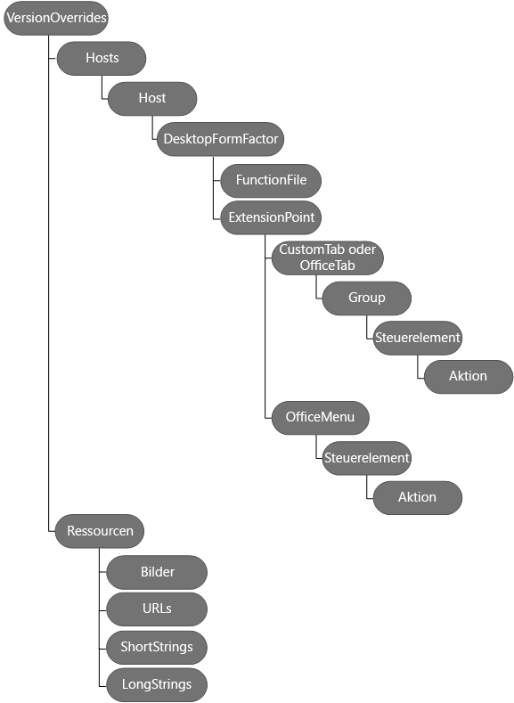

# Erstellen von Add-In-Befehlen in Ihrem Manifest für Excel, Word und PowerPoint (Vorschau)
Verwenden von  **VersionOverrides** in Ihrem Manifest, um Add-In-Befehle für Excel, Word und PowerPoint zu definieren.

 _**Gilt für:** apps for Office | Excel 2016 | Office Add-ins | PowerPoint 2016 | Word 2016_

Add-In-Befehle bieten eine einfache Möglichkeit zum Anpassen der Standard-Office-Benutzeroberfläche mit angegebenen UI-Elemente, die Aktionen ausführen. Sie können Add-In-Befehle für Folgendes verwenden:

- Erstellen von Benutzeroberflächenelementen oder Einstiegspunkten, durch die die Verwendung der Funktionalität Ihres Add-Ins vereinfacht wird.
    
- Hinzufügen von Schaltflächen oder einer Dropdownliste von Schaltflächen zum Menüband.
    
- Hinzufügen einzelner Menüelemente, von denen jedes optionale Untermenüs zu speziellen Kontextmenüs enthält.
    
- Ausführen von Aktionen, wenn der Add-In-Befehl ausgewählt wird. Sie können:
    
      - Ein oder mehrere Aufgabenbereich-Add-Ins für Benutzer anzeigen, mit denen diese interagieren können. Innerhalb Ihres Aufgabenbereich-Add-Ins können Sie HTML anzeigen, das Office-Benutzeroberfläche Fabric zum Erstellen einer benutzerdefinierten Benutzeroberfläche verwendet.
    
     _oder_
    
  - JavaScript-Code ausführen, der normalerweise ohne Anzeigen einer Benutzeroberfläche ausgeführt wird.
    
In diesem Artikel wird beschrieben, wie Sie Ihre Manifestdatei bearbeiten, um Add-In-Befehle zu definieren. Im folgenden Diagramm ist die Hierarchie von Elementen dargestellt, die zum Definieren von Add-In-Befehlen verwendet werden. Diese Elemente werden in diesem Artikel ausführlicher beschrieben.




## Schritt 1: Mit einem Beispiel starten

Es wird dringend empfohlen, mit einem Beispiel zu beginnen, das in [Office Add-in Commands Samples](https://github.com/OfficeDev/Office-Add-in-Command-Sample) bereitgestellt wird. Optional können Sie Ihr eigenes Manifest erstellen, indem Sie die Schritte in diesem Handbuch befolgen. Sie können Ihr Manifest anhand der XSD-Datei auf der Office Add-in Commands Samples-Website validieren. Lesen Sie unbedingt[Add-In-Befehle für Excel, Word und PowerPoint (Vorschau)](../../docs/design/add-in-commands-for-excel-and-word-preview.md), bevor Sie Add-In-Befehle verwenden.


## Schritt 2: Erstellen eines Aufgabenbereich-Add-Ins

Für den Einstieg in die Verwendung von Add-In-Befehlen, müssen Sie zuerst ein Aufgabenbereich-Add-In erstellen und dann das Manifest des Add-Ins, wie in diesem Artikel beschrieben, ändern. Sie können Add-In-Befehle nicht bei Inhalts-Add-Ins verwenden. Wenn Sie ein vorhandenes Manifest aktualisieren, können Sie das  **VersionOverrides**-Element zu dem Manifest hinzufügen, wie in [Schritt 3: Hinzufügen des VersionOverrides-Elements](#schritt-3-hinzufügen-des-versionoverrides-elements)beschrieben.

Das folgende Beispiel zeigt das Manifest eines Office 2013-Add-Ins. Es gibt keine Add-In-Befehle in diesem Manifest, da des kein  **VersionOverrides** -Element gibt. Office 2013 unterstützt keine Add-In-Befehle, aber durch Hinzufügen von **VersionOverrides** zu diesem Manifest, kann Ihr Add-In sowohl in Office 2013 als auch in Office 2016 ausgeführt werden. In Office 2013 zeigt Ihr Add-In keine Add-In-Befehle an und verwendet den Wert von **SourceLocation**, um das Add-In als einzelnes Aufgabenbereich-Add-In auszuführen. In Office 2016 (wenn kein  **VersionOverrides** -Element vorhanden ist), wird **SourceLocation** verwendet, um Ihr Add-In auszuführen. Wenn Sie jedoch **VersionOverrides** einschließen, zeigt Ihr Add-In nur die Add-In-Befehle an, und Ihr Add-In wird nicht als einzelnes Aufgabenbereich-Add-In angezeigt.


```XML
<OfficeApp xmlns="http://schemas.microsoft.com/office/appforoffice/1.1" xmlns:xsi="http://www.w3.org/2001/XMLSchema-instance" xmlns:bt="http://schemas.microsoft.com/office/officeappbasictypes/1.0" xmlns:ov="http://schemas.microsoft.com/office/taskpaneappversionoverrides" xsi:type="TaskPaneApp">
  <Id>657a32a9-ab8a-4579-ac9f-df1a11a64e52</Id>
  <Version>1.0.0.0</Version>
  <ProviderName>Contoso</ProviderName>
  <DefaultLocale>en-US</DefaultLocale>
  <DisplayName DefaultValue="Contoso Add-in Commands" />
  <Description DefaultValue="Contoso Add-in Commands"/>
  <IconUrl DefaultValue="~remoteAppUrl/Images/Icon_32.png" />
 
  <AppDomains>
    <AppDomain>AppDomain1</AppDomain>
    <AppDomain>AppDomain2</AppDomain>
    <AppDomain>AppDomain3</AppDomain>
  </AppDomains>
  <Hosts>
    <Host Name="Workbook" />
  </Hosts>
  <DefaultSettings>
    <SourceLocation DefaultValue="https://www.contoso.com/Pages/Home.aspx" />
  </DefaultSettings>
  <Permissions>ReadWriteDocument</Permissions>

 <!-- The VersionOverrides element is inserted at this location in the manifest. -->

</OfficeApp>

```


## Schritt 3: Hinzufügen des VersionOverrides-Elements


Das  **VersionOverrides** -Element ist das Stammelement, das die Definition Ihres Add-In-Befehls enthält. **VersionOverrides** ist ein untergeordnetes Element des **OfficeApp**-Elements im Manifest. In der folgenden Tabelle werden die Attribute des  **VersionOverrides** -Elements aufgelistet.


|
|
|**Attribut**|**Beschreibung**|
|:-----|:-----|
|**xmlns**|Erforderlich. Der Schemaspeicherort, der "http://schemas.microsoft.com/office/taskpaneappversionoverrides" sein muss.|
|**xsi:type**|Erforderlich. Die Schemaversion. Die in diesem Artikel beschriebene Version ist "VersionOverridesV1_0".|
In der folgenden Tabelle sind die untergeordneten Elemente von  **VersionOverrides** dargestellt.


|
|
|**Element**|**Beschreibung**|
|:-----|:-----|
|**Description**|Optional. Beschreibt Add-In. Dieses untergeordnete  **Description** -Element überschreibt das vorherige **Description** -Element im übergeordneten Abschnitt des Manifests. Das Attribut **resid** für dieses **Description** -Element ist auf die **id** eines **String**-Elements festgelegt. Das  **String**-Element enthält den Text für  **Description**.|
|**Requirements**|Optional. Gibt den minimalen Anforderungssatz und die Version von "Office.js" an, die für das Add-In erforderlich sind. Dieses untergeordnete  **Requirements** -Element überschreibt das **Requirements** -Element im übergeordneten Abschnitt des Manifests. Weitere Informationen finden Sie unter [Angeben von Office-Hosts und API-Anforderungen](../../docs/overview/specify-office-hosts-and-api-requirements.md).|
|**Hosts**|Erforderlich. Gibt eine Sammlung von Office-Hosts an. Das untergeordnete  **Hosts** -Element überschreibt das **Hosts** -Element im übergeordneten Abschnitt des Manifests. Sie müssen ein **xsi:type** -Attribut einschließen, das auf "Arbeitsmappe" oder auf "Dokument" festgelegt ist.|
|**Resources**|Definiert eine Sammlung von Ressourcen (Zeichenfolgen, URLs und Bilder), auf die andere Manifestelemente verweisen. Der Wert des  **Description** -Elements verweist beispielsweise auf ein untergeordnetes Element in **Resources**. Dieses  **Resources**-Element wird in [Schritt 7: Hinzufügen des Resources-Elements](#schritt-7-hinzufügen-des-resources-elements) später in diesem Artikel beschrieben.|
Das folgende Beispiel zeigt, wie Sie das  **VersionOverrides** -Element und dessen untergeordnete Elemente verwenden.


```XML
<OfficeApp>
...
  <VersionOverrides xmlns="http://schemas.microsoft.com/office/taskpaneappversionoverrides" xsi:type="VersionOverridesV1_0">
    <Description resid="residDescription" />
    <Requirements>
      <!-- add information about requirement sets -->
    </Requirements>
    <Hosts>
      <Host xsi:type="Workbook">
        <!-- add information about form factors -->
      </Host>
      <Host xsi:type="Document">
        <!-- add information about form factors -->
      </Host>
    </Hosts>
    <Resources> 
      <!-- add information about resources -->
   </Resources>
</VersionOverrides>
...
</OfficeApp>
```


## Schritt 4: Hinzufügen von Hosts-, Host- und DesktopFormFactor-Elementen


Das  **Hosts** -Element enthält ein oder mehrere **Host** -Elemente. Ein **Host** -Element gibt einen bestimmten Office-Host an. Das **Host** -Element enthält untergeordnete Elemente, die die Add-In-Befehle angeben, die angezeigt werden sollen, nachdem Ihr Add-In auf diesem Office-Host installiert wurde. Um dieselben Add-In-Befehle in zwei oder mehr unterschiedlichen Office-Hosts anzuzeigen, müssen Sie die untergeordneten Elemente in jedem **Host** -Element duplizieren.

Das  **DesktopFormFactor** -Element gibt die Einstellungen für ein Add-In an, das in Office unter Windows Desktop und Office Online (im Browser) ausgeführt wird.

Nachfolgend sehen Sie ein Beispiel von  **Hosts** -, **Host** - und **DesktopFormFactor** -Elementen.


```XML
<OfficeApp>
...
  <VersionOverrides xmlns="http://schemas.microsoft.com/office/taskpaneappversionoverrides" xsi:type="VersionOverridesV1_0">
  ...
    <Hosts>
      <Host xsi:type="Workbook">
        <DesktopFormFactor>

              <!-- information about FunctionFile and ExtensionPoint -->

        </DesktopFormFactor>
      </Host>
    </Hosts>
  ...
  </VersionOverrides>
...
</OfficeApp>
```


## Schritt 5: Hinzufügen des FunctionFile-Elements


Das  **FunctionFile** -Element gibt eine Datei an, die JavaScript-Code enthält, der ausgeführt werden soll, wenn ein Add-In-Befehl die **ExecuteFunction** -Aktion ausführt (unter [Steuerelemente für Schaltflächen](#steuerelemente-für-schaltflächen) finden Sie eine Beschreibung). Das **resid** -Attribut des **FunctionFile** -Attributs wird auf eine HTML-Datei festgelegt, die alle JavaScript-Dateien enthält, die für Ihre Add-In-Befehle erforderlich sind. Es ist nicht möglich, eine direkte Verknüpfung zu einer JavaScript-Datei herzustellen. Sie können nur zu einer HTML-Datei verlinken. Der Dateiname wird als **Url** -Element im **Resources** -Element angegeben.

Nachfolgend finden Sie ein Beispiel für das  **FunctionFile** -Element.


```XML
<DesktopFormFactor>
          <FunctionFile resid="residDesktopFuncUrl" />
          <ExtensionPoint xsi:type="PrimaryCommandSurface">
            <!-- information about this extension point -->
          </ExtensionPoint> 

          <!-- You can define more than one ExtensionPoint element as needed -->

        </DesktopFormFactor>
```


 >**Wichtig**  Vergewissern Sie sich, dass Ihr JavaScript-Code  `Office.initialize` aufruft.

Das JavaScript in der HTML-Datei, auf das von dem  **FunctionFile**-Element verwiesen wird, muss  `Office.initialize` aufrufen. Das **FunctionName**-Element (unter [Steuerelemente für Schaltflächen](#steuerelemente-für-schaltflächen) finden Sie eine Beschreibung) verwendet die Funktionen in **FunctionFile**.

Im folgenden Code wird gezeigt, wie die von  **FunctionName** verwendete Funktion implementiert wird.


```
<script>
        // The initialize function must be run each time a new page is loaded.
        (function () {
            Office.initialize = function (reason) {
               // If you need to initialize something you can do so here. 
            };
        })();

            // Your function must be in the global namespace.
        function writeText(event) {

            // Implement your custom code here. The following code is a simple example.  

            Office.context.document.setSelectedDataAsync("ExecuteFunction works. Button ID=" + event.source.id,
                function (asyncResult) {
                    var error = asyncResult.error;
                    if (asyncResult.status === "failed") {
                        // Show error message. 
                    }
                    else {
                        // Show success message.
                    }
                });
           // Calling event.completed is required. event.completed lets the platform know that processing has completed. 
	   event.completed();
        }

    </script>

```


 >**Wichtig**  Der Aufruf von  **event.completed** zeigt an, dass Sie das Ereignis erfolgreich bearbeitet haben. Wird eine Funktion mehrmals aufgerufen, beispielsweise durch mehrere Klicks auf denselben Add-In-Befehl, werden alle Ereignisse automatisch in die Warteschlange gestellt. Das erste Ereignis wird automatisch ausgeführt, während die anderen Ereignisse in der Warteschlange verbleiben. Wenn Ihre Funktion **event.completed** aufruft, wird der nächste Aufruf für diese Funktion in der Warteschlange ausgeführt. Sie müssen **event.completed** implementieren, andern falls wird die Funktion nicht ausgeführt.


## Schritt 6: Hinzufügen von ExtensionPoint-Elementen


Das  **ExtensionPoint** -Element definiert, wo Add-In-Befehle in der Office-Benutzeroberfläche angezeigt werden sollen. Sie können **ExtensionPoint**-Elemente mit den folgenden  **xsi:type**-Werten definieren:


-  **PrimaryCommandSurface**, der sich auf das Menüband in Office bezieht.
    
-  **ContextMenu**, das Kontextmenü, das angezeigt wird, wenn Sie mit der rechten Maustaste auf die Office-Benutzeroberfläche klicken.
    
In den folgenden Beispielen wird gezeigt, wie Sie das  **ExtensionPoint**-Element mit  **PrimaryCommandSurface**- und  **ContextMenu**-Attributwerten verwenden, und Sie sehen die untergeordneten Elemente, die für jedes Element verwendet werden sollten.


 >**Wichtig**  Geben Sie bei Elementen, die ein ID-Attribut enthalten, eine eindeutige ID an. Es wird empfohlen, dass Sie den Namen Ihres Unternehmens zusammen mit Ihrer ID verwenden. Verwenden Sie zum Beispiel folgendes Format:<ID der benutzerdefinierten Registerkarte=”MeinUnternehmensname.MeinGruppenname”>


```XML
 <ExtensionPoint xsi:type="PrimaryCommandSurface">
            <CustomTab id="Contoso Tab">
            <!-- If you want to use a default tab that comes with Office, remove the above CustomTab element, and then uncomment the following OfficeTab element -->
             <!-- <OfficeTab id="TabData"> -->
              <Label resid="residLabel4" />
              <Group id="Group1Id12">
                <Label resid="residLabel4" />
                <Icon>
                  <bt:Image size="16" resid="icon1_32x32" />
                  <bt:Image size="32" resid="icon1_32x32" />
                  <bt:Image size="80" resid="icon1_32x32" />
                </Icon>
                <Tooltip resid="residToolTip" />
                <Control xsi:type="Button" id="Button1Id1">
                  
                   <!-- information about the control -->
                </Control>   
                <!-- other controls, as needed -->                                    
              </Group>
            </CustomTab>
          </ExtensionPoint>

        <ExtensionPoint xsi:type="ContextMenu">
          <OfficeMenu id="ContextMenuCell">
            <Control xsi:type="Menu" id="ContextMenu2">
                   <!-- information about the control -->
            </Control>   
           <!-- other controls, as needed -->         
          </OfficeMenu>
         </ExtensionPoint>
```


|
|
|**Element**|**Beschreibung**|
|:-----|:-----|
|**CustomTab**|Erforderlich, wenn Sie eine benutzerdefinierte Registerkarte (unter Verwendung von  **PrimaryCommandSurface**) zum Menüband hinzufügen möchten. Wenn Sie das  **CustomTab**-Element verwenden, können Sie das  **OfficeTab**-Element nicht verwenden. Das  **ID** -Attribut ist erforderlich.|
|**OfficeTab**|Erforderlich, wenn Sie eine standardmäßige Office-Menübandregisterkarte (unter Verwendung von  **PrimaryCommandSurface**) erweitern möchten. Wenn Sie das  **OfficeTab**-Element, können Sie das  **CustomTab**-Element nicht verwenden.Informationen zu weiteren Registerkartenwerten zur Verwendung mit dem  **id**-Attribut finden Sie unter [Registerkartenwerte für standardmäßige Office-Menübandregisterkarten](#registerkartenwerte-für-standardmäßige-office-menübandregisterkarten).|
|**OfficeMenu**|Erforderlich, wenn Sie Add-In-Befehle zu einem Standardkontextmenü (unter Verwendung von  **ContextMenu**) hinzufügen. Das  **id**-Attribut muss festgelegt werden auf:
<ul xmlns:xlink="http://www.w3.org/1999/xlink" xmlns:mtps="http://msdn2.microsoft.com/mtps" xmlns:mshelp="http://msdn.microsoft.com/mshelp" xmlns:ddue="http://ddue.schemas.microsoft.com/authoring/2003/5" xmlns:msxsl="urn:schemas-microsoft-com:xslt"><li><p><span class="keyword">ContextMenuText</span> für Excel oder Word. Zeigt das Element im Kontextmenü an, wenn Text ausgewählt wird und der Benutzer dann mit der rechten Maustaste auf den ausgewählten Text klickt.</p></li><li><p><span class="keyword">ContextMenuCell</span> für Excel. Zeigt das Element im Kontextmenü an, wenn der Benutzer mit der rechten Maustaste in eine Zelle in dem Arbeitsblatt klickt.</p></li></ul>|
|**Group**|Eine Gruppe von Erweiterungspunkten der Benutzeroberfläche auf einer Registerkarte.Eine Gruppe kann über bis zu sechs Steuerelemente verfügen. Das **id** -Attribut ist erforderlich. Es handelt sich um eine Zeichenfolge mit maximal 125 Zeichen.|
|**Label**|Erforderlich. Die Bezeichnung der Gruppe. Das  **resid** -Attribut muss auf den Wert des **id**-Attributs eines  **String**-Elements festegelegt werden. Das  **String**-Element ist ein untergeordnetes Element vom  **ShortStrings**-Element, das ein untergeordnetes Element vom  **Resources** -Element ist.|
|**Icon**|Erforderlich. Gibt das Gruppensymbol an, das auf kleinen Geräten verwendet wird, oder wenn zu viele Schaltflächen angezeigt werden. Das  **resid** -Attribut muss auf den Wert des **id**-Attributs eines  **Image**-Elements festgelegt werden. Das  **Image**-Element ist ein untergeordnetes Element vom  **Images**-Element, das ein untergeordnetes Element vom  **Resources** -Element ist. Das **size**-Attribut gibt die Größe des Bilds in Pixeln an. Es sind drei Bildgrößen erforderlich: 16, 32 und 80. Es werden auch fünf optionale Größen unterstützt: 20, 24, 40, 48 und 64.|
|**Tooltip**|Optional. Die QuickInfo der Gruppe. Das  **resid** -Attribut muss auf den Wert des **id**-Attributs eines  **String**-Elements festgelegt werden. Das  **String**-Element ist ein untergeordnetes Element vom  **LongStrings**-Element, das ein untergeordnetes Element vom  **Resources** -Element ist.|
|**Control**|Für jede Gruppe ist mindestens ein Steuerelement erforderlich. Ein  **Control**-Element kann entweder eine  **Button** oder ein **Menu** sein. Verwenden Sie **Menu**, um eine Dropdownliste von Steuerelemente für Schaltflächen anzugeben. Derzeit werden nur Schaltflächen und Menüs unterstützt.Weitere Informationen finden Sie in den Abschnitten [Steuerelemente für Schaltflächen](#steuerelemente-für-schaltflächen) und [Menüsteuerelemente](#menüsteuerelemente).
 >**Hinweis**  Zur Erleichterung der Fehlerbehebung wird empfohlen, dass das  **Control**-Element und die zugehörigen untergeordneten  **Resources** -Elemente jeweils einzeln hinzugefügt werden.

|

### Steuerelemente für Schaltflächen


Eine Schaltfläche führt eine einzelne Aktion aus, wenn der Benutzer darauf klickt. Es kann entweder eine JavaScript-Funktion ausgeführt oder ein Aufgabenbereich angezeigt werden. Im folgenden Beispiel wird gezeigt, wie zwei Schaltflächen definiert werden. Die erste Schaltfläche führt eine JavaScript-Funktion aus, ohne eine Benutzeroberfläche anzuzeigen, bei der zweiten Schaltfläche wird ein Aufgabenbereich angezeigt. Im  **Control**-Element:


- Das  **type**-Attribut ist erforderlich und muss auf  **Button** festgelegt werden.
    
- Das  **ID** -Attribut des **Control**-Elements ist eine Zeichenfolge mit maximal 125 Zeichen.
    

```XML
        <!-- Define a control that calls a JavaScript function. -->

                 <Control xsi:type="Button" id="Button1Id1">
                  <Label resid="residLabel" />
                  <Tooltip resid="residToolTip" />
                  <Supertip>
                    <Title resid="residLabel" />
                    <Description resid="residToolTip" />
                  </Supertip>
                  <Icon>
                    <bt:Image size="16" resid="icon1_32x32" />
                    <bt:Image size="32" resid="icon1_32x32" />
                    <bt:Image size="80" resid="icon1_32x32" />
                  </Icon>
                  <Action xsi:type="ExecuteFunction">
                    <FunctionName>getData</FunctionName>
                  </Action>
                </Control>


                <!-- Define a control that shows a task pane. -->

                <Control xsi:type="Button" id="Button2Id1">
                  <Label resid="residLabel2" />
                  <Tooltip resid="residToolTip" />
                  <Supertip>
                    <Title resid="residLabel" />
                    <Description resid="residToolTip" />
                  </Supertip>
                  <Icon>
                    <bt:Image size="16" resid="icon2_32x32" />
                    <bt:Image size="32" resid="icon2_32x32" />
                    <bt:Image size="80" resid="icon2_32x32" />
                  </Icon>
                  <Action xsi:type="ShowTaskpane">
                    <SourceLocation resid="residUnitConverterUrl" />
                  </Action>
                </Control>
```


|
|
|**Elemente**|**Beschreibung**|
|:-----|:-----|
|**Label**|Erforderlich. Der Text für die Schaltfläche. Das  **resid** -Attribut muss auf den Wert des **id**-Attributs eines  **String**-Elements festgelegt werden. Das  **String**-Element ist ein untergeordnetes Element vom  **ShortStrings**-Element, das ein untergeordnetes Element vom  **Resources** -Element ist.|
|**Tooltip**|Optional. Die QuickInfo für die Schaltfläche. Das  **resid** -Attribut muss auf den Wert des **id**-Attributs eines  **String**-Elements festgelegt werden. Das  **String**-Element ist ein untergeordnetes Element vom  **LongStrings**-Element, das ein untergeordnetes Element vom  **Resources** -Element ist.|
|**Supertip**|Erforderlich. Der SuperTip für diese Schaltfläche, der mit Folgendem definiert wird
<ul xmlns:xlink="http://www.w3.org/1999/xlink" xmlns:mtps="http://msdn2.microsoft.com/mtps" xmlns:mshelp="http://msdn.microsoft.com/mshelp" xmlns:ddue="http://ddue.schemas.microsoft.com/authoring/2003/5" xmlns:msxsl="urn:schemas-microsoft-com:xslt"><li><p><span class="keyword">Title</span></p><p>Erforderlich. Der Text für den SuperTip. Das <b>resid</b> -Attribut muss auf den Wert des <span class="keyword">id</span>-Attributs eines <span class="keyword">String</span>-Elements festgelegt werden. Das <span class="keyword">String</span>-Element ist ein untergeordnetes Element vom <span class="keyword">ShortStrings</span>-Element, das ein untergeordnetes Element vom <b>Resources</b> -Element ist.</p></li><li><p><span class="keyword">Description</span></p><p>Erforderlich. Die Beschreibung für den SuperTip. Das <b>resid</b> -Attribut muss auf den Wert des <span class="keyword">id</span>-Attributs eines <span class="keyword">String</span>-Elements festgelegt werden. Das <span class="keyword">String</span>-Element ist ein untergeordnetes Element vom <span class="keyword">LongStrings</span>-Element, das ein untergeordnetes Element vom <b>Resources</b> -Element ist.</p></li></ul>|
|**Icon**|Erforderlich. Enthält die  **Image**-Elemente für die Schaltfläche. Bilddateien muss das PNG-Format aufweisen.
<ul xmlns:xlink="http://www.w3.org/1999/xlink" xmlns:mtps="http://msdn2.microsoft.com/mtps" xmlns:mshelp="http://msdn.microsoft.com/mshelp" xmlns:ddue="http://ddue.schemas.microsoft.com/authoring/2003/5" xmlns:msxsl="urn:schemas-microsoft-com:xslt"><li><p><span class="keyword">Image</span></p><p>Definiert ein Bild, das auf der Schaltfläche angezeigt wird. Das <b>resid</b> -Attribut muss auf den Wert des <span class="keyword">id</span>-Attributs eines <span class="keyword">Image</span>-Elements festgelegt werden. Das <span class="keyword">Image</span>-Element  ist ein untergeordnetes Element vom <span class="keyword">Images</span>-Element, das ein untergeordnetes Element vom <b>Resources</b> -Element ist. Das <span class="keyword">size</span>-Attribut gibt die Größe des Bilds in Pixeln an. Es sind drei Bildgrößen erforderlich: 16, 32 und 80. Es werden auch fünf optionale Größen unterstützt: 20, 24, 40, 48 und 64.</p></li></ul>|
|**Action**|Erforderlich. Gibt die auszuführende Aktion an, wenn der Benutzer die Schaltfläche auswählt. Sie können einen der folgenden Werte für das  **xsi:type**-Attribut angeben:
<ul xmlns:xlink="http://www.w3.org/1999/xlink" xmlns:mtps="http://msdn2.microsoft.com/mtps" xmlns:mshelp="http://msdn.microsoft.com/mshelp" xmlns:ddue="http://ddue.schemas.microsoft.com/authoring/2003/5" xmlns:msxsl="urn:schemas-microsoft-com:xslt"><li><p><span class="keyword">ExecuteFunction</span>, wodurch eine JavaScript-Funktion in der Datei ausgeführt wird, auf die von <span class="keyword">FunctionFile</span> verwiesen wird. <span class="keyword">ExecuteFunction</span> zeigt keine Benutzeroberfläche an. Das untergeordnete <span class="keyword">FunctionName</span>-Element gibt den Namen der auszuführenden Funktion an.</p></li><li><p><span class="keyword">ShowTaskPane</span>, wodurch ein Aufgabenbereich-Add-In angezeigt wird. Das untergeordnete <span class="keyword">SourceLocation</span>-Element gibt den Speicherort der Quelldatei des Aufgabenbereich-Add-Ins an, das angezeigt werden soll. Das <b>resid</b> -Attribut muss auf den Wert des <span class="keyword">id</span>-Attributs eines <span class="keyword">Url</span>-Elements im <span class="keyword">Urls</span>-Element im <b>Resources</b> -Element festgelegt werden.</p></li></ul>|

### Menüsteuerelemente


Ein  **Menu**-Steuerelement kann entweder mit  **PrimaryCommandSurface** oder **ContextMenu** verwendet werden und definiert:


- Ein Menüelement auf der Stammebene.
    
- Eine Liste der Untermenüelemente.
    
Bei Verwendung mit  **PrimaryCommandSurface** zeigt das Menüelement auf der Stammebene eine Schaltfläche auf dem Menüband an. Wenn die Schaltfläche ausgewählt wird, wird das Untermenü als eine Dropdownliste angezeigt. Bei Verwendung mit **ContextMenu** wird ein Menüelement mit einem Untermenü im Kontextmenü eingefügt. In beiden Fällen können einzelne Untermenüelemente entweder eine JavaScript-Funktion ausführen oder einen Aufgabenbereich anzeigen. Derzeit wird nur eine Ebene von Untermenüs unterstützt.

Das folgende Beispiel zeigt, wie ein Menüelement mit zwei Untermenüelementen definiert wird. Das erste Untermenüelement zeigt einen Aufgabenbereich an, das zweite Untermenüelement führt eine JavaScript-Funktion aus. Im  **Control**-Element:


- Das  **xsi:type**-Attribut ist erforderlich und muss auf  **Menu** festgelegt werden.
    
- Das  **ID** -Attribut ist eine Zeichenfolge mit maximal 125 Zeichen.
    


```
<Control xsi:type="Menu" id="TestMenu2">
              <Label resid="residLabel3" />
              <Tooltip resid="residToolTip" />
              <Supertip>
                <Title resid="residLabel" />
                <Description resid="residToolTip" />
              </Supertip>
              <Icon>
                <bt:Image size="16" resid="icon1_32x32" />
                <bt:Image size="32" resid="icon1_32x32" />
                <bt:Image size="80" resid="icon1_32x32" />
              </Icon>
              <Items>
                <Item id="showGallery2">
                  <Label resid="residLabel3"/>
                  <Supertip>
                    <Title resid="residLabel" />
                    <Description resid="residToolTip" />
                  </Supertip>
                  <Icon>
                    <bt:Image size="16" resid="icon1_32x32" />
                    <bt:Image size="32" resid="icon1_32x32" />
                    <bt:Image size="80" resid="icon1_32x32" />
                  </Icon>
                  <Action xsi:type="ShowTaskpane">
                    <TaskpaneId>MyTaskPaneID1</TaskpaneId>
                    <SourceLocation resid="residUnitConverterUrl" />
                  </Action>
                </Item>
              <Item id="showGallery3">
                  <Label resid="residLabel5"/>
                  <Supertip>
                    <Title resid="residLabel" />
                    <Description resid="residToolTip" />
                  </Supertip>
                  <Icon>
                    <bt:Image size="16" resid="icon4_32x32" />
                    <bt:Image size="32" resid="icon4_32x32" />
                    <bt:Image size="80" resid="icon4_32x32" />
                  </Icon>
                  <Action xsi:type="ExecuteFunction">
                    <FunctionName>getButton</FunctionName>
                  </Action>
                </Item>
              </Items>
            </Control>

```


|
|
|**Elemente**|**Beschreibung**|
|:-----|:-----|
|**Label**|Erforderlich. Der Text des Menüelements auf Stammebene. Das  **resid** -Attribut muss auf den Wert des **id**-Attributs eines  **String**-Elements festgelegt werden. Das  **String**-Element ist ein untergeordnetes Element vom  **ShortStrings**-Element, das ein untergeordnetes Element vom  **Resources** -Element ist.|
|**Tooltip**|Optional. Die QuickInfo für das Menü. Das  **resid** -Attribut muss auf den Wert des **id**-Attributs eines  **String**-Elements festgelegt werden. Das  **String**-Element ist ein untergeordnetes Element vom  **LongStrings**-Element, das ein untergeordnetes Element vom  **Resources** -Element ist.|
|**SuperTip**|Erforderlich. Der SuperTip für das Menü, der mit Folgendem definiert wird
<ul xmlns:xlink="http://www.w3.org/1999/xlink" xmlns:mtps="http://msdn2.microsoft.com/mtps" xmlns:mshelp="http://msdn.microsoft.com/mshelp" xmlns:ddue="http://ddue.schemas.microsoft.com/authoring/2003/5" xmlns:msxsl="urn:schemas-microsoft-com:xslt"><li><p><span class="keyword">Title</span></p><p>Erforderlich. Der Text des SuperTips. Das <b>resid</b> -Attribut muss auf den Wert des <span class="keyword">id</span>-Attributs eines <span class="keyword">String</span>-Elements festgelegt werden. Das <span class="keyword">String</span>-Element ist ein untergeordnetes Element vom <span class="keyword">ShortStrings</span>-Element, das ein untergeordnetes Element vom <b>Resources</b> -Element ist.</p></li><li><p><span class="keyword">Description</span></p><p>Erforderlich. Die Beschreibung für den SuperTip. Das <b>resid</b> -Attribut muss auf den Wert des <span class="keyword">id</span>-Attributs eines <span class="keyword">String</span>-Elements festgelegt werden. Das <span class="keyword">String</span>-Element ist ein untergeordnetes Element vom <span class="keyword">LongStrings</span>-Element, das ein untergeordnetes Element vom <b>Resources</b> -Element ist.</p></li></ul>|
|**Icon**|Erforderlich. Enthält die  **Image**-Elemente für das Menü. Bilddateien muss das PNG-Format aufweisen.
<ul xmlns:xlink="http://www.w3.org/1999/xlink" xmlns:mtps="http://msdn2.microsoft.com/mtps" xmlns:mshelp="http://msdn.microsoft.com/mshelp" xmlns:ddue="http://ddue.schemas.microsoft.com/authoring/2003/5" xmlns:msxsl="urn:schemas-microsoft-com:xslt"><li><p><span class="keyword">Image</span></p><p>Ein Bild für das Menü. Das <b>resid</b> -Attribut muss auf den Wert des <span class="keyword">id</span>-Attributs eines <span class="keyword">Image</span>-Elements im <span class="keyword">Images</span>-Element festgelegt werden. Das <span class="keyword">Image</span>-Element ist ein untergeordnetes Element vom <span class="keyword">Images</span>-Element, das ein untergeordnetes Element vom <b>Resources</b> -Element ist. Das <span class="keyword">size</span>-Attribut gibt die Größe des Bilds in Pixeln an. Es sind drei Bildgrößen (in Pixeln) erforderlich: 16, 32 und 80. Es werden auch fünf optionale Größen unterstützt: 20, 24, 40, 48 und 64.</p></li></ul>|
|**Items**|Erforderlich. Enthält die  **Item**-Elemente für jedes Untermenüelement. Jedes  **Item**-Element enthält dieselben untergeordneten Elemente wie [Steuerelemente für Schaltflächen](#steuerelemente-für-schaltflächen).|

## Schritt 7: Hinzufügen des Resources-Elements


Das  **Resources** -Element enthält Ressourcen, die von den verschiedenen untergeordneten Elementen des **VersionOverrides** -Elements verwendet werden. Ressourcen umfassen Symbole, Zeichenfolgen und URLs. Ein Element in der Manifestdatei kann eine Ressource durch einen Verweis auf die **id** der Ressource verwenden. Mithilfe der **id** kann das Manifest organisiert werden, insbesondere dann, wenn es verschiedene Versionen der Ressource für unterschiedliche Gebietsschemas gibt. Eine **id** kann maximal 32 Zeichen aufweisen.

Nachfolgend sehen Sie ein Beispiel für die Verwendung des  **Resources** -Elements. Jede Ressource kann ein oder mehrere untergeordnete **Override** -Elemente umfassen, um eine unterschiedliche Ressource für ein bestimmtes Gebietsschema zu definieren.


```XML
<Resources>
      <bt:Images>
        <bt:Image id="icon1_16x16" DefaultValue="https://www.contoso.com/Images/icon_default.png">
          <bt:Override Locale="ja-jp" Value="https://www.contoso.com/Images/ja-jp16-icon_default.png" />
        </bt:Image>
        <bt:Image id="icon1_32x32" DefaultValue="https://www.contoso.com/Images/icon_default.png">
          <bt:Override Locale="ja-jp" Value="https://www.contoso.com/Images/ja-jp32-icon_default.png" />
        </bt:Image>
        <bt:Image id="icon1_80x80" DefaultValue="https://www.contoso.com/Images/icon_default.png">
          <bt:Override Locale="ja-jp" Value="https://www.contoso.com/Images/ja-jp80-icon_default.png" />
        </bt:Image>        
      </bt:Images>
      <bt:Urls>
        <bt:Url id="residDesktopFuncUrl" DefaultValue="https://www.contoso.com/Pages/Home.aspx">
          <bt:Override Locale="ja-jp" Value="https://www.contoso.com/Pages/Home.aspx" />
        </bt:Url>        
      </bt:Urls>
      <bt:ShortStrings>
        <bt:String id="residLabel" DefaultValue="GetData">
          <bt:Override Locale="ja-jp" Value="JA-JP-GetData" />
        </bt:String>      
      </bt:ShortStrings>
      <bt:LongStrings>
        <bt:String id="residToolTip" DefaultValue="Get data for your document.">
          <bt:Override Locale="ja-jp" Value="JA-JP - Get data for your document." />
        </bt:String>
      </bt:LongStrings>
    </Resources>
```


|
|
|**Ressource**|**Beschreibung**|
|:-----|:-----|
|**Images**/ **Image**|Stellt die HTTPS-URL zu einer Bilddatei bereit. Jedes Bild muss die drei erforderlichen Bildgrößen definieren:
<ul xmlns:xlink="http://www.w3.org/1999/xlink" xmlns:mtps="http://msdn2.microsoft.com/mtps" xmlns:mshelp="http://msdn.microsoft.com/mshelp" xmlns:ddue="http://ddue.schemas.microsoft.com/authoring/2003/5" xmlns:msxsl="urn:schemas-microsoft-com:xslt"><li><p>16 x 16</p></li><li><p>32 x 32</p></li><li><p>80 × 80</p></li></ul>Die folgenden Bildgrößen werden ebenfalls unterstützt, sind aber nicht erforderlich:
<ul xmlns:xlink="http://www.w3.org/1999/xlink" xmlns:mtps="http://msdn2.microsoft.com/mtps" xmlns:mshelp="http://msdn.microsoft.com/mshelp" xmlns:ddue="http://ddue.schemas.microsoft.com/authoring/2003/5" xmlns:msxsl="urn:schemas-microsoft-com:xslt"><li><p>20 × 20</p></li><li><p>24 x 24</p></li><li><p>40 × 40</p></li><li><p>48 × 48</p></li><li><p>64 x 64</p></li></ul>|
|**Urls**/ **Url**|Stellt einen HTTPS-URL-Speicherort bereit. Eine URL kann maximal 2.048 Zeichen lang sein.|
|**ShortStrings**/ **String**|Der Text für die Elemente  **Bezeichnung** und **Titel**. Jede **String** enthält maximal 125 Zeichen.|
|**LongStrings**/ **String**|Der Text für die Elemente  **Tooltip** und **Description**. Jede **String** enthält maximal 250 Zeichen.|


 >**Hinweis**  Sie müssen Secure Sockets Layer (SSL) für alle URLs in den Elementen  **Image** und **Url** verwenden.


## Registerkartenwerte für standardmäßige Office-Menübandregisterkarten


In Excel und Word können Sie Ihre Add-In-Befehle auf dem Menüband mithilfe der standardmäßigen Office-Benutzeroberflächen-Registerkarten hinzufügen. In der folgenden Tabelle sind die Werte aufgeführt, die Sie für das  **id**-Attribut des  **OfficeTab**-Elements verwenden können. Bei den Registerkartenwerten wird die Groß- und Kleinschreibung beachtet.


|**Office-Hostanwendung**|**Registerkartenwerte**|
|:-----|:-----|
|Excel|**TabHome** **TabInsert** **TabPageLayoutExcel** **TabFormulas** **TabData** **TabReview** **TabView** **TabDeveloper** **TabAddIns** **TabPrintPreview** **TabBackgroundRemoval**|
|Word|**TabHome** **TabInsert** **TabWordDesign** **TabPageLayoutWord** **TabReferences** **TabMailings** **TabReviewWord** **TabView** **TabDeveloper** **TabAddIns** **TabBlogPost** **TabBlogInsert** **TabPrintPreview** **TabOutlining** **TabConflicts** **TabBackgroundRemoval** **TabBroadcastPresentation**|
|PowerPoint|**TabHome** **TabInsert** **TabDesign** **TabTransitions** **TabAnimations** **TabSlideShow** **TabReview** **TabView** **TabDeveloper** **TabAddIns** **TabPrintPreview** **TabMerge** **TabGrayscale** **TabBlackAndWhite** **TabBroadcastPresentation** **TabSlideMaster** **TabHandoutMaster** **TabNotesMaster** **TabBackgroundRemoval** **TabSlideMasterHome**|

## Zusätzliche Ressourcen


- [Add-In-Befehle für Excel, Word und PowerPoint (Vorschau)](../../docs/design/add-in-commands-for-excel-and-word-preview.md)
    
- [Definieren von Add-In-Befehlen in Ihrem Outlook-Add-In-Manifest](../outlook/manifests/define-add-in-commands.md)
    
