# Interaktionsmuster für Office-Add-Ins
Informationen zu den Szenarien für gängige UX-Interaktionsmuster in Inhalts-, Aufgabenbereich- und Outlook-Add-Ins

 _**Gilt für:** Access apps for SharePoint | apps for Office | Excel | Office Add-ins | Outlook | PowerPoint | Project | Word_

Office-Add-Ins können Dokumenterstellungs- und Produktivitätsumgebungen optimieren sowie Inhalte in Office-Hostanwendungen mit größeren webbasierten Workflows verbinden. Es gibt eine Reihe gängiger Szenarien für Inhalts-, Aufgabenbereich- und Outlook-Add-Ins, die Sie möglicherweise entwickeln. In diesem Artikel werden einige der gängigsten Szenarien beschrieben und empfohlene Interaktionsmuster für die Add-In-UX. Sie können diese Interaktionsmuster je nach Ihren einzigartigen Szenarien unterteilen, kombinieren oder beliebig mischen.

 **Gängige Add-In-Szenarien**

|**Add-In-Typ**|**Gängige Szenarien**|
|:-----|:-----|
|Inhalt|
<ul xmlns:xlink="http://www.w3.org/1999/xlink" xmlns:mtps="http://msdn2.microsoft.com/mtps" xmlns:mshelp="http://msdn.microsoft.com/mshelp" xmlns:ddue="http://ddue.schemas.microsoft.com/authoring/2003/5" xmlns:msxsl="urn:schemas-microsoft-com:xslt"><li>
Visualisieren von Daten
</li><li>
Widgets und Tools
</li></ul>|
|Aufgabenbereich|
<ul xmlns:xlink="http://www.w3.org/1999/xlink" xmlns:mtps="http://msdn2.microsoft.com/mtps" xmlns:mshelp="http://msdn.microsoft.com/mshelp" xmlns:ddue="http://ddue.schemas.microsoft.com/authoring/2003/5" xmlns:msxsl="urn:schemas-microsoft-com:xslt"><li>
Umwandeln und Verarbeiten von Daten
</li><li>
Effektivere und effizientere Dokumenterstellung
</li><li>
Suchen nach Inhalten und Einfügen von Medien
</li><li>
Veröffentlichen oder Hochladen von Inhalten in einen Webdienst
</li></ul>|
|Outlook|
<ul xmlns:xlink="http://www.w3.org/1999/xlink" xmlns:mtps="http://msdn2.microsoft.com/mtps" xmlns:mshelp="http://msdn.microsoft.com/mshelp" xmlns:ddue="http://ddue.schemas.microsoft.com/authoring/2003/5" xmlns:msxsl="urn:schemas-microsoft-com:xslt"><li>
Bridging zwischen E-Mail-Inhalten und einer externen Anwendung
</li><li>
Vermitteln weiterer Informationen über die Inhalte in einer E-Mail-Nachricht oder einen Termin
</li><li>
Bereitstellen von Informationen, die Ihnen zu mehr Produktivität verhelfen
</li></ul>|

## Visualisieren von Daten mit einem Inhalts-Add-In

Dieses Beispiel zeigt ein Inhalts-Add-in für Excel zum Generieren eines Diagramms anhand von Daten in einem Tabellenblatt.

In diesem Interaktionsmuster wird das Add-in erst aktiv, nachdem Sie Daten zum Generieren des Diagramms ausgewählt und an das Add-in gebunden haben. Es ist wichtig, dass der Zweck des Add-ins und die Schritte für die Aktivierung in der Ausgangsansicht des Add-ins ersichtlich sind. 

|||
|:-----|:-----|
|
**Inhalts-Add-in für Excel zum Generieren eines Diagramms anhand von Daten in einem Tabellenblatt**
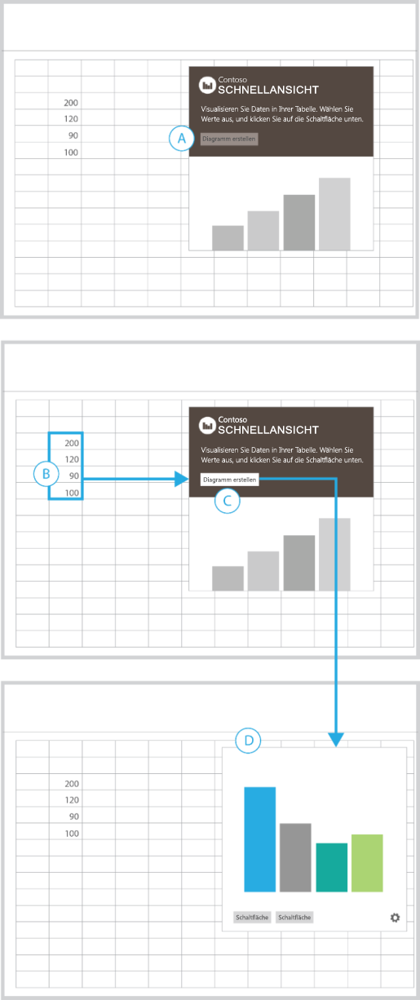|
<ul xmlns:xlink="http://www.w3.org/1999/xlink" xmlns:mtps="http://msdn2.microsoft.com/mtps" xmlns:mshelp="http://msdn.microsoft.com/mshelp" xmlns:ddue="http://ddue.schemas.microsoft.com/authoring/2003/5" xmlns:msxsl="urn:schemas-microsoft-com:xslt"><li>
Um zu unterstreichen, dass vor Auswahl der Schaltfläche eine Aktion ausgeführt werden muss, zeigen Sie Anweisungen zusammen einer Schaltfläche vom Typ "Deaktiviert" (A) an.
</li><li>
Nachdem Sie einen Zellbereich ausgewählt haben, wird die Schaltfläche Diagramm erstellen aktiv (B – C).
</li><li>
Die Visualisierung füllt den Container aus und ersetzt die vorherige Ansicht (D).
</li><li>
Zeigen Sie ggf. zusätzliche Benutzeroberflächenelemente am unteren Rand des Add-ins zusammen mit einer Einstellungsschaltfläche (Zahnrad) an, um zu einer Ansicht zu führen, in der Sie das Add-in zurücksetzen oder verwalten können.
</li></ul>Am besten geeignet für:
<ul xmlns:xlink="http://www.w3.org/1999/xlink" xmlns:mtps="http://msdn2.microsoft.com/mtps" xmlns:mshelp="http://msdn.microsoft.com/mshelp" xmlns:ddue="http://ddue.schemas.microsoft.com/authoring/2003/5" xmlns:msxsl="urn:schemas-microsoft-com:xslt"><li>
Add-ins, bei denen Sie vor der Aktivierung Daten auswählen müssen
</li></ul>|

## Umwandeln von Inhalten mit einem Aufgabenbereich-Add-In

Dieses Beispiel zeigt ein Aufgabenbereich-Add-in, das Text in Ihrem Dokument in eine andere Sprache übersetzt.

In diesem Interaktionsmuster müssen Sie zuerst den zu übersetzenden Text im Dokument auswählen.

|||
|:-----|:-----|
|
**Aufgabenbereich-Add-in, das Text in Ihrem Dokument in eine andere Sprache übersetzt**
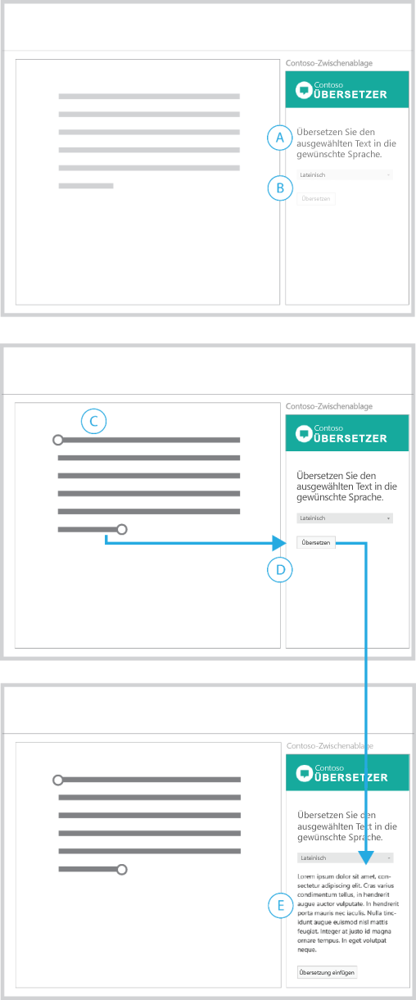|
<ul xmlns:xlink="http://www.w3.org/1999/xlink" xmlns:mtps="http://msdn2.microsoft.com/mtps" xmlns:mshelp="http://msdn.microsoft.com/mshelp" xmlns:ddue="http://ddue.schemas.microsoft.com/authoring/2003/5" xmlns:msxsl="urn:schemas-microsoft-com:xslt"><li>
Vermitteln Sie den Zweck des Add-ins in einer Überschrift, und weisen Sie darauf hin, dass Sie zuerst eine Auswahl treffen müssen (A).
</li><li>
Das Sprachmenü und die Schaltfläche Translate (Übersetzen) sind deaktiviert. Dies unterstreicht, dass Sie zunächst eine Aktion ausführen müssen, bevor Sie fortfahren können. Nachdem Sie Inhalte im Dokument ausgewählt haben, werden diese beiden Elemente aktiv (D).
</li><li>
Nachdem Sie Translate (Übersetzen) ausgewählt haben, wird die Benutzeroberfläche eingeblendet. Sie enthält die übersetzten Inhalte sowie eine Schaltfläche, mit der diese wieder in das Dokument eingefügt werden können (E).
</li><li>
Sie können eine Schaltfläche vom Typ Löschen oder Zurücksetzen bereitstellen, mit der Sie wieder zur Erstansicht gelangen.
</li></ul>Am besten geeignet für:
<ul xmlns:xlink="http://www.w3.org/1999/xlink" xmlns:mtps="http://msdn2.microsoft.com/mtps" xmlns:mshelp="http://msdn.microsoft.com/mshelp" xmlns:ddue="http://ddue.schemas.microsoft.com/authoring/2003/5" xmlns:msxsl="urn:schemas-microsoft-com:xslt"><li>
Add-ins, bei denen Sie vor der Aktivierung Daten auswählen müssen
</li><li>
Benutzeroberflächenelemente, die eingeblendet oder angezeigt werden, während Sie ein Szenario durchlaufen
</li></ul>|

## Verarbeiten von Daten mit einem Aufgabenbereich-Add-In

Dieses Beispiel zeigt ein Aufgabenbereich-Add-in, das Daten in Excel überprüft.

In diesem Interaktionsmuster müssen Sie einen zuerst einen Zellbereich im Tabellenblatt auswählen.

|||
|:-----|:-----|
|
**Aufgabenbereich-Add-in, das Daten in Excel überprüft**
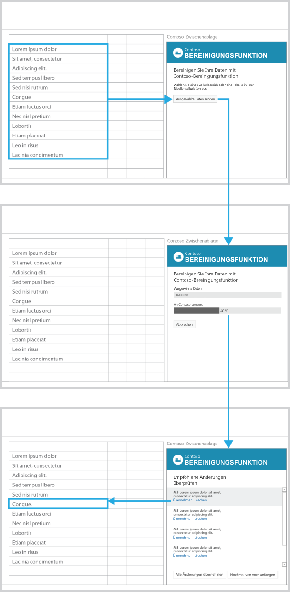|
<ul xmlns:xlink="http://www.w3.org/1999/xlink" xmlns:mtps="http://msdn2.microsoft.com/mtps" xmlns:mshelp="http://msdn.microsoft.com/mshelp" xmlns:ddue="http://ddue.schemas.microsoft.com/authoring/2003/5" xmlns:msxsl="urn:schemas-microsoft-com:xslt"><li>
Der Zweck des Add-ins wird in der Überschrift beschrieben. Anweisungen helfen Ihnen beim Einstieg.
</li><li>
Die Schaltfläche Send selected data (Ausgewählte Daten senden) ist deaktiviert. Dies unterstreicht, dass Sie eine Aktion ausführen müssen, um fortzufahren (A).
</li><li>
Nachdem Sie einen Zellbereich im Tabellenblatt (B) ausgewählt haben, wird die Schaltfläche Send selected data (Ausgewählte Daten senden) aktiviert.
</li><li>
Nachdem Sie diese Schaltfläche ausgewählt haben, werden die Benutzeroberflächenelemente durch den ausgewählten Zellbereich, eine Statusleiste und die Schaltfläche Cancel (Abbrechen) ersetzt.
</li><li>
Die Statusleiste zeigt den Status des Prozesses an, und die Schaltfläche Cancel (Abbrechen) ermöglicht dessen Unterbrechung (D).
</li><li>
Nach Abschluss des Prozesses werden die Ergebnisse automatisch angezeigt (E). Durch das Auswählen eines Elements in der Liste wird die entsprechende Zelle in der Tabelle aktiviert.
</li></ul>Am besten geeignet für:
<ul xmlns:xlink="http://www.w3.org/1999/xlink" xmlns:mtps="http://msdn2.microsoft.com/mtps" xmlns:mshelp="http://msdn.microsoft.com/mshelp" xmlns:ddue="http://ddue.schemas.microsoft.com/authoring/2003/5" xmlns:msxsl="urn:schemas-microsoft-com:xslt"><li>
Prozesse, die unbestimmte Zeit dauern
</li></ul>|

## Analysieren von Inhalten mit einem Aufgabenbereich-Add-In

Dieses Beispiel zeigt ein Aufgabenbereich-Add-in, das während der Benutzereingabe Wortdefinitionen anzeigt.

In diesem Interaktionsmuster müssen Sie zuerst Text im Dokument auswählen, um Ergebnisse zu erhalten.

|||
|:-----|:-----|
|
**Aufgabenbereich-Add-in, das während der Benutzereingabe Wortdefinitionen anzeigt**
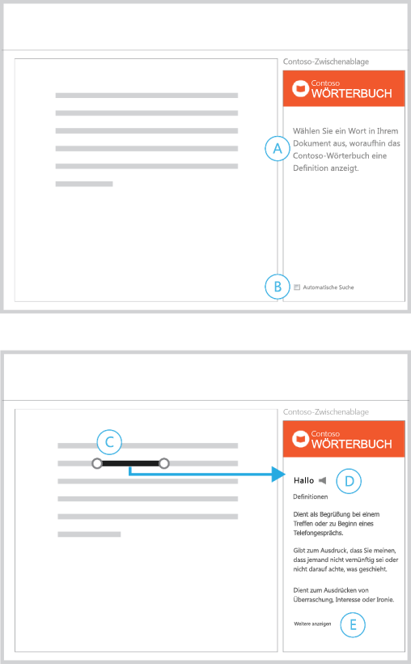|
<ul xmlns:xlink="http://www.w3.org/1999/xlink" xmlns:mtps="http://msdn2.microsoft.com/mtps" xmlns:mshelp="http://msdn.microsoft.com/mshelp" xmlns:ddue="http://ddue.schemas.microsoft.com/authoring/2003/5" xmlns:msxsl="urn:schemas-microsoft-com:xslt"><li>
In einer Überschrift werden der Zweck des Add-ins und die ersten Schritte erklärt (A).
</li><li>
Die automatische Suche ist standardmäßig aktiviert, und es gibt eine Option zum Deaktivieren (B).
</li><li>
Nachdem Sie eine Auswahl getroffen haben, zeigt das Add-in die entsprechenden Inhalte an (D).
</li><li>
Stellen Sie einen Link zu weiteren Informationen zur Verfügung (E).
</li></ul>Am besten geeignet für:
<ul xmlns:xlink="http://www.w3.org/1999/xlink" xmlns:mtps="http://msdn2.microsoft.com/mtps" xmlns:mshelp="http://msdn.microsoft.com/mshelp" xmlns:ddue="http://ddue.schemas.microsoft.com/authoring/2003/5" xmlns:msxsl="urn:schemas-microsoft-com:xslt"><li>
Add-ins, die bei der Dokumenterstellung automatisch Inhalte zurückgeben
</li><li>
Add-ins, bei denen Sie vor der Aktivierung Inhalte auswählen müssen
</li></ul>|

## Suchen nach Inhalten mit einem Aufgabenbereich-Add-In

Dieses Beispiel zeigt ein Aufgabenbereich-Add-in zum Suchen von Inhalten.

In diesem Interaktionsmuster geben Sie zuerst eine Zeichenfolge in das Suchfeld ein oder treffen Ihre Auswahl aus einer Liste wichtiger Inhalte.

|||
|:-----|:-----|
|
**Aufgabenbereich-Add-in zum Suchen von Inhalten**
|
<ul xmlns:xlink="http://www.w3.org/1999/xlink" xmlns:mtps="http://msdn2.microsoft.com/mtps" xmlns:mshelp="http://msdn.microsoft.com/mshelp" xmlns:ddue="http://ddue.schemas.microsoft.com/authoring/2003/5" xmlns:msxsl="urn:schemas-microsoft-com:xslt"><li>
Die Ausgangsansicht enthält ein Suchfeld (A) und eine Liste wichtiger Inhalte (B).
</li><li>
Wenn Sie eine Zeichenfolge in das Suchfeld eingeben, wird das Suchsymbol durch ein Schließsymbol (C) ersetzt.
</li><li>
Durch Klicken auf das Schließsymbol gelangen Sie wieder zur Ausgangsansicht.
</li></ul>Am besten geeignet für:
<ul xmlns:xlink="http://www.w3.org/1999/xlink" xmlns:mtps="http://msdn2.microsoft.com/mtps" xmlns:mshelp="http://msdn.microsoft.com/mshelp" xmlns:ddue="http://ddue.schemas.microsoft.com/authoring/2003/5" xmlns:msxsl="urn:schemas-microsoft-com:xslt"><li>
Add-ins, die bei der Dokumenterstellung automatisch Inhalte zurückgeben
</li><li>
Add-ins, bei denen Sie vor der Aktivierung Inhalte auswählen müssen
</li></ul>|

## Einfügen von Medien mit einem Aufgabenbereich-Add-In

In diesem Interaktionsmuster können Sie ein Bild in den Suchergebnissen auswählen, um es in Ihr Dokument einzufügen.

|||
|:-----|:-----|
|
**Aufgabenbereich-Add-in für das Einfügen eines Bilds**
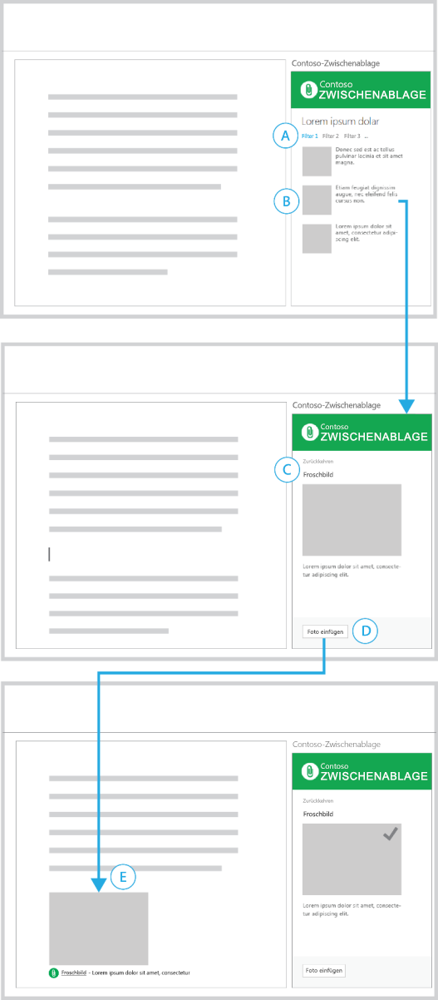|
<ul xmlns:xlink="http://www.w3.org/1999/xlink" xmlns:mtps="http://msdn2.microsoft.com/mtps" xmlns:mshelp="http://msdn.microsoft.com/mshelp" xmlns:ddue="http://ddue.schemas.microsoft.com/authoring/2003/5" xmlns:msxsl="urn:schemas-microsoft-com:xslt"><li>
Sie haben eine Liste von Suchergebnissen gefiltert (A) und Inhalte zum Einfügen ausgewählt (B).
</li><li>
Eine Detailansicht des ausgewählten Inhalts (C) wird mit einer Schaltfläche angezeigt, über die Sie zurück zur Liste wechseln können.
</li><li>
Die Schaltfläche Insert Photo (Foto einfügen) befindet sich in der Fußleiste (D). Nachdem Sie diese Schaltfläche ausgewählt haben, wird das Bild in das Dokument eingefügt.
</li><li>
Zum eingefügten Inhalt gehört eine kurze Beschreibung der Quelle des Bilds (E). 
</li><li>
Benutzeroberflächenelemente im Add-in bestätigen visuell den Erfolg der Aktion.
</li></ul>Am besten geeignet für:
<ul xmlns:xlink="http://www.w3.org/1999/xlink" xmlns:mtps="http://msdn2.microsoft.com/mtps" xmlns:mshelp="http://msdn.microsoft.com/mshelp" xmlns:ddue="http://ddue.schemas.microsoft.com/authoring/2003/5" xmlns:msxsl="urn:schemas-microsoft-com:xslt"><li>
Add-ins zum Einfügen von Inhalten
</li></ul>|

## Einfügen von ausgewähltem Text mit einem Aufgabenbereich-Add-In

In diesem Interaktionsmuster wählen Sie Text aus den Suchergebnissen aus, um diesen in Ihr Dokument einzufügen.

|||
|:-----|:-----|
|
**Aufgabenbereich-Add-in zum Einfügen von Text**
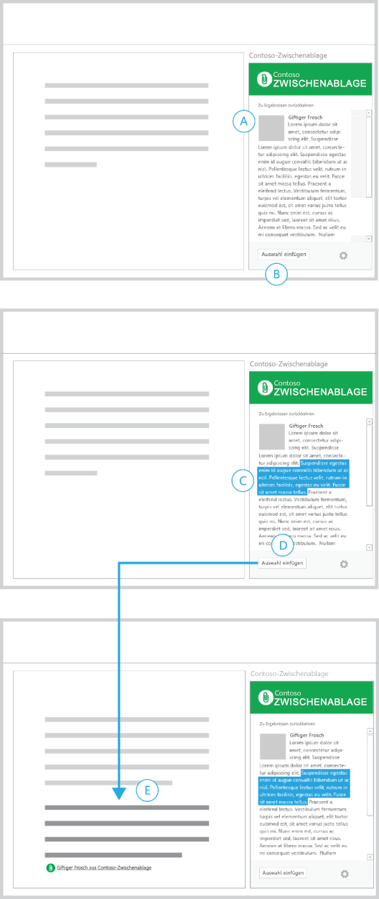|
<ul xmlns:xlink="http://www.w3.org/1999/xlink" xmlns:mtps="http://msdn2.microsoft.com/mtps" xmlns:mshelp="http://msdn.microsoft.com/mshelp" xmlns:ddue="http://ddue.schemas.microsoft.com/authoring/2003/5" xmlns:msxsl="urn:schemas-microsoft-com:xslt"><li>
Sie haben bereits ein Inhaltselement gefunden (A).
</li><li>
Die deaktivierte Schaltfläche Insert Selection (Auswahl einfügen) wird in der Fußzeile angezeigt (B).
</li><li>
Wenn Sie eine Zeichenfolge auswählen (C), wird die Schaltfläche Insert Selection (Auswahl einfügen) aktiv.
</li><li>
Nachdem Sie auf diese Schaltfläche geklickt haben, fügt das Add-in den ausgewählten Text mit einem Hinweis auf die Inhaltsquelle in das Dokument ein (E).
</li></ul>Am besten geeignet für:
<ul xmlns:xlink="http://www.w3.org/1999/xlink" xmlns:mtps="http://msdn2.microsoft.com/mtps" xmlns:mshelp="http://msdn.microsoft.com/mshelp" xmlns:ddue="http://ddue.schemas.microsoft.com/authoring/2003/5" xmlns:msxsl="urn:schemas-microsoft-com:xslt"><li>
Add-ins zum Durchführen von Recherchen und Einfügen von Inhalten
</li></ul>|

## Veröffentlichen von Inhalten für einen Webdienst mit einem Aufgabenbereich-Add-In

Dieses Beispiel zeigt ein Aufgabenbereich-Add-in zum Veröffentlichen eines Dokuments als Blogbeitrag

In diesem Interaktionsmuster haben Sie Inhalte in einem Dokument erstellt, die Sie in Ihrem Blog veröffentlichen möchten.

|||
|:-----|:-----|
|
**Aufgabenbereich-Add-in zum Veröffentlichen eines Dokuments als Blogbeitrag**
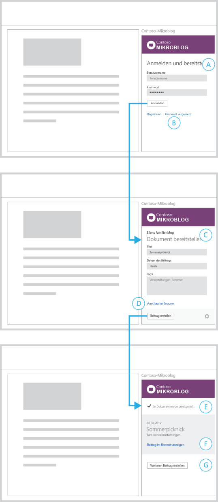|
<ul xmlns:xlink="http://www.w3.org/1999/xlink" xmlns:mtps="http://msdn2.microsoft.com/mtps" xmlns:mshelp="http://msdn.microsoft.com/mshelp" xmlns:ddue="http://ddue.schemas.microsoft.com/authoring/2003/5" xmlns:msxsl="urn:schemas-microsoft-com:xslt"><li>
Zuerst wird ein Anmeldeformular angezeigt, in das Sie Ihre Anmeldeinformationen eingeben müssen (A).
</li><li>
Es werden Links zu Informationen zum Erstellen eines Kontos und Beheben häufiger Anmeldefehler zur Verfügung gestellt (B). Durch Klicken auf diese Links werden die Seiten in einem Browser geöffnet.
</li><li>
Nachdem Sie sich angemeldet haben, zeigt das Add-in ein Formular zum Erstellen eines neuen Blogbeitrags an (C).
</li><li>
Der Name des Kontos, bei dem Sie angemeldet sind (und unter dem Sie den Beitrag erstellen) wird oben im Add-in angezeigt. Das Add-in stellt einen Link zu einer Vorschau des Beitrags zur Verfügung (D). Wenn Sie auf diesen Link klicken, wird eine Vorschau im Browser angezeigt.
</li><li>
Nachdem Sie auf Create post (Beitrag erstellen) geklickt haben, zeigt das Add-in eine Ansicht an, die bestätigt, dass der Dokumentinhalt veröffentlicht wurde (E).
</li><li>
Das Add-in stellt einen Link zum Anzeigen des Beitrags in einem Browser (F) sowie eine Schaltfläche zum Erstellen eines weiteren Beitrags an (G).
</li></ul>Am besten geeignet für:
<ul xmlns:xlink="http://www.w3.org/1999/xlink" xmlns:mtps="http://msdn2.microsoft.com/mtps" xmlns:mshelp="http://msdn.microsoft.com/mshelp" xmlns:ddue="http://ddue.schemas.microsoft.com/authoring/2003/5" xmlns:msxsl="urn:schemas-microsoft-com:xslt"><li>
Add-ins für die Ausgabe, Veröffentlichung oder Freigabe von Inhalten in sozialen Netzwerken, auf Blogwebsites oder in Webdiensten
</li><li>
Add-ins, die erfordern, dass Sie sich bei einem Dienst anmelden
</li></ul>|

## Erhalten weiterer Informationen über Personen mit einem Mail-Add-In

 **Beispiel 1**

|||
|:-----|:-----|
|
**Ergebnis- und Detailseite**
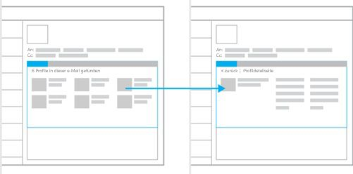|Am besten geeignet für:
<ul xmlns:xlink="http://www.w3.org/1999/xlink" xmlns:mtps="http://msdn2.microsoft.com/mtps" xmlns:mshelp="http://msdn.microsoft.com/mshelp" xmlns:ddue="http://ddue.schemas.microsoft.com/authoring/2003/5" xmlns:msxsl="urn:schemas-microsoft-com:xslt"><li>
Das Offenlegen des Umfangs Ihrer Inhalte, wenn Sie über große Datenmengen verfügen, die Sie präsentieren möchten
</li><li>
Detailseiten, die die vollständige Größe des Add-in-Containers nutzen
</li><li>
Navigationsmodelle, die von einem Informationsfluss in beide Richtungen profitieren
</li></ul>|
 **Beispiel 2**

|||
|:-----|:-----|
|
**Detailseite mit beständiger Navigation**
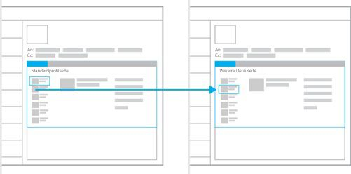|Am besten geeignet für:
<ul xmlns:xlink="http://www.w3.org/1999/xlink" xmlns:mtps="http://msdn2.microsoft.com/mtps" xmlns:mshelp="http://msdn.microsoft.com/mshelp" xmlns:ddue="http://ddue.schemas.microsoft.com/authoring/2003/5" xmlns:msxsl="urn:schemas-microsoft-com:xslt"><li>
Das standardmäßige Anzeigen des ersten Ergebnisses eines Datasets
</li><li>
Navigationsstrukturen, die wie Registerkarten funktionieren (lineare Navigation auf einer Ebene)
</li><li>
Verringern von Auswahlaktionen dadurch, dass Navigation jederzeit möglich ist
</li><li>
Das Bereitstellen von Platz, um Navigationselemente jederzeit anzeigen zu können
</li></ul>|

## Erhalten weiterer Informationen über Personen mit einem Mail-Add-In

 **Beispiel 1**

|||
|:-----|:-----|
|
**Ergebnis- und Detailseite**
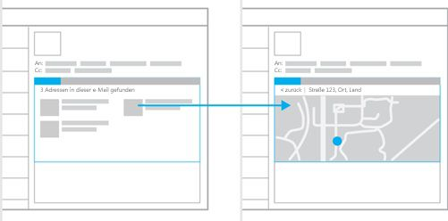|Am besten geeignet für:
<ul xmlns:xlink="http://www.w3.org/1999/xlink" xmlns:mtps="http://msdn2.microsoft.com/mtps" xmlns:mshelp="http://msdn.microsoft.com/mshelp" xmlns:ddue="http://ddue.schemas.microsoft.com/authoring/2003/5" xmlns:msxsl="urn:schemas-microsoft-com:xslt"><li>
Das Offenlegen des Umfangs Ihrer Inhalte, wenn Sie über große Datenmengen verfügen, die Sie zeigen möchten
</li><li>
Die Aufforderung zum Treffen einer Auswahl, bevor weitere Details angezeigt werden
</li><li>
Detailseiten, die die vollständige Größe des Add-in-Containers nutzen
</li><li>
Navigationsmodelle, die von einem Informationsfluss in beide Richtungen profitieren
</li></ul>|
 **Beispiel 2**

|||
|:-----|:-----|
|
**Detailseite mit sekundären Inhalten**
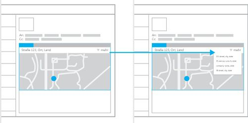|Am besten geeignet für:
<ul xmlns:xlink="http://www.w3.org/1999/xlink" xmlns:mtps="http://msdn2.microsoft.com/mtps" xmlns:mshelp="http://msdn.microsoft.com/mshelp" xmlns:ddue="http://ddue.schemas.microsoft.com/authoring/2003/5" xmlns:msxsl="urn:schemas-microsoft-com:xslt"><li>
Fälle, bei denen Sie ein Inhaltselement hervorheben möchten
</li><li>
Das Verfügbarmachen Ihrer Inhalte ohne Interaktion mit dem Benutzer
</li><li>
Beständige Navigation (kann diesem Modell für eine Kombination aus Einfachheit und Navigationserleichterung hinzugefügt werden)
</li></ul>|

## Verbinden mit einem Onlinedienst und Präsentieren von Daten

Diese Beispiele zeigen Interaktionsmuster zum Abrufen von Daten und Inhalten von einem Onlinedienst. Sie können in allen drei Add-in-Typen verwendet werden: Inhalts-Add-Ins, Aufgabenbereich-Add-Ins und Outlook-Add-Ins.

 **Beispiel 1**

|||
|:-----|:-----|
|
**Karussell**
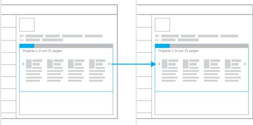|Am besten geeignet für:
<ul xmlns:xlink="http://www.w3.org/1999/xlink" xmlns:mtps="http://msdn2.microsoft.com/mtps" xmlns:mshelp="http://msdn.microsoft.com/mshelp" xmlns:ddue="http://ddue.schemas.microsoft.com/authoring/2003/5" xmlns:msxsl="urn:schemas-microsoft-com:xslt"><li>
Kleine Datenmengen, die nacheinander oder in Gruppen zur Verfügung gestellt werden können
</li><li>
Das Verfügbarmachen von Inhalten in einem Katalogformat, z. B. Bildschirmpräsentationen oder Bildkataloge
</li><li>
Wenn ein Navigationsmodell vom Typ "Weiter/Zurück" gut funktioniert
</li></ul>|
 **Beispiel 2**

|||
|:-----|:-----|
|
**Assistent**
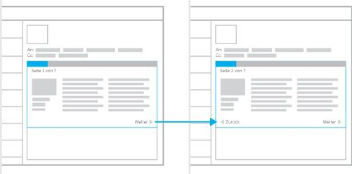|Am besten geeignet für:
<ul xmlns:xlink="http://www.w3.org/1999/xlink" xmlns:mtps="http://msdn2.microsoft.com/mtps" xmlns:mshelp="http://msdn.microsoft.com/mshelp" xmlns:ddue="http://ddue.schemas.microsoft.com/authoring/2003/5" xmlns:msxsl="urn:schemas-microsoft-com:xslt"><li>
Inhalte, die in einer bestimmten Reihenfolge präsentiert werden müssen
</li><li>
Große Inhaltsmengen, die am besten in einer Folge kleiner Abschnitte präsentiert werden
</li><li>
Mit dem Lesen eines Buchs vergleichbare Umgebungen
</li><li>
Wenn für das Erledigen einer Aufgabe eine Reihe von Schritten oder Aktionen erforderlich ist
</li></ul>|
 **Beispiel  3**

|||
|:-----|:-----|
|
**Formular, Ergebnisse und Details**
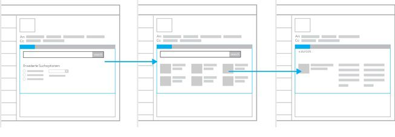|Am besten geeignet für:
<ul xmlns:xlink="http://www.w3.org/1999/xlink" xmlns:mtps="http://msdn2.microsoft.com/mtps" xmlns:mshelp="http://msdn.microsoft.com/mshelp" xmlns:ddue="http://ddue.schemas.microsoft.com/authoring/2003/5" xmlns:msxsl="urn:schemas-microsoft-com:xslt"><li>
Add-ins, die Dateneingaben erfordern
</li><li>
Einstiegspunkt in ein Ergebnis- und Detailmuster
</li></ul>|

## Zusätzliche Ressourcen

- [Designrichtlinien für Office-Add-Ins](../add-in-design.md)
    
