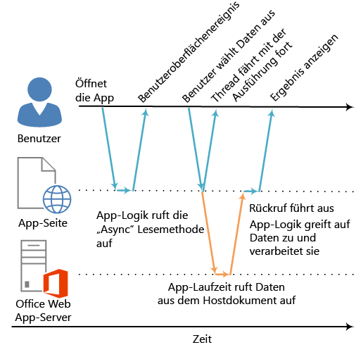

# Asynchrone Programmierung in Office-Add-Ins
Entwickeln Sie Office-Add-Ins mithilfe der asynchronen Programmiermuster der geschachtelten Rückrufe und Zusagen, die von der JavaScript-API für Office unterstützt werden. 

 _**Gilt für:** Access apps for SharePoint | apps for Office | Excel | Office Add-ins | Outlook | PowerPoint | Project | Word_

 **Warum wird für die Office-Add-Ins-API asynchrone Programmierung verwendet?** Bei JavaScript handelt es sich um eine Singlethread-Sprache, Das heißt, wenn von einem Skript ein lange dauernder synchroner Prozess aufgerufen wird, wird die Ausführung aller nachfolgenden Prozesse blockiert, bis dieser Prozess abgeschlossen wurde. Da bestimmte Vorgänge für Office-Webclients (aber auch Rich-Clients) im Synchronmodus die Ausführung blockieren könnten, wurden die meisten Methoden der JavaScript-API für Office für eine asynchrone Ausführung entwickelt. Dadurch wird sichergestellt, dass Office-Add-Ins reagieren und optimal ausgeführt werden. Darüber hinaus müssen Sie häufig Rückruffunktionen schreiben, wenn Sie diese asynchronen Methoden verwenden.

Die Namen aller asynchronen Methoden in der API enden auf "Async", wie etwa die Methoden [Document.getSelectedDataAsync](http://msdn.microsoft.com/en-us/library/f85ad02c-64f0-4b73-87f6-7f521b3afd69%28Office.15%29.aspx), [Binding.getDataAsync](http://msdn.microsoft.com/en-us/library/5372ffd8-579d-4fcb-9e5b-e9a2128f3201%28Office.15%29.aspx) oder [Item.loadCustomPropertiesAsync](../reference/outlook/Office.context.mailbox.item.md%28Office.15%29.md). Wenn eine "Async"-Methode aufgerufen wird, wird sie sofort ausgeführt, und eine nachfolgende Skriptausführung kann fortgesetzt werden. Die optionale Rückruffunktion, die Sie an eine "Async"-Methode übergeben, wird ausgeführt, sobald die Daten oder der angeforderte Vorgang bereit sind. Dies ist in der Regel sofort der Fall, es kann jedoch eine geringe Verzögerung bei der Rückgabe auftreten.

Das folgende Diagramm zeigt den Ausführungsfluss für einen Aufruf einer „Async"-Methode, die die Daten liest, die der Benutzer in einem im serverbasierten Word Online oder Excel Online geöffneten Dokument ausgewählt hat. Wenn der „Async"-Aufruf erfolgt, ist der JavaScript-Ausführungsthread frei für die weitere clientseitige Verarbeitung. (Auch wenn dies nicht im Diagramm dargestellt ist.) Bei der Rückgabe der „Async"-Methode übernimmt die Rückruffunktion die Ausführung im Thread, und das Add-in kann auf die Daten zugreifen, sie verarbeiten und das Ergebnis anzeigen. Das gleiche asynchrone Ausführungsmuster gilt für die Verwendung der Hostanwendungen des Office-Rich-Clients, wie Word 2013 oder Excel 2013.

**Abbildung 1: Ausführungsfluss bei der asynchronen Programmierung**


Die Unterstützung für diesen asynchronen Entwurf in Rich- und Webclients ist Teil des Entwurfsziels „einmal schreiben – plattformübergreifend ausführen" des Entwicklungsmodells für Office-Add-Ins. Beispielsweise können Sie ein Inhalts- oder Aufgabenbereich-Add-In mit einer einzigen Codebasis erstellen, die sowohl in Excel 2013 als auch in Excel Online ausgeführt wird.

## Schreiben der Rückruffunktion für eine "Async"-Methode


Die Rückruffunktion, die Sie als  _callback_-Argument an eine „Async"-Methode übergeben, muss einen einzelnen Parameter deklarieren, der von der Add-in-Laufzeit verwendet wird, um bei der Ausführung der Rückruffunktion Zugriff auf ein [AsyncResult](http://msdn.microsoft.com/de-de/library/540c114f-0398-425c-baf3-7363f2f6bc47%28Office.15%29.aspx)-Objekt zu bieten. Sie können Folgendes schreiben:


- Eine anonyme Funktion, die direkt inline mit dem Aufruf der "Async"-Methode als  _callback_-Parameter der "Async"-Methode geschrieben und übergeben werden muss.
    
- Eine benannte Funktion, wobei der Name der Funktion als  _callback_-Parameter einer "Async"-Methode übergeben wird.
    
Eine anonyme Funktion ist nützlich, wenn Sie den Code nur einmalig verwenden. Da die Funktion keinen Namen hat, können Sie nicht an anderer Stelle des Codes darauf verweisen. Eine benannte Funktion ist nützlich, wenn Sie die Rückruffunktion für mehrere "Async"-Methoden verwenden möchten.


### Schreiben einer anonymen Rückruffunktion

Die folgende anonyme Rückruffunktion deklariert einen einzelnen Parameter namens " `result`", der bei der Rückgabe des Rückrufs Daten aus der [AsyncResult.value](http://msdn.microsoft.com/de-de/library/453a4b43-0fdc-4ea9-967a-c033fab31507%28Office.15%29.aspx)-Eigenschaft abruft.


```
function (result) {
        write('Selected data: ' + result.value);
}
```

Das folgende Beispiel zeigt, wie diese anonyme Rückruffunktion im Kontext eines vollständigen "Async"-Methodenaufrufs inline an die  **Document.getSelectedDataAsync**-Methode übergeben wird.


- Das erste  _coercionType_-Argument,  `Office.CoercionType.Text`, gibt an, dass die ausgewählten Daten als Textzeichenfolge zurückgegeben werden sollen.
    
- Das zweite  _callback_-Argument ist die anonyme Funktion, die inline an die Methode übergeben wird. Bei der Ausführung der Funktion wird mit dem  _result_-Parameter auf die  **value**-Eigenschaft des  **AsyncResult**-Objekts zugegriffen, um die vom Benutzer ausgewählten Daten im Dokument anzuzeigen.
    


```
Office.context.document.getSelectedDataAsync(Office.CoercionType.Text, 
    function (result) {
        write('Selected data: ' + result.value);
    }
});

// Function that writes to a div with id='message' on the page.
function write(message){
    document.getElementById('message').innerText += message; 
}
```

Sie können auch mithilfe des Parameters Ihrer Rückruffunktion auf die anderen Eigenschaften des  **AsyncResult**-Objekts zugreifen. Verwenden Sie die [AsyncResult.status](http://msdn.microsoft.com/de-de/library/eec9c712-79eb-4365-88a1-6d77649727c1%28Office.15%29.aspx)-Eigenschaft, um zu bestimmen, ob der Aufruf erfolgreich ausgeführt wurde oder ob ein Fehler aufgetreten ist. Im Falle eines Fehlers können Sie mithilfe der [AsyncResult.error](http://msdn.microsoft.com/de-de/library/51c46d36-972d-4d82-91aa-da99cbeb8d4f%28Office.15%29.aspx)-Eigenschaft auf ein [Error](http://msdn.microsoft.com/de-de/library/36d1d048-b888-4bb5-9321-d340bcbc86f4%28Office.15%29.aspx)-Objekt mit Fehlerinformationen zugreifen.

Weitere Informationen zur Verwendung der  **getSelectedDataAsync**-Methode finden Sie unter [Lesen und Schreiben von Daten in die aktive Auswahl in einem Dokument oder Arbeitsblatt](../../docs/develop/read-and-write-data-to-the-active-selection-in-a-document-or-spreadsheet.md). 


### Schreiben einer benannten Rückruffunktion

Alternativ können Sie eine benannte Funktion schreiben und ihren Namen an den  _callback_-Parameter einer „Async"-Methode übergeben. Das vorherige Beispiel kann folgendermaßen umgeschrieben werden, sodass eine Funktion namens  `writeDataCallback` als _callback_-Parameter übergeben wird:


```
Office.context.document.getSelectedDataAsync(Office.CoercionType.Text, 
    writeDataCallback);

// Callback to write the selected data to the add-in UI.
function writeDataCallback(result) {
    write('Selected data: ' + result.value);
}

// Function that writes to a div with id='message' on the page.
function write(message){
    document.getElementById('message').innerText += message; 
}
```


## Unterschiede in der Rückgabe an die "AsyncResult.value"-Eigenschaft


Die Eigenschaften  **asyncContext**,  **status** und **error** des **AsyncResult**-Objekts geben für alle "Async"-Methoden die gleichen Arten von Informationen an die übergebene Rückruffunktion zurück. Die an die  **AsyncResult.value**-Eigenschaft zurückgegebenen Daten hängen jedoch von der Funktionalität der "Async"-Methode ab. 

Die  **addHandlerAsync**-Methoden (der Objekte [Binding](http://msdn.microsoft.com/en-us/library/42882642-d22b-47d2-a8d3-3aa8c6a4435e%28Office.15%29.aspx), [CustomXmlPart](http://msdn.microsoft.com/en-us/library/83f0e668-8236-4f2f-a20f-b173a9e3f65f%28Office.15%29.aspx), [Document](http://msdn.microsoft.com/en-us/library/f8859516-cc1f-4b20-a8f3-cee37a983e70%28Office.15%29.aspx), [RoamingSettings](../reference/outlook/RoamingSettings.md%28Office.15%29.md) und [Settings](http://msdn.microsoft.com/en-us/library/ad733387-a58c-4514-8fc2-53e64fad468d%28Office.15%29.aspx)) dienen beispielsweise dazu, den durch diese Objekte dargestellten Elementen Ereignishandlerfunktionen hinzuzufügen. Sie können auf die  **AsyncResult.value**-Eigenschaft von der Rückruffunktion, die Sie an eine der  **addHandlerAsync**-Methoden übergeben, zugreifen. Aber da beim Hinzufügen eines Ereignishandlers nicht auf Daten und Objekte zugegriffen wird, gibt die  **value**-Eigenschaft immer  **undefined** zurück, wenn Sie darauf zugreifen.

Wenn Sie dagegen die  **Document.getSelectedDataAsync**-Methode aufrufen, gibt sie die vom Benutzer im Dokument ausgewählten Daten an die  **AsyncResult.value**-Eigenschaft im Rückruf zurück. Oder wenn Sie die [Bindings.getAllAsync](http://msdn.microsoft.com/de-de/library/ef902b73-cc4c-4551-95de-d8a51eeba82f%28Office.15%29.aspx)-Methode aufrufen, gibt sie ein Array von allen  **Binding**-Objekten im Dokument zurück. Und wenn Sie die [Bindings.getByIdAsync](http://msdn.microsoft.com/de-de/library/2727c891-bc05-465c-9324-113fbfeb3fbb%28Office.15%29.aspx)-Methode aufrufen, gibt sie ein einzelnes  **Binding**-Objekt zurück.

Eine Beschreibung der Rückgabe an die  **AsyncResult.value**-Eigenschaft für eine "Async"-Methode finden Sie im Abschnitt "Rückrufwert" des Referenzthemas für diese Methode. Eine Zusammenfassung aller Objekte, die "Async"-Methoden bereitstellen, finden Sie in der Tabelle an Ende des Themas für das [AsyncResult](http://msdn.microsoft.com/de-de/library/540c114f-0398-425c-baf3-7363f2f6bc47%28Office.15%29.aspx) -Objekt.


## Asynchrone Programmiermuster


Die JavaScript-API für Office unterstützt zwei Arten asynchroner Programmiermuster:


- Verwenden geschachtelter Rückrufe
    
- Verwenden des Zusagemusters
    
Bei der asynchronen Programmierung mit Rückruffunktionen muss häufig das zurückgegebene Ergebnis eines Rückrufs in zwei oder mehr Rückrufe geschachtelt werden. In diesem Fall können Sie geschachtelte Rückrufe aus allen "Async"-Methoden der API verwenden.

Die Verwendung geschachtelter Rückrufe ist ein Programmiermuster, das den meisten JavaScript-Entwicklern vertraut ist. Allerdings ist Code mit tief geschachtelten Rückrufen mitunter schwer zu lesen und zu verstehen. Als Alternative zu geschachtelten Rückrufen unterstützt die JavaScript-API für Office auch eine Implementierung des Zusagemusters. In der aktuellen Version der JavaScript-API für Office kann das Zusagemuster jedoch nur für Code für [Bindungen in Excel-Arbeitsblättern und Word-Dokumenten](http://msdn.microsoft.com/de-de/library/5bf788db-d788-4d91-bcb6-fc3913b40012%28Office.15%29.aspx) verwendet werden.


### Asynchrone Programmierung mithilfe geschachtelter Rückruffunktionen


Häufig müssen Sie für eine Aufgabe mehrere asynchrone Vorgänge ausführen. Zu diesem Zweck können Sie einen "Async"-Aufruf in einen anderen "Async"-Aufruf schachteln. 

Im folgenden Codebeispiel werden zwei asynchrone Aufrufe geschachtelt. 


- Zunächst wird die [Bindings.getByIdAsync](http://msdn.microsoft.com/de-de/library/2727c891-bc05-465c-9324-113fbfeb3fbb%28Office.15%29.aspx)-Methode aufgerufen, um auf die Bindung "MyBinding" im Dokument zuzugreifen. Das  **AsyncResult**-Objekt, das an den  `result`-Parameter des Rückrufs zurückgegeben wird, bietet über die  **AsyncResult.value**-Eigenschaft Zugriff auf das angegebene Bindungsobjekt.
    
- Anschließend wird mithilfe des Bindungsobjekts, auf das mit dem ersten  `result`-Parameter zugegriffen wurde, die [Binding.getDataAsync](http://msdn.microsoft.com/de-de/library/5372ffd8-579d-4fcb-9e5b-e9a2128f3201%28Office.15%29.aspx)-Methode aufgerufen.
    
- Schließlich werden mit dem  `result2`-Parameter des Rückrufs, der an die  **Binding.getDataAsync**-Methode übergeben wird, die Daten der Bindung angezeigt.
    


```
function readData() {
    Office.context.document.bindings.getByIdAsync("MyBinding", function (result) {
        result.value.getDataAsync({ coercionType: 'text' }, function (result2) {
            write(result2.value);
        });
    });
}

// Function that writes to a div with id='message' on the page.
function write(message){
    document.getElementById('message').innerText += message; 
}
```

Dieses grundlegende Muster geschachtelter Rückrufe kann für alle asynchronen Methoden in der JavaScript-API für Office verwendet werden.

In den folgenden Abschnitten wird gezeigt, wie anonyme oder benannte Funktionen für geschachtelte Rückrufe in asynchronen Methoden verwendet werden.


#### Verwenden anonymer Funktionen für geschachtelte Rückrufe

Im folgenden Beispiel werden zwei anonyme Funktionen inline deklariert und als geschachtelte Rückrufe an die Methoden  **getByIdAsync** und **getDataAsync** übergeben. Da diese Funktionen einfach und inline sind, ist die Implementierungsabsicht sofort ersichtlich.


```
Office.context.document.bindings.getByIdAsync('myBinding', function (bindingResult) {
    bindingResult.value.getDataAsync(function (getResult) {
        if (getResult.status == Office.AsyncResultStatus.Failed) {
            write('Action failed. Error: ' + asyncResult.error.message);
        } else {
            write('Data has been read successfully.');
        }
    });
});

// Function that writes to a div with id='message' on the page.
function write(message){
    document.getElementById('message').innerText += message; 
}
```


#### Verwenden benannter Funktionen für geschachtelte Rückrufe

In komplexen Implementierungen kann die Verwendung benannter Funktionen hilfreich sein, um die Lesbarkeit, Wartbarkeit und Wiederverwendbarkeit des Codes zu verbessern. Im folgenden Beispiel wurden die beiden anonymen Funktionen aus dem Beispiel im vorherigen Abschnitt als benannte Funktionen namens  `deleteAllData` und `showResult` umgeschrieben. Diese benannten Funktionen werden dann anhand des Namens als Rückrufe an die Methoden **getByIdAsync** und **deleteAllDataValuesAsync** übergeben.


```
Office.context.document.bindings.getByIdAsync('myBinding', deleteAllData);

function deleteAllData(asyncResult) {
    asyncResult.value.deleteAllDataValuesAsync(showResult);
}

function showResult(asyncResult) {
    if (asyncResult.status == Office.AsyncResultStatus.Failed) {
        write('Action failed. Error: ' + asyncResult.error.message);
    } else {
        write('Data has been deleted successfully.');
    }
}

// Function that writes to a div with id='message' on the page.
function write(message){
    document.getElementById('message').innerText += message; 
}
```


### Asynchrone Programmierung mithilfe des Zusagemusters zum Zugriff auf Daten in Bindungen


Statt eine Rückruffunktion zu übergeben und mit der Fortsetzung der Ausführung auf die Rückgabe der Funktion zu warten, wird beim Programmiermuster der Zusage sofort einZusageobjekt zurückgegeben, das das beabsichtigte Ergebnis darstellt. Im Gegensatz zu echter synchroner Programmierung wird die Erfüllung des zugesagten Ergebnisses jedoch tatsächlich verzögert, bis die Laufzeitumgebung von Office-Add-Ins die Anforderung erfüllen kann. Für Situationen, in denen die Anforderung nicht erfüllt werden kann, steht ein _onError_-Handler zur Verfügung.

Die JavaScript-API für Office enthält die [Office.select](http://msdn.microsoft.com/de-de/library/23aeb136-da1f-4127-a798-99dc27bc4dae%28Office.15%29.aspx)-Methode, die das Zusagemuster zur Verwendung von vorhandenen Bindungsobjekten unterstützt. Das an die  **Office.select**-Methode zurückgegebene Zusageobjekt unterstützt nur die vier Methoden, auf die Sie direkt über das [Binding](http://msdn.microsoft.com/de-de/library/42882642-d22b-47d2-a8d3-3aa8c6a4435e%28Office.15%29.aspx)-Objekt zugreifen können: [getDataAsync](http://msdn.microsoft.com/de-de/library/5372ffd8-579d-4fcb-9e5b-e9a2128f3201%28Office.15%29.aspx), [setDataAsync](http://msdn.microsoft.com/de-de/library/6a59bb6d-40b6-4a95-9b98-d70d4616de09%28Office.15%29.aspx), [addHandlerAsync](http://msdn.microsoft.com/de-de/library/b9c2f4ea-726c-4b48-a3fb-89beda337a17%28Office.15%29.aspx) und [removeHandlerAsync](http://msdn.microsoft.com/de-de/library/5ae3a860-1fc4-46ce-858e-98545c3e2d77%28Office.15%29.aspx).

Das Zusagemuster für die Verwendung von Bindungen hat folgendes Format:

 **Office.select(**_selectorExpression_,  _onError_**).**_BindingObjectAsyncMethod_

Der  _selectorExpression_-Parameter hat das Format  `"bindings#bindingId"`, wobei  _bindingId_ der Name ( **id**) einer Bindung ist, die Sie zuvor im Dokument oder Arbeitsblatt (mithilfe einer der "addFrom"-Methoden der  **Bindings**-Auflistung:  **addFromNamedItemAsync**,  **addFromPromptAsync** oder **addFromSelectionAsync**) erstellt haben. So gibt der Auswahlausdruck  `bindings#cities` an, dass Sie auf die Bindung mit einer **id** "cities" zugreifen möchten.

Der  _onError_-Parameter ist eine Fehlerbehandlungsfunktion, die einen einzelnen Parameter vom Typ  **AsyncResult** akzeptiert. Mit diesem kann auf ein **Error**-Objekt zugegriffen werden, wenn die  **select**-Methode nicht auf die angegebene Bindung zugreifen kann. Das folgende Beispiel zeigt eine einfache Fehlerbehandlungsfunktion, die an den  _onError_-Parameter übergeben werden kann.


```
function onError(result){
    var err = result.error;
    write(err.name + ": " + err.message);
}
// Function that writes to a div with id='message' on the page.
function write(message){
    document.getElementById('message').innerText += message; 
}
```

Ersetzen Sie den Platzhalter  _BindingObjectAsyncMethod_ durch einen Aufruf einer der vier vom Zusageobjekt unterstützten **Binding**-Objektmethoden:  **getDataAsync**,  **setDataAsync**,  **addHandlerAsync** oder **removeHandlerAsync**. Aufrufe dieser Methoden unterstützen keine weiteren Zusagen. Sie müssen sie mit dem [Muster geschachtelter Rückruffunktionen](http://msdn.microsoft.com/de-de/library/7fe6bb42-3178-4d96-85f5-af5caea7b950%28Office.15%29.aspx#AsyncProgramming_NestedCallbacks) aufrufen.

Nachdem eine  **Binding**-Objektzusage erfüllt wurde, kann sie in der verketteten Methode wiederverwendet werden, so als ob es sich um eine Bindung handeln würde (die Add-in-Laufzeit versucht nicht erneut asynchron, die Zusage zu erfüllen). Falls die  **Binding**-Objektzusage nicht erfüllt werden kann, versucht die Add-in-Laufzeit erneut, auf das Bindungsobjekt zuzugreifen, wenn das nächste Mal eine der zugehörigen asynchronen Methoden aufgerufen wird.

Im folgenden Codebeispiel wird mithilfe der  **select**-Methode eine Bindung mit der  **id** " `cities`" aus der  **Bindings**-Auflistung abgerufen. Anschließend wird die [addHandlerAsync](http://msdn.microsoft.com/de-de/library/b9c2f4ea-726c-4b48-a3fb-89beda337a17%28Office.15%29.aspx)-Methode aufgerufen, um einen Ereignishandler für das [dataChanged](http://msdn.microsoft.com/de-de/library/7b9ed4bf-3ce5-44eb-8548-2b081afd868d%28Office.15%29.aspx)-Ereignis der Bindung hinzuzufügen.


```
function addBindingDataChangedEventHandler() {
    Office.select("bindings#cities", function onError(){/* error handling code */}).addHandlerAsync(Office.EventType.BindingDataChanged,
    function (eventArgs) {
        doSomethingWithBinding(eventArgs.binding);
    });
}

```


 >**Wichtig**  Die von der  **Office.select**-Methode zurückgegebene  **Binding**-Objektzusage bietet nur Zugriff auf die vier Methoden des  **Binding**-Objekts. Wenn Sie auf andere Member des  **Binding**-Objekts zugreifen müssen, verwenden Sie stattdessen die  **Document.bindings**-Eigenschaft und eine der Methoden  **Bindings.getByIdAsync** oder **Bindings.getAllAsync** zum Abruf des **Binding**-Objekts. Müssen Sie beispielsweise auf eine Eigenschaft des  **Binding**-Objekts ( **document**,  **id** oder **type**) oder auf die Eigenschaften des [MatrixBinding](http://msdn.microsoft.com/de-de/library/35e8568e-9129-4c00-b30f-d8c3b2555f1e%28Office.15%29.aspx)- oder des [TableBinding](http://msdn.microsoft.com/de-de/library/1508795b-1c70-456c-b3bf-666d40cf8f50%28Office.15%29.aspx)-Objekts zugreifen, verwenden Sie die Methoden  **getByIdAsync** oder **getAllAsync** zum Abruf eines **Binding**-Objekts.


## Übergeben optionaler Parameter an asynchrone Methoden


Für die allgemeine Syntax aller "Async"-Methoden gilt folgendes Muster:

 _AsyncMethod_ `(` _RequiredParameters_ `, [` _OptionalParameters_ `],` _CallbackFunction_ `);`

Alle asynchronen Methoden unterstützen optionale Parameter, die als JSON-Objekt (JavaScript Object Notation) übergeben werden, das einen oder mehrere optionale Parameter enthält. Das JSON-Objekt, das die optionalen Parameter enthält, ist eine nicht sortierte Auflistung von Schlüssel/Wert-Paaren, wobei der Schlüssel und der Wert durch das Zeichen ":" voneinander getrennt werden. Jedes Paar im Objekt wird durch ein Komma getrennt, und alle Paare werden in geschweifte Klammern gesetzt. Der Schlüssel ist der Parametername, und der Wert ist der Wert, der für diesen Parameter übergeben werden soll.

Das JSON-Objekt, das optionale Parameter enthält, können Sie inline erstellen, oder indem Sie ein  `options`-Objekt erstellen und dieses dann als  _options_-Parameter übergeben.


### Inlineübergabe optionaler Parameter

Die Syntax, um die [Document.setSelectedDataAsync](http://msdn.microsoft.com/de-de/library/f85ad02c-64f0-4b73-87f6-7f521b3afd69%28Office.15%29.aspx)-Methode mit optionalen Parametern inline aufzurufen, lautet z. B. wie folgt:

 `Office.context.document.setSelectedDataAsync(` _data_ `, {coercionType:` _coercionType_ `, asyncContext:` _asyncContext_ `},` _callback_ `);`

Mit dieser Aufrufsyntax werden die beiden optionalen Parameter,  _coercionType_ und _asyncContext_, inline als JSON-Objekt definiert und in geschweifte Klammern gesetzt.

Im folgenden Beispiel wird veranschaulicht, wie Sie die  **Document.setSelectedDataAsync**-Methode aufrufen, indem Sie optionale Parameter inline angeben.


```
Office.context.document.setSelectedDataAsync(
    "<html><body>hello world</body></html>",
    {coercionType: "html", asyncContext: 42},
    function(asyncResult) {
        write(asyncResult.status + " " + asyncResult.asyncContext);
    }
)

// Function that writes to a div with id='message' on the page.
function write(message){
    document.getElementById('message').innerText += message; 
}
```


 >**Hinweis**  Sie können optionale Parameter im JSON-Objekt in einer beliebigen Reihenfolge angeben, solange ihre Namen richtig angegeben sind.


### Übergeben optionaler Parameter in einem "options"-Objekt

Alternativ können Sie ein Objekt mit dem Namen  `options`, das die optionalen Parameter angibt, separat vom Methodenaufruf erstellen und anschließend das  `options`-Objekt als  _options_-Argument übergeben.

Im folgenden Beispiel wird eine Methode zum Erstellen des  `options`-Objekts aufgezeigt, wobei  `parameter1`,  `value1` usw. Platzhalter für die tatsächlichen Parameternamen und -werte sind.


```
var options = {
    parameter1: value1,
    parameter2: value2,
    ...
    parameterN: valueN
};

```

Dieses sieht wie im folgenden Beispiel aus, wenn es zum Angeben der Parameter [ValueFormat](http://msdn.microsoft.com/de-de/library/75e4a0f9-e0c6-4c8b-ac87-95b824356a4e%28Office.15%29.aspx) und [FilterType](http://msdn.microsoft.com/de-de/library/1d182c44-526d-4f7e-9557-78534f845e5b%28Office.15%29.aspx) verwendet wird:


```
var options = {
    valueFormat: "unformatted",
    filterType: "all"
};
```

Dies ist eine weitere Methode zum Erstellen des  `options`-Objekts.


```
var options = {};
options[parameter1] = value1;
options[parameter2] = value2;
...
options[parameterN] = valueN;
```

Dieses sieht wie im folgenden Beispiel aus, wenn es zum Angeben der Parameter  **ValueFormat** und **FilterType** verwendet wird:


```
var options = {};
options["ValueFormat"] = "unformatted";
options["FilterType"] = "all";
```


 >**Hinweis**  Bei beiden Methoden zur Erstellung des  `options`-Objekts können Sie optionale Parameter in beliebiger Reihenfolge angeben, solange die Namen richtig angegeben sind.

Im folgenden Beispiel wird veranschaulicht, wie Sie die  **Document.setSelectedDataAsync**-Methode aufrufen, indem Sie optionale Parameter in einem  `options`-Objekt angeben.


```
var options = {
   coercionType: "html",
   asyncContext: 42
};

document.setSelectedDataAsync(
    "<html><body>hello world</body></html>",
    options,
    function(asyncResult) {
        write(asyncResult.status + " " + asyncResult.asyncContext);
    }
)

// Function that writes to a div with id='message' on the page.
function write(message){
    document.getElementById('message').innerText += message; 
}
```


 >**Hinweis**  Bei beiden Beispielen für die optionalen Parameter wird der  _callback_-Parameter als letzter Parameter angegeben (nach den optionalen Inlineparametern oder nach dem  _options_-Argumentobjekt). Alternativ können Sie den  _callback_-Parameter innerhalb des Inline-JSON-Objekts oder aber im  `options`-Objekt angeben. Sie können den  _callback_-Parameter jedoch nur an einer Stelle übergeben, nämlich entweder im  _options_-Objekt (inline oder extern erstellt) oder als letzten Parameter.


## Weitere Ressourcen


- [Grundlegendes zur JavaScript-API für Office](../develop/understanding-the-javascript-api-for-office.md)
    
- [JavaScript-API für Office](http://msdn.microsoft.com/library/b27e70c3-d87d-4d27-85e0-103996273298%28Office.15%29.aspx)
    
