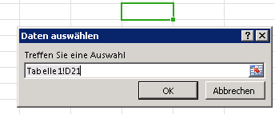

# Einrichten einer Bindung an Regionen in einem Dokument oder Arbeitsblatt
In diesem Artikel wird das Erstellen von Bindungen an Bereiche von Dokumenten oder Tabellen beschrieben sowie das anschließende Lesen von Daten aus diesen Bindungen und das Schreiben in diese. Es wird zudem das Erstellen und Entfernen von Ereignishandlern beschrieben, um Änderungen an Daten oder der Benutzerauswahl in einer Bindung vorzunehmen. 

 _**Gilt für:** apps for Office | Excel | Office Add-ins | Word_


## Bindung an Bereiche in einem Dokument oder einer Tabelle

Bindungsbasierter Datenzugriff ermöglicht Inhalts- und Aufgabenbereich-Add-ins den konsistenten Zugriff auf einen bestimmten Bereich eines Dokuments oder einer Tabelle mithilfe eines Bezeichners. Das Add-in muss zunächst eine Bindung herstellen, indem es eine der Methoden aufruft, die einen Teil des Dokuments einem eindeutigen Bezeichner zuordnet: [addFromPromptAsync](http://msdn.microsoft.com/de-de/library/9dc03608-b08b-4700-8be1-3c86ae236799%28Office.15%29.aspx), [addFromSelectionAsync](http://msdn.microsoft.com/de-de/library/edc99214-e63e-43f2-9392-97ead42fc155%28Office.15%29.aspx) oder [addFromNamedItemAsync](http://msdn.microsoft.com/de-de/library/afbadac7-60c7-47cb-9477-6e9466ded44c%28Office.15%29.aspx). Nach der Herstellung der Bindung kann das Add-in den bereitgestellten Bezeichner verwenden, um auf die Daten in dem zugeordneten Bereich des Dokuments oder der Tabelle zuzugreifen. Durch das Erstellen von Bindungen ergeben sich für das Add-in die folgenden Vorteile:


- Zugriff auf allgemeine Datenstrukturen in mehreren unterstützten Office-Anwendungen wie Tabellen, Bereiche oder Text (einer kontinuierlichen Abfolge von Zeichen)
    
- Lese-/Schreibzugriffvorgänge, ohne dass der Benutzer eine Auswahl vornehmen muss
    
- Herstellung einer Beziehung zwischen dem Add-in und den Daten im Dokument. Bindungen bleiben im Dokument erhalten, und es kann zu einem späteren Zeitpunkt auf diese zugegriffen werden.
    
Die Herstellung einer Bindung ermöglicht auch das Abonnieren von Daten- und Auswahländerungsereignissen in diesem bestimmten Bereich des Dokuments oder der Tabelle. Dies bedeutet, dass das Add-in nur von Änderungen benachrichtigt wird, die in dem gebundenen Bereich stattfinden und nicht von solchen, innerhalb des gesamten Dokuments oder der gesamten Tabelle.

Das [Bindings](http://msdn.microsoft.com/de-de/library/09979e31-3bfb-45be-adda-0f7cc2db1fe1%28Office.15%29.aspx)-Objekt macht eine [getAllAsync](http://msdn.microsoft.com/de-de/library/ef902b73-cc4c-4551-95de-d8a51eeba82f%28Office.15%29.aspx)-Methode verfügbar, die den Zugriff auf alle in dem Dokument oder in der Tabelle hergestellten Bindungen ermöglicht. Auf die einzelnen Bindungen kann über ihre ID unter Verwendung der [Bindings.getBindingByIdAsync](http://msdn.microsoft.com/de-de/library/2727c891-bc05-465c-9324-113fbfeb3fbb%28Office.15%29.aspx)- oder der [Office.select](http://msdn.microsoft.com/de-de/library/23aeb136-da1f-4127-a798-99dc27bc4dae%28Office.15%29.aspx)-Methode zugegriffen werden. Mithilfe einer der folgenden Methoden des  **Bindings**-Objekts können neue Bindungen hergestellt und vorhandene entfernt werden: [addFromSelectionAsync](http://msdn.microsoft.com/de-de/library/edc99214-e63e-43f2-9392-97ead42fc155%28Office.15%29.aspx), [addFromPromptAsync](http://msdn.microsoft.com/de-de/library/9dc03608-b08b-4700-8be1-3c86ae236799%28Office.15%29.aspx), [addFromNamedItemAsync](http://msdn.microsoft.com/de-de/library/afbadac7-60c7-47cb-9477-6e9466ded44c%28Office.15%29.aspx) oder [releaseByIdAsync](http://msdn.microsoft.com/de-de/library/ad285984-8b44-435d-9b84-f0ade570c896%28Office.15%29.aspx).

Es gibt drei unterschiedliche Typen von Bindungen, die Sie mit dem  _bindingType_-Parameter festlegen, wenn Sie unter Verwendung der  **addFromSelectionAsync** -, **addFromPromptAsync** - oder **addFromNamedItemAsync** -Methode eine Bindung herstellen:


|**Bindungstyp**|**Beschreibung**|**Unterstützung von Hostanwendungen**|
|:-----|:-----|:-----|
|Textbindung|Bindet an den Bereich des Dokuments, der als Text dargestellt werden kann.|In Word sind die meisten zusammenhängenden Auswahlen gültig, während in Excel nur Auswahlen mit einer Zelle das Ziel einer Textbindung sein können. In Excel wird nur unformatierter Text unterstützt. Word unterstützt drei Formate: Nur-Text, HTML und Open XML für Office.|
|Matrixbindung|Bindet an einen festen Bereich eines Dokuments, der Tabellendaten ohne Überschriften enthält.Daten in einer Matrixbindung werden als zweidimensionales  **Array** geschrieben oder gelesen, das in JavaScript als Array von Arrays implementiert wird. Beispielsweise können zwei Zeilen von **string**-Werten in zwei Spalten als  ` [['a', 'b'], ['c', 'd']]` geschrieben oder gelesen werden, und eine einzelne Spalte von drei Zeilen kann als ` [['a'], ['b'], ['c']]` geschrieben oder gelesen werden.|In Excel kann eine beliebige Auswahl benachbarter Zellen für die Herstellung einer Matrixbindung verwendet werden. In Word wird die Matrixbindung nur für Tabellen unterstützt.|
|Tabellenbindung|Bindet an einen Bereich eines Dokuments, der eine Tabelle mit Überschriften enthält.Daten in einer Tabellenbindung werden als [TableData](http://msdn.microsoft.com/de-de/library/2183ea52-5a40-4048-b9a4-7cd66bb0ad5d%28Office.15%29.aspx)-Objekt geschrieben oder gelesen. Das  **TableData**-Objekt stellt die Daten über die Eigenschaften  **headers** und **rows** zur Verfügung.|Jede Excel- oder Word-Tabelle kann die Basis einer Tabellenbindung sein. Nach Herstellen einer Tabellenbindung wird jede neue Zeile oder Spalte, die Benutzer der Tabelle hinzugefügt haben, automatisch in die Bindung einbezogen.|
Nachdem eine Bindung mithilfe einer der drei "addFrom"-Methoden des  **Bindings** -Objekts erstellt wurde, können Sie mit den Daten und Eigenschaften der Bindung mithilfe der Methoden des entsprechenden Objekts arbeiten: [MatrixBinding](http://msdn.microsoft.com/de-de/library/35e8568e-9129-4c00-b30f-d8c3b2555f1e%28Office.15%29.aspx), [TableBinding](http://msdn.microsoft.com/de-de/library/1508795b-1c70-456c-b3bf-666d40cf8f50%28Office.15%29.aspx) oder [TextBinding](http://msdn.microsoft.com/de-de/library/6b71b21d-f64d-425c-99d9-c62b2a9969be%28Office.15%29.aspx). Diese drei Objekte erben die Methoden [getDataAsync](http://msdn.microsoft.com/de-de/library/5372ffd8-579d-4fcb-9e5b-e9a2128f3201%28Office.15%29.aspx) und [setDataAsync](http://msdn.microsoft.com/de-de/library/6a59bb6d-40b6-4a95-9b98-d70d4616de09%28Office.15%29.aspx) des **Binding**-Objekts, die Ihnen die Interaktion mit gebundenen Daten ermöglichen.


 >**Tipp**   **Wann sollten Matrix- und wann Tabellenbindungen verwendet werden?** **Hinweis:** Wenn die tabellarischen Daten, mit denen Sie arbeiten, eine Ergebniszeile enthalten, müssen Sie eine Matrixbindung verwenden, falls das Skript Ihres Add-ins auf Werte in der Ergebniszeile zugreifen oder erkennen muss, dass sich die Auswahl des Benutzers in der Ergebniszeile befindet. Wenn Sie eine Tabellenbindung für tabellarische Daten herstellen, die eine Ergebniszeile enthalten, spiegeln die Eigenschaft [TableBinding.rowCount](http://msdn.microsoft.com/de-de/library/128d0e04-8ec7-4f52-a31d-421d225c39fa%28Office.15%29.aspx) sowie die Eigenschaften [rowCount](http://msdn.microsoft.com/de-de/library/110d45f7-40b7-4005-b080-ef748cbf337c%28Office.15%29.aspx) und [startRow](http://msdn.microsoft.com/de-de/library/3cc1c014-b18d-4e7b-9ec0-5500b43c4016%28Office.15%29.aspx) des **BindingSelectionChangedEventArgs**-Objekts in Ereignishandlern mit ihren Werten nicht die Ergebniszeile wider. Um diese Einschränkung zu umgehen und mit der Ergebniszeile zu arbeiten, müssen Sie eine Matrixbindung herstellen.


### Hinzufügen einer Bindung zur aktuellen Auswahl des Benutzers


Im folgenden Beispiel wird das hinzufügen einer Textbindung mit dem Namen  `myBinding` zur aktuellen Auswahl in einem Dokument unter Verwendung der [Bindings.addFromSelectionAsync](http://msdn.microsoft.com/de-de/library/edc99214-e63e-43f2-9392-97ead42fc155%28Office.15%29.aspx)-Methode erläutert.


```
Office.context.document.bindings.addFromSelectionAsync(Office.BindingType.Text, { id: 'myBinding' }, function (asyncResult) {
    if (asyncResult.status == Office.AsyncResultStatus.Failed) {
        write('Action failed. Error: ' + asyncResult.error.message);
    } else {
        write('Added new binding with type: ' + asyncResult.value.type + ' and id: ' + asyncResult.value.id);
    }
});

// Function that writes to a div with id='message' on the page.
function write(message){
    document.getElementById('message').innerText += message; 
}
```

In diesem Beispiel ist der festgelegte Bindungstyp "Text". Dies bedeutet, dass für die Auswahl ein [TextBinding](http://msdn.microsoft.com/de-de/library/6b71b21d-f64d-425c-99d9-c62b2a9969be%28Office.15%29.aspx)-Objekt erstellt wird. Unterschiedliche Bindungstypen machen unterschiedliche Daten und Vorgänge verfügbar. [Office.BindingType](http://msdn.microsoft.com/de-de/library/e5591c38-806a-423d-b9d1-3041c726d524%28Office.15%29.aspx) ist eine Enumeration verfügbarer Bindungstypwerte.

Der zweite optionale Parameter ist ein Objekt, das die ID der neu zu erstellenden Bindung festlegt. Wenn keine ID festgelegt wird, wird diese automatisch generiert.

Die anonyme Funktion, die als letzter  _callback_-Parameter in die Funktion übergeben wird, wird ausgeführt, wenn die Erstellung der Bindung abgeschlossen ist. Die Funktion wird mit einem einzigen Parameter abgerufen,  _asyncResult_, der den Zugriff auf das [AsyncResult](http://msdn.microsoft.com/de-de/library/540c114f-0398-425c-baf3-7363f2f6bc47%28Office.15%29.aspx)-Objekt ermöglicht, das den Status des Aufrufs bereitstellt. Die [AsyncResult.value](http://msdn.microsoft.com/de-de/library/453a4b43-0fdc-4ea9-967a-c033fab31507%28Office.15%29.aspx)-Eigenschaft enthält einen Verweis zu einem [Binding](http://msdn.microsoft.com/de-de/library/42882642-d22b-47d2-a8d3-3aa8c6a4435e%28Office.15%29.aspx)-Objekt des Typs, der für die neu erstellte Bindung festgelegt wurde. Sie können dieses  **Binding**-Objekt verwenden, um Daten abzurufen und festzulegen.


### Hinzufügen einer Bindung von einer Eingabeaufforderung


Im folgenden Beispiel wird das Hinzufügen einer Textbindung mit dem Namen  `myBinding` unter Verwendung der [Bindings.addFromPromptAsync](http://msdn.microsoft.com/de-de/library/9dc03608-b08b-4700-8be1-3c86ae236799%28Office.15%29.aspx)-Methode erläutert, die nur in Excel 2013 und Excel Online unterstützt wird. Diese Methode ermöglicht dem Benutzer das Festlegen des Bereichs für die Bindung, indem die in die Anwendung integrierte Eingabeaufforderung für die Bereichsauswahl verwendet wird.


```
function bindFromPrompt() {
    Office.context.document.bindings.addFromPromptAsync(Office.BindingType.Text, { id: 'myBinding' }, function (asyncResult) {
        if (asyncResult.status == Office.AsyncResultStatus.Failed) {
            write('Action failed. Error: ' + asyncResult.error.message);
        } else {
            write('Added new binding with type: ' + asyncResult.value.type + ' and id: ' + asyncResult.value.id);
        }
    });
}

// Function that writes to a div with id='message' on the page.
function write(message){
    document.getElementById('message').innerText += message; 
}
```

In diesem Beispiel ist der festgelegte Bindungstyp "Text". Dies bedeutet, dass für die von dem Benutzer in der Eingabeaufforderung angegebene Auswahl ein [TextBinding](http://msdn.microsoft.com/de-de/library/6b71b21d-f64d-425c-99d9-c62b2a9969be%28Office.15%29.aspx)-Objekt erstellt wird.

Der zweite Parameter ist ein Objekt, das die ID der neu zu erstellenden Bindung enthält. Wenn keine ID festgelegt wird, wird diese automatisch generiert.

Die anonyme Funktion, die als dritter  _callback_-Parameter in die Funktion übergeben wird, wird ausgeführt, wenn die Erstellung der Bindung abgeschlossen ist. Wenn die Rückruffunktion ausgeführt wird, enthält das [AsyncResult](http://msdn.microsoft.com/de-de/library/540c114f-0398-425c-baf3-7363f2f6bc47%28Office.15%29.aspx)-Objekt den Status des Aufrufs und die neu erstellte Bindung.

Abbildung 1 zeigt die integrierte Eingabeaufforderung für die Bereichsauswahl in Excel.


**Abbildung 1. Datenauswahlfenster in Excel**




### Hinzufügen einer Bindung zu einem benannten Element


Das folgende Beispiel veranschaulicht das Hinzufügen einer Bindung zu dem vorhandenen benannten Element  `myRange` als Matrixbindung unter Verwendung der [Bindings.addFromNamedItemAsync](http://msdn.microsoft.com/de-de/library/afbadac7-60c7-47cb-9477-6e9466ded44c%28Office.15%29.aspx)-Methode sowie das Zuweisen der  **id** der Bindung als "myMatrix".


```
function bindNamedItem() {
    Office.context.document.bindings.addFromNamedItemAsync("myRange", "matrix", {id:'myMatrix'}, function (result) {
        if (result.status == 'succeeded'){
            write('Added new binding with type: ' + result.value.type + ' and id: ' + result.value.id);
            }
        else
            write('Error: ' + result.error.message);
    });
}

// Function that writes to a div with id='message' on the page.
function write(message){
    document.getElementById('message').innerText += message; 
}

```

 **In Excel** kann der _itemName_-Parameter der  **addFromNamedItemAsync**-Methode auf einen vorhandenen benannten Bereich, einen im A1-Verweisstil ("A1:A3") angegebenen Bereich oder eine Tabelle verweisen. Standardmäßig wird in Excel der ersten hinzugefügten Tabelle der Name "Tabelle1" und der zweiten hinzugefügten Tabelle der Name "Tabelle2" zugewiesen und so weiter. Um über die Excel-Benutzeroberfläche einen aussagefähigen Namen zuzuweisen, verwenden Sie die Eigenschaft  **Tabellenname** auf der Registerkarte **Tabellentools | Entwurf** im Menüband.


 >**Hinweis**  Wenn Sie in Excel 2013 eine Tabelle als benanntes Element festlegen, muss der Name vollständig qualifiziert werden, um den Arbeitsblattnamen im folgenden Format in den Tabellennamen einzufügen:  `"Sheet1!Table1"`

Im folgenden Beispiel wird in Excel eine Bindung zu den ersten drei Zellen in Spalte A ( `"A1:A3"`) erstellt und die  **id** `"MyCities"` zugewiesen. Anschließend werden drei Städtenamen in diese Bindung geschrieben.


```
 function bindingFromA1Range() {
    Office.context.document.bindings.addFromNamedItemAsync("A1:A3", "matrix", {id: "MyCities" },
        function (asyncResult) {
            if (asyncResult.status == "failed") {
                write('Error: ' + asyncResult.error.message);
            }
            else {
                // Write data to the new binding.
                Office.select("bindings#MyCities").setDataAsync([['Berlin'], ['Munich'], ['Duisburg']], { coercionType: "matrix" },
                    function (asyncResult) {
                        if (asyncResult.status == "failed") {
                            write('Error: ' + asyncResult.error.message);
                        }
                    });
            }
        });
}
// Function that writes to a div with id='message' on the page.
function write(message){
    document.getElementById('message').innerText += message; 
}
```

 **In Word** bezieht sich der _itemName_-Parameter der  **addFromNamedItemAsync**-Methode auf die Eigenschaft  **Title** eines **Rich Text**-Inhaltsteuerelements. (Es ist keine Bindung an andere Inhaltssteuerelemente als das  **Rich Text**-Inhaltssteuerelement möglich.)

Standardmäßig ist einem Inhaltssteuerelement kein  **Title**-Wert zugewiesen. Um über die Word-Benutzeroberfläche einen aussagefähigen Namen zuzuweisen, nachdem Sie über die Gruppe  **Steuerelemente** auf der Registerkarte **Entwickler** im Menüband ein Inhaltssteuerelement hinzugefügt haben, verwenden Sie den Befehl **Eigenschaften** in der Gruppe **Steuerelemente**. Das Dialogfeld  **Eigenschaften von Inhaltssteuerelementen** wird geöffnet. Anschließend legen Sie für die **Title**-Eigenschaft des Inhaltssteuerelements den Namen fest, auf den Sie von Ihrem Code verweisen möchten.

Im folgenden Beispiel wird in Word eine Textbindung zu einem Rich-Text-Inhaltsteuerelement mit dem Namen  `"FirstName"` erstellt und die **id** `"firstName"` zugewiesen. Anschließend werden diese Informationen angezeigt.


```
function bindContentControl() {
    Office.context.document.bindings.addFromNamedItemAsync('FirstName', 
        Office.BindingType.Text, {id:'firstName'},
        function (result) {
            if (result.status === Office.AsyncResultStatus.Succeeded) {
                write('Control bound. Binding.id: '
                    + result.value.id + ' Binding.type: ' + result.value.type);
            } else {
                write('Error:', result.error.message);
            }
    });
}
// Function that writes to a div with id='message' on the page.
function write(message){
    document.getElementById('message').innerText += message; 
}
```


### Abrufen aller Bindungen


Im folgenden Beispiel wird erläutert, wie Sie mithilfe der [Bindings.getAllAsync](http://msdn.microsoft.com/de-de/library/ef902b73-cc4c-4551-95de-d8a51eeba82f%28Office.15%29.aspx)-Methode alle Bindungen in einem Dokument abrufen.


```
Office.context.document.bindings.getAllAsync(function (asyncResult) {
    var bindingString = '';
    for (var i in asyncResult.value) {
        bindingString += asyncResult.value[i].id + '\n';
    }
    write('Existing bindings: ' + bindingString);
});

// Function that writes to a div with id='message' on the page.
function write(message){
    document.getElementById('message').innerText += message; 
}
```

Die anonyme Funktion, die als  _callback_-Parameter in die Funktion übergeben wird, wird ausgeführt, wenn der Vorgang abgeschlossen ist. Die Funktion wird mit einem einzigen Parameter,  _asyncResult_, aufgerufen, der ein  **array** der Bindungen in dem Dokument enthält. Das Array wird zur Erstellung einer Zeichenfolge wiederholt, die die IDs der Bindungen enthält. Anschließend wird die Zeichenfolge im Nachrichtenfeld angezeigt.


### Abrufen einer Bindung nach ID unter Verwendung der "getByIdAsync"-Methode des "Bindings"-Objekts


Das folgende Beispiel veranschaulicht die Verwendung der [Bindings.getByIdAsync](http://msdn.microsoft.com/de-de/library/2727c891-bc05-465c-9324-113fbfeb3fbb%28Office.15%29.aspx)-Methode, um eine Bindung in einem Dokument durch die Angabe ihrer ID abzurufen. In diesem Beispiel wird davon ausgegangen, dass dem Dokument mithilfe einer der in diesem Thema bereits erläuterten Methoden eine Bindung namens  `'myBinding'` hinzugefügt wurde.


```
Office.context.document.bindings.getByIdAsync('myBinding', function (asyncResult) {
    if (asyncResult.status == Office.AsyncResultStatus.Failed) {
        write('Action failed. Error: ' + asyncResult.error.message);
    } 
    else {
        write('Retrieved binding with type: ' + asyncResult.value.type + ' and id: ' + asyncResult.value.id);
    }
});

// Function that writes to a div with id='message' on the page.
function write(message){
    document.getElementById('message').innerText += message; 
}
```

In dem Beispiel ist der erste  _id_-Parameter die ID der abzurufenden Bindung.

Die anonyme Funktion, die als zweiter  _callback_-Parameter in die Funktion übergeben wird, wird ausgeführt, wenn der Vorgang abgeschlossen ist. Die Funktion wird mit einem einzigen Parameter,  _asyncResult_, aufgerufen, der den Status des Aufrufs und die Bindung mit der ID "myBinding" enthält.


### Abrufen einer Bindung nach ID, unter Verwendung der "select"-Methode des "Office"-Objekts


Das folgende Beispiel verdeutlicht die Verwendung der [Office.select](http://msdn.microsoft.com/de-de/library/23aeb136-da1f-4127-a798-99dc27bc4dae%28Office.15%29.aspx)-Methode, um eine  **Binding**-Objektzusicherung in einem Dokument abzurufen, indem ihre ID in einer Auswahlzeichenfolge angegeben wird. Diese ruft anschließend die [Binding.getDataAsync](http://msdn.microsoft.com/de-de/library/5372ffd8-579d-4fcb-9e5b-e9a2128f3201%28Office.15%29.aspx)-Methode auf, um die Daten von der angegebenen Bindung abzurufen. In diesem Beispiel wird davon ausgegangen, dass dem Dokument mithilfe einer der in diesem Thema bereits erläuterten Methoden eine Bindung namens  `'myBinding'` hinzugefügt wurde.


```
Office.select("bindings#myBinding", function onError(){}).getDataAsync(function (asyncResult) {
    if (asyncResult.status == Office.AsyncResultStatus.Failed) {
        write('Action failed. Error: ' + asyncResult.error.message);
    } else {
        write(asyncResult.value);
    }
});

// Function that writes to a div with id='message' on the page.
function write(message){
    document.getElementById('message').innerText += message; 
}
```


 >**Hinweis**  Wenn die  **select**-Objektzusicherung erfolgreich ein  **Binding**-Objekt zurückgibt, macht dieses Objekt nur die folgenden vier Methoden des [Binding](http://msdn.microsoft.com/de-de/library/42882642-d22b-47d2-a8d3-3aa8c6a4435e%28Office.15%29.aspx)-Objekts verfügbar: [getDataAsync](http://msdn.microsoft.com/de-de/library/5372ffd8-579d-4fcb-9e5b-e9a2128f3201%28Office.15%29.aspx), [setDataAsync](http://msdn.microsoft.com/de-de/library/6a59bb6d-40b6-4a95-9b98-d70d4616de09%28Office.15%29.aspx), [addHandlerAsync](http://msdn.microsoft.com/de-de/library/b9c2f4ea-726c-4b48-a3fb-89beda337a17%28Office.15%29.aspx) und [removeHandlerAsync](http://msdn.microsoft.com/de-de/library/5ae3a860-1fc4-46ce-858e-98545c3e2d77%28Office.15%29.aspx). Wenn die Zusicherung kein  **Binding**-Objekt zurückgeben kann, kann der  _onError_-Rückruf verwendet werden, um auf ein [asyncResult.error](http://msdn.microsoft.com/de-de/library/51c46d36-972d-4d82-91aa-da99cbeb8d4f%28Office.15%29.aspx)-Objekt zuzugreifen und weitere Informationen abzurufen. Wenn Sie ein anderes Element des  **Binding**-Objekts aufrufen müssen als die vier von der  **Binding**-Objektzusicherung verfügbar gemachten, die von der  **select**-Methode zurückgegeben wurden, verwenden Sie stattdessen die [getByIdAsync](http://msdn.microsoft.com/de-de/library/2727c891-bc05-465c-9324-113fbfeb3fbb%28Office.15%29.aspx)-Methode, indem Sie die [Document.bindings](http://msdn.microsoft.com/de-de/library/6512eabc-a177-42da-bc52-99665817515f%28Office.15%29.aspx)-Eigenschaft und die [Bindings.getByIdAsync](http://msdn.microsoft.com/de-de/library/2727c891-bc05-465c-9324-113fbfeb3fbb%28Office.15%29.aspx)-Methode zum Abrufen des  **Binding**-Objekts verwenden.


### Veröffentlichen einer Bindung nach ID


Das folgende Beispiel veranschaulicht die Verwendung der [Bindings.releaseByIdAsync](http://msdn.microsoft.com/de-de/library/ad285984-8b44-435d-9b84-f0ade570c896%28Office.15%29.aspx)-Methode, um eine Bindung in einem Dokument durch die Angabe ihrer ID zu veröffentlichen.


```
Office.context.document.bindings.releaseByIdAsync('myBinding', function (asyncResult) {
    write('Released myBinding!');
});

// Function that writes to a div with id='message' on the page.
function write(message){
    document.getElementById('message').innerText += message; 
}
```

In dem Beispiel ist der erste  _id_-Parameter die ID der zu veröffentlichenden Bindung.

Die anonyme Funktion, die als zweiter Parameter in die Funktion übergeben wird, ist ein Rückruf, der beim Abschluss des Vorgangs ausgeführt wird. Die Funktion wird mit einem einzigen Parameter,  _asyncResult_, aufgerufen, der den Status des Aufrufs enthält.


### Lesen von Daten aus einer Bindung


Das folgende Beispiel verdeutlicht die Verwendung der [Binding.getDataAsync](http://msdn.microsoft.com/de-de/library/5372ffd8-579d-4fcb-9e5b-e9a2128f3201%28Office.15%29.aspx)-Methode, um Daten aus einer vorhandenen Bindung abzurufen.


```
myBinding.getDataAsync(function (asyncResult) {
    if (asyncResult.status == Office.AsyncResultStatus.Failed) {
        write('Action failed. Error: ' + asyncResult.error.message);
    } else {
        write(asyncResult.value);
    }
});

// Function that writes to a div with id='message' on the page.
function write(message){
    document.getElementById('message').innerText += message; 
}
```

 `myBinding` ist eine Variable, die eine vorhandene Textbindung in dem Dokument enthält. Alternativ könnten Sie die [Office.select-Methode](#abrufen-einer-bindung-nach-id-unter-verwendung-der-getbyidasync-methode-des-bindings-objekts) verwenden, um auf die Bindung über deren ID zuzugreifen, und den Aufruf zur **getDataAsync**-Method starten wie hier:  `Office.select("bindings#myBindingID").getDataAsync`.

Die anonyme Funktion, die in die Funktion übergeben wird, ist ein Rückruf, der beim Abschluss des Vorgangs ausgeführt wird. Die [AsyncResult.value](http://msdn.microsoft.com/de-de/library/453a4b43-0fdc-4ea9-967a-c033fab31507%28Office.15%29.aspx)-Eigenschaft enthält die Daten innerhalb von  `myBinding`. Der Typ des Werts ist vom Bindungstyp abhängig. Die Bindung in diesem Beispiel ist eine Textbindung. Daher enthält der Wert eine Zeichenfolge. Weitere Beispiele zum Arbeiten mit Matrix- und Tabellenbindungen finden Sie im Thema zur [Binding.getDataAsync](http://msdn.microsoft.com/de-de/library/5372ffd8-579d-4fcb-9e5b-e9a2128f3201%28Office.15%29.aspx)-Methode.


### Schreiben von Daten in eine Bindung


Das folgende Beispiel veranschaulicht die Verwendung der [Binding.setDataAsync](http://msdn.microsoft.com/de-de/library/6a59bb6d-40b6-4a95-9b98-d70d4616de09%28Office.15%29.aspx)-Methode, um Daten in einer vorhandenen Bindung festzulegen.


```
myBinding.setDataAsync('Hello World!', function (asyncResult) { });
```

 `myBinding` ist eine Variable, die eine vorhandene Textbindung in dem Dokument enthält.

In dem Beispiel ist der erste Parameter der für  `myBinding` festzulegende Wert. Da es sich dabei um eine Textbindung handelt, ist der Wert eine **string**. Unterschiedliche Bindungstypen akzeptieren unterschiedliche Datentypen.

Die anonyme Funktion, die in die Funktion übergeben wird, ist ein Rückruf, der beim Abschluss des Vorgangs ausgeführt wird. Die Funktion wird mit einem einzigen Parameter,  _asyncResult_, aufgerufen, der den Status des Ergebnisses enthält.

 **Hinweis:** Ab dieser Version von Excel 2013 SP1 und der entsprechenden Version von Excel Online können Sie nun [die Formatierung festlegen, wenn Sie Daten in gebundenen Tabellen verfassen und aktualisieren](../../docs/excel/format-tables-in-add-ins-for-excel.md).


### Erkennen von Änderungen an Daten oder der Auswahl in einer Bindung


Das folgende Beispiel veranschaulicht das Anhängen eines Ereignishandlers an das [DataChanged](http://msdn.microsoft.com/de-de/library/7b9ed4bf-3ce5-44eb-8548-2b081afd868d%28Office.15%29.aspx)-Ereignis einer Bindung mit der ID "MyBinding".


```
function addHandler() {
Office.select("bindings#MyBinding").addHandlerAsync(
    Office.EventType.BindingDataChanged, dataChanged);
}
function dataChanged(eventArgs) {
    write('Bound data changed in binding: ' + eventArgs.binding.id);
}
// Function that writes to a div with id='message' on the page.
function write(message){
    document.getElementById('message').innerText += message; 
}
```

 `myBinding` ist eine Variable, die eine vorhandene Textbindung in dem Dokument enthält.

Der erste  _eventType_-Parameter der [binding.addHandlerAsync](http://msdn.microsoft.com/de-de/library/b9c2f4ea-726c-4b48-a3fb-89beda337a17%28Office.15%29.aspx)-Methode gibt den Namen des zu abonnierenden Ereignisses an. [Office.EventType](http://msdn.microsoft.com/de-de/library/82c79659-52da-48b0-92a9-831226eb9a7f%28Office.15%29.aspx) ist eine Enumeration von verfügbaren Ereignistypwerten. **Office.EventType.BindingDataChanged** wird zur Zeichenfolge `"bindingDataChanged"` ausgewertet.

Die  `dataChanged`-Funktion, die als zweiter  _handler_-Parameter in die Funktion übergeben wird, ist ein Ereignishandler, der ausgeführt wird, wenn sich die Daten in der Bindung ändern. Die Funktion wird mit einem einzigen Parameter,  _eventArgs_, aufgerufen, der einen Verweis zu der Bindung enthält. Diese Bindung kann zum Abrufen der aktualisierten Daten verwendet werden.

Entsprechend können Sie feststellen, wenn ein Benutzer die Auswahl in einer Bindung ändert, indem Sie an das [SelectionChanged](http://msdn.microsoft.com/de-de/library/5bcbb5e2-f8e6-48ee-bde0-60d12d43ff5f%28Office.15%29.aspx)-Ereignis einer Bindung einen Ereignishandler anhängen. Geben Sie zu diesem Zweck den  _eventType_-Parameter der  **binding.addHandlerAsync**-Methode als  **Office.EventType.BindingSelectionChanged** oder `"bindingSelectionChanged"` an.

Sie können einem bestimmten Ereignis mehrere Ereignishandler anhängen, indem Sie erneut die  **addHandlerAsync**-Methode aufrufen und eine zusätzliche Ereignishandlerfunktion für den  _handler_-Parameter übergeben. Dies funktioniert ordnungsgemäß, solange der Name jeder Ereignishandlerfunktion eindeutig ist.


### Entfernen eines Ereignishandlers


Um einen Ereignishandler für ein Ereignis zu entfernen, rufen Sie die [Binding.removeHandlerAsync](http://msdn.microsoft.com/de-de/library/5ae3a860-1fc4-46ce-858e-98545c3e2d77%28Office.15%29.aspx)-Methode auf, indem Sie den Ereignistyp als ersten  _eventType_-Parameter übergeben, und den Namen der zu entfernenden Ereignishandlerfunktion als zweiten  _handler_-Parameter. Beispielsweise wird mit der folgenden Funktion die im Beispiel des vorstehenden Abschnitts hinzugefügte Ereignishandlerfunktion  `dataChanged` entfernt.


```
function removeEventHandlerFromBinding() {
    Office.select("bindings#MyBinding").removeHandlerAsync(
        Office.EventType.BindingDataChanged, {handler:dataChanged});
}
```


 >**Wichtig**  Wenn der optionale  _handler_-Parameter beim Aufrufen der  **removeHandlerAsync**-Methode ausgelassen wird, werden alle Ereignishandler für den angegebenen  _eventType_-Parameter entfernt.


## Zusätzliche Ressourcen


- [Aufgabenbereich- und Inhalts-Add-Ins für Office 2013](task-pane-and-content-add-ins.md)
    
- [Grundlegendes zur JavaScript-API für Office](../develop/understanding-the-javascript-api-for-office.md)
    
- [Asynchrone Programmierung in Office-Add-Ins](../../docs/develop/asynchronous-programming-in-office-add-ins.md)
    
- [Lesen und Schreiben von Daten in die aktive Auswahl in einem Dokument oder Arbeitsblatt](../../docs/develop/read-and-write-data-to-the-active-selection-in-a-document-or-spreadsheet.md)
    
