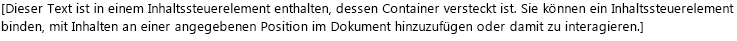
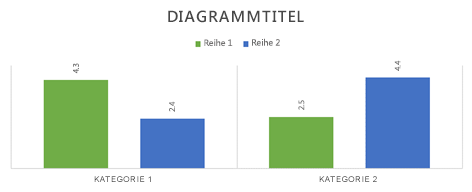
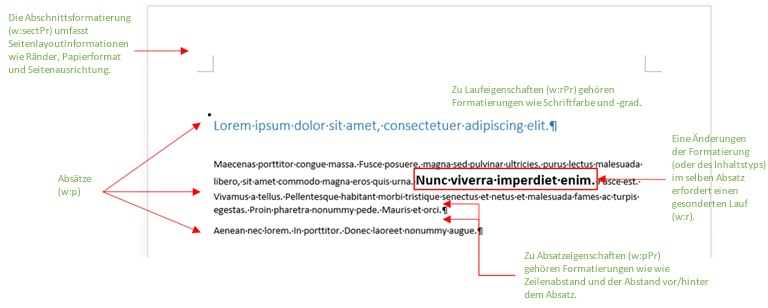
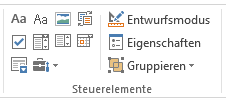

# Erstellen besserer Add-Ins für Word mit Office Open XML
Mithilfe von Office Open XML können Sie über Word-Add-Ins viele Arten von attraktiven Inhalten einfügen. Sie können Office Open XML auch ganz einfach bearbeiten, um das Markup zu vereinfachen und die Nutzlast zu minimieren.

 _**Gilt für:** apps for Office | Office Add-ins | Open XML | Word_

 **Zur Verfügung gestellt von:**    Stephanie Krieger Microsoft Corporation | Juan Balmori Labra, Microsoft Corporation

Wenn Sie Office-Add-Ins zur Ausführung in Word erstellen, wissen Sie wahrscheinlich bereits, dass die JavaScript-API für Office ( **Office.js**) mehrere Formate zum Schreiben und Lesen von Dokumentinhalten bietet. Diese werden als Koersionstypen bezeichnet und umfassen Nur-Text, Tabellen, HTML und Office Open XML.

Welches sind also Ihre Möglichkeiten, wenn Sie attraktive Inhalte, wie beispielsweise Bilder, formatierte Tabellen, Diagramme oder auch einfach nur formatierten Text, in ein Dokument einfügen müssen? 
Einige Arten von attraktiven Inhalten, beispielsweise Bilder, können Sie mithilfe von HTML-Code einfügen. Je nach Szenario kann die HTML-Koersion auch Nachteile mit sich bringen, wie beispielsweise Einschränkungen bei den für Ihre Inhalte verfügbaren Formatierungs- und Positionierungsoptionen.
Da Office Open XML die Sprache ist, in der Word-Dokumente (z. B. DOCX und DOTX) erstellt werden, können Sie nahezu jede Art von Inhalten, die ein Benutzer einem Word-Dokument hinzufügen kann, mit nahezu jeder Formatierung, die Benutzer anwenden können, einfügen. Die Bestimmung des hierfür notwendigen Office Open XML-Markups ist einfacher, als Sie vermutlich denken.

 >**Hinweis**  Office Open XML auch die Sprache hinter PowerPoint- und Excel-Dokumenten (und ab Office 2013 auch Visio-Dokumenten). Zurzeit können Sie jedoch Inhalte nur in Office-Add-Ins, die für Word erstellt wurden, in Office Open XML umwandeln. Weitere Informationen zu Office Open XML, einschließlich der vollständigen Sprachreferenzdokumentation, finden Sie unter [Zusätzliche Ressourcen](#zusätzliche-ressourcen).

Sehen Sie sich zuerst einige der Inhaltstypen an, die Sie mithilfe der Office Open XML-Koersion einfügen können.
Laden Sie das Codebeispiel [Word-Add-in-Load-and-write-Open-XML](https://github.com/OfficeDev/Word-Add-in-Load-and-write-Open-XML) herunter, das das Office Open XML-Markup und den Office.js-Code enthält, die zum Einfügen der folgenden Beispiele in Word benötigt werden.

 >**Hinweis**  Im gesamten Artikel beziehen sich die Begriffe  **Inhaltstypen** und **attraktive Inhalte** auf die Arten von attraktiven Inhalten, die Sie in ein Word-Dokument einfügen können.


**Abbildung 1: Text mit direkter Formatierung**


Mithilfe von direkter Formatierung können Sie genau angeben, wie der Text aussehen soll, unabhängig von bestehenden Formatierungen im Dokument des Benutzers.

**Abbildung 2: Mit einer Formatvorlage formatierter Text**


Sie können eine Formatvorlage verwenden, um das Erscheinungsbild des Texts, den Sie einfügen, automatisch mit dem Dokument des Benutzers zu koordinieren.

**Abbildung 3: Ein einfaches Bild**


Sie können dasselbe Verfahren verwenden, um jedes von Office unterstützte Bildformat einzufügen.

**Abbildung 4: Ein mit Bildformaten und Effekten formatiertes Bild**


Für das Hinzufügen qualitativ hochwertiger Formatierungen und Effekte zu Ihren Bildern ist viel weniger Markup erforderlich, als Sie vermutlich annehmen.

**Abbildung 5: Ein Inhaltssteuerelement**


Sie können Inhaltssteuerelemente in Verbindung mit Ihrem Add-In verwenden, um Inhalte nicht an der Auswahl sondern an einer bestimmten (gebundenen) Stelle einzufügen.

**Abbildung 6: Ein Textfeld mit WordArt-Formatierung**


Texteffekte sind in Word für Text in einem Textfeld (siehe unten) oder für regulären Textkörper verfügbar.

**Abbildlung 7: Eine Form**


Sie können integrierte oder benutzerdefinierte Zeichnungsformen mit oder ohne Text und Formatierungseffekte einfügen.

**Abbildung 8: Eine Tabelle mit direkter Formatierung**


Sie können Textformatierungen, Rahmen, Schattierungen oder jede gewünschte Tabellenformatierung einfügen oder die Zellengröße anpassen.

**Abbildung 9: Eine mit einem Tabellenformat formatierte Tabelle**


Sie können integrierte oder benutzerdefinierte Tabellenformate genauso einfach verwenden wie eine Absatzformatvorlage für Text.

**Abbildung 10: Ein SmartArt-Diagramm**


Office 2013 bietet eine breitgefächerte Palette von SmartArt-Diagrammlayouts (und Sie können mit Office Open XML Ihre eigenen Layouts erstellen).

**Abbildung 11: Ein Diagramm**


Sie können Excel-Diagramme als Livediagramme in Word-Dokumente einfügen. Dies bedeutet, Sie können diese in Ihrem Add-In für Word nutzen.
Wie aus den vorherigen Beispielen ersichtlich, können Sie mithilfe der Office Open XML-Koersion beinahe jeden Inhaltstyp einfügen, den Benutzer in ihr eigenes Dokument einfügen können.
Es gibt zwei einfache Wege, um das benötigte Office Open XML-Markup zu erhalten. Fügen Sie entweder Ihre attraktiven Inhalte einem ansonsten leeren Word 2013-Dokument hinzu, und speichern Sie die Datei dann im Word-XML-Dokumentformat, oder verwenden Sie ein Test-Add-In mit der Methode [getSelectedDataAsync](http://msdn.microsoft.com/de-de/library/fp142294.aspx), um das Markup zu erhalten. Mit beiden Verfahren wird im Wesentlichen das gleiche Ergebnis erzielt.

    
 >**Hinweis**  Bei einem Office Open XML-Dokument handelt es sich eigentlich um ein komprimiertes Paket mit Dateien, die die Dokumentinhalte darstellen. Durch das Speichern der Datei im Word-XML-Dokumentformat wird das gesamteOffice Open XML-Paket auf eine einzige XML-Datei reduziert. Sie erhalten dasselbe Ergebnis, wenn Sie  **getSelectedDataAsync** zum Abrufen des Office Open XML-Markups verwenden.

Wenn Sie die Datei in Word in einem XML-Format speichern, beachten Sie, dass es im Dialogfeld „Speichern unter" in der Liste „Dateityp" zwei Optionen für XML-Formatdateien gibt. Wählen Sie unbedingt  **Word-XML-Dokument** aus und nicht die Option für Word 2003.
Laden Sie das Codebeispiel namens [Word-Add-in-Get-Set-EditOpen-XML](https://github.com/OfficeDev/Word-Add-in-Get-Set-EditOpen-XML) herunter, mit dem Sie Ihr Markup abrufen und testen können.
War das schon alles? Noch nicht ganz. Ja, für viele Szenarien können Sie das vollständige vereinfachte Office Open XML-Ergebnis verwenden, das bei den vorgenannten Verfahren angezeigt wird, und es funktioniert. Die gute Nachricht ist, dass Sie wahrscheinlich den größten Teils dieses Markups nicht benötigen.
Wenn Sie einer der vielen Add-In-Entwickler sind, die Office Open XML-Markup zum ersten Mal sehen, fühlen Sie sich möglicherweise regelrecht überschüttet, wenn Sie versuchen, diesen erheblichen Umfang von Markup zu verstehen, das Sie bereits für das einfachste Inhaltselement erhalten. Dies muss aber nicht der Fall sein.
In diesem Thema verwenden wir einige gängige Szenarien, die uns die Office-Add-Ins-Entwicklercommunity zur Verfügung gestellt hat, um Ihnen die Techniken zur Vereinfachung von Office Open XML für die Verwendung in Ihrem Add-In vorzustellen. Wir untersuchen das Markup für einige zuvor gezeigte Inhaltstypen zusammen mit den Informationen, die Sie benötigen, um die Office Office Open XML-Last zu minimieren. Außerdem sehen wir uns den Code an, den Sie zum Einfügen attraktiver Inhalte in ein Dokument an der aktuellen Auswahl benötigen, und untersuchen, wie Office Open XML mit dem Bindings-Objekt zum Hinzufügen oder Ersetzen von Inhalten an angegebenen Positionen verwendet wird.

## Erkunden des Office Open XML-Dokumentpakets


Wenn Sie die Methode [getSelectedDataAsync](http://msdn.microsoft.com/de-de/library/fp142294.aspx) zum Abrufen von Office Open XML für eine Auswahl von Inhalten verwenden (oder wenn Sie das Dokument im Word-XML-Dokumentformat speichern), erhalten Sie nicht nur das Markup, das Ihre ausgewählten Inhalte beschreibt. Es handelt sich um ein vollständiges Dokument mit zahlreichen Optionen und Einstellungen, die Sie höchstwahrscheinlich nicht benötigen. Wenn Sie diese Methode in einem Dokument verwenden, das ein Aufgabenbereich-Add-In enthält, enthält das Markup, das Sie erhalten, tatsächlich sogar Ihren Aufgabenbereich.

Selbst ein einfaches Word-Dokumentpaket enthält Komponenten für Dokumenteigenschaften, Formatvorlagen, Designs (Formatierungseinstellungen), Webeinstellungen, Schriftarten und außerdem einige Komponenten zusätzlich zu den Komponenten für die tatsächlichen Inhalte.

Angenommen, Sie möchten lediglich einen Textabsatz mit direkter Formatierung einfügen (siehe Abbildung 1 oben). Wenn Sie Office Open XML für den formatierten Text mithilfe der Methode  **getSelectedDataAsync** abrufen, wird eine große Menge Markup angezeigt. Das Markup enthält ein Paketelement, das ein vollständiges Dokument mit mehreren Komponenten darstellt (diese werden in der Regel als Dokumentbausteine oder, in Office Open XML, als Paketkomponenten bezeichnet), wie in Abbildung 13 gezeigt. Jede Komponente stellt eine eigene Datei innerhalb des Pakets dar.


 >**Tipp**  Sie können Office Open XML-Markup in einem Texteditor wie dem Editor bearbeiten. Wenn Sie es in Visual Studio 2015 öffnen, können Sie das Paket zur einfacheren Bearbeitung mithilfe von  **Bearbeiten >Erweitert > Dokument formatieren** (STRG+K, STRG+D) formatieren. Anschließend können Sie Dokumentbausteine oder deren Abschnitte reduzieren oder erweitern (siehe Abbildung 12), damit Sie die Inhalte des Office Open XML-Pakets leichter überprüfen und bearbeiten können. Jeder Dokumentbaustein beginnt mit einem **pkg:part** -Tag.


**Abbildung 12: Reduzieren und Erweitern von Paketkomponenten für die einfachere Bearbeitung in Visual Studio 2015**


**Abbildung 13: Die in einem Office Open XML-Basisdokumentpaket für Word enthaltenen Komponenten**

Bei all dem Markup sind Sie wahrscheinlich überrascht, wenn Sie feststellen, dass die einzigen Elemente, die Sie tatsächlich zum Einfügen des formatierten Textbeispiels benötigen, Teile der Komponente  **.rels** und der Komponente **document.xml** sind.


    
 >**Hinweis**  Die beiden Zeilen mit Markup oberhalb des Pakettags (die XML-Deklarationen für die Version und die ID des Office-Programms) werden vorausgesetzt, wenn Sie den Office Open XML-Koersionstyp verwenden, und müssen daher von Ihnen nicht berücksichtigt werden. Behalten Sie sie bei, wenn Sie Ihr bearbeitetes Markup zum Testen als Word-Dokument öffnen möchten.

Zahlreiche der anderen zu Beginn dieses Themas genannten Inhaltstypen benötigen auch noch weitere Komponenten (außer den in Abbildung 13 aufgeführten). Damit beschäftigen wir uns weiter unten in diesem Thema. Da die meisten der in Abbildung 13 gezeigten Komponenten im Markup für jedes Word-Dokumentpaket enthalten sind, erhalten Sie in der Zwischenzeit eine kurze Übersicht über den Zweck jeder Komponente und erfahren, wann Sie sie benötigen:


- Innerhalb des Pakettags ist die erste Komponente die RELS-Datei, die die Beziehungen zwischen den Komponenten der obersten Ebene des Pakets definiert (in der Regel sind dies die Dokumenteigenschaften, ggf. Miniaturansichten und der Hauptdokumenttext). Ein Teil des Inhalts in dieser Komponente ist immer in Ihrem Markup erforderlich, da Sie die Beziehung zwischen dem Hauptdokumentbaustein (in dem sich Ihre Inhalte befinden) und dem Dokumentpaket definieren müssen.
    
- Die Komponente  **document.xml.rels** definiert die Beziehungen für zusätzliche Komponenten, die ggf. von der Komponente **document.xml** (Haupttextkörper) benötigt werden.
    

    
 >**Wichtig**  Die RELS-Dateien in Ihrem Paket (beispielsweise die Komponente  **.rels** der obersten Ebene, **document.xml.rels** und andere, die möglicherweise für bestimmte Inhaltstypen vorhanden sind) sind ein äußerst wichtiges Tool, das Ihnen dabei helfen kann, Ihr Office Open XML-Paket schnell von oben nach unten zu bearbeiten. Weitere Informationen zur Vorgehensweise finden Sie weiter unten in diesem Thema unter [Erstellen Ihres eigenen Markups: bewährte Methoden](#erstellen-ihres-eigenen-markups-bewährte-methoden).


- Bei der Komponente  **document.xml** handelt es sich um den Inhalt des Haupttextkörpers des Dokuments. Sie benötigen natürlich Elemente dieser Komponente, da an dieser Stelle Ihre Inhalte angezeigt werden. Sie benötigen aber nicht alles, was in dieser Komponente angezeigt wird. Wir werden uns dies später genauer ansehen.
    
- Viele Komponenten werden automatisch von den Set-Methoden ignoriert, wenn Inhalte mithilfe der Office Open XML-Koersion in ein Dokument eingefügt werden. Sie können sie also auch entfernen. Zu diesen Komponenten zählen die Datei  **theme1.xml** (das Formatierungsdesign des Dokuments), die Komponenten mit den Dokumenteigenschaften (Kern, Add-In und Miniaturansicht) und die Einstellungsdateien (einschließlich "settings", "webSettings" und "fontTable").
    
- Im Beispiel in Abbildung 1 wird die Textformatierung direkt angewendet (d. h. jede Schriftart- und jede Absatzformatierungseinstellung wird individuell angewendet). Sofern Sie jedoch eine Formatvorlage verwenden (wenn Ihr Text beispielsweise automatisch die Formatierung der Formatvorlage  **Überschrift 1** im Zieldokument übernehmen soll), wie zuvor in Abbildung 2 gezeigt, benötigen Sie einen Teil der Komponente **styles.xml** sowie eine Beziehungsdefinition für diese. Weitere Informationen finden Sie im Abschnitt [Hinzufügen von Objekten, die zusätzliche Office Open XML-Komponenten nutzen](#hinzufügen-von-objekten-die-zusätzliche-office-open-xml-komponenten-nutzen).
    

## Einfügen von Dokumentinhalten an der Auswahl


Sehen wir uns nun das für die Formatierung des Textbeispiels in Abbildung 1 erforderliche minimale Office Open XML-Markup und den zum Einfügen des Beispiels an der aktiven Auswahl im Dokument erforderlichen JavaScript-Code an.


### Vereinfachtes Office Open XML-Markup

Wir haben das hier gezeigte Office Open XML-Beispiel so bearbeitet (wie im vorherigen Abschnitt beschrieben), dass nur die erforderlichen Dokumentbausteine und die erforderlichen Elemente innerhalb dieser Komponenten übrig bleiben. Im nächsten Abschnitt des Themas werden Sie durch die einzelnen Schritte geführt, mit denen Sie das Markup selbst bearbeiten können. (Außerdem werden die verbleibenden Elemente näher erläutert.)


```XML
<pkg:package xmlns:pkg="http://schemas.microsoft.com/office/2006/xmlPackage">
  <pkg:part pkg:name="/_rels/.rels" pkg:contentType="application/vnd.openxmlformats-package.relationships+xml" pkg:padding="512">
    <pkg:xmlData>
      <Relationships xmlns="http://schemas.openxmlformats.org/package/2006/relationships">
        <Relationship Id="rId1" Type="http://schemas.openxmlformats.org/officeDocument/2006/relationships/officeDocument" Target="word/document.xml"/>
      </Relationships>
    </pkg:xmlData>
  </pkg:part>
  <pkg:part pkg:name="/word/document.xml" pkg:contentType="application/vnd.openxmlformats-officedocument.wordprocessingml.document.main+xml">
    <pkg:xmlData>
      <w:document xmlns:w="http://schemas.openxmlformats.org/wordprocessingml/2006/main" >
        <w:body>
          <w:p>
            <w:pPr>
              <w:spacing w:before="360" w:after="0" w:line="480" w:lineRule="auto"/>
              <w:rPr>
                <w:color w:val="70AD47" w:themeColor="accent6"/>
                <w:sz w:val="28"/>
              </w:rPr>
            </w:pPr>
            <w:r>
              <w:rPr>
                <w:color w:val="70AD47" w:themeColor="accent6"/>
                <w:sz w:val="28"/>
              </w:rPr>
              <w:t>This text has formatting directly applied to achieve its font size, color, line spacing, and paragraph spacing.</w:t>
            </w:r>
          </w:p>
        </w:body>
      </w:document>
    </pkg:xmlData>
  </pkg:part>
</pkg:package>
```


 >**Hinweis**  Falls Sie das hier dargestellte Markup einer XML-Datei zusammen mit den XML-Deklarationstags für "version" und "mso-application" am oberen Rand der Datei (siehe Abbildung 13) hinzufügen, können Sie die Datei in Word als Word-Dokument öffnen. Ohne diese Tags können Sie die Datei weiterhin über  **Datei> Öffnen** in Word öffnen. In der Titelleiste von Word 2013 wird **Kompatibilitätsmodus** angezeigt, da Sie die Einstellungen entfernt haben, die Word mitteilen, dass es sich um ein Word 2013-Dokument handelt. Da Sie dieses Markup einem bestehenden Word 2013-Dokument hinzufügen, wirkt sich dies in keiner Weise auf Ihre Inhalte aus.


### JavaScript für die Verwendung von "setSelectedDataAsync"


Sobald Sie das vorherige Office Open XML-Markup als XML-Datei gespeichert haben, die von Ihrer Lösung aus zugänglich ist, können Sie die folgende Funktion verwenden, um mithilfe der Office Open XML-Koersion die formatierten Textinhalte im Dokument festzulegen. 

Beachten Sie bei dieser Funktion, dass alle Zeilen außer der letzten verwendet werden, um Ihr gespeichertes Markup zur Verwendung im Aufruf der Methode [setSelectedDataAsync](http://msdn.microsoft.com/de-de/library/fp142145.aspx) am Ende der Funktion abzurufen. **setSelectedDataASync** erfordert nur die Angabe der einzufügenden Inhalte und des Koersionstyps.


 >**Hinweis**  Ersetzen Sie  _IhrXMLDateiname_ durch den Namen und den Pfad der in Ihrer Lösung gespeicherten XML-Datei. Wenn Sie nicht sicher sind, wo die XML-Dateien in Ihrer Lösung eingefügt werden müssen oder wie im Code auf sie verwiesen werden muss, finden Sie im Codebeispiel [Word-Add-in-Load-and-write-Open-XML](https://github.com/OfficeDev/Word-Add-in-Load-and-write-Open-XML) Beispiele hierfür sowie ein funktionsfähiges Beispiel des hier angegebenen Markups und JavaScript-Codes.


```
function writeContent() {
    var myOOXMLRequest = new XMLHttpRequest();
    var myXML;
    myOOXMLRequest.open('GET', ‘yourXMLfilename’, false);
    myOOXMLRequest.send();
    if (myOOXMLRequest.status === 200) {
        myXML = myOOXMLRequest.responseText;
    }
    Office.context.document.setSelectedDataAsync(myXML, { coercionType: 'ooxml' });
}
```


## Erstellen Ihres eigenen Markups: bewährte Methoden


Sehen wir uns nun das Markup näher an, das Sie zum Einfügen des vorherigen formatierten Textbeispiels benötigen.

Beginnen Sie bei diesem Beispiel damit, einfach alle Dokumentbausteine außer  **.rels** und **document.xml** aus dem Paket zu löschen. Anschließend bearbeiten wir die beiden erforderlichen Komponenten, um die Dinge weiter zu vereinfachen.


 >**Wichtig**  Verwenden Sie die Komponenten vom Typ  **.rels** als eine Art Übersichtsplan, um schnell den Inhalt des Pakets abzuschätzen und um zu ermitteln, welche Komponenten Sie vollständig löschen können (d. h. alle Komponenten, die sich nicht auf Ihre Inhalte beziehen oder die nicht von Ihren Inhalten referenziert werden). Beachten Sie, dass für jeden Dokumentbaustein eine Beziehung im Paket definiert sein muss. Diese Beziehungen werden in den RELS-Dateien angezeigt. Sie sollten also alle in **.rels**,  **document.xml.rels** oder einer inhaltsspezifischen RELS-Datei aufgelistet sein.

Das folgende Markup zeigt die erforderliche Komponente  **.rels** vor der Bearbeitung. Da wir die Add-In- und die Kernkomponenten mit Dokumenteigenschaften sowie die Miniaturansichtenkomponente löschen, müssen wir diese Beziehungen ebenfalls aus **.rels** löschen. Beachten Sie, dass dadurch nur die Beziehung (mit der Beziehungs-ID "rID1" im folgenden Beispiel) für **document.xml** übrig bleibt.


```XML
  <pkg:part pkg:name="/_rels/.rels" pkg:contentType="application/vnd.openxmlformats-package.relationships+xml" pkg:padding="512">
    <pkg:xmlData>
      <Relationships xmlns="http://schemas.openxmlformats.org/package/2006/relationships">
        <Relationship Id="rId3" Type="http://schemas.openxmlformats.org/package/2006/relationships/metadata/core-properties" Target="docProps/core.xml"/>
        <Relationship Id="rId2" Type="http://schemas.openxmlformats.org/package/2006/relationships/metadata/thumbnail" Target="docProps/thumbnail.emf"/>
        <Relationship Id="rId1" Type="http://schemas.openxmlformats.org/officeDocument/2006/relationships/officeDocument" Target="word/document.xml"/>
        <Relationship Id="rId4" Type="http://schemas.openxmlformats.org/officeDocument/2006/relationships/extended-properties" Target="docProps/app.xml"/>
      </Relationships>
    </pkg:xmlData>
  </pkg:part>
```


 >**Wichtig**  Entfernen Sie die Beziehungen (d. h. das  ** **&lt;Relationship…&gt;**** -Tag) für alle Komponenten, die Sie vollständig aus dem Paket entfernen. Das Einschließen einer Komponente ohne eine entsprechende Beziehung oder das Ausschließen einer Komponente und Belassen ihrer Beziehung im Paket ruft einen Fehler hervor.

Das folgende Markup zeigt die Komponente  **document.xml**, die die formatierten Textinhalte aus dem Beispiel enthält, vor der Bearbeitung.


```XML
<pkg:part pkg:name="/word/document.xml" pkg:contentType="application/vnd.openxmlformats-officedocument.wordprocessingml.document.main+xml">
    <pkg:xmlData>
      <w:document mc:Ignorable="w14 w15 wp14" xmlns:wpc="http://schemas.microsoft.com/office/word/2010/wordprocessingCanvas" xmlns:mc="http://schemas.openxmlformats.org/markup-compatibility/2006" xmlns:o="urn:schemas-microsoft-com:office:office" xmlns:r="http://schemas.openxmlformats.org/officeDocument/2006/relationships" xmlns:m="http://schemas.openxmlformats.org/officeDocument/2006/math" xmlns:v="urn:schemas-microsoft-com:vml" xmlns:wp14="http://schemas.microsoft.com/office/word/2010/wordprocessingDrawing" xmlns:wp="http://schemas.openxmlformats.org/drawingml/2006/wordprocessingDrawing" xmlns:w10="urn:schemas-microsoft-com:office:word" xmlns:w="http://schemas.openxmlformats.org/wordprocessingml/2006/main" xmlns:w14="http://schemas.microsoft.com/office/word/2010/wordml" xmlns:w15="http://schemas.microsoft.com/office/word/2012/wordml" xmlns:wpg="http://schemas.microsoft.com/office/word/2010/wordprocessingGroup" xmlns:wpi="http://schemas.microsoft.com/office/word/2010/wordprocessingInk" xmlns:wne="http://schemas.microsoft.com/office/word/2006/wordml" xmlns:wps="http://schemas.microsoft.com/office/word/2010/wordprocessingShape">
        <w:body>
          <w:p>
            <w:pPr>
              <w:spacing w:before="360" w:after="0" w:line="480" w:lineRule="auto"/>
              <w:rPr>
                <w:color w:val="70AD47" w:themeColor="accent6"/>
                <w:sz w:val="28"/>
              </w:rPr>
            </w:pPr>
            <w:r>
              <w:rPr>
                <w:color w:val="70AD47" w:themeColor="accent6"/>
                <w:sz w:val="28"/>
              </w:rPr>
              <w:t>This text has formatting directly applied to achieve its font size, color, line spacing, and paragraph spacing.</w:t>
            </w:r>
            <w:bookmarkStart w:id="0" w:name="_GoBack"/>
            <w:bookmarkEnd w:id="0"/>
          </w:p>
          <w:p/>
          <w:sectPr>
            <w:pgSz w:w="12240" w:h="15840"/>
            <w:pgMar w:top="1440" w:right="1440" w:bottom="1440" w:left="1440" w:header="720" w:footer="720" w:gutter="0"/>
            <w:cols w:space="720"/>
          </w:sectPr>
        </w:body>
      </w:document>
    </pkg:xmlData>
  </pkg:part>
```

Da  **document.xml** der primäre Dokumentbaustein ist, in dem Sie Ihre Inhalte platzieren, sehen wir uns diese Komponente nun schnell einmal näher an. Abbildung 14, die auf diese Liste folgt, stellt eine visuelle Referenz zur Verfügung, die zeigt, wie sich einige der wichtigsten hier erläuterten Inhalts- und Formatierungstags auf die in einem Word-Dokument angezeigten Inhalte beziehen.


- Das öffnende  ** **w:document**** -Tag enthält mehrere Namespace-Auflistungen ( ** **xmlns**** ). Viele dieser Namespaces beziehen sich auf bestimmte Inhaltstypen und werden nur benötigt, wenn sie für Ihre Inhalte relevant sind.
    
    Beachten Sie, dass das Präfix für die Tags überall in einem Dokumentbaustein auf die Namespaces zurück verweist. In diesem Beispiel ist  ** **w:**** das einzige Präfix, das in den Tags der Komponente **document.xml** verwendet wird. Daher ist ** **xmlns:w**** der einzige Namespace, der im öffnenden ** **w:document**** -Tag verbleiben muss.
    

 >**Tipp**  Wenn Sie Ihr Markup in Visual Studio 2015 bearbeiten, sehen Sie nach dem Löschen von Namespaces in einer Komponente alle Tags der Komponente durch. Falls Sie einen Namespace entfernt haben, der für Ihr Markup erforderlich ist, erhält das relevante Präfix für betroffene Tags eine verschnörkelte rote Unterstreichung. Falls Sie den Namespace  ** **xmlns:mc**** entfernen, müssen Sie auch das Attribut **mc:Ignorable** entfernen, das den Namespace-Auflistungen vorangeht.


- Innerhalb des öffnenden body-Tags wird ein paragraph-Tag angezeigt ( ** **w:p**** ), das die Beispielinhalte für dieses Beispiel enthält.
    
- Das  ** **w:pPr**** -Tag enthält Eigenschaften für direkt angewendete Absatzformatierungen, wie beispielsweise Leerzeichen vor oder nach dem Absatz, Absatzausrichtung und Einzüge. (Direkte Formatierung bezieht sich auf Attribute, die Sie nicht als Bestandteil einer Formatvorlage sondern individuell auf Inhalte anwenden.) Dieses Tag enthält außerdem direkte Schriftformatierungen, die auf den gesamten Absatz angewendet werden, in einem geschachtelten ** **w:rPr**** -Tag (Ausführungseigenschaften), das die in unserem Beispiel festgelegte Schriftfarbe und -größe enthält.
    

 >**Hinweis**  Sie stellen möglicherweise fest, dass die Schriftgrößen und einige andere Formatierungseinstellungen in Office Open XML-Markup für Word aussehen, als seien sie doppelt so groß wie ihre tatsächliche Größe. Der Grund dafür ist, dass Absatz- und Zeilenabstand sowie einige der im vorherigen Markup angezeigten Eigenschaften der Absatzformatierung in Twips (1/20 Punkt) angegeben werden.Je nachdem, mit welchen Inhaltstypen Sie in Office Open XML arbeiten, werden möglicherweise weitere Maßeinheiten angezeigt, darunter English Metric Units (914.400 EMUs entspricht 1 Zoll), die für einige Office Art-Werte (drawingML) verwendet werden, und das 100.000fache des tatsächlichen Werts, eine in drawingML- und PowerPoint-Markup verwendet Maßeinheit. PowerPoint drückt einige Werte als das 100fache des tatsächlichen Werts aus, und Excel nutzt im Allgemeinen Istwerte.


- Innerhalb eines Absatzes werden alle Inhalte mit derartigen Eigenschaften in eine Ausführung ( ** **w:r**** ) aufgenommen. Dies trifft auch auf den Beispieltext zu. Bei jeder Änderung an einer Formatierung oder einem Inhaltstyp beginnt eine neue Ausführung. (Wenn auch nur ein einziges Wort im Beispieltext fett formatiert ist, wird hierfür eine eigene Ausführung gestartet). In diesem Beispiel enthält der Inhalt nur die eine Textausführung.
    
    Beachten Sie Folgendes: Da es sich bei der Formatierung in diesem Beispiel um Fettformatierung handelt (d. h. die Formatierung kann sogar auf ein einzelnes Zeichen angewendet werden), wird sie auch in den Eigenschaften für die individuelle Ausführung angezeigt. 
    
- Beachten Sie auch die Tags für das verborgene "_GoBack"-Lesezeichen ( ** **w:bookmarkStart**** und ** **w:bookmarkEnd**** ), die standardmäßig in Word 2013-Dokumenten angezeigt werden. Sie können die Anfangs- und Endtags für das GoBack-Lesezeichen immer aus Ihrem Markup löschen.
    
- Das letzte Element des Dokumenttexts ist das  ** **w:sectPr**** -Tag oder die Abschnittseigenschaften. Dieses Tag enthält Einstellungen wie Ränder und Seitenausrichtung. Die Inhalte, die Sie mit der **setSelectedDataAsync** -Methode einfügen, übernehmen standardmäßig die Eigenschaften des aktiven Abschnitts im Zieldokument. Sofern Ihre Inhalte keinen Abschnittsumbruch enthalten (in diesem Fall werden mehrere ** **w:sectPr**** -Tags angezeigt), können Sie dieses Tag löschen.
    

**Abbildung 14: Beziehung zwischen gängigen Tags in document.xml und den Inhalten sowie dem Layout eines Word-Dokuments**


    
 >**Tipp**  In von Ihnen erstelltem Markup wird möglicherweise in mehreren Tags ein weiteres Attribut angezeigt, das die Zeichen  ** **w:rsid**** enthält, die in den Beispielen in diesem Thema nicht vorkommen. Dies sind Revisionskennungen. Sie werden in Word für das Feature **Dokumente zusammenfassen** verwendet und sind standardmäßig aktiviert. Sie werden in Markup, das Sie mit Ihrem Add-In einfügen, nie benötigt. Durch Deaktivieren dieser Kennungen lässt sich das Markup wesentlich übersichtlicher gestalten. Sie können problemlos vorhandene RSID-Tags entfernen oder das Feature deaktivieren (wie im folgenden Verfahren beschrieben), sodass diese Ihrem Markup für neue Inhalte nicht hinzugefügt werden.Wenn Sie die Funktionen für die gemeinsame Dokumenterstellung in Word verwenden (d. h. die Möglichkeit, Dokumente gemeinsam mit anderen zu bearbeiten), sollten Sie das Feature wieder aktivieren, nachdem Sie das Markup für Ihr Add-In generiert haben.Gehen Sie wie folgt vor, um die RSID-Attribute in Word für zukünftig erstellte Dokumente zu deaktivieren: Zum Entfernen der RSID-Tags aus einen vorhandenen Dokument probieren Sie die folgende Tastenkombination bei in Office Open XML geöffnetem Dokument aus:

Nachdem Sie den größten Teil des Markups aus diesem Paket entfernt haben, ist nun das minimal erforderliche Markup übrig, das für das Beispiel eingefügt werden muss (siehe vorheriger Abschnitt).


## Verwenden der gleichen Office Open XML-Struktur für verschiedene Inhaltstypen


Für mehrere Arten von attraktiven Inhalten sind nur die im vorherigen Beispiel gezeigten Komponenten  **.rels** und **document.xml**, einschließlich Inhaltssteuerelemente, Office-Zeichnungsformen und Textfeldern sowie Tabellen (es sei denn, auf die Tabelle wurde eine Formatvorlage angewendet) erforderlich. Sie können tatsächlich die gleichen bearbeiteten Paketkomponenten erneut verwenden und einfach die  ** **&lt;body&gt;**** -Inhalte in **document.xml** für das Markup Ihrer Inhalte auslagern.

Zum Überprüfen des Office Open XML-Markups für die Beispiele dieser Inhaltstypen (siehe Abbildung 5 bis 8) sehen Sie sich das Codebeispiel [Word-Add-in-Load-and-write-Open-XML](https://github.com/OfficeDev/Word-Add-in-Load-and-write-Open-XML) an, auf das im Abschnitt [Übersicht](#Übersicht) verwiesen wird.

Bevor wir fortfahren, sehen wir uns an, welche Unterschiede zwischen einigen dieser Inhaltstypen bestehen und wie Sie die benötigten Elemente auslagern.


### Informationen zu drawingML-Markup (Office-Grafiken) in Word: Was sind Fallbacks?

Falls das Markup für die Form oder das Textfeld wesentlich komplexer aussieht, als Sie erwartet hatten, hat dies einen Grund. Ab Office 2007 wurden Office Open XML-Formate sowie ein neues Office-Grafikmodul eingeführt, das vollständig für PowerPoint und Excel übernommen wurde. In der Version von 2007 wurde nur ein Teil dieses Grafikmoduls in Word integriert. Dabei wurden das aktualisierte Excel-Diagrammerstellungsmodul, SmartArt-Grafiken und erweiterte Bildtools eingeführt. Für Formen und Textfelder verwendet Word 2007 weiterhin ältere Zeichnungsobjekte (VML). In der Version Word 2010 wurden die weiteren Schritte hinsichtlich des Grafikmoduls vollzogen, und aktualisierte Formen und Zeichentools wurden integriert.

Zur Unterstützung von Formen und Textfeldern in Word-Dokumenten im Office Open XML-Format, die in Word 2007 geöffnet werden, benötigen Formen (einschließlich Textfeldern) daher Fallback-VML-Markup.

Wie aus den Beispielen für Formen und Textfelder im Codebeispiel [Word-Add-in-Load-and-write-Open-XML](https://github.com/OfficeDev/Word-Add-in-Load-and-write-Open-XML) ersichtlich ist, kann das Fallback-Markup in der Regel entfernt werden. Word 2013 fügt automatisch fehlendes Fallback-Markup zu Formen hinzu, wenn ein Dokument gespeichert wird. Wenn Sie es jedoch vorziehen, das Fallback-Markup beizubehalten, um sicherzustellen, dass alle Szenarien unterstützt werden, spricht nichts dagegen.

Wenn Sie in Ihren Inhalten gruppierte Zeichnungsobjekte gruppiert haben, wird weiteres (offenbar wiederholtes) Markup angezeigt, das jedoch beibehalten werden muss. Teile des Markups für Zeichnungsformen werden dupliziert, wenn das Objekt in einer Gruppe enthalten ist.


 >**Wichtig**  Überprüfen Sie bei der Arbeit mit Textfeldern und Zeichnungsformen die Namespaces sorgfältig, bevor Sie sie aus  **document.xml** entfernen. (Oder fügen Sie unbedingt alle erforderlichen Namespaces, die Sie möglicherweise zuvor aus **document.xml** entfernt haben, wieder hinzu, wenn Sie Markup aus einem anderen Objekttyp erneut verwenden.) Ein erheblicher Anteil der standardmäßig in **document.xml** enthaltenen Namespaces ist für die Anforderungen von Zeichnungsobjekten vorgesehen.


#### Informationen zur Positionierung von Grafiken

In den Codebeispielen [Word-Add-in-Load-and-write-Open-XML](https://github.com/OfficeDev/Word-Add-in-Load-and-write-Open-XML)and [Word-Add-in-Get-Set-EditOpen-XML](https://github.com/OfficeDev/Word-Add-in-Get-Set-EditOpen-XML) werden Textfelder und Formen mithilfe von verschiedenen Einstellungen für Textumbruch und Positionierung eingerichtet. (Beachten Sie auch, dass die Bildbeispiele in diesen Codebeispielen inline mit Textformatierungen eingerichtet werden, wodurch ein Grafikobjekt auf der Textbasislinie positioniert wird.)

Die Form in diesen Codebeispielen wird mit Bezug zum rechten und unteren Seitenrand angeordnet. Durch die relative Positionierung können Sie Ihre Vorstellungen leichter mit der unbekannten Dokumenteinrichtung eines Benutzers koordinieren, da die Ausrichtung an den vom Benutzer festgelegten Rändern erfolgt. Das Risiko einer merkwürdig anmutenden Darstellung aufgrund von Papiergröße, Ausrichtung und Randeinstellungen lässt sich hierdurch zudem verringern. Um relative Positionierungseinstellungen beim Einfügen eines Grafikobjekts beizubehalten, müssen Sie die Absatzmarke (w:p) beibehalten, in der die Positionierung (wird in Word als Anker bezeichnet) gespeichert ist. Wenn Sie den Inhalt an einer bestehenden Absatzmarke einfügen, statt eine eigene einzufügen, können Sie möglicherweise das gleiche anfängliche visuelle Erscheinungsbild beibehalten. Viele Arten von relativen Verweisen, die die automatische Anpassung der Positionierung an das Layout des Benutzers ermöglichen, gehen jedoch ggf. verloren.


### Arbeiten mit Inhaltssteuerelementen

Inhaltssteuerelemente sind ein wichtiges Feature in Word 2013. Sie können das Leistungsspektrum Ihres Add-Ins für Word auf verschiedene Weise erheblich verbessern. Dazu zählt auch die Möglichkeit, Inhalte nicht nur an der Auswahl sondern auch an angegebenen Positionen in das Dokument einzufügen.

In Word stehen Inhaltssteuerelemente auf der Registerkarte  **Entwicklertools** des Menübands zur Verfügung (siehe Abbildung 15).


**Abbildung 15: Die Gruppe "Steuerelemente" auf der Registerkarte "Entwicklertools" in Word**

Zu den Arten von Inhaltssteuerelementen in Word zählen Rich-Text, Nur-Text, Bild, Bausteinkatalog, Kontrollkästchen, Dropdownliste, Kombinationsfeld, Datumsauswahl und wiederholte Abschnitte. 


- Mit dem Befehl  **Eigenschaften** in Abbildung 15 können Sie den Titel des Steuerelements bearbeiten und Einstellungen wie das Ausblenden des Steuerelementcontainers festlegen.
    
- Aktivieren Sie den  **Entwurfsmodus**, um Platzhalterinhalte im Steuerelement zu bearbeiten.
    
Falls Ihr Add-In mit einer Word-Vorlage arbeitet, können Sie Steuerelemente in diese Vorlage aufnehmen, um das Verhalten der Inhalte zu verbessern. Außerdem können Sie mithilfe der XML-Datenbindung in einem Word-Dokument Inhaltssteuerelemente an Daten, wie zum Beispiel Dokumenteigenschaften, zum einfacheren Ausfüllen von Formularen oder für ähnliche Aufgaben binden. (Steuerelemente, die bereits an integrierte Dokumenteigenschaften in Word gebunden sind, finden Sie auf der Registerkarte  **Einfügen** unter **Schnellbausteine**.)

Wenn Sie Inhaltssteuerelemente mit Ihrem Add-In verwenden, können Sie die Optionen für die Einsatzbereiche Ihres Add-Ins mithilfe eines anderen Bindungstyps erheblich erweitern. Sie können von dem Add-In aus eine Bindung an ein Steuerelement einrichten und anschließend Inhalte für die Bindung statt für die aktive Auswahl erstellen.


    
 >**Hinweis**  Verwechseln Sie XML-Datenbindungen in Word nicht mit der Möglichkeit, eine Bindung an ein Steuerelement über Ihr Add-In einzurichten. Es handelt sich dabei um völlig voneinander getrennte Features. Sie können jedoch benannte Inhaltssteuerelemente in die Inhalte aufnehmen, die Sie über Ihr Add-In mithilfe der OOXML-Koersion einfügen, und den Code im Add-In dann zum Einrichten einer Bindung an diese Steuerelemente verwenden.

Beachten Sie auch, dass sowohl die XML-Datenbindung als auch  **Office.js** mit benutzerdefinierten XML-Komponenten in Ihrer App interagieren können. Es besteht also die Möglichkeit, diese leistungsfähigen Tools zu integrieren. Informationen zur Arbeit mit benutzerdefinierten XML-Komponenten in der JavaScript-API für Office finden Sie im Abschnitt [Zusätzliche Ressourcen](#zusätzliche-ressourcen) in diesem Thema.

Die Arbeit mit Bindungen in Ihrem Word-Add-In wird im nächsten Abschnitt des Themas behandelt. Sehen wir uns zunächst ein Beispiel des Office Open XML-Markups an, das zum Einfügen eines Rich-Text-Steuerelements erforderlich ist, mit dem Sie unter Verwendung Ihres Add-Ins eine Bindung erstellen können.


    
 >**Wichtig**  Rich-Text-Steuerelemente sind die einzige Art von Steuerelement, die Sie zum Einrichten einer Bindung an ein Steuerelement von Ihrem Add-In aus verwenden können.


```XML
<pkg:package xmlns:pkg="http://schemas.microsoft.com/office/2006/xmlPackage">
  <pkg:part pkg:name="/_rels/.rels" pkg:contentType="application/vnd.openxmlformats-package.relationships+xml" pkg:padding="512">
    <pkg:xmlData>
      <Relationships xmlns="http://schemas.openxmlformats.org/package/2006/relationships">
        <Relationship Id="rId1" Type="http://schemas.openxmlformats.org/officeDocument/2006/relationships/officeDocument" Target="word/document.xml"/>
      </Relationships>
    </pkg:xmlData>
  </pkg:part>
  <pkg:part pkg:name="/word/document.xml" pkg:contentType="application/vnd.openxmlformats-officedocument.wordprocessingml.document.main+xml">
    <pkg:xmlData>
      <w:document xmlns:w="http://schemas.openxmlformats.org/wordprocessingml/2006/main" xmlns:w15="http://schemas.microsoft.com/office/word/2012/wordml" >
        <w:body>
          <w:p/>
          <w:sdt>
              <w:sdtPr>
                <w:alias w:val="MyContentControlTitle"/>
                <w:id w:val="1382295294"/>
                <w15:appearance w15:val="hidden"/>
                <w:showingPlcHdr/>
              </w:sdtPr>
              <w:sdtContent>
                <w:p>
                  <w:r>
                  <w:t>[This text is inside a content control that has its container hidden. You can bind to a content control to add or interact with content at a specified location in the document.]</w:t>
                </w:r>
                </w:p>
              </w:sdtContent>
            </w:sdt>
          </w:body>
      </w:document>
    </pkg:xmlData>
  </pkg:part>
 </pkg:package>
```

Inhaltssteuerelemente erfordern ebenso wie formatierter Text keine zusätzlichen Dokumentbausteine. Daher sind hier nur die bearbeiteten Versionen der Komponenten  **.rels** und **document.xml** enthalten.

Das  ** **w:sdt**** -Tag, das im Textkörper von **document.xml** angezeigt wird, stellt das Inhaltssteuerelement dar. Wenn Sie das Office Open XML-Markup für ein Steuerelement generieren, stellen Sie fest, dass zahlreiche Attribute aus diesem Beispiel entfernt wurden, einschließlich der Tag- und Dokumentbausteineigenschaften. Nur wesentliche Elemente (und einige bewährte Methoden) wurden beibehalten, einschließlich der Folgenden:


- Der  ** **alias**** ist die Titeleigenschaft aus dem Dialogfeld **Eigenschaften von Inhaltssteuerelementen** in Word. Dies ist eine erforderliche Eigenschaft (die den Namen des Elements darstellt), wenn Sie beabsichtigen, eine Bindung an das Steuerelement von Ihrem Add-In aus einzurichten.
    
- Die eindeutige  ** **id**** ist eine erforderliche Eigenschaft. Wenn Sie eine Bindung an das Steuerelement von Ihrem Add-In aus einrichten, ist die ID die Eigenschaft, die die Bindung im Dokument verwendet, um das zutreffende benannte Steuerelement zu ermitteln.
    
- Das  ** **appearance**** -Attribut wird zum Ausblenden des Steuerelementcontainers verwendet, um ein übersichtlicheres Erscheinungsbild zu erzielen. Dies ist ein neues Feature in Word 2013, wie aus der Verwendung des w15-Namespace ersichtlich. Da diese Eigenschaft verwendet wird, wird der w15-Namespace zu Beginn der Komponente **document.xml** beibehalten.
    
- Bei dem  ** **showingPlcHdr**** -Attribut handelt es sich um eine optionale Einstellung, mit der die von Ihnen in das Steuerelement aufgenommenen Standardinhalte (in diesem Beispiel Text) als Platzhalterinhalte festgelegt werden. Wenn der Benutzer auf den Steuerelementbereich tippt oder klickt, wird der gesamte Inhalt ausgewählt, d. h. der Inhalt verhält sich nicht wie bearbeitbarer Inhalt, in dem Benutzer Änderungen vornehmen können.
    
- Obwohl die leere Absatzmarke ( ** **&lt;w:p/&gt;**** ), die dem ** **sdt**** -Tag vorangeht, zum Hinzufügen eines Inhaltssteuerelements nicht erforderlich ist (und vertikalen Abstand über dem Steuerelement im Word-Dokument hinzufügt), stellt sie sicher, dass das Steuerelement in seinem eigenen Absatz platziert wird. Dies kann wichtig sein, je nach Typ und Formatierung der Inhalte, die im Steuerelement hinzugefügt werden.
    
- Wenn Sie beabsichtigen, eine Bindung an das Steuerelement einzurichten, muss der Standardinhalt für das Steuerelement (die im  ** **sdtContent**** -Tag enthaltenen Inhalte) mindestens einen vollständigen Absatz umfassen (wie in diesem Beispiel), damit die Bindung aus mehreren Absätzen bestehende attraktive Inhalte akzeptiert.
    

    
 >**Hinweis**  Das aus diesem  ** **w:sdt**** -Beispieltag entfernte Dokumentbausteinattribut kann in einem Inhaltssteuerelement angezeigt werden, um auf eine separate Komponente in dem Paket zu verweisen, in dem Platzhalterinhalte gespeichert werden können (Komponenten, die sich in einem Glossarverzeichnis im Office Open XML-Paket befinden). Der Begriff Dokumentbaustein wird zwar für XML-Komponenten (d. h. Dateien) innerhalb eines Office Open XML-Pakets verwendet. Wird der Begriff Dokumentbaustein jedoch in der sdt-Eigenschaft verwendet, bezieht er sich auf den gleichen Begriff in Word, mit dem einige Inhaltstypen wie Bausteine und Schnellbausteine für Dokumenteigenschaften beschrieben werden (beispielsweise integrierte Steuerelemente mit XML-Datenbindung). Wenn Ihnen Komponenten unter einem Glossarverzeichnis in Ihrem Office Open XML-Paket angezeigt werden, müssen Sie sie möglicherweise beibehalten, falls die von Ihnen eingefügten Inhalte diese Features enthalten. Für ein typisches Inhaltssteuerelement, für das Sie von Ihrem Add-In aus eine Bindung erstellen möchten, sind sie nicht erforderlich. Beachten Sie, dass Sie auch das Dokumentbausteinattribut aus dem **w:sdt**-Tag entfernen müssen, wenn Sie die Glossarkomponenten aus dem Paket löschen. 

Im nächsten Abschnitt wird erörtert, wie Sie Bindungen in Ihrer Add-In für Word erstellen und verwenden.


## Einfügen von Inhalten an einer angegebenen Position


Wir haben uns bereits damit beschäftigt, wie Inhalte an der aktiven Auswahl in einem Word-Dokument eingefügt werden. Wenn Sie eine Bindung mit einem benannten Inhaltssteuerelement einrichten, das sich in dem Dokument befindet, können Sie beliebige gleiche Inhaltstypen in das Steuerelement einfügen. 

Wann empfiehlt sich diese Vorgehensweise?


- Wenn Sie Inhalte an bestimmten Positionen in einer Vorlage hinzufügen oder ersetzen müssen – beispielsweise bei Übernahme von Anteilen des Dokuments aus einer Datenbank
    
- Wenn Sie die Möglichkeit nutzen möchten, Inhalte zu ersetzen, die Sie an der aktiven Auswahl einfügen – beispielsweise zur Bereitstellung von Designelementoptionen für Benutzer
    
- Wenn der Benutzer Daten im Dokument hinzufügen soll, auf die Sie zur Verwendung mit Ihrem Add-In zugreifen können – beispielsweise das Ausfüllen von Feldern im Aufgabenbereich basierend auf Informationen, die der Benutzer im Dokument hinzufügt
    
Laden Sie das Codebeispiel [Word-Add-in-JavaScript-AddPopulateBindings](https://github.com/OfficeDev/Word-Add-in-JavaScript-AddPopulateBindings) herunter. Damit erhalten Sie ein funktionsfähiges Beispiel, in dem gezeigt wird, wie eine Bindung an ein Inhaltssteuerelement eingerichtet und eingefügt und wie die Bindung aufgefüllt wird.


### Hinzufügen und Einrichten einer Bindung an ein benanntes Inhaltssteuerelement


Berücksichtigen Sie beim Untersuchen des folgenden JavaScript-Codes die nachstehenden Anforderungen:


- Wie bereits erwähnt, müssen Sie ein Rich-Text-Inhaltssteuerelement verwenden, um die Bindung an das Steuerelement von Ihrem Word-Add-In aus einzurichten.
    
- Das Inhaltssteuerelement muss einen Namen haben (dies ist das Feld  **Titel** im Dialogfeld **Eigenschaften von Inhaltssteuerelementen**, das dem  ** **Alias**** -Tag im Office Open XML-Markup entspricht). Auf diese Weise ermittelt der Code, wo die Bindung platziert werden soll.
    
- Sie können mehrere benannte Steuerelemente besitzen und nach Bedarf Bindungen an diese erstellen. Verwenden Sie einen eindeutigen Inhaltssteuerelementnamen, eine eindeutige Inhaltssteuerelement-ID und eine eindeutige Bindungs-ID.
    

```
function addAndBindControl() {
        Office.context.document.bindings.addFromNamedItemAsync("MyContentControlTitle", "text", { id: 'myBinding' }, function (result) {
            if (result.status == "failed") {
                if (result.error.message == "The named item does not exist.")
                    var myOOXMLRequest = new XMLHttpRequest();
                    var myXML;
                    myOOXMLRequest.open('GET', '../../Snippets_BindAndPopulate/ContentControl.xml', false);
                    myOOXMLRequest.send();
                    if (myOOXMLRequest.status === 200) {
                        myXML = myOOXMLRequest.responseText;
                    }
                    Office.context.document.setSelectedDataAsync(myXML, { coercionType: 'ooxml' }, function (result) {
                        Office.context.document.bindings.addFromNamedItemAsync("MyContentControlTitle", "text", { id: 'myBinding' });
                    });
            }
            });
        }
```

Mit dem hier dargestellten Code werden die folgenden Schritte ausgeführt:


- Es wird versucht, mithilfe der Methode [addFromNamedItemAsync](http://msdn.microsoft.com/de-de/library/fp123590.aspx) eine Bindung an das benannte Inhaltssteuerelement einzurichten.
    
    Führen Sie diesen Schritt zuerst aus, wenn ein Szenario für Ihrem Add-In möglich ist, bei dem das benannte Steuerelement bereits in dem Dokument vorhanden sein kann, wenn der Code ausgeführt wird. Dies empfiehlt sich beispielsweise dann, wenn das Add-In in eine Vorlage eingefügt und zusammen mit der Vorlage gespeichert wurde, die für die Verwendung mit dem Add-In entwickelt wurde, in der das Steuerelement im Voraus platziert wurde. Sie müssen diesen Schritt auch ausführen, wenn Sie eine Bindung an ein Steuerelement einrichten müssen, das bereits früher durch das Add-In platziert wurde.
    
- Mit dem Rückruf im ersten Aufruf der  **addFromNamedItemAsync** -Methode wird der Status des Ergebnisses überprüft, um festzustellen, ob die Bindung fehlgeschlagen ist, da das benannte Element im Dokument nicht vorhanden ist (in diesem Beispiel das Inhaltssteuerelement mit dem Namen "MyContentControlTitle"). Trifft dies zu, wird mit dem Code das Steuerelement am aktiven Auswahlpunkt hinzugefügt (mithilfe von **setSelectedDataAsync** ) und anschließend eine Bindung damit eingerichtet.
    

 >**Hinweis**  Wie bereits zuvor erwähnt und im vorherigen Code gezeigt, wird anhand des Namens des Inhaltssteuerelements ermittelt, wo die Bindung erstellt werden soll. Im Office Open XML-Markup wird mit dem Code jedoch die Bindung dem Dokument mithilfe des Namens und des ID-Attributs des Inhaltssteuerelements hinzugefügt.

Wenn Sie nach der Codeausführung das Markup des Dokuments untersuchen, in dem Ihr Add-In Bindungen erstellt hat, werden für jede Bindung zwei Komponenten angezeigt. Im Markup für das Inhaltssteuerelement, dem eine Bindung hinzugefügt wurde (in  **document.xml**), wird das Attribut  ** **&lt;w15:webExtensionLinked/&gt;**** angezeigt.

Im Dokumentbaustein mit dem Namen  **webExtensions1.xml** wird eine Liste der Bindungen angezeigt, die Sie erstellt haben. Jede Bindung ist mit der Bindungs-ID und dem ID-Attribut des zutreffenden Steuerelements gekennzeichnet. Beispiel (wobei das ** **appref**** -Attribut die ID des Inhaltssteuerelements ist): ** **&lt;we:binding id="myBinding" type="text" appref="1382295294"/&gt;****.


 >**Wichtig**  Sie müssen die Bindung zu dem Zeitpunkt hinzufügen, zu dem Sie eine Aktion daran ausführen möchten. Berücksichtigen Sie das Markup für die Bindung in Office Open XML nicht beim Einfügen des Inhaltssteuerelements, da die Bindung durch den Vorgang des Einfügens des Markups entfernt wird.


### Auffüllen einer Bindung


Der Code für das Schreiben von Inhalten in eine Bindung ähnelt dem für das Schreiben von Inhalten in eine Auswahl.


```
function populateBinding(filename) {
        var myOOXMLRequest = new XMLHttpRequest();
        var myXML;
        myOOXMLRequest.open('GET', filename, false);
            myOOXMLRequest.send();
            if (myOOXMLRequest.status === 200) {
                myXML = myOOXMLRequest.responseText;
            }
            Office.select("bindings#myBinding").setDataAsync(myXML, { coercionType: 'ooxml' });
        }
```

Wie bei  **setSelectedDataAsync** geben Sie die einzufügenden Inhalte und den Koersionstyp an. Die einzige zusätzliche Anforderung für das Schreiben in eine Bindung ist die Kennzeichnung der Bindung nach ID. Beachten Sie inwiefern die in diesem Code verwendete Bindungs-ID (bindings#myBinding) der Bindungs-ID (myBinding) entspricht, die eingerichtet wurde, als die Bindung in der vorherigen Funktion erstellt wurde.


 >**Hinweis**  Sie benötigen lediglich den vorherigen Code, unabhängig davon, ob Sie die Inhalte in einer Bindung erstmalig auffüllen oder ersetzen. Wenn Sie neue Inhalte an einer gebundenen Position einfügen, werden die vorhandenen Inhalte in dieser Bindung automatisch ersetzt. Ein Beispiel hierfür finden Sie im zuvor genannten Codebeispiel [Word-Add-in-JavaScript-AddPopulateBindings](https://github.com/OfficeDev/Word-Add-in-JavaScript-AddPopulateBindings). Dort werden zwei separate Codebeispiele zur Verfügung gestellt, die Sie beide zum Auffüllen derselben Bindung verwenden können (sie sind austauschbar).


## Hinzufügen von Objekten, die zusätzliche Office Open XML-Komponenten nutzen


Viele Arten von Inhalten erfordern zusätzliche Dokumentbausteine im Office Open XML-Paket, d. h. entweder sie verweisen auf Informationen in einer anderen Komponente, oder die Inhalte selbst sind in einer oder mehreren zusätzlichen Komponenten gespeichert, und es wird in  **document.xml** auf sie verwiesen.

Sehen Sie sich die folgenden Beispiele an:


- Inhalte, bei denen Formatvorlagen für die Formatierung verwendet werden (z. B. der formatierte Text in Abbildung 2 oder die formatierte Tabelle in Abbildung 9) benötigen die Komponente  **styles.xml**.
    
- Bilder (z. B. in Abbildung 3 und 4) enthalten die binären Bilddaten in einer (und manchmal in zwei) zusätzlichen Komponente(n).
    
- SmartArt-Diagramme (z. B. das Diagramm in Abbildung 10) erfordern mehrere zusätzliche Komponenten, um das Layout und die Inhalte zu beschreiben.
    
- Diagramme (z. B. das Diagramm in Abbildung 11) erfordern mehrere zusätzliche Komponenten, einschließlich einer eigenen Beziehungskomponente ( **.rels**).
    
Bearbeitete Beispiele des Markups all dieser Inhaltstypen finden Sie im bereits zuvor genannten Codebeispiel im Abschnitt zum Thema [Word-Add-in-Load-and-write-Open-XML](https://github.com/OfficeDev/Word-Add-in-Load-and-write-Open-XML). Sie können all diese Inhaltstypen mit dem gleichen zuvor dargestellten JavaScript-Code (der auch in den referenzierten Codebeispielen bereitgestellt wird) einfügen, der zum Einfügen von Inhalten an der aktiven Auswahl und zum Schreiben von Inhalten in eine angegebene Position mithilfe von Bindungen dient.

Bevor Sie sich mit den Beispielen beschäftigen, finden Sie nachfolgend einige Tipps zur Arbeit mit diesen Inhaltstypen.


 >**Wichtig**  Beachten Sie Folgendes: Wenn Sie in  **document.xml** referenzierte zusätzliche Komponenten beibehalten, müssen Sie auch **document.xml.rels** und die Beziehungsdefinitionen für die zutreffenden Komponenten, die Sie behalten (z. B. **styles.xml** oder eine Bilddatei) beibehalten.


### Arbeiten mit Formatvorlagen

Dieselbe Vorgehensweise zum Bearbeiten des Markups, die wir uns im Zusammenhang mit dem vorherigen Beispiel mit direkt formatiertem Text angesehen haben, kommt zum Einsatz, wenn sie Absatz- oder Tabellenformatvorlagen zum Formatieren Ihrer Inhalte verwenden. Das Markup für die Arbeit mit Absatzformatvorlagen ist jedoch erheblich unkomplizierter. Daher wird dieses Beispiel hier erläutert.


#### Bearbeiten des Markups für Inhalte mithilfe von Absatzformatvorlagen

Das folgende Markup stellt den Textkörperinhalt für das formatierte Textbeispiel in Abbildung 2 dar.


```XML
<w:body>
  <w:p>
    <w:pPr>
      <w:pStyle w:val="Heading1"/>
    </w:pPr>
    <w:r>
      <w:t>This text is formatted using the Heading 1 paragraph style.</w:t>
    </w:r>
  </w:p>
</w:body>
```


 >**Hinweis**  Das Markup für formatierten Text in  **document.xml** ist erheblich unkomplizierter, wenn Sie eine Formatvorlage verwenden, da diese alle Absatz- und Schriftformatierungen enthält, auf die Sie andernfalls einzeln verweisen müssen. Wie jedoch bereits zuvor erläutert, können Sie Formatvorlagen oder direkte Formatierungen für unterschiedliche Zwecken verwenden: Verwenden Sie direkte Formatierungen, um die Darstellung Ihres Texts unabhängig von der Formatierung im Dokument des Benutzers anzugeben. Verwenden Sie eine Absatzformatvorlage (insbesondere eine integrierte Absatzformatvorlage, wie die hier angegebene **Überschrift 1**), damit die Textformatierung automatisch mit dem Dokument des Benutzers koordiniert wird.

Die Verwendung einer Formatvorlage ist ein gutes Beispiel dafür, wie wichtig es ist, das Markup für die Inhalte, die Sie einfügen, zu lesen und zu verstehen, da nicht ausdrücklich darauf hingewiesen wird, dass hier ein weiterer Dokumentbaustein referenziert wird. Wenn Sie die Formatvorlagendefinition in dieses Markup aufnehmen, die Komponente  **styles.xml** jedoch nicht, werden die Formatvorlageninformationen in **document.xml** ignoriert, unabhängig davon, ob diese Formatvorlage im Dokument des Benutzers enthalten ist oder nicht.

Wenn Sie sich jedoch die Komponente  **styles.xml** ansehen, stellen Sie fest, dass nur ein kleiner Teil des umfassenden Markups erforderlich ist, wenn Sie das Markup zur Verwendung in Ihrem Add-In bearbeiten:


- Die Komponente  **styles.xml** enthält standardmäßig mehrere Namespaces. Wenn Sie nur die erforderlichen Formatvorlageninformationen für Ihre Inhalte beibehalten, müssen Sie in den meisten Fällen nur den Namespace ** **xmlns:w**** behalten.
    
- Der Inhalt des  ** **w:docDefaults**** -Tags oben in der Formatvorlagenkomponente wird ignoriert, wenn Ihr Markup über das Add-In eingefügt wird und kann entfernt werden.
    
- Der größte Teil des Markups in der Komponente  **styles.xml** ist für das ** **w:latentStyles**** -Tag, das nach "docDefaults" angezeigt wird. Damit werden Informationen (zum Beispiel die Darstellungsattribute für den Formatvorlagenbereich oder den Formatvorlagenkatalog) für jede verfügbare Formatvorlage zur Verfügung gestellt. Diese Informationen werden ebenfalls ignoriert, wenn Sie Inhalte über Ihr Add-In einfügen und können somit entfernt werden.
    
- Im Anschluss an die latenten Formatvorlageninformationen erhalten Sie eine Definition jeder Formatvorlage, die in dem Dokument verwendet wird, aus dem Ihr Markup generiert wird. Dies umfasst auch einige Standardformatvorlagen, die verwendet werden, wenn Sie ein neues Dokument erstellen, und die möglicherweise nicht relevant sind für Ihre Inhalte. Sie können die Definitionen für alle Formatvorlagen löschen, die nicht von Ihren Inhalten verwendet werden.
    

 >**Hinweis**  Jeder integrierten Formatvorlage für Überschriften ist eine Char-Formatvorlage zugeordnet, bei der es sich um eine Zeichenformatvorlage-Version des gleichen Überschriftenformats handelt. Sofern Sie die Überschriftenformatvorlage nicht als Zeichenformatvorlage angewendet haben, können Sie sie entfernen. Wird die Formatvorlage als Zeichenformatvorlage verwendet, wird sie in  **document.xml** in einem in Tag für Ausführungseigenschaften ( ** **w:rPr**** ) statt in einem Tag für Absatzeigenschaften ( ** **w:pPr**** ) angezeigt. Dies sollte nur dann der Fall sein, wenn Sie die Formatvorlage nur auf einen Teil des Absatzes angewendet haben. Es kann jedoch versehentlich geschehen, wenn die Formatvorlage nicht richtig angewendet wurde.


- Wenn Sie eine integrierte Formatvorlage für Ihre Inhalte verwenden, müssen Sie keine vollständige Definition einschließen. Sie müssen nur den Namen der Formatvorlage, die Formatvorlagen-ID und mindestens ein Formatierungsattribut einschließen, damit das umgewandelte Office Open XML die Formatvorlage beim Einfügen auf Ihre Inhalte anwendet.
    
    Das Aufnehmen einer vollständigen Formatvorlagendefinition ist jedoch eine bewährte Methode (auch wenn es sich um das Standardverfahren für integrierte Formatvorlagen handelt). Wenn eine Formatvorlage bereits im Zieldokument verwendet wird, übernehmen Ihre Inhalte die vorhandenen Definitionen für die Formatvorlage, unabhängig davon, welche Informationen Sie in  **styles.xml** aufnehmen. Wenn die Formatvorlage im Zieldokument noch nicht verwendet wird, wird für Ihre Inhalte die Formatvorlagendefinition verwendet, die Sie im Markup zur Verfügung stellen.
    
Beispielsweise muss aus der Komponente  **styles.xml** für den in Abbildung 2 dargestellten Beispieltext, der mit der Formatvorlage **Überschrift 1** formatiert ist, nur der folgende Inhalt beibehalten werden.


 >**Hinweis**  In diesem Beispiel wurde eine vollständige Word 2013-Definition für die Formatvorlage  **Überschrift 1** beibehalten.


```XML
<pkg:part pkg:name="/word/styles.xml" pkg:contentType="application/vnd.openxmlformats-officedocument.wordprocessingml.styles+xml">
  <pkg:xmlData>
    <w:styles xmlns:w="http://schemas.openxmlformats.org/wordprocessingml/2006/main" >
      <w:style w:type="paragraph" w:styleId="Heading1">
        <w:name w:val="heading 1"/>
        <w:basedOn w:val="Normal"/>
        <w:next w:val="Normal"/>
        <w:link w:val="Heading1Char"/>
        <w:uiPriority w:val="9"/>
        <w:qFormat/>
        <w:pPr>
          <w:keepNext/>
          <w:keepLines/>
          <w:spacing w:before="240" w:after="0" w:line="259" w:lineRule="auto"/>
          <w:outlineLvl w:val="0"/>
        </w:pPr>
        <w:rPr>
          <w:rFonts w:asciiTheme="majorHAnsi" w:eastAsiaTheme="majorEastAsia" w:hAnsiTheme="majorHAnsi" w:cstheme="majorBidi"/>
          <w:color w:val="2E74B5" w:themeColor="accent1" w:themeShade="BF"/>
          <w:sz w:val="32"/>
          <w:szCs w:val="32"/>
        </w:rPr>
      </w:style>
    </w:styles>
  </pkg:xmlData>
</pkg:part>
```


#### Bearbeiten des Markups für Inhalte mithilfe von Tabellenformatvorlagen


Wenn für Ihre Inhalte eine Tabellenformatvorlage verwendet wird, benötigen Sie den gleichen relativen Anteil von  **styles.xml** wie im Zusammenhang mit der Arbeit mit Absatzformatvorlagen beschrieben. Das heißt, Sie müssen nur die Informationen für die Formatvorlage beibehalten, die Sie in Ihren Inhalten verwenden. Sie müssen den Namen, die ID und mindestens ein Formatierungsattribut angeben. Am besten fügen Sie jedoch eine vollständige Formatvorlagendefinition ein, um alle potenziellen Benutzerszenarien abzudecken.

Wenn Sie sich jedoch das Markup für Ihre Tabelle in  **document.xml** und für Ihre Tabellen-Formatvorlagendefinition in **styles.xml** ansehen, sehen Sie eine erheblich größere Menge Markup als bei der Arbeit mit Absatzformatvorlagen.


- In  **document.xml** wird die Formatierung nach Zelle angewendet, auch wenn sie in einer Formatvorlage enthalten ist. Durch die Verwendung einer Tabellenformatvorlage wird das Markupvolumen nicht reduziert. Der Vorteil der Verwendung von Tabellenformatvorlagen für die Inhalte besteht darin, dass sich das Erscheinungsbild mehrerer Tabellen leichter aktualisieren und koordinieren lässt.
    
- In  **styles.xml** ist ebenfalls eine erhebliche Menge Markup für eine einzige Tabellenformatvorlage enthalten, da Tabellenformatvorlagen mehrere Arten möglicher Formatierungsattribute für verschiedene Tabellenbereiche, wie beispielsweise die gesamte Tabelle, Überschriftenzeilen, gerade und ungerade verbundene Zeilen und Spalten (getrennt) oder die erste Spalte, enthalten.
    

### Arbeiten mit Bildern


Das Markup für ein Bild enthält einen Verweis auf mindestens eine Komponente, die die Binärdaten zum Beschreiben Ihres Bilds enthält. Für ein komplexes Bild können dies Hunderte von Seiten mit Markup sein, die Sie nicht bearbeiten können. Da Sie die Binärdaten niemals bearbeiten müssen, können Sie diese einfach reduzieren, falls Sie einen strukturierten Editor wie Visual Studio verwenden. Sie können dann den restlichen Teil des Pakets weiterhin überprüfen und bearbeiten.

Wenn Sie das Beispielmarkup für das in Abbildung 3 dargestellte einfache Bild überprüfen, das im zuvor behandelten Codebeispiel [Word-Add-in-Load-and-write-Open-XML](https://github.com/OfficeDev/Word-Add-in-Load-and-write-Open-XML) verfügbar ist, stellen Sie fest, dass das Markup für das Bild in document.xml sowohl Informationen zu Größe und Position als auch einen Beziehungsverweis auf die Komponente enthält, die die binären Bilddaten enthält. Dieser Verweis ist wie folgt im ** **&lt;a:blip&gt;**** -Tag enthalten:


```XML
<a:blip r:embed="rId4" cstate="print">
```

Beachten Sie, dass aufgrund der expliziten Verwendung eines Beziehungsverweises ( **r:embed="rID4"** ) und weil diese zugehörige Komponente zum Rendern des Bilds erforderlich ist, ein Fehler angezeigt wird, wenn Sie die Binärdaten nicht in Ihr Office Open XML-Paket aufnehmen. Dies stellt einen Unterschied zu der zuvor erläuterten Komponente **styles.xml** dar, die keinen Fehler auslöst, wenn sie ausgelassen wird, da die Beziehung nicht explizit referenziert ist und die Beziehung mit einer Komponente besteht, die Attribute für die Inhalte (Formatierung) zur Verfügung stellt, statt selbst Teil der Inhalte zu sein.


 >**Hinweis**  Beachten Sie beim Überprüfen des Markups die zusätzlichen Namespaces im  **a:blip**-Tag. In  **document.xml** sehen Sie, dass der **xlmns:a** -Namespace (der drawingML-Hauptnamespace) dynamisch zu Beginn der Verwendung der drawingML-Verweise platziert wird, statt am oberen Rand der Komponente **document.xml**. Der Namespace für Beziehungen (r) muss jedoch dort beibehalten werden, wo er am Anfang von  **document.xml** angezeigt wird. Überprüfen Sie Ihr Bildmarkup auf zusätzliche Namespaceanforderungen. Beachten Sie, dass Sie sich nicht merken müssen, welche Inhaltstypen welche Namespaces erfordern. Sie können dies ganz einfach anhand der Präfixe der Tags überall in **document.xml** feststellen.


### Informationen zu zusätzlichen Bildkomponenten und -formatierungen


Wenn Sie einige Office-Bildformatierungseffekte in Ihrem Bild verwenden (wie beispielsweise für das Bild in Abbildung 4, bei dem neben der Bildformatierung auch korrigierte Helligkeits- und Kontrasteinstellungen angewendet werden), ist möglicherweise eine sekundäre Binärdatenkomponente für eine Kopie der Bilddaten im HD-Format erforderlich. Dieses zusätzliche HD-Format wird für Formatierungen benötigt, bei denen mehrere Objekt übereinander angeordnet werden, und der Verweis darauf wird in  **document.xml** ähnlich dem Folgenden angezeigt:


```XML
<a14:imgLayer r:embed="rId5">
```

Weitere Informationen zum erforderlichen Markup für das formatierte Bild in Abbildung 4 (bei dem neben anderen Effekten auch Effekte verwendet werden, bei denen mehrere Objekte übereinander angeordnet werden) finden Sie im Codebeispiel [Word-Add-in-Load-and-write-Open-XML](https://github.com/OfficeDev/Word-Add-in-Load-and-write-Open-XML).


### Arbeiten mit SmartArt-Diagrammen


Ein SmartArt-Diagramm verfügt über vier zugeordnete Komponenten, von denen jedoch nur zwei immer erforderlich sind. Ein Beispiel zu SmartArt-Markup steht Ihnen im Codebeispiel [Word-Add-in-Load-and-write-Open-XML](https://github.com/OfficeDev/Word-Add-in-Load-and-write-Open-XML) zur Verfügung. Lesen Sie zunächst eine kurze Beschreibung der einzelnen Komponenten, und erfahren Sie warum diese erforderlich bzw. nicht erforderlich sind:


 >**Hinweis**  Wenn Ihre Inhalte mehrere Diagramme umfassen, werden sie fortlaufend nummeriert, und die 1 in den hier aufgelisteten Dateinamen wird ersetzt.


-  **layout1.xml**: Diese Komponente ist erforderlich. Sie enthält die Markupdefinition für die Darstellung und Funktionalität des Layouts.
    
-  **data1.xml**: Diese Komponente ist erforderlich. Sie enthält die Daten, die in Ihrer Instanz des Diagramms verwendet werden.
    
-  **drawing1.xml**: Diese Komponente ist nicht immer erforderlich. Wenn Sie jedoch benutzerdefinierte Formatierungen auf Elemente in Ihrer Instanz des Diagramms anwenden (beispielsweise die direkte Formatierung einzelner Formen), müssen Sie sie möglicherweise beibehalten.
    
-  **colors1.xml**: Diese Komponente ist nicht erforderlich. Sie enthält Informationen zum Farbstil, doch die Farben in Ihrem Diagramm werden standardmäßig mit den Farben des aktiven Formatierungsdesigns im Zieldokument koordiniert. Dabei liegt der SmartArt-Farbstil zugrunde, den Sie über die Entwurfsregisterkarte  **SmartArt-Tools** in Word zuweisen, bevor Sie das Office Open XML-Markup speichern.
    
-  **quickStyles1.xml**: Diese Komponente ist nicht erforderlich. Ebenso wie die Farbkomponente können Sie diese Komponente entfernen, da in Ihrem Diagramm die Definition der angewendeten SmartArt-Formatvorlage übernommen wird, die im Zieldokument verfügbar ist (d. h. sie wird automatisch mit dem Formatierungsdesign im Zieldokument koordiniert).
    

 >**Tipp**  Die Datei  **SmartArt layout1.xml** ist ein gutes Beispiel für Stellen, an denen Sie Ihr Markup möglicherweise weitergehend kürzen können, wobei sich der zusätzliche Zeitaufwand jedoch nicht lohnt (da im Vergleich zum Gesamtpaket nur eine kleine Menge Markup entfernt wird). Wenn Sie jede mögliche letzte Zeile des Markups entfernen möchten, können Sie das ** **&lt;dgm:sampData…&gt;**** -Tag und seine Inhalte löschen. Mit diesen Beispieldaten wird definiert, wie die Miniaturansichtsvorschau in den SmartArt-Formatvorlagenkatalogen angezeigt wird. Wird sie jedoch ausgelassen, werden die Standardbeispieldaten verwendet.

Beachten Sie, dass das Markup für ein SmartArt-Diagramm in  **document.xml** Beziehungs-ID-Verweise auf das Layout, die Daten, die Farben und die Schnellformatvorlagen-Komponenten enthält. Sie können die Verweise auf die Farb- und die Formatvorlagenkomponenten in **document.xml** löschen, wenn Sie diese Komponenten und ihre Beziehungsdefinitionen löschen (und dies ist zweifellos eine bewährte Methode, da Sie diese Beziehungen löschen). Sie erhalten jedoch keine Fehlermeldung, wenn Sie sie beibehalten, da sie nicht erforderlich sind, damit Ihr Diagramm in ein Dokument eingefügt wird. Suchen Sie nach diesen Verweisen in **document.xml** im **dgm:relIds** -Tag. Unabhängig davon, ob Sie diesen Schritt ausführen oder nicht, behalten Sie die Beziehungs-ID-Verweise für die erforderlichen Layout- und Datenkomponenten bei.


### Arbeiten mit Diagrammen


Ähnlich wie SmartArt-Diagramme können andere Diagramme verschiedene zusätzliche Komponenten enthalten. Das Setup für Diagramme unterscheidet sich jedoch insofern etwas von SmartArt, als dass ein Diagramm über eine eigene Beziehungsdatei verfügt. Nachfolgend finden Sie eine Beschreibung der erforderlichen und der entfernbaren Dokumentkomponenten für ein Diagramm:


 >**Hinweis**  Wenn Ihre Inhalte mehrere Diagramme enthalten, werden Sie ähnlich wie bei SmartArt-Diagrammen fortlaufend nummeriert, wobei die 1 in den hier aufgelisteten Dateinamen ersetzt wird.


- In  **document.xml.rels** wird ein Verweis auf die erforderliche Komponente angezeigt, die die Daten enthält, mit denen das Diagramm beschrieben wird ( **chart1.xml**).
    
- Darüber hinaus wird eine eigene Beziehungsdatei für jedes Diagramm in Ihrem Office Open XML-Paket angezeigt (z. B.  **chart1.xml.rels**.
    
    In  **chart1.xml.rels** wird auf drei Dateien verwiesen, von denen jedoch nur eine benötigt wird. Hierzu zählen die binären Excel-Arbeitsmappendaten (erforderlich) sowie die Farb- und Formatvorlagenkomponenten ( **colors1.xml** und **styles1.xml**), die Sie entfernen können.
    
Diagramme, die Sie mit systemeigenen Mitteln in Word 2013 und Excel 2013 erstellen und bearbeiten können, sowie deren Daten werden in einer Excel-Arbeitsmappe bereitgestellt, die als Binärdaten in Ihr Office Open XML-Paket eingebettet ist. Ebenso wie die Binärdatenkomponenten für Bilder sind auch diese Excel-Binärdaten erforderlich. In dieser Komponente müssen jedoch keine Daten bearbeitet werden. Sie können also die Komponente einfach im Editor reduzieren, damit Sie nicht manuell einen Bildlauf durch die gesamten Daten durchführen müssen, um den Rest Ihres Office Open XML-Pakets zu erkunden.

Ähnlich wie bei SmartArt können Sie jedoch die Farb- und Formatvorlagenkomponenten löschen. Wenn Sie Ihr Diagramm mithilfe der in verfügbaren Diagramm- und Farbformatvorlagen formatiert haben, übernimmt das Diagramm automatisch die zutreffende Formatierung, wenn es in das Zieldokument eingefügt wird.

Informationen zum bearbeiteten Markup für das Beispieldiagramm in Abbildung 11 finden Sie im Codebeispiel [Word-Add-in-Load-and-write-Open-XML](https://github.com/OfficeDev/Word-Add-in-Load-and-write-Open-XML).


## Bearbeiten des Office Open XML-Pakets zur Verwendung in Ihrem Aufgabenbereich-Add-In


Sie haben nun bereits gesehen, wie Sie Inhalte in Ihrem Markup ermitteln und bearbeiten. Wenn Ihnen die Aufgabe beim Blick auf das riesige für Ihr Dokument generierte Office Open XML-Paket immer noch schwierig erscheint, finden Sie nachfolgend eine kurze Übersicht über die empfohlenen Schritte, die Ihnen bei der schnellen Bearbeitung des Pakets von oben nach unten helfen sollen:


 >**Hinweis**  Beachten Sie, dass Sie alle Komponenten vom Typ  **.rels** im Paket als eine Art Übersichtsplan verwenden können, um schnell nach Dokumentbausteinen zu suchen, die Sie entfernen können.


1. Öffnen Sie die reduzierte XML-Datei in Visual Studio 2015, und drücken Sie zum Formatieren der Datei STRG+K, STRG+D. Verwenden Sie dann die Schaltflächen zum Reduzieren/Erweitern auf der linken Seite, um die Komponenten zu reduzieren, von denen Sie wissen, dass Sie sie entfernen müssen. Es empfiehlt sich auch, lange Komponenten zu entfernen, die Sie zwar benötigen, von denen Sie aber wissen, dass Sie sich nicht bearbeiten müssen (beispielsweise die Base64-Binärdateien für eine Bilddatei). Auf diese Weise lässt sich das Markup schneller und einfacher visuell durchsuchen.
    
2. Es gibt verschiedene Komponenten des Dokumentpakets, die Sie fast immer entfernen können, wenn Sie das Office Open XML-Markup zur Verwendung in Ihrem Add-In vorbereiten. Es empfiehlt sich, mit dem Entfernen dieser Komponenten (und ihren zugeordneten Beziehungsdefinitionen) zu beginnen. Dadurch wird die Paketgröße sofort erheblich reduziert. Zu diesen Komponenten zählen "theme1", "fontTable", "settings", "webSettings", "thumbnail", die Kern- und die Add-In-Eigenschaftendateien sowie alle "taskpane"- oder "webExtension"-Komponenten.
    
3. Entfernen Sie alle Komponenten, die sich nicht auf Ihre Inhalte beziehen, wie beispielsweise Fußnoten oder Kopf- oder Fußzeilen, die Sie nicht benötigen. Denken Sie daran, die zugeordneten Beziehungen dieser Komponenten zu löschen.
    
4. Überprüfen Sie, ob Dateien, auf die in der Komponente  **document.xml.rels** verwiesen wird, für Ihre Inhalte erforderlich sind. Dies können eine Bilddatei, die Formatvorlagenkomponente oder SmartArt-Diagrammkomponenten sein. Löschen Sie die Beziehungen für alle Komponenten, die für Ihre Inhalte nicht benötigt werden, und bestätigen Sie, dass Sie auch die zugehörige Komponente gelöscht haben. Wenn für Ihre Inhalte keiner der Dokumentbausteine erforderlich ist, auf die in **document.xml.rels** verwiesen wird, können Sie diese Datei ebenfalls löschen.
    
5. Wenn Ihre Inhalte eine zusätzliche Komponente vom Typ  **.rels** enthalten (z. B. **chart#.xml.rels**), überprüfen Sie, ob darin auf weitere Komponenten verwiesen wird, die Sie entfernen können (z. B. Schnellformatvorlage für Diagramme). Löschen Sie dann sowohl die Beziehung aus dieser Datei als auch die zugeordnete Komponente.
    
6. Bearbeiten Sie  **document.xml**, und entfernen Sie Namespaces, auf die in der Komponente nicht verwiesen wird, Abschnitteigenschaften, wenn Ihre Inhalte keinen Abschnittsumbruch enthalten und jegliches Markup, das sich nicht auf die Inhalte bezieht, die Sie einfügen möchten. Wenn Sie Formen oder Textfelder einfügen, sollten Sie auch umfangreiches Fallback-Markup entfernen.
    
7. Bearbeiten Sie alle zusätzlichen erforderlichen Komponenten, von denen Sie wissen, dass Sie eine beträchtliche Menge Markup entfernen können, ohne dass sich dies auf Ihre Inhalte auswirkt (z. B. die Formatvorlagenkomponente).
    
Nachdem Sie die vorgenannten sieben Schritte ausgeführt haben, haben Sie wahrscheinlich ca. 90 bis 100 Prozent des Markups abgeschnitten, das Sie je nach Ihren Inhalten entfernen können. In den meisten Fällen ist dies wahrscheinlich so viel, wie Sie kürzen möchten.

Unabhängig davon, ob Sie es nun dabei belassen oder ob Sie sich eingehender mit Ihren Inhalten befassen möchten, um jede letzte Markupzeile zu finden, die Sie abschneiden können, denken Sie daran, dass Sie das zuvor behandelte Codebeispiel [Word-Add-in-Get-Set-EditOpen-XML](https://github.com/OfficeDev/Word-Add-in-Get-Set-EditOpen-XML) als Testbereich nutzen können, um Ihr bearbeitetes Markup schnell und einfach zu testen.


 >**Tipp**  Wenn Sie während der Entwicklung ein Office Open XML-Codeausschnitts in einer bestehenden Lösung aktualisieren, müssen Sie die temporären Internetdateien löschen, bevor Sie die Lösung erneut ausführen, um das von Ihrem Code verwendete Office Open XML-Markup zu aktualisieren. Markup, das in Ihrer Lösung in XML-Dateien enthalten ist, wird auf Ihrem Computer zwischengespeichert. Sie können selbstverständlich die temporären Internetdateien in Ihrem Standardwebbrowser löschen. Zum Zugreifen auf Internetoptionen und Löschen dieser Einstellungen in Visual Studio 2015 wählen Sie im Menü  **Debuggen** die Option **Optionen und Einstellungen** aus. Wählen Sie dann unter **Umgebung** die Option **Webbrowser** aus, und wählen Sie anschließend **Internet Explorer-Optionen** aus.


## Erstellen eines Add-Ins zur Verwendung in einer Vorlage und zur eigenständigen Verwendung


In diesem Thema wurden Ihnen mehrere Beispiele vorgestellt, mit denen gezeigt wird, wozu Sie Office Open XML in Ihren Add-Ins für verwenden können. Wir haben uns viele verschiedene Beispiele für attraktive Inhalte angesehen, die Sie mithilfe des Office Open XML-Koersionstyps zusammen mit den JavaScript-Methoden zum Einfügen dieser Inhalte an der Auswahl oder einer angegebenen (gebundenen) Position in Dokumente einfügen können.

Was müssen Sie also noch wissen, wenn Sie Ihr Add-In sowohl für die eigenständige Verwendung (d. h. eingefügt aus dem Store oder einem proprietären Serverstandort) und für die Verwendung in einer zuvor erstellten Vorlage, die für die Zusammenarbeit mit Ihrem Add-In entworfen wurde, erstellen? Die Antwort darauf könnte lauten, dass Sie bereits alles Notwendige wissen.

Das Markup für das Einfügen eines bestimmten Inhaltstyps und die Methoden für das Einfügen desselben sind identisch, unabhängig davon, ob Ihr Add-In als eigenständiges Add-In oder für die Verwendung mit einer Vorlage entwickelt wurde. Wenn Sie für die Verwendung mit Ihrem Add-In entworfene Vorlagen verwenden, müssen Sie lediglich sicherstellen, dass Ihr JavaScript-Code Rückrufe enthält, die für Szenarien berücksichtigt werden, bei denen die referenzierten Inhalte möglicherweise bereits im Dokument vorhanden sind (siehe das Beispiel zu Bindungen im Abschnitt [Hinzufügen und Einrichten einer Bindung an ein benanntes Inhaltssteuerelement](#hinzufügen-und-einrichten-einer-bindung-an-ein-benanntes-inhaltssteuerelement)).

Wenn Sie Vorlagen zusammen mit Ihrem Add-In verwenden, unabhängig davon, ob das Add-In zum Zeitpunkt der Dokumenterstellung durch den Benutzer in der Vorlage vorhanden ist oder ob das Add-In eine Vorlage einfügt, empfiehlt es sich, weitere Elemente der API zu integrieren, um eine robustere, interaktive Benutzeroberfläche zu gestalten. Sie können beispielsweise die Ermittlung von Daten in eine customXML-Komponente einschließen, die Sie zum Ermitteln des Vorlagentyps verwenden können, um vorlagenspezifische Optionen für den Benutzer bereitzustellen. Weitere Informationen zum Arbeiten mit customXML in Ihren Add-Ins finden Sie in den nachfolgend genannten zusätzlichen Ressourcen.


## Zusätzliche Ressourcen


- [JavaScript-API für Office ](http://msdn.microsoft.com/de-de/library/fp142185.aspx)
    
- [Standard ECMA-376: Office Open XML File Formats](http://www.ecma-international.org/publications/standards/Ecma-376.md) (hier erhalten Sie Zugriff auf die vollständige Sprachreferenz und die zugehörige Dokumentation zu Open XML)
    
- [OpenXMLDeveloper.org](http://www.openxmldeveloper.org)
    
- [Erkunden der JavaScript-API für Office: Datenbindungen und benutzerdefinierte XML-Elemente](http://msdn.microsoft.com/de-de/magazine/dn166930.aspx)
    
