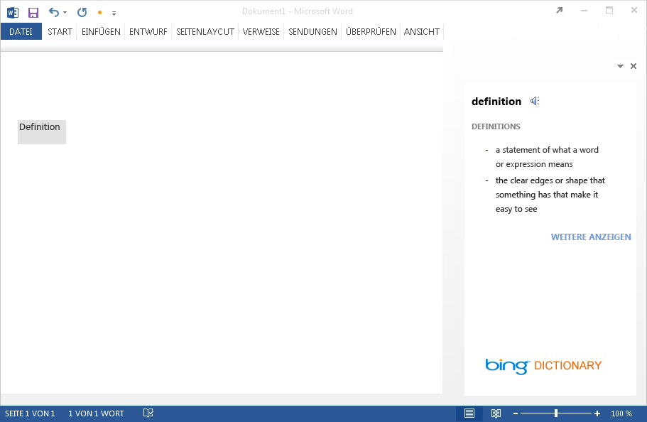
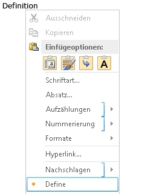
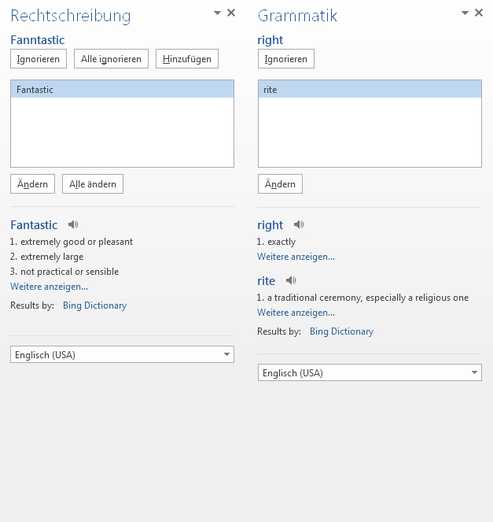
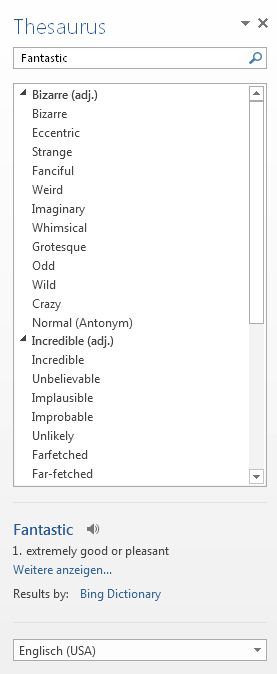
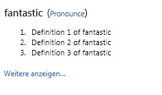

# Erstellen eines Wörterbuch-Aufgabenbereich-Add-ins
Erfahren Sie mehr darüber, wie Sie ein Aufgabenbereich-Add-in erstellen, das in Word 2013 oder Excel 2013 das Nachschlagen im Wörterbuch oder Thesaurus ermöglicht.

 _**Gilt für:** apps for Office | Excel | Office Add-ins | Word_

Dieser Artikel enthält ein Beispiel für ein Aufgabenbereich-Add-in und den zugehörigen Webdienst, der Wörterbuchdefinitionen oder Thesaurussynonyme für die aktuelle Auswahl des Benutzers in einem Word 2013- oder Excel 2013-Dokument bereitstellt. 

Eine Wörterbuch-Office-Add-In basiert auf dem standardmäßigen Aufgabenbereich-Add-in mit zusätzlichen Features, um das Abfragen und Anzeigen von Definitionen aus einem Wörterbuch-XML-Webdienst an zusätzlichen Stellen in der Benutzeroberfläche der Office-Anwendung zu unterstützen. 

Bei einem typischen Wörterbuch-Aufgabenbereich-Add-in wählt ein Benutzer ein Wort oder einen Ausdruck im Dokument aus. Von der dem Add-in zugrunde liegenden JavaScript-Logik wird dann diese Auswahl an den XML-Webdienst des Wörterbuchanbieters übergeben. Die Webseite des Wörterbuchanbieters wird anschließend aktualisiert, sodass dem Benutzer die Definitionen für die Auswahl angezeigt werden.
Von der XML-Webdienstkomponente werden bis zu drei Definitionen in dem durch das OfficeDefinitions-XML-Schema definierten Format zurückgegeben, die dann dem Benutzer an anderen Stellen in der Benutzeroberfläche der Office-Hostanwendung angezeigt werden. 
In Abbildung 1 ist das Auswählen und Anzeigen für ein Bing-Wörterbuch-Add-in dargestellt, das in Word 2013 ausgeführt wird.

**Abbildung 1. Wörterbuch-Add-in mit Definitionen für das ausgewählte Wort**


Sie bestimmen, ob beim Klicken auf den Link  **See More** in der HTML-Benutzeroberfläche des Wörterbuch-Add-ins weitere Informationen im Aufgabenbereich angezeigt werden sollen oder ob zusätzlich zur vollständigen Webseite ein separates Browserfenster für das ausgewählte Wort oder den ausgewählten Ausdruck geöffnet werden soll.
In Abbildung 2 ist der Kontextmenübefehl  **Definieren** dargestellt, mit dem Benutzer schnell installierte Wörterbücher starten können. In den Abbildungen 3 bis 5 ist dargestellt, an welchen Stellen in der Office-Benutzeroberfläche die Wörterbuch-XML-Dienste zum Bereitstellen von Definitionen in Word 2013 verwendet werden.

**Abbildung 2. Der Befehl "Definieren" im Kontextmenü**



**Abbildung 3. Definitionen in den Bereichen "Rechtschreibung" und "Grammatik"**



**Abbildung 4. Definitionen im Bereich "Thesaurus"**



**Abbildung 5. Definitionen im Lesemodus**


Zum Erstellen eines Aufgabenbereich-Add-ins, das das Nachschlagen im Wörterbuch ermöglicht, erstellen Sie die folgenden beiden Hauptkomponenten: 


- Einen XML-Webdienst, der Definitionen über einen Wörterbuchdienst nachschlägt und dann diese Werte in einem XML-Format zurückgibt, das von dem Wörterbuch-Add-in genutzt und angezeigt werden kann.
    
- Ein Aufgabenbereich-Add-in, das die aktuelle Auswahl des Benutzers an den Wörterbuchwebdienst übermittelt, Definitionen anzeigt und optional diese Werte in das Dokument einfügen kann.
    
In den folgenden Abschnitten finden Sie Beispiele für das Erstellen dieser Komponenten.

## Erstellen eines Wörterbuch-XML-Webdiensts


Der XML-Webdienst muss Abfragen an den Webdienst im XML-Format zurückgeben, das dem OfficeDefinitions-XML-Schema entspricht. In den folgenden beiden Abschnitten wird das OfficeDefinitions-XML-Schema beschrieben, und außerdem gibt es ein Beispiel für das Erstellen des Codes für einen XML-Webdienst, der Abfragen in diesem XML-Format zurückgibt.


### OfficeDefinitions-XML-Schema

Der folgende Code veranschaulicht das XSD für das OfficeDefinitions-XML-Schema.


```XML
<?xml version="1.0" encoding="utf-8"?>
<xs:schema
  xmlns:xsi="http://www.w3.org/2001/XMLSchema-instance"
  xmlns:xs="http://www.w3.org/2001/XMLSchema"
  targetNamespace="http://schemas.microsoft.com/NLG/2011/OfficeDefinitions"
  xmlns="http://schemas.microsoft.com/NLG/2011/OfficeDefinitions">
  <xs:element name="Result">
    <xs:complexType>
      <xs:sequence>
        <xs:element name="SeeMoreURL" type="xs:anyURI"/>
        <xs:element name="Definitions" type="DefinitionListType"/>
      </xs:sequence>
    </xs:complexType>
  </xs:element>
  <xs:complexType name="DefinitionListType">
    <xs:sequence>
      <xs:element name="Definition" maxOccurs="3">
        <xs:simpleType>
          <xs:restriction base="xs:normalizedString">
            <xs:maxLength value="400"/>
          </xs:restriction>
        </xs:simpleType>
      </xs:element>
    </xs:sequence>
  </xs:complexType>
</xs:schema>
```

Das zurückgegebene XML, das dem OfficeDefinitions-Schema entspricht, besteht aus einem  **Result**-Stammelement, das ein  **Definitions**-Element mit null bis drei untergeordneten  **Definition**-Elementen enthält, die jeweils Definitionen mit einer maximalen Länge von 400 Zeichen aufweisen. Darüber hinaus muss die URL zur vollständigen Seite auf der Wörterbuchwebsite im  **SeeMoreURL**-Element angegeben werden. Das folgende Beispiel veranschaulicht die Struktur des zurückgegebenen XML, das dem OfficeDefinitions-Schema entspricht.


```XML
<?xml version="1.0" encoding="utf-8"?>
<Result xmlns="http://schemas.microsoft.com/NLG/2011/OfficeDefinitions">
  <SeeMoreURL xmlns="">www.bing.com/dictionary/search?q=example</SeeMoreURL>
  <Definitions xmlns="">
    <Definition>Definition1</Definition>
    <Definition>Definition2</Definition>
    <Definition>Definition3</Definition>
  </Definitions>
 </Result>

```


### Beispiel für einen Wörterbuch-XML-Webdienst

Der folgende C#-Code stellt ein einfaches Beispiel für das Erstellen von Code für einen XML-Webdienst dar, der das Ergebnis einer Wörterbuchabfrage im OfficeDefinitions-XML-Format zurückgibt.


```C#
using System;
using System.Collections.Generic;
using System.Linq;
using System.Web;
using System.Web.Services;
using System.Xml;
using System.Text;
using System.IO;
using System.Net;

/// <summary>
/// Summary description for _Default
/// </summary>
[WebService(Namespace = "http://tempuri.org/")]
[WebServiceBinding(ConformsTo = WsiProfiles.BasicProfile1_1)]
// To allow this web service to be called from script, using ASP.NET AJAX, uncomment the following line. 
// [System.Web.Script.Services.ScriptService]
public class WebService : System.Web.Services.WebService {

    public WebService () {

        // Uncomment the following line if using designed components 
        // InitializeComponent(); 
    }

    // You can replace this method entirely with your own method that gets definitions
    // from your data source, and then formats it into the OfficeDefinitions XML format. 
    // If you need a reference for constructing the returned XML, you can use this example as a basis.
    [WebMethod]
    public XmlDocument Define(string word)
    {

        StringBuilder sb = new StringBuilder();
        XmlWriter writer = XmlWriter.Create(sb);
        {
            writer.WriteStartDocument();
            
                writer.WriteStartElement("Result", "http://schemas.microsoft.com/NLG/2011/OfficeDefinitions");

            // See More URL should be changed to the dictionary publisher's page for that word on their website.
                    writer.WriteElementString("SeeMoreURL", "http://www.bing.com/search?q=" + word);

                    writer.WriteStartElement("Definitions");
            
                        writer.WriteElementString("Definition", "Definition 1 of " + word);
                        writer.WriteElementString("Definition", "Definition 2 of " + word);
                        writer.WriteElementString("Definition", "Definition 3 of " + word);
                   
                    writer.WriteEndElement();


                writer.WriteEndElement();
            
            writer.WriteEndDocument();
        }
        writer.Close();

        XmlDocument doc = new XmlDocument();
        doc.LoadXml(sb.ToString());

        return doc;
    }
   

}
```


## Erstellen der Komponenten eines Wörterbuch-Add-ins


Ein Wörterbuch-Add-in besteht aus drei Hauptkomponentendateien:


- Einer XML-Manifestdatei zur Beschreibung des Add-ins
    
- Einer HTML-Datei, mit der die Benutzeroberfläche des Add-ins bereitgestellt wird
    
- Einer JavaScript-Datei zur Bereitstellung von Logik, mit der die Auswahl des Benutzers im Dokument abgerufen wird, die Auswahl als Abfrage an den Webdienst gesendet wird und anschließend die zurückgegebenen Ergebnisse in der Benutzeroberfläche des Add-ins angezeigt werden.
    

### Erstellen der Manifestdatei eines Wörterbuch-Add-ins

Im Folgenden finden Sie eine Beispielmanifestdatei für ein Wörterbuch-Add-in.


```XML
<?xml version="1.0" encoding="utf-8"?>
<OfficeApp xmlns="http://schemas.microsoft.com/office/appforoffice/1.0" xmlns:xsi="http://www.w3.org/2001/XMLSchema-instance" xsi:type="TaskPaneApp">
  <Id>DemoDict</Id>
  <Version>15.0</Version>
  <ProviderName>Microsoft Office Demo Dictionary</ProviderName>
  <DefaultLocale>en-us</DefaultLocale>
  <!--DisplayName is the name that will appear in the user's list of applications.-->
  <DisplayName DefaultValue="Microsoft Office Demo Dictionary" />
  <!--Description is a 2-3 sentence description of this dictionary. -->
  <Description DefaultValue="The Microsoft Office Demo Dictionary is an example built to demonstrate how a publisher could create a dictionary that integrates with Office. It does not return real definitions." />
  <!--IconUrl is the URI for the icon that will appear in the user's list of applications.-->
  <IconUrl DefaultValue="http://officeimg.vo.msecnd.net/_layouts/images/general/office_logo.jpg" />
  <!--Capabilities specifies the kind of host application your dictionary add-in will support. You shouldn't have to modify this area.-->
  <Capabilities>
    <Capability Name="Workbook"/>
    <Capability Name="Document"/>
    <Capability Name="Project"/>
  </Capabilities>
  <DefaultSettings>
    <!--SourceLocation is the URL for your dictionary-->
    <SourceLocation DefaultValue="http://christophernlg/ExampleDictionary/DictionaryHome.html" />
  </DefaultSettings>
  <!--Permissions is the set of permissions a user will have to give your dictionary. If you need write access, such as to allow a user to replace the highlighted word with a synonym, use ReadWriteDocument. -->
  <Permissions>ReadDocument</Permissions>
  <Dictionary>
    <!--TargetDialects is the set of dialects your dictionary contains. For example, if your dictionary applies to Spanish (Mexico) and Spanish (Peru), but not Spanish (Spain), you can specify that here. This is for different dialects of the same language. Please do NOT put more than one language (for example, Spanish and English) here. Publish separate languages as separate dictionaries. -->
    <TargetDialects>
      <TargetDialect>EN-AU</TargetDialect>
      <TargetDialect>EN-BZ</TargetDialect>
      <TargetDialect>EN-CA</TargetDialect>
      <TargetDialect>EN-029</TargetDialect>
      <TargetDialect>EN-HK</TargetDialect>
      <TargetDialect>EN-IN</TargetDialect>
      <TargetDialect>EN-ID</TargetDialect>
      <TargetDialect>EN-IE</TargetDialect>
      <TargetDialect>EN-JM</TargetDialect>
      <TargetDialect>EN-MY</TargetDialect>
      <TargetDialect>EN-NZ</TargetDialect>
      <TargetDialect>EN-PH</TargetDialect>
      <TargetDialect>EN-SG</TargetDialect>
      <TargetDialect>EN-ZA</TargetDialect>
      <TargetDialect>EN-TT</TargetDialect>
      <TargetDialect>EN-GB</TargetDialect>
      <TargetDialect>EN-US</TargetDialect>
      <TargetDialect>EN-ZW</TargetDialect>
    </TargetDialects>
    <!--QueryUri is the address of this dictionary's XML web service (which is used to put definitions in additional contexts, such as the spelling checker.)-->
    <QueryUri DefaultValue="http://christophernlg/ExampleDictionary/WebService.asmx/Define?word="/>
    <!--Citation Text, Dictionary Name, and Dictionary Home Page will be combined to form the citation line (for example, this would produce "Examples by: Microsoft", where "Microsoft" is a hyperlink to http://www.microsoft.com).-->
    <CitationText DefaultValue="Examples by: " />
    <DictionaryName DefaultValue="Microsoft" />
    <DictionaryHomePage DefaultValue="http://www.microsoft.com" />
  </Dictionary>
</OfficeApp>
```

Das Element  **Dictionary** und dessen untergeordnete Elemente für das Erstellen der Manifestdatei eines Wörterbuch-Add-ins werden in den folgenden Abschnitten beschrieben. Weitere Informationen zu den anderen Elementen in der Manifestdatei finden Sie unter [XML-Manifest für Office-Add-Ins](../../docs/overview/add-in-manifests.md).


### Dictionary-Element


Gibt Einstellungen für Wörterbuch-Add-ins an.

 **Übergeordnetes Element**

 `<OfficeApp>`

 **Untergeordnete Elemente**

 `<TargetDialects>`,  `<QueryUri>`,  `<CitationText>`,  `<DictionaryName>`,  `<DictionaryHomePage>`

 **Hinweise**

Das Element  **Dictionary** und dessen untergeordnete Elemente werden dem Manifest eines Aufgabenbereich-Add-ins hinzugefügt, wenn Sie ein Wörterbuch-Add-in erstellen.


#### TargetDialects-Element


Gibt die Regionalsprachen an, die von diesem Wörterbuch unterstützt werden. Erforderlich (für Wörterbuch-Add-ins).

 **Übergeordnetes Element**

 `<Dictionary>`

 **Untergeordnetes Element**

 `<TargetDialect>`

 **Hinweise**

Mit dem  **TargetDialects**-Element und dessen untergeordneten Elementen werden die Regionalsprachen angegeben, die Ihr Wörterbuch enthält. Wenn Ihr Wörterbuch z. B. sowohl für die Regionalsprache Spanisch (Mexiko) als auch Spanisch (Peru) gilt, jedoch nicht für Spanisch (Spanien), können Sie dies in diesem Element angeben. Dieses Element ist nur für die Angabe unterschiedlicher Regionalsprachen derselben Sprache vorgesehen. Geben Sie in diesem Manifest auf keinen Fall mehrere Sprachen an (z. B. Spanisch und Englisch). Veröffentlichen Sie separate Sprachen als separate Wörterbücher.

 **Beispiel**


```XML
<TargetDialects>
  <TargetDialect>EN-AU</TargetDialect>
  <TargetDialect>EN-BZ</TargetDialect>
  <TargetDialect>EN-CA</TargetDialect>
  <TargetDialect>EN-029</TargetDialect>
  <TargetDialect>EN-HK</TargetDialect>
  <TargetDialect>EN-IN</TargetDialect>
  <TargetDialect>EN-ID</TargetDialect>
  <TargetDialect>EN-IE</TargetDialect>
  <TargetDialect>EN-JM</TargetDialect>
  <TargetDialect>EN-MY</TargetDialect>
  <TargetDialect>EN-NZ</TargetDialect>
  <TargetDialect>EN-PH</TargetDialect>
  <TargetDialect>EN-SG</TargetDialect>
  <TargetDialect>EN-ZA</TargetDialect>
  <TargetDialect>EN-TT</TargetDialect>
  <TargetDialect>EN-GB</TargetDialect>
  <TargetDialect>EN-US</TargetDialect>
  <TargetDialect>EN-ZW</TargetDialect>
</TargetDialects>
```


#### TargetDialect-Element


Gibt eine Regionalsprache an, die von diesem Wörterbuch unterstützt wird. Erforderlich (für Wörterbuch-Add-ins).

 **Übergeordnetes Element**

 `<TargetDialects>`

 **Hinweise**

Geben Sie den Wert für eine Regionalsprache im  `language`-Tag-Format gemäß RFC1766 an, wie z. B. EN-US.

 **Beispiel**


```XML
<TargetDialect>EN-US</TargetDialect>
```


#### QueryUri-Element


Gibt den Endpunkt für den Wörterbuchabfragedienst an. Erforderlich (für Wörterbuch-Add-ins).

 **Übergeordnetes Element**

 `<Dictionary>`

 **Hinweise**

Dies ist der URI des XML-Webdiensts für den Wörterbuchanbieter. Die ordnungsgemäß mit Escapezeichen versehene Abfrage wird an diesen URI angefügt. 

 **Beispiel**


```XML
<QueryUri DefaultValue="http://msranlc-lingo1/proof.aspx?q="/>
```


#### CitationText-Element


Gibt den Text für Zitate an. Erforderlich (für Wörterbuch-Add-ins).

 **Übergeordnetes Element**

 `<Dictionary>`

 **Hinweise**

Mit diesem Element wird der Beginn des Zitattexts angegeben, der in einer Zeile unterhalb des vom Webdienst zurückgegebenen Inhalts angezeigt wird (z. B. "Results by: " oder "Powered by: ").

Für dieses Element können Sie Werte für zusätzliche Gebietsschemas mithilfe des  **Override**-Elements angeben. Wenn z. B. ein Benutzer die spanische SKU von Office ausführt, aber ein englisches Wörterbuch verwendet, kann die Zitatzeile als "Resultados por: Bing" anstelle von "Results by: Bing" angezeigt werden. Weitere Informationen zum Angeben von Werten für zusätzliche Gebietsschemas finden Sie unter [XML-Manifest für Office-Add-Ins](../../docs/overview/add-in-manifests.md) im Abschnitt zum Eingeben von Einstellungen für unterschiedliche Gebietsschemas.

 **Beispiel**


```XML
<CitationText DefaultValue="Results by: " />
```


#### DictionaryName-Element


Gibt den Namen dieses Wörterbuchs an. Erforderlich (für Wörterbuch-Add-ins).

 **Übergeordnetes Element**

 `<Dictionary>`

 **Hinweise**

Mit diesem Element wird der Linktext im Zitattext angegeben. Der Zitattext wird in einer Zeile unterhalb des vom Webdienst zurückgegebenen Inhalts angezeigt.

Für dieses Element können Sie Werte für zusätzliche Gebietsschemas angeben.

 **Beispiel**


```XML
<DictionaryName DefaultValue="Bing Dictionary" />
```


#### DictionaryHomePage-Element


Gibt die URL der Homepage für das Wörterbuch an. Erforderlich (für Wörterbuch-Add-ins).

 **Übergeordnetes Element**

 `<Dictionary>`

 **Hinweise**

Mit diesem Element wird die Link-URL im Zitattext angegeben. Der Zitattext wird in einer Zeile unterhalb des vom Webdienst zurückgegebenen Inhalts angezeigt.

Für dieses Element können Sie Werte für zusätzliche Gebietsschemas angeben.

 **Beispiel**


```XML
<DictionaryHomePage DefaultValue="http://www.bing.com" />
```


### Erstellen der HTML-Benutzeroberfläche eines Wörterbuch-Add-ins


Die folgenden beiden Beispiele veranschaulichen die HTML- und CSS-Dateien für die Benutzeroberfläche des Demowörterbuch-Add-ins. In Abbildung 6 im Anschluss an den Code sehen Sie, wie die Benutzeroberfläche im Aufgabenbereich des Add-ins dargestellt wird. Informationen, wie von der JavaScript-Implementierung in der Datei Dictionary.js Programmierlogik für diese HTML-Benutzeroberfläche bereitgestellt wird, finden Sie im Abschnitt „Erstellen des Codes für die JavaScript-Implementierung" unmittelbar im Anschluss an diesen Abschnitt.


```HTML
<!DOCTYPE html>
<html>

<head>
<meta http-equiv="X-UA-Compatible" content="IE=Edge"/>

<!--The title will not be shown but is supplied to ensure valid HTML.-->
<title>Example Dictionary</title>

<!--Required library includes.-->
<script type="text/javascript" src="http://ajax.microsoft.com/ajax/4.0/1/MicrosoftAjax.js"></script>
<script type="text/javascript" src="office.js"></script>

<!--Optional library includes.-->
<script type="text/javascript" src="http://ajax.aspnetcdn.com/ajax/jQuery/jquery-1.5.1.js"></script>

<!--App-specific CSS and JS.-->
<link rel="Stylesheet" type="text/css" href="style.css" />
<script type="text/ecmascript" src="dictionary.js"></script>
</head>

<body>
<div id="mainContainer">
    <div id="header">
        <span id="headword"></span>
        <span id="pronunciation">(<a id="pronunciationLink">Pronounce</a>)</span>
    </div>
    <ol id="definitions">
    </ol>
    <div id="SeeMore">
    <a id="SeeMoreLink">See More...</a>
    </div>
</div>
</body>

</html>
```

Im folgenden Beispiel wird der Inhalt der Datei Style.css gezeigt.


```
#mainContainer
{
    font-family: Segoe UI;
    font-size: 11pt;
}

#headword
{
    font-family: Segoe UI Semibold;
    color: #262626;
}

#pronunciation
{
    margin-left: 2px;
    margin-right: 2px;
}

#definitions
{
    font-size: 8.5pt;
}
a
{
    font-size: 8pt;
    color: #336699;
    text-decoration: none;
}
a:visited
{
    color: #993366;
}
a:hover, a:active
{  
    text-decoration: underline;
}
```


**Abbildung 6. Benutzeroberfläche des Demowörterbuchs**




### Erstellen des Codes für die JavaScript-Implementierung


Das folgende Beispiel veranschaulicht die JavaScript-Implementierung in der Datei Dictionary.js, die von der HTML-Seite des Add-ins aufgerufen wird, um die Programmierlogik für das Demowörterbuch-Add-in (Demo Dictionary) bereitzustellen. In diesem Skript wird der zuvor beschriebene XML-Webdienst wiederverwendet. Wenn das Skript in dasselbe Verzeichnis wie der Beispielwebdienst kopiert wird, werden Definitionen aus diesem Dienst abgerufen. Dieses Skript kann mit einem öffentlichen OfficeDefinitions-konformen XML-Webdienst verwendet werden, indem Sie die Variable  `xmlServiceURL` am Anfang der Datei ändern und anschließend Bing-API-Schlüssel für Aussprachen durch einen ordnungsgemäß registrierten Schlüssel ersetzen.

Mit dieser Implementierung werden die folgenden wichtigen Elemente der JavaScript-API für Office (Office.js) aufgerufen:


- Das [initialize](http://msdn.microsoft.com/de-de/library/727adf79-a0b5-48d2-99c7-6642c2c334fc%28Office.15%29.aspx)-Ereignis des  **Office**-Objekts, das ausgelöst wird, wenn der Add-In-Kontext initialisiert wird, und den Zugriff auf eine [Document](http://msdn.microsoft.com/de-de/library/f8859516-cc1f-4b20-a8f3-cee37a983e70%28Office.15%29.aspx)-Objektinstanz ermöglicht, die das Dokument repräsentiert, mit dem Add-In interagiert.
    
- Die [addHandlerAsync](http://msdn.microsoft.com/de-de/library/8b2ec6c4-0983-4f5e-abd9-16f15b4fc87b%28Office.15%29.aspx)-Methode des  **Document**-Objekts, die in der  **initialize**-Funktion aufgerufen wird, um einen Ereignishandler für das [SelectionChanged](http://msdn.microsoft.com/de-de/library/4cbc527c-a1d5-4fb0-b6db-28cc40c5d5e2%28Office.15%29.aspx)-Ereignis des Dokuments hinzuzufügen und Änderungen bei der Auswahl durch die Benutzer zu überwachen. 
    
- Die [getSelectedDataAsync](http://msdn.microsoft.com/de-de/library/f85ad02c-64f0-4b73-87f6-7f521b3afd69%28Office.15%29.aspx)-Methode des  **Document**-Objekts, die in der  `tryUpdatingSelectedWord()`-Funktion aufgerufen wird, wenn der  **SelectionChanged**-Ereignishandler ausgelöst wird, um das vom Benutzer ausgewählte Wort oder den vom Benutzer ausgewählten Ausdruck abzurufen, in Nur-Text umzuwandeln und dann die asynchrone Rückruffunktion  `selectedTextCallback` auszuführen.
    
- Wenn die asynchrone Rückruffunktion  `selectTextCallback`, die als  _callback_-Argument der  **getSelectedDataAsync**-Methode übergeben wird, ausgeführt wird, wird der Wert des ausgewählten Texts abgerufen, wenn der Rückruf zurückgegeben wird. Dieser Wert wird mit dem  _selectedText_-Argument (vom Typ [AsyncResult](http://msdn.microsoft.com/de-de/library/540c114f-0398-425c-baf3-7363f2f6bc47%28Office.15%29.aspx)) des Rückrufs mithilfe der [value](http://msdn.microsoft.com/de-de/library/453a4b43-0fdc-4ea9-967a-c033fab31507%28Office.15%29.aspx)-Eigenschaft des zurückgegebenen  **AsyncResult**-Objekts abgerufen.
    
- Mit dem restlichen Code der  `selectedTextCallback`-Funktion werden Definitionen im XML-Webdienst abgefragt. Darüber hinaus werden die Microsoft Translator-APIs aufgerufen, um die URL einer WAV-Datei mit der Aussprache für das ausgewählte Wort bereitzustellen.
    
- Mit dem restlichen Code in Dictionary.js wird die Liste der Definitionen und der Aussprachelink in der HTML-Benutzeroberfläche des Add-ins angezeigt.
    


```
// The document the dictionary add-in is interacting with.
var _doc; 
// The last looked-up word, which is also the currently displayed word.
var lastLookup; 
// For demo purposes only!! Get an AppID if you intend to use the Pronunciation service for your feature.
var appID="3D8D4E1888B88B975484F0CA25CDD24AAC457ED8"; 

// The base URL for the OfficeDefinitions-conforming XML web service to query for definitions.
var xmlServiceUrl = "WebService.asmx/Define?Word="; 

// Initialize the add-in. 
// The initialize function is required for all add-ins.
Office.initialize = function (reason) {
    // Checks for the DOM to load using the jQuery ready function.
    $(document).ready(function () {
    // After the DOM is loaded, app-specific code can run.
    // Store a reference to the current document.
    _doc = Office.context.document; 
    // Check whether text is already selected.
    tryUpdatingSelectedWord(); 
    _doc.addHandlerAsync("documentSelectionChanged", tryUpdatingSelectedWord); //Add a handler to refresh when the user changes selection.
    });
}

// Executes when event is raised on user's selection changes, and at initialization time. 
// Gets the current selection and passes that to asynchronous callback method.
function tryUpdatingSelectedWord() {
    _doc.getSelectedDataAsync(Office.CoercionType.Text, selectedTextCallback); 
}

// Async callback that executes when the add-in gets the user's selection.
// Determines whether anything should be done. If so, it makes requests that will be passed to various functions.
function selectedTextCallback(selectedText) {
    selectedText = $.trim(selectedText.value);
    // Be sure user has selected text. The SelectionChanged event is raised every time the user moves the cursor, even if no selection.
    if (selectedText != "") { 
        // Check whether user selected the same word the pane is currently displaying to avoid unnecessary web calls.
        if (selectedText != lastLookup) { 
            // Update the lastLookup variable.
            lastLookup = selectedText; 
            // Set the "headword" span to the word you looked up.
            $("#headword").text(selectedText); 
            // AJAX request to get definitions for the selected word; pass that to refreshDefinitions.
            $.ajax(xmlServiceUrl + selectedText, { dataType: 'xml', success: refreshDefinitions, error: errorHandler }); 
            // AJAX request to the Microsoft Translator APIs. Gets the URL of a WAV file with pronunciation, which is passed to refreshPronunciation. See http://www.microsofttranslator.com/dev for details.
            $.ajax("http://api.microsofttranslator.com/V2/Ajax.svc/Speak?oncomplete=refreshPronunciation&amp;appId=" + appID + "&amp;text=" + selectedText + "&amp;language=en-us", { dataType: 'script', success: null, error: errorHandler }); 
        }
    }
}

// This function is called when the add-in gets back the definitions target word.
// It removes the old definitions and replaces them with the definitions for the current word.
// It also sets the "See More" link.
function refreshDefinitions(data, textStatus, jqXHR) {
    $(".definition").remove();
    // Make a new list item for each returned definition that was returned, set the CSS class, and append it to the definitions div.
    $(data).find("Definition").each(function () {
        $(document.createElement("li")).text($(this).text()).addClass("definition").appendTo($("#definitions"));
    });
    $("#SeeMoreLink").attr("href", $(data).find("SeeMoreURL").text()); //Change the "See More" link to direct to the correct URL.
}

// This function is called when the add-in gets back the link to the pronunciation
// to set the "Pronounce" link to the URL of the .WAV file.
function refreshPronunciation(data) {
    $("#pronunciationLink").attr("href", data);
}

// Basic error handler that writes to a div with id='message'.
function errorHandler(jqXHR, textStatus, errorThrown) {
    document.getElementById('message').innerText += errorThrown;
}

```

