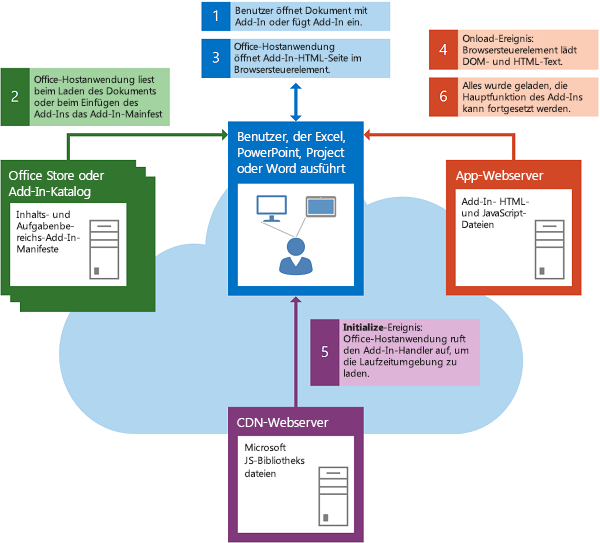
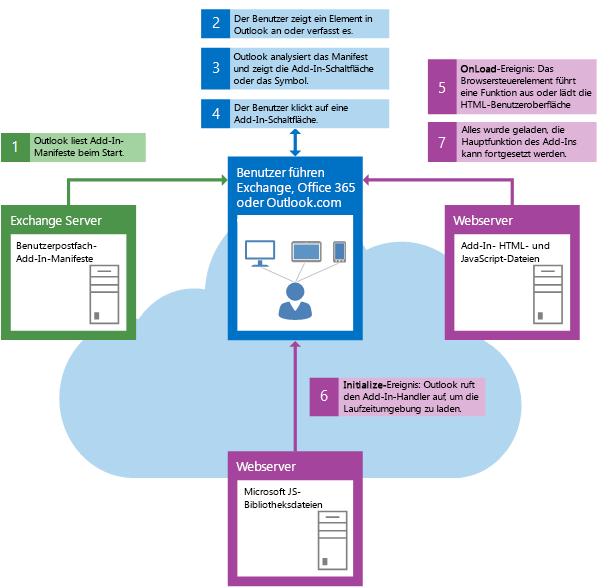

# Laden des DOM und der Laufzeitumgebung
Für ein Add-In muss vor dem Ausführen der eigenen benutzerdefinierten Logik sichergestellt werden, dass sowohl das Dokumentobjektmodell (DOM) als auch die Office-Add-Ins-Laufzeitumgebung geladen wurden. 

 _**Gilt für:** Access apps for SharePoint | apps for Office | Excel | Office Add-ins | Outlook | PowerPoint | Project | Word_


## Starten eines Inhalts- oder Aufgabenbereich-Add-ins


**Abbildung 1. Der Ereignisablauf beim Starten eines Inhalts- oder Aufgabenbereich-Add-Ins in Excel, PowerPoint, Project, Word oder Access**

   

Es folgt eine Zusammenfassung der Ereignisse beim Starten und Initialisieren eines Inhalts- oder Aufgabenbereich-Add-ins: 


1. Der Benutzer öffnet ein Dokument, das bereits ein Add-in enthält, oder fügt ein Add-in in das Dokument ein.
    
2. Die Office-Hostanwendung liest das XML-Manifest des Add-ins aus dem Office-Shop, dem Add-in-Katalog in SharePoint oder dem freigegebenen Ordnerkatalog, aus dem das Add-in stammt.
    
3. Die Office-Hostanwendung öffnet die HTML-Seite des Add-ins in einem Browsersteuerelement.
    
    Die nächsten beiden Schritte, 4 und 5, werden asynchron und parallel ausgeführt. Daher muss der Code des Add-ins sicherstellen, dass sowohl das Dokumentobjektmodell (DOM) als auch die Laufzeitumgebung geladen wurden, bevor fortgefahren werden kann.
    
4. Das Browsersteuerelement lädt das DOM und den HTML-Textkörper und ruft den Ereignishandler für das  **window.onload**-Ereignis auf.
    
5. Die Office-Hostanwendung lädt die Laufzeitumgebung, die wiederum die JavaScript-API für JavaScript-Bibliotheksdateien vom CDN-Server (Content Distribution Network) herunterlädt und zwischenspeichert und anschließend den Ereignishandler des Add-ins für das [initialize](http://msdn.microsoft.com/library/727adf79-a0b5-48d2-99c7-6642c2c334fc%28Office.15%29.aspx)-Ereignis des [Office](http://msdn.microsoft.com/library/c490b13d-ee52-4291-af5d-f4a5a11d3af0%28Office.15%29.aspx)-Objekt aufruft.
    
6. Wenn DOM und der HTML-Textkörper vollständig geladen wurde und das Add-in initialisiert wurde, kann die Hauptfunktion des Add-ins fortgesetzt werden.
    

## Starten eines Outlook-Add-Ins


**Abbildung 2. Der Ereignisablauf beim Starten eines Outlook-Add-Ins auf dem Desktop, Tablet oder Smartphone**

   

Im Folgenden finden Sie eine Zusammenfassung der Ereignisse beim Starten eines Outlook-Add-Ins: 


1. Beim Starten von Outlook werden die XML-Manifeste für Outlook-Add-Ins gelesen, die für das E-Mail-Konto des Benutzers installiert wurden.
    
2. Der Benutzer wählt ein Element in Outlook aus.
    
3. Falls das ausgewählte Element die Aktivierungsbedingungen eines Outlook-Add-Ins erfüllt, aktiviert Outlook das Add-In und zeigt die Schaltfläche in der Benutzeroberfläche an.
    
4. Falls der Benutzer auf die Schaltfläche klickt, um das Outlook-Add-In zu starten, öffnet Outlook die HTML-Seite in einem Browsersteuerelement. Die nächsten beiden Schritte, also Schritt 5 und 6, werden parallel ausgeführt.
    
5. Das Browsersteuerelement lädt DOM und den HTML-Textkörper und ruft den Ereignishandler für das  **onload**-Ereignis auf.
    
6. Outlook ruft den Ereignishandler für das [initialize](http://msdn.microsoft.com/library/727adf79-a0b5-48d2-99c7-6642c2c334fc%28Office.15%29.aspx)-Ereignis des [Office](http://msdn.microsoft.com/library/c490b13d-ee52-4291-af5d-f4a5a11d3af0%28Office.15%29.aspx)-Objekts des Add-Ins auf.
    
7. Wenn DOM und der HTML-Textkörper vollständig geladen wurde und das Add-in initialisiert wurde, kann die Hauptfunktion des Add-ins fortgesetzt werden.
    

## Überprüfen des Ladestatus


Eine Möglichkeit zur Überprüfung, ob das Laden des DOM und der -Laufzeitumgebung abgeschlossen ist, ist die Verwendung der [.ready()](http://api.jquery.com/ready/)-Funktion:  `$(document).ready()`. Die folgende  **initialize**-Ereignishandlerfunktion stellt beispielsweise sicher, dass das DOM geladen wird, bevor der für die Initialisierung des Add-Ins spezifische Code ausgeführt wird. Anschließend verwendet der  **initialize**-Ereignishandler die [mailbox.item](../reference/outlook/Office.context.mailbox.item.md%28Office.15%29.md)-Eigenschaft, um das derzeit in Outlook ausgewählte Element abzurufen, und ruft die Hauptfunktion des Add-Ins ( `initDialer`) auf.


```
Office.initialize = function () {
    // Checks for the DOM to load.
    $(document).ready(function () {
        // After the DOM is loaded, add-in-specific code can run.
        var mailbox = Office.context.mailbox;
        _Item = mailbox.item;
        initDialer();
    });
}
```

Diese Methode kann im  **initialize**-Handler jeder beliebigen Office-Add-In angewendet werden.

Das Beispiel-Outlook-Add-In für die Telefonwählvorrichtung wählt einen geringfügig anderen Ansatz, wobei nur JavaScript zum Überprüfen derselben Bedingungen verwendet wird. 

 **Wichtig:** Selbst wenn Ihr Add-in keine auszuführenden Initialisierungsaufgaben hat, müssen Sie mindestens eine minimale **Office.initialize** Ereignishandlerfunktion wie im folgenden Beispiel einbauen.


```
Office.initialize = function () {
};
```

Wenn Sie keinen  **Office.initialize**-Ereignishandler einbauen, meldet das Add-in möglicherweise einen Fehler beim Starten. Auch wenn ein Benutzer versucht, das Add-in mit einem Office Online-Webclient wie Excel Online, PowerPoint Online oder Outlook Web App zu verwenden, wird die Ausführung scheitern. 

Falls das Add-in mehr als eine Seite enthält, muss beim Laden einer neuen Seite diese Seite immer einen  **Office.initialize**-Ereignishandler enthalten oder aufrufen.


## Weitere Ressourcen


- [Grundlegendes zur JavaScript-API für Office](../develop/understanding-the-javascript-api-for-office.md)
    
