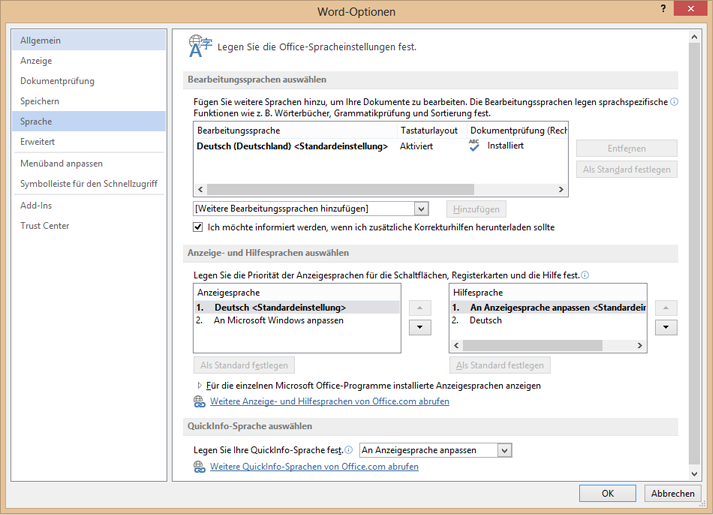

# Lokalisierung für Office-Add-Ins
Stellen Sie gebietsschemaspezifische Inhalte für eine Office-Add-In bereit, einschließlich Benutzeroberflächen-Zeichenfolgen, Add-in-Name, Beschreibung, Symbol, Quelldatei und Datum-/Uhrzeitformat.

 _**Gilt für:** Access apps for SharePoint | apps for Office | Excel | Office Add-ins | Outlook | PowerPoint | Project | Word_

Sie können für Ihre Office-Add-In ein Lokalisierungsschema Ihrer Wahl implementieren. Die JavaScript-API und das Manifestdateischema der Office-Add-Ins-Plattform bieten verschiedene Optionen. Sie können die JavaScript-API für Office zum Bestimmen eines Gebietsschemas und von Anzeigezeichenfolgen basierend auf dem Gebietsschema der Hostanwendung verwenden oder Daten basierend auf ihrem Gebietsschema interpretieren und anzeigen. Mithilfe der Manifestdatei können Sie einen gebietsschemaspezifischen Speicherort für die Add-in-Datei und beschreibende Informationen angeben. Alternativ können Sie zur Unterstützung von Globalisierung und Lokalisierung mit Microsoft Ajax-Skript arbeiten.

## Bestimmen gebietsschemaspezifischer Zeichenfolgen mithilfe der JavaScript-API


Die JavaScript-API für Office bietet zwei Eigenschaften zur Unterstützung der Anzeige und Interpretation von Werten im Einklang mit dem Gebietsschema der Hostanwendung und Daten:


- [Context.displayLanguage](http://msdn.microsoft.com/library/732ba34c-c99f-4c00-836d-4250eb7f0dac%28Office.15%29.aspx) gibt das Gebietsschema (bzw. die Sprache) der Benutzeroberfläche der Hostanwendung an. Das folgende Beispiel prüft, ob die Hostanwendung das Gebietsschema "en-US" oder "fr-Fr" verwendet und zeigt eine gebietsschemaspezifische Begrüßung an.
    
  ```
  function sayHelloWithDisplayLanguage() {
    var myLanguage = Office.context.displayLanguage;
    switch (myLanguage) {
        case 'en-US':
            write('Hello!');
            break;
        case 'fr-FR':
            write('Bonjour!');
            break;
    }
}
// Function that writes to a div with id='message' on the page.
function write(message){
    document.getElementById('message').innerText += message; 
}

  ```

- [Context.contentLanguage](http://msdn.microsoft.com/library/4fd063c2-0cd0-4b5b-8993-93d7ff8ce3bf%28Office.15%29.aspx) gibt das Gebietsschema (bzw. die Sprache) der Daten an. Als Erweiterung des letzten Codebeispiels anstelle der Überprüfung der **displayLanguage**-Eigenschaft:
    
  ```
  var myLanguage = Office.context.displayLanguage;
  ```


    wird  `myLanguage` der **contentLanguage**-Eigenschaft zugewiesen und der Rest desselben Codes verwendet, um eine Begrüßung basierend auf dem Gebietsschema der Daten anzuzeigen:
    


  ```
  var myLanguage = Office.context.contentLanguage;
  ```


## Steuern der Lokalisierung in der Manifestdatei


Jede Office-Add-In enthält in ihrer Manifestdatei ein [DefaultLocale](http://msdn.microsoft.com/library/04796a3a-3afa-dc85-db66-4677560c185c%28Office.15%29.aspx)-Element und ein Gebietsschema. Standardmäßig wenden die Office-Add-In-Plattform und Office-Hostanwendungen die Werte der Elemente [Description](http://msdn.microsoft.com/library/bcce6bad-23d0-7631-7d8c-1064b8453b5a%28Office.15%29.aspx), [DisplayName](http://msdn.microsoft.com/library/529159ca-53bf-efcf-c245-e572dab0ef57%28Office.15%29.aspx), [IconUrl](http://msdn.microsoft.com/library/c7dac2d4-4fda-6fc7-3774-49f02b2d3e1e%28Office.15%29.aspx) (sofern vorhanden). [HighResolutionIconUrl](http://msdn.microsoft.com/library/cd5493c5-a019-0059-3009-236234a034f1%28Office.15%29.aspx) (sofern vorhanden) und **SourceLocation** auf alle Gebietsschemas an. Sie können optional bestimmte Werte für bestimmte Gebietsschemas unterstützen, indem Sie für beliebige dieser fünf Elemente für jedes zusätzliche Gebietsschema ein untergeordnetes Element vom Typ **Override** angeben. Der Wert des **DefaultLocale**-Elements und des  **Locale**-Attributs des  **Overrride**-Elements wird gemäß [RFC 3066](http://www.ietf.org/rfc/rfc3066.txt), "Tags for the Identification of Languages" angegeben. In Tabelle 1 wird die Unterstützung der Lokalisierung dieser Elemente beschrieben.


**Tabelle 1. Unterstützung der Lokalisierung**


|**Element**|**Unterstützung der Lokalisierung**|
|:-----|:-----|
|**Description***|Benutzer in allen Gebietsschemas, die Sie angeben, können eine lokalisierte Beschreibung des Add-ins im Office Store (oder privaten Katalog) anzeigen. Bei Outlook-Add-Ins können Benutzer die Beschreibung nach der Installation in der Exchange-Verwaltungskonsole sehen.|
|**DisplayName***|Benutzer in allen Gebietsschemas, die Sie angeben, können eine lokalisierte Beschreibung des Add-ins im Office Store (oder privaten Katalog) anzeigen. Bei Outlook-Add-Ins können Benutzer nach der Installation den Anzeigenamen als Beschriftung für die Outlook-Add-In-Schaltfläche und in der Exchange-Verwaltungskonsole sehen.Bei Inhalts- und Aufgabenbereichs-Add-ins können Benutzer den Anzeigenamen nach der Installation des Add-ins auf dem Menüband sehen.|
|**IconUrl**|Das Symbolbild ist optional. Sie können dieselbe Überschreibungstechnik verwenden, um ein bestimmtes Bild für eine bestimmte Kultur anzuzeigen. Wenn Sie ein Symbol verwenden und lokalisieren, können Benutzer in jedem Gebietsschema, das Sie angeben, ein lokalisiertes Symbolbild für das Add-in sehen. Bei Outlook-Add-Ins können Benutzer nach der Installation das Symbol in der Exchange-Verwaltungskonsole sehen.Bei Inhalts- und Aufgabenbereichs-Add-ins können Benutzer das Symbol nach der Installation des Add-ins auf dem Menüband sehen.|
|**HighResolutionIconUrl**
 >**Wichtig**  Dieses Element ist nur für das Add-in-Manifest der Version 1.1 verfügbar.

|Das hochauflösende Symbolbild ist optional. Wenn es angegeben wird, muss es nach dem  **IconUrl**-Element auftreten. Wenn  **HighResolutionIconUrl** angegeben ist und das Add-in auf einem Gerät installiert wird, das hohe Auflösung unterstützt, wird der **HighResolutionIconUrl**-Wert anstelle des Werts für  **IconUrl** verwendet.Sie können dieselbe Überschreibungstechnik verwenden, um ein bestimmtes Bild für eine bestimmte Kultur anzugeben. Wenn Sie ein Symbol verwenden und lokalisieren, können Benutzer in jedem Gebietsschema, das Sie angeben, ein lokalisiertes Symbolbild für das Add-in sehen.Bei Outlook-Add-Ins können Benutzer nach der Installation das Symbol in der Exchange-Verwaltungskonsole sehen.Bei Inhalts- und Aufgabenbereichs-Add-ins können Benutzer das Symbol nach der Installation des Add-ins auf dem Menüband sehen.|
|**SourceLocation**|Benutzer in allen Gebietsschemas, die Sie angeben, können eine Webseite anzeigen, die Sie spezifisch für das jeweilige Gebietsschema des Add-ins entwerfen. |

 >**Hinweis**  * Sie können die Beschreibung und den Anzeigenamen nur für die von Office unterstützten Gebietsschemas lokalisieren. Unter [Sprachen-IDs und Id-Werte für "OptionState" in Office 2013](http://technet.microsoft.com/de-de/library/cc179219%28office.15%29.aspx) finden Sie eine Liste der Sprachen und Gebietsschemas der aktuellen Version von Office.


### Beispiele

Eine Office-Add-In kann beispielsweise das  **DefaultLocale**-Element als  `en-us` angeben. Für das **DisplayName**-Element kann das Add-in ein untergeordnetes  **Override**-Element für das Gebietsschema  `fr-fr` angeben (siehe unten).


```XML
<DefaultLocale>en-us</DefaultLocale>
…
<DisplayName DefaultValue="Video player">
    <Override Locale="fr-fr" Value="Lecteur vidéo" />
</DisplayName>
```

Das bedeutet, dass das Add-in standardmäßig vom Gebietsschema  `en-us` ausgeht. Benutzern wird bei allen Gebietsschemas der englische Anzeigename „Video player" angezeigt, es sei denn, das Gebietsschema des Clientcomputers lautet `fr-fr`. In diesem Fall wird dem Benutzer der französische Anzeigename „Lecteur vidéo" angezeigt.

Im folgenden Beispiel wird das Gebietsschema für das  **Description**-Element überschrieben. Zunächst werden als Standardgebietsschema  `en-us` und eine englische Beschreibung und danach die [Override](http://msdn.microsoft.com/library/d6a0e4f3-1cc9-c544-89bf-8923c7434316%28Office.15%29.aspx)-Anweisung mit einer französischen Beschreibung für das Gebietsschema  `fr-fr` angegeben:


```XML
    <DefaultLocale>en-us</DefaultLocale>
…
    <Description DefaultValue=
      "Watch YouTube videos referenced in the emails you receive 
      without leaving your email client.">
      <Override Locale="fr-fr" Value=
      "Visualisez les vidéos YouTube référencées dans vos courriers 
      électronique directement depuis Outlook et Outlook Web App."/>
    </Description>
```

Dies bedeutet, dass das Add-in standardmäßig vom Gebietsschema  `en-us` ausgeht und Benutzern die englische Beschreibung im **DefaultValue**-Attribut für alle Gebietsschemas anzeigt, es sei denn, das Gebietsschema des Clientcomputers ist  `fr-fr`. In diesem Fall wird eine französische Beschreibung anzeigt.

Im folgenden Beispiel gibt das Add-in ein gesondertes Bild an, das für das Gebietsschema und die Kultur  `fr-fr` besser geeignet ist. Benutzern wird standardmäßig das Bild DefaultLogo.png angezeigt, außer wenn das Gebietsschema des Clientcomputers `fr-fr` ist. In diesem Fall wird ihnen das Bild FrenchLogo.png angezeigt.


```XML
<!-- Replace "domain" with a real web server name and path. -->
<IconUrl DefaultValue="https://<domain>/DefaultLogo.png"/>
    <Override Locale="fr-fr" Value="https://<domain>/FrenchLogo.png"/>
```

Beim  **SourceLocation**-Element bedeutet das Unterstützen zusätzlicher Gebietsschemas, dass für jede der angegebenen Gebietsschemas eine eigene HTML-Quelldatei bereitgestellt werden muss. Benutzer in allen Gebietsschemas, die Sie angeben, können eine angepasste Webseite anzeigen, die Sie für sie entwerfen.

Bei Outlook-Add-Ins richtet sich das  **SourceLocation**-Element auch nach der Gerätegröße. Dadurch können Sie für jede Gerätegröße eine eigene, lokalisierte HTML-Quelldatei angeben. Sie können ein oder mehrere untergeordnete  **Override**-Elemente in jedem zutreffenden Einstellungselement ([DesktopSettings](http://msdn.microsoft.com/library/da9fd085-b8cc-2be0-d329-2aa1ef5d3f1c%28Office.15%29.aspx), [TabletSettings](http://msdn.microsoft.com/library/5c89cc7c-7ae0-49c9-fdd5-4c52118228f6%28Office.15%29.aspx) oder [PhoneSettings](http://msdn.microsoft.com/library/13e4eae3-8e8c-fd55-a1c2-3297b485f327%28Office.15%29.aspx)) angeben. Das folgende Beispiel zeigt Einstellungselemente für die Gerätegrößen Desktop, Tablet und Smartphone mit je einer HTML-Datei für das Standardgebietsschema und einer weiteren für das Gebietsschema „Französisch".


```XML
<DesktopSettings>
   <SourceLocation DefaultValue="https://contoso.com/Desktop.html">
      <Override Locale="fr-fr" Value="https://contoso.com/fr/Desktop.html" />
   </SourceLocation>
   <RequestedHeight>250</RequestedHeight>
</DesktopSettings>
<TabletSettings>
   <SourceLocation DefaultValue="https://contoso.com/Tablet.html">
      <Override Locale="fr-fr" Value="https://contoso.com/fr/Tablet.html" />
   </SourceLocation>
   <RequestedHeight>200</RequestedHeight>
</TabletSettings>
<PhoneSettings>
   <SourceLocation DefaultValue="https://contoso.com/Mobile.html">
      <Override Locale="fr-fr" Value="https://contoso.com/fr/Mobile.html" />
   </SourceLocation>

</PhoneSettings>

```


## Abgleichen des Datum-/Uhrzeitformats mit dem Clientgebietsschema


Sie können das Gebietsschema der Benutzeroberfläche der Hostanwendung mithilfe der  **displayLanguage**-Eigenschaft abrufen. Sie können anschließend Datums- und Uhrzeitwerte in einem Format anzeigen, das im Einklang mit dem aktuellen Gebietsschema der Hostanwendung ist. Eine Möglichkeit hierzu ist das Vorbereiten einer Ressourcendatei, die das zu verwendende Datum-/Uhrzeitformat für jedes Gebietsschema angibt, das Ihre Office-Add-In unterstützt. Zur Laufzeit kann Ihr Add-in die Ressourcendatei verwenden und das Datum-/Uhrzeitformat in Übereinstimmung mit dem Gebietsschema bringen, das aus der  **displayLanguage**-Eigenschaft abgerufen wurde.

Sie können das Gebietsschema der Daten der Hostanwendung mithilfe der  **contentLanguage**-Eigenschaft abrufen. Basierend auf diesem Werten können Datums-/Uhrzeitzeichenfolgen anschließend entsprechend interpretiert oder angezeigt werden. Im Gebietsschema  **jp-JP** werden Datums-/Uhrzeitwerte als jjjj/MM/tt und im Gebietsschema **fr-FR** als tt/MM/jjjj ausgedrückt.


## Verwenden von Ajax für Globalisierung und Lokalisierung


Wenn Sie zum Erstellen von Office-Add-Ins mit Visual Studio arbeiten, bieten .NET Framework und Ajax Möglichkeiten zum Globalisieren und Lokalisieren von Clientskriptdateien.

Sie können die JavaScript-Typerweiterungen [Date](http://msdn.microsoft.com/library/caf98d32-2de2-4704-8198-692350343681.aspx) und [Number](http://msdn.microsoft.com/library/c216d3a1-12ae-47d1-bca1-c3666d04572f.aspx) und das JavaScript-Objekt [Date](http://msdn.microsoft.com/library/ce2202bb-7ec9-4f5a-bf48-3a04feff283e.aspx) im JavaScript-Code für eine Office-Add-In verwenden, um Werte basierend auf den Gebietsschemaeinstellungen im aktuellen Browser anzuzeigen. Weitere Informationen finden Sie unter [Walkthrough: Globalizing a Date by Using Client Script](http://msdn.microsoft.com/library/69b34e6d-d590-4d03-a763-b7ae54b47d74.aspx).

Sie können lokalisierte Ressourcenzeichenfolgen direkt in eigenständige JavaScript-Dateien einbeziehen, um Clientskriptdateien für verschiedene Gebietsschemas bereitzustellen, die im Browser festgelegt oder vom Benutzer angegeben werden. Erstellen Sie für jedes unterstützte Gebietsschema eine eigene Skriptdatei. Fügen Sie jeder Skriptdatei ein Objekt im JSON-Format hinzu, das die Ressourcenzeichenfolgen für das jeweilige Gebietsschema enthält. Die lokalisierten Werte werden übernommen, wenn das Skript im Browser ausgeführt wird. 


## Beispiel: Erstellen eines lokalisierten Office-Add-Ins


Dieser Abschnitt enthält Beispiele, die das Lokalisieren einer Beschreibung, eines Anzeigenamens und einer Benutzeroberfläche für Office-Add-In veranschaulichen.

Konfigurieren Sie zum Ausführen des Codebeispiels Microsoft Office 2013 auf Ihrem Computer zum Verwenden zusätzlicher Sprachen, damit Sie Ihr Add-in testen können, indem Sie entweder die in Menüs und Befehlen oder für die Bearbeitung und Überprüfung oder für beides verwendete Sprache wechseln.

Sie müssen außerdem ein Visual Studio 2015-Office-Add-In-Projekt erstellen.


 >**Hinweis**  Informationen zum Herunterladen von Visual Studio 2015 finden Sie unter [Office Developer Tools](https://www.visualstudio.com/features/office-tools-vs). Auf dieser Seite finden Sie auch einen Link für die Office Developer Tools.


### Konfigurieren von Office 2013 für die Verwendung zusätzlicher Anzeige- oder Bearbeitungssprachen

Sie können ein Office 2013-Sprachpaket verwenden, um eine zusätzliche Sprache zu installieren. Weitere Informationen zu Sprachpaketen und Bezugsquellen finden Sie unter [Office 2013-Sprachoptionen](http://office.microsoft.com/en-us/language-packs/).


 >**Hinweis**  Als MSDN-Abonnent stehen Ihnen die Office 2013-Sprachpakete ggf. im Rahmen Ihres Abonnements zur Verfügung. Wenn Sie wissen möchten, ob das Herunterladen von Office 2013-Sprachpaketen Teil Ihres Abonnements ist, rufen Sie die [Startseite für MSDN-Abonnements](https://msdn.microsoft.com/subscriptions/manage/) auf, geben Sie unter **Downloads für Abonnenten** die ZeichenfolgeOffice 2013-Sprachpaket ein, klicken Sie auf **OK**, und aktivieren Sie anschließend die Option  **Produkte, die mit meinem Abonnement verfügbar sind**. Aktivieren Sie unter  **Sprache** das Kontrollkästchen für das Sprachpaket, das Sie herunterladen möchten, und klicken Sie anschließend auf **Los**. 

Nach der Installation des Sprachpakets können Sie Office 2013 so konfigurieren, dass die installierte Sprache auf der Benutzeroberfläche, beim Bearbeiten von Dokumentinhalten oder für beides verwendet wird. Im Beispiel dieses Artikels wird eine Installation von Office 2013 mit spanischem Sprachpaket verwendet.


### Erstellen eines Office-Add-In-Projekts


1. Klicken Sie in Visual Studio auf  **Datei** und anschließend auf **Neues Projekt**.
    
2. Erweitern Sie im Dialogfeld  **Neues Projekt** unter **Vorlagen** den Knoten **Visual Basic** oder **Visual C#**, erweitern Sie  **Office/SharePoint**, und klicken Sie anschließend auf  **Office-Add-Ins**.
    
3. Klicken Sie auf  **Office-Add-In**, und benennen Sie Ihr Add-In (beispielsweise mit WorldReadyApp). Klicken Sie auf  **OK**.
    
4. Wählen Sie im Dialogfeld  **Office-Add-In erstellen** die Option **Aufgabenbereich** und dann **Weiter** aus. Deaktivieren Sie auf der nächsten Seite die Kontrollkästchen für alle Hostanwendungen mit Ausnahme von Word. Klicken Sie auf **Fertig stellen**, um das Projekt zu erstellen.
    

### Lokalisieren des Texts im Add-in


Der Text, den Sie für eine andere Sprache lokalisieren möchten, wird in zwei Bereichen angezeigt:


-  **Add-in-Anzeigename und -Beschreibung**. Dies wird durch die Einträge in der Add-in-Manifestdatei gesteuert.
    
-  **Add-in-Benutzeroberfläche**. Die Zeichenfolgen, die auf der Benutzeroberfläche Ihres Add-ins angezeigt werden, können mithilfe von JavaScript-Code lokalisiert werden – beispielsweise unter Verwendung einer separaten Ressourcendatei mit den lokalisierten Zeichenfolgen.
    
So lokalisieren Sie Add-in-Anzeigename und -Beschreibung:


1. Erweitern Sie im Projektmappen-Explorerdie Bereiche  **WorldReadyApp** und **WorldReadyAppManifest**, und klicken Sie anschließend auf  **WorldReadyApp.xml**.
    
2. Ersetzen Sie in der Datei „WorldReadyAppManifest.xml" die  **DisplayName**- und  **Description**-Elemente mit dem folgenden Codeblock:
    
     >**Hinweis**  Ersetzen Sie die für die spanische Sprache lokalisierten Zeichenfolgen in diesem Beispiel für die  **DisplayName**- und  **Description**-Elemente mit den lokalisierten Zeichenfolgen für eine andere Sprache.

  ```XML
  <DisplayName DefaultValue="World Ready add-in">
    <Override Locale="es-es" Value="Aplicación de uso internacional"/>
  </DisplayName>
  <Description DefaultValue="An add-in for testing localization">
    <Override Locale="es-es" Value="Una aplicación para la prueba de la localización"/>
  </Description>
  ```

3. Wenn Sie die Anzeigesprache für Office 2013 beispielsweise von Englisch zu Spanisch ändern und dann das Add-in ausführen, werden der Anzeigename und die Beschreibung des Add-ins mit dem lokalisierten Text angezeigt. 
    
So gestalten Sie die Add-in-Benutzeroberfläche:


1. Wählen Sie in Visual Studio im  **Projektmappen-Explorer** die Option **Home.html** aus.
    
2. Ersetzen Sie den HTML-Code in „Home.html" durch Folgendes:
    
  ```HTML
  <!DOCTYPE html>
<html>
<head>
    <meta charset="UTF-8" />
    <meta http-equiv="X-UA-Compatible" content="IE=Edge" />
    <title></title>
    <script src="../../Scripts/jquery-1.8.2.js" type="text/javascript"></script>

    <link href="../../Content/Office.css" rel="stylesheet" type="text/css" />
    <script src="https://appsforoffice.microsoft.com/lib/1.0/hosted/office.js" type="text/javascript"></script>

    <!-- To enable offline debugging using a local reference to Office.js, use:                        -->
    <!-- <script src="../../Scripts/Office/MicrosoftAjax.js" type="text/javascript"></script>          -->
    <!--    <script src="../../Scripts/Office/1.0/office.js" type="text/javascript"></script>          -->

    <link href="../App.css" rel="stylesheet" type="text/css" />
    <script src="../App.js" type="text/javascript"></script>

    <link href="Home.css" rel="stylesheet" type="text/css" />
    <script src="Home.js" type="text/javascript"></script> <body>
    <!-- Page content -->
    <div id="content-header">
        <div class="padding">
            <h1 id="greeting"></h1>
        </div>
    </div>
    <div id="content-main">
        <div class="padding">
            <div>
                <p id="about"></p>
            </div>            
        </div>
    </div>
</body>
</html>
  ```

3. Klicken Sie in Visual Studio auf  **Datei**,  **App speichern\Home\Home.html**.
    
Abbildung 3 zeigt das Kopfzeilenelement (<h1>) und das Absatzelement (<p>), für die beim Ausführen des Beispiel-Add-ins lokalisierter Text angezeigt wird.

**Abbildung 3: Die Add-in-Benutzeroberfläche**


#### Hinzufügen der Ressourcendatei mit den lokalisierten Zeichenfolgen


Die JavaScript-Ressourcendatei enthält die Zeichenfolgen der Add-in-Benutzeroberfläche. Die Benutzeroberfläche des Beispiel-Add-ins besitzt ein <h1>-Element mit einer Begrüßung und ein <p>-Element, um dem Benutzer das Add-in vorzustellen. 

Positionieren Sie zum Aktivieren lokalisierter Zeichenfolgen für die Überschriften und Absätze die Zeichenfolgen in einer separaten Ressourcendatei. Die Ressourcendatei erstellt ein JavaScript-Objekt, das ein separates JavaScript Object Notation (JSON)-Objekt für jeden Satz lokalisierter Zeichenfolgen enthält. Die Ressourcendatei stellt auch eine Methode zum Abrufen des entsprechenden JSON-Objekts für ein bestimmtes Gebietsschema bereit. 

So fügen Sie die Ressourcendatei dem Add-in-Projekt hinzu:


1. Wählen Sie im  **Projektmappen-Explorer** in Visual Studio im Webprojekt für das Beispiel-Add-in den Ordner **Add-in** aus, und wählen Sie anschließend **Hinzufügen** > **JavaScript-Datei** aus.
    
2. Geben Sie im Dialogfeld  **Namen für Element angeben** die ZeichenfolgeUIStrings.js ein.
    
3. Fügen Sie der Datei „UIStrings.js" den folgenden Code hinzu:
    
  ```
  /* Store the locale-specific strings */

var UIStrings = (function ()
{
    "use strict";

    var UIStrings = {};

    // JSON object for English strings
    UIStrings.EN =
    {        
        "Greeting": "Welcome",
        "Introduction": "This is my localized app."        
    };


    // JSON object for Spanish strings
    UIStrings.ES =
    {        
        "Greeting": "Bienvenido",
        "Introduction": "Esta es mi aplicación localizada."
    };

    UIStrings.getLocaleStrings = function (locale)
    {
        var text;
        
        // Get the resource strings that match the language.
        switch (locale)
        {
            case 'en-US':
                text = UIStrings.EN;
                break;
            case 'es-ES':
                text = UIStrings.ES;
                break;
            default:
                text = UIStrings.EN;
                break;
        }

        return text;
    };

    return UIStrings;
})();
  ```

Die Ressourcendatei „UIStrings.js" erstellt ein Objekt,  **UIStrings**, das die lokalisierten Zeichenfolgen für die Add-in-Benutzeroberfläche enthält. 

#### Lokalisieren des Texts für die Add-in-Benutzeroberfläche


Damit die Ressourcendatei in Ihrem Add-in verwendet werden kann, müssen Sie „Home.html" ein entsprechendes Skript-Tag hinzufügen. Nach dem Laden von „Home.html" wird „UIStrings.js" ausgeführt, und das Objekt  **UIStrings**, das zum Abrufen der Zeichenfolgen dient, ist in Ihrem Code verfügbar. Fügen Sie im Kopfzeilentag für „Home.html" den folgenden HTML-Code hinzu, um  **UIStrings** für Ihren Code verfügbar zu machen:


```HTML
<!-- Resource file for localized strings:                                                          -->
<script src="../UIStrings.js" type="text/javascript"></script>
```

Sie können jetzt das Objekt  **UIStrings** verwenden, um die Zeichenfolgen für die Benutzeroberfläche Ihres Add-Ins festzulegen.

Wenn Sie die Lokalisierung für Ihr Add-in auf der Grundlage der Sprache ändern möchten, die in der Hostanwendung zum Anzeigen von Menüs und Befehlen verwendet wird, können Sie mithilfe der Eigenschaft  **Office.context.displayLanguage** das Gebietsschema für diese Sprache abrufen. Wird von der Hostanwendung also beispielsweise Spanisch als Anzeigesprache für Menüs und Befehle verwendet, wird von der Eigenschaft **Office.context.displayLanguage** der Sprachcode „es-ES" zurückgegeben.

Wenn Sie die Lokalisierung für Ihr Add-in auf der Grundlage der Sprache ändern möchten, die für die Bearbeitung von Dokumentinhalten verwendet wird, können Sie mithilfe der Eigenschaft  **Office.context.contentLanguage** das Gebietsschema für diese Sprache abrufen. Wird von der Hostanwendung also beispielsweise Spanisch als Sprache für die Bearbeitung von Dokumentinhalten verwendet, wird von der Eigenschaft **Office.context.contentLanguage** der Sprachcode „es-ES" zurückgegeben.

Wenn die von der Hostanwendung verwendete Sprache bekannt ist, können Sie mithilfe von  **UIStrings** die passenden lokalisierten Zeichenfolgen abrufen.

Ersetzen Sie den Code in der Datei „Home.js" durch den folgenden Code. Der Code veranschaulicht, wie Sie die Zeichenfolgen für die Benutzeroberflächen-Elemente in „Home.html" auf der Grundlage der Anzeigesprache der Hostanwendung oder auf der Grundlage der Bearbeitungssprache der Hostanwendung ändern können.


 >**Hinweis**  Wenn die Add-in-Lokalisierung auf der verwendeten Bearbeitungssprache basieren soll, entfernen Sie die Kommentarmarkierung der Codezeile  `var myLanguage = Office.context.contentLanguage;`, und kommentieren Sie die Codezeile  `var myLanguage = Office.context.displayLanguage;` aus.


```
/// <reference path="../App.js" />
/// <reference path="../UIStrings.js" />


(function () {
    "use strict";

    // The initialize function must be run each time a new page is loaded.
    Office.initialize = function (reason)
    {
       
        $(document).ready(function () {
            app.initialize();

            // Get the language setting for editing document content.
            // To test this, uncomment the following line and then comment out the
            // line that uses Office.context.displayLanguage.
            // var myLanguage = Office.context.contentLanguage;

            // Get the language setting for UI display in the host application.
            var myLanguage = Office.context.displayLanguage;            
            var UIText;

            // Get the resource strings that match the language.
            // Use the UIStrings object from the UIStrings.js file
            // to get the JSON object with the correct localized strings.
            UIText = UIStrings.getLocaleStrings(myLanguage);            

            // Set localized text for UI elements.
            $("#greeting").text(UIText.Greeting);
            $("#about").text(UIText.Instruction);
        });
    };    
})();
```


### Testen Sie Ihres lokalisierten Add-ins


Ändern Sie zum Testen des lokalisierten Add-ins die für die Anzeige oder Bearbeitung in der Hostanwendung verwendete Sprache, und führen Sie dann Ihr Add-in aus. 

So ändern Sie die Anzeige- oder Bearbeitungssprache in Ihrem Add-in


1. Klicken Sie in Word 2013 auf  **Datei**,  **Optionen**,  **Sprache**. Abbildung 4 zeigt die Sprachregisterkarte des Dialogfelds  **Word-Optionen**.
    
    **Abbildung 4: Sprachoptionen im Optionsdialogfeld von Word 2013**

    

2. Wählen Sie unter  **Anzeige- und Hilfesprachen auswählen** die gewünschte Anzeigesprache (beispielsweise Spanisch) aus, und wählen Sie anschließend den Aufwärtspfeil aus, um die spanische Sprache an den Anfang der Liste zu verschieben. Alternativ können Sie auch die Bearbeitungssprache ändern: Wählen Sie hierzu unter **Bearbeitungssprachen** die gewünschte Bearbeitungssprache (beispielsweise Spanisch) aus, und klicken Sie anschließend auf **Als Standard festlegen**.
    
3. Klicken Sie auf  **OK**, um die getroffene Auswahl zu bestätigen, und schließen Sie Word.
    
Führen Sie das Beispiel-Add-in aus. Das Aufgabenbereich-Add-in wird in Word 2013 geladen, und die Zeichenfolgen der Add-in-Benutzeroberfläche werden geändert, sodass sie der von der Hostanwendung verwendeten Sprache entsprechen (siehe Abbildung 5).


**Abbildung 5: App-Benutzeroberfläche mit lokalisiertem Text**


## Zusätzliche Ressourcen


- [Designrichtlinien für Office-Add-Ins](d5b2ab2e-dfc8-47c8-919c-e9c23358d70c.md)
    
- [Sprachen-IDs und Id-Werte für "OptionState" in Office 2010](http://technet.microsoft.com/de-de/library/cc179219%28office.15%29.aspx)
    
