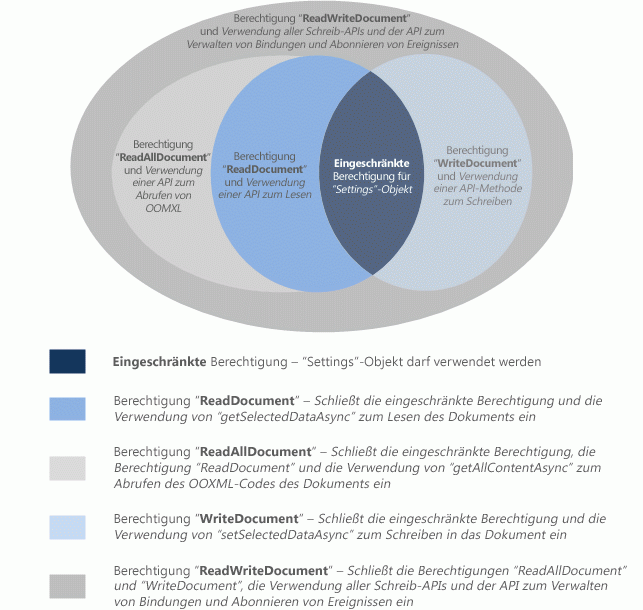

# Anfordern von Berechtigungen zur API-Verwendung in Inhalts- und Aufgabenbereich-Add-Ins
In diesem Artikel werden die verschiedenen Berechtigungsstufen beschreiben, die Sie im Manifest Ihres Inhalts- oder Aufgabenbereich-Add-ins deklarieren können, um die Stufe von JavaScript-API-Zugriff festzulegen, die für den Zugriff auf die Add-in-Funktionen erforderlich ist. 

 _**Gilt für:** Access apps for SharePoint | apps for Office | Excel | Office Add-ins | PowerPoint | Project | Word_


## Berechtigungsmodell


Der Datenschutz und die Sicherheit für Benutzer Ihrer Inhalts- und Aufgabenbereich-Add-ins basieren auf einem 5-stufigen JavaScript-API-Zugriffsberechtigungsmodell. In Abbildung 1 werden die 5 Stufen von API-Berechtigungen gezeigt, die Sie im Manifest Ihres Add-ins deklarieren können.


**Abbildung 1: Das 5-stufige Berechtigungsmodell für Inhalts- und Aufgabenbereich-Add-ins**




Diese Berechtigungen geben die Teilmenge der API an, deren Verwendung den Inhalts- oder Aufgabenbereich-Add-ins durch die Add-in-Laufzeit gestattet wird, wenn der Benutzer Ihr Add-in einfügt und anschließend aktiviert (ihm vertraut). Zum Deklarieren der erforderlichen Berechtigungsstufe für Ihr Inhalts- oder Aufgabenbereich-Add-in legen Sie im Element [Permissions](http://msdn.microsoft.com/de-de/library/d4cfe645-353d-8240-8495-f76fb36602fe%28Office.15%29.aspx) des Manifests Ihres Add-ins einen der Berechtigungstextwerte fest. Im folgenden Beispiel ist die **WriteDocument**-Berechtigung erforderlich, die nur solche Methoden zulässt, die in das Dokument schreiben (aber es nicht lesen) können.


```XML
<Permissions>WriteDocument</Permissions>
```

Als bewährte Methode sollten Sie Berechtigungen nach dem Prinzip der  _geringsten Rechte_ anfordern. Das heißt, die angeforderten Berechtigungen sollten Zugriff auf lediglich die minimale Teilmenge der API gewähren, die Ihr Add-in für eine ordnungsgemäße Funktion benötigt. Wenn Ihr Add-in zum Funktionieren beispielsweise nur Daten im Dokument eines Benutzers lesen muss, sollten Sie keine Berechtigung anfordern, die über **ReadDocument** hinausgeht.

In der folgenden Tabelle ist die von den einzelnen Berechtigungsstufen aktivierte Teilmenge der JavaScript-API beschrieben.


|**Berechtigung**|**Aktivierte Teilmenge der API**|
|:-----|:-----|
|**Restricted**|Die Methoden des [Settings](http://msdn.microsoft.com/de-de/library/ad733387-a58c-4514-8fc2-53e64fad468d%28Office.15%29.aspx)-Objekts und die [Document.getActiveViewAsync](http://msdn.microsoft.com/de-de/library/6b53c90a-df57-4851-98d1-fae2b54f6ad6%28Office.15%29.aspx)-Methode.Dies ist die minimale Berechtigung, die von einem Aufgabenbereich-Add-in angefordert werden kann.|
|**ReadDocument**|Zusätzlich zur von der  **Restricted**-Berechtigung zugelassenen API fügt es Zugriff auf die zum Lesen des Dokuments und zum Verwalten von Bindungen notwendigen API-Mitglieder hinzu.Dies umfasst die Verwendung von Folgendem:
<ul xmlns:xlink="http://www.w3.org/1999/xlink" xmlns:mtps="http://msdn2.microsoft.com/mtps" xmlns:mshelp="http://msdn.microsoft.com/mshelp" xmlns:ddue="http://ddue.schemas.microsoft.com/authoring/2003/5" xmlns:msxsl="urn:schemas-microsoft-com:xslt"><li><p>Die <a href="http://msdn.microsoft.com/de-de/library/f85ad02c-64f0-4b73-87f6-7f521b3afd69(Office.15).aspx" target="_blank">Document.getSelectedDataAsync</a>-Methode zum Abrufen des ausgewählten Textes, HTML (nur Word) oder Tabellendaten, aber kein zugrunde liegender Open Office XML (OOXML)-Code, bei dem sämtliche Daten im Dokument enthalten sind.</p></li><li><p>Die <a href="http://msdn.microsoft.com/de-de/library/78047418-89c4-4c7d-9427-4735b8559518(Office.15).aspx" target="_blank">Document.getFileAsync</a>-Methode zum Abrufen sämtlichen Textes im Dokument, jedoch nicht die zugrunde liegende OOXML-Binärkopie des Dokuments.</p></li><li><p>Die <a href="http://msdn.microsoft.com/de-de/library/5372ffd8-579d-4fcb-9e5b-e9a2128f3201(Office.15).aspx" target="_blank">Binding.getDataAsync</a>-Methode zum Lesen gebundener Daten im Dokument.</p></li><li><p>Die <a href="http://msdn.microsoft.com/de-de/library/afbadac7-60c7-47cb-9477-6e9466ded44c(Office.15).aspx" target="_blank">addFromNamedItemAsync</a>-, <a href="http://msdn.microsoft.com/de-de/library/9dc03608-b08b-4700-8be1-3c86ae236799(Office.15).aspx" target="_blank">addFromPromptAsync</a>-, <a href="http://msdn.microsoft.com/de-de/library/edc99214-e63e-43f2-9392-97ead42fc155(Office.15).aspx" target="_blank">addFromSelectionAsync</a>-Methoden des <span class="keyword">Bindings</span>-Objekts zum Erstellen von Bindungen im Dokument.</p></li><li><p>Die <a href="http://msdn.microsoft.com/de-de/library/ef902b73-cc4c-4551-95de-d8a51eeba82f(Office.15).aspx" target="_blank">getAllAsync</a>-, <a href="http://msdn.microsoft.com/de-de/library/2727c891-bc05-465c-9324-113fbfeb3fbb(Office.15).aspx" target="_blank">getByIdAsync</a>- und <a href="http://msdn.microsoft.com/de-de/library/ad285984-8b44-435d-9b84-f0ade570c896(Office.15).aspx" target="_blank">releaseByIdAsync</a>-Methoden des <span class="keyword">Bindings</span>-Objekts zum Zugreifen auf und Entfernen von Bindungen im Dokument.</p></li><li><p>Die <a href="http://msdn.microsoft.com/de-de/library/2533a563-95ae-4d52-b2d5-a6783e4ef5b4(Office.15).aspx" target="_blank">Document.getFilePropertiesAsync</a>-Methode zum Zugreifen auf Dateieigenschaften des Dokuments, z. B. die URL des Dokuments.</p></li><li><p>Die <a href="http://msdn.microsoft.com/de-de/library/35dda81c-235e-4eab-8a77-9acb3b73a380(Office.15).aspx" target="_blank">Document.goToByIdAsync</a>-Methode zum Navigieren zu benannten Objekten und Speicherorten im Dokument.</p></li><li><p>Bei Aufgabenbereich-Add-ins für ein Projekt, alle Abrufmethoden des Objekts <a href="http://msdn.microsoft.com/de-de/library/1908af4f-93b9-4859-87e3-06942014fae1(Office.15).aspx" target="_blank">ProjectDocument</a>. </p></li></ul>|
|**ReadAllDocument**|Lässt, zusätzlich zur durch die  **Restricted**- und  **ReadDocument**-Berechtigungen zulässigen API den folgenden Zugriff auf Dokumentendaten zu:
<ul xmlns:xlink="http://www.w3.org/1999/xlink" xmlns:mtps="http://msdn2.microsoft.com/mtps" xmlns:mshelp="http://msdn.microsoft.com/mshelp" xmlns:ddue="http://ddue.schemas.microsoft.com/authoring/2003/5" xmlns:msxsl="urn:schemas-microsoft-com:xslt"><li><p>Die <span class="keyword">Document.getSelectedDataAsync</span>- und <span class="keyword">Document.getFileAsync</span>-Methoden können auf den zugrunde liegenden OOXML-Code des Dokumentes zugreifen (der zusätzlich zum Text Formatierungen, Verknüpfungen, eingebettete Grafik, Kommentare, Überarbeitungen usw. aufweisen kann).</p></li></ul>|
|**WriteDocument**|Fügt, zusätzlich zur durch die  **Restricted**-Berechtigung zulässigen API, Zugriff auf die folgenden API-Mitglieder zu:
<ul xmlns:xlink="http://www.w3.org/1999/xlink" xmlns:mtps="http://msdn2.microsoft.com/mtps" xmlns:mshelp="http://msdn.microsoft.com/mshelp" xmlns:ddue="http://ddue.schemas.microsoft.com/authoring/2003/5" xmlns:msxsl="urn:schemas-microsoft-com:xslt"><li><p>Die <a href="http://msdn.microsoft.com/de-de/library/998f38dc-83bd-4659-a759-4758c632a6ef(Office.15).aspx" target="_blank">Document.setSelectedDataAsync</a>-Methode zum Schreiben der Auswahl des Benutzers in das Dokument.</p></li></ul>|
|**ReadWriteDocument**|Umfasst, zusätzlich zur durch die Berechtigungen  **Restricted**-,  **ReadDocument**,  **ReadAllDocument** und **WriteDocument** zulässigen API, Zugriff auf alle verbleibenden, durch Inhalts- und Aufgabenbereich-Add-ins unterstützten APIs, einschließlich Methoden für das Abonnieren von Ereignissen.Für den Zugriff auf diese zusätzlichen API-Mitglieder müssen Sie die  **ReadWriteDocument**-Berechtigung deklarieren: 
<ul xmlns:xlink="http://www.w3.org/1999/xlink" xmlns:mtps="http://msdn2.microsoft.com/mtps" xmlns:mshelp="http://msdn.microsoft.com/mshelp" xmlns:ddue="http://ddue.schemas.microsoft.com/authoring/2003/5" xmlns:msxsl="urn:schemas-microsoft-com:xslt"><li><p>Die <a href="http://msdn.microsoft.com/de-de/library/6a59bb6d-40b6-4a95-9b98-d70d4616de09(Office.15).aspx" target="_blank">Binding.setDataAsync</a>-Methode zum Schreiben in gebundene Bereiche des Dokuments.</p></li><li><p>Die <a href="http://msdn.microsoft.com/de-de/library/1cd23454-8435-4e13-98b3-d0d29ed278a8(Office.15).aspx" target="_blank">TableBinding.addRowsAsync</a>-Methode zum Hinzufügen von Zeilen zu gebundenen Tabellen.</p></li><li><p>Die <a href="http://msdn.microsoft.com/de-de/library/8f1bfa81-3850-4ea1-ba2e-c9bcf5847a44(Office.15).aspx" target="_blank">TableBinding.addColumnsAsync</a>-Methode zum Hinzufügen von Spalten zu gebundenen Tabellen.</p></li><li><p>Die <a href="http://msdn.microsoft.com/de-de/library/8f5cc783-384d-4520-a218-190dfed74dd2(Office.15).aspx" target="_blank">TableBinding.deleteAllDataValuesAsync</a>-Methode zum Löschen sämtlicher Daten in einer gebundenen Tabelle.</p></li><li><p>Die <a href="http://msdn.microsoft.com/de-de/library/49712906-f582-4055-9ef8-6edde6e97679(Office.15).aspx" target="_blank">setFormatsAsync</a>-, <a href="http://msdn.microsoft.com/de-de/library/cc56e9c0-b33c-4d9b-b676-a7e50f757c10(Office.15).aspx" target="_blank">clearFormatsAsync</a>- und <a href="http://msdn.microsoft.com/de-de/library/2885fc57-4527-4ca4-a43d-9ee447ec27d3(Office.15).aspx" target="_blank">setTableOptionsAsync</a>-Methoden des <span class="keyword">TableBinding</span>-Objekts zum Festlegen von Formatierungsoptionen für gebundene Tabellen.</p></li><li><p>Alle Mitglieder der <a href="http://msdn.microsoft.com/de-de/library/dc1518de-47fa-4108-aab7-04a022724b04(Office.15).aspx" target="_blank">CustomXmlNode</a>-, <a href="http://msdn.microsoft.com/de-de/library/83f0e668-8236-4f2f-a20f-b173a9e3f65f(Office.15).aspx" target="_blank">CustomXmlPart</a>-, <a href="http://msdn.microsoft.com/de-de/library/ba40cd4c-29bb-4f31-875d-6f1382fd1ee8(Office.15).aspx" target="_blank">CustomXmlParts</a>- und <a href="http://msdn.microsoft.com/de-de/library/18b9aa8c-83e7-4c2f-8530-6a0ac8ce5535(Office.15).aspx" target="_blank">CustomXmlPrefixMappings</a>-Objekte.</p></li><li><p>Alle Methoden zum Abonnieren der von Inhalts- und Aufgabenbereich-Add-ins unterstützten Ereignisse, insbesondere die Methoden <span class="keyword">addHandlerAsync</span> und <span class="keyword">removeHandlerAsync</span> der Objekte <a href="http://msdn.microsoft.com/de-de/library/42882642-d22b-47d2-a8d3-3aa8c6a4435e(Office.15).aspx" target="_blank">Binding</a>, <a href="http://msdn.microsoft.com/de-de/library/83f0e668-8236-4f2f-a20f-b173a9e3f65f(Office.15).aspx" target="_blank">CustomXmlPart</a>, <a href="http://msdn.microsoft.com/de-de/library/f8859516-cc1f-4b20-a8f3-cee37a983e70(Office.15).aspx" target="_blank">Document</a>, <a href="http://msdn.microsoft.com/de-de/library/1908af4f-93b9-4859-87e3-06942014fae1(Office.15).aspx" target="_blank">ProjectDocument</a> und <a href="http://msdn.microsoft.com/de-de/library/ad733387-a58c-4514-8fc2-53e64fad468d(Office.15).aspx" target="_blank">Settings</a>.</p></li></ul>|

## Zusätzliche Ressourcen


- [Aufgabenbereich- und Inhalts-Add-Ins für Office 2013](baf73b23-4429-4b7f-bcb9-a99a9618ae38.md)
    
- [Datenschutz und Sicherheit bei Office-Add-Ins](87c59a88-10e2-4c88-b6a8-736bd356e5f8.md)
    


