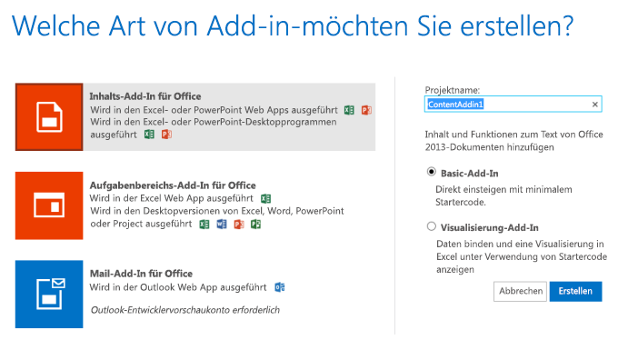
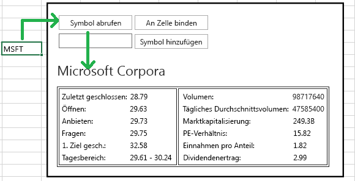
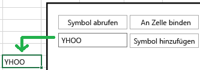

# Erstellen eines Inhalts-Add-Ins für Excel mit Napa Office 365-Entwicklungstools
Erstellen Sie ein Inhalts-Add-In für Excel mit Napa Office 365-Entwicklungstools, das Sie hier erstellen, ruft Aktiensymbole aus einem Arbeitsblatt ab und zeigt mit diesem Symbol verwandte Daten im Add-In an. Das Add-in zeigt Ihnen auch, wie Sie Daten zurück in das Arbeitsblatt schreiben, Ereignisse behandeln und Bindungen an Zellen im Arbeitsblatt erstellen.

 _**Gilt für:** apps for Office | Excel | Office Add-ins_

Sie können auch mit [Visual Studio](http://msdn.microsoft.com/de-de/library/a23c5ce8-6de3-40f6-a86a-85d3592bef3e%28Office.15%29.aspx) oder einem [Text-Editor](http://msdn.microsoft.com/de-de/library/d5411d35-9ef6-4e21-ba2b-4d2b1ee81359%28Office.15%29.aspx).Aufgabenbereich-Add-ins erstellen. Wenn Sie nicht wissen, welches Tool Sie verwenden sollen, lesen Sie die [Grundlagen der Entwicklung](privacy-and-security.md#StartBuildingApps_DevelopmentBasics).

Weitere Informationen zu Napa finden Sie unter [Erstellen von Office-Add-Ins mit Napa Office 365-Entwicklungstools](create-office-add-ins-with-napa.md).


## Voraussetzungen


- Ein [Microsoft-Konto](http://www.microsoft.com/de-de/account/default.aspx)
    
- Die URL für die [Napa Office 365-Entwicklungstools](https://www.napacloudapp.com/)-Web-App
    

## Erstellen einer einfachen Office-Add-In


1. Öffnen Sie die [Napa Office 365-Entwicklungstools](https://www.napacloudapp.com/)-Web-App im Browser, und melden Sie sich mit den Anmeldeinformationen Ihres Microsoft-Kontos an.
    
2. Klicken Sie auf die Kachel  **Neues Projekt hinzufügen**.
    
    Die Kachel  **Neues Projekt hinzufügen** wird nur angezeigt, wenn Sie bereits andere Projekte erstellt haben. Wenn dies Ihr erstes Projekt ist, fahren Sie mit dem nächsten Schritt fort.
    

    **Kachel für neues Projekt**

    

3. Klicken Sie auf die Kachel  **Inhalts-Add-In für Office**, und nennen Sie das Projekt MyFirstContentAddin. Wählen Sie die Standardoption  **Basis-Add-In**, und klicken Sie dann auf die Schaltfläche  **Erstellen**. 
    
    **Kachel "Inhalts-Add-In"**

    
    Der Code-Editor wird mit der Standardwebsite geöffnet, die bereits etwas Beispielcode enthält, den Sie ohne weiteres Zutun ausführen können.
    

### Ausführen der Beispiel-Office-Add-In


1. Klicken Sie am Rand der Seite auf die Schaltfläche  **Ausführen**
.
    
    Excel Online wird geöffnet, und die Beispiel-Office-Add-In wird angezeigt. Sie können mit ihren Features experimentieren, indem Sie  **Arbeitsmappe bearbeiten > In Excel Online bearbeiten** wählen.
    
2. Wenn Sie bereit sind fortzufahren, schließen Sie Excel Online.
    

## So fügen Sie dem Projekt HTML- und JavaScript-Dateien hinzu


1. Klicken Sie in Napa auf die Schaltfläche  **Neuer Ordner**.
    
2. Nennen Sie den Ordner  **MyAddinPage**.
    
3. Öffnen Sie das Kontextmenü für den Ordner  **MyAddinPage** (klicken Sie mit der rechten Maustaste auf den Ordner), und wählen Sie dann **Neue Datei hinzufügen**.
    
    Das Dialogfeld  **Neue Datei** wird geöffnet.
    
4. Klicken Sie auf die Kachel  **HTML-Seite**, nennen Sie die Datei MyAddinPage, und klicken Sie dann auf die Schaltfläche  **Erstellen**.
    
5. Öffnen Sie das Kontextmenü für den Ordner  **MyAddinPage**, und wählen Sie dann **Neue Datei hinzufügen**.
    
    Das Dialogfeld  **Neue Datei** wird geöffnet.
    
6. Klicken Sie auf die Kachel  **JavaScript-Datei**, geben Sie der Datei den Namen MyAddinPage, und klicken Sie dann auf die Schaltfläche  **Erstellen**.
    
    Als Nächstes ändern wir Aussehen und Bedienung des Add-ins, und verweisen es auf die HTML-Seite, die Sie zuvor erstellt haben.
    

## Ändern der Add-in-Eigenschaften


1. Klicken Sie am Rand der Seite auf die Schaltfläche  **Eigenschaften**
.
    
    Die Eigenschaften der Office-Add-In werden angezeigt.
    
2. Legen Sie folgende Eigenschaften fest:
    
      -  **Name**-Eigenschaft als Mein erstes Inhalts-Add-In
    
  -  **StartPage** alsMyAddinPage/MyAddinPage.html
    
  -  **Beschreibung** alsDieses Add-in ruft Daten aus einer Zelle ab und schreibt Daten in eine Zelle. Dieses Add-In reagiert auch auf Ereignisse im Arbeitsblatt.
    
  -  **Ausgangsbreite** auf 520
    
  -  **Ausgangshöhe** auf 400
    

    Anhand der Eigenschaften  **Name** und **Beschreibung** können Benutzer den Zweck des Add-ins erkennen, wenn dieses in einer Liste verfügbarer Add-ins für eine Office-Anwendung angezeigt wird. Die Größeneigenschaften geben an, wie viel Platz das Add-in benötigt. Die Eigenschaft **Startseite** zeigt auf die Seite, die im Add-in angezeigt wird, wenn Sie das Projekt starten.
    
3. Klicken Sie auf die Schaltfläche  **Anwenden** unten auf der Seite **Eigenschaften**, und wählen Sie dann die Schaltfläche  **Durchsuchen**
 Über die Werkzeugleiste auf der linken Seite werden die Eigenschaftswerte gespeichert, und die Seite "Durchsuchen" wird angezeigt.
    
     >**Hinweis**  Der  **Eigenschaften**-Editor zeigt die gängigsten Einstellungen einer Office-Add-In, aber nicht alle möglichen Einstellungen. Wenn Ihr Szenario das Ändern von Einstellungen erfordert, die nicht im  **Eigenschaften**-Editor angezeigt werden, können Sie Ihr Add-In mit [Visual Studio](http://msdn.microsoft.com/de-de/library/a23c5ce8-6de3-40f6-a86a-85d3592bef3e%28Office.15%29.aspx) oder einem [Text-Editor](http://msdn.microsoft.com/de-de/library/7aac2fdc-1a04-45ec-a1dc-da26e646a364%28Office.15%29.aspx) erstellen.

## Abrufen von Daten aus einem Arbeitsblatt


Ihre Office-Add-In kann den Wert einer einzelnen Zelle bzw. die Werte einer Gruppe von Zellen abrufen. Am einfachsten können Sie diese Aufgabe ausführen, indem Sie den Wert einer einzelnen Zelle abrufen, die ein Benutzer in einem Arbeitsblatt auswählt. Nach Abschluss dieser Schritte können Sie eine Zelle in Excel auswählen und anschließend im Add-in auf eine Schaltfläche klicken. Die Daten aus der gewählten Zelle werden in einem Steuerelement im Add-in angezeigt.


1. Wählen Sie auf der Seite  **MyAddinPage.html** aus.
    
    Die MyAddinPage-Webseite wird im Code-Editor geöffnet.
    
2. Ersetzen Sie den gesamten Code in den  `<head>`-Tags (einschließlich der öffnenden und schließenden  `<head>`-Tags) durch diesen Code.
    
  ```HTML
  <head>
    <meta charset="UTF-8" />
    <meta http-equiv="X-UA-Compatible" content="IE=Edge" />
    <title></title>
    <script src="https://ajax.aspnetcdn.com/ajax/jQuery/jquery-1.9.1.min.js" type="text/javascript"></script>
    
    <link href="../Content/Office.css" rel="stylesheet" type="text/css" />
    <script src="https://appsforoffice.microsoft.com/lib/1/hosted/Office.js" type="text/javascript"></script>
    
    <link href="../App/App.css " rel="stylesheet" type="text/css" />
    <script src="../App/App.js" type="text/javascript"></script>
    
    <script src="MyAddinPage.js" type="text/javascript"></script>
</head>

  ```


    Dieser Code versieht Ihre Webseite „MyAddinPage" mit denselben JavaScript-Bibliotheken und CSS-Dateiverweisen wie bei der Standarddatei „Home.html". In der folgenden Tabelle werden die einzelnen Dateiverweise beschrieben.
    

|**Datei**|**Beschreibung**|
|:-----|:-----|
|**App.css, Office.css**|Die CSS-Standarddateien des Projekts. Sie können mithilfe dieser Seiten bestimmte Anzeigeaspekte der Webseite definieren.|
|**MyAddinPage.js**|Die JavaScript-Datei, die Sie für Ihre Seite erstellt haben. |
|**App.js**|App.js ist die standardmäßige JavaScript-Datei des Add-ins, das im Ordner  **Add-in** des Projekts enthalten ist. Diese Datei enthält Beispielcode für die ersten Schritte.|
3. Ersetzen Sie das öffnende und schließende Tag vom Typ  `<body>` durch diesen Code.
    
    Dieser Code fügt alle Steuerelemente hinzu, die im Rahmen dieser exemplarischen Vorgehensweise implementiert werden. Der Code fügt außerdem eine Tabelle hinzu, die Aktiendaten zu den Symbolen enthält, die Sie zum Arbeitsblatt hinzufügen. 
    


  ```HTML
  <body>
<div style="padding: 15px; overflow: auto; border: .2em solid #000;">

<table>
<tr>
<td>

<button id="get-text" style="width: 100px;">Get symbol</button>
</td>
<td>
<button id="bind-text" style="width: 100px;">Bind to cell</button>
</td>
</tr>
<tr>
<td>
<input id="input" style="width: 100px;"/>
</td>
<td>
<button id="add-text" style="width: 100px;">Add symbol</button>
</td>
</tr>

</table>
<h1><div id="stock-name"></div></h1>
<table border="true">
<tr>
<td>
<table>
<tr>
<td>Prev close:</td>
<td id="prev-close"></td>
</tr>

<tr>
<td>Open:</td>
<td id="open"></td>
</tr>

<tr>
<td>Bid:</td>
<td id="bid"></td>
</tr>
<tr>
<td>Ask:</td>
<td id="ask"></td>
</tr>
<tr>
<td>1y Target Est:</td>
<td id="target-est"></td>
</tr>
<tr>
<td>Days range:</td>
<td id="days-range"></td>
</tr>
</table>
</td>
<td>
    <table>
<tr>
<td>Volume:</td>
<td id="volume"></td>
</tr>

<tr>
<td>Avg daily volume:</td>
<td id="avg-volume"></td>
</tr>

<tr>
<td>Market capitalization:</td>
<td id="market-cap"></td>
</tr>
<tr>
<td>PE Ratio:</td>
<td id="pe-ratio"></td>
</tr>
<tr>
<td>Earnings p share:</td>
<td id="earnings"></td>
</tr>
<tr>
<td>Dividend yield:</td>
<td id="yield"></td>
</tr>
</table>
</td>
</tr>
</table>
</div>

</body>


  ```

4. Öffnen Sie die Datei „MyAddinPage.js", und fügen Sie dann den folgenden Code hinzu.
    
    Wenn Sie den Code ausführen, fügen Sie ein Aktiensymbol in die Zelle ein.
    


  ```
  /// <reference path../../Scripts/App.js" />

(function () {
    "use strict";
    
    // The initialize function must be run each time a new page is loaded
    Office.initialize = function (reason) {
        $(document).ready(function () {


$('#get-text').click(getTextFromDocument);      
        });
    }

})();
function getTextFromDocument() {

    Office.context.document.getSelectedDataAsync(Office.CoercionType.Text,
        { valueFormat: "unformatted", filterType: "all" },

        function (asyncResult) {
            showStockData(asyncResult.value);
        });

}
function showStockData(symbol){
    // Yahoo YQL - http://developer.yahoo.com/yql/ 
var yql = 'select * from yahoo.finance.quotes where symbol in (\'' + symbol + '\')';
var queryURL = 'https://query.yahooapis.com/v1/public/yql?q=' + yql + '&amp;format=json&amp;env=http%3A%2F%2Fdatatables.org%2Falltables.env&amp;callback=?';

$.getJSON(queryURL, function(results) {
if(results.query.count > 0)
{
var quotes = results.query.results.quote;

$('#stock-name').text(quotes.Name);
$('#prev-close').text(quotes.PreviousClose);
$('#open').text(quotes.Open);
$('#bid').text(quotes.Bid);
$('#ask').text(quotes.Ask);
$('#target-est').text(quotes.OneyrTargetPrice);
$('#days-range').text(quotes.DaysRange);
$('#volume').text(quotes.Volume);
$('#avg-volume').text(quotes.AverageDailyVolume);
$('#market-cap').text(quotes.MarketCapitalization);
$('#pe-ratio').text(quotes.PERatio);
$('#earnings').text(quotes.EarningsShare);
$('#yield').text(quotes.DividendYield);

}

});

}


  ```


    Beim Aufruf von  `getSelectedDataAsync` wird eine anonyme Funktion mit einem Parameter mit dem Namen `asyncResult` als Rückrufargument übergeben. Wenn die Rückruffunktion ausgeführt wird, verwendet sie den `asyncResult`-Parameter für den Zugriff auf die Werteigenschaften des  `AsyncResult`-Objekts, um die Daten in der Zelle anzuzeigen, die der Benutzer ausgewählt hat.
    
     >**Hinweis**  Wie bei anderen Methoden in der JavaScript-API für Office auch, ist diese Methode asynchron. Dies bedeutet, dass das Add-in nicht daran gehindert wird, während der Ausführung dieser Methode andere Vorgänge auszuführen.

### Führen Sie die App aus!


1. Klicken Sie am Rand der Seite auf die Schaltfläche  **Ausführen**
.
    
    Excel Online wird geöffnet, und die Office-Add-In wird angezeigt. Wählen Sie  **Arbeitsmappe bearbeiten > In Excel Online bearbeiten**.
    
2. Geben Sie MSFT in eine beliebige Zelle ein.
    
    Diese Abkürzung ist das Tickersymbol der Microsoft-Aktie.
    
3. Klicken Sie in der Office-Add-In auf die Schaltfläche  **Symbol abrufen**.
    
    Mit dem Tickersymbol "MSFT" zusammenhängende Daten erscheinen in einer Tabelle.
    

    **In einer Tabelle des Add-ins angezeigte Daten.**

    
    Dieses Beispiel veranschaulicht das Abrufen von Daten aus einer Zelle. In Ihrem Add-in können Sie auf diese Weise Informationen in einer Datenbank nachschlagen oder aus einem anderen Dienst abrufen oder eine Berechnung durchführen. Sie können Code für diese Vorgänge der anonymen Funktion hinzufügen, die Sie als Parameter an die  `getSelectedDataAsync`-Methode übergeben.
    
4. Schließen Sie Excel Online.
    
    Im nächsten Beispiel geben Sie Daten, die der Benutzer in ein Steuerelement für das Add-in eingibt, in eine Zelle im Arbeitsblatt ein.
    

## Ablegen von Daten in ausgewählten Zellen in einem Arbeitsblatt


Ihre Office-Add-In kann Daten in einer beliebigen Zelle oder Gruppe von Zellen ablegen. Am einfachsten können Sie diese Aufgabe ausführen, indem Sie Daten in einer Zelle ablegen, die ein Benutzer in einem Arbeitsblatt auswählt. Nach Abschluss dieser Schritte kann der Benutzer Text einer Zelle im Arbeitsblatt hinzufügen, indem er im Add-in auf eine Schaltfläche klickt.


1. Öffnen Sie die Datei  **MyAddinPage.js** im Code-Editor und fügen Sie dann den folgenden Code hinzu.
    
  ```
  function addTextToDocument() {

    var e = document.getElementById("input");
    var text = e.value;

    Office.context.document.setSelectedDataAsync(text,
        function (asyncResult) {});
}

  ```


    Dieser Code ruft den Text aus dem  `input`-Textfeld in MyAddinPage.html ab und legt diesen Text in einer Zelle ab, die der Benutzer im Arbeitsblatt auswählt.
    
2. Ersetzen Sie die  `initialize`-Funktion durch diesen Code.
    
  ```
  Office.initialize = function (reason) {
        $(document).ready(function () {
$('#get-text').click(getTextFromDocument);
$('#add-text').click(addTextToDocument);
            
        });
    }

  ```


### Führen Sie die App aus!


1. Klicken Sie am Rand der Seite auf die Schaltfläche  **Ausführen**
.
    
    Excel Online wird geöffnet, und die Office-Add-In wird angezeigt.
    
2. Wählen Sie in Excel Online eine beliebige Zelle aus.
    
3. Geben Sie im Add-in  **YHOO** in das Textfeld neben der Schaltfläche **Symbol hinzufügen** ein, und klicken Sie dann auf die Schaltfläche **Symbol hinzufügen**.
    
    Der Text  **YHOO** wird in der ausgewählten Zelle angezeigt.
    

    **Der Text "MSFT" in der ausgewählten Zelle**

    
    Dieses Beispiel ist zwar einfach, veranschaulicht aber das Ablegen von Daten in einer Zelle. Ihre Office-Add-In kann ggf. einen Aktiendienst nutzen, um die Schlussnotierung einer Aktie abzurufen und anschließend diesen einer Zelle hinzufügen, in der weitere Berechnungen erfolgen können.
    
4. Schließen Sie Excel Online. 
    

## Verarbeiten eines Ereignisses in einem Arbeitsblatt


Bislang fordert Ihre Office-Add-In den Benutzer auf, auf eine Schaltfläche zu klicken, um Daten abzurufen und festzulegen. Mithilfe einiger weiterer Schritte können Sie auch Daten automatisch abrufen und festlegen, wenn ein Benutzer eine Zelle schließt.


1. Öffnen Sie im Code-Editor die Datei  **MyAddinPage.js**, und ersetzen Sie die  `initialize`-Funktion durch diesen Code.
    
  ```
  Office.initialize = function (reason) {
        $(document).ready(function () {
$('#get-text').click(getTextFromDocument);
$('#add-text').click(addTextToDocument);
        Office.context.document.addHandlerAsync
        (Office.EventType.DocumentSelectionChanged, updateApp);
            
        });
    }

  ```


    Dieser Code bindet Funktionen an die Schaltflächen auf der Seite und fügt einen Ereignishandler hinzu, der aufgerufen wird, wenn der Benutzer eine Zelle auswählt.
    
2. Fügen Sie der Datei MyAddinPage.js diesen Code hinzu.
    
  ```
  function updateApp()
{
        getTextFromDocument();
}

  ```


    Diese Methode wird aufgerufen, wenn ein Benutzer eine Zelle auswählt. Der Code ruft die Methode auf, die Sie zuvor definiert haben. Diese Methode ruft den Wert der ausgewählten Zelle (Aktiensymbol) ab und zeigt mit diesem Symbol zusammenhängende Daten in einer Tabelle an.
    

### Führen Sie die App aus!


1. Klicken Sie am Rand der Seite auf die Schaltfläche  **Ausführen**
. 
    
    Excel Online wird geöffnet, und die Office-Add-In wird angezeigt. Wählen Sie  **Arbeitsmappe bearbeiten > In Excel Online bearbeiten**.
    
2. Geben Sie im Add-in  **MSFT** in das Textfeld neben der Schaltfläche **Symbol hinzufügen** ein, und klicken Sie dann auf die Schaltfläche **Symbol hinzufügen**.
    
3. Wählen Sie eine andere Zelle und danach die Zelle aus, die  **MSFT** enthält.
    
    Tickerdaten für das Symbol  **MSFT** erscheinen in der Tabelle.
    
4. Schließen Sie Excel Online.
    

## Herstellen einer Bindung mit Zellen in einem Arbeitsblatt


Die anspruchsvollste Möglichkeit zum Abrufen und Festlegen von Daten ist das Herstellen einer Bindung mit einer Zelle oder Gruppe von Zellen in einem Arbeitsblatt. Sie können Benutzer auffordern, die Zellen auszuwählen, die das Add-in verwenden soll. Anschließend können Sie jederzeit Daten aus diesen Zellen abrufen bzw. Daten in diesen Zellen ablegen.


1. Öffnen Sie im Code-Editor die Datei MyAddinPage.js und fügen Sie dann diesen Code hinzu. Der Code richtet eine Bindung mit einer Zelle ein, die der Benutzer auswählt. Dieser Code definiert auch eine Methode, die aufgerufen wird, wenn sich die Daten in der gebundenen Zelle ändern.
    
  ```
  function addBindingFromSelection() {
    Office.context.document.bindings.addFromSelectionAsync(Office.BindingType.Text, { id: 'MyBinding' },
        function (asyncResult) {
            Office.select("bindings#MyBinding").addHandlerAsync
               (Office.EventType.BindingDataChanged, onBindingSelectionChanged);
        }
    );
}


function onBindingSelectionChanged(eventArgs) {

    Office.select("bindings#MyBinding").getDataAsync
        (function (asyncResult) {

            if (asyncResult.value !== "") {
                showStockData(asyncResult.value);
            }

         });
}

  ```

2. Ersetzen Sie die  `initialize`-Funktion durch diesen Code.
    
  ```
  Office.initialize = function (reason) {
        $(document).ready(function () {
$('#get-text').click(getTextFromDocument);
$('#add-text').click(addTextToDocument);
$('#bind-text').click(addBindingFromSelection);

        Office.context.document.addHandlerAsync
        (Office.EventType.DocumentSelectionChanged, updateApp);

        });
    }

  ```


### Führen Sie die App aus!


1. Klicken Sie am Rand der Seite auf die Schaltfläche  **Ausführen**
.
    
    Excel Online wird geöffnet, und die Office-Add-In wird angezeigt. Wählen Sie  **Arbeitsmappe bearbeiten > In Excel Online bearbeiten**.
    
2. Wählen Sie in Excel Online eine beliebige Zelle aus. Klicken Sie anschließend in der Office-Add-In auf die Schaltfläche  **An Zelle binden**
    
3. Geben Sie im Add-in  **MSFT** in das Textfeld neben der Schaltfläche **Symbol hinzufügen** ein, und klicken Sie dann auf die Schaltfläche **Symbol hinzufügen**.
    
    Der Text  **MSFT** wird in der ausgewählten Zelle angezeigt. Da sich der Wert der Zelle geändert hat, erscheinen mit dieser Zelle zusammenhängende Daten in einer Tabelle.
    

    **Tabelle zeigt Daten für das Tickersymbol "MSFT".**

    

4. Schließen Sie Excel Online. 
    

## Debuggen Ihres Inhalts-Add-ins in Internet Explorer


Wenn Sie Ihr Add-in in Excel Online starten und Internet Explorer (IE) 9 verwenden, können Sie F12-Entwicklertools zum Debuggen der JavaScript-, HTML- und Cascading Style Sheets (CSS)-Elemente Ihres Add-ins verwenden. 

An dieser Stelle wird veranschaulicht, wie Sie die F12-Tools öffnen, den Debugger starten und die Ausführung bei einer Codezeile in Ihrer MyAddinPage.js-Datei beenden.


1. Klicken Sie am Rand der Seite auf die Schaltfläche  **Ausführen**
.
    
    Excel Online wird geöffnet, und die Office-Add-In wird angezeigt. Wählen Sie  **Arbeitsmappe bearbeiten > In Excel Online bearbeiten**.
    
2. Drücken Sie die F12-Taste auf Ihrer Tastatur.
    
    Die F12-Tools werden in einem separaten Fenster geöffnet.
    
3. Öffnen Sie im Fenster für die F12-Tools die Registerkarte  **Debugger**.
    
4. Verwenden Sie die Tastenkombination STRG-O zum Öffnen eines Dokuments, und geben Sie dann MyAddinPage.js in das Filtertextfeld ein.
    
    Der Inhalt der Datei „MyAddinPage.js" wird im Fenster angezeigt.
    
5. Setzen Sie einen Haltepunkt auf die  `addTextToDocument`-Methode.
    
    Weitere Informationen zum Setzen eines Haltepunkts im Fenster für F12-Tools finden Sie unter [Unterbrechen der Codeausführung](http://go.microsoft.com/fwlink/?LinkID=267272).
    
6. Geben Sie im Add-in  **MSFT** in das Textfeld neben der Schaltfläche **Symbol hinzufügen** ein, und klicken Sie dann auf die Schaltfläche **Symbol hinzufügen**.
    
    Im Fenster für F12-Tools wird die Ausführung bei der  `addTextToDocument`-Methode beendet.
    
    Weitere Informationen finden Sie unter [Verwenden der F12-Entwicklertools](http://msdn.microsoft.com/library/ie/bg182326%28v=vs.85%29).
    
    Wenn Sie einen anderen Browser als den Internet Explorer verwenden, finden Sie Informationen in Ihrer Browserdokumentation.
    

## Weitere Schritte


Nachdem Sie ein einfaches Inhalts-Add-in für Excel erstellt haben, bieten sich die folgenen Möglichkeiten:


- Teilen Sie das Projekt mit anderen, indem Sie die Schaltfläche  **Projekt freigeben** auswählen
. Napa erstellt eine Kopie des Projekts und einen öffentlichen Link, den Sie beliebigen Personen übermitteln können.
    
- Veröffentlichen Sie Ihr Add-in über die Schaltfläche  **Veröffentlichen** (
.
    
    Weitere Informationen finden Sie unter [Verpacken des Add-Ins mit Napa oder Visual Studio für die Veröffentlichung](../publish/package-your-add-in-using-napa-or-visual-studio.md).
    
- Öffnen Sie Ihr Projekt in Visual Studio über die Schaltfläche  **In Visual Studio öffnen**
. Napa installiert automatisch die benötigten Tools und öffnet Ihr Projekt in Visual Studio.
    
- Erstellen Sie ein Aufgabenbereich-Add-in für Excel mithilfe von Visual Studio. Weitere Informationen finden Sie unter [Erstellen eines Aufgabenbereich- oder Inhalts-Add-Ins mit Visual Studio](create-a-task-pane-or-content-add-in-with-visual-studio.md).
    
- Weitere Informationen zu Office-Add-Ins finden Sie unter [Office-Add-Ins-Plattformübersicht](../../docs/develop/privacy-and-security.md).
    

## Zusätzliche Ressourcen


- [Grundlegendes zur JavaScript-API für Office](../develop/understanding-the-javascript-api-for-office.md)
    
- [XML-Manifest für Office-Add-Ins](../../docs/overview/add-in-manifests.md)
    
