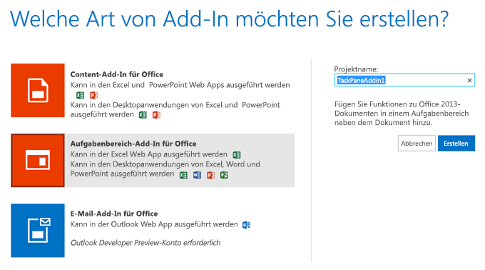

# Erstellen eines Aufgabenbereich-Add-Ins mit Napa Office 365-Entwicklungstools
Verwenden Sie Napa Office 365-Entwicklungstools, um ein Aufgabenbereichs-Office-Add-In zu erstellen, die eine Liste mit Bildern angezeigt. Wenn Benutzer Text in einem geöffneten Dokument markieren, wird eine Liste mit Bildern, die mit dem markierten Text getaggt wurden, von Flickr abgerufen und im Aufgabenbereich angezeigt.

 _**Gilt für:** apps for Office | Excel | Office Add-ins | PowerPoint | Project | Word_


Sie können auch mit [Visual Studio](http://msdn.microsoft.com/de-de/library/a23c5ce8-6de3-40f6-a86a-85d3592bef3e%28Office.15%29.aspx) oder einem [Text-Editor](http://msdn.microsoft.com/de-de/library/d5411d35-9ef6-4e21-ba2b-4d2b1ee81359%28Office.15%29.aspx) Aufgabenbereich-Add-Ins erstellen. Wenn Sie nicht wissen, welches Tool Sie verwenden sollen, lesen Sie die [Grundlagen der Entwicklung](privacy-and-security.md#StartBuildingApps_DevelopmentBasics).


## Voraussetzungen


- Ein [Microsoft-Konto](http://www.microsoft.com/de-de/account/default.aspx)
    
- Die URL für die [Napa Office 365-Entwicklungstools](https://www.napacloudapp.com/)-Web-App
    

## Erstellen einer grundlegenden Office-Add-In


1. Öffnen Sie die [Napa Office 365-Entwicklungstools](https://www.napacloudapp.com/)-Web-App im Browser, und melden Sie sich mit den Anmeldeinformationen Ihres Microsoft-Kontos an.
    
2. Klicken Sie auf die Kachel  **Neues Projekt hinzufügen**.
    
    Die Kachel  **Neues Projekt hinzufügen** wird nur angezeigt, wenn Sie bereits andere Projekte erstellt haben. Wenn dies Ihr erstes Projekt ist, fahren Sie mit dem nächsten Schritt fort.
    

    **Kachel für neues Projekt**

    

3. Wählen Sie die Kachel  **Aufgabenbereich-Add-In für Office**, geben Sie dem Projekt den Namen MyFirstTaskPaneAddin, und klicken Sie dann auf die Schaltfläche  **Erstellen**.
    
    **Kachel "Aufgabenbereich-Add-In"**

    
    Der Code-Editor wird geöffnet. Darin wird die Standardwebseite angezeigt, die bereits Beispielcode enthält, den Sie ohne weitere Schritte ausführen können.
    

### Ausführen des Beispiels Office-Add-In


1. Wählen Sie am Rand der Seite die Schaltfläche  **Ausführen** (
).
    
    Excel Online wird geöffnet, und die Beispiel-Office-Add-In wird im Aufgabenbereich angezeigt. Sie können mit ihren Features experimentieren, indem Sie  **Arbeitsmappe bearbeiten > In Excel Online bearbeiten** wählen.
    
2. Wenn Sie bereit sind fortzufahren, schließen Sie Excel Online.
    

## Ändern der Eigenschaften des Add-ins


1. Wählen Sie am Rand der Seite die Schaltfläche  **Eigenschaften** (
) aus, um die Office-Add-In-Eigenschaften anzuzeigen.
    
2. Setzen Sie die  **Name**-Eigenschaft auf Mein erstes Aufgabenbereichs-Add-In und die **Beschreibung**-Eigenschaft auf Diese App zeigt Bilder, die sich auf im Dokument ausgewählten Text beziehen.
    
    Anhand der Eigenschaften  **Name** und **Beschreibung** können Benutzer den Zweck des Add-ins besser verstehen, wenn dieses in einer Liste der verfügbaren Add-ins einer Office-Anwendung angezeigt wird. Mit der Eigenschaft **Startseite** wird auf die Seite verwiesen, die in der Office-Add-In beim Starten des Projekts angezeigt wird. Für diese exemplarische Vorgehensweise verwenden wir die Standardseite, die in Ihrem Projekt enthalten ist. Sie können dem Projekt jedoch neue Seiten hinzufügen und indem Sie die Eigenschaft **Startseite** auf eine dieser Seiten festlegen. Ein Beispiel finden Sie unter [Erstellen eines Inhalts-Add-Ins für Excel mit Napa Office 365-Entwicklungstools](create-a-content-add-in-with-napa.md).
    
3. Wählen Sie unten auf der Seite  **Eigenschaften** die Schaltfläche **Anwenden**, um die Werte der Eigenschaften zu speichern.
    
    Im Editor  **Eigenschaften** werden die am häufigsten verwendeten Einstellungen einer Office-Add-In angezeigt. Es werden nicht alle möglichen Einstellungen einer Office-Add-In angegeben. Falls Sie Einstellungen ändern müssen, die nicht im **Eigenschaften**-Editor angezeigt werden, können Sie das Projekt in Visual Studio öffnen und die Manifestdatei direkt bearbeiten.
    
4. Wählen Sie die Schaltfläche  **Durchsuchen** (
) links auf der Seite aus, um zur Projektansicht zurückzukehren.
    

## Erfassen des Texts, den Benutzer in einem Dokument auswählen


1. Wählen Sie in Napa **Home.html** aus.
    
    Die Standardwebseite wird im Code-Editor angezeigt.
    
2. Ändern Sie die Schaltflächenbeschriftung von  `get-data-from-selection` in "Search Flickr", und fügen Sie ein `div`-Element namens  `Images` zu dem div-Element `content-main` hinzu. Der Code sollte nun wie folgt angezeigt werden.
    
  ```HTML
  <body>
    <!-- Page content -->
    <div id="content-header">
        <div class="padding">
            <h1>Welcome</h1>
        </div>
    </div>
    <div id="content-main">
        <div class="padding">
            <p><strong>Add home screen content here.</strong></p>
            <p>For example:</p>
            <button id="get-data-from-selection">Search Flickr</button>
            
            <p style="margin-top: 50px;">
                <a target="_blank" href="http://go.microsoft.com/fwlink/?LinkId=276812">
                    Find more samples online...
                </a>
            </p>
        </div>

        <!--This section renders the images-->
        <div>
            <div id="Images" style="height:800px; overflow:scroll"></div>
        </div>
    </div>
</body>


  ```

3. Wählen Sie  **Home.js** aus.
    
    Die Datei "Home.js" wird im Code-Editor angezeigt.
    
     >**Hinweis**  Mithilfe der  `Office.initialize`-Methode können Sie andere Aktionen definieren, die ausgeführt werden, wenn das Add-in gestartet wird. Falls über den Code auf das Office-Objektmodell zugegriffen werden soll, ist diese Funktion der beste Ort für die Platzierung dieses Codes. Wenn Sie den Code dem  `Onload`-Ereignis der HTML-Standarddatei hinzufügen, wird dieses Ereignis möglicherweise vor der Initialisierung des Office-Objektmodells ausgelöst, und es kann ein Fehler auftreten.
4. Ändern Sie in der Datei "Home.js" die  `getDataFromSelection`-Funktion, indem Sie diese Codezeile hinzufügen:  `showImages(result.value);`
    
    Die -Funktion sollte nun folgendermaßen aussehen.
    


  ```
  function getDataFromSelection() {
        Office.context.document.getSelectedDataAsync(Office.CoercionType.Text,
            function (result) {
                if (result.status === Office.AsyncResultStatus.Succeeded) {
                    showImages(result.value);
               } else {
                    app.showNotification('Error:', result.error.message);
                }
            }
        );
    }
  ```


    Mit diesem Code wird der Textwert abgerufen, der vom Benutzer ausgewählt wird, und eine Methode aufgerufen, mit der Bilder für den ausgewählten Text angezeigt werden. Sie legen diese Methode in der nächsten Prozedur fest.
    
     >**Hinweis**  Wie bei anderen Methoden in der JavaScript-API für Office auch, ist diese Methode asynchron. Dies bedeutet, dass das Add-in nicht daran gehindert wird, während der Ausführung dieser Methode andere Vorgänge auszuführen.

    Beim Aufruf an  `getSelectedDataAsync` wird eine anonyme Funktion mit einem Parameter mit dem Namen `result` als Rückrufargument (callback) übergeben. Beim Ausführen der Rückruffunktion verwendet diese den Parameter `result`, um auf die Werteigenschaft des  `AsyncResult`-Objekts zuzugreifen. Auf diese Weise werden die Daten in der vom Benutzer gewählten Zelle angezeigt.
    

## Anzeigen von Bildern im Aufgabenbereich-Add-In mithilfe der Flickr-API


- Fügen Sie den folgenden Code in die Datei "Home.js" ein. Mit diesem Code wird eine Funktion hinzugefügt, mit der Bilder zum ausgewählten Text angezeigt werden.
    
  ```
  function showImages(selectedText) {
    
    $('#Images').empty();

    var parameters = {
        tags: selectedText,
        tagsmode: "any",
        format: "json"
    };

    $.getJSON("https://secure.flickr.com/services/feeds/photos_public.gne?jsoncallback=?",
                    parameters,
                    function (results) {
                        $.each(results.items, function (index, item) {
                            $('#Images').append($("").attr("src", item.media.m));
                        });
                    }
    );
}
  ```


### Führen Sie die App aus!


1. Wählen Sie am Rand der Seite die Schaltfläche  **Ausführen** (
).
    
2. Excel Online wird geöffnet, und die Beispiel-Office-Add-In wird angezeigt. Wählen Sie  **Arbeitsmappe bearbeiten > In Excel Online bearbeiten**.
    
3. Wählen Sie eine Zelle aus, und geben Sie ein Schlüsselwort für eine Bildsuche ein.
    
4. Wählen Sie im Aufgabenbereich die Schaltfläche  **Search Flickr** (Flickr durchsuchen).
    
    Im Aufgabenbereich werden Bilder angezeigt, die bei Flickr mit dem ausgewählten Wort getaggt wurden.
    
5. Schließen Sie Excel Online.
    

## Debuggen Ihres Add-ins in Internet Explorer


Wenn Sie Ihr Aufgabenbereich-Add-in in Excel Online starten und Internet Explorer (IE) 9 verwenden, können Sie F12-Entwicklertools zum Debuggen der JavaScript-, HTML- und Cascading Style Sheets (CSS)-Elemente Ihres Add-ins verwenden. 

An dieser Stelle wird veranschaulicht, wie Sie die F12-Tools öffnen, den Debugger starten und die Ausführung bei einer Codezeile in Ihrer Home.js-Datei beenden.


1. Klicken Sie am Rand der Seite auf die Schaltfläche  **Ausführen** (
).
    
    Excel Online wird geöffnet, und die Office-Add-In wird angezeigt. Wählen Sie  **Arbeitsmappe bearbeiten > In Excel Online bearbeiten**.
    
2. Drücken Sie die F12-Taste auf Ihrer Tastatur.
    
    Die F12-Tools werden in einem separaten Fenster geöffnet.
    
3. Öffnen Sie im Fenster für die F12-Tools die Registerkarte  **Debugger**.
    
4. Verwenden Sie die Tastenkombination STRG-O zum Öffnen eines Dokuments, und geben Sie dann Home.js in das Filtertextfeld ein.
    
    Der Inhalt der Datei "Home.js" wird im Fenster angezeigt.
    
5. Setzen Sie einen Haltepunkt auf die  `getDataFromSelection`-Methode.
    
    Weitere Informationen zum Setzen eines Haltepunkts im Fenster für F12-Tools finden Sie unter [Unterbrechen der Codeausführung](http://go.microsoft.com/fwlink/?LinkID=267272).
    
6. Geben Sie im Add-in ein Wort in eine Zelle ein, und wählen Sie dann die Schaltfläche  **Search Flickr** aus.
    
    Im Fenster für F12-Tools wird die Ausführung bei der  `getDataFromSelection`-Methode beendet.
    
    Weitere Informationen finden Sie unter [Verwenden der F12-Entwicklertools](http://msdn.microsoft.com/library/ie/bg182326%28v=vs.85%29).
    
    Wenn Sie einen anderen Browser als den Internet Explorer verwenden, finden Sie Informationen in Ihrer Browserdokumentation.
    

## Nächste Schritte


Nachdem Sie jetzt ein grundlegendes Aufgabenbereich-Add-in erstellt haben, können Sie Folgendes wählen:


- Teilen Sie das Projekt, indem Sie die Schaltfläche  **Projekt freigeben** auswählen (
). Napa erstellt eine Kopie Ihres Projekts und bietet Ihnen einen öffentlichen Link, den Sie für alle Personen freigeben können.
    
- Veröffentlichen Sie Ihr Add-in über die Schaltfläche  **Veröffentlichen** (
).
    
    Weitere Informationen finden Sie unter [Verpacken des Add-Ins mit Napa oder Visual Studio für die Veröffentlichung](../publish/package-your-add-in-using-napa-or-visual-studio.md).
    
- Erstellen Sie mit Napa ein Inhalts-Add-in für Excel. Dabei lernen Sie, wie Sie Informationen aus einem Arbeitsblatt abrufen, Informationen in ausgewählte Zellen eines Arbeitsblatts einfügen und eine Bindung an Zellen in einem Arbeitsblatt einrichten. Weitere Informationen finden Sie unter [Erstellen eines Inhalts-Add-Ins für Excel mit Napa Office 365-Entwicklungstools](create-a-content-add-in-with-napa.md). 
    
- Öffnen Sie Ihr Projekt in Visual Studio über die Schaltfläche  **In Visual Studio öffnen** (
). Napa installiert automatisch die erforderlichen Tools und öffnet Ihr Projekt in Visual Studio.
    
- Erstellen Sie ein Aufgabenbereich-Add-in für Excel oder Word mithilfe von Visual Studio. Weitere Informationen finden Sie unter [Erstellen eines Aufgabenbereich- oder Inhalts-Add-Ins mit Visual Studio](create-a-task-pane-or-content-add-in-with-visual-studio.md).
    
- Weitere Informationen zu Office-Add-Ins finden Sie unter [Office-Add-Ins-Plattformübersicht](../../docs/develop/privacy-and-security.md).
    

## Zusätzliche Ressourcen


- [Grundlegendes zur JavaScript-API für Office](../develop/understanding-the-javascript-api-for-office.md)
    
- [XML-Manifest für Office-Add-Ins](../../docs/overview/add-in-manifests.md)
    
