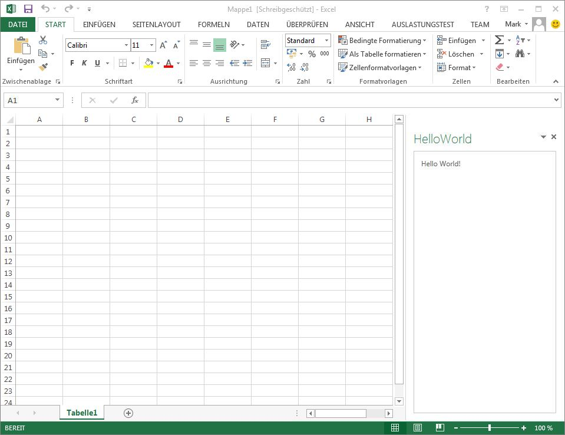
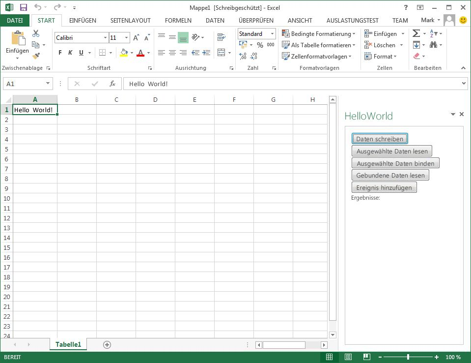
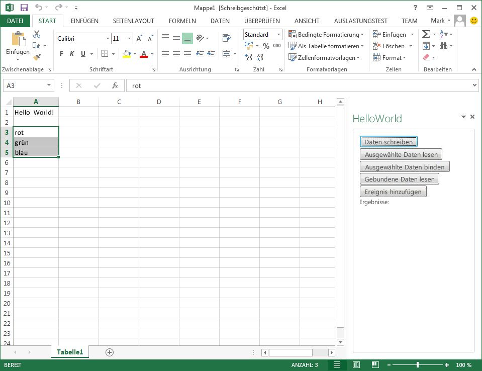
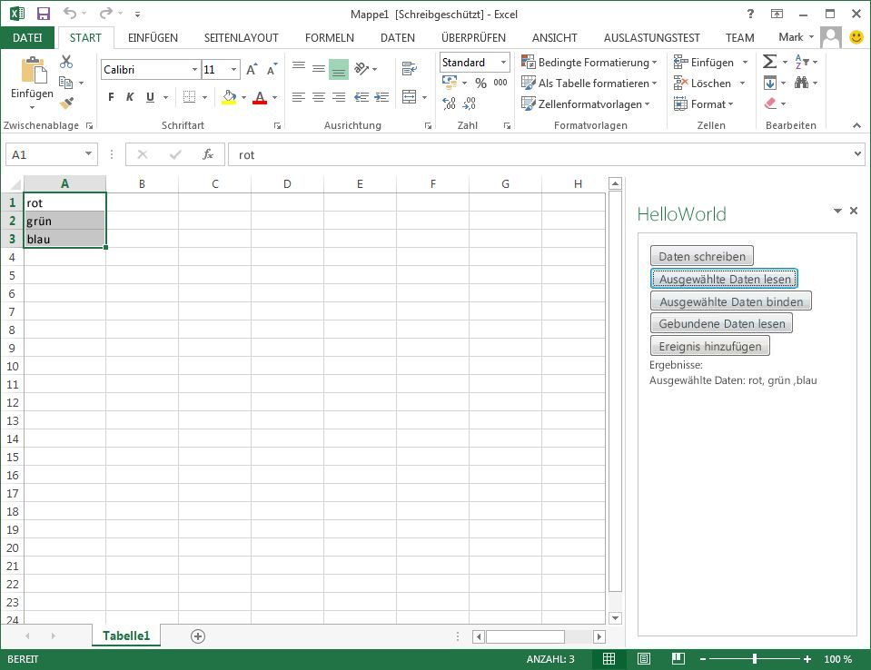
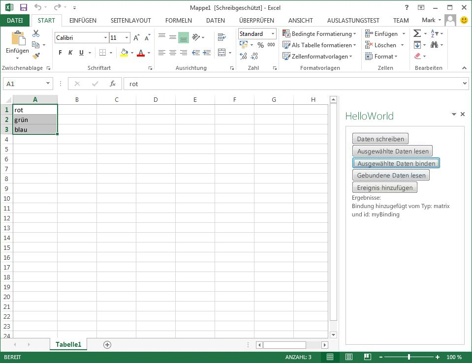
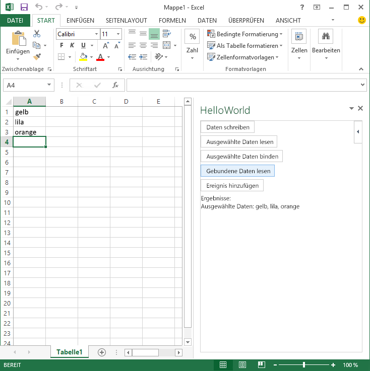
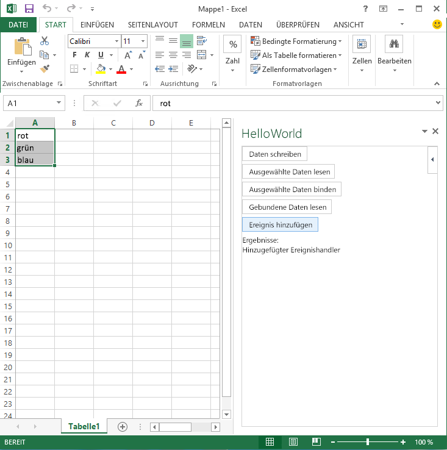
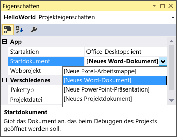
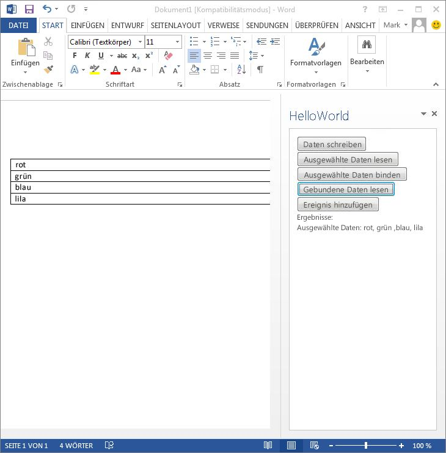
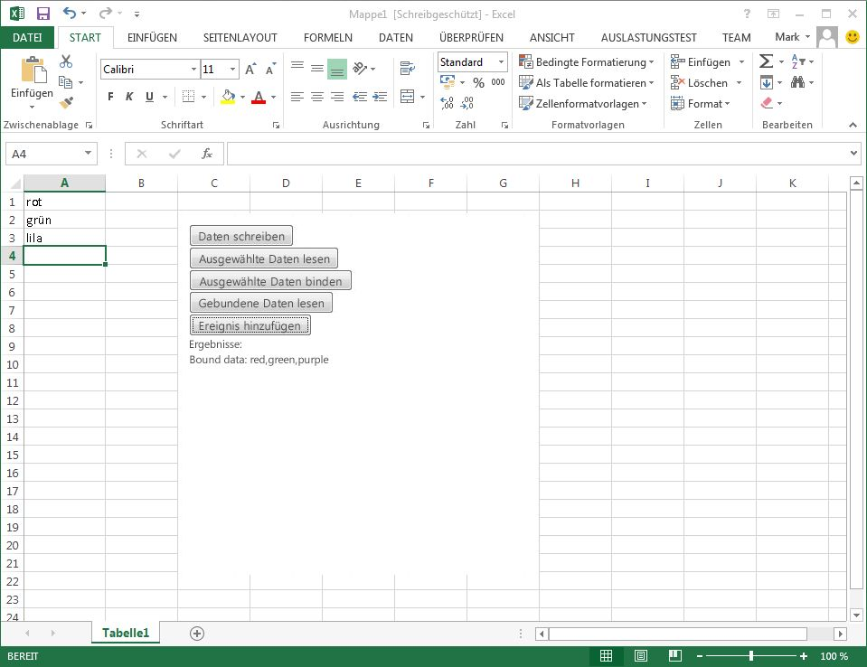

# Erstellen eines Aufgabenbereich- oder Inhalts-Add-Ins mit Visual Studio
In diesem Artikel wird beschrieben, wie Sie mithilfe von Visual Studio ein „Hello World"-Office-Add-In erstellen und es anschließend erweitern, um das Dokument zu lesen, zu binden und in es zu schreiben.

 _**Gilt für:** Access apps for SharePoint | apps for Office | Excel | Office Add-ins | PowerPoint | Project | Word_

Im Rahmen der Schritte in diesem Artikel wird das Erstellen und Ausführen eines einfachen Aufgabenbereich-Add-Ins  _Hello World_ in Excel beschrieben. Anschließend wird das Add-In erweitert, um die folgenden Aufgaben auszuführen:

- Schreiben von Daten in die aktuelle Auswahl in der Arbeitsmappe
    
- Lesen von Daten aus der aktuellen Auswahl in der Arbeitsmappe und Anzeigen in der Benutzeroberfläche des Add-Ins
    
- Erstellen einer Bindung für die aktuelle Auswahl in der Arbeitsmappe
    
- Lesen der Daten in der Bindung und Anzeigen in der Benutzeroberfläche des Add-Ins
    
- Hinzufügen eines Ereignishandlers zum Lesen und Anzeigen von Daten, sobald Daten in der Bindung geändert werden
    
Schließlich werden Sie Änderungen an einigen Projekteinstellungen und am Manifest vornehmen, um folgende Aufgaben auszuführen:

- Ausführen des Aufgabenbereich-Add-Ins in Word
    
- Ausführen des Add-Ins als Inhalts-Add-In in Excel
    

## Voraussetzungen


Installieren Sie die folgenden Komponenten, bevor Sie beginnen:


- [Visual Studio 2015 und die neuesten Microsoft Office Developer Tools ](https://www.visualstudio.com/features/office-tools-vs). 
    
- Excel 2013 oder höher.
    
- Word 2013 oder höher.
    

## Erstellen eines Projekts für das Add-In


Erstellen Sie zunächst ein Office-Add-Ins-Projekt in Visual Studio. 


### So erstellen Sie ein Projekt in Visual Studio


1. Wählen Sie in der Visual Studio-Menüleiste  **Datei**,  **Neu**,  **Projekt**.
    
    Das Dialogfeld  **Neues Projekt** wird geöffnet.
    
2. Erweitern Sie in der Liste der Projekttypen unter  **Visual C#** oder **Visual Basic** die Option **Office/SharePoint**, wählen Sie  **Office-Add-Ins**, und wählen Sie dann  **Office-Add-In**.
    
3. Geben Sie dem Projekt den Namen HelloWorld, und klicken Sie dann auf  **OK**.
    
    Das Dialogfeld  **Add-In für Office erstellen** wird geöffnet. In Visual Studio ist die Option **Aufgabenbereich-Add-In** ausgewählt. Klicken Sie auf die Schaltfläche **Weiter**, lassen Sie die Kontrollkästchen für  **Excel**,  **Word**,  **PowerPoint** und **Projekt** aktiviert, und wählen Sie dann **Fertig stellen** aus.
    
    Visual Studio erstellt das Projekt, und die zugehörigen Dateien werden im  **Projektmappen-Explorer** angezeigt. Die standardmäßige Seite Home.html wird in Visual Studio geöffnet.
    

## Entwickeln des Add-Ins


Zum Gestalten des Erscheinungsbilds des Add-Ins können Sie der Standardseite des Projekts HTML-Code hinzufügen. Zum Gestalten der Funktionalität und der Programmierlogik für Ihr Add-In können Sie JavaScript-Code direkt in der HTML-Seite hinzufügen. In diesem Beispiel fügen Sie den Code jedoch der Standard-JavaScript-Datei (Home.js) hinzu.


### So erstellen Sie das Add-In „Hello World"


1. Löschen Sie die der Datei "Home.html" alle Tags zwischen den öffnenden und schließenden  `<body>`-Tags, und geben Sie dann <div>Hello World!</div> zwischen den öffnenden und schließenden **body**-Tags ein. Der fertige HTML-Code sollte folgendermaßen aussehen:
    
  ```HTML
  <!DOCTYPE html> 
<html> 
   <head> 
      <meta charset="UTF-8" /> 
      <meta http-equiv="X-UA-Compatible" content="IE=Edge" /> 
      <title></title>
 
      <script src="../../Scripts/jquery-1.9.1.js" type="text/javascript"></script> 
      <link href="../../Content/Office.css" rel="stylesheet" type="text/css" /> 
      <script src="https://appsforoffice.microsoft.com/lib/1/hosted/Office.js" type="text/javascript"></script>
 
      <!-- To enable offline debugging using a local reference to Office.js, use: --> 
      <!-- <script src="../../Scripts/Office/MicrosoftAjax.js" type="text/javascript"></script> --> 
      <!-- <script src="../../Scripts/Office/1.1/office.js" type="text/javascript"></script> -->
 
      <link href="../App.css" rel="stylesheet" type="text/css" /> 
      <script src="../App.js" type="text/javascript"></script> 
      <link href="Home.css" rel="stylesheet" type="text/css" /> 
      <script src="Home.js" type="text/javascript"></script> 
   </head>
 
   <body> 
      <div>Hello World!</div> 
   </body>
 
</html>
  ```

2. Für die Bereitstellung auf IIS Express bereitstellen und zum Debuggen in einer lokalen Installation von Excel, bestätigen Sie die Konfiguration der Eigenschaft  **Startaktion**:
    
      1. Wählen Sie im Projektmappen-Explorer das Add-In „HelloWorld".
    
  2. Stellen Sie im Fenster  **Eigenschaften** sicher, dass die Eigenschaft **Startaktion** auf **Office Desktop Client** eingestellt ist.
    
  3. Stellen Sie sicher, dass die Eigenschaft  **Startdokument** auf **[Neue Excel-Arbeitsmappe]** eingestellt ist.
    
     >**Hinweis**  Wenn Sie  **Internet Explorer** oder **Google Chrome** als die Eigenschaft **Startaktion** wählen müssen und dann **[Neue Excel-Arbeitsmappe]** als **Startdokument**-Eigenschaft festlegen, startet Excel Online den Browser, wenn Sie das Add-In ausführen. 
3. Klicken Sie im Menü  **Debuggen** auf **Debuggen starten**, oder drücken Sie die F5-TASTE.
    
     >**Hinweis**  Falls dies das erste Mal ist, dass Sie Debugging in IIS Express (von Visual Studio installiert) gestartet haben, werden Sie aufgefordert, dem von IIS Express verwendete selbtsignierte Localhost-Zertifikat zu vertrauen und es zu installieren. Beantworten Sie beide Eingabeaufforderungen mit  **Ja**, um fortzufahren. 

    Excel öffnet eine leere Arbeitsmappe, und das Add-In wird im Aufgabenbereich angezeigt.
    

    **Abbildung 1. Aufgabenbereich-Add-In „Hello World"**

    

4. Schließen Sie die Arbeitsmappendatei.
    
    Das Debuggen wird beendet, und der Fokus wechselt wieder zu Visual Studio.
    
In den nachfolgenden Verfahren werden wir das Add-In „Hello World" erweitern, um auf Daten in der Arbeitsmappe zuzugreifen.


### So schreiben Sie Daten in die Arbeitsmappe


1. Ersetzen Sie  `<div>Hello World!</div>` innerhalb der `<body>`-Start-Tags und -End-Tags der Seite HelloWorld.html durch folgenden HTML-Code.
    
  ```HTML
  <button id="writeDataBtn"> Write Data </button> 
<button id="readDataBtn"> Read Selected Data </button> 
<button id="bindDataBtn"> Bind Selected Data </button> 
<button id="readBoundDataBtn"> Read Bound Data </button>
<button id="addEventBtn"> Add Event </button>

<span>Results: </span>
<div id="results"></div>
  ```


    Hiermit werden Schaltflächen zum Ausführen von Datenzugriffsaktionen sowie ein  `div`-Element zum Anzeigen der Ergebnisse in der HTML-Seite des Add-Ins hinzugefügt. Im nächsten Schritt rufen wir die  `writeData()`-Funktion auf, um Beispieltext in die aktuelle Auswahl zu schreiben.
    
2. Öffnen Sie die Datei „Home.js", um die Standard-JavaScript-Datei für das Add-In anzuzeigen. Sie finden diese Datei, falls sie noch nicht geöffnet ist, im Projektmappen-Explorer unter  **Add-In**,  **Startseite**. 
    
3. Fügen Sie einen Ereignishandler  `$("#writeDataBtn").click` zum `$(document).ready`-Code hinzu, um zu antworten, wenn ein Benutzer auf die Schaltfläche  **Write Data** klickt. Der Code sollte folgendermaßen aussehen.
    
  ```
  // The initialize function must be run each time a new page is loaded 
Office.initialize = function (reason) { 
   $(document).ready(function () { app.initialize();
 
       
      $("#writeDataBtn").click(function (event) { writeData(); 
      });
 
   }); 
};
  ```

4. Fügen Sie der Datei "Home.js" die folgenden Funktionen hinzu.
    
  ```
  function writeData() { 
    Office.context.document.setSelectedDataAsync("Hello World!", function (asyncResult) { 
        if (asyncResult.status === "failed") { 
            writeToPage('Error: ' + asyncResult.error.message); 
        } 
    }); 
} 

function writeToPage(text) { 
    document.getElementById('results').innerText = text; 
}
  ```


     >**Hinweis**  Löschen oder überschreiben Sie nicht die  `Office.initialize`-Ereignishandlerfunktion (den darin enthaltenen Text können Sie jedoch ersetzen). Der  `Office.initialize`-Ereignishandler muss eingerichtet sein, damit Ihr Add-In richtig zur Laufzeit initialisiert wird.

    Mit dem Code in der  `writeData()`-Funktion wird die [Document.setSelectedDataAsync](http://msdn.microsoft.com/DE-de/library/fp142145.aspx)-Methode aufgerufen, um „Hello World!" in die aktuelle Zelle zu schreiben, wenn Sie auf die Schaltfläche  **Daten schreiben**klicken. Die meisten der in dieser exemplarischen Vorgehensweise verwendeten Methoden sind asynchron, weshalb ihre Namen auf „Async" enden. Außerdem werden Rückruffunktionen wie die anonyme Funktion, die nach „Hello World!" als Argument übergeben wird, verwendet. Weitere Informationen zur Verwendung von „Async"-Methoden finden Sie unter [Asynchrone Programmierung in Office-Add-Ins](../../docs/develop/asynchronous-programming-in-office-add-ins.md).
    
    Bei der Funktion  `writeToPage(text)` handelt es sich um eine Hilfsfunktion zum Zurückschreiben von Text in das Ergebnis- `div`-Element auf der Add-In-HTML-Seite. Die Funktion  `writeToPage(text)` wird auch verwendet, um Daten und Meldungen in den Codebeispielen in den folgenden Verfahren anzuzeigen.
    
5. Klicken Sie im Menü  **Debuggen** auf **Debuggen starten**, oder drücken Sie die F5-TASTE.
    
6. Wählen Sie die Schaltfläche  **Write Data** aus, um `"Hello World!"` in die aktuelle Zelle zu schreiben. Sie sollten aber die Arbeitsmappe noch nicht schließen bzw. das Debuggen noch nicht beenden.
    
    **Abbildung 2. Schreiben von Text**

    

7. Wechseln Sie wieder zum Code-Editor, und ersetzen Sie  `"Hello World!"` im Aufruf der **setSelectedDataAsync**-Methode wie folgt durch  `[["red"],["green"],["blue"]]`:
    
  ```
  function writeData() { 
    Office.context.document.setSelectedDataAsync([["red"],["green"],["blue"]], function (asyncResult) { 
        if (asyncResult.status === "failed") { 
            writeToPage('Error: ' + asyncResult.error.message); 
        } 
    }); 
}
  ```


    Durch das Schreiben eines Arrays von Arrays wie etwa  `[["red"],["green"],["blue"]]` wird eine alsMatrix bezeichnete Datenstruktur erstellt, wobei in diesem Fall eine einzelne Spalte mit drei Zellen (Zeilen) erstellt wird. Eine Matrix mit zwei Spalten bestehend aus drei Zeilen können Sie wie folgt erstellen:
    
     ` [["red", "rojo"], ["green", "verde"],["blue", "azul"]]`
    
    Eine einzelne Zeile bestehend aus drei Zellen können Sie wie folgt erstellen: 
    
     `[["red","green","blue"]]`
    
8. Drücken Sie STRG+S, um diese Änderung am Code zu speichern.
    
9. Wechseln Sie nun wieder zur Arbeitsmappe, klicken Sie mit der rechten Maustaste in den Add-In-Aufgabenbereich, und klicken Sie auf  **Erneut laden**.
    
    Hiermit wird die HTML-Seite mit dem aktualisierten JavaScript-Code erneut geladen.
    
10. Wählen Sie eine neue Zelle aus, und wählen Sie dann die Schaltfläche  **Write Data** aus.
    
    Hiermit wird das Array bestehend aus  `red`,  `green` und `blue` in eine einzelne Spalte bestehend aus drei Zellen geschrieben.
    

    **Abbildung 3. Schreiben der Matrix**

    

11. Schließen Sie die Arbeitsmappe, um das Debuggen zu beenden.
    

### So lesen Sie Daten aus der Arbeitsmappe


1. Öffnen Sie im  **Projektmappen-Explorer** die Datei "Home.js".
    
2. Fügen Sie einen Ereignishandler  `$("#readDataBtn").click` zum `$(document).ready`-Code hinzu, um zu antworten, wenn ein Benutzer auf die Schaltfläche  **Read Selected Data** klickt. Der Code sollte folgendermaßen aussehen.
    
  ```
  // The initialize function must be run each time a new page is loaded 
Office.initialize = function (reason) { 
    $(document).ready(function () { 
        app.initialize(); 
      
        $("#writeDataBtn").click(function (event) { 
            writeData(); 
        }); 
        $("#readDataBtn").click(function (event) { 
            readData(); 
        }); 
    }); 
};
  ```

3. Geben Sie in der Datei "Home.js" den folgenden Code unterhalb der Funktionen, die Sie im vorherigen Verfahren hinzugefügt haben, ein.
    
  ```
  
function readData() { 
    Office.context.document.getSelectedDataAsync("matrix", function (asyncResult) { 
        if (asyncResult.status === "failed") { 
            writeToPage('Error: ' + asyncResult.error.message); 
        } 
        else{ 
            writeToPage('Selected data: ' + asyncResult.value); 
        } 
    }); 
}
  ```


    Mit der  `readData()`-Funktion wird die [Document.getSelectedDataAsync](http://msdn.microsoft.com/de-de/library/f85ad02c-64f0-4b73-87f6-7f521b3afd69%28Office.1501401%29)-Methode aufgerufen, um die aktuell vom Benutzer ausgewählten Daten mit dem  _coercionType_-Wert "matrix" zu lesen, wobei es sich also um ein 2-D-Array handelt. Für Excel wird damit ein zusammenhängender Bereich aus einer oder mehreren Zellen gelesen.
    
4. Klicken Sie im Menü  **Debuggen** auf **Debuggen starten**, oder drücken Sie die F5-TASTE.
    
5. Wählen Sie die Schaltfläche  **Write Data** aus, lassen Sie die drei Zellen `red`,  `green` und `blue` ausgewählt, und wählen Sie dann die Schaltfläche **Read Selected Data** aus.
    
    Hiermit werden die Daten aus den drei Zellen als Matrixdatenstruktur gelesen, und anschließend werden diese Werte in die Add-In-Seite geschrieben.
    

    **Abbildung 4. Lesen der Matrix**

    

6. Schließen Sie die Arbeitsmappe, um das Debuggen zu beenden.
    

### So erstellen Sie eine Bindung für ausgewählte Daten und lesen die gebundenen Daten


1. Öffnen Sie im  **Projektmappen-Explorer** die Datei "Home.js".
    
2. Fügen Sie die Ereignishandler  `$("#bindDataBtn").click` und `$("#readBoundDataBtn").click` zum `$(document).ready`-Code hinzu, um zu antworten, wenn ein Benutzer auf die Schaltflächen  **Bind Selected Data** und **Read Bound Data** klickt. Der Code sollte folgendermaßen aussehen.
    
  ```
  // The initialize function must be run each time a new page is loaded 
Office.initialize = function (reason) { 
    $(document).ready(function () { 
        app.initialize(); 
   
        $("#writeDataBtn").click(function (event) { 
            writeData(); 
        }); 
        $("#readDataBtn").click(function (event) { 
            readData(); 
        }); 
        $("#bindDataBtn").click(function (event) { 
            bindData(); 
        }); 
        $("#readBoundDataBtn").click(function (event) { 
            readBoundData(); 
        }); 
    }); 
};
  ```

3. Geben Sie in der Datei "Home.js" den folgenden Code unterhalb der Funktion, die Sie im vorherigen Verfahren hinzugefügt haben, ein. 
    
  ```
  function bindData() { 
    Office.context.document.bindings.addFromSelectionAsync("matrix", { id: 'myBinding' }, function (asyncResult) { 
        if (asyncResult.status === "failed") { 
            writeToPage('Error: ' + asyncResult.error.message); 
        } 
        else { 
            writeToPage('Added binding with type: ' + asyncResult.value.type + ' and id: ' + asyncResult.value.id); 
        } 
    }); 
}
  ```


    Mit der  `bindData()`-Funktion wird die [Bindings.addFromSelectionAsync](http://msdn.microsoft.com/de-de/library/edc99214-e63e-43f2-9392-97ead42fc155%28Office.1501401%29)-Methode aufgerufen, um eine Matrixbindung mit dem [id](http://msdn.microsoft.com/de-de/library/94a0814d-70a0-4258-a837-2be04f68f068%28Office.1501401%29)-Wert  `myBinding` zu erstellen, der den vom Benutzer ausgewählten Zellen zugeordnet ist. Für _bindingType_ können Sie `"text"`angeben, um eine Bindung mit einer einzelnen Zelle in Excel zu erstellen, oder um Zeichen (eine Zeichenfolge) in einem Word-Dokument auszuführen. Weitere Informationen zu Bindungen finden Sie unter [Einrichten einer Bindung an Regionen in einem Dokument oder Arbeitsblatt](../../docs/develop/bind-to-regions-in-a-document-or-spreadsheet.md).
    
4. Fügen Sie der Datei "Home.js" unterhalb der  `bindData ()`-Funktion den folgenden Code hinzu. 
    
  ```
  function readBoundData() { 
    Office.select("bindings#myBinding").getDataAsync({ coercionType: "matrix" }, function (asyncResult) { 
        if (asyncResult.status === "failed") { 
            writeToPage('Error: ' + asyncResult.error.message); 
        } 
        else { 
            writeToPage('Selected data: ' + asyncResult.value); 
        } 
    }); 
}
  ```


    Mit der  `readBoundData()`-Funktion wird die [Office.select](http://msdn.microsoft.com/de-de/library/23aeb136-da1f-4127-a798-99dc27bc4dae%28Office.1501401%29)-Methode aufgerufen, um die von der  `bindData()`-Funktion erstellte Bindung abzurufen, die für  **id** den Wert `myBinding`aufweist. (Alternativ können Sie mithilfe der [Bindings.getByIdAsync](http://msdn.microsoft.com/de-de/library/2727c891-bc05-465c-9324-113fbfeb3fbb%28Office.1501401%29)-Methode anhand des Werts für  **id** auf eine Bindung zugreifen.) Von dieser Funktion wird dann die [Binding.getDataAsync](http://msdn.microsoft.com/de-de/library/5372ffd8-579d-4fcb-9e5b-e9a2128f3201%28Office.1501401%29)-Methode aufgerufen, um die Daten aus der Bindung zu lesen. Da es sich bei der Bindung um eine Matrixbindung handelt, müssen Sie für  _coersionType_ den Wert `"matrix"` angeben, damit der Aufruf erfolgreich ausgeführt wird.
    
5. Klicken Sie im Menü  **Debuggen** auf **Debuggen starten**, oder drücken Sie die F5-TASTE.
    
6. Wählen Sie die Schaltfläche  **Write Data** aus, lassen Sie die drei Zellen `red`,  `green` und `blue` ausgewählt, und wählen Sie dann die Schaltfläche **Bind Selected Data** aus.
    
    Hiermit wird eine Matrixbindung erstellt, die den drei ausgewählten Zellen zugeordnet ist, für die für  **id** der Wert  `myBinding` vorhanden ist.
    

    **Abbildung 5. Erstellen einer Bindung**

    

7. Heben Sie die Auswahl der drei Zellen aus, und wählen Sie dann die Schaltfläche  **Read Bound Data** aus.
    
    Hiermit werden die Daten aus der im vorherigen Verfahren erstellten Bindung gelesen, und anschließend werden diese Werte in die Add-In-Seite geschrieben. Falls Sie die Werte nicht geändert haben, wird  `red`,  `green` und `blue` im Add-In angezeigt.
    
8. Ändern Sie einen oder mehrere Werte in den drei Zellen, drücken Sie nach jeder Änderung die EINGABETASTE, und wählen Sie dann erneut die Schaltfläche  **Read Bound Data** aus.
    
    Hiermit werden die geänderten Daten gelesen und im Add-In angezeigt.
    

    **Abbildung 7. Lesen aus der Bindung**

    

9. Schließen Sie die Arbeitsmappe, um das Debuggen zu beenden.
    
Nun wollen wir einen Ereignishandlers hinzufügen, mit dem die Daten in der Bindung gelesen und angezeigt werden, sobald sie geändert werden. 


### So fügen Sie einen Ereignishandler hinzu


1. Fügen Sie einen Ereignishandler  `$("#addEventBtn").click` zum `$(document).ready`-Code hinzu, um zu antworten, wenn ein Benutzer auf die Schaltfläche  **Add Event** klickt. Der Code sollte folgendermaßen aussehen.
    
  ```
  // The initialize function must be run each time a new page is loaded 
Office.initialize = function (reason) { 
    $(document).ready(function () { 
        app.initialize(); 
     
        $("#writeDataBtn").click(function (event) { 
            writeData(); 
        }); 
        $("#readDataBtn").click(function (event) { 
            readData(); 
        }); 
        $("#bindDataBtn").click(function (event) { 
            bindData(); 
        }); 
        $("#readBoundDataBtn").click(function (event) { 
            readBoundData(); 
        }); 
        $("#addEventBtn").click(function (event) { 
            addEvent(); 
        }); 
    }); 
};
  ```

2. Geben Sie in der Datei "Home.js" den folgenden Code unterhalb der Funktionen, die Sie im vorherigen Verfahren hinzugefügt haben, ein.
    
  ```
  
function addEvent() { 
    Office.select("bindings#myBinding").addHandlerAsync("bindingDataChanged", myHandler, function (asyncResult) { 
        if (asyncResult.status === "failed") { 
            writeToPage('Error: ' + asyncResult.error.message); 
        } 
        else { 
            writeToPage('Added event handler'); 
        } 
    }); 
}
 
function myHandler(eventArgs) { 
    eventArgs.binding.getDataAsync({ coerciontype: "matrix" }, function (asyncResult) { 
        if (asyncResult.status === "failed") { 
            writeToPage('Error: ' + asyncResult.error.message); 
        } 
        else { 
            writeToPage('Bound data: ' + asyncResult.value); 
        } 
    }); 
}
  ```


    Mit der  `addEvent()`-Funktion wird die  **Office.select**-Methode aufgerufen, um das  `myBinding`-Bindungsobjekt abzurufen. Anschließend wird die [Binding.addHandlerAsync](http://msdn.microsoft.com/de-de/library/b9c2f4ea-726c-4b48-a3fb-89beda337a17%28Office.1501401%29)-Methode aufgerufen, um einen Ereignishandler für das [Binding.bindingDataChanged](http://msdn.microsoft.com/de-de/library/7b9ed4bf-3ce5-44eb-8548-2b081afd868d%28Office.1501401%29)-Ereignis hinzuzufügen. Die  `myHandler`-Funktion verwendet die [binding](http://msdn.microsoft.com/de-de/library/3f5adb74-0da6-46c6-a95e-0890bd935379%28Office.15%29.aspx)-Eigenschaft des [BindingDataChangedEventArgs](http://msdn.microsoft.com/de-de/library/d08e5556-20a6-469a-9c51-b0b95c8213ac%28Office.1501401%29)-Objektsfür den Zugriff auf die Bindung, von der das Ereignis ausgelöst wurde. Anschließend wird die  **Binding.getDataAsync**-Methode aufgerufen, um die Daten zu lesen und anzuzeigen, wenn das Ereignis auftritt.
    
3. Wählen Sie im Menü  **Debuggen** die Option **Debuggen starten**, oder drücken Sie die F5-Taste.
    
4. Wählen Sie die Schaltfläche  **Write Data** aus, lassen Sie die drei Zellen `red`,  `green` und `blue` ausgewählt, und wählen Sie dann die Schaltfläche **Bind Selected Data** aus.
    
5. Wählen Sie die Schaltfläche  **Add Event** aus.
    
    Hiermit wird die Bindung mit dem  **id**-Wert  `myBinding` abgerufen, und anschließend wird die `myHandler`-Funktion als Handler für das  **DataChanged**-Ereignis hinzugefügt.
    

    **Abbildung 7. Behandeln des DataChanged-Ereignisses**

    

6. Ändern Sie einen oder mehrere Werte in den drei gebundenen Zellen, und drücken Sie nach jeder Änderung die EINGABETASTE.
    
    Hiermit werden die geänderten Daten gelesen und im Add-In-Aufgabenbereich angezeigt.
    
7. Schließen Sie Excel, um den Debuggingvorgang zu beenden.
    
Im nächsten Abschnitt werden wir das Add-In-Projekt ändern, sodass Sie es in Word ausführen und testen können.


## Ändern des Add-Ins zum Ausführen in Word


Führen Sie die folgenden Schritte aus, um dieses Add-In-Projekt so zu ändern, dass es in Word 2013 ausgeführt und getestet wird:


- Ändern Sie die  **Startaktion**-Eigenschaft des Projekts, um Word beim Debuggen zu starten.
    
- Ausführen und Debuggen in Word.
    

### So ändern Sie die Startdokument-Eigenschaft in der Debugging-Eigenschaftenseite des Projekts


1. Wählen Sie imProjektmappen-Explorer den Projektnamen aus (HelloWorld). 
    
    Die Eigenschaftenseite  **Projekteigenschaften** für das Projekt wird im Bereich unterhalb des **Projektmappen-Explorers** angezeigt.
    
2. Wählen Sie unter  **Add-In** in der Liste **Startdokument** die Option **[Neues Word-Dokument]** aus.
    
    Der  **Startaktion**-Eigenschaft ist bereits auf  **Office Desktop Client** festgelegt, sodass nur noch das Zieldokument geändert werden muss.
    

    **Abbildung 8: Festlegen des Startdokuments**

    


### So debuggen Sie das Add-In in Word


1. Klicken Sie in der Menüleiste auf  **Debuggen** und dann auf **Debuggen starten**.
    
    Word 2013 wird mit dem Add-In  **HelloWorld** im Aufgabenbereich geöffnet.
    
2. Wählen Sie die Schaltflächen  **Write Data**,  **Read Selected Data**,  **Bind Selected Data**,  **Read Bound Data** und **Add Event** aus, um dieselben Aktionen wie beim Arbeiten in Excel auszuführen.
    
     >**Hinweis**  In Word wird der Ereignishandler zum Anzeigen der gebundenen Daten erst ausgeführt, wenn Sie den Cursor aus der Tabelle, die von der Schaltfläche  **Write Data** eingefügt wurde, bewegen.

    **Abbildung 9. Debuggen in Word**

    


## Ändern des Add-Ins zum Ausführen als Inhalts-Add-In


Führen Sie die folgenden Schritte aus, um dieses Add-In-Projekt so zu ändern, dass es in Excel als Inhalts-Add-In ausgeführt wird:


- Ändern Sie die Manifestdatei, um das  **xsi:type**-Attribut im [OfficeApp](http://msdn.microsoft.com/de-de/library/68f1cada-66f8-4341-45f5-14e0634c24fb%28Office.1501401%29)-Element auf  `"ContentApp"` festzulegen.
    
- Ändern Sie die Manifestdatei, um Werte für die [RequestedWidth](http://msdn.microsoft.com/de-de/library/29032529-6661-fb99-1ff3-c02cc474017f)- und [RequestedHeight](http://msdn.microsoft.com/de-de/library/f573269b-7615-af82-2e0d-7e5661b66a20)-Elemente festzulegen.
    
- Ändern Sie die Manifestdatei, um die Elemente  `"Presentation"`,  `"Project"` und `"Document"` **Host** aus dem **Hosts**-Element zu entfernen.
    
- Ändern Sie die  **Startdokument**-Eigenschaft des Projekts, um es in Excel zu starten.
    

### So ändern Sie die Manifestdatei


1. Öffnen Sie imProjektmappen-Explorer die Datei  `HelloWorld.xml`. 
    
2. Ändern Sie im  `OfficeApp`-Start-Tag den Wert des  `xsi:type`-Attributs in  `"ContentApp"`.
    
  ```XML
  <OfficeApp xmlns="http://schemas.microsoft.com/office/appforoffice/1.1" 
          xmlns:xsi="http://www.w3.org/2001/XMLSchema-instance" 
          xsi:type="ContentApp">
  ```


    Mit dem Attribut  **xsi:type** wird der Office-Add-In-Typ angegeben. Er bestimmt, wie das Add-In ausgeführt wird, wenn es vom Benutzer in ein Dokument oder eine Arbeitsmappe eingefügt wird. Mit dem vorherigen Wert, `"TaskPaneApp"`, wird das Add-In in einem Aufgabenbereich ausgeführt. Wenn Sie  **xsi:type** in `"ContentApp"` ändern, wird das Add-In zusammen mit dem Arbeitsmappeninhalt als Inhalts-Add-In ausgeführt.
    
     >**Hinweis**  In dieser Office-Version können Inhalts-Add-Ins nur in [Clientanwendungen ausgeführt werden, die Inhalts-Add-Ins unterstützen](privacy-and-security.md#StartBuildingApps_SupportedApplications). Wenn Sie im Manifest  **xsi:type** in `"ContentApp"` ändern, wird das Add-In nur in Access Web Apps, Excel oder PowerPoint ausgeführt.
3. Fügen Sie im Manifest die folgenden  **RequestedWidth**- und  **RequestedHeight**-Elemente in den  `<DefaultSettings>`-Tags hinzu.
    
  ```XML
  <DefaultSettings> 
    <SourceLocation DefaultValue="~remoteAppUrl/App/Home/Home.html" /> 
    <RequestedWidth>200</RequestedWidth> 
    <RequestedHeight>200</RequestedHeight> 
</DefaultSettings>
  ```

4. Entfernen Sie die  **Host**-Elemente  `"Presentation"`,  `"Project"` und `"Document"` aus dem **Hosts**-Element, sodass nur das  **Host**-Element " `"Workbook"`" übrig bleibt.
    
  ```XML
  <Hosts> 
    <Host Name="Workbook" /> 
</Hosts>
  ```

5. Speichern Sie die Änderungen an der Datei HelloWorld.xml.
    

### So ändern Sie die Startdokument-Eigenschaft auf der Eigenschaftenseite des Projekts


1. Wählen Sie imProjektmappen-Explorer den Projektnamen aus (HelloWorld). 
    
    Im Bereich  **Eigenschaften** (unterhalb des Bereichs **Projektmappen-Explorer**) wird die Eigenschaftenseite für das Projekt angezeigt.
    
2. Ändern Sie unter  **Add-In** die Option **Startdokument** in **[Neue Excel-Arbeitsmappe]**.
    

### So debuggen Sie das Add-In in Excel


1. Klicken Sie in der Menüleiste auf  **Debuggen** und dann auf **Debuggen starten**.
    
    Excel 2013 wird mit dem Add-In  **HelloWorld** geöffnet, das in der Arbeitsmappe als Inhalts-Add-In ausgeführt wird.
    
2. Wählen Sie die Schaltflächen  **Write Data**,  **Read Selected Data**,  **Bind Selected Data**,  **Read Bound Data** und **Add Event** aus, um dieselben Aktionen wie zuvor auszuführen.
    
    **Abbildung 10. Debuggen als Inhalts-Add-In**

    


## Nächste Schritte


Weitere Informationen zum Entwickeln von Office-Add-Ins **REMOVE_ME** finden Sie in den folgenden Abschnitten der Dokumentation:


- [Designrichtlinien für Office-Add-Ins](../add-in-design.md)
    
- [Entwicklungslebenszyklus von Office-Add-Ins](../../docs/design/add-in-development-lifecycle.md)
    
- [Veröffentlichen Ihres Office-Add-ins](../publish/publish.md)
    
- [Verpacken des Add-Ins mit Napa oder Visual Studio für die Veröffentlichung](../publish/package-your-add-in-using-napa-or-visual-studio.md)
    

 >**Tipp**  Informationen zum Bereitstellen und Veröffentlichen eines Add-Ins unter Visual Studio finden Sie unter [Verpacken des Add-Ins mit Napa oder Visual Studio für die Veröffentlichung](../publish/package-your-add-in-using-napa-or-visual-studio.md). Um ein Add-In ohne Visual Studio zu veröffentlichen, können Sie die HTML-Seite und die JS-Dateien Ihrem Add-In auf einem Webserver bereitstellen und anschließend die Manifestdatei Ihres Add-Ins in einen [Netzwerkfreigabekatalog](../publish/create-a-network-shared-folder-catalog-for-task-pane-and-content-add-ins.md) oder einen [Add-In-Katalog in SharePoint](../publish/publish-task-pane-and-content-add-ins-to-an-add-in-catalog.md) hochladen. Bevor Sie die Manifestdatei hochladen, müssen Sie jedoch das `~remoteAppUrl`-Token im  `DefaultValue`-Attribut des  `SourceLocation`-Tags ersetzen, um die vollständige URL der HTML-Standardseite Ihres Add-Ins auf dem Webserver anzugeben, auf dem sie gehostet wird.


## Weitere Ressourcen


- [Aufgabenbereich- und Inhalts-Add-Ins für Office 2013](task-pane-and-content-add-ins.md)
    
- [Grundlegendes zur JavaScript-API für Office](../develop/understanding-the-javascript-api-for-office.md)
    
- [XML-Manifest für Office-Add-Ins](../../docs/overview/add-in-manifests.md)
    
