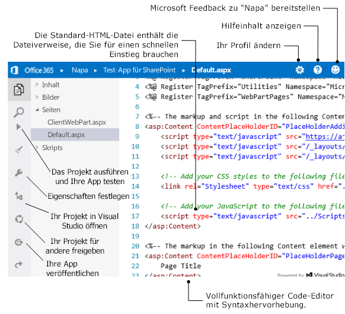

# Erstellen von Office-Add-Ins mit Napa Office 365-Entwicklungstools
Verwenden Sie Napa Office 365-Entwicklungstools zum Erstellen von Office-Add-Ins direkt aus einem Browserfenster.

 _**Gilt für:** apps for Office | Office 365 | Office Add-ins_

## Einführung in Napa

Napa ist eine tolle Möglichkeit, in das Erstellen von Office-Add-Ins direkt in einem Browserfenster einzusteigen. Sie müssen keine weiteren Tools wie Visual Studio installieren. Sie benötigen lediglich einen unterstützten Browser und ein paar weitere Dinge:

- Ein [Microsoft-Konto](http://www.microsoft.com/de-de/account/default.aspx)
    
- Die URL für die [Napa Office 365-Entwicklungstools](https://www.napacloudapp.com/)-Web-App
    
Wenn Sie die leistungsstarken Funktionen in Visual Studio nutzen möchten, können Sie Ihr Projekt mit Napa problemlos herunterladen und Ihr Add-in weiterentwickeln.

## Erstellen von Verwalten von Projekten

Bei Napa erhalten Sie eine Seite, auf der Sie Ihre Projekte verwalten. Verwenden Sie die Seite zum Erstellen eines Mail-Add-In-, Inhalts-Add-In- oder Aufgabenbereich-Add-In-Projekts oder zum Umbenennen und Löschen von Projekten. Sie können alle Projekte auch in Visual Studio öffnen, wenn Sie Features wie das erweiterte Debuggen verwenden oder die Möglichkeit haben möchten, ein Webprojekt als Teil Ihres Office-Add-Ins zu verwenden. Sie wählen einen Filter aus, um zuletzt geänderte Projekte oder alle Projekte anzuzeigen. Klicken Sie auf eine Projektkachel, um ein vorhandenes Projekt zu öffnen. 

**Seite „Projekte"**

## Entwickeln von Add-ins

Wenn Sie ein Projekt öffnen, wird eine Standard-HTML-Datei in einem Code-Editor angezeigt. Diese Datei enthält alle Dateiverweise, die Sie für den Einstieg benötigen. Von dort aus können Sie die Produktivitätsfeatures des Editors, wie z.B. Syntaxhervorhebung und Codevervollständigung verwenden, um Code zu schreiben. Viele der Funktionen verfügen über Tastenkombinationen. Um eine Liste der Tastenkombinationen anzuzeigen wird, drücken Sie gleichzeitig STRG und die „."-Taste.

Projektdateien werden auf der Seite des Editors von oben nach unten angezeigt. Verwenden Sie die Kontextmenüs von Dateien und Ordnern, um Dateien hinzuzufügen, umzubenennen oder hochzuladen (z. B. HTML, JavaScript oder Style Sheets). Über die Optionen am unteren Rand der Seite können Sie Ihr Projekt ausführen, die Eigenschaften des Add-ins ändern oder das Projekt in Visual Studio öffnen. 

**Code-Editor**

## Freigeben und Veröffentlichen von Add-ins

Um das Add-in während der Entwicklung freizugeben, klicken Sie auf die Schaltfläche  **Projekt freigeben** auf der Seite. Dadurch wird eine Kopie des Add-in-Projekts erstellt, und Sie erhalten einen öffentlichen Link, den Sie an andere Personen weitergeben können, um die Kopie des Add-in-Projekts freizugeben.

Wenn Sie Ihr App-Projekt fertig gestellt haben und es verteilen möchten, veröffentlichen Sie die App. Weitere Informationen finden Sie unter [Verpacken des Add-Ins mit Napa oder Visual Studio für die Veröffentlichung](../publish/package-your-add-in-using-napa-or-visual-studio.md).

## Erste Schritte

Öffnen Sie die Web-App [Napa Office 365-Entwicklungstools](https://www.napacloudapp.com) in Ihrem Browser. app in your browser. Die folgenden Themen unterstützen Sie bei den ersten Schritten: .

- [Erstellen eines Inhalts-Add-Ins für Excel mit Napa Office 365-Entwicklungstools](create-a-content-add-in-with-napa.md)
    
- [Erstellen eines Aufgabenbereich-Add-Ins mit Napa Office 365-Entwicklungstools](create-a-task-pane-add-in-with-napa.md)
    
- [Get started with Outlook add-ins for Office 365](https://dev.outlook.com/MailAppsGettingStarted/GetStarted.aspx)
    

## Erstellen Sie sowohl Office-Add-Ins als auch SharePoint-Add-Ins mit Napa.

Wenn Sie beide Office- und SharePoint-Add-Ins in derselben browserbasierten Entwicklungsumgebung erstellen möchten, finden Sie hier eine alternative Version von Napa. Weitere Informationen finden Sie unter [Registrieren für eine Office 365-Entwicklerwebsite](http://msdn.microsoft.com/library/b22ce52a-ae9e-4831-9b68-c9210af6dc54%28Office.15%29.aspx#o365_signup).

