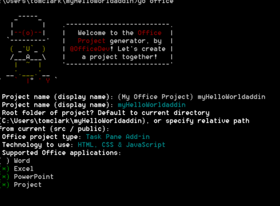
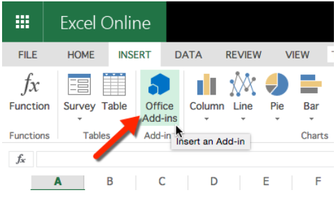
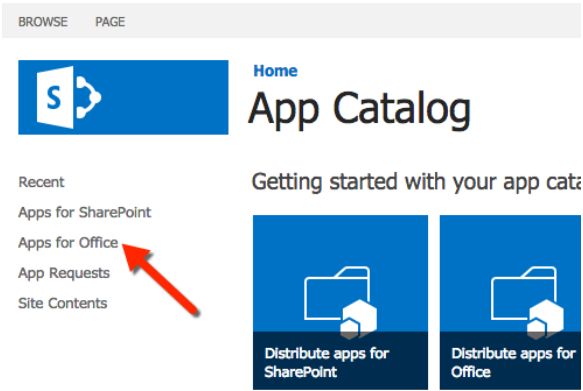
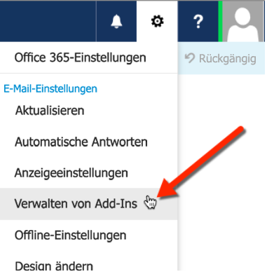

# Erstellen eines Office-Add-Ins mit einem beliebigen Editor
Erstellen eines Office-Add-Ins mit einem Text-Editor und einem Yeoman-Generator. 

 _**Gilt für:** apps for Office_

Ein Office-Add-In ist eine Web-App, die Sie in einer Office-Anwendung hosten. In diesem Thema stellt der Yeoman-Generator das Projektgerüst und die Buildverwaltung bereit, während die  `manifest.xml`-Datei der Office-Anwendung mitteilt, wo sich Ihr Add-In befindet und wie es angezeigt werden soll. Die Office-Anwendung übernimmt das Hosting innerhalb von Office. 

 >**Hinweis**  Die Anweisungen umfassen Schritte, die die Windows-Eingabeaufforderung verwenden, jedoch auch auch für andere Shell-Umgebungen gelten. 


## Erforderliche Komponenten für den Yeoman-Generator

Sie benötigen Folgendes, um den Yeoman Office-Generator auszuführen:


- [Git](https://git-scm.com/downloads)
    
- [npm](https://www.nodejs.org/en/download)
    
- [Bower](http://bower.io/)
    
- [Yeoman Office-Generator](https://www.npmjs.com/package/generator-office)
    
- [Gulp](http://gulpjs.com/)
    
- [TSD](http://definitelytyped.org/tsd/)
    
Nur für Git und npm ist eine separate Installation erforderlich. Die anderen Komponenten können mithilfe von npm installiert werden.

Verwenden Sie bei der Installation von Git die Standardwerte, aber wählen Sie die folgenden Optionen aus: 


- Verwenden von Git über die Windows-Eingabeaufforderung
    
- Verwenden des Standardkonsolenfensters von Windows
    
Installieren Sie npm unter Verwendung der Standardwerte. Öffnen Sie dann eine Eingabeaufforderung als Administrator, und installieren Sie die andere Software global. Gehen Sie hierzu wie folgt vor:


```
npm install –g bower yo generator-office gulp tsd
```


## Erstellen der Standarddateien für Ihr Add-In

Bevor Sie ein Office-Add-In entwickeln, sollten Sie zuerst einen Ordner für Ihr Projekt erstellen und den Generator von dort ausführen. Der Yeoman-Generator wird in dem Verzeichnis ausgeführt, in dem sich das Gerüst des Projekts befinden soll. 

Gehen Sie in der Eingabeaufforderung zu dem übergeordneten Ordner, in dem Sie Ihr Projekt erstellen möchten. Verwenden Sie dann die folgenden Befehle, um einen neuen Ordner mit dem Namen  _myHelloWorldaddin_ zu erstellen, und verschieben Sie das aktuelle Verzeichnis dort hin:


```
mkdir myHelloWorldaddin
cd myHelloWorldaddin
```

Verwenden Sie den Yeoman-Generator zum Erstellen des gewünschten Office-Add-Ins: Outlook, Inhalts- oder Aufgabenbereich. In diesem Abschnitt erstellen wir eine Aufgabenbereich-Add-In. Geben Sie die folgende Anweisung ein, um den Yeoman-Generator auszuführen:


```
yo office
```

Sie werden von dem Generator aufgefordert, Folgendes anzugeben: 


- Name des Add-Ins. Verwenden Sie  _myHelloWorldaddin_.
    
- Stammordner des Projekts. Verwenden Sie den  _aktuellen Ordner_.
    
- Typ des Add-Ins. Verwenden Sie  _Aufgabenbereich_.
    
- Technologie zum Erstellen des Add-Ins. Verwenden Sie  _HTML, CSS und JavaScript_.
    
- Die unterstützte Office-Anwendung. Sie können eine beliebige Anwendung auswählen.
    

**Eingabe für Yeoman- Generator für ein Add-In**

Dadurch werden die Struktur und grundlegenden Dateien für Ihr Add-In erstellt.


## Hosten Ihres Office-Add-Ins

Office-Add-Ins müssen über HTTPS übermittelt werden; die Office-Anwendung lädt keine Web-App als Add-In, wenn es HTTP ist. Um das Add-In lokal zu entwickeln, zu debuggen und zu hosten, benötigen Sie eine Möglichkeit zum lokalen Erstellen und Übermitteln einer Web-App mithilfe von HTTPS. Erstellen Sie eine selbst gehostete HTTPS-Website über gulp (im folgenden Abschnitt beschrieben), oder verwenden Sie Azure. 


### Verwenden einer selbst gehosteten HTTPS-Website

Das gulp-webserver-Plug-In erstellt eine selbst gehostete HTTPS-Website. Der Office-Generator fügt diese der Datei "gulpfile.js" als Aufgabe mit dem Namen "serve-static" für das Projekt hinzu, das generiert wird. Starten Sie den selbst gehosteten Webserver mithilfe der folgenden Anweisungen: 


```
gulp serve-static
```

Dadurch wird ein HTTPS-Server unter "https://localhost:8443" gestartet.


## Entwickeln Ihres Office-Add-Ins

Sie können einen beliebigen Text-Editor zum Entwickeln der Dateien für Ihr benutzerdefiniertes Office-Add-In verwenden.


### JavaScript-Projektunterstützung

Der Office-Generator erstellt die Datei "jsconfig.json", wenn das Projekt erstellt wird. Dies ist die Datei, die Sie zum Ableiten aller JavaScript-Dateien innerhalb Ihres Projekts verwenden können, damit Sie nicht die repetitiven Codeblöcke /// <reference path="../App.js" /> einfügen müssen.

Erfahren Sie mehr über die Datei "jsconfig.json" auf der Seite [JavaScript-Sprache](https://code.visualstudio.com/docs/languages/javascript#_javascript-projects-jsconfigjson) page.


### JavaScript-IntelliSense-Unterstützung

Auch wenn Sie einfaches JavaScript schreiben, können Sie zusätzlich TypeScript-Typdefinitionsdateien verwenden ( `*.d.ts`), um zusätzliche IntelliSense-Unterstützung bereitzustellen. Der Office-Generator fügt eine  `tsd.json`-Datei zu den erstellten Dateien mit Verweisen auf alle Drittanbieterbibliotheken hinzu, die von dem ausgewählten Projekttyp verwendet werden.

Nach dem Erstellen des Projekts mithilfe des Yeoman-Office-Generators müssen Sie nur den folgenden Befehl ausführen, um die Typdefinitionsdateien, auf die verwiesen wird, herunterzuladen:


```
tsd install
```


### Erstellen des Office-Add-Ins „Hello World"


Für unser Beispiel erstellen wir ein "Hello World"-Add-In. Die Benutzeroberfläche des Add-Ins wird von einer HTML-Datei bereitgestellt, die optional JavaScript-Programmierlogik enthalten kann. 


### So erstellen Sie die Dateien für das Add-In „Hello World"


1. Gehen Sie in Ihrem Projektordner zu  _[Projektordner]/app/home_ (in unseren Beispiel ist dies "myHelloWorldaddin/app/home"), öffnen Sie "home.html", und ersetzen Sie den vorhanden Code durch den folgenen Code.
    
  ```HTML
  <!DOCTYPE html>  
<html> 
  <head> 
     <meta charset="UTF-8" /> 
     <meta http-equiv="X-UA-Compatible" content="IE=Edge"/> 
     <link rel="stylesheet" type="text/css" href="program.css" />
   </head> 

  <body> 
     <p>Hello World!</p> 
  </body> 

 </html> 
  ```


    Diese Datei enthält den Mindestsatz an HTML-Tags zum Anzeigen der Benutzeroberfläche eines Add-Ins.
    
2. Öffnen Sie im gleichen Ordner die Datei "home.css", und fügen Sie den folgenden CSS-Code hinzu.
    
  ```
  body 
{ 
     position:relative; 
} 
li :hover 
{ 
     text-decoration: underline; 
     cursor:pointer; 
} 
h1,h3,h4,p,a,li 
{ 
     font-family: "Segoe UI Light","Segoe UI",Tahoma,sans-serif; 
     text-decoration-color:#4ec724; 
} 
  ```


    Mit dieser Datei wird das Stylesheet für das Add-In bereitgestellt.
    
3. Gehen Sie zurück zum übergeordneten Projektordner, und stellen Sie sicher, dass die XML-Datei mit dem Namen "manifest-myHelloWorldaddin.xml" den folgenden XML-Code enthält.
    
     >**Wichtig**  Der Wert im  `<id>`-Tag ist eine GUID, die der Yeoman-Generator erstellt, wenn das Projekt generiert. Ändern Sie die GUID, die der Yeoman-Generator für das Add-In erstellt hat, nicht.Wenn der Host Azure ist, ist der  `SourceLocation`-Wert eine URL wie  _https:// [Name-Ihrer-Web-App].azurewebsites.net/ [Pfad-zum-Add-In]_. Wenn Sie die selbst gehostete Option verwenden, wie in diesem Beispiel ist der Wert _https://localhost:8443/[Pfad-zum-Add-In]_.

  ```XML
  <?xml version="1.0" encoding="utf-8"?> 
<OfficeApp xmlns="http://schemas.microsoft.com/office/appforoffice/1.1" 
           xmlns:xsi="http://www.w3.org/2001/XMLSchema-instance" 
           xsi:type="TaskPaneApp"> 
<Id>[GUID-for-your-add-in]</Id> 
<Version>1.0</Version> 
<ProviderName>Microsoft</ProviderName> 
<DefaultLocale>EN-US</DefaultLocale> 
<DisplayName DefaultValue="myHelloWorldaddin"/> 
<Description DefaultValue="My first app."/> 
 
<Hosts> 
  <Host Name="Document"/> 
  <Host Name="Workbook"/> 
</Hosts>
 
<DefaultSettings> 
  <SourceLocation DefaultValue="https://localhost:8443/app/home/home.html"/> 
</DefaultSettings> 

<Permissions>ReadWriteDocument</Permissions>
 
</OfficeApp> 
  ```


### Lokales Ausführen des Add-Ins


Um das Add-In lokal zu testen, öffnen Sie Ihren Browser, und geben Sie die URL für die Datei "home.HTML" ein. Dies kann entweder auf dem Webserver oder auf der selbst gehosteten HTTPS-Website sein. Wenn Sie die Datei lokal gehostet haben, geben Sie einfach die URL in Ihren Browser ein. In unserem Beispiel ist die URL  `https://localhost:8443/app/home/home.html`. 

Es wird eine Fehlermeldung angezeigt, die besagt, dass ein Problem mit dem Sicherheitszertifikat dieser Website besteht. Wählen Sie aus, dass Sie zu dieser Website fortfahren möchten. Dann wird der Text "Hello World!" angezeigt.


 >**Hinweis**  Das erstellte Add-In enthält ein selbst signiertes Zertifikat und einen Schlüssel. Fügen Sie das Zertifikat und den Schlüssel zu der Liste der vertrauenswürdigen Zertifizierungsstellen hinzu, damit Ihr Browser keine Zertifikatwarnungen ausgibt. Lesen Sie die Informationen in der [gulp-webserver](https://www.npmjs.com/package/gulp-webserver)-Dokumentation, wenn Sie Ihre eigenen selbst signierten Zertifikate verwenden möchten.Lesen Sie die Anweisungen im [KB-Artikel #PH18677](https://support.apple.com/kb/PH18677?locale=en_US) , um zu erfahren, wie Sie ein Zertifikat in OS X Yosemite als vertrauenswürdig einstufen können.


## Installieren des Add-Ins in einer Office-Anwendung

Um das Add-In in einer Office-Anwendung zu installieren, muss das Add-In in der Office-Anwendung installiert oder registriert werden, damit es geladen wird. 


### Installieren von Inhalts- und Aufgabenbereich-Add-Ins

In Abhängigkeit von dem erstellten Add-In-Typ können Sie das Add-In zu einer der Office-Anwendungen hinzufügen. Aufgabenbereich- und Inhalts-Add-Ins können in Word, Excel und PowerPoint installiert werden. Outlook-Add-Ins können in Outlook installiert werden.

Um ein Add-In in einer Office-Anwendung zu installieren, öffnen Sie die Anwendung, wählen Sie die Registerkarte  **Einfügen** aus, und klicken Sie auf Office-Add-Ins-Schaltfläche. Der folgende Screenshot zeigt, wie dies für Excel Online aussieht.


Wenn Sie auf die Office-Add-In-Schaltfläche klicken, werden die folgenden Registerkarten angezeigt.


- Unter  **Meine Apps** werden Add-Ins aus dem Office Store angezeigt, die Ihnen gehören.
    
-  Unter **Meine Organisation** werden Add-Ins angezeigt, die Sie zuvor in Ihr Add-In in den App-Katalog des Office 365-Mandanten (im folgenden Abschnitt beschrieben) hochgeladen haben.
    
-  Unter **Freigegebener Ordner** werden Add-Ins von einer Netzwerkfreigabe (siehe der folgende Abschnitt mit dem Titel **Bereitstellen von Add-Ins auf einer Netzwerkfreigabe**).
    
-  Unter **Store** werden Add-Ins angezeigt, die in den Office Store hochgeladen wurden.
    
Wählen Sie dann das gewünschte Add-In aus, und wählen Sie  **Einfügen**.


#### Bereitstellen von Add-Ins im App-Katalog des Office 365-Mandanten

Alle Office-Add-Ins (einschließlich Outlook-Add-Ins) können von der App-Katalogwebsite Ihres Office 365-Mandanten installiert werden. Melden Sie sich bei Ihrem Office 365-Portal an. Wählen Sie in der linken Navigation unten die Option "Admin/SharePoint" aus.


Wählen Sie im SharePoint Admin Center die Option "Apps" im linken Menü aus, und wählen Sie dann den App-Katalog aus. Wählen Sie auf der App-Katalogseite die Option "Apps für Office" aus, und laden Sie die Manifestdatei hoch.


#### Bereitstellen von Add-Ins in einer Netzwerkfreigabe


1. Erstellen Sie einen Ordner auf einer Netzwerkfreigabe (zum Beispiel "\\MyShare\MyManifests").
    
      - Speichern Sie alle Add-In-Dateien in der Netzwerkfreigabe. Stellen Sie dabei sicher, dass das  `<SourceLocation>`-Element der Manifestdatei auf diesen Speicherort für die Datei "home.html" zeigt.
    
  - Speichern Sie nur die Manifestdatei in dieser Freigabe, und legen Sie dann die HTML-Datei auf einem Webserver ab. Stellen Sie dabei sicher, dass das  `<SourceLocation>`-Element der Manifestdatei auf die URL der Datei "home.html" auf diesem Server zeigt.
    
2. Öffnen Sie ein neues Dokument in Excel oder Word.
    
3. Wählen Sie die Registerkarte  **Datei** aus, und klicken Sie auf **Optionen**.
    
4. Klicken Sie auf  **Sicherheitscenter** und anschließend auf die Schaltfläche **Einstellungen für das Sicherheitscenter**.
    
5. Klicken Sie auf  **Vertrauenswürdige Add-In-Kataloge**.
    
6. Geben Sie im Feld  **Katalog-URL** den Pfad zu der in Schritt 1 erstellten Netzwerkfreigabe ein, und klicken Sie auf **Katalog hinzufügen**.
    
7. Aktivieren Sie das Kontrollkästchen  **In Menü anzeigen**, und klicken Sie auf  **OK**.
    
    Eine Meldung wird angezeigt, dass Ihre Einstellungen angewendet werden, wenn Office das nächste Mal gestartet wird.
    
8. Schließen Sie Excel oder Word, und starten Sie Excel oder Word neu.
    

### Querladen von Outlook-Add-Ins

Eine weitere Option für Outlook-Add-Ins besteht darin, dass sie innerhalb der Outlook Web App installiert werden kann. Navigieren Sie zu Outlook Web App (https://outlook.office365.com), und melden Sie sich an. Gehen Sie folgendermaßen vor, sobald Sie angemeldet sind: 


1. Klicken Sie auf das Zahnradsymbol im oberen rechten Bereich, und wählen Sie "Add-Ins verwalten" aus.
    
    

2. Wählen Sie auf der Seite "Add-Ins verwalten", das Plussymbol aus, und wählen Sie dann "Aus Datei hinzufügen" aus.
    
    

3. Suchen Sie die Manifestdatei für Ihr benutzerdefiniertes Add-In, und installieren Sie sie. Akzeptieren Sie dabei alle Aufforderungen.
    
Wenn Sie fertig sind, wählen Sie eine vorhandene E-Mail aus. Es wird eine horizontale Leiste unter der E-Mail-Kopfzeile angezeigt, die das Add-In enthält. Erstellen Sie als Nächstes eine E-Mail, und klicken Sie dann auf das Menüelement "Add-Ins" oder "App", damit der Aufgabenbereich angezeigt wird. Wählen Sie das Add-In aus; es wird im Aufgabenbereich angezeigt.


## Debuggen des Office-Add-Ins

Es gibt verschiedene Möglichkeiten zum Debuggen Ihres Add-Ins:


- Sie können die Office-Webclients verwenden und die Entwicklertools des Browsers öffnen, um das Add-In so wie jede andere clientseitige JavaScript-Anwendung auch zu debuggen. 
    
- Wenn Sie Desktop-Office auf Windows 10 verwenden, können Sie [Debuggen von Add-Ins mithilfe von F12-Entwicklertools unter Windows 10](../testing/debug-add-ins-using-f12-developer-tools-on-windows-10.md).
    


## Zusätzliche Ressourcen


- [Erstellen und Debuggen von Office-Add-Ins in Visual Studio](../../docs/get-started/create-and-debug-office-add-ins-in-visual-studio.md)
    
