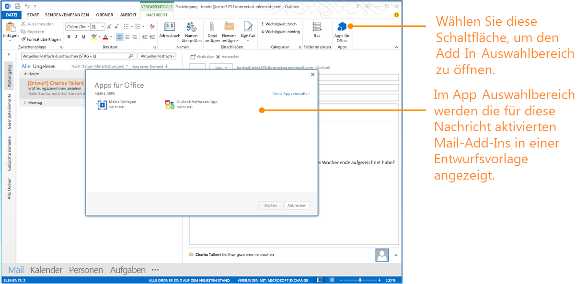


# Erstellen von Outlook-Add-Ins für Formulare zum Verfassen
Erstellen Sie Outlook-Add-Ins für das Verfassen-Szenario, richten Sie das Add-In-Manifest ein und finden Sie verfügbare API-Funktionen für Verfassen-Add-Ins.

 _**Gilt für:** apps for Office | Office Add-ins | Outlook_

## Einrichten von Outlook-Add-Ins für Erstellformulare

Seit Version 1.1 des Schemas für Office-Add-Ins-Manifests und v1.1 von office.js können Sie Add-Ins zum Verfassen erstellen. Dabei handelt es sich um Outlook-Add-Ins, die in Formularen zum Verfassen aktiviert werden. Im Gegensatz zu Lese-Add-Ins (Outlook-Add-Ins, die im Lesemodus aktiviert werden, wenn ein Benutzer eine Nachricht oder einen Termin anzeigt) sind Add-Ins zum Verfassen in den folgenden Benutzerszenarios verfügbar:

- Verfassen einer neuen Nachricht, Besprechungsanfrage oder eines Termins in einem Formular zum Verfassen.
    
- Anzeigen oder Bearbeiten eines vorhandenen Elements eines Termins oder einer Besprechung, den bzw. die der Benutzer organisiert.
    
    (../../images  Wenn der Benutzer die RTM-Version von Outlook 2013 und Exchange 2013 verwendet und ein Element einer von ihm organisierter Besprechung anzeigt, stehen dem Benutzer möglicherweise Lese-Add-ins zur Verfügung. Ab Version Office 2013 SP1 sind in dem gleichen Szenario nur Verfassen-Add-ins aktiviert und verfügbar.
- Verfassen einer Inline-Antwortnachricht oder Antworten auf eine Nachricht in einem separaten Formular zum Verfassen.
    
- Bearbeiten einer Antwort ( **Annehmen**,  **Mit Vorbehalt** oder **Ablehnen**) auf eine Besprechungsanfrage oder ein Besprechungselement.
    
- Vorschlagen einer neuen Uhrzeit für ein Besprechungselement.
    
- Weiterleiten oder Beantworten einer Besprechungsanfrage oder eines Besprechungselements.
    
In jedem dieser Verfassen-Szenarios können Benutzer  **Office-Add-Ins** im Menüband auswählen, um den Add-In-Auswahlbereich zu öffnen, und dann ein Add-In zum Verfassen auswählen und starten. In Abbildung 1 ist der Add-In-Auswahlbereich gezeigt, der aus zwei Add-Ins zum Verfassen besteht, die aktiviert werden, wenn der Benutzer eine Inlineantwort in Outlook verfasst.

**Abbildung 1: Ein Formular zum Verfassen einer Outlook-Nachricht mit Add-In-Befehlen**

Abbildung 2 zeigt den Add-In-Auswahlbereich bestehend aus 2 Add-Ins zum Verfassen, die keine Add-In-Befehle implementieren und aktiviert werden, wenn der Benutzer eine Inlineantwort in Outlook verfasst.

**Abbildung 2: Der Add-In-Auswahlbereich zeigt zwei aktivierte Outlook-Add-Ins für die Nachricht, die gerade verfasst wird**

## Typen von Add-Ins, die im Verfassenmodus verfügbar sind

Add-Ins zum Verfassen werden als [Add-In-Befehle für Outlook](../outlook/add-in-commands-for-outlook.md) implementiert.

## Für Add-ins zum Verfassen verfügbare API-Funktionen

- Informationen zur Aktivierung von Add-ins in Formularen zum Verfassen finden Sie in Tabelle 1 unter [Angeben von Aktivierungsregeln in einem Manifest](../outlook/manifests/activation-rules.md#specify-activation-rules-in-a-manifest).
    
- [Hinzufügen und Entfernen von Anhängen bei einem Element in einem Formular zum Verfassen in Outlook](../outlook/add-and-remove-attachments-to-an-item-in-a-compose-form.md)
    
- [Abrufen und Festlegen von Elementdaten in einem Erstellformular in Outlook](../outlook/get-and-set-item-data-in-a-compose-form.md)
    
- [Abrufen, Festlegen oder Hinzufügen von Empfängern beim Erstellen eines Termins oder einer Nachricht in Outlook](../outlook/get-set-or-add-recipients.md)
    
- [Abrufen oder Festlegen des Betreffs, wenn Sie einen Termin oder eine Nachricht in Outlook verfassen](../outlook/get-or-set-the-subject.md)
    
- [Einfügen von Daten in den Textkörper bei der Erstellung eines Termins oder einer Nachricht in Outlook](../outlook/insert-data-in-the-body.md)
    
- [Abrufen oder Festlegen des Orts, wenn Sie einen Termin in Outlook verfassen](../outlook/get-or-set-the-location-of-an-appointment.md)
    
- [Abrufen oder Festlegen der Uhrzeit, wenn Sie einen Termin in Outlook verfassen](../outlook/get-or-set-the-time-of-an-appointment.md)
    
- [Outlook-Power-Hour_Codebeispiele](https://github.com/OfficeDev/Outlook-Power-Hour-Code-Samples):  `ComposeAppDemo`
    

## Zusätzliche Ressourcen

- [Get Started with Outlook add-ins for Office 365](https://dev.outlook.com/MailAppsGettingStarted/GetStarted.aspx)
    
- [Outlook-Add-Ins](../outlook/outlook-add-ins.md)
    
