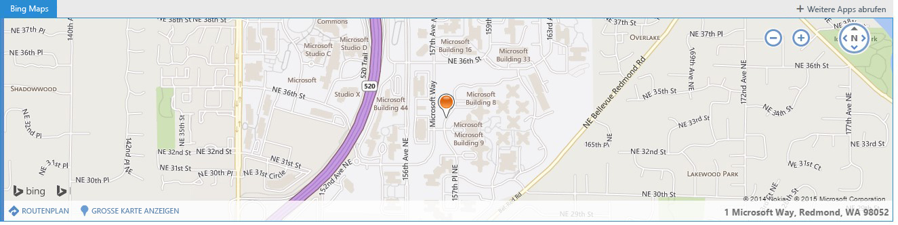

# Kontextbezogene Outlook-Add-Ins
Aktivieren Sie ein Outlook-Add-In über einen Text in einer Nachricht oder einem Kalenderereignis.

 _**Gilt für:** apps for Office | Office Add-ins | Outlook_

Kontext-Add-Ins sind Outlook-Add-Ins, die auf der Grundlage von Text in einer Nachricht oder einem Termin aktiviert werden. Mithilfe von Kontext-Add-Ins kann ein Benutzer Aufgaben im Zusammenhang mit einer Nachricht initiieren, ohne die Nachricht zu verlassen. Dies erhöht die Benutzerfreundlichkeit und bietet den Benutzern mehr Möglichkeiten.

Kontext-Add-Ins unterscheiden sich von Add-Ins, die Anlagen betreffen oder speziell für bestimmte Nachrichtentypen gelten. Es folgen Beispiele für Kontext-Add-Ins:


- Wählen Sie eine Adresse, um eine Karte des Orts zu öffnen.
    
- Wählen Sie eine Zeichenfolge, um eine Besprechungsvorschlag-Add-Ins zu öffnen.
    
- Wählen Sie eine Telefonnummer aus, um sie den Kontakten hinzuzufügen.
    
Derzeit sind Kontext-Add-Ins auf Outlook Web App begrenzt.

## Erstellen eines Kontext-Add-Ins

Für die Erstellung eines Kontext-Add-Ins muss im Add-In-Manifest die Entität oder der reguläre Ausdruck für die Aktivierung des Add-Ins angegeben werden. Bei der Entität kann es sich um eine beliebige Eigenschaft im [Entities](../reference/outlook/simple-types.md%28Office.15%29.md)-Objekt handeln. Somit muss das Add-In-Manifest eine Regel vom Typ  **ItemHasKnownEntity** oder **ItemHasRegularExpressionMatch** enthalten. Das folgende Beispiel zeigt die Angabe einer Entität, die eine Telefonnummer darstellt:


```XML
<Rule xsi:type="ItemHasKnownEntity" EntityType="PhoneNumber"/>

```

Sobald ein Kontext-Add-In einem Konto zugeordnet ist, wird es automatisch gestartet, wenn der Benutzer auf eine hervorgehobene Entität oder einen regulären Ausdruck klickt. Weitere Informationen zu regulären Ausdrücken für Outlook-Add-Ins finden Sie unter [Verwenden regulärer Ausdrücke für Aktivierungsregeln zum Anzeigen eines Outlook-Add-Ins](../outlook/use-regular-expressions-to-show-an-outlook-add-in.md).

Es gibt verschiedene Einschränkungen für Kontext-Add-Ins:


- Ein Kontext-Add-In kann nur in Lese-Add-Ins vorhanden sein (nicht in Verfassen-Add-Ins).
    
- Der Entwickler kann die Farbe der hervorgehobenen Entität nicht festlegen.
    
- Durch eine nicht hervorgehobene Entität wird kein Kontext-Add-In auf einer Karte gestartet.
    
- Die Größe der Karte beträgt 140 bis 450 Pixel in der Höhe (empfohlener Grenzwert 300 Pixel) und 570 Pixel in der Breite.
    
- Der Entwickler kann nicht angeben, ob das Add-In in der Karte oder auf der Add-In-Leiste angezeigt wird.
    

## Starten eines Kontext-Add-Ins

Ein Benutzer startet ein Kontext-Add-In durch Text, entweder eine bekannte Entität oder ein regulärer Ausdruck eines Entwicklers, oder über die Add-In-Leiste. In der Regel identifiziert ein Benutzer ein Kontext-Add-In dadurch, dass die Entität hervorgehoben ist. Das folgende Beispiel zeigt, wie die Hervorhebung in einer Nachricht angezeigt wird. Hier wird die Entität (eine Adresse) blau und mit einer gepunkteten blauen Linie unterstrichen dargestellt. Ein Benutzer startet das Kontext-Add-In, indem er auf die hervorgehobene Entität klickt. 


**Beispiel für Text mit hervorgehobener Entität (einer Adresse)**

Zwar bietet die Hervorhebung den besten Anhaltspunkt für Kontext-Add-Ins, aber es gibt auch Fälle, in denen ein Kontext-Add-In auf der Add-In-Leiste angezeigt wird:


- Wenn die Entität eine URL oder eine E-Mail-Adresse ist
    
- Wenn das Add-In-Manifest eine Regel mit type="ItemHasRegularExpressionMatch" und PropertyName="BodyAsHTML" oder PropertyName="SenderSMTPAddress" enthält
    
- Wenn das Add-In-Manifest eine Aktivierungsregel enthält, die eine OR-RuleCollection verwendet, deren erste Regel type="ItemIs" mit itemType="Appointment" oder "Message" enthält und deren zweite Regel type="ItemHasKnownEntity" oder "ItemHasRegularExpressionMatch" enthält
    
- Wenn sich die Komplexität des E-Mail-Nachrichtentexts auf den E-Mail-Client auswirkt
    
Wenn mehrere Entitäten oder Kontext-Add-Ins in einer Nachricht vorhanden sind, gibt es einige Regeln für die Benutzerinteraktion:


- Wenn mehrere Entitäten vorhanden sind, muss der Benutzer auf eine andere Entität klicken, um das Add-In dafür zu starten.
    
- Wenn eine Entität mehrere Add-Ins aktiviert, werden alle Add-Ins auf separaten Registerkarten angezeigt. Der Benutzer wechselt zwischen den Registerkarten, ähnlich wie auf der Add-In-Leiste, um zwischen Add-Ins zu wechseln. Beispiel: ein Name und eine Adresse, die ein Telefon-Add-In und eine Karte initiieren.
    
- Wenn eine Zeichenfolge mehrere Entitäten enthält, die mehrere Add-Ins aktivieren, wird die gesamte Zeichenfolge hervorgehoben, und beim Klicken auf die Zeichenfolge werden alle für die Zeichenfolge relevanten Add-Ins auf separaten Registerkarten angezeigt. Beispielsweise kann eine Zeichenfolge, die eine vorgeschlagene Besprechung in einem Restaurant beschreibt, das Add-In „Vorgeschlagene Besprechungen" und ein Restaurantbewertungs-Add-In aktivieren.
    

## Anzeige eines Kontext-Add-Ins

Ein aktiviertes Kontext-Add-In wird an zwei verschiedenen Stellen angezeigt:


- In der Karte, einem separaten Fenster nahe der Entität
    
- Auf der Add-In-Leiste, der Linie zwischen dem Absender und dem Textkörper einer Nachricht
    
Die Karte wird normalerweise unter der Entität angezeigt und so weit wie möglich in Bezug auf die Entität zentriert. Wenn nicht genügend Platz unter der Entität vorhanden ist, wird die Karte darüber platziert. Der folgende Screenshot zeigt die hervorgehobene Entität und darunter ein aktiviertes Add-In (Bing Maps) in einer Karte.


**Beispiel für ein auf einer Karte angezeigtes Add-In**

Beachten Sie Folgendes:


- Die Registerkarte „Bing Maps" wird als weißer Text auf blauem Hintergrund angezeigt. Wenn ein neues Add-In ausgewählt wird, ändert sich die Registerkarte in blauen Text auf weißem Hintergrund.
    
- Weitere Add-In-Registerkarten würden ggf. auf einer Registerkarte rechts von „Bing Maps" mit blauem Text auf weißem Hintergrund angezeigt. Beim Klicken auf eine Registerkarte ändert sich diese Registerkarte in weißen Text auf blauem Hintergrund, und das neue Add-In wird geladen.
    
- Beim Klicken auf die Schaltfläche „+ Weitere Add-Ins abrufen" wird der Office Store geöffnet.
    
- Wenn der Add-In-Name für den verfügbaren Platz zu lang ist, wird er durch „..." links neben „+ Weitere Add-Ins abrufen" ersetzt. Beim Klicken darauf wird dem Benutzer eine Dropdownliste mit den Add-Ins angezeigt, die nicht auf die Leiste passen.
    
- Um die Karte zu schließen und das Add-In zu beenden, muss ein Benutzer auf eine beliebige Stelle außerhalb der Karte klicken.
    
Der folgende Screenshot zeigt, wie dasselbe Add-In (in diesem Fall Bing Maps) in der Leiste angezeigt wird, wenn der Text nicht hervorgehoben werden kann (z. B., wenn er in einem Link enthalten war).


**Beispiel für eine Add-In-Leiste und ein Add-In in einem IFrame**

Beachten Sie Folgendes:


- In diesem Screenshot enthält die Add-In-Leiste den Namen des gestarteten Add-Ins und die Schaltfläche „+ Weitere Add-Ins abrufen" über dem IFrame. Wenn weitere Add-Ins vorhanden sind (kontextbezogene oder andere), die über die Add-In-Leiste gestartet werden, werden diese ebenfalls angezeigt.
    
- Das Add-In wird im IFrame angezeigt. Der Entwickler kann die Höhe des IFrame festlegen, die Breite ist jedoch ein fester Wert. Für das Add-In-Leisten-Add-In und für die Karte wird dieselbe Höhe verwendet. Der Entwickler muss nicht zwei verschiedene Höhen angeben.
    

## Anzeige von Kontext-Add-Ins auf verschiedenen Geräten

Auf einem Desktopcomputer wird ein Kontext-Add-In üblicherweise in einer Karte angezeigt, und wenn es mehrere Add-Ins gibt, auf separaten Registerkarten. Auf Tablets wird dasselbe Add-In mit einer zweiten Seite angezeigt, und mehrere Add-Ins werden ggf. auf Registerkarten angezeigt. Auf Telefonen wird das Add-In als immersive Benutzeroberfläche angezeigt. Falls für eine Entität mehrere Add-Ins aktiviert wurden, wird „..." in der rechten oberen Ecke angezeigt, um Benutzern die Navigation zwischen den verschiedenen Add-Ins für die Entität zu ermöglichen.


## Aktuelle Kontext-Add-Ins

Die folgenden Kontext-Add-Ins werden standardmäßig für Benutzer mit Outlook-Add-Ins installiert:


- Bing Maps 
    
- Vorgeschlagene Besprechungen
    
Darüber hinaus ist das Kontext-Add-In [Package Tracker](https://store.office.com/package-tracker-WA104162083.aspx?assetid=WA104162083.aspx) im Office Store erhältlich.


## Zusätzliche Ressourcen


- [Get Started with Outlook add-ins for Office 365](https://dev.outlook.com/MailAppsGettingStarted/GetStarted.aspx)
    
- [Verwenden regulärer Ausdrücke für Aktivierungsregeln zum Anzeigen eines Outlook-Add-Ins](../outlook/use-regular-expressions-to-show-an-outlook-add-in.md)
    
- [Understanding the Office Add-ins XML manifest](https://msdn.microsoft.com/en-us/library/office/fp161044%28v=office.15%29.aspx .aspx)
    
- [Entities-Objekt](https://dev.outlook.com/reference/add-ins/simple-types.mdl.aspx#Entities)
    
