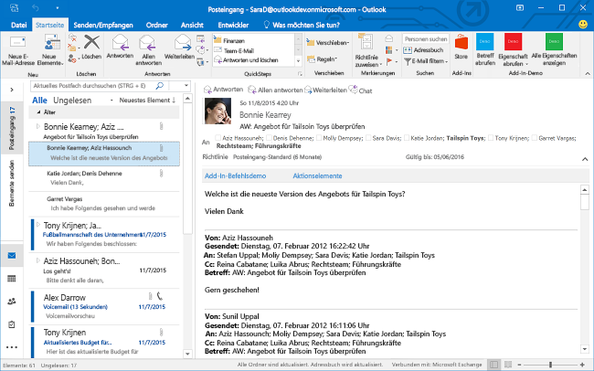
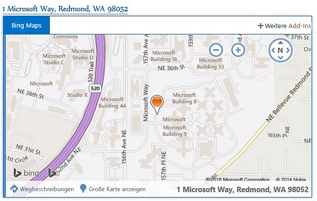
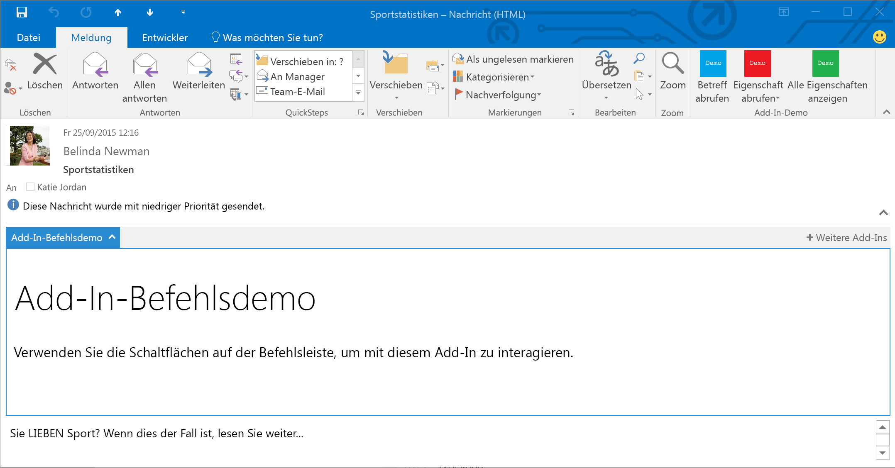

# Outlook-Add-Ins
Erstellen Sie Outlook-Add-Ins im Lese- oder Verfassenmodus.

 _**Gilt für:** apps for Office | Office Add-ins | Outlook_

## Was ist ein Outlook-Add-In?

Outlook-Add-Ins (die bisher als "Apps für Outlook" bezeichnet wurden) sind von Drittnanbieter erstellte Integrationen in Outlook, die die neue auf Webtechnologien basierte Plattform verwenden. Outlook-Add-Ins weisen drei wichtige Aspekte auf:

- Sie weisen die gleiche Add-In- und Geschäftslogik in Desktop-Outlook für Windows und Mac, Web (Office 365 und Outlook.com) und Mobile auf.
    
- Sie bestehen aus einem Manifest, das beschreibt, wie das Add-In in Outlook integriert wird (z. B. über eine Schaltfläche oder einen Aufgabenbereich), sowie JavaScript-/HTML-Code, der die Benutzeroberfläche und Geschäftslogik des Add-Ins bestimmt.
    
- Sie können von Endbenutzern oder Administratoren aus dem Office Store erworben oder quergeladen werden.
    
Outlook-Add-Ins unterscheiden sich von COM- oder VSTO-Add-Ins, die ältere Integrationen für Outlook unter Windows sind. Im Gegensatz zu COM-Add-Ins muss für Outlook-Add-Ins kein Code physisch auf dem Gerät oder im Outlook-Client des Benutzers installiert werden. Für ein Outlook-Add-In liest Outlook das Manifest und nimmt die angegebenen Steuerelemente auf der Benutzeroberfläche auf. Dann wird der JavaScript- und HTML-Code geladen. All dies erfolgt im Kontext eines Browsers in einer Sandbox.

Zu den Outlook-Elementen, die Mail-Add-ins unterstützen, zählen E-Mail-Nachrichten, Besprechungsanfragen, -antworten und -absagen sowie Termine. Jedes Mail-Add-in definiert den Kontext, in dem es verfügbar ist.

## Erweiterungspunkte

Erweiterungspunkte sind die Arten, wie Add-Ins in Outlook integriert werden. Dies kann auf folgende Arten erfolgen:

- Add-Ins können Schaltflächen deklarieren, die auf Befehlsoberflächen für Nachrichten und Termine angezeigt werden. Weitere Informationen finden Sie unter [Add-In-Befehle für Outlook](a806cdfa-4230-4bcb-bb3f-7e3d1c2f26c2.md).
    
    **Ein Add-In mit Befehlsschaltflächen auf der Menüband**

    

- Add-Ins können Links von Übereinstimmungen für reguläre Ausdrücke oder erkannten Entitäten in Nachrichten und Terminen definieren. Weitere Informationen finden Sie unter [Kontextbezogene Outlook-Add-Ins](2cd5d8f1-69b3-4a2a-b31e-81a07a7cdd9f.md).
    
    **Ein kontextbezogenes Add-In für eine hervorgehobene Entität (eine Adresse)**

    

- Add-Ins können in einem horizontalen Bereich oberhalb des Texts der Nachricht oder des Termins angezeigt werden. Dies basiert auf komplexen Regeln, z. B. dem Vorhandensein von Anlagen oder der Exchange-Elementklasse der Nachricht oder des Termins. Weitere Informationen finden Sie unter [Benutzerdefinierter Bereich Outlook-Add-Ins](9e7c5f45-f0ab-4d22-abfd-65f154f7d6e8.md).
    
    **Ein Add-In mit einem benutzerdefinierten Bereich im Lesemodus**

    

## Postfachelemente, die für Add-Ins zur Verfügung stehen

Outlook-Add-Ins stehen während des Verfassens oder Lesens in Nachrichten oder Terminen zur Verfügung jedoch nicht für andere Elementtypen. Add-Ins werden von Outlook nicht aktiviert, wenn das aktuelle Nachrichtenelement (in einem Lese- oder Entwurfsformular) folgende Bedingungen erfüllt:

- Durch die Verwaltung von Informationsrechten (Information Rights Management, IRM) geschützt, im S/MIME- oder einem auf andere Weise zum Schutz verschlüsselten Format. Eine digital signierte Nachricht stellt ein Beispiel dar, da die digitale Signatur auf einem dieser Mechanismen beruht.
    
- Im Ordner "Junk-E-Mail" enthalten.
    
- Übermittlungsbericht oder -benachrichtigung mit der Nachrichtenklasse "IPM.Report.*", darunter Übermittlungs- und Unzustellbarkeitsberichte sowie Benachrichtigungen über "Gelesen", "Ungelesen" und "Verzögerung".
    
- MSG-Datei, bei der es sich um einen Anhang an eine andere Nachricht handelt.
    
- MSG-Datei, die vom Dateisystem geöffnet wurde.
    
Im Allgemeinen kann Outlook Add-Ins in Leseformularen für Elemente im Ordner "Gesendete Elemente" aktivieren, abgesehen von Add-Ins, die basierend auf Zeichenfolgenübereinstimmungen von bekannten Entitäten aktiviert werden. Weitere Informationen dazu finden Sie unter [Unterstützung für bekannte Entitäten](../outlook/match-strings-in-an-item-as-well-known-entities.md).

## Unterstützte Hosts

Outlook-Add-Ins werden in Outlook 2013 oder höher, Outlook 2016 für Mac, Outlook Web App für Exchange 2013 lokal, Outlook Web App in Office 365 und Outlook.com unterstützt. Nicht alle der neuesten Features werden gleichzeitig in allen Clients unterstützt. In welchen Hosts sie unterstützt werden, finden Sie in den jeweiligen Themen und API-Referenzen.

## Erste Schritte zum Erstellen von Outlook-Add-Ins

Weitere Informationen zu den ersten Schritten beim Erstellen von Outlook-Add-Ins finden Sie unter [Get Started with Outlook add-ins for Office 365](https://dev.outlook.com/MailAppsGettingStarted/GetStarted.aspx).

## Zusätzliche Ressourcen

[Übersicht über Architektur und Features von Outlook-Add-Ins](2cd5641b-492b-4431-8388-7fc589163e9c.md)

[Bewährte Methoden für die Entwicklung von Office-Add-Ins](013e1486-4482-42c1-bcda-edf8de06e771.md)

[Designrichtlinien für Office-Add-Ins](d5b2ab2e-dfc8-47c8-919c-e9c23358d70c.md)

[Lizenzieren von Office- und SharePoint-Add-Ins](http://msdn.microsoft.com/library/3e0e8ff6-66d6-44ff-b0c2-59108ebd9181%28Office.15%29.aspx)

[Veröffentlichen Ihres Office-Add-ins](7f3ae6a0-06e9-438c-8899-bd9f605e6d9e.md)

[Veröffentlichen von Office- und SharePoint-Add-Ins und Office 365 Web Apps im Office Store](http://msdn.microsoft.com/library/ff075782-1303-4517-91cc-b3d730e9b9ae%28Office.15%29.aspx)

