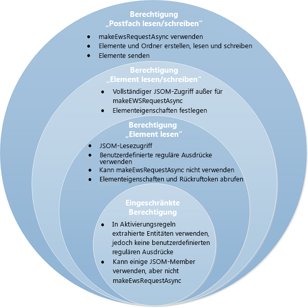

# Datenschutz, Berechtigungen und Sicherheit für Outlook-Add-Ins
Endbenutzer, Entwickler und Administratoren können die mehrstufigen Berechtigungsstufen des Sicherheitsmodells für Outlook-Add-Ins verwenden, um den Datenschutz und die Leistung zu steuern.

 _**Gilt für:** apps for Office | Office Add-ins | Outlook_

In diesem Artikel werden die Berechtigungen beschrieben, die Outlook-Add-Ins anfordern können, und anschließend das Sicherheitsmodell aus den folgenden Blickwinkeln betrachtet:

- Office Store: Add-in-Integrität
    
- Endbenutzer: Überlegungen zu Datenschutz und Leistung
    
- Entwickler: Einschränkungen bei der Auswahl von Berechtigungen und der Ressourcennutzung
    
- Administratoren: Berechtigungen zum Festlegen von Leistungsschwellenwerten
    

## Berechtigungsmodell


Ein mehrstufiges Berechtigungsmodell liefert die Grundlage für Datenschutz und Sicherheit für Benutzer von Outlook-Add-Ins. Ein Mail-Add-in würde die erforderliche Berechtigungsstufe offenlegen und dadurch den möglichen Zugriff und Aktionen identifizieren, die von dem Outlook-Add-In mit den Postfachdaten des Benutzers ausgeführt werden können. 

Die Manifest-Schemaversion 1.1 enthält vier Stufen von Berechtigungen. 


**Tabelle 1: Add-in-Berechtigungsstufen**


|**Berechtigungsstufe**|**Wert in der Manifestdatei des Outlook-Add-Ins**|
|:-----|:-----|
|Eingeschränkt|Restricted|
|Element lesen|ReadItem|
|Element lesen/schreiben|ReadWriteItem|
|Postfach lesen/schreiben|ReadWriteMailbox|
Die vier Berechtigungsstufen sind kumulativ: die  **Lese-/Schreibzugriff für Postfach**-Berechtigung enthält die Berechtigungen  **Lese-/Schreibzugriff für Element**,  **Element lesen** und **Eingeschränkt**,  **Lese-/Schreibzugriff für Element** enthält **Element lesen** und **Eingeschränkt**, und die  **read item**-Berechtigung enthält  **Eingeschränkt**. In Abbildung 1 sind die vier Berechtigungsstufen dargestellt, zudem werden die Endbenutzern, Entwicklern und Administratoren angebotenen Funktionen nach Stufen erläutert. Weitere Informationen zu diesen Berechtigungen finden Sie unter [Endbenutzer: Überlegungen zu Datenschutz und Leistung](#endbenutzer-überlegungen-zu-datenschutz-und-leistung), [Entwickler: Einschränkungen bei der Auswahl von Berechtigungen und der Ressourcennutzung](#entwickler-einschränkungen-bei-der-auswahl-von-berechtigungen-und-der-ressourcennutzung), and [Angeben von Berechtigungen für den Outlook-Add-In-Zugriff auf die Benutzerpostfächer](../outlook/understanding-outlook-add-in-permissions.md#olowa15conagave_permmodelreadwrite). 


**Abbildung 1. Vergleich des vierstufigen Berechtigungsmodells in Bezug auf Endbenutzer, Entwickler und Administratoren**




## Office Store: Add-in-Integrität


Im Office Store werden Add-Ins gehostet, die von Endbenutzern und Administratoren installiert werden können. Der Office Store setzt die folgenden Maßnahmen zur Erhaltung der Integrität dieser Outlook-Add-Ins durch:


- Der Hostserver eines Add-ins muss für die Kommunikation immer Secure Socket Layer (SSL) verwenden.
    
- Erfordert, dass Entwickler einen Identitätsnachweis, eine vertragliche Vereinbarung und eine entsprechende Datenschutzrichtlinie vorlegen, um Add-ins einreichen zu können. 
    
- Add-ins müssen im schreibgeschützten Modus archiviert werden.
    
- Unterstützt ein Benutzerüberprüfungssystem für verfügbare Add-ins zum Fördern einer Community mit eigenen Richtlinien.
    

## Endbenutzer: Überlegungen zu Datenschutz und Leistung


Das Sicherheitsmodell geht auf folgende Weise auf die Sicherheits-, Datenschutz- und Leistungsbedenken von Endbenutzern ein:


- Durch das Information Rights Management (IRM) von Outlook geschützte Nachrichten von Endbenutzern interagieren nicht mit Outlook-Add-Ins.
    
- Bevor sie ein Add-In aus dem Office Store installieren, werden Endbenutzern die Zugriffsmöglichkeiten und Aktionen des Add-Ins zu ihren Daten angezeigt, die explizit bestätigt werden müssen, damit die Installation fortgesetzt werden kann. Es wird kein Outlook-Add-In automatisch ohne manuelle Überprüfung durch den Benutzer oder Administrator per Push auf den Clientcomputer übertragen.
    
- Die Gewährung der Berechtigung  **Eingeschränkt** ermöglicht dem Outlook-Add-In den eingeschränkten Zugriff nur auf das aktuelle Element. Die Gewährung der Berechtigung **Element lesen** ermöglicht dem Outlook-Add-In den Zugriff auf identifizierbare persönliche Daten wie Namen von Absender und Empfänger und E-Mail-Adressen ausschließlich für das aktuelle Element.
    
- Ein Endbenutzer kann Outlook-Add-Ins mit niedriger Vertrauenswürdigkeit nur für sich selbst installieren. Outlook-Add-Ins für ein Unternehmen werden von einem Administrator installiert.
    
- Endbenutzer können Outlook-Add-Ins installieren, die überzeugende kontextabhängige Szenarien aktivieren und dennoch die Sicherheitsrisiken des Benutzers minimieren.
    
- Manifestdateien von installierten Outlook-Add-Ins werden im E-Mail-Konto des Benutzers gesichert.
    
- Der Datenaustausch mit Servern, auf denen Office-Add-Ins gehostet werden, ist immer mit dem SSL-Protokoll (Secure Socket Layer) verschlüsselt.
    
- Nur für Outlook Rich Clients: Die Outlook Rich Clients überwachen die Leistung von installierten Outlook-Add-Ins, führen die Steuerungsüberwachung aus und deaktivieren Outlook-Add-Ins, die die folgenden Grenzwerte überschreiten:
    
      - Reaktionszeit für die Aktivierung
    
  - Anzahl der Fehler bei der Aktivierung oder erneuten Aktivierung
    
  - Speicherauslastung
    
  - CPU-Auslastung
    

    Steuerung verhindert Denial of Service-Angriffe und hält die Leistung des Add-Ins auf einem adäquaten Niveau. Die Unternehmensleiste informiert Endbenutzer über Outlook-Add-Ins, die aufgrund der Steuerungsüberwachung von Outlook Rich Client deaktiviert wurden.
    
- Endbenutzer können in Exchange Admin Center jederzeit von installierten Mails-Add-ins angeforderten Berechtigungen überprüfen und Outlook-Add-Ins deaktivieren oder anschließend neu aktivieren.
    

## Entwickler: Einschränkungen bei der Auswahl von Berechtigungen und der Ressourcennutzung


Das Sicherheitsmodell bietet Entwicklern detaillierte Berechtigungsstufen zur Auswahl sowie zu beachtende strikte Leistungsrichtlinien.


### Mehrstufige Berechtigungen erhöhen die Transparenz

Entwickler sollten das mehrstufige Berechtigungsmodell befolgen, damit sie Transparenz bereitstellen können und die Bedenken von Benutzern ausräumen können, welche Add-ins sie für Daten und Ihr Postfach verwenden können, sodass die Add-in-Installation indirekt gefördert wird:


- Entwickler fordern auf der Grundlage der Anforderungen für das Lesen oder Schreiben bestimmter Eigenschaften eines Elements oder für das Erstellen und Senden eines Elements für ein Outlook-Add-In eine adäquate Berechtigungsstufe an.
    
- Entwickler fordern Berechtigungen unter Verwendung des Elements [Permissions](http://msdn.microsoft.com/de-de/library/c20cdf29-74b0-564c-e178-b75d148b36d1%28Office.15%29.aspx) in der Manifestdatei des Outlook-Add-Ins an, indem sie entsprechend den Wert **Restricted**,  **ReadItem**,  **ReadWriteItem** oder **ReadWriteMailbox** zuweisen.
    
    (../../images  Beachten Sie, dass die  **ReadWriteItem**-Berechtigung ab Manifestschemaversion 1.1 verfügbar ist.

    Das folgende Beispiel fordert die Berechtigung  **Element lesen** an.
    


  ```XML
  <Permissions>ReadItem</Permissions>
  ```

- Entwickler fordern die Berechtigung  **Eingeschränkt** an, wenn das Outlook-Add-In durch ein bestimmtes Outlook-Element (Termin oder Nachricht) oder bestimmte extrahierte Entitäten (Telefonnummer, Adresse, URL) im Betreff oder Textkörper des Elements aktiviert wird. Beispielsweise aktiviert die folgende Regel das Outlook-Add-In, wenn mindestens eine der drei Entitäten Telefonnummer, Postadresse oder URL im Betreff oder im Textkörper der aktuellen Nachricht gefunden wird.
    
  ```XML
  <Permissions>Restricted</Permissions>
    <Rule xsi:type="RuleCollection" Mode="And">
    <Rule xsi:type="ItemIs" FormType="Read" ItemType="Message" />
    <Rule xsi:type="RuleCollection" Mode="Or">
        <Rule xsi:type="ItemHasKnownEntity" EntityType="PhoneNumber" />
        <Rule xsi:type="ItemHasKnownEntity" EntityType="Address" />
        <Rule xsi:type="ItemHasKnownEntity" EntityType="Url" />
    </Rule>
</Rule>
  ```

- Entwickler fordern die Berechtigung  **Element lesen** an, wenn das Outlook-Add-In andere Eigenschaften des aktuellen Elements als die standardmäßig extrahierten Entitäten lesen oder benutzerdefinierte Eigenschaften schreiben muss, die von dem Add-in für das aktuelle Element festgelegt wurden, das Add-in jedoch nicht andere Elemente lesen oder in diese schreiben muss und keine Nachrichten im Postfach des Benutzers erstellen oder an dieses senden muss. Beispielsweise sollte ein Entwickler die Berechtigung **Element lesen** anfordern, wenn ein Outlook-Add-In im Betreff oder Textkörper eines Elements nach einer Entität wie einem Besprechungsvorschlag, einem Vorgangsvorschlag, einer E-Mail-Adresse oder dem Namen eines Kontakts suchen soll oder es für die Aktivierung einen regulären Ausdruck verwendet.
    
- Entwickler fordern die Berechtigung  **Lese-/Schreibzugriff auf Element** an, wenn dasOutlook-Add-In in Eigenschaften des erstellten Elements schreiben muss, z. B. die Empfängernamen, E-Mail-Adressen, Textkörper oder Betreff oder Element-Anlagen hinzufügen oder entfernen muss.
    
- Entwickler fordern die Berechtigung  **Postfach lesen/schreiben** nur an, wenn das Outlook-Add-In mindestens eine der folgenden Aktionen unter Verwendung der [mailbox.makeEWSRequestAsync](../reference/outlook/Office.context.mailbox.md%28Office.15%29.md)-Methode ausführen muss: 
    
      - Lesen oder Schreiben von Eigenschaften von Elementen im Postfach
    
  - Erstellen, Lesen oder Schreiben von Elementen im Postfach oder Senden von Elementen an dieses
    
  - Erstellen, Lesen oder Schreiben in Ordnern im Postfach
    

### Optimierung der Ressourcennutzung

Entwickler sollten Ressourcenauslastungsgrenzen für die Aktivierung berücksichtigen und Leistungsoptimierung in ihren Entwicklungsworkflow integrieren. Nur so kann die Gefahr reduziert werden, dass der Host aufgrund eines leistungsschwachen Add-ins den Dienst verweigert. Sie sollten die Richtlinie zur Entwicklung von Aktivierungsregeln in [Grenzwerte für Aktivierung und JavaScript-API für Outlook-Add-Ins](e0c9e3d0-517e-4333-b8bd-e169c51a07f6.md) beachten. Wenn ein Outlook-Add-In in einem Outlook Rich Client ausgeführt werden soll, muss der Entwickler sicherstellen, dass das Add-In die Grenzwerte zur Ressourcennutzung einhält.


### Weitere Maßnahmen zur Förderung der Benutzersicherheit

Entwickler sollten auch Folgendes vorbereitet sein und entsprechend planen:


- Entwickler können keine ActiveX-Steuerelemente in Add-ins verwenden, da diese nicht unterstützt werden.
    
- Entwickler sollten folgendermaßen vorgehen, wenn Sie ein Outlook-Add-In an den Office Store einreichen:
    
      - Erstellen eines SSL-Zertifikats mit erweiterter Überprüfung als Identitätsnachweis
    
  - Hosten des eingereichten Add-ins auf einem Webserver, der SSL unterstützt
    
  - Erstellen einer adäquaten Datenschutzrichtlinie
    
  - Vorbereitung auf die Unterzeichnung einer vertraglichen Vereinbarung beim Einreichen des Add-ins
    

## Administratoren: Berechtigungen


Das Sicherheitsmodell gewährt Administratoren die folgenden Rechte und legt ihnen die folgenden Verpflichtungen auf:


- Sie können verhindern, dass Endbenutzer Outlook-Add-Ins installieren, einschließlich Add-Ins aus dem Office Store.
    
- Sie können mithilfe von Exchange Admin Center alle Outlook-Add-Ins deaktivieren oder aktivieren.
    
- Gilt nur für Outlook für Windows: Sie können mithilfe von Registrierungseinstellungen des Gruppenrichtlinienobjekts Leistungsschwellenwerte überschreiben.
    

## Inhalt dieses Abschnitts


- [Angeben von Berechtigungen für den Outlook-Add-In-Zugriff auf die Benutzerpostfächer](../outlook/understanding-outlook-add-in-permissions.md#olowa15conagave_permmodelreadwrite)
    

## Zusätzliche Ressourcen


- [Outlook-Add-Ins](71e64bc9-e347-4f5d-8948-0a47b5dd93e6.md)
    
- [Datenschutz und Sicherheit bei Office-Add-Ins](87c59a88-10e2-4c88-b6a8-736bd356e5f8.md)
    
- [Outlook-Add-In-APIs](09305929-f014-45fc-a193-a5e87f73d711.md)
    
- [Anfordern von Berechtigungen für Inhalts-Apps](d4cc6b8a-df80-411b-aa79-2b2662c876b7.md)
    
- [Anfordern von Berechtigungen zur API-Verwendung in Inhalts- und Aufgabenbereich-Add-Ins](da2efadc-4ebf-45fe-be39-397ac1eb1dbd.md)
    
- [Grenzwerte für Aktivierung und JavaScript-API für Outlook-Add-Ins](e0c9e3d0-517e-4333-b8bd-e169c51a07f6.md)
    
