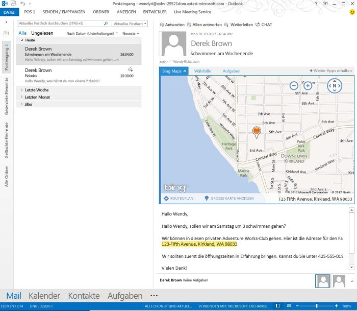

# Erstellen von Outlook-Add-Ins für Leseformulare
Erstellen Sie Outlook-Add-Ins für das Leseszenario, und finden Sie Informationen zu den verfügbaren API-Funktionen. Diese Funktionen umfassen die kontextabhängige Aktivierung basierend auf Nachrichtenklasse, dem Vorhandensein einer Anlage oder Zeichenfolgenübereinstimmungen anhand von regulären Ausdrücken oder bekannten Entitäten sowie das Abrufen von Anlagen eines Elements.

 _**Gilt für:** apps for Office | Office Add-ins | Outlook_

## Einrichten von Outlook-Add-Ins für Leseformulare

Lese-Add-Ins sind nichts anderes als Outlook-Add-Ins, die in einem Lesebereich oder Leseinspektor in Outlook aktiviert werden. Im Gegensatz zu Verfassen-Add-Ins (Outlook-Add-Ins, die aktiviert werden, sobald ein Benutzer eine Nachricht oder einen Termin erstellt) sind Lese-Add-Ins bei folgenden Benutzeraktionen verfügbar:

- Anzeigen einer E-Mail-Nachricht, einer Besprechungsanfrage, einer Besprechungsantwort oder einer Besprechungsabsage *
    
- Anzeigen eines Elements einer Besprechung, an der der Benutzer teilnimmt.
    
- Anzeigen eines Elements einer Besprechung, die der Benutzer organisiert (nur RTM-Version von Outlook 2013 und Exchange 2013).
    
    (../../images  Ab der Office 2013 SP1-Version können Erstellungs-Add-ins aktiviert und sind nur dann verfügbar, wenn der Benutzer ein vorhandenes Element einer Besprechung anzeigt, die er selbst organisiert hat. Lese-Add-ins sind in diesem Szenario nicht mehr verfügbar.
* Outlook aktiviert Add-Ins für bestimmte Nachrichtentypen nicht, die Anlagen für andere Nachrichten sind bzw. die sich im Outlook-Ordner „Entwürfe" oder im Junk-E-Mail-Ordner befinden oder verschlüsselt oder anderswie geschützt sind.

In jedem dieser Leseszenarien aktiviert Outlook Add-Ins, sobald die Aktivierungsvoraussetzungen für diese Add-Ins erfüllt sind, und der Benutzer kann aktivierte Mail-Add-Ins in der Add-In-Leiste im Lesebereich oder Leseinspektor auswählen und öffnen. Abbildung 1 zeigt ein  **Bing Maps**Add-In, das aktiviert und geöffnet wird, wenn der Benutzer eine Nachricht liest, die eine geografische Adresse enthält.

**Abbildung 1: Im Add-In-Bereich wird das Bing Maps-Add-In für die gewählte Outlook-Nachricht mit enthaltener Adresse in Aktion angezeigt**

## Im Lesemodus verfügbare Add-Ins

Lese-Add-Ins können eine Kombination der folgenden Typen sein.

- [Add-In-Befehle für Outlook](a806cdfa-4230-4bcb-bb3f-7e3d1c2f26c2.md)
    
- [Kontextbezogene Outlook-Add-Ins](2cd5d8f1-69b3-4a2a-b31e-81a07a7cdd9f.md)
    
- [Benutzerdefinierter Bereich Outlook-Add-Ins](9e7c5f45-f0ab-4d22-abfd-65f154f7d6e8.md)
    

## API-Funktionen, die für Lese-Add-ins verfügbar sind

Eine Liste der Funktionen, die die JavaScript-API für Office für Add-Ins in Leseformularen bereitstellt, finden Sie in Tabelle 1 und 2 unter [Mail-App-Funktionen pro Version](f34e2f44-8c9d-4e90-b1d7-3f29506adb92.md). 

Siehe auch:

- Zur Aktivierung von Add-ins in Formularen zum Lesen siehe Tabelle 1 unter [Angeben von Aktivierungsregeln in einem Manifest](../outlook/manifests/activation-rules.md#specify-activation-rules-in-a-manifest).
    
- [Verwenden regulärer Ausdrücke für Aktivierungsregeln zum Anzeigen eines Outlook-Add-Ins](93504f92-896f-4c80-9205-ba0b125f4290.md)
    
- [Erkennen bestimmter Zeichenfolgen in einem Outlook-Element als bekannte Entitäten](../outlook/match-strings-in-an-item-as-well-known-entities.md)
    
- [Extrahieren von Entitätszeichenfolgen aus einem Outlook-Element](50b70957-78a7-47ba-93bd-f4d7b6ff50b7.md)
    
- [Abrufen von Anlagen eines Outlook-Elements vom Server](0f872924-ea1a-4aa2-bb7b-e12d31014612.md)
    

## Inhalt dieses Abschnitts

- [Verwenden regulärer Ausdrücke für Aktivierungsregeln zum Anzeigen eines Outlook-Add-Ins](93504f92-896f-4c80-9205-ba0b125f4290.md)
    
- [Erkennen bestimmter Zeichenfolgen in einem Outlook-Element als bekannte Entitäten](../outlook/match-strings-in-an-item-as-well-known-entities.md)
    
- [Extrahieren von Entitätszeichenfolgen aus einem Outlook-Element](50b70957-78a7-47ba-93bd-f4d7b6ff50b7.md)
    
- [Abrufen von Anlagen eines Outlook-Elements vom Server](0f872924-ea1a-4aa2-bb7b-e12d31014612.md)
    

## Zusätzliche Ressourcen

- [Get Started with Outlook add-ins for Office 365](https://dev.outlook.com/MailAppsGettingStarted/GetStarted.aspx)
    
- [Outlook-Add-Ins](71e64bc9-e347-4f5d-8948-0a47b5dd93e6.md)
    
