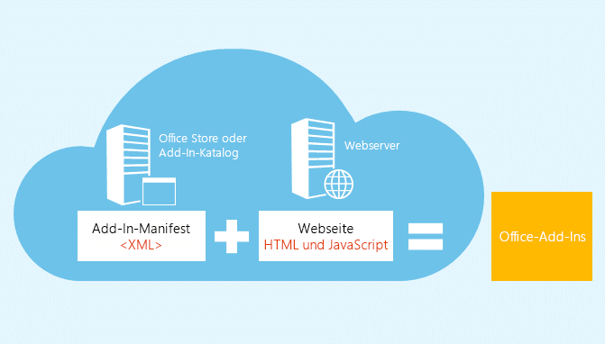
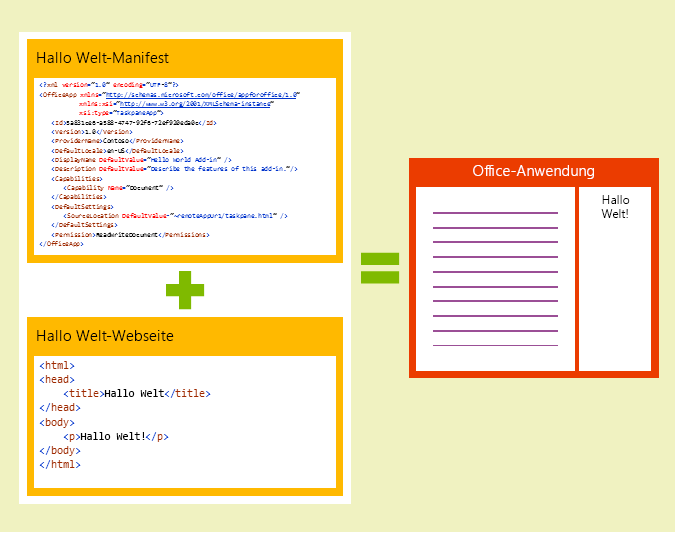
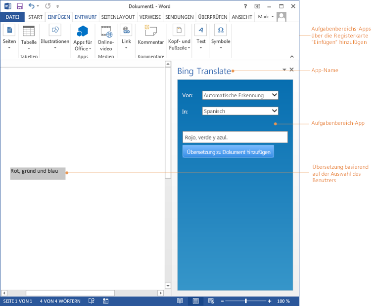
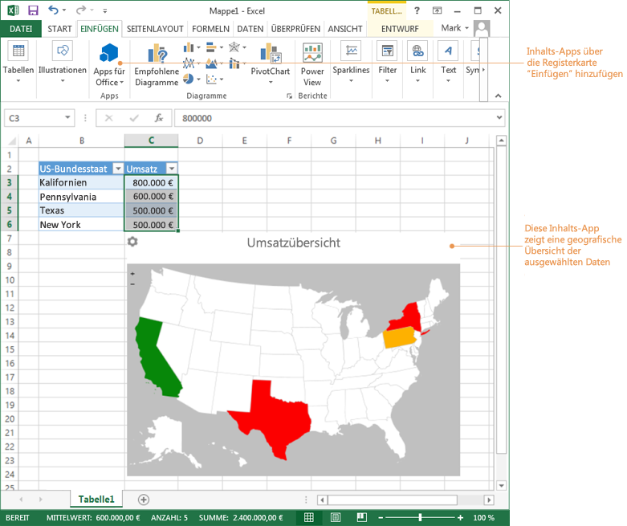
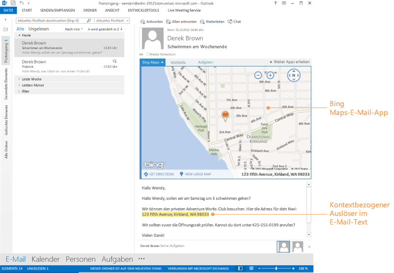

# Office-Add-Ins-Plattformübersicht
Mit der Office-Add-Ins-Plattform können Sie interessante neue Verbraucher- und Unternehmenserfahrungen für Office-Clientanwendungen erstellen. Mithilfe des Internets und standardisierter Webtechnologien wie HTML5, XML, CSS3, JavaScript und REST-APIs können Sie Add-Ins erstellen, die mit Office-Dokumenten, E-Mails, Besprechungsanfragen und Terminen interagieren. 

 _**Gilt für:** Access apps for SharePoint | apps for Office | Excel | Office Add-ins | Outlook | PowerPoint | Project | Word_

Dieses Dokument liefert einen schnellen Überblick über die Office-Add-Ins-Plattform und die Funktionsweise eines Add-Ins innerhalb einer Office-Anwendung. Weitere Informationen für den direkten Einstieg in das Entwickeln von Add-Ins finden Sie unter [Grundlagen der Entwicklung](#grundlagen-der-entwicklung). 

Ein Office-Add-In ist eine Webanwendung , die in einem Webbrowser-Steuerelement oder IFrame gehostet wird, das im Kontext einer Office-Hostanwendung ausgeführt wird, die mit Dokumenten und Mail-Elementen eines Benutzers interagieren kann. Sie können Office-Add-Ins verwenden, um Folgendes zu erweitern und damit zu interagieren: 

-  **Dokumente oder Daten -** Word-Dokumente, Excel-Arbeitsblätter, PowerPoint-Präsentationen, browserbasierte Access-Datenbanken, sowie Project-Zeitpläne und -Ansichten.
    
-  **Outlook-Postfachelemente –** E-Mails, Besprechungsanfragen oder Termine.
    
Add-Ins können in mehreren Umgebungen ausgeführt werden. Dazu gehören Office-Desktopanwendungen, Office Online in Desktop-und mobilen Browsern sowie eine zunehmende Anzahl von Office Tablet- und Phone-Apps. Wenn Sie Ihre Add-Ins im Office Store oder im lokalen Add-In-Katalog veröffentlicht haben, stehen die Add-Ins Benutzern in ihren Office-Anwendungen zur Verfügung.
Zum Ausprobieren einiger Add-Ins können Sie folgende Add-Ins aus dem Office Store installieren.

|**Office-Produkt**|**Add-In**|
|:-----|:-----|
|Excel|[Bing Maps](https://store.office.com/bing-maps-WA102957661.aspx?assetid=WA102957661&amp;homapppos=0&amp;homappcat=Data Visualization + BI&amp;homchv=0)|
|Outlook|[Package Tracker](https://store.office.com/package-tracker-WA104162083.aspx?assetid=WA104162083)|
|PowerPoint|[Khan-Inhalte von Microsoft](https://store.office.com/khan-content-from-microsoft-WA104320031.aspx?assetid=WA104320031)|
|Word|[Translator](https://store.office.com/translator-WA104124372.aspx?assetid=WA104124372)|
Um einigen Code auszuprobieren, laden Sie das [Beispielpaket mit Office-Add-Ins](http://code.msdn.microsoft.com/Apps-for-Office-code-d04762b7) für Visual Studio herunter.

## Aufbau eines Office-Add-In

Die grundlegenden Komponenten eines Office-Add-In sind eine XML-Manifestdatei und die Standard-Webseite Ihres Add-Ins. Das Manifest definiert verschiedene Einstellungen einschließlich der URL der Webseite, die die Benutzeroberfläche und die benutzerdefinierte Logik des Add-Ins implementiert. Wenn Ihr Add-In soweit ist, Ihren Kunden bereitgestellt zu werden, laden Sie das Add-In-Manifest in einen lokalen Add-In-Katalog hoch oder übermitteln Sie es an den Office Store. Die Webseite (und sonstige .js oder andere für diese Implementierung erforderliche Dateien) müssen auf einem Webserver oder in einem Webhostingdienst wie [Microsoft Azure](1561bf17-122e-4510-b1ce-7c7c346cdec9.md) gehostet werden.

**Manifest + Webseite = ein Office-Add-In**

Mit dem Manifest werden Einstellungen und Funktionen des Add-Ins definiert, wie z. B:

- Die URL der Webseite, die die Benutzeroberfläche und die Programmierlogik des Add-Ins implementiert.
    
- Der Anzeigename, die Beschreibung, die ID, die Version und das Standardgebietsschema des Add-Ins.
    
- So wird das Add-In aktiviert und angezeigt: 
    
      - Für Add-Ins, die mit Dokumenten interagieren: als Aufgabenbereich oder inline mit Dokumenteninhalten.
    
  - Für Add-Ins, die mit Mail-Elementen (Nachrichten oder Termine) interagieren: beim Lesen oder Erstellen des Elements.
    
- Die Berechtigungsstufe und die Datenzugriffsanforderungen für das Add-In.
    
Weitere Informationen finden Sie unter [XML-Manifest für Office-Add-Ins](4139ff24-afac-472a-af7d-9d069587ac9b.md).

## Grundlagen der Entwicklung

Zum Erstellen von Office-Add-Ins können Sie jede Anwendung verwenden, in der eine Datei im Textformat gespeichert werden kann. Einfacher können Sie ein Office-Add-In jedoch in der webbasierten Entwicklungsumgebung der Napa Office 365-Entwicklungstools oder in Visual Studio 2015 mithilfe der Projektvorlagen, der Entwicklungsumgebung und der Debugtools erstellen. 

### Grundlegende Komponenten eines Office-Add-In

Zum Erstellen eines Office-Add-In muss ein Entwickler mindestens eine HTML-Webseite und eine Manifestdatei erstellen. Die HTML-Seite kann auf einem beliebigen Webserver oder Webhostingdienst, wie z. B. [Microsoft Azure](1561bf17-122e-4510-b1ce-7c7c346cdec9.md) veröffentlicht werden. Die Manifestdatei muss auf den Speicherort der Webseite verweisen und an einem der folgenden Speicherorte veröffentlicht werden: im öffentlichen Office Store, in einer internen SharePoint-Liste oder an einem freigegebenen Netzwerkspeicherot.

Das einfachste Office-Add-In besteht aus einer statischen HTML-Seite, die in einer Office-Anwendung gehostet wird, aber nicht mit dem Office-Dokument oder einer anderen Internetressource interagiert. 

**Komponenten des Office-Add-Ins „Hello World"**

### Erstellen eines Office-Add-In mithilfe der Napa Office 365-Entwicklungstools

Ein Office-Add-In kann wahrscheinlich direkt in einem Browser am schnellsten erstellt werden. Dazu verwenden Sie die Napa. Bei den Napa handelt es sich um eine webbasierte Entwicklungsumgebung, mit der Sie im Browser Projekte erstellen, Code schreiben und Ihre Add-Ins ausführen können. Sie müssen keine anderen Tools wie z. B. Visual Studio installieren. Weitere Informationen finden Sie unter [Erstellen von Office-Add-Ins mit Napa mit einer Office 365-Entwicklerwebsite](82a3645c-0911-4926-9176-236ac8d28bdd.md). Weitere Informationen für den direkten Einstieg in die Entwicklung von Add-Ins finden Sie hier:

- [Erstellen eines Aufgabenbereich-Add-Ins mit Napa Office 365-Entwicklungstools](8d43663c-42d8-4583-b2a2-a79349c4b998.md)
    
- [Erstellen eines Inhalts-Add-Ins für Excel mit Napa Office 365-Entwicklungstools](5ffa3886-4953-4a28-a858-6bed4cd9121b.md)
    
- [Get Started with Mail add-ins for Office 365](https://dev.outlook.com/MailAppsGettingStarted/GetStarted.aspx)
    
Wenn Sie mit dem Entwickeln von Office-Add-Ins mit Napa beginnen, können Sie diese Projekte in Visual Studio weiterentwickeln, um die leistungsfähigen Features wie das erweiterte Debuggen oder die Option, ein Webprojekt als Teil Ihres Add-Ins zu nutzen.

### Erstellen eines Office-Add-In mithilfe von Visual Studio

Die leistungsfähigste Methode zum Erstellen eines Office-Add-In ist die Verwendung der  **Add-In für Office**-Projektvorlage in Visual Studio. Visual Studio erstellt eine komplette Projektmappe, die alle erforderlichen Dateien enthält, um sofort mit dem Testen Ihres Add-Ins in Office zu beginnen. Visual Studio weist ein umfangreiches Spektrum an Features auf, um das Entwickeln und Testen von Office-Add-Ins zu vereinfachen. Weitere Informationen finden Sie unter [Erstellen und Debuggen von Office-Add-Ins in Visual Studio](05a9287f-b39e-4d48-b3e6-b777f148b810.md). Weitere Informationen für den direkten Einstieg in das Entwickeln finden Sie unter diesen Themen:

- [Erstellen eines Aufgabenbereich- oder Inhalts-Add-Ins mit Visual Studio](a23c5ce8-6de3-40f6-a86a-85d3592bef3e.md)
    

### Erstellen eines Office-Add-In mit einem Texteditor

Wenn Sie zum Erstellen eines Office-Add-In Ihren bevorzugten Texteditor verwenden möchten, finden Sie in diesen Themen Informationen für den Einstieg:

- [Erstellen des ersten Aufgabenbereich- oder Inhalts-Add-ins für Word oder Excel mit einem Text-Editor](d5411d35-9ef6-4e21-ba2b-4d2b1ee81359.md)
    
- [Get Started with Mail add-ins for Outlook.com (Preview)](https://dev.outlook.com/MailAppsGettingStarted/GetStarted/outlook-dot-com.aspx)
    

### JavaScript-API für Office

Die JavaScript-API für Office enthält Objekte und Member zum Erstellen von Add-Ins und Interagieren mit Office-Inhalten und Webdiensten.

Weitere Informationen zur JavaScript-API für Office:

- Weitere Informationen finden Sie unter [Grundlegendes zur JavaScript-API für Office](01180dae-ca45-40c8-b3dd-fd2a85651c0c.md) und in der [JavaScript-API für Office](http://msdn.microsoft.com/library/b27e70c3-d87d-4d27-85e0-103996273298%28Office.15%29.aspx)-Referenz.
    
- Sie können Code der JavaScript-API für Office in Excel Online ausführen und bearbeiten. Nutzen Sie hierfür das interaktive [Lernprogramm zur Office-Add-Ins-API](http://msdn.microsoft.com/de-de/office/dn449240.aspx).
    
Die Word- und Excel-JavaScript-APIs stellen hostspezifische Objektmodelle bereit, die Sie in einem Office-Add-In verwenden können. Sie können auf Objekte wie Abschnitte und Arbeitsmappen zugreifen, was das Erstellen eines Office-Add-Ins für Word und Excel für Sie einfacher macht. Weitere Informationen zu diesen APIs finden Sie unter [word-add-ins](dce6f715-e782-46ef-b668-56a4281f6b21.md) und [Excel-Add-Ins](https://msdn.microsoft.com/de-de/library/office/mt616485.aspx).

## Office-Add-Ins-Typen

In diesem Abschnitt werden die drei Office-Add-Ins-Typen kurz vorgestellt: Aufgabenbereich, Inhalt und Outlook. 

### Aufgabenbereich-Add-Ins

Aufgabenbereich-Add-Ins werden parallel in einem Office-Dokument verwendet und liefern kontextbezogene Informationen und Funktionalität, um das Anzeigen und Erstellen von Dokumenten zu optimieren. Beispielsweise können mit einem Aufgabenbereich-Add-In im Dokument ausgewählte Produktinformationen in einem Webdienst anhand des Produktnamens oder der Artikelnummer nachgeschlagen und abgerufen werden.

**Aufgabenbereich-Add-In**

Um ein Aufgabenbereichs-Add-In in Excel 2013, Excel Online oder Word 2013 auszuprobieren, installieren Sie das [Wikipedia](https://store.office.com/wikipedia-WA104099688.aspx?assetid=WA104099688)-Add-In.

### Inhalts-Add-Ins

Mit Inhalts-Add-Ins werden webbasierte Features als Inhalt integriert, der inline mit dem Text im Dokument angezeigt werden kann. Mit Inhalts-Add-Ins können Sie umfangreiche, webbasierte Datenvisualisierungen, eingebettete Medien (z. B. einen YouTube-Videoplayer oder eine Bildgalerie) sowie andere externe Inhalte integrieren.

**Inhalts-Add-In**

Um ein Inhalts-Add-In in Excel 2013 oder Excel Online auszuprobieren, installieren Sie das [Bing Maps](https://store.office.com/bing-maps-WA102957661.aspx?assetid=WA102957661)-Add-In.

### Outlook-Add-Ins

Outlook-Add-Ins werden neben einem Outlook-Element angezeigt, wenn Sie es anzeigen oder erstellen. Sie funktionieren mit E-Mail-Nachrichten, Besprechungsanfragen, Besprechungsantworten, Besprechungsabsagen, Terminen oder in einem Leseszenario (der Benutzer zeigt ein empfangenes Element an) oder in einem Verfassenszenario (der Benutzer antwortet auf oder erstellt ein neues Element). Outlook-Add-Ins können auf kontextbezogene Informationen des Elements, wie die Adresse oder die Nachverfolgungs-ID zugreifen. Diese Daten ermöglichen dann den Zugriff auf zusätzliche Informationen auf dem Server und in Webdiensten, um das Arbeiten wesentlich angenehmer zu gestalten. In den meisten Fällen wird ein Office-Add-In ohne Änderung in den unterstützenden Hostanwendungen wie Outlook, Outlook für Mac, Outlook Web App und OWA für mobile Geräte ausgeführt, um ein problemloses Arbeiten auf dem Desktop, im Web, auf Tablets und auf mobilen Geräten zu ermöglichen.

 >**Hinweis**  Outlook-Add-Ins benötigen als Mindestversion Exchange 2013 oder Exchange Online , um das Postfach des Benutzers zu hosten. POP- und IMAP-E-Mail-Konten werden nicht unterstützt.

**Outlook-Add-In in einem Leseszenario**

Um ein Outlook-Add-In in Outlook , Outlook für Mac, Outlook RT oder Outlook Web App auszuprobieren, installieren Sie das [Paketnachverfolgungs](https://store.office.com/package-tracker-WA104162083.aspx?assetid=WA104162083)-Add-In.

## Office-Anwendungen, die Office-Add-Ins unterstützen

Office-Add-Ins werden bei einer zunehmenden Anzahl von Office-Hostanwendungen unterstützt, die auf Desktops, Tablets, mobilen Geräten, und in Office Online im Browser ausgeführt werden. In vielen Fällen bedeutet das, Sie können ein einzelnes Add-In entwickeln, das unter verschiedenen Betriebssystemen und Office-Hostanwendungen ausgeführt werden kann. Außerdem erhalten Ihre Kunden eine konsistentes Erlebnis bei der Verwendung Ihres Add-Ins auf dem Desktop, Geräten oder in Webbrowsern.

Für Aufgabenbereich-Add-Ins bedeutet dies, dass Sie ein einzelnes Add-In entwickeln können, das mit Excel, PowerPoint und Word auf dem Windows Desktop oder mit Excel Online, PowerPoint Online und Word Online in einem Webbrowser ausgeführt werden kann. Für Outlook-Add-Ins bedeutet dies, dass Sie ein einzelnes Add-In entwickeln können, das mit Outlook und Outlook für Mac auf dem Desktop, mit OWA für mobile Geräte auf Tablets und mobilen Geräten sowie mit Outlook Web App in einem Webbrowser ausgeführt werden kann.

In dieser Tabelle werden die Office-Hostanwendungen (einschließlich Desktop-, Tablet- und Webclients), die Office-Add-Ins ausführen können, und die von jedem Host unterstützten Add-In-Typen aufgeführt.

**Unterstützte Add-In-Typen**

|**Office-Anwendung**|**Inhalts-Add-Ins**|**Outlook-Add-Ins**|**Aufgabenbereich-Add-Ins**|
|:-----|:-----|:-----|:-----|
|Access-Web-Apps|

|||
|Excel 2013 oder höher|

||

|
|Excel Online|

||

|
|Outlook 2013 oder höher||

||
|Outlook für Mac||

||
|Outlook Web App||

||
|OWA für mobile Geräte||

||
|PowerPoint 2013 oder höher|

||

|
|PowerPoint Online|

||

|
|Project 2013 oder höher|||

|
|Word 2013 oder höher|||

|
|Word Online|||

|
Weitere Details finden Sie unter [Voraussetzungen zum Ausführen von Office-Add-ins](67340567-bb9a-498c-96d3-3f52f28c16bc.md).

## Welche Funktionalität bietet ein Office-Add-In?

Ein Office-Add-In bietet so ziemlich dieselbe Funktionalität wie eine Webseite im Browser, wie z. B:

- Bereitstellen einer interaktiven Benutzeroberfläche und benutzerdefinierter Logik über JavaScript
    
- Verwenden von JavaScript-Frameworks wie z. B. jQuery
    
- Herstellen einer Verbindung mit REST-Endpunkten und -Webdiensten per HTTP und AJAX
    
- Ausführen von serverseitigem Code oder serverseitiger Logik bei Implementierung der Seite mithilfe einer serverseitigen Skriptsprache wie z. B. ASP oder PHP
    
Für Office-Add-Ins gelten außerdem wie für Webseiten dieselben von Browsern auferlegten Einschränkungen, wie z. B. die Same-Origin Policy für die Domänenisolation sowie Sicherheitszonen. 

Neben den regulären Funktionen einer Webseite können Office-Add-Ins mit der Office-Anwendung und dem Add-In-Inhalt des Benutzers über eine JavaScript-Bibliothek interagieren, die von der Office-Add-Ins-Infrastruktur bereitgestellt wird. Die Optionen für diese Interaktion hängen wie folgt vom Add-In-Typ ab: 

- Für Aufgabenbereich- und Inhalts-Add-Ins kann das Add-In über die API Dokumente lesen und in diese schreiben sowie wichtige Anwendungs- und Benutzerereignisse verarbeiten, wie z. B. die Änderung der aktiven Auswahl. Eine Zusammenfassung der für Aufgabenbereich- und Inhalts-Add-Ins verfügbaren Features finden Sie unter [Aufgabenbereich- und Inhalts-Add-Ins für Office 2013](baf73b23-4429-4b7f-bcb9-a99a9618ae38.md).
    
- Für Outlook-Add-Ins kann Ihr Add-In über die API auf Eigenschaften von E-Mail-Nachrichten, Besprechungsanfragen und Terminelementen sowie auf Benutzerprofilinformationen zugreifen. Die API ermöglicht außerdem den Zugriff auf einige Vorgänge im Zusammenhang mit Exchange-Webdiensten. Weitere Informationen zu Outlook-Add-Ins finden Sie unter [Outlook-Add-Ins](71e64bc9-e347-4f5d-8948-0a47b5dd93e6.md). Eine Zusammenfassung der wichtigsten Features von Outlook-Add-Ins finden Sie unter [Übersicht über Architektur und Features von Outlook-Add-Ins](2cd5641b-492b-4431-8388-7fc589163e9c.md).
    

## Grundlegendes zur Laufzeit

Office-Add-Ins werden durch eine Add-In-Laufzeitumgebung, ein mehrstufiges Berechtigungsmodell sowie Leistungskontrollen geschützt. Dieses Framework schützt den Benutzer wie folgt:

- Der Zugriff auf die Benutzeroberfläche der Hostanwendung wird verwaltet.
    
- Nur der indirekte Zugriff auf den Benutzeroberflächen-Thread der Hostanwendung ist zulässig.
    
- Modale Interaktionen sind nicht zulässig (z. B. JavaScript-Benachrichtigungen)
    
Darüber hinaus bietet das Laufzeitframework die folgenden Vorteile, um sicherzustellen, dass die Add-In-Umgebung des Benutzers nicht von einem Office-Add-In beschädigt werden kann:

- Der Prozess, über den das Add-In ausgeführt wird, wird isoliert.
    
- DLL- oder EXE-Ersetzung oder ActiveX-Komponenten sind nicht erforderlich.
    
- Einfache Installation und Deinstallation von Add-Ins.
    
Außerdem steuert das Laufzeitframework die Nutzung von Arbeitsspeicher, CPU und den Netzwerkressourcen durch Office-Add-Ins, damit eine gute Leistung und Zuverlässigkeit aufrecht erhalten werden können. 

Weitere Informationen zum Datenschutz- und Sicherheitsmodell von Office-Add-Ins finden Sie unter [Datenschutz und Sicherheit bei Office-Add-Ins](87c59a88-10e2-4c88-b6a8-736bd356e5f8.md).

## Grundlagen der Veröffentlichung

Office-Add-Ins können Sie in vier Veröffentlichungsendpunkten veröffentlichen:

-  **Office Store**: Hierbei handelt es sich um einen öffentlichen Marketplace, den Microsoft auf Office.com hostet und reguliert. Im Office Store können Entwickler weltweit ihre benutzerdefinierten Office-Lösungen veröffentlichen und verkaufen, und Endbenutzer und IT-Experten können diese dann für die private oder geschäftliche Nutzung herunterladen. 
    
    Wenn ein Entwickler ein Add-In in den Office Store hochlädt, wird der Code von Microsoft überprüft. Beispielsweise wird überprüft, ob das Markup für das Add-In-Manifest gültig und vollständig ist. Falls der Code gültig ist, wird das Add-In-Paket von Microsoft digital signiert. Der Office Store kümmert sich dann um die Downloadbenutzererfahrung der Endbenutzer – von der Ermittlung über den Kauf bis hin zu Upgrades und Updates.
    
-  **Office-Add-Ins-Katalog auf SharePoint**: Für Aufgabenbereich- und Inhalts-Add-Ins können IT-Abteilungen private Add-In-Kataloge bereitstellen, um dieselbe Add-In-Kauferfahrung wie mit dem Office Store zu ermöglichen. Mithilfe dieser neuen Katalog- und Entwicklungsplattform können IT-Abteilungen eine optimierte Methode verwenden, um Office- und SharePoint-Add-Ins für verwaltete Benutzer zentral bereitzustellen. 
    
    Add-In-Kataloge sind für alle Kunden von SharePoint 2013 verfügbar (einschließlich Office 365 und SharePoint lokal). Ein Add-In-Katalog ermöglicht die Veröffentlichung und Verwaltung von intern erstellten Add-Ins sowie von Add-Ins, die im Office Store verfügbar sind und im Unternehmen lizenziert sind. 
    
-  **Exchange-Katalog**: Hierbei handelt es sich um einen privaten Katalog für Outlook-Add-Ins, der für Benutzer des Exchange-Servers verfügbar ist, auf dem er gespeichert ist. Er ermöglicht die Veröffentlichung und Verwaltung von Unternehmens-Outlook-Add-Ins. Hierzu gehören intern erstellte Add-Ins sowie Add-Ins, die im Office Store verfügbar sind und im Unternehmen lizenziert sind.
    
-  **Freigegebener Netzwerk-Ordnerkatalog**: IT-Abteilungen und Entwickler können Aufgabenbereich- und Inhalts-Add-Ins auch in einem freigegebenen Ordner im zentralen Netzwerk bereitstellen, in der die Manifestdateien gespeichert und verwaltet werden. Die Benutzer können dann Add-Ins erwerben, indem sie diesen freigegebenen Ordner als vertrauenswürdigen Katalog angeben. IT-Abteilungen können diesen freigegebenen Ordner aber auch mithilfe einer Registrierungseinstellung als vertrauenswürdigen Katalog konfigurieren.
    
Weitere Informationen finden Sie unter [Veröffentlichen Ihres Office-Add-ins](7f3ae6a0-06e9-438c-8899-bd9f605e6d9e.md).

## Szenarien

Die folgenden Szenarien zeigen, dass Office-Add-Ins auf die Zielgruppe abgestimmte, schnell einzusetzende Add-Ins sind, mit denen komplexe und zeitaufwändige Probleme beseitigt werden können.

In diesen Szenarien werden Möglichkeiten vorgeschlagen, wie Sie z. B. Branchendaten zur Verfügung stellen und die Einführung strukturierter Geschäftsprozesse in der vertrauten Office-Benutzeroberfläche auf mehreren Geräten vorantreiben können. Es wird gezeigt, wie Sie ein Ausgabenverwaltungs-Add-In verwenden, das Office, SharePoint und SAP verbindet, oder wie Sie ein Add-In erstellen, das Umsatzzahlen mit Landkarten aus dem Bing Maps-Webdienst verknüpft, um effektivere Umsatzberichte zu erstellen. Sie erfahren, wie Sie die Rendite Ihrer bestehenden Investitionen steigern können, wie z. B. ERP (Enterprise Resource Planning (ERP)- und CRM (Customer Relationship Management, Kundenbeziehungsmanagement)-Anwendungen, indem Sie auf einem Office-Client weniger Zeit mit dem Navigieren in diesen Anwendungen verschwenden.

Es gibt die folgenden Szenarien:

-  **Übersetzungs-Assistent**: Ein Word-Aufgabenbereich-Add-In, mit dem ausgewählter Text automatisch von der Dokumentsprache in eine andere Sprache, die in einer Dropdownliste ausgewählt wird, übersetzt wird.
    
-  **Diagrammerstellung**: EinExcel-Inhalts-Add-In, mit dem ein Diagramm anhand von ausgewählten Daten automatisch erstellt wird.
    
-  **Integration von Drittanbieterdiensten**: Ein Word- oder Excel-Aufgabenbereich-Add-In, mit dem für den ausgewählten Text automatisch die entsprechende Wikipedia-Seite angezeigt wird.
    
-  **Rich-Mashups**: Ein Bing Maps-Inhalts-Add-In in Excel, mit dem die Offshoreanlagen und die Position von Ressourcen für ein Ölförderungsunternehmen dargestellt werden. Diese Informationen werden dann in Echtzeit aus dem Ressourcenmanagementsystem des Unternehmens abgerufen.
    
-  **Spezifikationsüberprüfung**: Ein Abschnitt oder Absatz einer Designspezifikation für eine Flugzeugkomponente wird als veraltet gekennzeichnet, da ein Word-Add-In mit einem Geschäftssystem kommuniziert, um den Inhalt anhand der neuesten Spezifikation zu überprüfen.
    
-  **Starten von Workflows**: Ein Outlook-Add-In kann beim Erstellen einer Nachricht oder Besprechungsanfrage basierend auf Vorlagen, durch Einfügen von Details zum Besprechungsort oder durch eine vom Benutzer auszuwählende Signatur sowie durch das Anhängen zugehöriger Dokumente helfen.
    
-  **Im Kontext angezeigte Bestellungsdetails**: Ein Outlook-Add-In, das eine in eine E-Mail-Nachricht eingebettete Bestellnummer oder Kundennummer erkennt, kann Details der Bestellung oder des Kunden in der Nachricht anzeigen. Dies könnte eine auszuführende Aktion beinhalten, wie z. B. die Genehmigung.
    

## Zusätzliche Ressourcen

- [Office-Add-Ins](1e123201-6e70-45c1-a48c-d5b955896ddb.md)
    
- [Designrichtlinien für Office-Add-Ins](d5b2ab2e-dfc8-47c8-919c-e9c23358d70c.md)
    
- [Aufgabenbereich- und Inhalts-Add-Ins für Office 2013](baf73b23-4429-4b7f-bcb9-a99a9618ae38.md)
    
- [Outlook-Add-Ins](71e64bc9-e347-4f5d-8948-0a47b5dd93e6.md)
    
- [Übersicht über Architektur und Features von Outlook-Add-Ins](2cd5641b-492b-4431-8388-7fc589163e9c.md)
    
- [Veröffentlichen Ihres Office-Add-ins](7f3ae6a0-06e9-438c-8899-bd9f605e6d9e.md)
    
- [API und Schemaverweise für Office-Add-Ins](afcc2908-1e1b-4297-b554-11e6eb404804.md)
    
