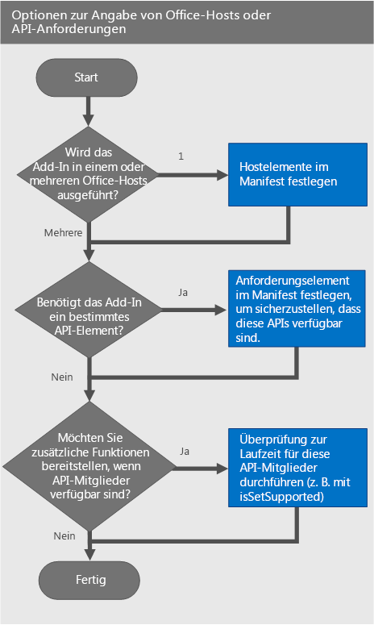

# Angeben von Office-Hosts und API-Anforderungen
Geben Sie Office-Hosts, Anforderungssätze oder API-Elemente an, die für Ihr Add-In erforderlich sind. Verwenden Sie  **isSetSupported** oder andere Laufzeitüberprüfungen, um zusätzliche Funktionalität zu bieten, wenn ein API-Element in Ihrem Office-Host unterstützt wird, auf dem Ihr Add-In ausgeführt wird.

 _**Gilt für:** Access apps for SharePoint | apps for Office | Excel | Office Add-ins | Outlook | PowerPoint | Project | Word_

Für eine erwartete Funktionsweise hängt Ihr Office-Add-In möglicherweise von einem bestimmten Office-Host, einem Anforderungssatz, einem API-Element oder einer Version der API ab. Beispielsweise kann für Ihr Add-In Folgendes gelten:

- Es wird in einer einzigen Office-Anwendung (z. B. Word oder Excel) oder in mehreren Office-Anwendungen ausgeführt.
    
- Es verwendet JavaScript-APIs, die nur in einigen Versionen von Office verfügbar sind. Möglicherweise verwendet es die neuen JavaScript-APIs für Excel in einem Add-In, das in Excel 2016 ausgeführt wird. 
    
- Es wird nur in Office-Versionen ausgeführt, die die von Ihrem Add-In verwendeten API-Elemente unterstützt.
    
Dieser Artikel hilft Ihnen, zu verstehen, welche Optionen Sie verwenden sollten, um sicherzustellen, dass Ihr Add-In wie erwartet funktioniert und die größtmögliche Benutzergruppe erreicht.
In der folgenden Tabelle sind die Kernkonzepte aufgeführt, die in diesem Artikel dargestellt werden.


|**Konzept**|**Beschreibung**|
|:-----|:-----|
|Office-Anwendung, Office-Hostanwendung, Office-Host oder Host|Die Office-Anwendung, die zum Ausführen Ihres Add-Ins verwendet wird, z. B. Word, Word Online, Excel usw.|
|Plattform|Die Plattform, auf der der Office-Host ausgeführt wird, z. B. Office Online oder Office für iPad|
|Anforderungssatz|Eine benannte Gruppe verwandter API-Elemente. Add-Ins-Anforderungssätze zum Feststellen, ob der Office-Host die von Ihrem Add-In verwendeten API-Elemente unterstützt. Es ist einfacher, die Unterstützung für einen Anforderungssatz zu testen, als die Unterstützung für die einzelnen API-Elemente. Die Anforderungssatzunterstützung variiert je nach Office-Host und Version des Office-Hosts. Anforderung sind angegeben:
<ul xmlns:xlink="http://www.w3.org/1999/xlink" xmlns:mtps="http://msdn2.microsoft.com/mtps" xmlns:mshelp="http://msdn.microsoft.com/mshelp" xmlns:ddue="http://ddue.schemas.microsoft.com/authoring/2003/5" xmlns:msxsl="urn:schemas-microsoft-com:xslt"><li><p>In der Manifestdatei. Wenn Anforderungssätze im Manifest angegeben sind, legen Sie die minimale Stufe der API-Unterstützung fest, die der Office-Host bereitstellen muss, damit das Add-In ausgeführt wird. Office-Hosts, die die im Manifest angegebenen Anforderungssätze nicht unterstützen, können Ihr Add-In nicht ausführen, und das Add-In wird nicht unter <span class="ui">Meine-Add-Ins</span> angezeigt. Dies schränkt die Plattformen ein, auf denen das Add-In zur Verfügung steht.</p></li><li><p>Im Code mithilfe der Laufzeitüberprüfung.</p></li></ul>Eine vollständige Liste der Anforderungssätze finden Sie unter [Office-Add-In-Anforderungssätze](http://msdn.microsoft.com/library/68e346bc-b63a-4e73-ae2f-b03d1b27b98f%28Office.15%29.aspx).|
|Laufzeitüberprüfung|Ein Test, der zur Laufzeit durchgeführt wird, um zu bestimmen, ob der Office-Host, auf dem Ihr Add-In ausgeführt wird, die von Ihrem Add-In verwendeten Anforderungssätze oder Methoden unterstützt. Zum Durchführen einer Laufzeitprüfung verwenden Sie eine  **if**-Anweisung mit der Methode  **isSetSupported**, den Anforderungssätzen oder den Methodennamen, die nicht Teil eines Anforderungssatzes sind.Mithilfe der Laufzeitüberprüfung wird sichergestellt, dass das Add-In die größte Anzahl von Kunden erreicht. Im Gegensatz zu Anforderungssätzen geben Laufzeitüberprüfungen nicht die minimale Stufe der API-Unterstützung an, die der Office-Host bereitstellen muss, damit Ihr Add-In ausgeführt wird. Verwenden Sie stattdessen die  **if**-Anweisung, um zu überprüfen, ob ein API-Element unterstützt wird, und wenn dies der Fall, können Sie zusätzliche Funktionen in Ihrem Add-In bereitstellen. Ihr Add-In wird immer unter  **Meine-Add-Ins** bei der Verwendung der Laufzeitüberprüfung angezeigt.|

## Geben Sie, bevor Sie beginnen, die neueste Version des Add-In-Manifestschemas und der Bibliothek der JavaScript-API für Office an.

Ihr Add-In muss die neuste Version des Add-In-Manifestschemas verwenden. Wenn Sie Laufzeitüberprüfungen in Ihrem Add-In verwenden, müssen Sie sicherstellen, dass Sie die neueste JavaScript-API für die Office-Bibliothek (office.js) verwenden.


### Angeben des neuesten Add-In-Manifestschemas

Das Manifest des Add-Ins muss Version 1.1, des Add-In-Manifestschemas verwenden. Legen Sie dazu das Element  **OfficeApp** im Manifest Ihres Add-Ins wie folgt angegeben fest:


```XML
<OfficeApp xmlns="http://schemas.microsoft.com/office/appforoffice/1.1" xmlns:xsi="http://www.w3.org/2001/XMLSchema-instance" xsi:type="TaskPaneApp">
```


### Angeben der neuesten Bibliothek der JavaScript-API für Office


Verweisen Sie bei der Verwendung von Laufzeitüberprüfungen auf die neueste Version der Bibliothek der JavaScript-API für Office aus dem CDN (Content Delivery Network) verweisen. Fügen Sie dazu das folgende  `script`-Tag zu Ihrem HTML-Code hinzu. Durch Verwenden von  `/1/` in der CDN-URL wird sichergestellt, dass Sie auf die neuste Version von Office.js verweisen.


```HTML
<script src="https://appsforoffice.microsoft.com/lib/1/hosted/Office.js" type="text/javascript"></script>
```


## Optionen zum Angeben von Office-Hosts oder API-Anforderungen

Bei der Angabe von Office-Hosts oder API-Anforderungen sind mehrere Entscheidungen zu treffen, um das richtige Verfahren für Ihr Add-In zu wählen. Das folgende Diagramm zeigt, wie Sie entscheiden, welches Verfahren in Ihrem Add-In zu verwenden ist.


Aus dem Diagramm:


- Wenn das Add-In in einem Office-Host ausgeführt wird, legen Sie das Element  **Hosts** im Manifest fest. Weitere Informationen finden Sie unter [Festlegen des Hosts-Elements](#festlegen-des-hosts-elements).
    
- Um den minimalen Anforderungssatz oder die API-Elemente festzulegen, die ein Office-Host zum Ausführen des Add-Ins unterstützen muss, müssen Sie das Element  **Requirements** im Manifest festlegen. Weitere Informationen finden Sie unter [Festlegen des Requirements-Elements im Manifest](#festlegen-des-requirements-elements-im-manifest).
    
- Wenn Sie zusätzliche Funktionen bereitstellen möchten, wenn bestimmte Anforderungssätze oder API-Elemente im Office-Host verfügbar sind, müssen Sie eine Laufzeitüberprüfung im JavaScript-Code Ihres Add-Ins durchführen. Wenn das Add-In z. B. in Excel 2016 ausgeführt wird, möchten Sie möglicherweise API-Elemente aus der neuen JavaScript-API für Excel verwenden, um zusätzliche Funktionen bereitzustellen. Weitere Informationen finden Sie unter [Verwenden von Laufzeitüberprüfungen im JavaScript-Code](#verwenden-von-laufzeitüberprüfungen-im-javascript-code).
    

## Festlegen des Hosts-Elements


Verwenden Sie zum Ausführen des Add-Ins in einer Office-Hostanwendung die Elemente  **Hosts** und **Host** im Manifest. Wenn das Element **Hosts** nicht im Manifest angegeben ist, wird Ihr Add-In in allen Hosts ausgeführt.

Beispielsweise gibt die folgende  **Hosts**- und  **Host**-Deklaration an, dass das Add-In mit einer beliebigen Version von Excel arbeitet, einschließlich Excel für Windows, Excel Online und Excel für iPad.


```XML
  <Hosts>
    <Host Name="Workbook" />
  </Hosts>
```

Das Element  **Hosts** kann ein oder mehrere **Host**-Elemente enthalten. Das Element  **Host** gibt den Office-Host an, der für Ihr Add-In erforderlich ist. Das Attribut **Name** ist erforderlich und kann auf einen der folgenden Werte festgelegt werden.


|**Name**|**Office-Hostanwendungen**|
|:-----|:-----|
| `"Database"`|Access Web Apps|
| `"Document"`|Word, Word Online|
| `"Mailbox"`|Outlook, Outlook Web App, OWA für mobile Geräte|
| `"Presentation"`|PowerPoint, PowerPoint Online|
| `"Project"`|Project|
| `"Workbook"`|Excel, Excel Online, Excel auf dem iPad|

 >**Hinweis**  Das Attribut  **Name** gibt die Office-Hostanwendung an, die Ihr Add-In ausführen kann. Office-Hosts werden in unterschiedlichen Plattformen unterstützt, in denen Desktop-PCs, Webbrowser, Tablets und Smartphones ausgeführt werden. Sie können nicht angeben, welche Plattform zum Ausführen Ihres Add-Ins verwendet werden soll. Wenn Sie beispielsweise `"Mailbox"` angeben, kann Outlook und Outlook Web App zum Ausführen Ihres Add-In verwendet werden. Da Microsoft in Zukunft Unterstützung für neue Plattformen hinzufügt, z. B. Office für iOS, wird Ihr Add-In bald auch in diesen Plattformen verfügbar sein.


## Festlegen des Requirements-Elements im Manifest


Das Element  **Requirements** gibt die minimalen Anforderungssätze oder API-Elemente an, die vom Office-Host zum Ausführen Ihres Add-Ins unterstützt werden müssen. Das Element **Requirements** kann Anforderungssätze und Methoden angeben, die in Ihrem Add-In verwendet werden. In Version 1.1 des Add-In-Manifestschemas ist das Element **Requirements** für alle Add-Ins optional, mit Ausnahme von Outlook-Add-Ins.


 >**Vorsicht**  Verwenden Sie nur das Element  **Requirements** zum Angeben wichtiger Anforderungssätze oder API-Elemente, die Ihr Add-In verwenden muss. Wenn der Office-Host oder die Plattform die im Element **Requirements** angegebenen Anforderungssätze oder API-Elemente nicht unterstützt , wird Ihr Add-In nicht in diesem Host oder auf dieser Plattform ausgeführt und nicht unter **Meine Add-Ins** angezeigt.Stattdessen wird empfohlen, Ihr Add-In auf allen Plattformen wie Excel unter Windows, Excel Online und Excel auf einem iPad eines Office-Hosts zur Verfügung zu stellen. Um Ihr Add-In auf  _allen_ Office-Hosts und Plattformen zur Verfügung zu stellen, verwenden Sie Laufzeitüberprüfungen anstelle des Elements **Requirements**.

Der folgende Code zeigt ein Add-In, das in allen Office-Hostanwendungen geladen wird, die Folgendes unterstützen:


-  **TableBindings**-Anforderungssatz mit mindestens Version 1.1
    
-  **OOXML**-Anforderungssatz mit mindestens Version 1.1
    
-  **Document.getSelectedDataAsync**-Methode
    


```XML
<Requirements>
   <Sets DefaultMinVersion="1.1">
      <Set Name="TableBindings" MinVersion="1.1"/>
      <Set Name="OOXML" MinVersion="1.1"/>
   </Sets>
   <Methods>
      <Method Name="Document.getSelectedDataAsync"/>
   </Methods>
</Requirements>
```

Beachten Sie im obigen Beispiel Folgendes:


- Das Element  **Requirements** enthält untergeordneten Elemente **Sets** und **Methods**.
    
- Das Element  **Sets** kann ein oder mehrere **Set**-Elemente enthalten.  **DefaultMinVersion** gibt den **MinVersion** -Standardwert aller untergeordneten **Set**-Elemente an.
    
- Das Element  **Set** gibt die Anforderungssätze an, die der Office-Host zum Ausführen des Add-Ins unterstützen muss. Das Attribut **Name** gibt den Namen des Anforderungssatzes an. **MinVersion** gibt die Mindestversion des Anforderungssatzes an. **MinVersion** überschreibt den Wert von **DefaultMinVersion**. Weitere Informationen zu Anforderungssätzen und den Anforderungssatzversionen der API-Elemente finden Sie unter [Office-Add-In-Anforderungssätze](http://msdn.microsoft.com/library/68e346bc-b63a-4e73-ae2f-b03d1b27b98f%28Office.15%29.aspx).
    
- Das Element  **Methods** kann ein oder mehrere **Method**-Elemente enthalten. Sie können das Element  **Methods** nicht mit Outlook-Add-Ins verwenden.
    
- Das Element  **Method** gibt eine einzelne Methode an, die im Office-Host unterstützt werden muss, in dem Ihr Add-In ausgeführt wird. Das Attribut **Name** ist erforderlich und gibt den Namen der Methode an, die mit ihrem übergeordneten Objekt qualifiziert ist.
    

## Verwenden von Laufzeitüberprüfungen im JavaScript-Code


Möglicherweise möchten Sie zusätzliche Funktionalität in Ihrem Add-In bereitstellen, wenn bestimmte Anforderungssätze vom Office-Host unterstützt werden. Möglicherweise möchten Sie z. B. die neue JavaScript-API für Word in Ihrem vorhandenen Add-In verwenden, wenn das Add-In in Word 2016 ausgeführt wird. Verwenden Sie dazu die Methode  **isSetSupported** mit dem Namen des Anforderungssatzes. **isSetSupported** bestimmt zur Laufzeit, ob der Office-Host, in dem das Add-In ausgeführt wird, den Anforderungssatz unterstützt. Wenn der Anforderungssatz unterstützt wird, gibt **isSetSupported** den Wert **true** zurück und führt den zusätzlichen Code aus, der die API-Elemente aus dem Anforderungssatz verwendet. Wenn der Office-Host den Anforderungssatz nicht unterstützt, gibt **isSetSupported** den Wert **false** zurück, und der zusätzliche Code wird nicht ausgeführt. Im Folgenden finden Sie die mit **isSetSupported** zu verwendende Syntax.


```
if (Office.context.requirements.isSetSupported(RequirementSetName , VersionNumber )
{
   // Code that uses API members from RequirementSetName .
}

```

Im obigen Code gilt Folgendes:


-  _RequirementSetName_ (erforderlich) ist eine Zeichenfolge, die den Namen des Anforderungssatzes darstellt. Weitere Informationen zu verfügbaren Anforderungssätzen finden Sie unter [Office-Add-In-Anforderungssätze](http://msdn.microsoft.com/library/68e346bc-b63a-4e73-ae2f-b03d1b27b98f%28Office.15%29.aspx).
    
-  _VersionNumber_ (optional) ist die Version des Anforderungssatzes.
    
Verwenden Sie in Excel 2016 oder Word 2016  **isSetSupported** mit dem **ExcelAPI**- oder  **WordAPI**-Anforderungssatz. Die Methode  **isSetSupported** und die **ExcelAPI**- und  **WordAPI**-Anforderungssätze stehen in der neuesten Office.js-Datei zur Verfügung, die im CDN verfügbar ist. Wenn Sie nicht die Office.js aus dem CDN verwenden, generiert Ihr Add-In möglicherweise Ausnahmen, da  **isSetSupported** nicht definiert ist. Weitere Informationen finden Sie unter [Angeben der neuesten Bibliothek der JavaScript-API für Office](#angeben-der-neuesten-bibliothek-der-javascript-api-für-office). 


 >**Hinweis**   **isSetSupported** funktioniert nicht in Outlook oder Outlook Web App. Benutzen Sie zur Verwendung der Laufzeitüberprüfung in Outlook oder Outlook Web App das Verfahren, das unter [Laufzeitüberprüfungen mithilfe von Methoden, die nicht in einem Anforderungssatz enthalten sind.](#laufzeitüberprüfungen-mithilfe-von-methoden-die-nicht-in-einem-anforderungssatz-enthalten-sind.) beschrieben ist.

Das folgende Codebeispiel zeigt, wie ein Add-In unterschiedliche Funktionalität für unterschiedliche Office-Hosts bereitstellen kann, die ggf. verschiedene Anforderungssätze oder API-Elemente unterstützen.


```
if (Office.context.requirements.isSetSupported(‘WordApi’, 1.1)
{
   	// Run code that provides additional functionality using the JavaScript API for Word when the add-in runs in Word 2016.
}
else if (Office.context.requirements.isSetSupported(‘CustomXmlParts’)
{
	  // Run code that uses API members from the CustomXmlParts requirement set.
}
else 
{
    // Run additional code when the Office host is not Word 2016, and when the Office host does not support the CustomXmlParts requirement set.
}

```


## Laufzeitüberprüfungen mithilfe von Methoden, die nicht in einem Anforderungssatz enthalten sind.


Einige API-Elemente gehören nicht zu Anforderungssätzen. Dies gilt nur für API-Elemente, die Teil des [JavaScript-API für Office](http://msdn.microsoft.com/library/b27e70c3-d87d-4d27-85e0-103996273298%28Office.15%29.aspx)-Namespace sind (alles unter Office.*), nicht für API-Elemente, die zur [JavaScript-Referenz für Word-Add-Ins](https://msdn.microsoft.com/library/office/mt616493.aspx) (alles in Word.*) oder zur [JavaScript-API-Referenz für Excel-Add-Ins](https://msdn.microsoft.com/library/office/mt616490.aspx) (alles in Excel.*) gehören. Wenn Ihr Add-In von einer Methode abhängt, die nicht Teil eines Anforderungssatzes ist, können Sie die Laufzeitüberprüfung verwenden, um zu ermitteln, ob die Methode vom Office-Host unterstützt wird, wie im folgenden Codebeispiel dargestellt. Eine vollständige Liste von Methoden, die nicht zum Anforderungssatz gehören, finden Sie unter [Office-Add-In-Anforderungssätze](http://msdn.microsoft.com/library/68e346bc-b63a-4e73-ae2f-b03d1b27b98f%28Office.15%29.aspx).


 >**Hinweis**  Es wird empfohlen, die Verwendung dieser Art von Laufzeitüberprüfungen im Code Ihres Add-In einzuschränken.

Der folgende Code überprüft, ob der Host  **document.setSelectedDataAsync** unterstützt.


```
if (Office.context.document.setSelectedDataAsync)
{
    // Run code that uses document.setSelectedDataAsync.
}
```


## Zusätzliche Ressourcen


- [XML-Manifest für Office-Add-Ins](../../docs/overview/add-in-manifests.md)
    
- [Office-Add-In-Anforderungssätze](http://msdn.microsoft.com/library/68e346bc-b63a-4e73-ae2f-b03d1b27b98f%28Office.15%29.aspx)
    
- [Word-Add-in-Get-Set-EditOpen-XML](https://github.com/OfficeDev/Word-Add-in-Get-Set-EditOpen-XML)
    
