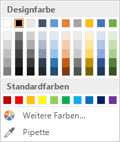
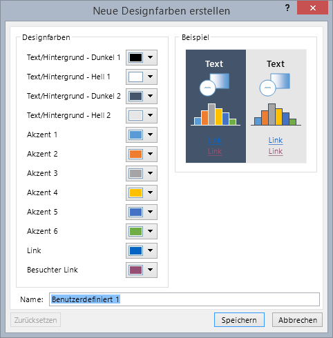
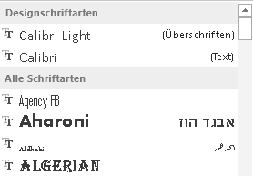
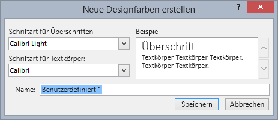
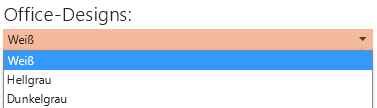
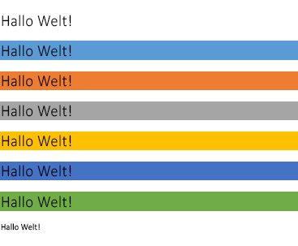
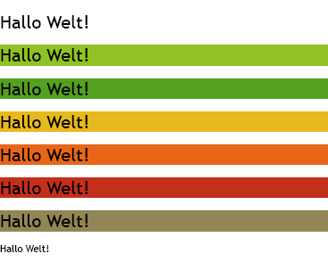
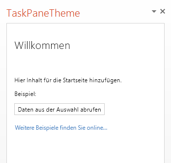
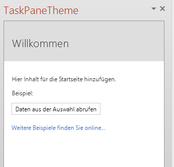

# Verwenden von Dokumentdesigns in PowerPoint-Add-Ins
Hier erfahren Sie, wie Sie das Stylesheet „OfficeThemes.css" verwenden, um Schriftarten und Farben auf Seiten Ihres Add-ins für PowerPoint definieren und dynamisch aktualisieren, damit sie mit dem aktuellen Dokument und dem Office-Design der Benutzeroberfläche übereinstimmen.

 _**Gilt für:** apps for Office | Office Add-ins | PowerPoint_


## Grundlegendes zu Office-Designs

Ein [Office-Design](https://support.office.com/de-de/Article/What-is-a-theme--7528ccc2-4327-4692-8bf5-9b5a3f2a5ef5) besteht teilweise aus einer optisch aufeinander abgestimmten Gruppe von Schriftarten und Farben, die Sie auf Präsentationen, Dokumente, Arbeitsblätter und E-Mails anwenden können. Zur Anwendung oder Anpassung des Designs einer Präsentation in PowerPoint verwenden Sie die Gruppen **Designs** und **Varianten** auf der Registerkarte **Entwurf** der Multifunktionsleiste. PowerPoint weist eine neue leere Präsentation mit dem standardmäßigen **Office-Design** zu, aber Sie können andere Designs auswählen, die auf der Registerkarte **Entwurf** zur Verfügung stehen, oder zusätzliche Designs von Office.com herunterladen bzw. eigene Designs erstellen und anpassen.

Die Verwendung von OfficeThemes.css unterstützt Sie auf zwei Arten beim Entwerfen von Add-ins, die mit PowerPoint koordiniert werden:


-  **In Inhalts-Add-ins für PowerPoint**: Verwenden Sie die Dokumentdesignklassen von OfficeThemes.css, um Schriftarten und Farben anzugeben, die mit dem Design der Präsentation übereinstimmen, in die Ihr Inhalt-Add-In eingefügt wird. Diese Schriftarten und Farben werden dynamisch aktualisiert, wenn ein Benutzer das Design der Präsentation ändert oder anpasst.
    
-  **In Aufgabenbereich-Add-ins für PowerPoint**: Verwenden Sie die Designklassen der Office-Benutzeroberfläche von OfficeThemes.css, um dieselben Schriftarten und Hintergrundfarben anzugeben, die für die Benutzeroberfläche verwendet werden, damit Ihre Aufgabenbereich-Add-ins mit den Farben von integrierten Aufgabenbereichen übereinstimmen. Diese Farben werden dynamisch aktualisiert, wenn ein Benutzer das Design der Office-Benutzeroberfläche ändert oder anpasst.
    

### Dokument-Designfarben

Jedes Office-Dokumentdesign definiert 12 Farben. Zehn dieser Farben stehen beim Festlegen von Schriftart, Hintergrund und anderen Farbeinstellungen in einer Präsentation über die Farbauswahl zur Verfügung:


Klicken Sie zum Anzeigen oder Anpassen der gesamten 12 Designfarben in PowerPoint in der Gruppe  **Varianten** auf der Registerkarte **Entwurf** auf die Dropdownliste **Mehr**. Zeigen Sie dann auf  **Farbe**, und klicken Sie auf  **Farben anpassen**, um das Dialogfeld  **Neue Designfarben erstellen** anzuzeigen:


Die ersten vier Farben sind für Text und Hintergründe. Mit hellen Farben erstellter Text ist über dunklen Farben ebenso immer lesbar, wie dunkler Text über hellen Farben. Die nächsten sechs Farben sind Akzentfarben, die über den vier potenziellen Hintergrundfarben immer sichtbar sind. Die letzten beiden Farben sind für Links und besuchte Links vorgesehen.


### Dokument-Designschriftarten

Jedes Office-Dokumentdesign definiert auch zwei Schriftarten. Eine Schriftart für Überschriften und eine für den Textkörper. PowerPoint verwendet diese Schriftarten, um automatische Textformatvorlagen zu erzeugen. Zusätzlich verwenden  **Schnellformatvorlagen**-Galerien dieselben Designschriftarten für Text und  **WordArt**. Diese beiden Schriftarten stehen als die ersten beiden Optionen zur Verfügung, wenn Sie Schriftarten über die Schriftauswahl auswählen:


Klicken Sie zum Anzeigen oder Anpassen der Designschriftarten in PowerPoint in der Gruppe  **Varianten** auf der Registerkarte **Entwurf** auf die Dropdownliste **Mehr**. Zeigen Sie dann auf  **Schriftarten**, und klicken Sie anschließend auf  **Schriftarten anpassen**, um das Dialogfeld  **Neue Designschriftarten erstellen** anzuzeigen.





### Designschriftarten und -farben der Office-Benutzeroberfläche

In Office können Sie zwischen verschiedenen vordefinierten Designs wählen, die einige der Farben und Schriftarten angeben, die in der Benutzeroberfläche aller Office-Anwendungen verwendet werden. Dazu verwenden Sie die Dropdownliste  **Datei** > **Konto** > **Office-Design** (in einer beliebigen Office-Anwendung).


OfficeThemes.css enthält Klassen, die Sie in Ihren Aufgabenbereich-Add-ins für PowerPoint verwenden können, damit diese dieselben Schriftarten und Farben verwenden. Auf diese Weise entwerfen Sie Aufgabenbereich-Add-ins, die mit der Darstellung der integrierten Aufgabenbereiche übereinstimmen.


## Verwenden von OfficeThemes.css

Durch die Verwendung der Datei OfficeThemes.css mit Ihrem Inhalts-Add-in für PowerPoint können Sie das Aussehen Ihrer Add-In durch das Design abstimmen, das auf die Präsentation angewendet wurde, mit der es ausgeführt wird. Mithilfe der Datei OfficeThemes.css für Ihre Aufgabenbereich-Add-ins für PowerPoint können Sie das Aussehen Ihrer Add-In mit den Schriftarten und Farben der Office-Benutzeroberfläche abstimmen.


### Hinzufügen von OfficeThemes.css zu Ihrem Projekt

Gehen Sie folgendermaßen vor, um die Datei  **OfficeThemes.css** zu Ihrem Add-In-Projekt hinzuzufügen und auf diese zu verweisen.


### So fügen Sie OfficeThemes.css zum Visual Studio-Projekt hinzu


1. Klicken Sie im  **Projektmappen-Explorer** mit der rechten Maustaste auf den Ordner **Inhalt** (im _**&lt;Projektname&gt;**_ - **Webprojekt**), zeigen Sie auf  **Hinzufügen**, und klicken Sie dann auf  **Stylesheet**.
    
2. Weisen Sie dem neuen Stylesheet die Bezeichnung OfficeThemes zu.
    
     >**Wichtig**  Das Stylesheet muss den Namen OfficeThemes erhalten, oder die Funktion zur dynamischen Aktualisierung der Add-in-Schriftarten und -Farben funktioniert nicht, wenn ein Benutzer das Design ändert.
3. Löschen Sie die standardmäßige  **body**-Klasse ( `body {}`) in der Datei, und kopieren Sie den folgenden CSS-Code in die Datei.
    
  ```
  /* The following classes describe the common theme information for office documents */ /* Basic Font and Background Colors for text */ .office-docTheme-primary-fontColor { color:#000000; } .office-docTheme-primary-bgColor { background-color:#ffffff; } .office-docTheme-secondary-fontColor { color: #000000; } .office-docTheme-secondary-bgColor { background-color: #ffffff; } /* Accent color definitions for fonts */ .office-contentAccent1-color { color:#5b9bd5; } .office-contentAccent2-color { color:#ed7d31; } .office-contentAccent3-color { color:#a5a5a5; } .office-contentAccent4-color { color:#ffc000; } .office-contentAccent5-color { color:#4472c4; } .office-contentAccent6-color { color:#70ad47; } /* Accent color for backgrounds */ .office-contentAccent1-bgColor { background-color:#5b9bd5; } .office-contentAccent2-bgColor { background-color:#ed7d31; } .office-contentAccent3-bgColor { background-color:#a5a5a5; } .office-contentAccent4-bgColor { background-color:#ffc000; } .office-contentAccent5-bgColor { background-color:#4472c4; } .office-contentAccent6-bgColor { background-color:#70ad47; } /* Accent color for borders */ .office-contentAccent1-borderColor { border-color:#5b9bd5; } .office-contentAccent2-borderColor { border-color:#ed7d31; } .office-contentAccent3-borderColor { border-color:#a5a5a5; } .office-contentAccent4-borderColor { border-color:#ffc000; } .office-contentAccent5-borderColor { border-color:#4472c4; } .office-contentAccent6-borderColor { border-color:#70ad47; } /* links */ .office-a { color: #0563c1; } .office-a:visited { color: #954f72; } /* Body Fonts */ .office-bodyFont-eastAsian { } /* East Asian name of the Font */ .office-bodyFont-latin { font-family:"Calibri"; } /* Latin name of the Font */ .office-bodyFont-script { } /* Script name of the Font */ .office-bodyFont-localized { font-family:"Calibri"; } /* Localized name of the Font. Corresponds to the default font of the culture currently used in Office.*/ /* Headers Font */ .office-headerFont-eastAsian { } .office-headerFont-latin { font-family:"Calibri Light"; } .office-headerFont-script { } .office-headerFont-localized { font-family:"Calibri Light"; } /* The following classes define font and background colors for Office UI themes. These classes should only be used in task pane add-ins */ /* Basic Font and Background Colors for PPT */ .office-officeTheme-primary-fontColor { color:#b83b1d; } .office-officeTheme-primary-bgColor { background-color:#dedede; } .office-officeTheme-secondary-fontColor { color:#262626; } .office-officeTheme-secondary-bgColor { background-color:#ffffff; } 
  ```

4. Wenn Sie ein anderes Tool als Visual Studio zum Erstellen Ihres Add-In verwenden, kopieren Sie den CSS-Code aus Schritt 3 in eine Textdatei, und stellen Sie sicher, dass Sie die Datei als OfficeThemes.css speichern.
    

### Verweisen auf OfficeThemes.css auf den HTML-Seiten Ihres Add-ins

Fügen Sie zur Verwendung der Datei  **OfficeThemes.css** im Add-In-Projekt ein `<link>`-Tag hinzu, das innerhalb des  `<head>`-Tags der Webseiten (z. B. HTML-, ASPX- oder PHP-Dateien) , die die Benutzeroberfläche Ihres Add-In im folgenden Format implementieren, auf die Datei  **OfficeThemes.css** verweist:


```HTML
<link href="<local_path_to_OfficeThemes.css> " rel="stylesheet" type="text/css" />
```

Gehen Sie dazu in Visual Studio folgendermaßen vor.


### So verweisen Sie im Add-in für PowerPoint auf OfficeThemes.css


1. Öffnen Sie in Visual Studio 2015 ein  **Office-Add-in**-Projekt, oder erstellen Sie ein neues Projekt.
    
2. Fügen Sie auf den HTML-Seiten, die die Benutzeroberfläche Ihres Add-In implementieren, z. B.  **Home.html** in der Standardvorlage, das folgende `<link>`-Tag innerhalb des  `<head>`-Tags hinzu, das auf die Datei  **OfficeThemes.css** verweist:
    
  ```HTML
  <link href="../../Content/OfficeThemes.css" rel="stylesheet" type="text/css" />
  ```

Wenn Sie Ihr Add-In mit einem anderen Tool als Visual Studio erstellen, fügen Sie ein  `<link>`-Tag mit demselben Format hinzu, das einen relativen Pfad zur Kopie von  **OfficeThemes.css** angibt, der mit Ihrem Add-In bereitgestellt wird.


### Verwenden der Dokument-Designklassen auf der HTML-Seite des Inhalts-Add-ins

Nachfolgend ist ein einfaches HTML-Beispiel in einem Inhalts-Add-In veranschaulicht, das die Dokument-Designklassen von der Datei OfficeTheme.css verwendet. Weitere Informationen zu den Klassen von OfficeThemes.css, die mit den im Dokumentdesign verwendeten 12 Farben und zwei Schriftarten übereinstimmen, finden Sie unter [Designklassen für Inhalts-Add-ins](#designklassen-für-inhalts-add-ins).


```HTML
<body> <div id="themeSample" class="office-docTheme-primary-fontColor "> <h1 class="office-headerFont-latin">Hello world!</h1> <h1 class="office-headerFont-latin office-contentAccent1-bgColor">Hello world!</h1> <h1 class="office-headerFont-latin office-contentAccent2-bgColor">Hello world!</h1> <h1 class="office-headerFont-latin office-contentAccent3-bgColor">Hello world!</h1> <h1 class="office-headerFont-latin office-contentAccent4-bgColor">Hello world!</h1> <h1 class="office-headerFont-latin office-contentAccent5-bgColor">Hello world!</h1> <h1 class="office-headerFont-latin office-contentAccent6-bgColor">Hello world!</h1> <p class="office-bodyFont-latin office-docTheme-secondary-fontColor">Hello world!</p> </div> </body>
```

Der Inhalts-Add-In wird zur Laufzeit wie folgt dargestellt, wenn er in eine Präsentation eingefügt wird, die das  **Office-Standarddesign** verwendet:


Wenn Sie die Präsentation ändern, dass ein anderes Design verwendet oder das Design der Präsentation angepasst wird, werden die über  **OfficeThemes.css**-Klassen angegebenen Schriftarten und Farben dynamisch aktualisiert, um mit den Schriftarten und Farben des Designs der Präsentation übereinzustimmen. Unter Verwendung des obigen HTML-Beispiels sieht die Add-In-Darstellung wie folgt aus, wenn die Präsentation, in die der Add-In eingefügt wird, das Design  **Facette** verwendet:





### Verwenden von OfficeThemes.css-Designklassen der Office-Benutzeroberfläche auf der HTML-Seite des Aufgabenbereich-Add-ins

Zusätzlich zum Dokumentdesign können Benutzer das Farbschema der Office-Benutzeroberfläche für alle Office-Anwendung mithilfe des Dropdownfelds  **Datei** > **Konto** > **Office-Design** anpassen.

Nachfolgend ist ein einfaches HTML-Beispiel in einem Aufgabenbereich-Add-In dargestellt, das OfficeTheme.css-Klassen verwendet, um die Farben für Schriftart und Hintergrund anzugeben. Weitere Informationen zu den OfficeThemes.css-Klassen, die mit den Schriftarten und Farben des Designs der Office-Benutzeroberfläche übereinstimmen, finden Sie unter [Designklassen für Aufgabenbereich-Add-ins](#designklassen-für-aufgabenbereich-add-ins).


```HTML
<body> <div id="content-header" class="office-officeTheme-primary-fontColor office-officeTheme-primary-bgColor"> <div class="padding"> <h1>Welcome</h1> </div> </div> <div id="content-main" class="office-officeTheme-secondary-fontColor office-officeTheme-secondary-bgColor"> <div class="padding"> <p>Add home screen content here.</p> <p>For example:</p> <button id="get-data-from-selection">Get data from selection</button> <p> <a target="_blank" class="office-a" href="https://go.microsoft.com/fwlink/?LinkId=276812"> Find more samples online... </a> </p> </div> </div> </body> 
```

Bei der Ausführung in PowerPoint, wobei für  **Datei** > **Konto** > **Office-Design** die Option **Weiß** festgelegt ist, wird der Aufgabenbereich-Add-In wie folgt dargestellt:


Wenn Sie  **Office-DesignTheme** in **Dunkelgrau** ändern, werden die mit **OfficeThemes.css**-Klassen angegebenen Schriftarten und Farben dynamisch aktualisiert und wie folgt dargestellt:





## OfficeTheme.css-Klassen


Die Datei OfficeThemes.css enthält zwei Gruppen von Klassen, die Sie mit Ihren Inhalts- und Aufgabenbereich-Add-ins für PowerPoint verwenden können.


### Designklassen für Inhalts-Add-ins


Die Datei OfficeThemes.css stellt Klassen bereit, die den zwei Schriftarten und 12 Farben entsprechen, die in einem Dokumentdesign verwendet werden. Diese Klassen sind für Inhalts-Add-ins für PowerPoint geeignet, sodass die Schriftarten und Farben des Add-ins mit der Präsentation abgestimmt werden, in die sie eingefügt wird.


**Designschriftarten für Inhalts-Add-ins**


|**Klasse**|**Beschreibung**|
|:-----|:-----|
| `office-bodyFont-eastAsian`|Ostasiatischer Name der Schriftart für Textkörper.|
| `office-bodyFont-latin`|Lateinischer Name der Schriftart für Textkörper. Standardeinstellung ist "Calabri"|
| `office-bodyFont-script`|Skriptname der Schriftart für Textkörper.|
| `office-bodyFont-localized`|Lokalisierter Name der Schriftart für Textkörper. Gibt den Standardschriftartnamen gemäß der derzeit in Office verwendeten Kultur an.|
| `office-headerFont-eastAsian`|Ostasiatischer Name der Schriftart für Überschriften.|
| `office-headerFont-latin`|Lateinischer Name der Schriftart für Überschriften. Standardeinstellung ist "Calabri Light"|
| `office-headerFont-script`|Skriptname der Schriftart für Überschriften.|
| `office-headerFont-localized`|Lokalisierter Name der Schriftart für Überschriften. Gibt den Standardschriftartnamen gemäß der derzeit in Office verwendeten Kultur an.|

**Designfarben für Inhalts-Add-ins**


|**Klasse**|**Beschreibung**|
|:-----|:-----|
| `office-docTheme-primary-fontColor`|Primäre Schriftartfarbe. Standardeinstellung ist "#000000"|
| `office-docTheme-primary-bgColor`|Primäre Hintergrundfarbe der Schriftart. Standardeinstellung ist "#FFFFFF"|
| `office-docTheme-secondary-fontColor`|Sekundäre Schriftartfarbe. Standardeinstellung ist "#000000"|
| `office-docTheme-secondary-bgColor`|Sekundäre Hintergrundfarbe der Schriftart. Standardeinstellung ist "#FFFFFF"|
| `office-contentAccent1-color`|Akzentfarbe 1 der Schriftart. Standardeinstellung ist "#5B9BD5"|
| `office-contentAccent2-color`|Akzentfarbe 2 der Schriftart. Standardeinstellung ist "#ED7D31"|
| `office-contentAccent3-color`|Akzentfarbe 3 der Schriftart. Standardeinstellung ist "#A5A5A5"|
| `office-contentAccent4-color`|Akzentfarbe 4 der Schriftart. Standardeinstellung ist "#FFC000"|
| `office-contentAccent5-color`|Akzentfarbe 5 der Schriftart. Standardeinstellung ist "#4472C4"|
| `office-contentAccent6-color`|Akzentfarbe 6 der Schriftart. Standardeinstellung ist "#70AD47"|
| `office-contentAccent1-bgColor`|Akzentfarbe 1 des Hintergrunds. Standardeinstellung ist "#5B9BD5"|
| `office-contentAccent2-bgColor`|Akzentfarbe 2 des Hintergrunds. Standardeinstellung ist "#ED7D31"|
| `office-contentAccent3-bgColor`|Akzentfarbe 3 des Hintergrunds. Standardeinstellung ist "#A5A5A5"|
| `office-contentAccent4-bgColor`|Akzentfarbe 4 des Hintergrunds. Standardeinstellung ist "#FFC000"|
| `office-contentAccent5-bgColor`|Akzentfarbe 5 des Hintergrunds. Standardeinstellung ist "#4472C4"|
| `office-contentAccent6-bgColor`|Akzentfarbe 6 des Hintergrunds. Standardeinstellung ist "#70AD47"|
| `office-contentAccent1-borderColor`|Akzentfarbe 1 des Rahmens. Standardeinstellung ist "#5B9BD5"|
| `office-contentAccent2-borderColor`|Akzentfarbe 2 des Rahmens. Standardeinstellung ist "#ED7D31"|
| `office-contentAccent3-borderColor`|Akzentfarbe 3 des Rahmens. Standardeinstellung ist "#A5A5A5"|
| `office-contentAccent4-borderColor`|Akzentfarbe 4 des Rahmens. Standardeinstellung ist "#FFC000"|
| `office-contentAccent5-borderColor`|Akzentfarbe 5 des Rahmens. Standardeinstellung ist "#4472C4"|
| `office-contentAccent6-borderColor`|Akzentfarbe 6 des Rahmens. Standardeinstellung ist "#70AD47"|
| `office-a`|Linkfarbe. Standardeinstellung ist "#0563C1"|
| `office-a:visited`|Farbe für besuchte Links. Standardeinstellung ist "#954F72"|
Die folgenden Screenshots zeigen Beispiele aller Designfarbklassen (mit Ausnahme der beiden Linkfarben), die auf Add-In-Text angewendet werden, wenn das Office-Standarddesign verwendet wird.


### Designklassen für Aufgabenbereich-Add-ins


Die Datei OfficeThemes.css stellt Klassen bereit, die den vier Farben entsprechen, die zu Schriftarten und Hintergründen zugewiesen werden, die vom Benutzeroberflächendesign der Office-Anwendung verwendet werden. Diese Klassen sind für Aufgabenbereich-Add-ins für PowerPoint geeignet, sodass die Farben des Add-ins mit den anderen integrierten Aufgabenbereichen in Office abgestimmt werden.


**Designschriftarten- und Hintergrundfarben für Aufgabenbereich-Add-ins**


|**Klasse**|**Beschreibung**|
|:-----|:-----|
| `office-officeTheme-primary-fontColor`|Primäre Schriftartfarbe. Standardeinstellung : "000000"|
| `office-officeTheme-primary-bgColor`|Primäre Hintergrundfarbe. Standardeinstellung: "#DEDEDE"|
| `office-officeTheme-secondary-fontColor`|Sekundäre Schriftartfarbe. Standardeinstellung: "#262626"|
| `office-officeTheme-secondary-bgColor`|Sekundäre Hintergrundfarbe. Standardeinstellung: "#FFFFFF"|

## Zusätzliche Ressourcen


- [Erstellen von Inhalts- und Aufgabenbereich-Add-Ins für PowerPoint](../powerpoint/powerpoint-add-ins.md)
    
