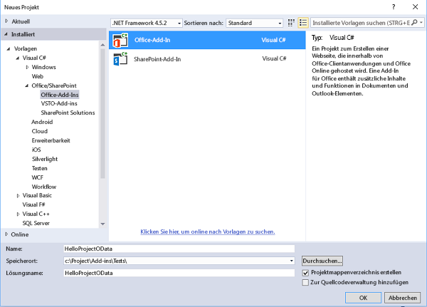
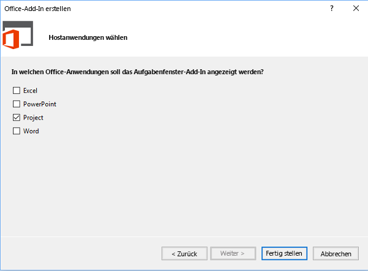
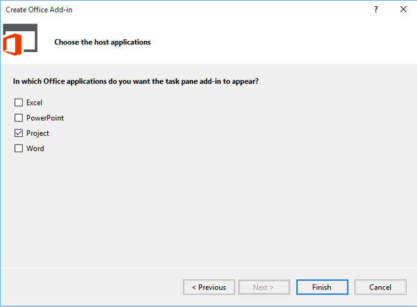
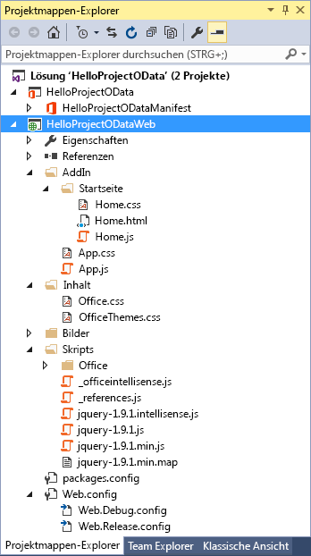
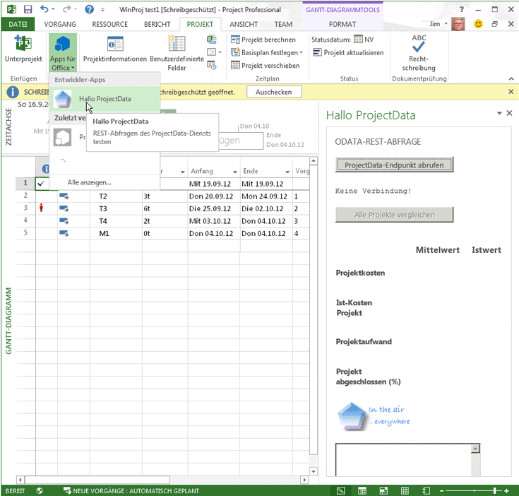
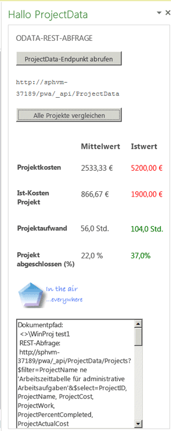
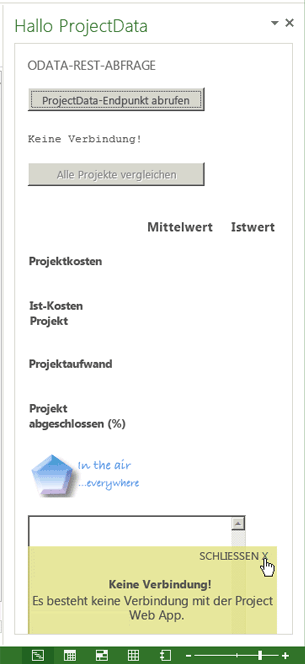
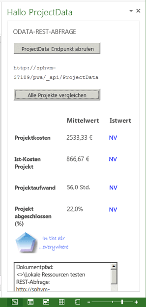

# Erstellen eines Project-Add-ins, das REST mit einem lokalen Project Server-OData-Dienst verwendet
Erstellen Sie ein Aufgabenbereich-Add-In für Project Professional 2013, das Kosten- und Arbeitsdaten im aktiven Projekt mit den Durchschnittswerten für alle Projekte in der aktuellen Project Web App-Instanz vergleicht. Das Add-In greift mithilfe von REST und der jQuery-Bibliothek auf den  **ProjectData**-OData-Berichterstellungsdienst in Project Server 2013 zu. 

 _**Gilt für:** apps for Office | Office Add-ins | Project_

Der Code in diesem Artikel basiert auf einem von Saurabh Sanghvi und Arvind Iyer (Microsoft Corporation) entwickelten Beispiel.

## Voraussetzungen zum Erstellen eines Aufgabenbereich-Add-ins, das Project Server-Berichtsdaten liest


Im Folgenden finden Sie die Voraussetzungen zum Erstellen eines Project- Aufgabenbereich-Add-ins, das den  **ProjectData**-Dienst einer Project Web App-Instanz in einer lokalen Project Server 2013-Installation liest:


- Stellen Sie sicher, dass Sie die neuesten Service Packs und Windows-Updates auf dem lokalen Entwicklungscomputer installiert haben. Als Betriebssystem kann Windows 7, Windows 8, Windows Server 2008 oder Windows Server 2012 verwendet werden.
    
- Project Professional 2013 muss eine Verbindung mit Project Web App herstellen. Auf dem Entwicklungscomputer muss Project Professional 2013 installiert sein, damit das Debuggen mit  **F5** mit Visual Studio aktiviert werden kann.
    
     >**Hinweis**  Von Project Standard 2013 können ebenfalls Aufgabenbereich-Add-ins gehostet werden, die Anmeldung bei Project Web App ist jedoch nicht möglich.
- Visual Studio 2015 mit Office-Entwicklertools für Visual Studio beinhaltet Vorlagen zum Erstellen von Office- und SharePoint-Add-Ins. Überprüfen Sie, ob die aktuelle Version von Office Developer Tools installiert ist. Informationen finden Sie im Abschnitt  _Tools_ auf der Seite [Downloads für Office-Add-ins und SharePoint](http://msdn.microsoft.com/de-de/office/apps/fp123627.aspx).
    
     >**Hinweis**  Napa kann nicht zum Erstellen von Project 2013-Aufgabenbereich-Add-ins verwendet werden.
- Die Prozeduren und Codebeispiele in diesem Artikel greifen auf den  **ProjectData**-Dienst von Project Server 2013 in einer lokalen Domäne zu. Die jQuery-Methoden in diesem Artikel funktionieren nicht mit Project Online.
    
    Stellen Sie sicher, dass vom Entwicklungscomputer auf den  **ProjectData**-Dienst zugegriffen werden kann.
    

### Prozedur 1. So überprüfen Sie, ob Zugriff auf den ProjectData-Dienst besteht


1. Damit der Browser die XML-Daten aus einer REST-Abfrage direkt anzeigen kann, deaktivieren Sie die Feedleseansicht. Informationen zur Vorgehensweise in Internet Explorer finden Sie in der 1. Prozedur im Schritt 4 auf der Seite [Abfragen von OData-feeds für Project-Berichtsdaten](http://msdn.microsoft.com/library/3eafda3b-f006-48be-baa6-961b2ed9fe01%28Office.15%29.aspx).
    
2. Fragen Sie den  **ProjectData**-Dienst im Browser mit der folgenden URL ab:
    
  ```HTML
  http://ServerName /ProjectServerName /_api/ProjectData
  ```


    Beispiel: Wenn die Project Web App-Instanz  `http://MyServer/pwa` ist, zeigt der Browser die folgenden Ergebnisse:
    


  ```XML
  <?xml version="1.0" encoding="utf-8"?>
<service xml:base="http://myserver/pwa/_api/ProjectData/" 
        xmlns="http://www.w3.org/2007/app" 
        xmlns:atom="http://www.w3.org/2005/Atom">
    <workspace>
        <atom:title>Default</atom:title>
        <collection href="Projects">
            <atom:title>Projects</atom:title>
        </collection>
        <collection href="ProjectBaselines">
            <atom:title>ProjectBaselines</atom:title>
        </collection>
        <!-- ... and 33 more collection elements -->
    </workspace>
</service>
  ```


    Möglicherweise müssen Sie Ihre Netzwerkanmeldeinformationen eingeben, um die Ergebnisse anzeigen zu können. Wenn im Browser "Fehler 403, Zugriff verweigert" angezeigt wird, besitzen Sie entweder keine Anmeldeberechtigung für die Project Web App-Instanz, oder es liegt ein Netzwerkproblem vor, für das Unterstützung von einem Administrator erforderlich ist.
    

## Erstellen eines Project-Aufgabenbereich-Add-ins mithilfe von Visual Studio


Office-Entwicklertools für Visual Studio enthält eine Vorlage für Aufgabenbereich-Add-ins für Project 2013. Wenn Sie eine Projektmappe mit dem Namen  **HelloProjectOData** erstellen, enthält sie die folgenden zwei Visual Studio-Projekte:


- Das Add-in-Projekt erhält den Namen der Projektmappe. Es enthält die XML-Manifestdatei für das Add-in und ist auf .NET Framework 4.5 ausgerichtet. In der 3. Prozedur sind die Schritte zum Ändern des Manifests für das  **HelloProjectOData**-Add-in dargestellt.
    
- Das Webprojekt heißt  **HelloProjectODataWeb**. Es enthält die Webseiten, JavaScript-Dateien, CSS-Dateien, Bilder, Verweise und Konfigurationsdateien für den Webinhalt im Aufgabenbereich. Das Webprojekt ist auf .NET Framework 4 ausgerichtet. In Prozedur 4 und Prozedur 5 wird veranschaulicht, wie die Dateien im Webprojekt angepasst werden, um die Funktionalität des Add-ins  **HelloProjectOData** zu erstellen.
    

### Prozedur 2: So erstellen Sie das HelloProjectOData-Add-in für Project


1. Führen Sie Visual Studio 2015 als Administrator aus, und wählen Sie dann auf der Startseite  **Neues Projekt** aus.
    
2. Erweitern Sie im Dialogfeld  **Neues Projekt** die Knoten **Vorlagen**,  **Visual C#** und **Office/SharePoint**, und wählen Sie dann  **Office-Add-Ins** aus. Wählen Sie oben im mittleren Bereich in der Dropdownliste der Zielframeworks **.NET Framework 5.2** und anschließend **Office-Add-In** aus (siehe folgenden Screenshot).
    
3. Wählen Sie zum Ablegen beider Visual Studio-Projekte im selben Verzeichnis  **Projektmappenverzeichnis erstellen** aus, und navigieren Sie zum gewünschten Speicherort.
    
4. Geben Sie im Feld  **Name** die BezeichnungHelloProjectOData ein, und wählen Sie dann **OK** aus.
    
    **Erstellen eines Office-Add-Ins**

    

5. Wählen Sie im Dialogfeld  **Add-In-Typ wählen** die Option **Aufgabenbereich**, und wählen Sie **Weiter** (Siehe nächsten Screenshot).
    
    **Auswählen des Typs des zu erstellenden Add-Ins**

    

6. Deaktivieren Sie im Dialogfeld  **Hostanwendungen auswählen** alle Kontrollkästchen mit Ausnahme von **Projekt** (siehe folgenden Screenshot), und wählen Sie dann **Fertig stellen** aus.
    
    **Auswählen der Hostanwendung**

    
    Von Visual Studio werden die Projekte  **HelloProjectOdata** und **HelloProjectODataWeb** erstellt.
    
Im Ordner  **AddIn** (siehe folgenden Screenshot) ist die Datei „App.css" für benutzerdefinierte CSS-Stile. Die Datei „Home.html" im Unterordner **Start** enthält Verweise auf CSS-Dateien und die JavaScript-Dateien, die das Add-In verwendet, und den HTML5-Inhalt für das Add-In. Die Datei „Home.js" enthält den benutzerdefinierten JavaScript-Code. Der Ordner **Skripts** enthält die jQuery-Bibliotheksdateien. Im Unterordner **Office** sind die JavaScript-Bibliotheken wie „office.js" und „project-15.js" und die Sprachbibliotheken für Standardzeichenfolgen in Office-Add-Ins enthalten. Die Datei „Office.css" im Ordner **Inhalt** enthält die Standardstile für alle Office-Add-Ins.

**Anzeigen der Standarddateien für das Webprojekt im Projektmappen-Explorer**



Die Datei „HelloProjectOData.xml" stellt das Manifest für das  **HelloProjectOData**-Projekt dar. Sie können das Manifest optional ändern, um eine Beschreibung des Add-in, einen Verweis auf ein Symbol, Informationen für zusätzliche Sprachen und andere Einstellungen hinzuzufügen. In Prozedur 3 werden lediglich der Anzeigename und die Beschreibung des Add-ins geändert. Außerdem wird ein Symbol hinzugefügt.

Weitere Informationen zum Manifest finden Sie unter [XML-Manifest für Office-Add-Ins](../../docs/overview/add-in-manifests.md) und[Schemareferenz für Office-Add-in-Manifeste (v1. 1)](http://msdn.microsoft.com/library/7e0cadc3-f613-8eb9-57ef-9032cbb97f92%28Office.15%29.aspx).


### Prozedur 3: So ändern Sie das Add-in-Manifest


1. Öffnen Sie in Visual Studio die Datei "HelloProjectOData.xml".
    
2. Der Standardanzeigename ist der Name des Visual Studio-Projekts ("HelloProjectOData"). Ändern Sie beispielsweise den Standardwert des  **DisplayName**-Elements zu "Hallo ProjectData".
    
3. Die Standardbeschreibung lautet „HelloProjectODatHelloProjectOData". Ändern Sie beispielsweise den Standardwert des Description-Elements zu "Test-REST-Abfragen des ProjectData-Diensts".
    
4. Fügen Sie ein Symbol hinzu, das in der Dropdownliste  **Office-Add-ins** auf der Registerkarte **PROJEKT** des Menübands angezeigt wird. Sie können eine Symboldatei in der Visual Studio-Projektmappe hinzufügen oder eine URL für ein Symbol verwenden. In den folgenden Schritten wird erläutert, wie Sie eine Symboldatei zur Visual Studio-Projektmappe hinzufügen:
    
1. Navigieren Sie im  **Projektmappen-Explorer** zum Ordner namensImages.
    
2. Damit das Symbol in der Dropdownliste  **Office-Add-ins** angezeigt wird, muss das Symbol ein Format von 32 x 32 Pixeln aufweisen. Installieren Sie beispielsweise das SDK für Project 2013, und wählen Sie dann den Ordner **Images** aus, und fügen Sie die folgende Datei aus dem SDK hinzu: `…\Samples\Apps\HelloProjectOData\HelloProjectODataWeb\Images\NewIcon.png`
    
    Alternativ können Sie ein eigenes Symbol mit 32 x 32 Pixeln verwenden oder das folgende Bild in eine Datei namens "NewIcon.png" kopieren und diese Datei dem Ordner  `HelloProjectODataWeb\Images` hinzufügen:


    
5. Fügen Sie im Manifest "HelloProjectOData.xml" ein  **IconUrl**-Element unter dem  **Description**-Element hinzu. Dabei ist der Wert der Symbol-URL der relative Pfad zur Datei mit dem Symbol mit 32x32. Fügen Sie beispielsweise die folgende Zeile hinzu:
    
  ```XML
  <IconUrl DefaultValue="~remoteAppUrl/Images/NewIcon.png" />
  ```

Die Manifestdatei "HelloProjectOData.xml" enthält nun Folgendes (der  **Id**-Wert weicht ab):

```XML
<?xml version="1.0" encoding="UTF-8"?>
<OfficeApp xmlns="http://schemas.microsoft.com/office/appforoffice/1.1" 
           xmlns:xsi="http://www.w3.org/2001/XMLSchema-instance" xsi:type="TaskPaneApp">
  <Id>c512df8d-a1c5-4d74-8a34-d30f6bbcbd82 </Id>
  <Version>1.0</Version>
  <ProviderName> [Provider name]</ProviderName>
  <DefaultLocale>en-US</DefaultLocale>
  <DisplayName DefaultValue="Hello ProjectData" />
  <Description DefaultValue="Test REST queries of the ProjectData service"/>
  <IconUrl DefaultValue="~remoteAppUrl/Images/NewIcon.png" />

  <Hosts>
    <Host Name="Project" />
  </Hosts>
  <DefaultSettings>
    <SourceLocation DefaultValue="~remoteAppUrl/AddIn/Home/Home.html" />
  </DefaultSettings>
  <Permissions>ReadWriteDocument</Permissions>
</OfficeApp>
```


## Erstellen des HTML-Inhalts für das HelloProjectOData-Add-in


Das  **HelloProjectOData**-Add-In ist ein Beispiel, das Debugging- und Fehlerausgabe enthält. Es ist nicht für Produktionszwecke gedacht. Bevor Sie den Code für den HTML-Inhalt erstellen, entwerfen Sie die Benutzeroberfläche für das Add-In, und führen Sie die JavaScript-Funktionen auf, die mit dem HTML-Code interagieren. Weitere Informationen finden Sie unter [Designrichtlinien für Office-Add-Ins](../add-in-design.md). 

Der Add-in-Anzeigename wird oben im Aufgabenbereich angezeigt. Beim Anzeigenamen handelt es sich um den Wert des  **DisplayName**-Elements im Manifest. Das  **body**-Element in der Datei „HelloProjectOData.html" enthält die anderen Benutzeroberflächenelemente:


- Ein Untertitel gibt die allgemeine Funktion oder den allgemeinen Typ des Vorgangs an, z. B.  **ODATA-REST-ABFRAGE**.
    
- Mit der Schaltfläche  **ProjectData-Endpunkt abrufen** wird die Funktion **setOdataUrl** zum Abrufen des Endpunkts des **ProjectData**-Diensts und Anzeigen des Endpunkts in einem Textfeld aufgerufen. Ist Project nicht mit Project Web App verbunden, wird von dem Add-in ein Fehlerhandler zum Anzeigen einer Popupmeldung aufgerufen.
    
- Die Schaltfläche  **Alle Projekte vergleichen** ist deaktiviert, bis das Add-in einen gültigen OData-Endpunkt erhält. Wenn Sie auf die Schaltfläche klicken, wird die Funktion **retrieveOData** aufgerufen. Diese Funktion verwendet eine REST-Abfrage zum Abrufen von Kosten- und Arbeitsdaten des Projekts aus dem **ProjectData**-Dienst.
    
- In einer Tabelle werden die durchschnittlichen Werte für Projektkosten, Ist-Kosten, Arbeit und abgeschlossenen Prozentsatz angezeigt. Die Tabelle vergleicht darüber hinaus die derzeitigen Werte des aktuellen Projekts mit dem Durchschnitt. Ist der aktuelle Wert höher als der Durchschnitt für alle Projekte, wird der Wert rot dargestellt. Ist der aktuelle Wert niedriger als der Durchschnitt, wird er grün dargestellt. Ist der aktuelle Wert nicht verfügbar, wird in der Tabelle  **NV** in Blau angezeigt.
    
    Mit der Funktion  **retrieveOData** wird die Funktion **parseODataResult** aufgerufen, von der Werte für die Tabelle berechnet und angezeigt werden.
    
     >**Hinweis**  In diesem Beispiel werden die Kosten- und Arbeitsdaten für das aktive Projekt aus den veröffentlichen Werten abgeleitet. Wenn Sie Werte in Project ändern, erhält der  **ProjectData**-Dienst diese Änderungen erst mit Veröffentlichung des Projekts.

### Prozedur 4. So erstellen Sie den HTML-Inhalt


1. Fügen Sie im  **head**-Element der Datei „Home.html" zusätzliche  **link**-Elemente für von dem Add-In verwendete CSS-Dateien hinzu. Die Visual Studio-Projektvorlage enthält eine Verknüpfung zur Datei „App.css", die für benutzerdefinierte CSS-Stile verwendet werden kann.
    
2. Fügen Sie zusätzliche  **script**-Elemente für von dem Add-in verwendete JavaScript-Bibliotheken hinzu. Die Projektvorlage enthält Verknüpfungen zu den Dateien „jQuery- _[Version]_.js", „office.js" und „MicrosoftAjax.js" im Ordner  **Scripts**.
    
     >**Hinweis**  Ändern Sie vor der Bereitstellung des Add-ins den Verweis auf „office.js" zum Verweis auf das Netzwerk für die Inhaltsübermittlung (Content Delivery Network, CDN). Der CDN-Verweis gibt die aktuelle Version an und bietet eine bessere Leistung.

    Das  **HelloProjectOData**-Add-in verwendet außerdem die Datei „SurfaceErrors.js", die Fehler in einer Popupmeldung anzeigt. Sie können den Code aus dem Abschnitt  _Robuste Programmierung_ unter [Erstellen des ersten Aufgabenbereich-Add-ins für Project 2013 mit einem Text-Editor](../../docs/project/create-your-first-task-pane-add-in-for-project-by-using-a-text-editor.md) kopieren und anschließend eine SurfaceErrors.js-Datei im Ordner **Scripts\Office** des **HelloProjectODataWeb**-Projekts hinzufügen.
    
    Im Folgenden finden Sie den aktualisierten HTML-Code für das  **head**-Element mit der zusätzlichen Zeile für die Datei "SurfaceErrors.js":
    


  ```HTML
  <!DOCTYPE html>
<html>
<head>
  <meta charset="UTF-8" />
  <meta http-equiv="X-UA-Compatible" content="IE=Edge" />
  <title>Test ProjectData Service</title>

  <link rel="stylesheet" type="text/css" href="../Content/Office.css" />

  <!-- Add your CSS styles to the following file -->
  <link rel="stylesheet" type="text/css" href="../Content/App.css" />

  <!-- Use the CDN reference to the mini-version of jQuery when deploying your add-in. -->
  <!--<script src="http://ajax.aspnetcdn.com/ajax/jquery/jquery-1.9.0.min.js"></script> -->
  <script src="../Scripts/jquery-1.7.1.js"></script>

  <!-- Use the CDN reference to office.js when deploying your add-in. -->
  <!--<script src="https://appsforoffice.microsoft.com/lib/1.0/hosted/office.js"></script>-->

  <!-- Use the local script references for Office.js to enable offline debugging -->
  <script src="../Scripts/Office/1.0/MicrosoftAjax.js"></script>
  <script src="../Scripts/Office/1.0/Office.js"></script>

  <!-- Add your JavaScript to the following files -->
  <script src="../Scripts/HelloProjectOData.js"></script>
  <script src="../Scripts/SurfaceErrors.js"></script>
</head>
<body>
<!-- See the code in Step 3. -->
</body>
</html>
  ```

3. Löschen Sie im  **body**-Element den vorhandenen Code aus der Vorlage, und fügen Sie dann den Code für die Benutzeroberfläche hinzu. Soll ein Element mit Daten gefüllt oder durch eine jQuery-Anweisung bearbeitet werden, muss das Element ein eindeutiges  **id**-Attribut enthalten. Im folgenden Code sind die  **id**-Attribute für die von jQuery-Funktionen verwendeten Elemente  **button**,  **span** und **td** (Definition der Tabellenzelle) fett formatiert.
    
    Im folgenden HTML-Code wird eine Grafik, z. B. ein Unternehmenslogo, hinzugefügt. Sie können ein beliebiges Logo verwenden oder die Datei "NewLogo.png" aus dem heruntergeladenen SDK für Project 2013 kopieren und die Datei anschließend mit dem  **Projektmappen-Explorer** dem Ordner `HelloProjectODataWeb\Images` hinzufügen.
    


  ```HTML
  <body>
  <div id="SectionContent">
    <div id="odataQueries">
      ODATA REST QUERY
    </div>
    <div id="odataInfo">
      <button class="button-wide" onclick="setOdataUrl()">Get ProjectData Endpoint</button>
      <br /><br />
      <span class="rest" id="projectDataEndPoint">Endpoint of the 
        <strong>ProjectData</strong> service</span>
      <br />
    </div>
    <div id="compareProjectData">
      <button class="button-wide" disabled="disabled" id="compareProjects"
        onclick="retrieveOData()">Compare All Projects</button>
      <br />
    </div>
  </div>
  <div id="corpInfo">
    <table class="infoTable" aria-readonly="True" style="width: 100%;">
      <tr>
        <td class="heading_leftCol"></td>
        <td class="heading_midCol"><strong>Average</strong></td>
        <td class="heading_rightCol"><strong>Current</strong></td>
      </tr>
      <tr>
        <td class="row_leftCol"><strong>Project Cost</strong></td>
        <td class="row_midCol" id="AverageProjectCost">&amp;nbsp;</td>
        <td class="row_rightCol" id="CurrentProjectCost">&amp;nbsp;</td>
      </tr>
      <tr>
        <td class="row_leftCol"><strong>Project Actual Cost</strong></td>
        <td class="row_midCol" id="AverageProjectActualCost">&amp;nbsp;</td>
        <td class="row_rightCol" id="CurrentProjectActualCost">&amp;nbsp;</td>
      </tr>
      <tr>
        <td class="row_leftCol"><strong>Project Work</strong></td>
        <td class="row_midCol" id="AverageProjectWork">&amp;nbsp;</td>
        <td class="row_rightCol" id="CurrentProjectWork">&amp;nbsp;</td>
      </tr>
      <tr>
        <td class="row_leftCol"><strong>Project % Complete</strong></td>
        <td class="row_midCol" id="AverageProjectPercentComplete">&amp;nbsp;</td>
        <td class="row_rightCol" id="CurrentProjectPercentComplete">&amp;nbsp;</td>
      </tr>
    </table>
  </div>
  
  <br />
  <textarea id="odataText" rows="12" cols="40"></textarea>
</body>
  ```


## Erstellen des JavaScript-Codes für das Add-in


Die Vorlage für ein Project-Aufgabenbereich-Add-in enthält Standardinitialisierungscode, mit dem grundlegende Aktionen zum Abrufen und Festlegen für Daten in einem Dokument für ein typisches Office 2013-Add-in veranschaulicht werden sollen. Da Project 2013 keine Aktionen unterstützt, mit denen in das aktive Projekt geschrieben wird, und das  **HelloProjectOData**-Add-in nicht die  **getSelectedDataAsync**-Methode verwendet, können Sie das Skript in der Funktion  **Office.initialize** sowie die Funktionen **setData** und **getData** in der Standarddatei „HelloProjectOData.js" löschen.

JavaScript enthält globale Konstanten für die REST-Abfrage und in verschiedenen Funktionen verwendete globale Variablen. Mit der Schaltfläche  **ProjectData-Endpunkt abrufen** wird die Funktion **setOdataUrl** abgerufen, die die globalen Variablen initialisiert und festlegt, ob zwischen Project und Project Web App eine Verbindung hergestellt wird.

Der Rest der Datei "HelloProjectOData.js" enthält zwei Funktionen: Die Funktion  **retrieveOData** wird aufgerufen, wenn der Benutzer **Alle Projekte vergleichen** auswählt. Die Funktion **parseODataResult** berechnet Durchschnittswerte und füllt dann die Vergleichstabelle mit Werten, die für Farben und Einheiten formatiert sind.


### Prozedur 5. So erstellen Sie den JavaScript-Code


1. Löschen Sie den gesamten Code in der Standarddatei "HelloProjectOData.js", und fügen Sie dann die globalen Variablen und die Funktion  **Office.initialize** hinzu. Variablennamen in Großbuchstaben sind Konstanten. Sie werden später mit der Variablen **_pwa** zum Erstellen der REST-Abfrage in diesem Beispiel verwendet.
    
  ```
  var PROJDATA = "/_api/ProjectData";
var PROJQUERY = "/Projects?";
var QUERY_FILTER = "$filter=ProjectName ne 'Timesheet Administrative Work Items'";
var QUERY_SELECT1 = "&amp;$select=ProjectId, ProjectName";
var QUERY_SELECT2 = ", ProjectCost, ProjectWork, ProjectPercentCompleted, ProjectActualCost";
var _pwa;           // URL of Project Web App.
var _projectUid;    // GUID of the active project.
var _docUrl;        // Path of the project document.
var _odataUrl = ""; // URL of the OData service: http[s]://ServerName /ProjectServerName /_api/ProjectData

// The initialize function is required for all add-ins.
Office.initialize = function (reason) {
    // Checks for the DOM to load using the jQuery ready function.
    $(document).ready(function () {
        // After the DOM is loaded, app-specific code can run.
    });
}


  ```

2. Fügen Sie  **setOdataUrl** und verwandte Funktionen hinzu. Mit der Funktion **setOdataUrl** werden **getProjectGuid** und **getDocumentUrl** zum Initialisieren der globalen Variablen aufgerufen. In der [getProjectFieldAsync-Methode](http://msdn.microsoft.com/de-de/library/d35b19ff-c403-4db1-8239-7dd67ee29d72%28Office.15%29.aspx) aktiviert die anonyme Funktion für den _callback_-Parameter die Schaltfläche  **Alle Projekte vergleichen** durch Verwendung der **removeAttr**-Methode in der jQuery-Bibliothek und zeigt dann die URL des  **ProjectData**-Diensts an. Ist Project nicht mit Project Web App verbunden, wird von der Funktion ein Fehler ausgegeben, der als Popupmeldung angezeigt wird. Die Datei "SurfaceErrors.js" enthält die  **throwError**-Methode.
    
     >**Hinweis**  Wenn Sie Visual Studio auf dem Computer mit Project Server ausführen, müssen Sie zur Verwendung des Debuggens mit  **F5** den Code nach der Zeile auskommentieren, die die globale **_pwa**-Variable initialisiert. Um die Verwendung der jQuery- **ajax**-Methode beim Debuggen auf dem Project Server-Computer zu ermöglichen, müssen Sie den  **localhost**-Wert für die PWA-URL festlegen.Wird Visual Studio auf einem Remotecomputer ausgeführt, ist die  **localhost**-URL nicht erforderlich. Kommentieren Sie vor dem Bereitstellen des Add-ins diesen Code aus.

  ```
  function setOdataUrl() {
    Office.context.document.getProjectFieldAsync(
        Office.ProjectProjectFields.ProjectServerUrl,
        function (asyncResult) {
            if (asyncResult.status == Office.AsyncResultStatus.Succeeded) {
                _pwa = String(asyncResult.value.fieldValue);

                // If you debug with Visual Studio on a local Project Server computer, 
                // uncomment the following lines to use the localhost URL.
                //var localhost = location.host.split(":", 1);
                //var pwaStartPosition = _pwa.lastIndexOf("/");
                //var pwaLength = _pwa.length - pwaStartPosition;
                //var pwaName = _pwa.substr(pwaStartPosition, pwaLength);
                //_pwa = location.protocol + "//" + localhost + pwaName;

                if (_pwa.substring(0, 4) == "http") {
                    _odataUrl = _pwa + PROJDATA;
                    $("#compareProjects").removeAttr("disabled");
                    getProjectGuid();
                }
                else {
                    _odataUrl = "No connection!";
                    throwError(_odataUrl, "You are not connected to Project Web App.");
                }
                getDocumentUrl();
                $("#projectDataEndPoint").text(_odataUrl);
            }
            else {
                throwError(asyncResult.error.name, asyncResult.error.message);
            }
        }
    );
}

// Get the GUID of the active project.
function getProjectGuid() {
    Office.context.document.getProjectFieldAsync(
        Office.ProjectProjectFields.GUID,
        function (asyncResult) {
            if (asyncResult.status == Office.AsyncResultStatus.Succeeded) {
                _projectUid = asyncResult.value.fieldValue;
            }
            else {
                throwError(asyncResult.error.name, asyncResult.error.message);
            }
        }
    );
}

// Get the path of the project in Project web app, which is in the form <>\ProjectName .
function getDocumentUrl() {
    _docUrl = "Document path:\r\n" + Office.context.document.url;
}
  ```

3. Fügen Sie die Funktion  **retrieveOData** hinzu. Diese Funktion verkettet Werte für die REST-Abfrage und ruft dann die Funktion **ajax** in "jQuery" auf, um die angeforderten Daten vom **ProjectData**-Dienst abzurufen. Die Variable  **support.cors** ermöglicht CORS (Cross-Origin Resource Sharing) mit der Funktion **ajax**. Fehlt die  **support.cors**-Anweisung oder ist sie auf  **false** festgelegt, wird von der Funktion **ajax** der Fehler **Keine Übertragung** zurückgegeben.
    
     >**Hinweis**  Der folgende Code unterstützt eine lokale Installation von Project Server 2013. Für Project Online können Sie "OAuth" für die tokenbasierte Authentifizierung verwenden. Weitere Informationen finden Sie unter [Behandeln von Richtlinieneinschränkungen aufgrund desselben Ursprungs in Office-Add-ins](../../docs/develop/addressing-same-origin-policy-limitations.md).

    Im  **ajax**-Aufruf können Sie entweder den Parameter  _headers_ oder den Parameter _beforeSend_ verwenden. Beim Parameter _complete_ handelt es sich um eine anonyme Funktion, daher befindet er sich im selben Bereich wie die Variablen in **retrieveOData**. Die Funktion für den  _complete_-Parameter zeigt Ergebnisse im  **odataText**-Steuerelement an und ruft darüber hinaus die  **parseODataResult**-Methode auf, um die JSON-Antwort zu analysieren und anzuzeigen. Der  _error_-Parameter gibt die benannte Funktion  **getProjectDataErrorHandler** an, die eine Fehlermeldung ins **odataText**-Steuerelement schreibt und ebenfalls die  **throwError**-Methode zum Anzeigen einer Popupmeldung verwendet.
    


  ```
  /****************************************************************
* Functions to get and parse the Project Server reporting data.
*****************************************************************/

// Get data about all projects on Project Server, 
// by using a REST query with the ajax method in jQuery.
function retrieveOData() {
    var restUrl = _odataUrl + PROJQUERY + QUERY_FILTER + QUERY_SELECT1 + QUERY_SELECT2;
    var accept = "application/json; odata=verbose";
    accept.toLocaleLowerCase();

    // Enable cross-origin scripting (required by jQuery 1.5 and later).
    // This does not work with Project Online.
    $.support.cors = true;

    $.ajax({
        url: restUrl,
        type: "GET",
        contentType: "application/json",
        data: "",      // Empty string for the optional data.
        //headers: { "Accept": accept },
        beforeSend: function (xhr) {
            xhr.setRequestHeader("ACCEPT", accept);
        },
        complete: function (xhr, textStatus) {
            // Create a message to display in the text box.
            var message = "\r\ntextStatus: " + textStatus +
                "\r\nContentType: " + xhr.getResponseHeader("Content-Type") +
                "\r\nStatus: " + xhr.status +
                "\r\nResponseText:\r\n" + xhr.responseText;

            // xhr.responseText is the result from an XmlHttpRequest, which 
            // contains the JSON response from the OData service.
            parseODataResult(xhr.responseText, _projectUid);

            // Write the document name, response header, status, and JSON to the odataText control.
            $("#odataText").text(_docUrl);
            $("#odataText").append("\r\nREST query:\r\n" + restUrl);
            $("#odataText").append(message);

            if (xhr.status != 200 &amp;&amp; xhr.status != 1223 &amp;&amp; xhr.status != 201) {
                $("#odataInfo").append("<div>" + htmlEncode(restUrl) + "</div>");
            }
        },
        error: getProjectDataErrorHandler
    });
}

function getProjectDataErrorHandler(data, errorCode, errorMessage) {
    $("#odataText").text("Error code: " + errorCode + "\r\nError message: \r\n"
      + errorMessage);
    throwError(errorCode, errorMessage);
}
  ```

4. Fügen Sie die  **parseODataResult**-Methode hinzu, mit der die JSON-Antwort aus dem OData-Dienst deserialisiert und verarbeitet wird. Die  **parseODataResult**-Methode berechnet Durchschnittswerte der Kosten- und Arbeitsdaten mit einer Genauigkeit von bis zu zwei Dezimalstellen, formatiert Werte mit der entsprechenden Farbe und fügt eine Maßeinheit ( **$**,  **Std.** oder **%**) hinzu. Anschließend werden die Werte in angegebenen Tabellenzellen angezeigt.
    
    Stimmt die GUID des aktiven Projekts mit dem Wert  **ProjectId** überein, wird für die Variable **myProjectIndex** der Projektindex festgelegt. Gibt **myProjectIndex** an, dass das aktive Projekt in Project Server veröffentlicht wird, formatiert die **parseODataResult**-Methode Kosten- und Arbeitsdaten für das Projekt und zeigt diese Daten an. Wird das aktive Projekt nicht veröffentlicht, werden die Werte für das aktive Projekt als  **NV** in Blau angezeigt.
    


  ```
  // Calculate the average values of actual cost, cost, work, and percent complete   
// for all projects, and compare with the values for the current project.
function parseODataResult(oDataResult, currentProjectGuid) {
    // Deserialize the JSON string into a JavaScript object.
    var res = Sys.Serialization.JavaScriptSerializer.deserialize(oDataResult);
    var len = res.d.results.length;
    var projActualCost = 0;
    var projCost = 0;
    var projWork = 0;
    var projPercentCompleted = 0;
    var myProjectIndex = -1;

    for (i = 0; i < len; i++) {
        // If the current project GUID matches the GUID from the OData query,  
        // store the project index.
        if (currentProjectGuid.toLocaleLowerCase() == res.d.results[i].ProjectId) {
            myProjectIndex = i;
        }
        projCost += Number(res.d.results[i].ProjectCost);
        projWork += Number(res.d.results[i].ProjectWork);
        projActualCost += Number(res.d.results[i].ProjectActualCost);
        projPercentCompleted += Number(res.d.results[i].ProjectPercentCompleted);

    }
    var avgProjCost = projCost / len;
    var avgProjWork = projWork / len;
    var avgProjActualCost = projActualCost / len;
    var avgProjPercentCompleted = projPercentCompleted / len;

    // Round off cost to two decimal places, and round off other values to one decimal place.
    avgProjCost = avgProjCost.toFixed(2);
    avgProjWork = avgProjWork.toFixed(1);
    avgProjActualCost = avgProjActualCost.toFixed(2);
    avgProjPercentCompleted = avgProjPercentCompleted.toFixed(1);

    // Display averages in the table, with the correct units. 
    document.getElementById("AverageProjectCost").innerHTML = "$"
        + avgProjCost;
    document.getElementById("AverageProjectActualCost").innerHTML
        = "$" + avgProjActualCost;
    document.getElementById("AverageProjectWork").innerHTML
        = avgProjWork + " hrs";
    document.getElementById("AverageProjectPercentComplete").innerHTML
        = avgProjPercentCompleted + "%";

    // Calculate and display values for the current project.
    if (myProjectIndex != -1) {

        var myProjCost = Number(res.d.results[myProjectIndex].ProjectCost);
        var myProjWork = Number(res.d.results[myProjectIndex].ProjectWork);
        var myProjActualCost = Number(res.d.results[myProjectIndex].ProjectActualCost);
        var myProjPercentCompleted =
          Number(res.d.results[myProjectIndex].ProjectPercentCompleted);

        myProjCost = myProjCost.toFixed(2);
        myProjWork = myProjWork.toFixed(1);
        myProjActualCost = myProjActualCost.toFixed(2);
        myProjPercentCompleted = myProjPercentCompleted.toFixed(1);

        document.getElementById("CurrentProjectCost").innerHTML = "$" + myProjCost;

        if (Number(myProjCost) <= Number(avgProjCost)) {
            document.getElementById("CurrentProjectCost").style.color = "green"
        }
        else {
            document.getElementById("CurrentProjectCost").style.color = "red"
        }

        document.getElementById("CurrentProjectActualCost").innerHTML = "$" + myProjActualCost;

        if (Number(myProjActualCost) <= Number(avgProjActualCost)) {
            document.getElementById("CurrentProjectActualCost").style.color = "green"
        }
        else {
            document.getElementById("CurrentProjectActualCost").style.color = "red"
        }

        document.getElementById("CurrentProjectWork").innerHTML = myProjWork + " hrs";

        if (Number(myProjWork) <= Number(avgProjWork)) {
            document.getElementById("CurrentProjectWork").style.color = "red"
        }
        else {
            document.getElementById("CurrentProjectWork").style.color = "green"
        }

        document.getElementById("CurrentProjectPercentComplete").innerHTML = myProjPercentCompleted + "%";

        if (Number(myProjPercentCompleted) <= Number(avgProjPercentCompleted)) {
            document.getElementById("CurrentProjectPercentComplete").style.color = "red"
        }
        else {
            document.getElementById("CurrentProjectPercentComplete").style.color = "green"
        }
    }
    else {
        document.getElementById("CurrentProjectCost").innerHTML = "NA";
        document.getElementById("CurrentProjectCost").style.color = "blue"

        document.getElementById("CurrentProjectActualCost").innerHTML = "NA";
        document.getElementById("CurrentProjectActualCost").style.color = "blue"

        document.getElementById("CurrentProjectWork").innerHTML = "NA";
        document.getElementById("CurrentProjectWork").style.color = "blue"

        document.getElementById("CurrentProjectPercentComplete").innerHTML = "NA";
        document.getElementById("CurrentProjectPercentComplete").style.color = "blue"
    }
}
  ```


## Testen des HelloProjectOData-Add-ins


Zum Testen und Debuggen des  **HelloProjectOData**-Add-Ins mit Visual Studio 2015 muss Project Professional 2013 auf dem Entwicklungscomputer installiert sein. Um verschiedene Testszenarien zu ermöglichen, stellen Sie sicher, dass Sie auswählen können, ob Project für Dateien auf dem lokalen Computer geöffnet wird oder ob eine Verbindung mit Project Web App hergestellt wird. Führen Sie beispielsweise die folgenden Schritte aus:


1. Wählen Sie im Menüband auf der Registerkarte  **DATEI** in der Backstage-Ansicht die Registerkarte **Info** und anschließend **Konten verwalten** aus.
    
2. In der Liste  **Verfügbare Konten** im Dialogfeld **Project Web App-Konten** können mehrere Project Web App-Konten zusätzlich zum lokalen Konto **Computer** aufgeführt sein. Wählen Sie im Abschnitt **Beim Start** die Option **Konto auswählen** aus.
    
3. Schließen Sie Project, sodass die Anwendung von Visual Studio zum Debuggen des Add-ins gestartet werden kann.
    
Grundlegende Tests sollten Folgendes umfassen:


- Führen Sie das Add-in in Visual Studio aus, und öffnen Sie dann ein veröffentlichtes Projekt aus Project Web App, das Kosten- und Arbeitsdaten enthält. Überprüfen Sie, ob das Add-in den  **ProjectData**-Endpunkt anzeigt und die Daten zu Kosten und Arbeit in der Tabelle ordnungsgemäß darstellt. Sie können mit der Ausgabe im  **odataText**-Steuerelement die REST-Abfrage sowie weitere Informationen überprüfen.
    
- Führen Sie das Add-in erneut aus. Beim Start von Project wählen Sie das lokale Computerprofil im Dialogfeld  **Anmeldung** aus. Öffnen Sie eine lokale MPP-Datei, und testen Sie das Add-in. Überprüfen Sie, ob von dem Add-in beim Abrufen des **ProjectData**-Endpunkts eine Fehlermeldung angezeigt wird.
    
- Führen Sie das Add-in erneut aus, und erstellen Sie ein Projekt, das Aufgaben mit Kosten- und Arbeitsdaten enthält. Sie können das Projekt in Project Web App speichern, veröffentlichen Sie es aber nicht. Überprüfen Sie, ob das Add-in Daten aus Project Server, jedoch  **NV** für das aktuelle Projekt anzeigt.
    

### Prozedur 6: So testen Sie das Add-in


1. Führen Sie Project Professional 2013 aus, stellen Sie eine Verbindung mit Project Web App her, und erstellen Sie dann ein Testprojekt. Weisen Sie lokalen Ressourcen oder Unternehmensressourcen Aufgaben zu, legen Sie verschiedene Werte für den Prozentsatz abgeschlossener Arbeit für einige Aufgaben fest, und veröffentlichen Sie anschließend das Projekt. Schließen Sie Project. Dadurch kann Project von Visual Studio zum Debuggen des Add-ins gestartet werden.
    
2. Drücken Sie in Visual Studio  **F5**. Melden Sie sich bei Project Web App an, und öffnen Sie das im vorherigen Schritt erstellte Projekt. Das Projekt kann im schreibgeschützten Modus oder im Bearbeitungsmodus geöffnet werden.
    
3. Wählen Sie im Menüband auf der Registerkarte  **PROJEKT** in der Dropdownliste **Office-Add-ins** die Option **Hello ProjectData** aus (siehe Abbildung 4). Die Schaltfläche **Alle Projekte vergleichen** sollte deaktiviert sein.
    
    **Abbildung 4: Starten des HelloProjectOData-Add-ins**

    

4. Wählen Sie im Aufgabenbereich  **Hallo ProjectData** die Option **ProjectData-Endpunkt abrufen** aus. Die Zeile **projectDataEndPoint** sollte die URL des **ProjectData**-Diensts enthalten, und die Schaltfläche  **Alle Projekte vergleichen** sollte aktiviert sein (siehe Abbildung 5).
    
5. Wählen Sie  **Alle Projekte vergleichen** aus. Das Add-in wird während des Abrufens von Daten aus dem **ProjectData**-Dienst möglicherweise angehalten. Anschließend sollten die formatierten Durchschnittsdaten und die aktuellen Daten in der Tabelle angezeigt werden.
    
    **Abbildung 5. Anzeigen der Ergebnisse der REST-Abfrage**

    

6. Überprüfen Sie die Ausgabe im Textfeld. Sie sollte den Dokumentpfad, die REST-Abfrage, Statusinformationen und JSON-Ergebnisse aus den Aufrufen von  **ajax** und **parseODataResult** anzeigen. Die Ausgabe unterstützt Sie beim Verstehen, Erstellen und Debuggen von Code in der **parseODataResult**-Methode, z. B.  `projCost += Number(res.d.results[i].ProjectCost);`.
    
    Im Folgenden finden Sie ein Beispiel der Ausgabe für drei Projekte in einer Project Web App-Instanz, in der aus Gründen der Übersichtlichkeit Zeilenumbrüche und Leerschritte hinzugefügt wurden:
    


  ```
  Document path: <>\WinProj test1

REST query:
http://sphvm-37189/pwa/_api/ProjectData/Projects?$filter=ProjectName ne 'Timesheet Administrative Work Items'
    &amp;$select=ProjectId, ProjectName, ProjectCost, ProjectWork, ProjectPercentCompleted, ProjectActualCost

textStatus: success
ContentType: application/json;odata=verbose;CHARSET=Windows-1252
Status: 200

ResponseText:
{"d":{"results":[
{"__metadata":
    {"id":"http://sphvm-37189/pwa/_api/ProjectData/Projects(guid'ce3d0d65-3904-e211-96cd-00155d157123')",
    "uri":"http://sphvm-37189/pwa/_api/ProjectData/Projects(guid'ce3d0d65-3904-e211-96cd-00155d157123')",
    "type":"ReportingData.Project"},
    "ProjectId":"ce3d0d65-3904-e211-96cd-00155d157123",
    "ProjectActualCost":"0.000000",
    "ProjectCost":"0.000000",
    "ProjectName":"Task list created in PWA",
    "ProjectPercentCompleted":0,
    "ProjectWork":"16.000000"},
{"__metadata":
    {"id":"http://sphvm-37189/pwa/_api/ProjectData/Projects(guid'c31023fc-1404-e211-86b2-3c075433b7bd')",
    "uri":"http://sphvm-37189/pwa/_api/ProjectData/Projects(guid'c31023fc-1404-e211-86b2-3c075433b7bd')",
    "type":"ReportingData.Project"},
    "ProjectId":"c31023fc-1404-e211-86b2-3c075433b7bd",
    "ProjectActualCost":"700.000000",
    "ProjectCost":"2400.000000",
    "ProjectName":"WinProj test 2",
    "ProjectPercentCompleted":29,
    "ProjectWork":"48.000000"},
{"__metadata":
    {"id":"http://sphvm-37189/pwa/_api/ProjectData/Projects(guid'dc81fbb2-b801-e211-9d2a-3c075433b7bd')",
    "uri":"http://sphvm-37189/pwa/_api/ProjectData/Projects(guid'dc81fbb2-b801-e211-9d2a-3c075433b7bd')",
    "type":"ReportingData.Project"},
    "ProjectId":"dc81fbb2-b801-e211-9d2a-3c075433b7bd",
    "ProjectActualCost":"1900.000000",
    "ProjectCost":"5200.000000",
    "ProjectName":"WinProj test1",
    "ProjectPercentCompleted":37,
    "ProjectWork":"104.000000"}
]}}
  ```

7. Beenden Sie das Debuggen (drücken Sie  **UMSCHALT+F5**), und drücken Sie dann erneut  **F5**, um eine neue Instanz von Project auszuführen. Wählen Sie im Dialogfeld  **Anmeldung** das lokale **Computerprofil**, nicht Project Web App aus. Erstellen oder öffnen Sie eine lokale MPP-Projektdatei, öffnen Sie den Aufgabenbereich  **Hello ProjectData**, und wählen Sie dann  **ProjectData-Endpunkt abrufen** aus. Das Add-in sollte den Fehler **Keine Verbindung!** anzeigen (siehe Abbildung 6), und die Schaltfläche **Alle Projekte vergleichen** sollte weiterhin deaktiviert bleiben.
    
    **Abbildung 6: Verwenden des Add-ins ohne Project Web App-Verbindung**

    

8. Beenden Sie das Debuggen, und drücken Sie erneut  **F5**. Melden Sie sich bei Project Web App an, und erstellen Sie ein Projekt, das Kosten- und Arbeitsdaten enthält. Sie können das Projekt speichern, veröffentlichen Sie es aber nicht.
    
    Wenn Sie  **Alle Projekte vergleichen** auswählen, wird im Aufgabenbereich **Hallo ProjectData** die blaue Abkürzung **NV** für Felder in der Spalte **Aktuell** angezeigt (siehe Abbildung 7).
    

    **Abbildung 7. Vergleichen eines unveröffentlichten Projekts mit anderen Projekten**

    

Auch wenn Ihr Add-in in den vorherigen Tests ordnungsgemäß ausgeführt wurde, sollten weitere Tests durchgeführt werden. Beispiel:

- Öffnen Sie ein Projekt in Project Web App, das keine Kosten- oder Arbeitsdaten für die Aufgaben enthält. In der Spalte  **Aktuell** sollte als Wert "Null" angezeigt werden.
    
- Testen Sie ein Projekt, das keine Aufgaben enthält.
    
- Wenn Sie das Add-in ändern und veröffentlichen, sollten Sie mit dem veröffentlichten Add-in erneut ähnliche Tests ausführen. Informationen zu weiteren Aspekten finden Sie unter [Nächste Schritte](#nächste-schritte).
    

 >**Hinweis**  Für die Datenmenge, die in einer Abfrage des  **ProjectData**-Diensts zurückgegeben werden kann, gelten bestimmte Einschränkungen. Die Datenmenge variiert je nach Entität. Für die Entitätenmenge  **Projects** gilt ein Standardlimit von 100 Projekten pro Abfrage, für die Entitätenmenge **Risks** jedoch ein Standardlimit von 200. Bei einer Produktionsinstallation sollte der Code im **HelloProjectOData**-Beispiel so geändert werden, dass Abfragen von mehr als 100 Projekten möglich sind. Weitere Informationen finden Sie unter [Nächste Schritte](#nächste-schritte) und [Abfragen von OData-feeds für Project-Berichtsdaten](http://msdn.microsoft.com/library/3eafda3b-f006-48be-baa6-961b2ed9fe01%28Office.15%29.aspx).


## Beispielcode für das HelloProjectOData-Add-in


 **Datei "HelloProjectOData.html"**   Der folgende Code befindet sich in der Datei  `Pages\HelloProjectOData.html` des Projekts **HelloProjectODataWeb**:


```HTML
<!DOCTYPE html>
<html>
<head>
  <meta charset="UTF-8" />
  <meta http-equiv="X-UA-Compatible" content="IE=Edge" />
  <title>Test ProjectData Service</title>

  <link rel="stylesheet" type="text/css" href="../Content/Office.css" />

  <!-- Add your CSS styles to the following file -->
  <link rel="stylesheet" type="text/css" href="../Content/App.css" />

  <!-- Use the CDN reference to the mini-version of jQuery when deploying your add-in. -->
  <!--<script src="http://ajax.aspnetcdn.com/ajax/jquery/jquery-1.9.0.min.js"></script> -->
  <script src="../Scripts/jquery-1.7.1.js"></script>

  <!-- Use the CDN reference to Office.js when deploying your add-in -->
  <!--<script src="https://appsforoffice.microsoft.com/lib/1.0/hosted/office.js"></script>-->

  <!-- Use the local script references for Office.js to enable offline debugging -->
  <script src="../Scripts/Office/1.0/MicrosoftAjax.js"></script>
  <script src="../Scripts/Office/1.0/Office.js"></script>

  <!-- Add your JavaScript to the following files -->
  <script src="../Scripts/HelloProjectOData.js"></script>
  <script src="../Scripts/SurfaceErrors.js"></script>
</head>
<body>
  <div id="SectionContent">
    <div id="odataQueries">
      ODATA REST QUERY
    </div>
    <div id="odataInfo">
      <button class="button-wide" onclick="setOdataUrl()">Get ProjectData Endpoint</button>
      <br />
      <br />
      <span class="rest" id="projectDataEndPoint">Endpoint of the 
        <strong>ProjectData</strong> service</span>
      <br />
    </div>
    <div id="compareProjectData">
      <button class="button-wide" disabled="disabled" id="compareProjects"
        onclick="retrieveOData()">
        Compare All Projects</button>
      <br />
    </div>
  </div>
  <div id="corpInfo">
    <table class="infoTable" aria-readonly="True" style="width: 100%;">
      <tr>
        <td class="heading_leftCol"></td>
        <td class="heading_midCol"><strong>Average</strong></td>
        <td class="heading_rightCol"><strong>Current</strong></td>
      </tr>
      <tr>
        <td class="row_leftCol"><strong>Project Cost</strong></td>
        <td class="row_midCol" id="AverageProjectCost">&amp;nbsp;</td>
        <td class="row_rightCol" id="CurrentProjectCost">&amp;nbsp;</td>
      </tr>
      <tr>
        <td class="row_leftCol"><strong>Project Actual Cost</strong></td>
        <td class="row_midCol" id="AverageProjectActualCost">&amp;nbsp;</td>
        <td class="row_rightCol" id="CurrentProjectActualCost">&amp;nbsp;</td>
      </tr>
      <tr>
        <td class="row_leftCol"><strong>Project Work</strong></td>
        <td class="row_midCol" id="AverageProjectWork">&amp;nbsp;</td>
        <td class="row_rightCol" id="CurrentProjectWork">&amp;nbsp;</td>
      </tr>
      <tr>
        <td class="row_leftCol"><strong>Project % Complete</strong></td>
        <td class="row_midCol" id="AverageProjectPercentComplete">&amp;nbsp;</td>
        <td class="row_rightCol" id="CurrentProjectPercentComplete">&amp;nbsp;</td>
      </tr>
    </table>
  </div>
  
  <br />
  <textarea id="odataText" rows="12" cols="40"></textarea>
</body>
</html>
```

 **Datei "HelloProjectOData.js"**   Der folgende Code befindet sich in der Datei  `Scripts\Office\HelloProjectOData.js` des Projekts **HelloProjectODataWeb**:


```
/* File: HelloProjectOData.js
* JavaScript functions for the HelloProjectOData example task pane app.
* October 2, 2012
*/

var PROJDATA = "/_api/ProjectData";
var PROJQUERY = "/Projects?";
var QUERY_FILTER = "$filter=ProjectName ne 'Timesheet Administrative Work Items'";
var QUERY_SELECT1 = "&amp;$select=ProjectId, ProjectName";
var QUERY_SELECT2 = ", ProjectCost, ProjectWork, ProjectPercentCompleted, ProjectActualCost";
var _pwa;           // URL of Project Web App.
var _projectUid;    // GUID of the active project.
var _docUrl;        // Path of the project document.
var _odataUrl = ""; // URL of the OData service: http[s]://ServerName /ProjectServerName /_api/ProjectData

// The initialize function is required for all add-ins.
Office.initialize = function (reason) {
    // Checks for the DOM to load using the jQuery ready function.
    $(document).ready(function () {
        // After the DOM is loaded, app-specific code can run.
    });
}

// Set the global variables, enable the Compare All Projects button,
// and display the URL of the ProjectData service.
// Display an error if Project is not connected with Project Web App.
function setOdataUrl() {
    Office.context.document.getProjectFieldAsync(
        Office.ProjectProjectFields.ProjectServerUrl,
        function (asyncResult) {
            if (asyncResult.status == Office.AsyncResultStatus.Succeeded) {
                _pwa = String(asyncResult.value.fieldValue);

                // If you debug with Visual Studio on a local Project Server computer, 
                // uncomment the following lines to use the localhost URL.
                //var localhost = location.host.split(":", 1);
                //var pwaStartPosition = _pwa.lastIndexOf("/");
                //var pwaLength = _pwa.length - pwaStartPosition;
                //var pwaName = _pwa.substr(pwaStartPosition, pwaLength);
                //_pwa = location.protocol + "//" + localhost + pwaName;

                if (_pwa.substring(0, 4) == "http") {
                    _odataUrl = _pwa + PROJDATA;
                    $("#compareProjects").removeAttr("disabled");
                    getProjectGuid();
                }
                else {
                    _odataUrl = "No connection!";
                    throwError(_odataUrl, "You are not connected to Project Web App.");
                }
                getDocumentUrl();
                $("#projectDataEndPoint").text(_odataUrl);
            }
            else {
                throwError(asyncResult.error.name, asyncResult.error.message);
            }
        }
    );
}

// Get the GUID of the active project.
function getProjectGuid() {
    Office.context.document.getProjectFieldAsync(
        Office.ProjectProjectFields.GUID,
        function (asyncResult) {
            if (asyncResult.status == Office.AsyncResultStatus.Succeeded) {
                _projectUid = asyncResult.value.fieldValue;
            }
            else {
                throwError(asyncResult.error.name, asyncResult.error.message);
            }
        }
    );
}

// Get the path of the project in Project web app, which is in the form <>\ProjectName .
function getDocumentUrl() {
    _docUrl = "Document path:\r\n" + Office.context.document.url;
}

/****************************************************************
* Functions to get and parse the Project Server reporting data.
*****************************************************************/

// Get data about all projects on Project Server, 
// by using a REST query with the ajax method in jQuery.
function retrieveOData() {
    var restUrl = _odataUrl + PROJQUERY + QUERY_FILTER + QUERY_SELECT1 + QUERY_SELECT2;
    var accept = "application/json; odata=verbose";
    accept.toLocaleLowerCase();

    // Enable cross-origin scripting (required by jQuery 1.5 and later).
    // This does not work with Project Online.
    $.support.cors = true;

    $.ajax({
        url: restUrl,
        type: "GET",
        contentType: "application/json",
        data: "",      // Empty string for the optional data.
        //headers: { "Accept": accept },
        beforeSend: function (xhr) {
            xhr.setRequestHeader("ACCEPT", accept);
        },
        complete: function (xhr, textStatus) {
            // Create a message to display in the text box.
            var message = "\r\ntextStatus: " + textStatus +
                "\r\nContentType: " + xhr.getResponseHeader("Content-Type") +
                "\r\nStatus: " + xhr.status +
                "\r\nResponseText:\r\n" + xhr.responseText;

            // xhr.responseText is the result from an XmlHttpRequest, which 
            // contains the JSON response from the OData service.
            parseODataResult(xhr.responseText, _projectUid);

            // Write the document name, response header, status, and JSON to the odataText control.
            $("#odataText").text(_docUrl);
            $("#odataText").append("\r\nREST query:\r\n" + restUrl);
            $("#odataText").append(message);

            if (xhr.status != 200 &amp;&amp; xhr.status != 1223 &amp;&amp; xhr.status != 201) {
                $("#odataInfo").append("<div>" + htmlEncode(restUrl) + "</div>");
            }
        },
        error: getProjectDataErrorHandler
    });
}

function getProjectDataErrorHandler(data, errorCode, errorMessage) {
    $("#odataText").text("Error code: " + errorCode + "\r\nError message: \r\n"
      + errorMessage);
    throwError(errorCode, errorMessage);
}

// Calculate the average values of actual cost, cost, work, and percent complete   
// for all projects, and compare with the values for the current project.
function parseODataResult(oDataResult, currentProjectGuid) {
    // Deserialize the JSON string into a JavaScript object.
    var res = Sys.Serialization.JavaScriptSerializer.deserialize(oDataResult);
    var len = res.d.results.length;
    var projActualCost = 0;
    var projCost = 0;
    var projWork = 0;
    var projPercentCompleted = 0;
    var myProjectIndex = -1;

    for (i = 0; i < len; i++) {
        // If the current project GUID matches the GUID from the OData query,  
        // then store the project index.
        if (currentProjectGuid.toLocaleLowerCase() == res.d.results[i].ProjectId) {
            myProjectIndex = i;
        }
        projCost += Number(res.d.results[i].ProjectCost);
        projWork += Number(res.d.results[i].ProjectWork);
        projActualCost += Number(res.d.results[i].ProjectActualCost);
        projPercentCompleted += Number(res.d.results[i].ProjectPercentCompleted);

    }
    var avgProjCost = projCost / len;
    var avgProjWork = projWork / len;
    var avgProjActualCost = projActualCost / len;
    var avgProjPercentCompleted = projPercentCompleted / len;

    // Round off cost to two decimal places, and round off other values to one decimal place.
    avgProjCost = avgProjCost.toFixed(2);
    avgProjWork = avgProjWork.toFixed(1);
    avgProjActualCost = avgProjActualCost.toFixed(2);
    avgProjPercentCompleted = avgProjPercentCompleted.toFixed(1);

    // Display averages in the table, with the correct units. 
    document.getElementById("AverageProjectCost").innerHTML = "$"
        + avgProjCost;
    document.getElementById("AverageProjectActualCost").innerHTML
        = "$" + avgProjActualCost;
    document.getElementById("AverageProjectWork").innerHTML
        = avgProjWork + " hrs";
    document.getElementById("AverageProjectPercentComplete").innerHTML
        = avgProjPercentCompleted + "%";

    // Calculate and display values for the current project.
    if (myProjectIndex != -1) {

        var myProjCost = Number(res.d.results[myProjectIndex].ProjectCost);
        var myProjWork = Number(res.d.results[myProjectIndex].ProjectWork);
        var myProjActualCost = Number(res.d.results[myProjectIndex].ProjectActualCost);
        var myProjPercentCompleted = Number(res.d.results[myProjectIndex].ProjectPercentCompleted);

        myProjCost = myProjCost.toFixed(2);
        myProjWork = myProjWork.toFixed(1);
        myProjActualCost = myProjActualCost.toFixed(2);
        myProjPercentCompleted = myProjPercentCompleted.toFixed(1);

        document.getElementById("CurrentProjectCost").innerHTML = "$" + myProjCost;

        if (Number(myProjCost) <= Number(avgProjCost)) {
            document.getElementById("CurrentProjectCost").style.color = "green"
        }
        else {
            document.getElementById("CurrentProjectCost").style.color = "red"
        }

        document.getElementById("CurrentProjectActualCost").innerHTML = "$" + myProjActualCost;

        if (Number(myProjActualCost) <= Number(avgProjActualCost)) {
            document.getElementById("CurrentProjectActualCost").style.color = "green"
        }
        else {
            document.getElementById("CurrentProjectActualCost").style.color = "red"
        }

        document.getElementById("CurrentProjectWork").innerHTML = myProjWork + " hrs";

        if (Number(myProjWork) <= Number(avgProjWork)) {
            document.getElementById("CurrentProjectWork").style.color = "red"
        }
        else {
            document.getElementById("CurrentProjectWork").style.color = "green"
        }

        document.getElementById("CurrentProjectPercentComplete").innerHTML = myProjPercentCompleted + "%";

        if (Number(myProjPercentCompleted) <= Number(avgProjPercentCompleted)) {
            document.getElementById("CurrentProjectPercentComplete").style.color = "red"
        }
        else {
            document.getElementById("CurrentProjectPercentComplete").style.color = "green"
        }
    }
    else {    // The current project is not published.
        document.getElementById("CurrentProjectCost").innerHTML = "NA";
        document.getElementById("CurrentProjectCost").style.color = "blue"

        document.getElementById("CurrentProjectActualCost").innerHTML = "NA";
        document.getElementById("CurrentProjectActualCost").style.color = "blue"

        document.getElementById("CurrentProjectWork").innerHTML = "NA";
        document.getElementById("CurrentProjectWork").style.color = "blue"

        document.getElementById("CurrentProjectPercentComplete").innerHTML = "NA";
        document.getElementById("CurrentProjectPercentComplete").style.color = "blue"
    }
}
```

 **Datei "App.css"**   Der folgende Code befindet sich in der Datei  `Content\App.css` des Projekts **HelloProjectODataWeb**:


```
/*
*  File: App.css for the HelloProjectOData app.
*  Updated: 10/2/2012
*/
 
body
{
    font-size: 11pt;
}
h1 
{
    font-size: 22pt;
}
h2 
{
    font-size: 16pt;
}

/******************************************************************
Code label class
******************************************************************/

.rest 
{
    font-family: 'Courier New';
    font-size: 0.9em;
}

/******************************************************************
Button classes
******************************************************************/

.button-wide {
    width: 210px;
    margin-top: 2px;
}
.button-narrow 
{
    width: 80px;
    margin-top: 2px;
}

/******************************************************************
Table styles
******************************************************************/

.infoTable
{
    text-align: center; 
    vertical-align: middle
}
.heading_leftCol
{
    width: 20px;
    height: 20px;
}
.heading_midCol
{
    width: 100px;
    height: 20px;
    font-size: medium; 
    font-weight: bold; 
}
.heading_rightCol
{
    width: 101px;
    height: 20px;
    font-size: medium; 
    font-weight: bold; 
}
.row_leftCol
{
    width: 20px;
    font-size: small; 
    font-weight: bold; 
}
.row_midCol
{
    width: 100px;
}
.row_rightCol
{
    width: 101px;
}
.logo
{
    width: 135px;
    height: 53px;
}
```

 **Datei "SurfaceErrors.js"** Sie können Code für die Datei "SurfaceErrors.js" aus dem Abschnitt _Robuste Programmierung_ unter [Erstellen des ersten Aufgabenbereich-Add-ins für Project 2013 mit einem Text-Editor](../../docs/project/create-your-first-task-pane-add-in-for-project-by-using-a-text-editor.md) kopieren.


## Nächste Schritte


Wenn es sich bei  **HelloProjectOData** um ein Produktions-Add-in handeln würde, das im Office Store verkauft oder in einem SharePoint-Add-in-Katalog verteilt werden soll, sähe der Entwurf anders aus. Das Textfeld würde beispielsweise keine Debuggingausgabe und wahrscheinlich keine Schaltfläche zum Abrufen des **ProjectData**-Endpunkts enthalten. Sie müssten außerdem die Funktion  **retireveOData** umschreiben, um Project Web App-Instanzen mit mehr als 100 Projekten verarbeiten zu können.

Das Add-in sollte zusätzliche Fehlerüberprüfungen und Logik zum Erfassen und Erläutern oder Anzeigen von Grenzfällen enthalten. Wenn eine Project Web App-Instanz beispielsweise 1.000 Projekte mit einer durchschnittlichen Dauer von fünf Tagen und durchschnittlichen Kosten von 2.400 € enthält und das aktive Projekt als einziges Projekt eine Dauer von mehr als 20 Tagen aufweist, wäre der Vergleich von Kosten und Arbeit verschoben. Dies könnte mit einem Häufigkeitsdiagramm dargestellt werden. Sie könnten Optionen zum Anzeigen der Dauer hinzufügen und Projekte mit ähnlicher Dauer oder Projekte aus derselben Abteilung bzw. aus unterschiedlichen Abteilungen vergleichen. Sie könnten auch für den Benutzer die Option zum Auswählen aus einer Liste anzuzeigender Felder hinzufügen.

Für andere Abfragen des  **ProjectData**-Diensts gelten Beschränkungen in Bezug auf die Länge der Abfragezeichenfolge. Dies wirkt sich auf die Anzahl der Schritte aus, die eine Abfrage von einer übergeordneten Sammlung zu einem Objekt in einer untergeordneten Sammlung ausführen kann. Beispiel: Die Abfrage mit zwei Schritten von  **Projects** zu **Tasks** zum Aufgabenelement funktioniert. Eine Abfrage mit drei Schritten, z. B. **Projects** zu **Tasks** zu **Assignments** zum Zuweisungselement, überschreitet jedoch möglicherweise die maximale Standardlänge für URLs. Weitere Informationen finden Sie unter [Abfragen von OData-feeds für Project-Berichtsdaten](http://msdn.microsoft.com/library/3eafda3b-f006-48be-baa6-961b2ed9fe01%28Office.15%29.aspx).

Wenn Sie das  **HelloProjectOData**-Add-in für die Verwendung in der Produktion ändern, führen Sie folgende Schritte aus:


- Ändern Sie in der Datei "HelloProjectOData.html" für eine bessere Leistung den Verweis "office.js" vom lokalen Projekt zum CDN-Verweis:
    
  ```HTML
  <script src="https://appsforoffice.microsoft.com/lib/1.0/hosted/office.js"></script>
  ```

- Schreiben Sie die Funktion  **retrieveOData** um, um Abfragen von mehr als 100 Projekten zu ermöglichen. Sie können beispielsweise die Anzahl der Projekte mit der Abfrage `~/ProjectData/Projects()/$count` abrufen und die Operatoren _$skip_ und _$top_ in der REST-Abfrage für Projektdaten verwenden. Führen Sie mehrere Abfragen in einer Schleife aus, und ermitteln Sie dann den Durchschnitt der Daten aus den einzelnen Abfragen. Jede Abfrage von Projektdaten würde folgendes Format aufweisen: `~/ProjectData/Projects()?skip= [numSkipped]&amp;$top=100&amp;$filter= [filter]&amp;$select=[field1,field2, …]`.
    
    Weitere Informationen finden Sie unter [OData System Query Options Using the REST Endpoint](http://msdn.microsoft.com/library/8a938b9b-7fdb-45a3-a04c-4d2d5cf2e353.aspx). Sie können auch den Befehl [Set-SPProjectOdataConfiguration](http://technet.microsoft.com/library/jj219516%28v=office.15%29.aspx) in Windows PowerShell verwenden, um die Standardseitengröße für eine Abfrage der Entitätenmenge **Projects** (oder einer der 33 Entitätenmengen) zu überschreiben. Informationen finden Sie unter [ProjectData – OData-Dienstreferenz für Project](http://msdn.microsoft.com/library/1ed14ee9-1a1a-4960-9b66-c24ef92cdf6b%28Office.15%29.aspx).
    
- Informationen zum Bereitstellen des Add-ins finden Sie unter [Veröffentlichen Ihres Office-Add-ins](../publish/publish.md).
    

## Zusätzliche Ressourcen


- [Aufgabenbereich-Add-ins für Project](../project/project-add-ins.md)
    
- [Erstellen des ersten Aufgabenbereich-Add-ins für Project 2013 mit einem Text-Editor](../../docs/project/create-your-first-task-pane-add-in-for-project-by-using-a-text-editor.md)
    
- [ProjectData – OData-Dienstreferenz für Project](http://msdn.microsoft.com/library/1ed14ee9-1a1a-4960-9b66-c24ef92cdf6b%28Office.15%29.aspx)
    
- [XML-Manifest für Office-Add-Ins](../../docs/overview/add-in-manifests.md)
    
- [Veröffentlichen Ihres Office-Add-ins](../publish/publish.md)
    
