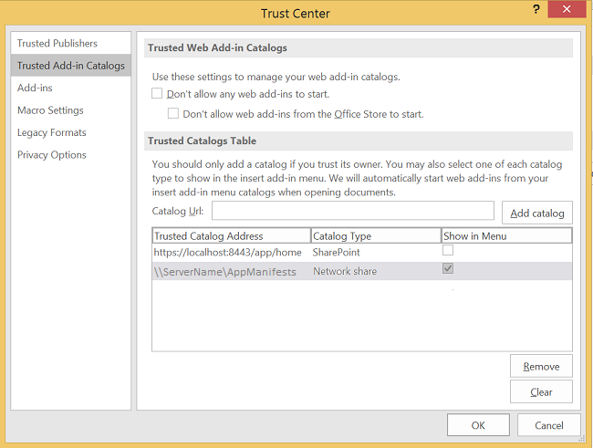
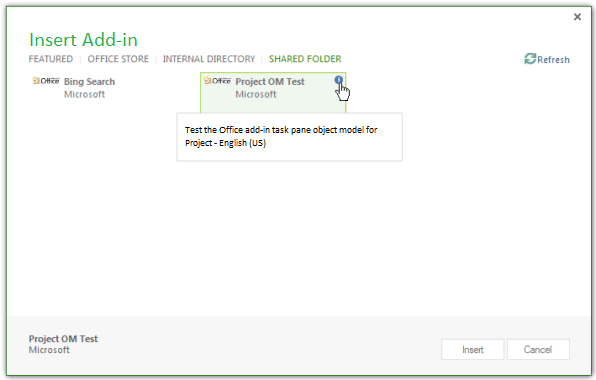
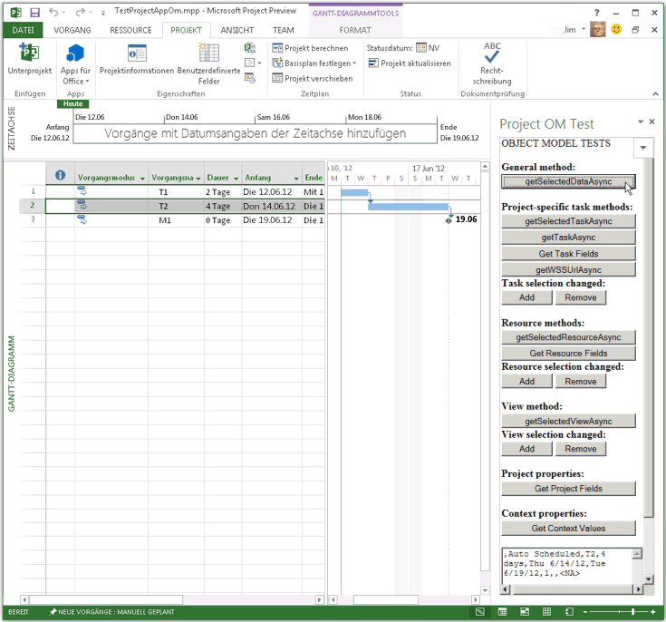
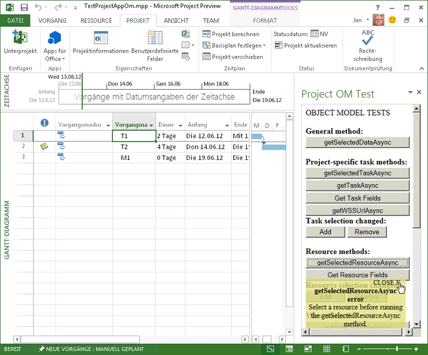

# Erstellen des ersten Aufgabenbereich-Add-ins für Project 2013 mit einem Text-Editor
Entwickeln Sie ein Office-Add-In, das ein XML-Manifest verwendet, das auf eine HTML-Datei auf einer Freigabe verweist, um einen Aufgabenbereich zu erstellen, in dem das Project-Objektmodell für Add-Ins getestet wird.

 _**Gilt für:** apps for Office | Office Add-ins | Project_

Zum Erstellen eines Aufgabenbereich-Add-ins für Project Standard 2013 oder Project Professional 2013 können Sie Visual Studio 2015 zum Erstellen einer komplexen Webanwendung bzw. einen Text-Editor zum Erstellen von Dateien für ein lokales Add-in verwenden. In diesem Artikel wird beschrieben, wie Sie ein einfaches Add-in erstellen, in dem ein XML-Manifest verwendet wird, das auf eine HTML-Datei auf einer Dateifreigabe verweist. Mit dem Beispiel-Add-in „Project OM Test" werden einige JavaScript-Funktionen getestet, die das Objektmodell für Add-ins verwenden. Nachdem Sie mit dem  **Sicherheitscenter** in Project 2013 die Dateifreigabe registriert haben, welche die Manifestdatei enthält, können Sie das Aufgabenbereich-Add-in über die Registerkarte **PROJEKT** des Menübands öffnen. (Der Beispielcode in diesem Artikel basiert auf einer Testanwendung von Arvind Iyer, Microsoft Corporation.)

Project 2013 verwendet dasselbe Add-in-Manifestschema wie andere Microsoft Office 2013-Clients sowie so ziemlich dieselbe JavaScript-API. Den vollständigen Code für das in diesem Artikel beschriebene Add-in finden Sie im Unterverzeichnis  `Samples\Apps` des Project 2013 SDK-Downloads.

Mit dem Beispiel-Add-in „Project OM Test" können Sie die GUID einer Aufgabe und Eigenschaften der Anwendung und des aktiven Projekts abrufen. Falls Project Professional 2013 ein Projekt öffnet, das in einer SharePoint-Bibliothek vorhanden ist, kann mit dem Add-in die URL des Projekts angezeigt werden. Der [Project 2013 SDK-Download](https://www.microsoft.com/en-us/download/details.aspx?id=30435) enthält den vollständigen Quellcode. Wenn Sie das SDK und die Beispiele, die in der Datei Project2013SDK.msi enthalten sind, extrahieren und installieren, finden Sie die Manifestdatei im Unterverzeichnis `\Samples\Apps\Copy_to_AppManifests_FileShare` sowie den Quellcode im Unterverzeichnis `\Samples\Apps\Copy_to_AppSource_FileShare`. Für das Beispiel JSOMCall.html werden JavaScript-Funktionen in den Dateien office.js und project-15.js verwendet, die im Lieferumfang enthalten sind. Mithilfe der entsprechenden Debugdateien (office.debug.js und project-15.debug.js) können Sie die Funktionen prüfen.
Eine Einführung in die Verwendung von JavaScript in Office-Add-Ins finden Sie unter [Grundlegendes zur JavaScript-API für Office](../develop/understanding-the-javascript-api-for-office.md).

## Verfahren 1. So erstellen Sie die Add-in-Manifestdatei


- Erstellen Sie eine XML-Datei in einem lokalen Verzeichnis. Die XML-Datei enthält das  **OfficeApp**-Element und untergeordnete Elemente, die unter [XML-Manifest für Office-Add-Ins](../../docs/overview/add-in-manifests.md) beschrieben werden. Erstellen Sie z. B. eine Datei mit dem NamenJSOM_SimpleOMCalls.xml und dem folgenden XML-Code (ändern Sie den GUID-Wert des **Id**-Elements).
    
  ```XML
  <?xml version="1.0" encoding="utf-8"?>
<OfficeApp xmlns="http://schemas.microsoft.com/office/appforoffice/1.1" 
           xmlns:xsi="http://www.w3.org/2001/XMLSchema-instance" 
           xsi:type="TaskPaneApp">
  <Id>93A26520-9414-492F-994B-4983A1C7A607</Id>
  <Version>15.0</Version>
  <ProviderName>Microsoft</ProviderName>
  <DefaultLocale>en-us</DefaultLocale>
  <DisplayName DefaultValue="Project OM Test">
    <Override Locale="fr-fr" Value="Le Project OM Test"/>
  </DisplayName>
  <Description DefaultValue="Test the task pane add-in object model for Project - English (US)">
    <Override Locale="fr-fr" Value="Test the task pane add-in object model for Project - French (France)"/>
  </Description>
  <Hosts>
    <Host Name="Project"/>
    <Host Name="Workbook"/>
    <Host Name="Document"/>
  </Hosts>
  <DefaultSettings>
    <SourceLocation DefaultValue="\\ServerName\AppSource\JSOMCall.html">
      <Override Locale="fr-fr" Value="\\ServerName\AppSource\JSOMCall.html"/>
    </SourceLocation>
  </DefaultSettings>
  <Permissions>ReadWriteDocument</Permissions>
  <IconUrl DefaultValue="http://officeimg.vo.msecnd.net/_layouts/images/general/office_logo.jpg">
    <Override Locale="fr-fr" Value="http://officeimg.vo.msecnd.net/_layouts/images/general/office_logo.jpg"/>
  </IconUrl>
  <AllowSnapshot>true</AllowSnapshot>
</OfficeApp>
  ```


    Für Project muss das  **OfficeApp**-Element den  `xsi:type="TaskPaneApp"`-Attributwert enthalten. Beim  **Id**-Element handelt es sich um eine GUID. Der Wert von  **SourceLocation** muss ein Dateifreigabepfad oder eine SharePoint-URL für die Add-in-HTML-Quelldatei oder Webanwendung, die im Aufgabenbereich ausgeführt wird, sein. Eine Erläuterung der anderen Elemente in der Manifestdatei finden Sie unter [Aufgabenbereich-Add-ins für Project](../project/project-add-ins.md).
    
Im Verfahren 2 wird gezeigt, wie Sie die HTML-Datei erstellen, die vom Manifest JSOM_SimpleOMCalls.xml für das Add-in „Project OM Test" angegeben ist. Mit den in der HTML-Datei angegebenen Schaltflächen werden entsprechende JavaScript-Funktionen aufgerufen. Sie können die JavaScript-Funktionen in der HTML-Datei oder aber in einer separaten JS-Datei hinzufügen.

## Verfahren 2. So erstellen Sie die Quelldateien für das Add-in „Project OM Test"


1. Erstellen Sie eine HTML-Datei mit einem Namen, der durch das  **SourceLocation**-Element im Manifest „JSOM_SimpleOMCalls.xml"angegeben wird. Erstellen Sie z. B. die Datei JSOMCall.html im Verzeichnis `C:\Project\AppSource`. Sie können zwar einen einfachen Text-Editor zum Erstellen der Quelldateien verwenden, aber einfacher ist dies mit einem Tool wie etwa Visual Studio 2015, , das mit bestimmten Dokumenttypen kompatibel ist (z. B. HTML und JavaScript) und zusätzliche Bearbeitungsfunktionen aufweist. Im Beispiel „Bing Search", das unter [Aufgabenbereich-Add-ins für Project](../project/project-add-ins.md) beschrieben wird, erfahren Sie in Verfahren 3, wie Sie die im Manifest angegebene Dateifreigabe `\\ServerName\AppSource` erstellen.
    
    Die Datei JSOMCall.html verwendet die reguläre Datei MicrosoftAjax.js für AJAX-Funktionalität und die Datei Office.js für die Add-In-Funktionalität in Microsoft Office 2013-Anwendungen.
    


  ```HTML
  <!DOCTYPE html>
<html>
<head>
    <title>Project OM Sample Code</title>
    <meta http-equiv="X-UA-Compatible" content="IE=Edge" />
    <script type="text/javascript" src="MicrosoftAjax.js"></script>

    <!-- Use the CDN reference to office.js when deploying your add-in. -->
    <!-- <script src="https://appsforoffice.microsoft.com/lib/1/hosted/Office.js"></script> -->
    <script type="text/javascript" src="Office.js"></script>
    <script type="text/javascript" src="JSOM_Sample.js"></script>
</head>
<body>
    <div id="Common_JSOM_API">
        OBJECT MODEL TESTS
    </div>

    <textarea id="text" rows="6" cols="25">This is the text result.</textarea>
</body>
</html>
  ```


    Mit dem  **textarea**-Element wird ein Textfeld angegeben, in dem die Ergebnisse der JavaScript-Funktionen angezeigt werden.
    
     >**Hinweis**  Für die fehlerfreie Ausführung des Beispiels "Project OM Test" müssen Sie die folgenden Dateien aus dem Project 2013 SDK-Download in dasselbe Verzeichnis wie die Datei JSOMCall.html kopieren: Office.js, Project-15.js und MicrosoftAjax.js.

    In Schritt 2 wird die Datei JSOM_Sample.js für spezielle Funktionen hinzugefügt, die vom Beispiel-Add-In „Project OM Test" verwendet werden. Später werden Sie dann weitere HTML-Elemente für Schaltflächen hinzufügen, mit denen JavaScript-Funktionen aufgerufen werden.
    
2. Erstellen Sie eine JavaScript-Datei mit dem Namen JSOM_Sample.js im selben Verzeichnis wie die Datei JSOMCall.html. Im folgenden Code werden der Anwendungskontext und Dokumentinformationen mithilfe von Funktionen in der Datei Office.js abgerufen. Beim **text**-Objekt handelt es sich um die ID des  **textarea**-Steuerelements in der HTML-Datei.
    
    Die  **_projDoc**-Variable wird mit einem  **ProjectDocument**-Objekt initialisiert. Der Code enthält einige einfache Fehlerbehandlungsfunktionen sowie die  **getContextValues**-Funktion, mit der der Anwendungskontext und Dokumentkontexteigenschaften für das Projekt abgerufen werden. Weitere Informationen zum JavaScript-Objektmodell für Project finden Sie unter [JavaScript-API für Office](http://msdn.microsoft.com/library/b27e70c3-d87d-4d27-85e0-103996273298%28Office.15%29.aspx).
    


  ```
  /*
* JavaScript functions for the Project OM Test example app
* in the Project 2013 SDK.
*/

var _projDoc;
var _app;
var taskGuid;
var resourceGuid;

// The initialize function is required for all add-ins.
Office.initialize = function (reason) {
    // Checks for the DOM to load using the jQuery ready function.
    $(document).ready(function () {
        // After the DOM is loaded, app-specific code can run.
        _projDoc = Office.context.document;
        _app = Office.context;
    });
}

function logError(errorText) {
    text.value = "Error in " + errorText;
}

function logEventError(erroneousEvent) {
    logError("event " + erroneousEvent);
}

function logMethodError(methodName, errorName, errorMessage) {
    logError(methodName + " method.\nError name: " + errorName + "\nMessage: " + errorMessage);
}

// . . . Add other JavaScript functions here.

function getContextValues() {
    getDocumentUrl();
    getDocumentMode();
    getApplicationContentLanguage();
    getApplicationDisplayLanguage();
}

function getDocumentUrl() {
    text.value ="Document URL:\n" +_projDoc.url;
}

function getDocumentMode() {
    var docMode = _projDoc.mode;
    text.value = text.value + "\n\nDocument mode: " + docMode;
}

function getApplicationContentLanguage() {
    text.value = text.value + "\nApp language: " + _app.contentLanguage;
}

function getApplicationDisplayLanguage() {
    text.value = text.value + "\nDisplay language: " + _app.displayLanguage;
}
  ```


    Informationen zu den Funktionen in der Datei Office.debug.js finden Sie unter [JavaScript-API für Office](http://msdn.microsoft.com/library/b27e70c3-d87d-4d27-85e0-103996273298%28Office.15%29.aspx). Beispielweise werden mit der  **getDocumentUrl**-Funktion die URL oder der Dateipfad des geöffneten Projekts abgerufen.
    
3. Fügen Sie JavaScript-Funktionen hinzu, mit denen asynchrone Funktionen in Office.js und Project-15.js aufgerufen werden, um bestimmte Daten zu erhalten:
    
      -  **getSelectedDataAsync** ist z. B. eine allgemeine Funktion in Office.js, mit der unformatierter Text für die ausgewählten Daten abgerufen wird. Weitere Informationen finden Sie unter [AsyncResult-Objekt](http://msdn.microsoft.com/de-de/library/540c114f-0398-425c-baf3-7363f2f6bc47%28Office.15%29.aspx).
    
  - Mit der  **getSelectedTaskAsync**-Funktion in Project-15.js wird die GUID der ausgewählten Aufgabe abgerufen. Entsprechend wird mit der  **getSelectedResourceAsync**-Funktion die GUID der ausgewählten Ressource abgerufen. Wenn beim Aufrufen dieser Funktionen keine Aufgabe oder Ressource ausgewählt ist, wird ein nicht definierter Fehler angezeigt.
    
  - Mit der  **getTaskAsync**-Funktion werden der Name der Aufgabe sowie die Namen der zugewiesenen Ressourcen aufgerufen. Wenn die Aufgabe in einer synchronisierten SharePoint-Aufgabenliste vorhanden ist, wird mit  **getTaskAsync** die Aufgaben-ID in der SharePoint-Liste abgerufen. Andernfalls lautet die SharePoint-Aufgaben-ID 0.
    
     >**Hinweis**  Der Beispielcode enthält zu Demonstrationszwecken einen Bug. Falls  **taskGuid** nicht definiert ist, wird für die **getTaskAsync**-Funktion ein Fehler gemeldet. Falls Sie eine gültige Aufgaben-GUID erhalten und dann eine andere Aufgabe auswählen, werden von der  **getTaskAsync**-Funktion Daten für die Aufgabe, die zuletzt von der  **getSelectedTaskAsync**-Funktion verarbeitet wurde, abgerufen.
  -  **getTaskFields**,  **getResourceFields** und **getProjectFields** sind lokale Funktionen, mit denen **getTaskFieldAsync**,  **getResourceFieldAsync** oder **getProjectFieldAsync** mehrmals aufgerufen wird, um die angegebenen Felder einer Aufgabe oder Ressource abzurufen. In der Datei project-15.debug.js zeigen die **ProjectTaskFields**-Enumeration und die  **ProjectResourceFields**-Enumeration, welche Felder unterstützt werden.
    
  - Mit der  **getSelectedViewAsync**-Funktion werden der Typ der Ansicht (definiert in der  **ProjectViewTypes**-Enumeration in project-15.debug.js) und der Name der Ansicht abgerufen.
    
  - Falls das Projekt mit einer SharePoint-Aufgabenliste synchronisiert wird, werden mit der  **getWSSUrlAsync**-Funktion die URL und der Name der Aufgabenliste abgerufen. Falls das Projekt nicht mit einer SharePoint-Aufgabenliste synchronisiert wird, wird für die  **getWSSUrlAsync**-Funktion ein Fehler gemeldet.
    
     >**Hinweis**  Zum Abrufen der SharePoint-URL und des Namens der Aufgabenliste wird empfohlen, die  **getProjectFieldAsync**-Funktion mit den Konstanten  **WSSUrl** und **WSSList** in der [ProjectProjectFields](http://msdn.microsoft.com/de-de/library/d0808b99-9940-478d-88b7-f68061cc77c5%28Office.15%29.aspx)-Enumeration zu verwenden.

    Die Datei JSOMCall.html verwendet die reguläre Datei MicrosoftAjax.js für AJAX-Funktionalität und die Datei Office.js für die Add-in-Funktionalität in Microsoft Office 2013-Anwendungen.
    


  ```
  // Get the data in the selected cells of the grid in the active view.
function getSelectedDataAsync() {
    _projDoc.getSelectedDataAsync(
        Office.CoercionType.Text,
        { ValueFormat: "Formatted" },
        function (asyncResult) {
            if (asyncResult.status == Office.AsyncResultStatus.Succeeded)
                text.value = asyncResult.value;
            else
                logMethodError("getSelectedDataAsync", asyncResult.error.name,
                               asyncResult.error.message);
        }
    );
}

// Get the GUID of the selected task.
function getSelectedTaskAsync() {
    _projDoc.getSelectedTaskAsync(function (asyncResult) {
        if (asyncResult.status == Office.AsyncResultStatus.Succeeded) {
            text.value = asyncResult.value;
            taskGuid = asyncResult.value;
        }
        else {
            logMethodError("getSelectedTaskAsync", asyncResult.error.name,
                               asyncResult.error.message);
        }
    });
}

// Get the GUID of the selected resource.
function getSelectedResourceAsync() {
    _projDoc.getSelectedResourceAsync(function (asyncResult) {
        if (asyncResult.status == Office.AsyncResultStatus.Succeeded) {
            text.value = asyncResult.value;
            resourceGuid = asyncResult.value;
        }
        else {
            logMethodError("getSelectedResourceAsync", asyncResult.error.name,
                               asyncResult.error.message);
        }
    });
}

// Get data for the specified task.
function getTaskAsync() {
    if (taskGuid != undefined) {
        _projDoc.getTaskAsync(
            taskGuid,
            function (asyncResult) {
                if (asyncResult.status === Office.AsyncResultStatus.Failed) {
                    logMethodError("getTaskAsync", asyncResult.error.name,
                               asyncResult.error.message);
                } else {
                    var taskInfo = asyncResult.value;
                    var taskOutput = "Task name: " + taskInfo.taskName +
                                     "\nGUID: " + taskGuid +
                                     "\nWSS Id: " + taskInfo.wssTaskId +
                                     "\nResourceNames: " + taskInfo.resourceNames;
                    text.value = taskOutput;
                }
            }
        );
    } else {
        text.value = 'Task GUID not valid:\n' + taskGuid;
    } 
}

// Get additional data for task fields.
function getTaskFields() {
    text.value = "";

    _projDoc. getTaskFieldAsync(taskGuid, Office.ProjectTaskFields.Name,
        function (asyncResult) {
            if (asyncResult.status == Office.AsyncResultStatus.Succeeded) {
                text.value = text.value + "Name: "
                    + asyncResult.value.fieldValue + "\n";
            }
            else {
                logMethodError("getTaskFieldAsync", asyncResult.error.name,
                               asyncResult.error.message);
            }
        }
    );

    _projDoc.getTaskFieldAsync(taskGuid, Office.ProjectTaskFields.ID,
        function (asyncResult) {
            if (asyncResult.status == Office.AsyncResultStatus.Succeeded) {
                text.value = text.value + "ID: "
                    + asyncResult.value.fieldValue + "\n";
            }
            else {
                logMethodError("getTaskFieldAsync", asyncResult.error.name,
                               asyncResult.error.message);
            }
        }
    );

    _projDoc.getTaskFieldAsync(taskGuid, Office.ProjectTaskFields.Start,
        function (asyncResult) {
            if (asyncResult.status == Office.AsyncResultStatus.Succeeded) {
                text.value = text.value + "Start: "
                    + asyncResult.value.fieldValue + "\n";
            }
            else {
                logMethodError("getTaskFieldAsync", asyncResult.error.name,
                               asyncResult.error.message);
            }
        }
    );

    _projDoc.getTaskFieldAsync(taskGuid, Office.ProjectTaskFields.Duration,
        function (asyncResult) {
            if (asyncResult.status == Office.AsyncResultStatus.Succeeded) {
                text.value = text.value + "Duration: "
                    + asyncResult.value.fieldValue + "\n";
            }
            else {
                logMethodError("getTaskFieldAsync", asyncResult.error.name,
                               asyncResult.error.message);
            }
        }
    );

    _projDoc.getTaskFieldAsync(taskGuid, Office.ProjectTaskFields.Priority,
        function (asyncResult) {
            if (asyncResult.status == Office.AsyncResultStatus.Succeeded) {
                text.value = text.value + "Priority: "
                    + asyncResult.value.fieldValue + "\n";
            }
            else {
                logMethodError("getTaskFieldAsync", asyncResult.error.name,
                               asyncResult.error.message);
            }
        }
    );

    _projDoc.getTaskFieldAsync(taskGuid, Office.ProjectTaskFields.Notes,
        function (asyncResult) {
            if (asyncResult.status == Office.AsyncResultStatus.Succeeded) {
                text.value = text.value + "Notes: "
                    + asyncResult.value.fieldValue + "\n";
            }
            else {
                logMethodError("getTaskFieldAsync", asyncResult.error.name,
                               asyncResult.error.message);
            }
        }
    ); 
}

// Get data for the specified resource fields.
function getResourceFields() {
    text.value = "";

    _projDoc.getResourceFieldAsync(resourceGuid, Office.ProjectResourceFields.Name,
        function (asyncResult) {
            if (asyncResult.status == Office.AsyncResultStatus.Succeeded) {
                text.value = text.value + "Resource name: " + asyncResult.value.fieldValue + "\n";
            }
            else {
                logMethodError("getResourceFieldAsync", asyncResult.error.name,
                               asyncResult.error.message);
            }
        }
    );

    _projDoc.getResourceFieldAsync(resourceGuid, Office.ProjectResourceFields.Cost,
        function (asyncResult) {
            if (asyncResult.status == Office.AsyncResultStatus.Succeeded) {
                text.value = text.value + "Cost: " + asyncResult.value.fieldValue + "\n";
            }
            else {
                logMethodError("getResourceFieldAsync", asyncResult.error.name,
                               asyncResult.error.message);
            }
        }
    );

    _projDoc.getResourceFieldAsync(resourceGuid, Office.ProjectResourceFields.StandardRate,
        function (asyncResult) {
            if (asyncResult.status == Office.AsyncResultStatus.Succeeded) {
                text.value = text.value + "Standard Rate: " + asyncResult.value.fieldValue + "\n";
            }
            else {
                logMethodError("getResourceFieldAsync", asyncResult.error.name, asyncResult.error.message);
            }
        }
    );

    _projDoc.getResourceFieldAsync(resourceGuid, Office.ProjectResourceFields.ActualCost,
        function (asyncResult) {
            if (asyncResult.status == Office.AsyncResultStatus.Succeeded) {
                text.value = text.value + "Actual Cost: " + asyncResult.value.fieldValue + "\n";
            }
            else {
                logMethodError("getResourceFieldAsync", asyncResult.error.name, asyncResult.error.message);
            }
        }
    );

    _projDoc.getResourceFieldAsync(resourceGuid, Office.ProjectResourceFields.ActualWork,
        function (asyncResult) {
            if (asyncResult.status == Office.AsyncResultStatus.Succeeded) {
                text.value = text.value + "Actual Work: " + asyncResult.value.fieldValue + "\n";
            }
            else {
                logMethodError("getResourceFieldAsync", asyncResult.error.name,
                               asyncResult.error.message);
            }
        }
    );

    _projDoc.getResourceFieldAsync(resourceGuid, Office.ProjectResourceFields.Units,
        function (asyncResult) {
            if (asyncResult.status == Office.AsyncResultStatus.Succeeded) {
                text.value = text.value + "Units: " + asyncResult.value.fieldValue + "\n";
            }
            else {
                logMethodError("getResourceFieldAsync", asyncResult.error.name,
                               asyncResult.error.message);
            }
        }
    );
}

// Get the URL and list name of the synchronized SharePoint task list.
// Recommended: use getProjectField instead.
function getWSSUrlAsync() {
    _projDoc.getWSSUrlAsync(function (asyncResult) {
        if (asyncResult.status == Office.AsyncResultStatus.Succeeded) {
            text.value = "SharePoint URL:\n" + asyncResult.value.serverUrl
                + "\nList name: " + asyncResult.value.listName;
        }
        else {
            logMethodError("getWSSUrlAsync", asyncResult.error.name, asyncResult.error.message);
        }
    });
}

// Get the type and name of the selected view.
function getSelectedViewAsync() {
    _projDoc.getSelectedViewAsync(function (asyncResult) {
        text.value = "View type: " + asyncResult.value.viewType
            + "\nName: " + asyncResult.value.viewName;
    });
}

// Get information about the active project.
function getProjectFields() {
    text.value = "";

    _projDoc.getProjectFieldAsync(Office.ProjectProjectFields.GUID,
        function (asyncResult) {
            if (asyncResult.status == Office.AsyncResultStatus.Succeeded) {
                text.value = text.value + "Project GUID: " + asyncResult.value.fieldValue + "\n";
            }
            else {
                logMethodError("getProjectFieldAsync", asyncResult.error.name, asyncResult.error.message);
            }
        }
    );

    _projDoc.getProjectFieldAsync(Office.ProjectProjectFields.Start,
        function (asyncResult) {
            if (asyncResult.status == Office.AsyncResultStatus.Succeeded) {
                text.value = text.value + "\nStart: " + asyncResult.value.fieldValue + "\n";
            }
            else {
                logMethodError("getProjectFieldAsync", asyncResult.error.name, asyncResult.error.message);
            }
        }
    );

    _projDoc.getProjectFieldAsync(Office.ProjectProjectFields.Finish,
        function (asyncResult) {
            if (asyncResult.status == Office.AsyncResultStatus.Succeeded) {
                text.value = text.value + "\nFinish: " + asyncResult.value.fieldValue + "\n";
            }
            else {
                logMethodError("getProject " + errorText);
            }
        }
    );

    _projDoc.getProjectFieldAsync(Office.ProjectProjectFields.CurrencyDigits,
        function (asyncResult) {
            if (asyncResult.status == Office.AsyncResultStatus.Succeeded) {
                text.value = text.value + "\nCurrency digits: " + asyncResult.value.fieldValue + "\n";
            }
            else {
                logMethodError("getProjectFieldAsync", asyncResult.error.name, asyncResult.error.message);
            }
        }
    );


    _projDoc.getProjectFieldAsync(Office.ProjectProjectFields.CurrencySymbol,
        function (asyncResult) {
            if (asyncResult.status == Office.AsyncResultStatus.Succeeded) {
                text.value = text.value + "Currency symbol: " + asyncResult.value.fieldValue + "\n";
            }
            else {
                logMethodError("getProjectFieldAsync", asyncResult.error.name, asyncResult.error.message);
            }
        }
    );

    _projDoc.getProjectFieldAsync(Office.ProjectProjectFields.CurrencySymbolPosition,
        function (asyncResult) {
            if (asyncResult.status == Office.AsyncResultStatus.Succeeded) {
                text.value = text.value + "\nSymbol position: " + asyncResult.value.fieldValue + "\n";
            }
            else {
                logMethodError("getProjectFieldAsync", asyncResult.error.name, asyncResult.error.message);
            }
        }
    );

    _projDoc.getProjectFieldAsync(Office.ProjectProjectFields.ProjectServerUrl,
        function (asyncResult) {
            if (asyncResult.status == Office.AsyncResultStatus.Succeeded) {
                text.value = text.value + "\nProject web app URL:\n  " + asyncResult.value.fieldValue + "\n";
            }
            else {
                logMethodError("getProjectFieldAsync", asyncResult.error.name, asyncResult.error.message);
            }
        }
    );

    _projDoc.getProjectFieldAsync(Office.ProjectProjectFields.WSSUrl,
        function (asyncResult) {
            if (asyncResult.status == Office.AsyncResultStatus.Succeeded) {
                text.value = text.value + "\nSharePoint URL:\n  " + asyncResult.value.fieldValue + "\n";
            }
            else {
                logMethodError("getProjectFieldAsync", asyncResult.error.name, asyncResult.error.message);
            }
        }
    );

    _projDoc.getProjectFieldAsync(Office.ProjectProjectFields.WSSList,
        function (asyncResult) {
            if (asyncResult.status == Office.AsyncResultStatus.Succeeded) {
                text.value = text.value + "\nSharePoint list: " + asyncResult.value.fieldValue + "\n";
            }
            else {
                logMethodError("getProjectFieldAsync", asyncResult.error.name, asyncResult.error.message);
            }
        }
    );
}
  ```

4. Mit dem  **textarea**-Element wird ein Textfeld angegeben, in dem die Ergebnisse der JavaScript-Funktionen angezeigt werden.
    
    Für die fehlerfreie Ausführung des Beispiels „Project OM Test" müssen Sie die folgenden Dateien aus dem Project 2013 SDK-Download in dasselbe Verzeichnis wie die Datei JSOMCall.html kopieren: Office.js, Project-15.js und MicrosoftAjax.js.
    


  ```
  // Task selection changed event handler.
function onTaskSelectionChanged(eventArgs) {
    text.value = "In task selection change event handler";
}

// Resource selection changed event handler.
function onResourceSelectionChanged(eventArgs) {
    text.value = "In Resource selection changed event handler";
}

// View selection changed event handler.
function onViewSelectionChanged(eventArgs) {
    text.value = "In View selection changed event handler";
}

// Add or remove the specified event handler.
function manageEventHandlerAsync(eventType, handler, operation, onComplete) {
    _projDoc[operation]   //The operation is addHandlerAsync or removeHandlerAsync.
    (
        eventType,
        handler,
        function (asyncResult) {
            if (onComplete) {
                onComplete(asyncResult, operation);
            } else {
                var message = "Operation: " + operation;
                message = message + "\nStatus: " + asyncResult.status + "\n";
                text.value = message;
            }
        }
    );
}

// Write the asyncResult status from the manageEventHandlerAsync function (optional). 
function onComplete(asyncResult, operation) {
    var message = "In onComplete function for " + operation;
    message = message + "\nStatus: " + asyncResult.status;
    text.value = message;
}

// Add or remove a task selection changed event handler.
function manageTaskEventHandler(docMethod) {
    manageEventHandlerAsync(
        Office.EventType.TaskSelectionChanged,      // The task selection changed event.
        onTaskSelectionChanged,                     // The event handler.
        docMethod,                // The Office.Document method to add or remove an event handler.
        onComplete                // Manages the successful asyncResult data (optional).
    );
}

// Add or remove a resource selection changed event handler.
function manageResourceEventHandler(docMethod) {
    manageEventHandlerAsync(
        Office.EventType.ResourceSelectionChanged,  // The resource selection changed event.
        onResourceSelectionChanged,                 // The event handler.
        docMethod,                // The Office.Document method to add or remove an event handler.
        onComplete                // Manages the successful asyncResult data (optional).
    );
}

// Add or remove a view selection changed event handler.
function manageViewEventHandler(docMethod) {
    manageEventHandlerAsync(
        Office.EventType.ViewSelectionChanged,      // The view selection changed event.
        onViewSelectionChanged,                     // The event handler.
        docMethod,                // The Office.Document method to add or remove an event handler.
        onComplete                // Manages the successful asyncResult data (optional).
    );
}
  ```

5. In Schritt 2 wird die Datei JSOM_Sample.js für spezielle Funktionen hinzugefügt, die von dem Beispiel-Add-in „Project OM Test" verwendet werden. Später werden Sie dann weitere HTML-Elemente für Schaltflächen hinzufügen, mit denen JavaScript-Funktionen aufgerufen werden.
    
  ```HTML
  <body>
    <div id="Common_JSOM_API">
    OBJECT MODEL TESTS
    <br /><br />       
    <strong>General function:</strong>
    <br />
    <input id="Button5" class="button-wide" type="button" onclick="getSelectedDataAsync()" 
        value="getSelectedDataAsync" />
    </div>
   <!--  more code . . .  -->
  ```

6. Erstellen Sie eine JavaScript-Datei mit dem Namen JSOM_Sample.js im selben Verzeichnis wie die Datei JSOMCall.html. Im folgenden Code werden der Anwendungskontext und Dokumentinformationen mithilfe von Funktionen in der Datei Office.js abgerufen. Beim **text**-Objekt handelt es sich um die ID des  **textarea**-Steuerelements in der HTML-Datei.
    
  ```HTML
  <div id="ProjectSpecificTask">
  <br />
  <strong>Project-specific task methods:</strong><br />
  <button class="button-wide" onclick="getSelectedTaskAsync()">getSelectedTaskAsync</button><br />
  <button class="button-wide" onclick="getTaskAsync()">getTaskAsync</button><br />
  <button class="button-wide" onclick="getTaskFields()">Get Task Fields</button><br />
  <button class="button-wide" onclick="getWSSUrlAsync()">getWSSUrlAsync</button>
  <strong>Task selection changed:</strong>
  <button class="button-narrow" onclick="manageTaskEventHandler('addHandlerAsync')">Add</button>
  <button class="button-narrow" onclick="manageTaskEventHandler('removeHandlerAsync')">Remove</button>         
</div>
  ```

7. Die Variable  **_projDoc** wird mit einem **ProjectDocument**-Objekt initialisiert. Der Code enthält einige einfache Fehlerbehandlungsfunktionen sowie die Funktion  **getContextValues**, mit der der Anwendungskontext und Dokumentkontexteigenschaften für das Projekt abgerufen werden. Weitere Informationen zum JavaScript-Objektmodell für Project finden Sie unter [JavaScript-API für Office](http://msdn.microsoft.com/library/b27e70c3-d87d-4d27-85e0-103996273298%28Office.15%29.aspx).
    
  ```HTML
  <div id="ResourceMethods">
  <br />
  <strong>Resource methods:</strong>
  <button class="button-wide" onclick="getSelectedResourceAsync()">getSelectedResourceAsync</button><br />
  <button class="button-wide" onclick="getResourceFields()">Get Resource Fields</button><br />
  <strong>Resource selection changed:</strong>
  <button class="button-narrow" onclick="manageResourceEventHandler('addHandlerAsync')">Add</button>
  <button class="button-narrow" onclick="manageResourceEventHandler('removeHandlerAsync')">Remove</button>
</div>
<div id="ViewMethods">
  <br />
  <strong>View method:</strong>
  <button class="button-wide" onclick="getSelectedViewAsync()">getSelectedViewAsync</button><br />
  <strong>View selection changed:</strong>
  <button class="button-narrow" onclick="manageViewEventHandler('addHandlerAsync')">Add</button>
  <button class="button-narrow" onclick="manageViewEventHandler('removeHandlerAsync')">Remove</button>         
</div>
<div id="ProjectMethods">
  <br />
  <strong>Project properties:</strong>
  <button class="button-wide" onclick="getProjectFields()">Get Project Fields</button><br />
</div>
<div id="ContextVariables">
  <br />
  <strong>Context properties:</strong>
  <button class="button-wide" onclick="getContextValues()">Get Context Values</button>
</div>
  ```

8. Informationen zu den Funktionen in der Datei Office.debug.js finden Sie unter [JavaScript-API für Office](http://msdn.microsoft.com/library/b27e70c3-d87d-4d27-85e0-103996273298%28Office.15%29.aspx). Beispielweise werden mit der Funktion  **getDocumentUrl** die URL oder der Dateipfad des geöffneten Projekts abgerufen.
    
  ```HTML
  <style type="text/css">
    .button-wide
    {
        width: 210px;
        margin-top: 2px;
    }
    .button-narrow
    {
        width: 80px;
        margin-top: 2px;
    }
</style>
  ```


     >**Hinweis**  Die Vorlage **Aufgabenbereich-Add-In (Projekt)** in Visual Studio 2015 enthält die CSS-Dateien für ein häufig verwendetes Design von Add-Ins.
 **getSelectedDataAsync** ist z. B. eine allgemeine Funktion in Office.js, mit der unformatierter Text für die ausgewählten Daten abgerufen wird. Weitere Informationen finden Sie unter [AsyncResult-Objekt](http://msdn.microsoft.com/de-de/library/540c114f-0398-425c-baf3-7363f2f6bc47%28Office.15%29.aspx).

## Verfahren 3 So installieren und verwenden Sie das Add-in „Project OM Test"


1. Die Datei JSOMCall.html verwendet die reguläre Datei MicrosoftAjax.js für AJAX-Funktionalität und die Datei Office.js für die Add-in-Funktionalität in Microsoft Office 2013-Anwendungen.
    
  ```
  Net share AppManifests=C:\Project\AppManifests
  ```


    Mit dem  **textarea**-Element wird ein Textfeld angegeben, in dem die Ergebnisse der JavaScript-Funktionen angezeigt werden.
    
2. Für die fehlerfreie Ausführung des Beispiels „Project OM Test" müssen Sie die folgenden Dateien aus dem Project 2013 SDK-Download in dasselbe Verzeichnis wie die Datei JSOMCall.html kopieren: Office.js, Project-15.js und MicrosoftAjax.js.
    
  ```
  net share AppSource=C:\Project\AppSource
  ```

3. In Schritt 2 wird die Datei JSOM_Sample.js für spezielle Funktionen hinzugefügt, die von dem Beispiel-Add-in „Project OM Test" verwendet werden. Später werden Sie dann weitere HTML-Elemente für Schaltflächen hinzufügen, mit denen JavaScript-Funktionen aufgerufen werden.
    
    Erstellen Sie eine JavaScript-Datei mit dem Namen JSOM_Sample.js im selben Verzeichnis wie die Datei JSOMCall.html. Im folgenden Code werden der Anwendungskontext und Dokumentinformationen mithilfe von Funktionen in der Datei Office.js abgerufen. Beim **text**-Objekt handelt es sich um die ID des  **textarea**-Steuerelements in der HTML-Datei.
    
4. Die Variable  **_projDoc** wird mit einem **ProjectDocument**-Objekt initialisiert. Der Code enthält einige einfache Fehlerbehandlungsfunktionen sowie die Funktion  **getContextValues**, mit der der Anwendungskontext und Dokumentkontexteigenschaften für das Projekt abgerufen werden. Weitere Informationen zum JavaScript-Objektmodell für Project finden Sie unter [JavaScript-API für Office](http://msdn.microsoft.com/library/b27e70c3-d87d-4d27-85e0-103996273298%28Office.15%29.aspx).
    
5. Informationen zu den Funktionen in der Datei Office.debug.js finden Sie unter [JavaScript-API für Office](http://msdn.microsoft.com/library/b27e70c3-d87d-4d27-85e0-103996273298%28Office.15%29.aspx). Beispielweise werden mit der Funktion  **getDocumentUrl** die URL oder der Dateipfad des geöffneten Projekts abgerufen.
    
    **Abbildung 1: Hinzufügen einer Netzwerkdateifreigabe für Add-in-Manifeste**

    

6. Starten Sie Project neu, nachdem Sie neue Add-ins hinzugefügt oder den Quellcode geändert haben. Wählen Sie im Menüband  **PROJEKT** das Dropdownmenü **Office-Add-ins** aus, und wählen Sie dann **Alle anzeigen** aus. Wählen Sie im Dialogfeld **Add-in einfügen** die Option **FREIGEGEBENER ORDNER** aus (siehe Abbildung 2), wählen Sie **Project OM Test** aus, und wählen Sie dann **Einfügen** aus. Das Add-in „Project OM Test" wird in einem Aufgabenbereich gestartet.
    
    **Abbildung 2: Starten des Add-ins „Project OM Test", das sich auf einer Dateifreigabe befindet**

    

7. Erstellen und speichern Sie in Project ein einfaches Projekt, das mindestens zwei Aufgaben enthält. Erstellen Sie z. B. die Aufgaben T1, T2 und einen Meilenstein mit dem NamenM1. Legen Sie anschließend die Dauer der Aufgaben sowie die Vorgänger ähnlich wie in Abbildung 3 fest. Klicken Sie im Menüband auf die Registerkarte  **PROJEKT**, wählen Sie die gesamte Zeile für die Aufgabe T2 aus, und wählen Sie dann im Aufgabenbereich die Schaltfläche  **getSelectedDataAsync** aus. In Abbildung 3 sind die Daten dargestellt, die im Textfeld des Add-ins **Project OM Test** ausgewählt sind.
    
    **Abbildung 3: Verwenden des Add-ins „Project OM Test"**

    

8. Wählen Sie die Zelle in der Spalte  **Duration** für die erste Aufgabe aus, und klicken Sie dann auf die Schaltfläche **getSelectedDataAsync** im Add-in **Project OM Test**. Mit der  **getSelectedDataAsync**-Funktion wird als Wert für das Textfeld  `2 days` festgelegt.
    
9. Wählen Sie die drei Zellen  **Duration** für alle drei Aufgaben aus. Mit der **getSelectedDataAsync**-Funktion werden durch Semikolons getrennte Textwerte für in unterschiedlichen Zeilen ausgewählte Zellen zurückgegeben, wie z. B.  `2 days;4 days;0 days`.
    
    Mit der  **getSelectedDataAsync**-Funktion werden durch Kommas getrennte Textwerte für innerhalb einer Zeile ausgewählte Zellen zurückgegeben. Beispielsweise ist in Abbildung 3 die gesamte Zeile für die Aufgabe T2 ausgewählt. Wenn Sie  **getSelectedDataAsync** auswählen, wird im Textfeld Folgendes angezeigt: `,Auto Scheduled,T2,4 days,Thu 6/14/12,Tue 6/19/12,1,,<NA>`
    
    Die Spalten  **Indicators** und **Resource Names** sind beide leer, weshalb im Textarray leere Werte für diese Spalten angezeigt werden. Der Wert `<NA>` ist für die Zelle **Neue Spalte hinzufügen**.
    
10. Wählen Sie eine Zelle in der Zeile für die Aufgabe T2 aus, oder aber die gesamte Zeile für die Aufgabe T2, und wählen Sie dann  **getSelectedTaskAsync** aus. Im Textfeld wird der GUID-Wert der Aufgabe angezeigt, wie z. B. `{25D3E03B-9A7D-E111-92FC-00155D3BA208}`. Project speichert diesen Wert in der globalen  **taskGuid**-Variable des Add-ins  **Project OM Test**.
    
11. Wählen Sie  **getTaskAsync** aus. Falls die **taskGuid**-Variable die GUID für die Aufgabe T2 enthält, werden im Textfeld die Aufgabeninformationen angezeigt.  **ResourceNames** weist einen leeren Wert auf.
    
    Erstellen Sie die beiden lokalen Ressourcen R1 undR2, weisen Sie sie der Aufgabe T2 mit jeweils 50 % zu, und wählen Sie erneut  **getTaskAsync** aus. Die Ergebnisse im Textfeld enthalten die Ressourceninformation. Falls die Aufgabe in einer synchronisierten SharePoint-Aufgabenliste vorhanden ist, enthalten die Ergebnisse auch die SharePoint-Aufgaben-ID.
    


  ```
  Task name: T2
GUID: {25D3E03B-9A7D-E111-92FC-00155D3BA208}
WSS Id: 0
ResourceNames: R1[50%],R2[50%]
  ```

12. Wählen Sie die Schaltfläche  **Get Task Fields** aus. Mit der **getTaskFields**-Funktion wird die  **getTaskfieldAsync**-Funktion mehrmals für den Aufgabennamen, den Index, das Startdatum, die Dauer, die Priorität und die Kommentare zur Aufgabe aufgerufen.
    
  ```
  Name: T2
ID: 2
Start: Thu 6/14/12
Duration: 4d
Priority: 500
Notes: This is a note for task T2. It is only a test note. If it had been a real note, there would be some real information.
  ```

13. Wählen Sie die Schaltfläche  **getWSSUrlAsync** aus. Wenn das Projekt einen der folgenden Typen aufweist, wird in den Ergebnissen die URL und der Name der Aufgabenliste angezeigt.
    
      - SharePoint-Aufgabenliste, die in Project Server importiert wurde.
    
  - SharePoint-Aufgabenliste, die in Project Professional importiert und dann wieder in SharePoint gespeichert wurde (ohne Verwendung von Project Server).
    
     >**Hinweis**  Wenn Project Professional auf einem Windows Server-Computer installiert ist, können Sie den  **Server-Manager** verwenden, um die Funktion **Desktopdarstellung** hinzuzufügen. Sie können das Projekt dann wieder in SharePoint speichern.

    Falls es sich bei dem Projekt um ein lokales Projekt handelt oder falls Sie Project Professional zum Öffnen eines Projekts verwenden, das mit Project Server verwaltet wird, zeigt die  **getWSSUrlAsync**-Methode einen nicht definierten Fehler an.
    


  ```
  SharePoint URL: http://ServerName
List name: Test task list
  ```

14. Wählen Sie im Abschnitt  **TaskSelectionChanged-Ereignis** die Schaltfläche **Hinzufügen** aus, mit der die **manageTaskEventHandler**-Funktion zum Registrieren eines TaskSelectionChanged-Ereignisses aufgerufen wird und  `In onComplete function for addHandlerAsync Status: succeeded` im Textfeld zurückgegeben wird. Wählen Sie eine andere Aufgabe aus. Im Textfeld wird `In task selection changed event handler` angezeigt. Hierbei handelt es sich um die Ausgabe der Rückruffunktion für das TaskSelectionChanged-Ereignis. Klicken Sie auf die Schaltfläche **Entfernen**, um die Registrierung des Ereignishandlers aufzuheben.
    
15. Wählen Sie zur Verwendung der Ressourcenmethoden zunächst eine Ansicht wie z. B.  **Ressource: Tabelle**,  **Ressource: Verwendung** oder **Ressource: Maske** aus, und wählen Sie dann eine Ressource in dieser Ansicht aus. Wählen Sie **getSelectedResourceAsync** aus, um die **resourceGuid**-Variable zu initialisieren, und wählen Sie dann  **Get Resource Fields** aus, um **getResourceFieldAsync**mehrmals für die Ressourceneigenschaften aufzurufen. Sie können auch den RresourceSelectionChanged-Ereignishandler hinzufügen oder entfernen.
    
  ```
  Resource name: R1
Cost: $800.00
Standard Rate: $50.00/h
Actual Cost: $0.00
Actual Work: 0h
Units: 100%
  ```

16. Wählen Sie  **getSelectedViewAsync** aus, um den Typ und den Namen der aktiven Ansicht anzuzeigen. Sie können auch den ViewSelectionChanged-Ereignishandler hinzufügen oder entfernen. Wenn z. B. **Ressource: Maske** die aktive Ansicht ist, wird mit der **getSelectedViewAsync**-Funktion Folgendes im Textfeld angezeigt:
    
  ```
  View type: 6
Name: Resource Form
  ```

17. Wählen Sie  **Get Project Fields** aus, um die **getProjectFieldAsync**-Funktion mehrmals für verschiedene Eigenschaften des aktiven Projekts aufzurufen. Falls das Projekt über die Project Web App geöffnet wird, kann mit der  **getProjectFieldAsync**-Funktion die URL der Project Web App-Instanz abgerufen werden.
    
  ```
  Project GUID: 9845922E-DAB4-E111-8AF3-00155D3BA208

Start: Tue 6/12/12
Finish: Tue 6/19/12

Currency digits: 2
Currency symbol: $
Symbol position: 0

Project web app URL:
  http://servername/pwa
  ```

18. Wählen Sie die Schaltfläche  **Get Context Values** aus, um Eigenschaften des Dokuments und der Anwendung, in dem bzw. der das Add-in ausgeführt wird, abzurufen, indem Sie Eigenschaften des **Office.Context.document**-Objekts und des  **Office.context.application**-Objekts abrufen. Wenn sich z. B. die Datei Project1.mpp auf dem lokalen Computerdesktop befindet, lautet die Dokument-URL  `C:\Users\UserAlias\Desktop\Project1.mpp`. Falls sich die MPP-Datei in einer SharePoint-Bibliothek befindet, ist dieser Wert die URL des Dokuments. Wenn Sie Project Professional 2013 zum Öffnen des Projekts namens Project1 über die Project Web App verwenden, lautet die Dokument-URL  `<>\Project1`.
    
  ```
  Document URL:
<>\Project1
Document mode: readWrite
App language: en-US
Display language: en-US
  ```

19. Sie können das Add-in nach dem Bearbeiten des Quellcodes aktualisieren, indem Sie Project schließen und neu starten. Im Menüband  **Projekt** wird in der Dropdownliste **Office-Add-ins** die Liste der zuletzt verwendeten Add-ins verwaltet.
    

## Beispiel


Der Project 2013 SDK-Download enthält den vollständigen Code in der Datei JSOMCall.html, der Datei JSOM_Sample.js und den zugehörigen Dateien Office.js, Office.debug.js, Project-15.js und Project-15.debug.js. Im Folgenden finden Sie den Code in der Datei JSOMCall.html.


```HTML
<!DOCTYPE html>
<html>
    <head>
        <title>Project OM Sample Code</title>
        <meta http-equiv="X-UA-Compatible" content="IE=Edge"/>

        <script type="text/javascript" src="MicrosoftAjax.js"></script>

        <!-- Use the CDN reference to office.js when deploying your add-in. -->
        <!-- <script src="https://appsforoffice.microsoft.com/lib/1/hosted/Office.js"></script> -->
        <script type="text/javascript" src="Office.js"></script>
        <script type="text/javascript" src="JSOM_Sample.js"></script>

        <style type="text/css">           
            .button-wide {
                width: 210px;
                margin-top: 2px;
            }
            .button-narrow 
            {
                width: 80px;
                margin-top: 2px;
            }
        </style>
    </head>

    <body>
      <div id="Common_JSOM_API">
        OBJECT MODEL TESTS
        <br /><br />       
        <strong>General method:</strong>
        <br />
        <input id="Button5" class="button-wide" type="button" onclick="getSelectedDataAsync()" 
            value="getSelectedDataAsync" />
      </div>

      <div id="ProjectSpecificTask">
        <br />
        <strong>Project-specific task methods:</strong><br />
        <button class="button-wide" onclick="getSelectedTaskAsync()">getSelectedTaskAsync</button><br />
        <button class="button-wide" onclick="getTaskAsync()">getTaskAsync</button><br />
        <button class="button-wide" onclick="getTaskFields()">Get Task Fields</button><br />
        <button class="button-wide" onclick="getWSSUrlAsync()">getWSSUrlAsync</button>
        <strong>Task selection changed:</strong>
        <button class="button-narrow" onclick="manageTaskEventHandler('addHandlerAsync')">Add</button>
        <button class="button-narrow" onclick="manageTaskEventHandler('removeHandlerAsync')">Remove</button>         
      </div>
<div id="ResourceMethods">
  <br />
  <strong>Resource methods:</strong>
  <button class="button-wide" onclick="getSelectedResourceAsync()">getSelectedResourceAsync</button><br />
  <button class="button-wide" onclick="getResourceFields()">Get Resource Fields</button><br />
  <strong>Resource selection changed:</strong>
  <button class="button-narrow" onclick="manageResourceEventHandler('addHandlerAsync')">Add</button>
  <button class="button-narrow" onclick="manageResourceEventHandler('removeHandlerAsync')">Remove</button>
</div>
<div id="ViewMethods">
  <br />
  <strong>View method:</strong>
  <button class="button-wide" onclick="getSelectedViewAsync()">getSelectedViewAsync</button><br />
  <strong>View selection changed:</strong>
  <button class="button-narrow" onclick="manageViewEventHandler('addHandlerAsync')">Add</button>
  <button class="button-narrow" onclick="manageViewEventHandler('removeHandlerAsync')">Remove</button>         
</div>
<div id="ProjectMethods">
  <br />
  <strong>Project properties:</strong>
  <button class="button-wide" onclick="getProjectFields()">Get Project Fields</button><br />
</div>
<div id="ContextVariables">
  <br />
  <strong>Context properties:</strong>
  <button class="button-wide" onclick="getContextValues()">Get Context Values</button>
</div>

      <br />
      <textarea id="text" rows="10" cols="25">This is the text result.</textarea>
    </body>
</html
```


## Robuste Programmierung


Das Add-in  **Project OM Test** ist ein Beispiel für die Verwendung einiger JavaScript-Funktionen für Project 2013 in den Dateien Project-15.js und Office.js. Dieses Beispiel dient nur zu Testzwecken und beinhaltet keine robuste Fehlerprüfung. Wenn Sie z. B. keine Ressource auswählen und die **getSelectedResourceAsync**-Funktion ausführen, wird die  **resourceGuid**-Variable nicht initialisiert, und für Aufrufe von  **getResourceFieldAsync** wird ein Fehler gemeldet. Für ein Produktions-Add-in sollten Sie nach bestimmten Fehlern suchen und die Ergebnisse ignorieren, nicht zutreffende Funktionalität ausblenden oder den Benutzer auffordern, vor der Verwendung einer Funktion eine Ansicht auszuwählen und eine gültige Auswahl zu treffen.

In einem einfachen Beispiel enthält die Fehlerausgabe im folgenden Code die  **actionMessage**-Variable, mit der angegeben wird, welche Aktion ausgeführt werden soll, um einen Fehler bei der  **getSelectedResourceAsync**-Funktion zu vermeiden.


```
function logError(errorText) {
    text.value = "Error in " + errorText;
}

function logMethodError(methodName, errorName, errorMessage, actionMessage) {
    logError(methodName + " method.\nError name: " + errorName
        + "\nMessage: " + errorMessage
        + "\n\nAction: " + actionMessage);
}
// Get the GUID of the selected resource.
function getSelectedResourceAsync() {
    _projDoc.getSelectedResourceAsync(function (asyncResult) {
        if (asyncResult.status == Office.AsyncResultStatus.Succeeded) {
            text.value = asyncResult.value;
            resourceGuid = asyncResult.value;
        }
        else {
            var actionMessage = "Select a resource before running the getSelectedResourceAsync method.";
            logMethodError("getSelectedResourceAsync", asyncResult.error.name,
                               asyncResult.error.message, actionMessage);
        }
    });
}
```

Mit Visual Studio 2015 ist es einfacher, ein Add-in zu entwickeln. Hier können Sie Haltepunkte festlegen, um den JavaScript-Code zu debuggen, und können schnell allgemeine Routinen für die Fehlerbehandlung integrieren. Beispielsweise enthält das Beispiel  **HelloProject_OData** im Project 2013 SDK-Download die Datei SurfaceErrors.js, von der mithilfe der JQuery-Bibliothek eine Popupfehlermeldung angezeigt wird. In Abbildung 4 ist die Fehlermeldung in einer „Toast"-Benachrichtigung dargestellt. In diesem Beispiel gibt es auch die Datei Office-vsdoc.js, mit der IntelliSense für JavaScript-Funktionen in der Datei Office.js und der Datei Project-15.js bereitgestellt wird.

Der folgende Code in der Datei SurfaceErrors.js enthält die  **throwError**-Funktion, mit der ein  **Toast**-Objekt erstellt wird.


```
/*
 * Show error messages in a "toast" notification.
 */

// Throws a custom defined error.
function throwError(errTitle, errMessage) {
    try {
        // Define and throw a custom error.
        var customError = { name: errTitle, message: errMessage }
        throw customError;
    }
    catch (err) {
        // Catch the error and display it to the user.
        Toast.showToast(err.name, err.message);
    }
}

// Add a dynamically-created div "toast" for displaying errors to the user.
var Toast = {

    Toast: "divToast",
    Close: "btnClose",
    Notice: "lblNotice",
    Output: "lblOutput",

    // Show the toast with the specified information.
    showToast: function (title, message) {

        if (document.getElementById(this.Toast) == null) {
            this.createToast();
        }

        document.getElementById(this.Notice).innerText = title;
        document.getElementById(this.Output).innerText = message;

        $("#" + this.Toast).hide();
        $("#" + this.Toast).show("slow");
    },

    // Create the display for the toast.
    createToast: function () {
        var divToast;
        var lblClose;
        var btnClose;
        var divOutput;
        var lblOutput;
        var lblNotice;

        // Create the container div.
        divToast = document.createElement("div");
        var toastStyle = "background-color:rgba(220, 220, 128, 0.80);" +
            "position:absolute;" +
            "bottom:0px;" +
            "width:90%;" +
            "text-align:center;" +
            "font-size:11pt;";
        divToast.setAttribute("style", toastStyle);
        divToast.setAttribute("id", this.Toast);

        // Create the close button.
        lblClose = document.createElement("div");
        lblClose.setAttribute("id", this.Close);
        var btnStyle = "text-align:right;" +
            "padding-right:10px;" +
            "font-size:10pt;" +
            "cursor:default";
        lblClose.setAttribute("style", btnStyle);
        lblClose.appendChild(document.createTextNode("CLOSE "));

        btnClose = document.createElement("span");
        btnClose.setAttribute("style", "cursor:pointer;");
        btnClose.setAttribute("onclick", "Toast.close()");
        btnClose.innerText = "X";
        lblClose.appendChild(btnClose);

        // Create the div to contain the toast title and message.
        divOutput = document.createElement("div");
        divOutput.setAttribute("id", "divOutput");
        var outputStyle = "margin-top:0px;";
        divOutput.setAttribute("style", outputStyle);

        lblNotice = document.createElement("span");
        lblNotice.setAttribute("id", this.Notice);
        var labelStyle = "font-weight:bold;margin-top:0px;";
        lblNotice.setAttribute("style", labelStyle);

        lblOutput = document.createElement("span");
        lblOutput.setAttribute("id", this.Output);

        // Add the child nodes to the toast div.
        divOutput.appendChild(lblNotice);
        divOutput.appendChild(document.createElement("br"));
        divOutput.appendChild(lblOutput);
        divToast.appendChild(lblClose);
        divToast.appendChild(divOutput);

        // Add the toast div to the document body.
        document.body.appendChild(divToast);
    },

    // Close the toast.
    close: function () {
        $("#" + this.Toast).hide("slow");
    }
}
```

Zur Verwendung der  **throwError**-Funktion schließen Sie die JQuery-Bibliothek und das Skript SurfaceErrors.js in die Datei JSOMCall.html ein. Fügen Sie dann einen Aufruf von  **throwError** in anderen JavaScript-Funktionen wie z. B. **logMethodError** hinzu.


 >**Hinweis**  Ändern Sie vor der Bereitstellung des Add-ins den Verweis auf „office.js" zum Verweis auf das Netzwerk für die Inhaltsübermittlung (Content Delivery Network, CDN). Der CDN-Verweis gibt die aktuelle Version an und bietet eine bessere Leistung.


```HTML
<!DOCTYPE html>
<html>
<head>
    <title>Project OM Sample Code</title>
    <meta http-equiv="X-UA-Compatible" content="IE=Edge" />

    <script type="text/javascript" src="MicrosoftAjax.js"></script>

    <!-- Use the CDN reference to Office.js and jQuery when deploying your add-in. -->
    <!-- <script src="https://appsforoffice.microsoft.com/lib/1/hosted/Office.js"></script> -->
    <script type="text/javascript" src="Office.js"></script>
    <script type="text/javascript" src="http://ajax.microsoft.com/ajax/jQuery/jquery-1.9.0.min.js"></script>

    <script type="text/javascript" src="JSOM_Sample.js"></script>
    <script type="text/javascript" src="SurfaceErrors.js"></script>

    <!-- . . . INVALID USE OF SYMBOLS
</head>

```


```
function logMethodError(methodName, errorName, errorMessage, actionMessage) {
    logError(methodName + " method.\nError name: " + errorName
        + "\nMessage: " + errorMessage
        + "\n\nAction: " + actionMessage);

    throwError(methodName + " error", actionMessage);
}
```


**Abbildung 4: Mit Funktionen in der Datei SurfaceErrors.js kann eine „Toast"-Benachrichtigung angezeigt werden**




## Weitere Ressourcen


- [Aufgabenbereich-Add-ins für Project](../project/project-add-ins.md)
    
- [Grundlegendes zur JavaScript-API für Add-ins](http://msdn.microsoft.com/de-de/library/01180dae-ca45-40c8-b3dd-fd2a85651c0c%28Office.15%29.aspx)
    
- [JavaScript-API für Office-Add-ins](http://msdn.microsoft.com/de-de/library/b27e70c3-d87d-4d27-85e0-103996273298%28Office.15%29.aspx)
    
- [Schemareferenz für Office-Add-in-Manifeste (v1. 1)](http://msdn.microsoft.com/library/7e0cadc3-f613-8eb9-57ef-9032cbb97f92%28Office.15%29.aspx)
    
- [Project 2013 SDK-Download](https://www.microsoft.com/en-us/download/details.aspx?id=30435)
    
