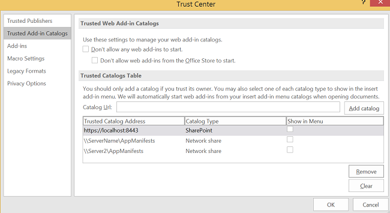
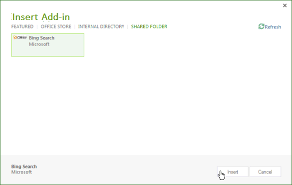
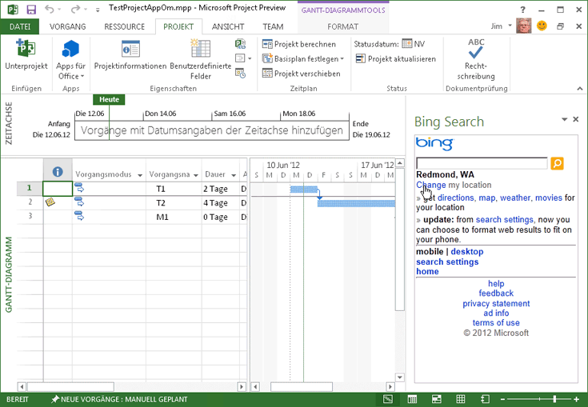

# Aufgabenbereich-Add-ins für Project
Office-Add-Ins ermöglichen zahlreiche Szenarien für das Integrieren von Project 2013 mit Webseiten und anderen Anwendungen. Sie können Add-ins für Project-Aufgabenbereiche mithilfe eines Text-Editors oder Visual Studio entwickeln.

 _**Gilt für:** apps for Office | Office Add-ins | Project_

Project Standard 2013 und Project Professional 2013 bieten Unterstützung für Aufgabenbereich-Add-ins. Sie können allgemeine Aufgabenbereich-Add-ins ausführen, die für Microsoft Word 2013 oder Microsoft Excel 2013 entwickelt wurden. Sie können auch benutzerdefinierte Add-ins entwickeln, die Auswahlereignisse in Project verarbeiten und Aufgaben-, Ressourcen, Ansichts- und anderen Daten auf Zellebene in einem Projekt mit SharePoint-Listen, SharePoint-Add-Ins, Webparts, Webdiensten und Enterprise-Anwendungen integrieren.

 >**Hinweis**  Zum [Project 2013 SDK-Download](https://www.microsoft.com/en-us/download/details.aspx?id=30435) gehören Beispiel-Add-ins, die das Verwenden des Add-in-Objektmodells für Project und das Verwenden des OData-Diensts für Berichte zu Daten in Project Server 2013 veranschaulichen. Siehe dazu nach dem Extrahieren und Installieren des SDK das Unterverzeichnis `\Samples\Apps\`.

Eine Einführung in Office-Add-Ins finden Sie unter [Office-Add-Ins-Plattformübersicht](../../docs/develop/privacy-and-security.md).

## Add-in-Szenarien für Project


Projektmanager können Projektverwaltungsaktivitäten mithilfe von Aufgabenbereich-Add-ins für Project unterstützen. Anstatt Project zu verlassen und eine andere Anwendung zu öffnen, um häufig verwendete Informationen zu suchen, können Projektmanager direkt in Project auf die Informationen zugreifen. Der Inhalt eines Aufgabenbereich-Add-ins kann kontextabhängig sein, und zwar basierend auf der ausgewählten Aufgabe, Ressource, Ansicht oder anderen Daten in einer Zelle in einem Gantt-Diagramm oder einer Ansicht zur Aufgaben- oder Ressourcennutzung.


 >**Hinweis**  Mit Project Professional 2013 können Sie Aufgabenbereich-Add-ins entwickeln, die auf lokal installierte Versionen von Project Server 2013 und Project Online sowie auf lokale Versionen oder Onlineversionen von SharePoint 2013 zugreifen.Project Standard 2013 unterstützt nicht die direkte Integration mit Project Server-Daten oder SharePoint-Aufgabenlisten, die mit Project Server synchronisiert werden.

Es gibt u. a. die folgenden Add-in-Szenarien für Project:


-  **Projektplanung**   Sie können Daten aus verwandten Projekten anzeigen, die sich auf die Planung auswirken. Mithilfe eines Aufgabenbereich-Add-ins können relevante Daten aus anderen Projekten in Project Server 2013 integriert werden. Sie können beispielsweise die abteilungsbezogene Auflistung von Projekten und Meilensteinterminen oder angegebene Daten aus anderen Projekten anzeigen, die auf einem ausgewählten benutzerdefinierten Feld basieren.
    
-  **Ressourcenmanagement**   Sie können den vollständigen Ressourcenpool in Project Server 2013 oder eine Untermenge basierend auf angegebenen Fertigkeiten, einschließlich Kostendaten und Ressourcenverfügbarkeit anzeigen, um geeignete Ressourcen besser auszuwählen.
    
-  **Statuserfassung und Genehmigungen**   Sie können mithilfe einer Webanwendung in einem Aufgabenbereich-Add-in Daten in externen ERP-Anwendungen, Arbeitszeittabellen-Systemen oder Buchhaltungsanwendungen aktualisieren oder anzeigen. Oder Sie können ein benutzerdefiniertes Webpart für die Statusgenehmigung erstellen, das sowohl in Project Web App als auch Project Professional 2013 verwendet werden kann.
    
-  **Teamkommunikation**   Sie können in einem Aufgabenbereich-Add-in im Kontext eines Projekts direkt mit Teammitgliedern und Ressourcen kommunizieren. Oder Sie können bei der Arbeit an einem Projekt für sich persönlich kontextbezogene Notizen verfassen.
    
-  **Arbeitsvorlagen**   Sie können in SharePoint-Bibliotheken und Sammlungen von Onlinevorlagen nach bestimmten Arten von Projektvorlagen suchen, z. B. nach Vorlagen für Bauprojekte, und diese Ihrer Project-Vorlagensammlung hinzufügen.
    
-  **Verknüpfte Elemente**   Sie können Metadaten, Dokumente und Nachrichten anzeigen, die mit bestimmten Aufgaben in einem Projektplan verknüpft sind. Sie können beispielsweise in Project Professional 2013 ein Projekt verwalten, das aus einer SharePoint-Aufgabenliste importiert wurde, und die Aufgabenliste weiter mit Änderungen im Projekt synchronisieren. Mithilfe eines Aufgabenbereich-Add-ins können weitere Felder oder Metadaten angezeigt werden, die Project für Aufgaben in der SharePoint-Liste nicht importiert hat.
    
-  **Verwenden der Project Server-Objektmodelle**   Verwenden Sie die GUID einer ausgewählten Aufgabe mit Methoden in der Project Server Interface (PSI) oder im clientseitigen Objektmodell (CSOM) von Project Server. Die Webanwendung für ein Add-in kann beispielsweise die Statuserfassungsdaten einer ausgewählten Aufgabe und Ressource lesen und aktualisieren oder in eine externe Arbeitszeittabellenanwendung integrieren.
    
-  **Abrufen von Berichtsdaten**   Mithilfe von REST- (Representational State Transfer), JavaScript- oder LINQ-Abfragen können Sie verwandte Informationen zu einer ausgewählten Aufgabe oder Ressource im OData-Dienst für Berichtstabellen in Project Web App finden. Abfragen, die den OData-Dienst nutzen, können mithilfe einer Online- oder lokalen Installation von Project Server 2013 erfolgen.
    
    Informationen finden Sie beispielsweise unter [Erstellen eines Project-Add-ins, das REST mit einem lokalen Project Server-OData-Dienst verwendet](../project/create-a-project-add-in-that-uses-rest-with-an-on-premises-odata-service.md)
    

## Entwickeln von Project-Add-ins


Die JavaScript-Bibliothek für Project Add-Ins bietet Erweiterungen des  **Office**-Namespacealias, über die Entwickler auf Eigenschaften der Project-Anwendung sowie Aufgaben, Ressourcen und Ansichten in einem Projekt zugreifen können. Die JavaScript-Bibliothekserweiterungen in der Datei Project-15.js werden in einem Project-Add-in verwendet, das mit Visual Studio 2015 erstellt wird. Die Dateien Office.js, Office.debug.js, Project-15.js, Project-15.debug.js und dazugehörige Dateien sind ebenfalls im Umfang des Project 2013 SDK-Downloads enthalten.

Zum Entwickeln eines Add-ins können Sie in einem einfachen Text-Editor eine HTML-Webseite und dazugehörige JavaScript-Dateien, CSS-Dateien und REST-Abfragen erstellen. Zusätzlich zu einer HTML-Seite oder Webanwendung benötigt ein Add-in eine XML-Manifestdatei für die Konfiguration. Project kann eine Manifestdatei nutzen, die ein  **type**-Attribut enthält, das als  **TaskPaneExtension** angegeben ist. Die Manifestdatei kann von mehreren Office 2013-Clientanwendungen verwendet werden. Sie können aber auch eine Manifestdatei erstellen, die für Project 2013 spezifisch ist. Weitere Informationen finden Sie im Abschnitt _Entwicklungsgrundlagen_ unter [Office-Add-Ins-Plattformübersicht](../../docs/develop/privacy-and-security.md).

Für komplexe benutzerdefinierte Anwendungen und ein einfacheres Debugging wird empfohlen, Websites für Add-ins mit Visual Studio 2015 zu entwickeln. Visual Studio 2015 bietet Vorlagen für Add-in-Projekte, bei denen Sie die Art des Add-ins (Aufgabenbereich, Inhalt oder Mail) und die Hostanwendung (Project, Word, Excel oder Outlook) auswählen können. Allgemeine Informationen zum Erstellen von Aufgabenbereich-Add-ins finden Sie unter [Erstellen eines Aufgabenbereich- oder Inhalts-Add-Ins mit Visual Studio](create-a-task-pane-or-content-add-in-with-visual-studio.md). Ein Project-spezifisches Beispiel für Daten aus Project Online finden Sie unter [Verbinden einer Project-Aufgabenbereich-Add-ins mit PWA](http://blogs.msdn.com/b/project_programmability/archive/2012/11/02/connecting-a-project-task-pane-app-to-pwa.aspx) im MSDN-Blog zur Project-Programmierbarkeit.

Sie können Aufgabenbereich-Add-ins für andere Office 2013-Anwendungen erstellen, indem Sie die Onlineversion der Napa verwenden. Weitere Informationen finden Sie unter [Erstellen von Office-Add-Ins mit Napa mit einer Office 365-Entwicklerwebsite](create-office-add-ins-with-napa-with-a-developer-site.md).


 >**Hinweis**  Von der Project 2013-Version werden die Napa nicht unterstützt.

Wenn Sie den Project 2013 SDK-Download installieren, enthält das Unterverzeichnis  `\Samples\Apps\` die folgenden Beispiel-Add-Ins:


-  **Bing Search:**  Die Manifestdatei BingSearch.xml zeigt auf die Bing-Suchseite für mobile Geräte. Da die Bing Web App bereits im Internet vorhanden ist, verwendet das Bing Search-Add-in keine anderen Quellcodedateien bzw. nicht das Add-in-Objektmodell für Project.
    
-  **Project OM Test:**  Die Manifestdatei JSOM_SimpleOMCalls.xml und die Datei JSOM_Call.html bilden gemeinsam ein Beispiel zum Testen des Objektmodells und der Add-in-Funktionalität in Project 2013. Die HTML-Datei verweist auf die Datei JSOM_Sample.js, die JavaScript-Funktionen bietet, die die Dateien Office.js und Project-15.js für die Hauptfunktionalität nutzen. Der SDK Download enthält alle erforderlichen Quellcodedateien und die XML-Manifestdatei für das Add-in „Project OM Test". Informationen zur Entwicklung und Installation des Beispiels „Project OM Test" finden Sie unter [Erstellen des ersten Aufgabenbereich-Add-ins für Project 2013 mit einem Text-Editor](../../docs/project/create-your-first-task-pane-add-in-for-project-by-using-a-text-editor.md).
    
-  **HelloProject_OData:**  Dies ist eine Visual Studio-Lösung für Project Professional 2013, die Daten des aktiven Projekts, z. B. Kosten, Arbeitsaufwand und Status, zusammenfasst und mit dem Durchschnitt aller veröffentlichten Projekte der Project Web App-Instanz vergleicht, in der das aktive Projekt gespeichert ist. Die Entwicklung, die Installation und das Testen der Beispiellösung, bei der das REST-Protokoll mit dem  **ProjectData**-Dienst in Project Web App verwendet wird, ist unter [Erstellen eines Project-Add-ins, das REST mit einem lokalen Project Server-OData-Dienst verwendet](../project/create-a-project-add-in-that-uses-rest-with-an-on-premises-odata-service.md) beschrieben.
    

### Erstellen einer Add-in-Manifestdatei


Die Manifestdatei gibt die URL der Add-in-Website oder Webanwendung, die Art des Add-ins (Aufgabenbereich für Project), optionale URLs von Inhalten für andere Sprachen und Gebietsschemas sowie weitere Eigenschaften an.


### Schritt 1: So erstellen Sie die Add-in-Manifestdatei für Bing Search


1. Erstellen Sie im lokalen Verzeichnis eine XML-Datei. Die XML-Datei umfasst das  **OfficeApp**-Element und untergeordnete Elemente, die unter [XML-Manifest für Office-Add-Ins](../../docs/overview/add-in-manifests.md) beschrieben sind. Erstellen Sie beispielsweise die DateiBingSearch.xml, die den folgenden XML-Code enthält.
    
  ```XML
  <?xml version="1.0" encoding="utf-8"?>
<OfficeApp xmlns="http://schemas.microsoft.com/office/appforoffice/1.0" 
           xmlns:xsi="http://www.w3.org/2001/XMLSchema-instance" 
          xsi:type="TaskPaneApp">
  <Id>1234-5678</Id>
  <Version>15.0</Version>
  <ProviderName>Microsoft</ProviderName>
  <DefaultLocale>en-us</DefaultLocale>
  <DisplayName DefaultValue="Bing Search">
  </DisplayName>
  <Description DefaultValue="Search selected data on Bing">
  </Description>
  <IconUrl DefaultValue="http://officeimg.vo.msecnd.net/_layouts/images/general/office_logo.jpg">
  </IconUrl>
  <Capabilities>
    <Capability Name="Project"/>
  </Capabilities>
  <DefaultSettings>
    <SourceLocation DefaultValue="http://m.bing.com">
    </SourceLocation>
  </DefaultSettings>
  <Permissions>ReadWriteDocument</Permissions>
</OfficeApp>
  ```


    Es folgen die in der Add-in-Manifestdatei erforderlichen Elemente:
    
      - Im  **OfficeApp**-Element gibt das  `xsi:type="TaskPaneApp"`-Attribut an, dass das Add-in ein Aufgabenbereich-Add-in ist.
    
  - Das  **Id**-Element ist eine UUID, die eindeutig sein muss. 
    
  - Das Element  **Version** gibt die Version des Add-ins an. Das **ProviderName**-Element ist der Name des Unternehmens oder Entwicklers, das/der das Add-in anbietet. Das  **DefaultLocale**-Element gibt das Standardgebietsschema für die Zeichenfolgen in der Manifestdatei an.
    
  - Das Element  **DisplayName** ist der Name, der auf dem Menüband von Project 2013 auf der Registerkarte **Ansicht** in der Dropdownliste **Aufgabenbereich-Add-in** angezeigt wird. Der Wert kann bis zu 32 Zeichen haben.
    
  - Das Element  **Description** enthält die Add-in-Beschreibung für das Standardgebietsschema. Der Wert kann bis zu 2.000 Zeichen haben.
    
  - Das  **Capabilities**-Element enthält mindestens ein untergeordnetes  **Capability**-Element zum Angeben der Hostanwendung.
    
  - Das Element  **DefaultSettings** enthält das Element **SourceLocation**, das den Pfad einer HTML-Datei zu einer Dateifreigabe oder die URL einer Webseite angibt, die das Add-in nutzt. Die Elemente  **RequestedHeight** und **RequestedWidth** werden von Aufgabenbereich-Add-ins ignoriert.
    

    Das  **IconUrl**-Element ist optional. Dabei kann es sich um ein Symbol in einer Dateifreigabe oder die URL eines Symbols in einer Webanwendung handeln.
    
2. (Optional) Fügen Sie  **Override**-Elemente mit Werten für andere Gebietsschemas hinzu. Die folgende Manifestdatei bietet beispielsweise  **Override**-Elemente für französische Angaben für  **DisplayName**,  **Description**,  **IconUrl** und **SourceLocation**.
    
  ```XML
  <?xml version="1.0" encoding="utf-8"?>
<OfficeApp xmlns="http://schemas.microsoft.com/office/appforoffice/1.0" 
           xmlns:xsi="http://www.w3.org/2001/XMLSchema-instance" 
          xsi:type="TaskPaneApp">
  <Id>1234-5678</Id>
  <Version>15.0</Version>
  <ProviderName>Microsoft</ProviderName>
  <DefaultLocale>en-us</DefaultLocale>
  <DisplayName DefaultValue="Bing Search">
    <Override Locale="fr-fr" Value="Bing Search"/>
  </DisplayName>
  <Description DefaultValue="Search selected data on Bing">
    <Override Locale="fr-fr" Value="Search selected data on Bing"></Override>
  </Description>
  <IconUrl DefaultValue="http://officeimg.vo.msecnd.net/_layouts/images/general/office_logo.jpg">
    <Override Locale="fr-fr" Value="http://officeimg.vo.msecnd.net/_layouts/images/general/office_logo.jpg"/>
  </IconUrl>
  <Capabilities>
    <Capability Name="Project"/>
  </Capabilities>
  <DefaultSettings>
    <SourceLocation DefaultValue="http://m.bing.com">
      <Override Locale="fr-fr" Value="http://m.bing.com"/>
    </SourceLocation>
  </DefaultSettings>
  <Permissions>ReadWriteDocument</Permissions>
</OfficeApp>
  ```


## Installieren von Project-Add-ins


In Project 2013 können Sie Add-ins als eigenständige Lösungen in einer Dateifreigabe oder einem privaten Add-in-Katalog installieren. Sie können Add-ins auch aus dem öffentlichen Office Store beziehen.

Eine Dateifreigabe kann XML-Manifestdateien und Unterverzeichnisse für mehrere Add-ins enthalten. In Project 2013 können Sie im Dialogfeld  **Sicherheitscenter** auf der Registerkarte **Vertrauenswürdige Add-in-Kataloge** Verzeichnisspeicherorte und Kataloge für Manifestdateien hinzufügen oder entfernen. Damit ein Add-in in Project angezeigt wird, muss das Element **SourceLocation** in einer Manifestdatei auf eine vorhandene Website oder HTML-Quelldatei zeigen.


 >**Hinweis**  Internet Explorer 9 (oder höher) muss zwar installiert, aber nicht der Standardbrowser sein. Office-Add-Ins benötigen Komponenten in Internet Explorer 9. Der Standardbrowser kann Internet Explorer 9, Safari 5.0.6, Firefox 5, Chrome 13 oder eine höhere Version eines dieser Browser sein.

In Schritt 2 wird das Bing Search-Add-in auf dem lokalen Computer installiert, auf dem Project 2013 installiert ist. Da in der Add-in-Infrastruktur jedoch lokale Dateipfade wie  `C:\Project\AppManifests` nicht direkt verwendet werden, können Sie auf dem lokalen Computer eine Netzwerkfreigabe einrichten. Sie können aber auch auf einem Remotecomputer eine Freigabe einrichten.


### Schritt 2: So installieren Sie das Bing Search-Add-in


1. Erstellen Sie ein lokales Verzeichnis für Add-in-Manifestdateien, z. B.  `C:\Project\AppManifests`.
    
2. Geben Sie das Verzeichnis  `C:\Project\AppManifests` alsAppManifests frei, sodass sich der Netzwerkpfad zur Dateifreigabe in `\\ServerName\AppManifests` ändert.
    
3. Kopieren Sie die Manifestdatei  **BingSearch.xml** in das Verzeichnis `C:\Project\AppManifests`.
    
4. Öffnen Sie in Project 2013 das Dialogfeld  **Projektoptionen**, wählen Sie  **Sicherheitscenter** und dann **Einstellungen für das Sicherheitscenter** aus.
    
5. Wählen Sie im Dialogfeld  **Sicherheitscenter** im linken Bereich die Option **Vertrauenswürdige Add-in-Kataloge** aus.
    
6. Fügen Sie im Bereich  **Vertrauenswürdige Add-in-Kataloge** (siehe Abbildung 1) den Pfad `\\ServerName\AppManifests` im Textfeld **Katalog-URL** hinzu, klicken Sie auf **Katalog hinzufügen** und anschließend auf **OK**.
    
     >**Hinweis**  Abbildung 1 zeigt die beiden Dateifreigaben und eine hypothetische URL eines privaten Katalogs in der Liste  **Adresse des vertrauenswürdigen Katalogs**. Nur eine Dateifreigabe kann die Standarddateifreigabe und nur eine Katalog-URL der Standardkatalog sein. Wenn Sie beispielsweise  `\\Server2\AppManifests` als Standard festlegen, deaktiviert Project das Kontrollkästchen **Standard** für `\\ServerName\AppManifests`.Wenn Sie die Standardauswahl ändern, können Sie auf  **Löschen** klicken, um installierte Add-ins zu entfernen. Starten Sie Project anschließend neu. Wenn Sie ein Add-in der Standarddateifreigabe oder dem SharePoint-Katalog hinzufügen, solange Project geöffnet ist, müssen Sie Project neu starten.

    **Abbildung 1: Hinzufügen von Katalogen mit Add-in-Manifestdateien über das Sicherheitscenter**

    

7. Klicken Sie auf dem Menüband von  **Project** auf das Dropdownmenü **Office-Add-ins** und dann auf **Alles anzeigen**. Klicken Sie im Dialogfeld  **Add-in einfügen** auf **FREIGEGEBENER ORDNER** (siehe Abbildung 2).
    
    **Abbildung 2: Starten eines Add-ins, das sich auf einer Dateifreigabe befindet**

    

8. Wählen Sie das Bing Search-Add-in aus, und klicken Sie dann auf  **Einfügen**.
    
Das Bing Search-Add-in wird wie in Abbildung 3 in einem Aufgabenbereich angezeigt. Sie können die Größe des Aufgabenbereichs manuell ändern und das Bing Search-Add-in nutzen.

**Abbildung 3: Verwenden des Bing Search-Add-ins**




## Verteilen von Project-Add-ins


Sie können Add-ins über eine Dateifreigabe, einen Add-in-Katalog in einer SharePoint-Bibliothek oder eine Project-Add-In im Office Store verteilen. Weitere Informationen finden Sie unter [Veröffentlichen Ihres Office-Add-ins](../publish/publish.md).


## Zusätzliche Ressourcen


- [Office-Add-Ins-Plattformübersicht](../../docs/develop/privacy-and-security.md)
    
- [XML-Manifest für Office-Add-Ins](../../docs/overview/add-in-manifests.md)
    
- [JavaScript-API für Office](http://msdn.microsoft.com/library/b27e70c3-d87d-4d27-85e0-103996273298%28Office.15%29.aspx)
    
- [Erstellen des ersten Aufgabenbereich-Add-ins für Project 2013 mit einem Text-Editor](../../docs/project/create-your-first-task-pane-add-in-for-project-by-using-a-text-editor.md)
    
- [Erstellen eines Project-Add-ins, das REST mit einem lokalen Project Server-OData-Dienst verwendet](../project/create-a-project-add-in-that-uses-rest-with-an-on-premises-odata-service.md)
    
- [Verbinden eines Project-Aufgabenbereich-Add-ins mit PWA](http://blogs.msdn.com/b/project_programmability/archive/2012/11/02/connecting-a-project-task-pane-app-to-pwa.aspx)
    
- [Project 2013 SDK-Download](https://www.microsoft.com/en-us/download/details.aspx?id=30435%20)
    
