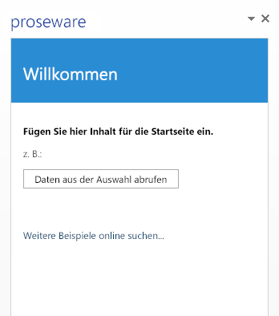

# Hosten eines Office-Add-Ins in Microsoft Azure
Verwenden Sie Visual Studio 2015 und die Microsoft Office Developer Tools zum Veröffentlichen und Hosten eines Office-Add-In in Microsoft Azure. 

 _**Gilt für:** Access apps for SharePoint | apps for Office | Excel | Office Add-ins | Outlook | PowerPoint | Project | Word_

Die einfachste Office-Add-In besteht aus einer XML-Manifestdatei und einer HTML-Seite. Die XML-Manifestdatei beschreibt die Merkmale des Add-Ins, z. B. den Namen, in welchen Office-Clientanwendungen es ausgeführt werden kann und die URL für die HTML-Seite des Add-Ins. Die HTML-Seite ist in einer Office-Add-In-Website enthalten, und die Benutzer können sie sehen und damit interagieren, wenn sie Ihr Add-in installieren und ausführen. Weitere Informationen zu Office-Add-Ins im Allgemeinen finden Sie unter [Office-Add-Ins-Plattformübersicht](../../docs/develop/privacy-and-security.md).

Sie können die Website in einem Office-Add-In auf vielen Web-Hostingplattformen, darunter auch Azure hosten. Um ein Office-Add-In in Azure zu hosten, müssen Sie den Office-Add-In auf einer Azure-Website veröffentlichen. 

Dieses Thema geht davon aus, dass Sie keine Erfahrungen im Umgang mit Azure haben. Nach Abschluss haben Sie einen einfachen Office-Add-In, dessen Website auf Azure gehostet wird.
Sie erfahren:

- So fügen Sie Office 2013 zu einem vertrauenswürdigen Add-in-Katalog hinzu 
    
- Wie Sie eine Website in Azure mithilfe von Visual Studio 2015 oder dem Azure-Verwaltungsportal erstellen können
    
- Wie Sie ein Office-Add-In auf einer Azure-Website veröffentlichen und hosten können
    

**Ein Beispiel-Office-Add-in für eine in Windows Azure gehostete Website**

## Richten Sie Ihren Entwicklungscomputer mit dem Azure SDK für .NET, ein Azure-Abonnement und Office 2013 verfügen.

1. Installieren Sie das Azure SDK für .NET von der Downloadseite [Azure](http://azure.microsoft.com/de-de/downloads/). Falls Sie Visual Studio nicht nicht installiert haben, wird Visual Studio Express für Web mit dem SDK installiert.
    
      1. Klicken Sie unter  **Sprachen** auf **.NET**.
    
  2. Wählen Sie die Version des Azure .NET SDK, dass mit Ihrer Visual Studio-Version übereinstimmt, falls Sie Visual Studio bereits installiert haben.
    
  3. Klicken Sie bei der Aufforderung, ob die ausführbare Installationsdatei ausgeführt oder gespeichert werden soll, auf  **Ausführen**.
    
  4. Klicken Sie im Fenster des Webplattform-Installer auf  **Installieren**.
    
2. Installieren Sie Office 2013, falls das noch nicht geschehen ist. 
    
     >**Hinweis**  Sie können eine [einmonatige Testversion erhalten](http://office.microsoft.com/de-de/try/?WT%2Eintid1=ODC%5FENUS%5FFX101785584%5FXT104056786).
3. Rufen Sie Ihr Azure-Konto ab.
    
     >**Hinweis**  Falls Sie ein Microsoft Developer Network (MSDN)-Abonnent sind, [erhalten Sie ein Azure-Abonnement als Teil Ihres MSDN-Abonnements](http://azure.microsoft.com/de-de/pricing/member-offers/msdn-benefits/).Falls Sie kein MSDN-Abonnent sind, können Sie [ eine kostenlose Testversion von Azure auf der Windows Azure-Website herunterladen](http://azure.microsoft.com/de-de/pricing/free-trial/). 
Um die exemplarische Vorgehensweise einfach zu halten und den Fokus auf die Verwendung von Azure mit einem Office-Add-In zu legen, sollten Sie eine lokale Dateifreigabe als vertrauenswürdigen Katalog verwenden, in dem Sie die XML-Manifestdatei des Add-ins speichern können. Bei einem Add-in, das in einem oder mehreren Unternehmen eingesetzt werden soll, möchten Sie möglicherweise die Add-in-Manifestdatei in SharePoint speichern, oder das Add-in im Office Store veröffentlichen. Weitere Informationen dazu finden Sie unter den Grundlagen der Veröffentlichung im [Office-Add-Ins-Plattformübersicht](../../docs/develop/privacy-and-security.md).

## Schritt 1: Erstellen einer Netzwerk-Dateifreigabe zum Hosten Ihrer Add-in-Manifestdatei

1. Öffnen Sie auf Ihrem Entwicklungscomputer den Datei-Explorer (oder den Windows Explorer, falls Sie Windows 7 oder eine frühere Version von Windows einsetzen).
    
2. Klicken Sie mit der rechten Maustaste auf Laufwerk C:\ und dann auf  **Neu** > **Ordner**.
    
3. Name des neuen Ordners AddinManifests.
    
4. Klicken Sie mit der rechten Maustaste auf den Ordner AddinManifests und dann auf  **Freigeben** > **Bestimmte Personen**.
    
5. Klicken Sie in der  **Dateifreigabe** auf den Dropdownpfeil und anschließend auf **Jeder**>  **Hinzufügen** > **Freigabe**.
    

## Schritt 2: Hinzufügen der Dateifreigabe zum vertrauenswürdigen Add-in-Katalog, sodass die Office-Clientanwendungen dem Speicherort der Installation von Office-Add-Ins vertrauen

1.  Starten Sie Word 2013, und erstellen Sie ein Dokument. (Wir verwenden in diesem Beispiel Word 2013, Sie können jedoch jede Office-Anwendung verwenden, die Office-Add-Ins unterstützt – z. B. Excel, Outlook, PowerPoint oder Project 2013.)
    
2.  Klicken Sie auf **Datei** > **Optionen**.
    
3.  Klicken Sie in den **Word-Optionen** auf **Sicherheitscenter** und dann auf **Einstellungen für das Sicherheitscenter**. 
    
4.  Klicken Sie im **Sicherheitscenter** auf **Vertrauenswürdige Add-in-Kataloge**. Geben Sie den UNC-Pfad für die zuvor von Ihnen erstellte Dateifreigabe als  **Katalog-URL** ein. Z. B. \\YourMachineName\AddinManifests. Klicken Sie anschließend auf **Katalog hinzufügen**. 
    
5. Aktivieren Sie das Kontrollkästchen  **Im Menü anzeigen**. Wenn Sie eine XML-Manifestdatei eines Add-ins in einer Freigabe speichern, die aus einem vertrauenswürdigen Add-in-Katalog besteht, wird das Add-in im Dialogfeld  **Office-Add-Ins** unter **Freigegebener Ordner** angezeigt.
    

## Schritt 3: Erstellen Sie eine Website in Azure

Es gibt unterschiedliche Möglichkeiten zum Erstellen einer leeren Azure-Website. Wenn Sie Visual Studio 2015 verwenden, müssen Sie die Schritte in [Verwenden von Visual Studio 2015 ](#verwenden-von-visual-studio-2015) befolgen, um eine Azure-Website aus der Visual Studio-IDE zu erstellen. Sie können auch die Schritte in [Verwenden des Azure Verwaltungsportals](#verwenden-des-azure-verwaltungsportals) befolgen, um die Azure-Website zu erstellen.

### Verwenden von Visual Studio 2015

1. Wählen Sie in Visual Studio im Menü  **Ansicht** die Option **Server-Explorer**. Klicken Sie mit der rechten Maustaste auf  **Azure**, und wählen Sie  **Mit Microsoft Azure-Abonnement verbinden**. Befolgen Sie die Anweisungen zum Verbinden mit dem Azure-Abonnement.
    
2. Erweitern Sie in Visual Studio im  **Server-Explorer** das Menü **Azure**, klicken Sie mit der rechten Maustaste auf  **App-Dienst** und dann auf **Neue Web App erstellen**.
    
3. Geben Sie im Dialogfeld  **Web App in Microsoft Azure erstellen** folgende Information an:
    
      - Geben Sie unter  **Web App-Name** einen eindeutigen Namen für Ihre Site ein. Azure überprüft, ob der Websitename innerhalb der azurewebsites.net-Domäne eindeutig ist.
    
  - Wählen Sie den  **App-Dienstplan**, den Sie zum Autorisieren des Erstellens dieser Website verwenden. Wenn Sie einen neuen Plan erstellen, müssen Sie diesen benennen.
    
  - Wählen Sie die  **Ressourcengruppe** für Ihre Website. Wenn Sie eine neue Gruppe erstellen, müssen Sie diese auch benennen.
    
  - Wählen Sie die gewünschte geografische  **Region**.
    
  - Für  **Datenbankserver:** nehmen Sie die Standardoption **Keine Datenbank** an und klicken Sie anschließend auf **Erstellen**.
    

    Die neue Website wird unter der ausgewählten Ressourcengruppe im  **Server Explorer** unter **App-Dienst** unter **Azure** angezeigt.
    
4. Klicken Sie mit der rechten Maustaste auf die neue Website und dann auf  **Im Browser anzeigen**. Ihr Browser öffnet eine Website und zeigt sie mit der Meldung „Diese Website wurde erfolgreich erstellt" an.
    
5. Ändern Sie die URL der Website in der Adressleiste des Browsers, damit HTTPS verwendet wird, und drücken Sie die  **EINGABETASTE**, um zu bestätigen, dass das HTTPS-Protokoll aktiviert ist. Für das Office-Add-In-Modell müssen Add-ins das HTTPS-Protokoll verwenden. 
    
6. Klicken Sie in Visual Studio 2015 im  **Server-Explorer** mit der rechten Maustaste auf die neue Website, dann auf **Veröffentlichungsprofil herunterladen** und speichern Sie das Profil anschließend auf Ihrem Computer. Das Veröffentlichungsprofil enthält Ihre Anmeldeinformationen und damit können Sie [Schritt 5: Veröffentlichen Ihres Office-Add-ins auf der Azure-Website](#schritt-5-veröffentlichen-ihres-office-add-ins-auf-der-azure-website).
    

### Verwenden des Azure Verwaltungsportals

1. Melden Sie sich mit Ihrem Azure-Konto im [Azure-Verwaltungsportal](https://manage.windowsazure.com/) an.
    
2. Klicken Sie auf  **NEU**>  **BERECHNEN**>  **WEB APP**>  **SCHNELLERFASSUNG**. 
    
3. Geben Sie unter  **URL** einen eindeutigen Websitenamen ein, um die URL für die Website zu vervollständigen. Das Verwaltungsportal prüft, ob der Websitename innerhalb der azurewebsites.net-Domäne eindeutig ist.
    
4. Wählen Sie die gewünschte geografische **REGION** für Ihre Website.
    
5. Klicken Sie auf  **Web App erstellen**. Das Azure-Verwaltungsportal erstellt die Website und leitet Sie auf die  **Websites**-Seite um, auf der Sie den Status der Website sehen können.
    
    Wenn der Status der Website  **Wird ausgeführt** lautet, wählen Sie in der Spalte **Name** die URL für die Website. Ihr Browser öffnet die Webseite und zeigt sie mit der Meldung **Ihre Web App wurde erstellt** an.
    
    Ändern Sie die URL der Website in der Adressleiste des Browsers, damit HTTPS verwendet wird, und drücken Sie die  **EINGABETASTE**, um zu bestätigen, dass das HTTPS-Protokoll aktiviert ist. Für das Office-Add-In-Modell müssen Add-ins das HTTPS-Protokoll verwenden. 
    
6. Klicken Sie auf der Seite  **Web Apps** auf die neue Website.
    
7. Klicken Sie unter  **Ihre App veröffentlichen** auf **Veröffentlichungsprofil herunterladen**, und speichern Sie das Veröffentlichungsprofil auf Ihrem Computer. Merken Sie sich den Dateinamen und den Speicherort, da Sie diese später benötigen.
    
    Das Veröffentlichungsprofil enthält Ihre Anmeldeinformationen und damit können Sie sicher in Azure veröffentlichen. 
    

## Schritt 4: Erstellen eines Office-Add-ins Visual Studio

1. Starten Sie Visual Studio als Administrator.
    
2. Klicken Sie auf  **Datei**>  **Neu** > **Projekt**.
    
3. Erweitern Sie unter  **Vorlagen** das Menü **Visual C#** (oder **Visual Basic**), dann  **Office/SharePoint**, und klicken Sie anschließend auf  **Office-Add-Ins**.
    
4. Klicken Sie auf  **Office-Add-In** und dann auf **OK**, um die Standardeinstellungen anzunehmen. 
    
5. 
    
6. Wenn  **Office-Add-in erstellen** angezeigt wird, lassen Sie die Standardauswahl bei Aufgabenbereich-Add-in, und klicken Sie auf **Weiter**.
    
7. Deaktivieren Sie auf der nächsten Seite alle Kontrollkästchen mit Ausnahme von Word, und wählen Sie dann  **Fertig stellen**.
    
Ihr einfacher Office-Add-In wurde erstellt und kann nun in Azure veröffentlicht werden.
Da wir, Ihnen zeigen möchten, wie in Azure veröffentlicht werden kann, nehmen Sie keine Änderungen an dem von Ihnen mit der Standard-Office-Add-In-Vorlage in Visual Studio erstellten Beispiel-Add-in vor.

## Schritt 5: Veröffentlichen Ihres Office-Add-ins auf der Azure-Website

1. Erweitern Sie bei geöffnetem Beispiel-Add-in in Visual Studio den Projektmappenknoten im  **Projektmappen-Explorer**, sodass Sie beide Projekte für die Lösung sehen können. 
    
2. Klicken Sie mit der rechten Maustaste auf das Webprojekt und anschließend auf  **Veröffentlichen**. 
    
    Das Webprojekt enthält Office-Add-In-Websitedateien, es ist also das Projekt, das Sie inAzure veröffentlichen.
    
3. Klicken Sie unter  **Web veröffentlichen** auf **Importieren**. 
    
4. Klicken Sie unter  **Veröffentlichungseinstellungen importieren** auf **Durchsuchen** und navigieren Sie anschließend zum zuvor in diesem Thema erläuterten Speicherort Ihres Veröffentlichungsprofils. Klicken Sie auf **OK**, um Ihr Profil zu importieren.
    
5. Nehmen Sie unter  **Web veröffentlichen** auf der Registerkarte **Verbindung** die Standardwerte an und klicken Sie anschließend auf **Weiter**. 
    
    Klicken Sie erneut auf  **Weiter &gt;**, um die Standardeinstellungen zu übernehmen.
    
6. Klicken Sie auf der Registerkarte  **Vorschau** auf **Vorschau starten**. Die Vorschau zeit alle Dateien des Webprojekts an, die auf die Azure-Website veröffentlicht werden.
    
7. Klicken Sie auf  **Veröffentlichen**. Visual Studio veröffentlicht das Webprojekt für Ihren Office-Add-In in Ihrem Azure-Website. 
    
8. Wenn Visual Studio das Veröffentlichen des Webprojekts fertig gestellt hat, öffnet sich Ihr Browser und zeigt eine Website mit der Meldung „Diese Web App wurde erfolgreich erstellt" an. Das ist die aktuelle Standardseite der Website.
    
    Ändern Sie die URL in https:, und fügen Sie den Pfad der Standard-HTML-Seite Ihres Add-ins ein. Die geänderte URL sollte ungefähr so aussehen: https://YourDomain.azurewebsites.net/Addin/Home/Home.html. Dadurch wird bestätigt, dass die Website Ihres Add-ins nun in Azure gehostet wird. Kopieren Sie diese URL, da Sie sie beim Bearbeiten der Add-in-Manifestdatei später in diesem Thema brauchen werden.
    

## Schritt 6: Bearbeiten Sie die Add-in-Manifestdatei, damit sie auf den Office-Add-In in Azure verweist.

1. Erweitern Sie in Visual Studio bei geöffneter Office-Add-In im  **Projektmappen-Explorer** das Projekt, sodass beide Projekte angezeigt werden.
    
2. Erweitern Sie das Office-Add-In-Projekt, z. B.  **OfficeAdd-in1**, klicken Sie mit der rechten Maustaste auf den Manifest-Ordner und dann auf  **Öffnen**. Nun wird die Seite mit den Eigenschaften für das Add-in-Manifest angezeigt.
    
3. Für den  **Quellspeicherort:** geben Sie die URL der Haupt-HTML-Seite des Add-Ins ein, die Sie im vorherigen Schritt nach der Veröffentlichung des Add-Ins kopiert haben, z. B. https://YourDomain.azurewebsites.net/Addin/Home/Home.html.
    
4. Klicken Sie auf  **Datei** und dann auf **Alles speichern**. Schließen Sie die Seite mit den Eigenschaften für das Add-in-Manifest.
    
5. Klicken Sie im  **Projektmappen-Explorer** mit der rechten Maustaste auf den Manifest-Ordner und dann auf **Ordner im Datei-Explorer öffnen**.
    
6. Kopieren Sie die Add-in-Manifestdatei, z. B. OfficeAdd-in1.xml. 
    
7. Navigieren Sie zu der Netzwerk-Dateifreigabe, die Sie zuvor in diesem Thema erstellt haben und fügen Sie die Manifest-Datei im Ordner ein.
    

## Schritt 7: Fügen Sie das Add-in in der Office-Clientanwendung ein, und führen Sie es aus.

1. Starten Sie Word und öffnen Sie ein neues Dokument.
    
2. Klicken Sie im Menüband auf  **Einfügen**>  **Meine Apps** und dann auf **Alle anzeigen**.
    
3. Klicken Sie im Dialogfeld  **Apps für Office** auf **FREIGEGEBENER ORDNER**. Office Clientanwendungen, die mit dem Office-Add-Ins-Modell funktionieren, prüfen den Ordner, den Sie als vertrauenswürdigen Add-in-Katalog aufgelistet haben und zeigen den Add-Ins im Dialogfeld an. Darin sollten Sie das Symbol Ihres Beispiel-Add-ins sehen.
    
4. Klicken Sie auf das Symbol für Ihr Add-in und dann auf  **Einfügen**. Das Add-in wird auf der Seite der Clientanwendung eingefügt.
    
5. Testen Sie die Funktion des Add-ins, indem Sie Text in dem Dokument verfassen und dann auf  **Daten aus Auswahl abrufen** klicken.
    

## Zusätzliche Ressourcen

- [Veröffentlichen Ihres Office-Add-ins](../publish/publish.md)
    
- [Verpacken des Add-Ins mit Napa oder Visual Studio für die Veröffentlichung](../publish/package-your-add-in-using-napa-or-visual-studio.md)
    
