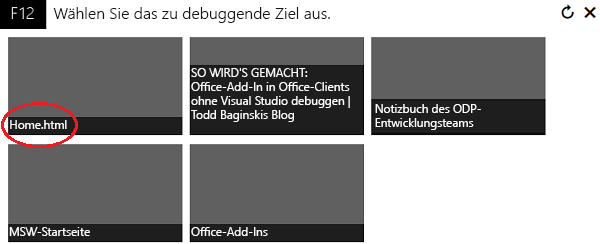
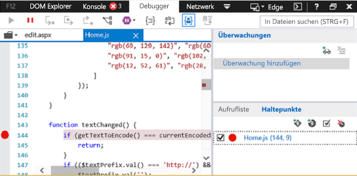
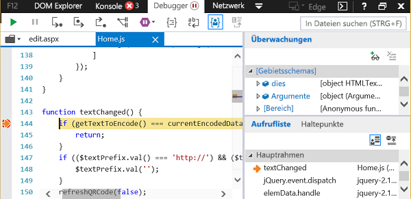

# Debuggen von Add-Ins mithilfe von F12-Entwicklertools unter Windows 10
Verwenden Sie den Debugger aus der F12-Entwicklertools unter Windows 10 zum Debuggen von Office-Add-Ins.

 _**Gilt für:** apps for Office | Office Add-ins_

Die F12-Entwicklertools helfen Ihnen beim Debuggen, Testen und Beschleunigen von Webseiten. Sie können auch mit Office-Add-Ins verwendet werden. Die F12-Tools sind unter Windows 10 verfügbar. 
Die F12-Entwicklertools können Sie beim Entwickeln und Debuggen Ihres Office-Add-Ins unterstützen, wenn Sie keine IDE wie Visual Studio verwenden oder wenn Sie ein Problem untersuchen müssen, während Sie das Add-In außerhalb der IDE ausführen. Die F12-Entwicklertools können nach dem Ausführen des Add-Ins gestartet werden.
In diesem Artikel wird gezeigt, wie Sie das Debuggertool aus den F12-Entwicklertools in Windows 10 verwenden können, um Ihre Office-Add-Ins zu testen. Sie können Add-Ins aus dem Store und auch alle Add-Ins in Ihrem Konto testen. Die F12-Tools werden in einem eigenen Fenster angezeigt und verwenden nicht Visual Studio.

 >**Hinweis**  Der Debugger ist Bestandteil der F12-Entwicklertools unter Windows 10 und Internet Explorer. Er ist nicht in früheren Versionen von Windows vorhanden. 

### Voraussetzungen

Sie benötigen die folgende Software:

- Die F12-Entwicklertools, die Bestandteil von Windows 10 sind. 
    
- Die Office-Clientanwendung, die Ihr Add-In hostet. 
    
- Ihr Add-In. 
    
In diesem Beispiel werden Word und ein kostenloses Add-In aus dem Office Store verwendet.

### Verwendung des Debuggers

1. Öffnen Sie die Office-Clientanwendung auf Ihrem Computer. 
    
    Öffnen Sie Word, und wählen Sie ein leeres Dokument aus. 
    
2. Wählen Sie auf der Registerkarte  **Einfügen** im Menüband die Schaltfläche **Meine Add-Ins** aus, und laden Sie ein Add-In aus dem Store oder Ihrem Add-In-Katalog.
    
    Wählen Sie für dieses Beispiel die Schaltfläche „Store" und dann das QR4Office-Add-In aus.
    
3. Starten Sie die F12-Entwicklungstools, die Ihrer Version von Office entsprechen:
    
      - Verwenden Sie für die 32-Bit-Version von Office „C:\Windows\System32\F12\F12Chooser.exe".
    
  - Verwenden Sie für die 64-Bit-Version von Office „C:\Windows\SysWOW64\F12\F12Chooser.exe".
    

    Beim Start von F12Chooser werden in einem separaten Fenster (mit einem Titel wie „Ziel zum Debuggen auswählen") die möglichen zu debuggenden Programme angezeigt. Wählen Sie die gewünschte Anwendung aus. Wenn Sie Ihr eigenes Add-In schreiben, wählen Sie die Website aus, auf der Sie das Add-In bereitgestellt haben. Dabei kann es sich um eine localhost-URL handeln. 
    
    Wählen Sie beispielsweise  **home.html** aus.
    
    

4. Wählen Sie im F12-Fenster die Datei aus, die Sie debuggen möchten.
    
    Um die Datei auszuwählen, wählen Sie oberhalb des linken Bereichs  **Skript** das Ordnersymbol aus. Die Dropdownliste zeigt die verfügbaren Dateien. Wählen Sie „home.js" aus.
    
5. Legen Sie den Haltepunkt fest.
    
    Um den Haltepunkt in „home.js" festzulegen, wählen Sie Zeile 144 aus (die  _textChanged_ -Funktion). Sie sehen einen roten Punkt links neben der Zeile und eine entsprechende Zeile im Bereich **Callstack und Haltepunkte** (unten rechts). Weitere Möglichkeiten zum Festlegen von Haltepunkten finden Sie im Thema zum [Untersuchen der Ausführung von JavaScript mit dem Debugger](https://msdn.microsoft.com/library/dn255007%28v=vs.85%29.aspx). 
    
    

6. Führen Sie das Add-In aus, um den Haltepunkt auszulösen.
    
    Wählen Sie im oberen Teil des QR4Office-Bereichs das URL-Textfeld aus, um den Text zu ändern. Im Debugger wird im Bereich  **Callstack und Haltepunkte** neben verschiedenen Informationen angezeigt, dass der Haltepunkt ausgelöst wurde. Möglicherweise müssen Sie das F12-Tool aktualisieren, um die Ergebnisse anzuzeigen.
    
    

## Zusätzliche Ressourcen

- [Untersuchen der Ausführung von JavaScript mit dem Debugger](https://msdn.microsoft.com/library/dn255007%28v=vs.85%29.aspx)
    
- [Verwenden der F12-Entwicklertools](https://msdn.microsoft.com/de-de/library/bg182326%28v=vs.85%29.aspx)
    
