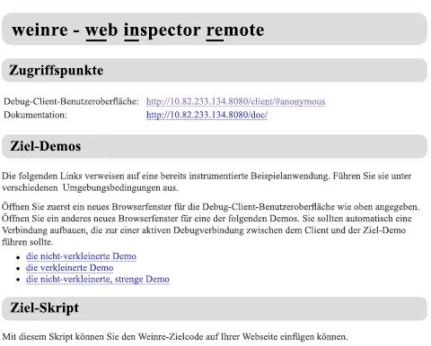
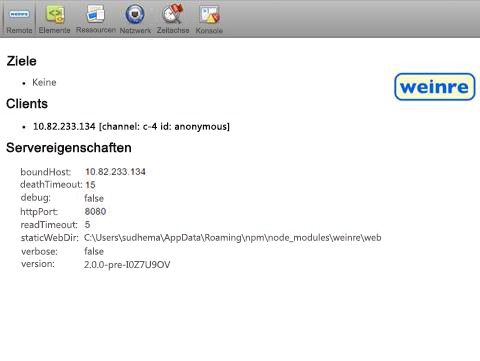
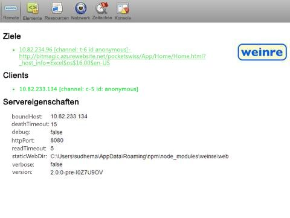
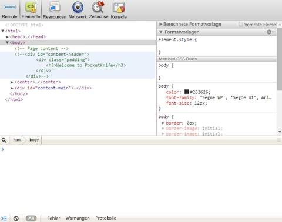

# Debuggen von Office-Add-Ins auf dem iPad und einem Mac-Computer
Debuggen Sie auf dem iPad ausgeführte Office-Office-Add-Ins mithilfe des Remotewebsite-Inspektors Weinre.

 _**Gilt für:** apps for Office | Excel | Office Add-ins | Office for iPad | Office for Mac | PowerPoint | Word_

Sie können Visual Studio für das Entwickeln und Debuggen von Add-Ins unter Windows verwenden. Sie können jedoch nicht zum Debuggen von Add-Ins auf dem iPad oder Mac verwenden. Da Add-Ins ausschließlich in HTML und JavaScript entwickelt werden, sollten sie plattformübergreifend funktionieren, aber möglicherweise gibt es subtile Unterschiede darin, wie verschiedene Browser den HTML-Code rendern. In diesem Thema wird beschrieben, wie Sie Add-Ins debuggen, die auf dem iPad oder Mac ausgeführt werden.

 >**Hinweis**  Es wird empfohlen, weiterhin Visual Studio zum Debuggen von Add-Ins unter Windows zu verwenden.


## Debuggen mit Weinre

Weinre ist ein Debugger für Webseiten, ähnlich wie die F12-Tools, der auf das Remotearbeiten ausgelegt ist und Ihnen das Debuggen von Webseiten auf einem mobilen Gerät ermöglicht. Weitere Informationen finden Sie auf der [Weinre-Website](http://people.apache.org/~pmuellr/weinre-docs/latest/).


 >**Hinweis**  Sie können das Remotedebuggen auf dem Mac oder iPad verwenden.


### Verwenden von Weinre zum Debuggen von Add-Ins


1. Installieren Sie die neueste Version von Node.js von [https://nodejs.org/](https://nodejs.org/) auf Ihrem Windows- oder Mac-Computer.
    
2. Installieren Sie Weinre über den folgenden npm-Befehl: `npm -g install weinre`
    
    Bei der Installation auf einem Mac müssen Sie möglicherweise Folgendes verwenden:  `sudo npm -g install weinre`
    
    Wenn beim obigen Befehl ein Fehler auftritt, installieren Sie direkt über eine URL:  `npm -g install http://people.apache.org/~pmuellr/weinre/builds/2.0.0-pre-I0Z7U9OV/apache-cordova-weinre-2.0.0-pre-I0Z7U9OV-bin.tar.gz`
    
3. Um sicherzustellen, dass IIS, Apache oder der Webserver Ihrer Wahl auf Ihrem Computer ausgeführt wird, überprüfen Sie, ob  `http://localhost` eine gültige Seite zurückgibt.
    
4. Starten Sie Weinre:  `weinre --httpPort 8080 --boundHost <ipaddr>`, wobei  _ _&lt;ipaddr&gt;__ die IP-Adresse Ihres PCs oder Macs ist.
    
      1. Navigieren Sie zu  `http://<ipaddr>:8080`, um auf die Weinre-Serverstartseite zuzugreifen.
    
    



    
  2. Navigieren Sie zu  `http://<ipaddr>:8080/client`, um die Liste der Clients abzurufen, die mit diesem Server verbunden sind.
    
    



    
5. Um das Debuggen zu starten, fügen Sie Folgendes in das  `<head>`-Tag der Add-In-Webseite ein, um auf den Weinre-Zielcode zu verweisen:
    
  ```HTML
  <script src="http://<ipaddr>:8080/target/target-script-min.js#anonymous"></script>
  ```


    Starten Sie Ihr Add-In auf dem iPad oder Mac-Computer:
    
    



    
6. Debuggen Sie Ihr Add-In mithilfe der F12-Entwicklertools Ihres bevorzugten Browsers.
    
    



    

## Zusätzliche Ressourcen


- [Ihr Office-Add-In für iPad verfügbar machen](8ddc78f6-5746-412e-9921-182fc159e5e2.md)
    
- [Querladen eines Office-Add-Ins auf einem iPad und einem Mac-Computer](../testing/sideload-an-office-add-in-on-ipad-and-mac.md)
    
