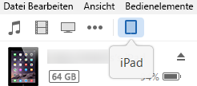
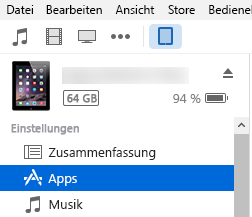
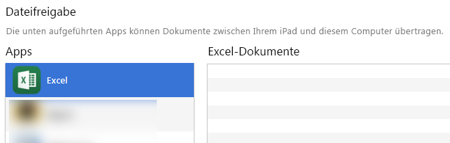
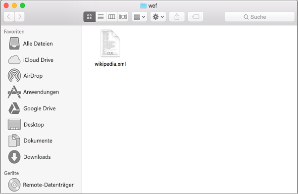
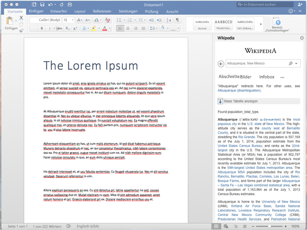

# Querladen eines Office-Add-Ins auf einem iPad und einem Mac-Computer
Laden Sie Ihre Office-Add-In quer auf ein iPad, um zu testen, wie es in Office für iOS oder Office für Mac ausgeführt wird.

 _**Gilt für:** apps for Office | Excel | Office Add-ins | Office for iPad | Office for Mac | PowerPoint | Word_

Wenn Sie sehen möchten, wie Ihr Add-In in Office für iOS ausgeführt wird, können Sie das Manifest Ihres Add-Ins mithilfe von iTunes auf ein iPad querladen. Dies ermöglicht Ihnen zwar nicht, Haltepunkte festzulegen und den Code Ihres Add-Ins während der Ausführung zu debuggen, aber Sie können sehen, wie sich das Add-In verhält, und überprüfen, ob die Benutzeroberfläche nutzbar ist und ordnungsgemäß gerendert wird.

## Erforderliche Komponenten für Office für iOS

- Ein Windows- oder Mac-Computer, auf dem [iTunes](http://www.apple.com/itunes/download/) installiert ist
    
- Ein iPad mit iOS 8.2 oder höher, auf dem [Excel für iPad](https://itunes.apple.com/us/app/microsoft-excel/id586683407?mt=8) installiert ist, und ein Sync-Kabel
    
- Die Manifest-XML-Datei für das Add-In, das Sie testen möchten
    

## Erforderliche Komponenten für Office für Mac

- Ein Mac mit OS X v10.10 "Yosemite" oder höher, auf dem [Office für Mac](https://products.office.com/de-de/buy/compare-microsoft-office-products?tab=omac) instaliert ist.
    
- Word für Mac Version 15.18 (160109).
    
- Excel für Mac Version 15.19 (160206).
    
- Die Manifest-XML-Datei für das Add-In, das Sie testen möchten
    

## Querladen eines Add-Ins in Excel oder Word für iPad

1. Verwenden Sie Sync-Kabel, um Ihr iPad mit Ihrem Computer zu verbinden. Wenn Sie das iPad zum ersten Mal mit dem Computer verbinden, wird die Eingabeaufforderung  **Diesem Computer vertrauen?** angezeigt. Wählen Sie **Vertrauen** aus, um fortzufahren.
    
2. Wählen Sie in iTunes das  **iPad**-Symbol unter der Menüleiste aus.
    
    

3. Klicken Sie unter  **Einstellungen** auf der linken Seite von iTunes auf **Apps**.
    
    

4. Blättern Sie auf der rechten Seite von iTunes hinunter zu  **Dateifreigabe**, und wählen Sie dann  **Excel** oder **Word** in der Spalte **Add-Ins** aus.
    
    

5. Klicken Sie am unteren Rand der Spalte  **Excel**oder  **Word-Dokumente** auf **Datei hinzufügen**, und wählen Sie dann die Manifest-XML-Datei des Add-Ins aus, das Sie querladen möchten.
    
6. Öffnen Sie die Excel- oder Word-App auf Ihrem iPad. Wenn die Excel- oder Word-App bereits ausgeführt wird, wählen Sie die Schaltfläche  **Start**, schließen Sie die App, und starten Sie sie neu.
    
7. Öffnen Sie ein Dokument.
    
8. Wählen Sie  **Add-Ins** auf der Registerkarte **Einfügen** aus. Ihr quergeladenes Add-In steht unter der Überschrift **Entwickler** in der Benutzeroberfläche **Add-Ins** zum Einfügen bereit.
    
    

## Querladen eines Add-Ins in Office für Mac

1.  Öffnen Sie **Terminal**, und navigieren Sie zu einem der folgenden Ordner, in dem Sie die Manifestdatei von Add-In speichern. Wenn der Ordner  `wef` auf dem Computer nicht vorhanden sind, erstellen Sie ihn.
    
      - Für Word:  `/Users/<username>/Library/Containers/com.microsoft.Word/Data/documents/wef`
    
  - Für Excel:  `/Users/<username>/Library/Containers/com.microsoft.Excel/Data/documents/wef`
    
2. Öffnen Sie den Ordner im  **Finder** mithilfe des Befehls `open .` (einschließlich des Punkts). Kopieren Sie die Manifestdatei Ihres Add-Ins in diesen Ordner.
    
    

3. Öffnen Sie Word, und öffnen Sie dann ein Dokument. Starten Sie, wenn nichts bereits ausgeführt, Word neu.
    
4. Wählen Sie in Word die Option  **Einfügen** > **Add-Ins** > **Meine Add-Ins** aus, und wählen Sie dann Ihr Add-In aus.
    
    
    
     >**Hinweis**  Die Optionen für den  **Speicher** und zum Anzeigen aller Elemente sind im Office für Mac (Vorschau) weiterhin nicht verfügbar.
5. Überprüfen Sie, ob Ihr Add-In im Word angezeigt wird.
    
    

## Bekannte Probleme in Office für Mac

- Word stürzt ab, wenn  **getFileAsync** aufgerufen wird.
    
- Ihr Add-In kann keine Aufrufe an die JavaScript-API für Office ausführen, wenn ein Popup angezeigt wird. Sie müssen das Popup schließen, damit Ihr Add-In das Ausführen von Aufrufen an die JavaScript-API für Office fortsetzen kann.
    

## Zusätzliche Ressourcen

- [Ihr Office-Add-In für iPad verfügbar machen](8ddc78f6-5746-412e-9921-182fc159e5e2.md)
    
- [Debuggen von Office-Add-Ins auf dem iPad und einem Mac-Computer](../../docs/testing/debug-office-add-ins-on-ipad-and-mac.md)
    
