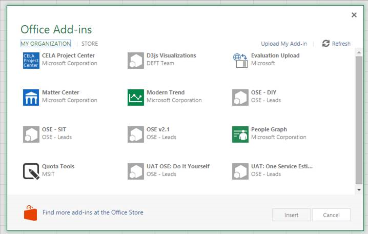
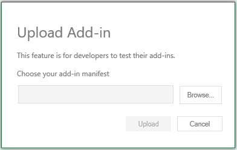
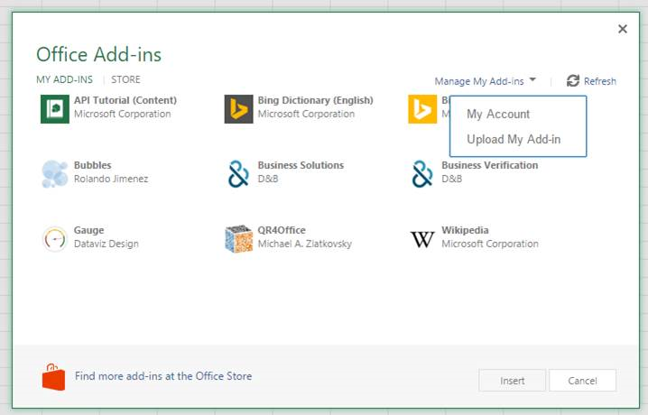

# Sideload Office Add-ins for testing
Use sideloading to quickly install an Office-Add-In, on Office Online or Office 365, without having to first put it in an add-in catalog.

 _**Gilt für:** apps for Office | Office Add-ins_

Developers can install an Office-Add-In for testing without having to first put it in an add-in catalog by using sideloading. Sideloading can be done on either Office 365 or Office Online. The procedure is slightly different for the two platforms. See the sections below.

When you sideload an add-in, the add-in manifest is stored in the browser's local storage, so if you clear the browser's cache, or switch to a different browser, you have to sideload the add-in again.

 >**Hinweis**  Sideloading as described in this article is supported on Word, Excel, and PowerPoint. To sideload an Outlook add-in, see [Sideloading von Outlook-Add-Ins zu Testzwecken]().

## Sideload an Office-Add-In on Office 365

1. Navigate to your Office 365 account, and login.
    
2. Open the App Launcher on the left end of the toolbar and select  **Excel**,  **Word**, or  **PowerPoint**; and then create a new document.
    
3. Open the  **Insert** tab on the ribbon and, in the **Add-ins** section, choose **Office Add-ins**.
    
4. On the  **Office Add-ins** dialog, select the **MY ORGANIZATION** tab, and then **Upload My Add-in**.
    
    

5.  **Browse** to the add-in manifest file, and then select **Upload**.
    
    

6. Verify that your Add-In is installed. For example, if it is an add-in command, it should appear on either the ribbon or the context menu. If it is a task pane add-in the pane should appear.
    

## Sideload an Office-Add-In on Microsoft Office Online

1. Open [Microsoft Office Online](https://office.live.com/).
    
2. In  **Get started with the online apps now**, choose  **Excel**,  **Word**, or  **PowerPoint**; and then open a new document.
    
3. Open the  **Insert** tab on the ribbon and, in the **Add-ins** section, choose **Office Add-ins**.
    
4. On the  **Office Add-ins** dialog, select the **MY ADD-INS** tab, choose **Manage My Add-ins**, and then  **Upload My Add-in**.
    
    

5.  **Browse** to the add-in manifest file, and then select **Upload**.
    
    

6. Verify that your Add-In is installed. For example, if it is an add-in command, it should appear on either the ribbon or the context menu. If it is a task pane add-in the pane should appear.
    

## Nächste Schritte

[Testing and troubleshooting](../../docs/testing/testing-and-troubleshooting.md)

## Zusätzliche Ressourcen

- [Office-Add-Ins](../../docs/overview/office-add-ins.md)
    
- [Entwicklungslebenszyklus von Office-Add-Ins](../../docs/design/add-in-development-lifecycle.md)
    
